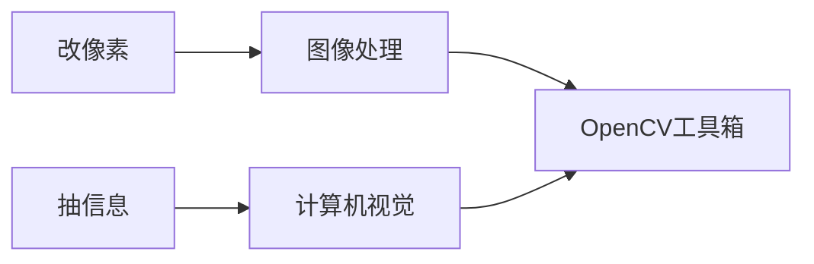
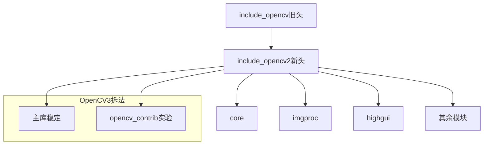
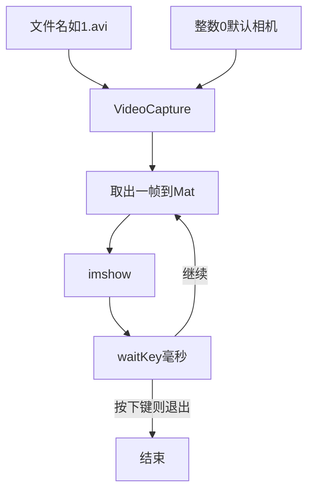

# 第一章 邂逅 OpenCV

来源：《OpenCV3编程入门》（毛星云等，电子工业出版社，2015）

## 本章总览

这一章是“先认路，再摸一手”。先把图像处理、计算机视觉、OpenCV 三个词分清，再看库怎么拆成模块、3.x 相对 2.x 改了什么；然后用最短路径走通：读一张图、做腐蚀/模糊/找边缘、读视频文件、打开摄像头。配置演示版本是 OpenCV 2.4.9，正文对照到 2014 年 8 月的 OpenCV 3.0 Alpha。学完应能回答：OpenCV 是干什么的、模块大概怎么分、读图和读视频分别调用谁。下面用流程图把这条线串起来。

## 核心知识点

### 图像处理、计算机视觉与 OpenCV

**图像处理**：用计算机改图像本身。对象是像素排成的二维数组（数字图像）。常见事：压缩、增强与复原、去噪、分割、特征抽取。目标是“图变得更好用或更好看”。

**计算机视觉**：研究怎样让机器“看见”——用相机加计算机代替人眼去做识别、跟踪、测量。目标是从图像或多维数据里抽出**信息**，模拟人的视觉理解。

**OpenCV**（Open Source Computer Vision Library）：开源、跨平台的视觉算法库，同时覆盖“改图”和“理解图”两边的常用算法。1999 年由 Intel 发起；书中写当时由 Willow Garage 支持。本体是 C 函数 + C++ 类，强调轻量和速度，能吃多核；另有 Python、MATLAB 等接口。

一句话：图像处理管像素怎么变，计算机视觉管从图里读出什么意思，OpenCV 是把两边常用算法打包好的工具箱。



### OpenCV 是什么、从哪来

设计目标很明确：**快、能实时**。官方说法是搭一个好用的视觉框架，让人少重复造轮子。不强制依赖其他库，但需要时可以用外部库。内含机器学习库 **MLL**（统计模式识别、聚类），不只服务视觉。

三个起步动机（书中原意转述）：

1. 提供开放、优化过的基础视觉代码，避免各做各的。
2. 代码可读、可改，方便大家站在同一套框架上往上长。
3. 许可证允许商用产品不必开源，方便落地。

版本节点（本书记录）：2000 预览版；2006 的 1.0；2009 年 10 月的 2.0（C++ 接口、更安全的用法、多核优化）；大约半年一个正式版；2012 年 8 月起由非营利组织 OpenCV.org 支持；2014-08-21 发布 OpenCV 3.0 Alpha。书中例程以 2.4.9 写起，修订时补 3.0，**示例优先用 3 的写法，差别大的地方对照 2**。

应用面很宽：工厂检测、医学影像、安防监控、相机标定与立体视觉、机器人、卫星图拼接、无人机/自动驾驶等。书还强调 C 实现效率高，可移植到 DSP、单片机一类环境。

书中给出的站点（2015 年写法，地址可能已变）：opencv.org；GitHub 仍写 Itseez/opencv。

### 模块怎么拆

安装目录里有两套头：

- `include/opencv`：OpenCV 1.x 留下来的旧头（`cv.h`、`cxcore.h`、`highgui.h` 等）。
- `include/opencv2`：2/3 时代按模块分的新头。`opencv.hpp` 可一次引入常用模块；`opencv_modules.hpp` 用 `HAVE_OPENCV_*` 宏标明当前编译进了哪些模块。

本章按 2.4.9 的 `opencv2` 目录扫过的模块（职责一句话）：

| 模块 | 通俗理解 |
|---|---|
| core | 数据结构和底层数组/绘图/系统辅助 |
| imgproc | 滤波、几何变换、直方图、形状、特征与检测等“改图”主力 |
| highgui | 读图读视频、窗口、滑动条、鼠标 |
| features2d | 特征点检测、描述、匹配 |
| flann | 高维近邻搜索与聚类 |
| calib3d | 标定、立体、三维重建 |
| video | 运动估计、背景减除、跟踪 |
| ml | 统计学习与分类 |
| objdetect | 级联分类、Latent SVM 等目标检测 |
| photo | 修复、去噪 |
| stitching | 拼接流水线 |
| gpu / ocl | GPU / OpenCL 加速 |
| contrib | 当时还不稳的新东西 |
| legacy | 为兼容留下的旧代码 |
| nonfree | 带专利的算法，书明确**最好不要商用** |
| superres / videostab / ts | 超分、稳像、测试（后两者书说一般可忽略） |

OpenCV 3 为了给主库“减负”，改成**内核 + 插件**：稳定代码在主仓库，实验/新算法进 **opencv_contrib**。编译 contrib 要用 CMake 变量 `OPENCV_EXTRA_MODULES_PATH`。主库 API 相对稳，contrib 可能变。



### OpenCV3 相对 2 改了什么（本章提到的）

不是功能清单变长那么简单，而是项目拆法变了。写 2.x 代码到 3.x 上，本章点到这些现象：

- 很多宏去掉 `CV_`，或换成更清楚的前缀。例如：`CV_WINDOW_AUTOSIZE` → `WINDOW_AUTOSIZE`；`CV_BGR2HSV` → `COLOR_BGR2HSV`；`CV_MOP_OPEN` → `MORPH_OPEN`。
- `vector` 不再跟着头文件自动进 `std`，要自己写 `std::vector` 或 `using namespace std`。
- 头路径缩短：`opencv2/core/core.hpp` → `opencv2/core.hpp`。
- 个别旧写法：`cvSize` → `Size`，`CV_RGB` → `Scalar`。
- 实在要兼容旧 `CV_` 宏，书提到可临时包含 `cv.h`。

颜色空间转换本章上手例里已经用到对照：

```cpp
cvtColor(srcImage, grayImage, COLOR_BGR2GRAY);  // OpenCV 3
// OpenCV 2 常见写法：CV_BGR2GRAY
```

`cvtColor` 四个参数：输入图、输出图、转换代号、目标通道数（本章例未传第 4 个，走默认）。

【第4章回填】完整说明见 `第四章.md` 的 `cvtColor` 节。这里只补第一章缺的部分。

| 名称 | 第4章补全 |
|---|---|
| `cvtColor(src, dst, code, dstCn=0)` | 原型四个参数。`dstCn=0` 时书称目标通道数自动跟源图走。 |
| `COLOR_*` vs `CV_*` | OpenCV3 用 `COLOR_BGR2GRAY` 这类；OpenCV2 用 `CV_BGR2GRAY`。表 4.1 / 4.2 按族列出 RGB↔BGR、Gray、HSV、HLS、Lab、Luv、XYZ、YCrCb/YUV、Bayer、YUV420、565/555。 |
| 通道顺序 | 默认 **BGR**。`COLOR_GRAY2BGR` 是灰度→三通道，不是转灰度。 |

### 读图、显示、等按键

新版本里图像装在 **`Mat`** 里（可以把它想成“带尺寸和类型的像素盒子”）。最短路径三步：读进 `Mat` → 开窗口显示 → 等按键，否则窗口闪一下就关。

【第4章回填】完整说明见 `第四章.md`。这里只补第一章「像素盒子」没展开的部分。

| 名称 | 第4章补全 |
|---|---|
| 结构 | 小头（尺寸、类型、地址）+ 指向像素的指针。赋值和拷贝构造只拷头，多份 `Mat` 可共享同一块像素。 |
| 深拷贝 | 要独立副本用 `clone()` 或 `copyTo()`。ROI 可用 `Mat(A, Rect(...))` 或 `A(Range::all(), Range(a,b))`。 |
| 类型码 | `CV_[位数][S/U][前缀]C[通道数]`，如 `CV_8UC3`。 |
| 常用造法 | `Mat(rows, cols, type, Scalar)`；`create()`（不能设初值）；`Mat::zeros` / `ones` / `eye`。空白画布常用 `zeros`。 |

```cpp
Mat srcImage = imread("1.jpg");
imshow("【原始图】", srcImage);
waitKey(0);
```

| 名称 | 作用（本章用法） |
|---|---|
| `imread("1.jpg")` | 从文件读图到 `Mat`。文件要放在工程目录，名字对得上。 |
| `imshow(窗口名, 图)` | 在指定标题的窗口里显示这张 `Mat`。 |
| `waitKey(0)` | 一直等到有键按下。参数是毫秒；`0` 表示无限等。 |

【第3章回填】完整参数表见 `第三章.md`。这里只补第一章三件套缺的部分。

| 名称 | 第3章补全 |
|---|---|
| `imread(filename, flags=1)` | `flags>0` 三通道彩色，`=0` 灰度，`<0` 含 Alpha。整数 `-1/0/1/2/4` 对应 UNCHANGED/GRAYSCALE/COLOR/ANYDEPTH/ANYCOLOR；冲突取较小值；尽量无损用 `2\|4`。OpenCV3 里 `CV_LOAD_IMAGE_*` 宏可能失效。彩色通道顺序为 **BGR**。默认不带 Alpha。 |
| `imshow(winname, mat)` | 按深度缩放再显示：8U 原样；16U/32S ÷256；32F ×255（把 `[0,1]` 映到 `[0,255]`）。窗口默认 `WINDOW_AUTOSIZE` 时按原尺寸。 |
| `waitKey` | 第3章仍无完整函数原型。补充用法：`waitKey(0)` 静等；循环里 `waitKey(10)==27` 表示 ESC。无参 `waitKey()` 书未解释默认值。【信息缺口：返回值完整约定未在第3章写出。】 |

总头文件用 `#include <opencv2/opencv.hpp>`，并 `using namespace cv;`。


### 腐蚀：让亮的区域被暗的“吃掉”

腐蚀是最基本的形态学操作之一。白话：用结构元在图上走，亮区域会被暗区域啃掉一圈，细的亮线、毛刺容易没。

本章调用两步：先做结构元，再腐蚀。

```cpp
Mat element = getStructuringElement(MORPH_RECT, Size(15, 15));
erode(srcImage, dstImage, element);
```

| 名称 | 作用（本章用法） |
|---|---|
| `getStructuringElement` | 按形状和尺寸生成结构元（核）。本章用矩形 `MORPH_RECT`，大小 `15×15`。 |
| `erode(输入, 输出, 结构元)` | 用该核对输入做腐蚀，结果写入输出。 |

处理函数在 `imgproc`，显示仍走 `highgui`。

【第6章回填】完整说明见 `第六章.md` 的形态学节。这里只补第一章缺的部分。

| 名称 | 第6章补全 |
|---|---|
| `erode(src, dst, kernel, anchor=Point(-1,-1), iterations=1, borderType=BORDER_CONSTANT, borderValue=morphologyDefaultBorderValue())` | 七个参数。日常只传前三个。深度：`CV_8U` / `16U` / `16S` / `32F` / `64F`。`kernel` 为 `NULL` 时默认中心锚点的 `3×3` 矩形。支持原地。内部走 `morphOp(MORPH_ERODE)`。 |
| `getStructuringElement` | 造结构元。形状：`MORPH_RECT` 矩形、`MORPH_CROSS` 十字、`MORPH_ELLIPSE` 椭圆。尺寸写成 `Size`；锚点默认 `Point(-1,-1)` 表示中心。十字形状完全由锚点位置决定。第一章 `MORPH_RECT` + `Size(15, 15)` 就是本章最常见写法。 |

三个见面礼长什么样，看自制示意（不是书里的插图）：左起原图、腐蚀后变瘦、均值后变糊、Canny 只剩描边。


### 模糊：用邻域平均抹平细节

本章的“图像模糊”就是**均值滤波**：每个像素被周围一块区域的平均值替换，块越大越糊。

```cpp
blur(srcImage, dstImage, Size(7, 7));
```

| 参数 | 本章含义 |
|---|---|
| 第一个 | 输入图 |
| 第二个 | 输出图 |
| `Size(7, 7)` | 平均窗口宽高。数越大，糊得越狠。 |

【第6章回填】完整说明见 `第六章.md` 的线性滤波节。这里只补第一章均值滤波缺的部分，不展开高斯 / 中值。

| 名称 | 第6章补全 |
|---|---|
| `blur(src, dst, ksize, anchor=Point(-1,-1), borderType=BORDER_DEFAULT)` | 五个参数。日常只传前三个。深度：`CV_8U` / `16U` / `16S` / `32F` / `64F`。通道各自平均。 |
| 与 `boxFilter` | `blur` 内部就是 `boxFilter`，且 `normalize=true`（按窗口面积归一化）。`normalize=false` 是窗口求和，不是更糊的均值。 |
| `Size(7, 7)` | 对应原型里的 `ksize`。第一章见面礼就是 `ksize=Size(7,7)` 的三参数写法。 |

### Canny：先降噪，再描边缘

本章给的流程：读图 → 转灰度 → `blur` 降噪 → `Canny` → 显示。边缘对噪声敏感，所以先糊一下再找边。

```cpp
cvtColor(srcImage, grayImage, COLOR_BGR2GRAY);
blur(grayImage, edge, Size(3, 3));
Canny(edge, edge, 3, 9, 3);
```

摄像头实时版（本章后半）参数不同，但步骤一样：

```cpp
cvtColor(frame, edges, CV_BGR2GRAY);   // 本章视频例仍写 CV_ 前缀
blur(edges, edges, Size(7, 7));
Canny(edges, edges, 0, 30, 3);
```

`Canny` 本章写出的五个实参：输入、输出、**低阈值**、**高阈值**、**算梯度用的 Sobel 孔径**。两套数字（`3,9,3` 与 `0,30,3`）都来自本章例程，完整参数表要到后文边缘检测专章。【信息缺口：第一章未给出完整函数原型】


静图例用 `Canny(..., 3, 9, 3)`，摄像头例用 `Canny(..., 0, 30, 3)`，步骤同一张图。

### 视频：一串连续的 `Mat`

`VideoCapture` 是 OpenCV 2.x 起用来读视频文件或摄像头的 C++ 类（对应更早的 C 结构 `CvCapture`）。视频没有魔法：循环里每次取出一帧 `Mat`，显示，再短暂停一下，眼睛就看成动画。

读文件：

```cpp
VideoCapture capture("1.avi");
// 或先构造再打开：VideoCapture capture; capture.open("1.avi");
Mat frame;
capture >> frame;          // 取出当前帧
imshow("读取视频", frame);
waitKey(30);               // 等 30 毫秒，既刷新窗口也控制节奏
```

读默认摄像头：把文件名换成整数 `0`。

```cpp
VideoCapture capture(0);
// 或 capture.open(0);
```

后面的取帧、`imshow`、`waitKey(30)` 与读文件同一套。本章还把摄像头帧接上灰度、模糊、Canny，得到实时边缘视频；`waitKey(30) >= 0` 时按任意键退出循环。



## 容易混淆的点

- **图像处理 vs 计算机视觉**：前者改像素、让图更好用；后者从图里抽取信息、模仿“看懂”。OpenCV 两边都做。
- **OpenCV vs OpenAL vs OpenGL**：章首导读把三者辨析列为学习目标。【信息缺口：第一章已读正文未见三者对照段落，所以这里不编造定义。】
- **旧头 `opencv` vs 新头 `opencv2`**：前者是 1.x 遗留；日常用后者。3.x 再拆成主库（稳）和 `opencv_contrib`（实验）。
- **`COLOR_BGR2GRAY` vs `CV_BGR2GRAY`**：3 推荐 `COLOR_`；本章静图例用新名，摄像头例仍写 `CV_`。同一本书两种写法并存，按你链接的库版本选能编过的那个。
- **`waitKey(0)` vs `waitKey(30)`**：`0` 卡死等按键，适合看静图；正数是等这么多毫秒，适合视频刷新。循环里若不调用 `waitKey`，窗口往往不更新。
- **Debug 的 `*d.lib` vs Release 的无 `d`**：图路径对但仍加载失败时，书把原因归到 Debug/Release 和库文件是否带 `d` 对不上。这是配置现象，不是算法问题。
- **include 目录**：必须用 `opencv/build/include`，不要用源码树根上的 include。库的 x86/x64 跟**编译器位数**走，不是跟操作系统位数走。

## 本章要点总结

- OpenCV = 开源跨平台视觉库；图像处理改图，计算机视觉从图里取信息。
- 1999 Intel 起步，2.0 引入 C++ 接口，3.0 把实验代码拆到 contrib；本书双版本，例程偏 3 的写法。
- 常用模块：core 装数据，imgproc 改图，highgui 负责窗口和读写，video 管运动与采集。
- 静图最短链：`imread` → `imshow` → `waitKey(0)`，数据在 `Mat` 里。
- 三个见面礼：`erode` + 结构元；`blur` + `Size`；Canny 前先灰度再模糊。
- 找边缘的本章顺序：先转灰度，再模糊降噪，最后 `Canny`。
- 视频/摄像头都是 `VideoCapture`：文件名读文件，`0` 读默认相机，循环里 `>>` 取帧，`waitKey(毫秒)` 控速。
- 升级 2→3：宏改名、自己写 `std`、头文件路径变短；`nonfree` 有专利，书说不要商用。
