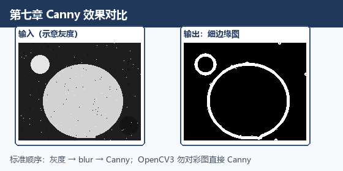
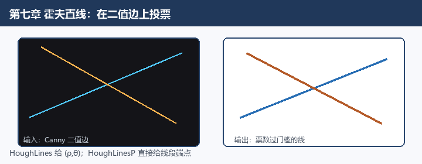
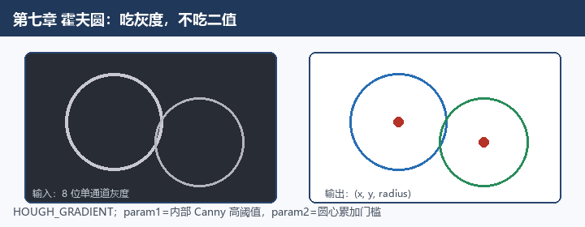

# 第七章 图像变换

来源：《OpenCV3编程入门》（毛星云等，电子工业出版社，2015）
范围：书页 247–301（PDF 264–318）。未读第8章（书页 303 / PDF 320 起）。

## 本章总览

第六章把图画得更干净、更黑白；这一章改的是“图长什么样、边在哪、线圆怎么抽、像素往哪搬、对比度怎么拉开”。章首把图像变换说成：把图像换成另一种数据表示（书拿傅里叶变换当比方：还是存在图像结构里，像素含义却变成了频谱）。

学完应能回答：边缘三步是什么、`Canny` 双阈值怎么卡、为什么霍夫线要二值而霍夫圆要灰度、`remap` 的两张映射表怎么填、三个点为什么能定一张仿射矩阵、均衡化为什么会引出假轮廓。

本章实际展开的五块是：

- 基于 OpenCV 的边缘检测
- 霍夫变换
- 重映射
- 仿射变换
- 直方图均衡化


本章示例程序编号 56–68。

## 核心知识点

### 边缘检测的一般步骤

边缘算法吃的是灰度的一阶、二阶导数，对噪声特别敏感。书把通用流程写成三步：

1. 滤波：先降噪，常用高斯，把离散高斯核铺到灰度矩阵上。
2. 增强：看邻域灰度变得猛不猛，编程里就是算梯度幅值。
3. 检测：增强之后很多点梯度都高，真正要的边还得再筛，最常用的是阈值化。

Laplacian、Sobel、Scharr 带方向，示例一般会分别给 X 方向、Y 方向，再合成一张总图。

🔑 关键速记：边缘三步 = 滤波 → 算梯度增强 → 阈值检测。

### Canny：多级最优边缘

John F. Canny 1986 年提出。书称它是当时公认比较“最优”的边缘算法，评判三条：

- 低错误率：真边尽量抓住，噪声尽量别当成边
- 高定位性：检出的点尽量贴真实边缘中心
- 最小响应：一条边只标一次，噪声别冒充边

内部四步：

1. 去噪：常用 5×5 高斯核（书给了一张系数和为 159 的整数核，再除以 159）。
2. 算梯度幅值和方向：跟 Sobel 同一套 3×3 核，得到 \(G_x\)、\(G_y\)，再
   \[
   G=\sqrt{G_x^2+G_y^2},\quad
   \theta=\arctan(G_y/G_x)
   \]
   方向通常只归到 \(0^\circ,45^\circ,90^\circ,135^\circ\) 四档。
3. 非极大值抑制：不是局部梯度最大的点丢掉，边被削成细线。
4. 滞后阈值（双阈值）：
   - 高于高阈值：确定是边
   - 低于低阈值：丢掉
   - 夹在中间：只有连着“确定边”才留下

推荐高低阈值比在 2:1 到 3:1。两个门槛里，较小的负责把边连起来，较大的负责先圈出强边。


```cpp
void Canny(InputArray image, OutputArray edges,
           double threshold1, double threshold2,
           int apertureSize=3, bool L2gradient=false);
```

下表对照双阈值与孔径。

| 参数 | 含义 | 约束&坑点 |
|---|---|---|
| `image` | 输入图 | 必须 8 位单通道 |
| `edges` | 输出边缘图 | 与输入同尺寸、同类型 |
| `threshold1` | 滞后阈值之一（低） | 较小者用于连接弱边 |
| `threshold2` | 滞后阈值之一（高） | 较大者控制强边初检 |
| `apertureSize` | 内部 Sobel 孔径 | 默认 3 |
| `L2gradient` | 是否用更精确的 L2 范数算梯度幅值 | 默认 `false` |

要点：调用形态 `Canny(edge, edge, 3, 9, 3);` —— 低 3、高 9（正好 3:1）、孔径 3。这组数字和第一章静图例一致。

书给了两种用法：

- 简写：直接对读进来的图 `Canny(src, src, 3, 9, 3)`。书称 OpenCV2 能跑，OpenCV3 不再适用/不推荐。
- 标准做法：克隆原图 → `cvtColor(..., COLOR_BGR2GRAY)` → `blur(..., Size(3,3))` → `Canny(edge, edge, 3, 9, 3)` → 目标图先涂黑 → `src.copyTo(dst, edge)`，用边缘当掩膜把原色彩只留在边上。

综合示例 60：低阈值可调（0–120），高阈值固定为低阈值 × 3。低阈值太小会把水面纹理也描成边；门槛抬高后，人影和码头木板一类主体边才干净。




🔑 关键速记：输入须 8 位单通道；高低比建议 2:1～3:1；OpenCV3 勿对彩图直接 Canny。

### Sobel：一阶导数，顺带糊一点

离散微分算子，高斯平滑和求导绑在一起，得到灰度函数梯度的近似（向量或其模）。对噪声比纯导数稳一点。

先分别卷积：

\[
G_x=\begin{bmatrix}-1&0&+1\\-2&0&+2\\-1&0&+1\end{bmatrix}*I,\quad
G_y=\begin{bmatrix}-1&-2&-1\\0&0&0\\+1&+2&+1\end{bmatrix}*I
\]

合成幅值可以是 \(\sqrt{G_x^2+G_y^2}\)，也可以偷懒写成 \(|G_x|+|G_y|\)。

```cpp
void Sobel(InputArray src, OutputArray dst, int ddepth,
           int dx, int dy, int ksize=3,
           double scale=1, double delta=0,
           int borderType=BORDER_DEFAULT);
```

下表对照导数阶数与核边长。

| 参数 | 含义 | 约束&坑点 |
|---|---|---|
| `src` / `dst` | 输入 / 输出 | `dst` 与源同尺寸、同通道数 |
| `ddepth` | 输出深度 | 见下表；日常求导先写成 `CV_16S` 防溢出 |
| `dx` / `dy` | x / y 方向导数阶数 | 常见：X 用 `1,0`；Y 用 `0,1` |
| `ksize` | Sobel 核边长 | 必须是 1、3、5 或 7；默认 3 |
| `scale` | 导数结果再乘的系数 | 默认 1 |
| `delta` | 写入 `dst` 前再加的偏置 | 默认 0 |
| `borderType` | 越界怎么外推 | 默认 `BORDER_DEFAULT` |

`src.depth()` 与 `ddepth` 的合法组合（书页 254）：

| `src.depth()` | 允许的 `ddepth` |
|---|---|
| `CV_8U` | `-1` / `CV_16S` / `CV_32F` / `CV_64F` |
| `CV_16U` / `CV_16S` | `-1` / `CV_32F` / `CV_64F` |
| `CV_32F` | `-1` / `CV_32F` / `CV_64F` |
| `CV_64F` | `-1` / `CV_64F` |

要点：`ksize=1` 时用 3×1 或 1×3 核，不做高斯平滑。3×3 核只是导数的近似，误差不小，所以书在 Sobel 节就先把 Scharr 核亮出来。日常最常见：`xorder=1, yorder=0, ksize=3` 或反过来。

示例 57 直接对彩色图 `Sobel`，没有先转灰度。流程：X 向 `Sobel(..., CV_16S, 1, 0, 3, 1, 1, BORDER_DEFAULT)` → `convertScaleAbs` 收到 8 位 → Y 向同样做一遍 → `addWeighted(abs_x, 0.5, abs_y, 0.5, 0, dst)` 合成。综合例的核边长写成 `2*滑条+1`（滑条最大 3，所以核最大 7）。

🔑 关键速记：`ksize` 只能 1/3/5/7；求导深度常用 `CV_16S` 再 `convertScaleAbs`。

### Laplacian：二阶，各向同性

\(n\) 维欧氏空间的二阶微分，等于梯度的散度。二维图像写成

\[
\mathrm{Laplace}(f)=\frac{\partial^2 f}{\partial x^2}+\frac{\partial^2 f}{\partial y^2}
\]

内部其实在调 Sobel 的二阶导再相加。小提示：原图减去自己的 Laplacian，对比度会上去。

```cpp
void Laplacian(InputArray src, OutputArray dst, int ddepth,
               int ksize=1, double scale=1, double delta=0,
               int borderType=BORDER_DEFAULT);
```

下表对照孔径必须为正奇数。

| 参数 | 含义 | 约束&坑点 |
|---|---|---|
| `src` | 输入 | 书称一般要 8 位单通道 |
| `dst` | 输出边缘图 | 与源同尺寸、同通道数 |
| `ddepth` | 输出深度 | 示例用 `CV_16S` |
| `ksize` | 算二阶导的孔径 | 正奇数，默认 1 |
| `scale` / `delta` | 缩放与偏置 | 默认 1 和 0 |
| `borderType` | 越界外推 | 默认 `BORDER_DEFAULT`；其余见 `borderInterpolate()` |

要点：`ksize>1` 就是上面那条 \(\Delta src\)。`ksize=1` 时改用固定 3×3 孔：

\[
\begin{bmatrix}0&1&0\\1&-4&1\\0&1&0\end{bmatrix}
\]

示例 58 流程：`GaussianBlur` 去噪 → `cvtColor(..., COLOR_RGB2GRAY)`（本章示例写的是 `COLOR_RGB2GRAY`）→ `Laplacian(..., CV_16S, 3, 1, 0, BORDER_DEFAULT)` → `convertScaleAbs` 再显示。

🔑 关键速记：二阶、不分工 X/Y；`ksize=1` 用中心 −4 的十字核。

### Scharr：3×3 时比 Sobel 准

书更愿意叫它滤波器而不是算子，主要是给 Sobel 当更准的 3×3 搭档：一样快，精度更高。核是

\[
G_x=\begin{bmatrix}-3&0&+3\\-10&0&+10\\-3&0&+3\end{bmatrix},\quad
G_y=\begin{bmatrix}-3&-10&-3\\0&0&0\\+3&+10&+3\end{bmatrix}
\]

```cpp
void Scharr(InputArray src, OutputArray dst, int ddepth,
            int dx, int dy,
            double scale=1, double delta=0,
            int borderType=BORDER_DEFAULT);
```

和 Sobel 几乎同一套参数，没有 `ksize`（死跟 3×3）。`scale` 的更多说明书指向 `getDerivKernels`；`borderType` 指向 `borderInterpolate`。深度组合书页 259 至少写清了：

- `src` 为 `CV_8U`：`ddepth` 可为 `-1` / `CV_16S` / `CV_32F` / `CV_64F`
- `src` 为 `CV_16U` / `CV_16S`：`ddepth` 可为 `-1` / `CV_32F` / `CV_64F`

书称下面两句等价：`Scharr(src, dst, ddepth, dx, dy, scale, delta, borderType)` 与 `Sobel(src, dst, ddepth, dx, dy, CV_SCHARR, scale, delta, borderType)`。

也就是 Sobel 的核尺寸填 `CV_SCHARR`（或 -1）就是 Scharr。示例 59 / 综合例 60 的用法与 Sobel 相同：`CV_16S` → `convertScaleAbs` → `addWeighted` 各 0.5。

🔑 关键速记：没有 `ksize`，死跟 3×3；等价于 `Sobel(..., CV_SCHARR)`。

### 霍夫变换：在参数空间里投票

从特征里认出几何形状。Paul Hough 1962 年提出，Richard Duda 与 Peter Hart 1972 年发扬。做法：把点映射到参数空间去累加，局部最大值对应“这些点像不像某条形状”。优点是对噪声和残缺不那么怕。OpenCV 里分成霍夫线和霍夫圆。

#### 线：先有二值边，再投票

输入必须是二值边缘图，前面通常接 Canny。OpenCV 三种线变换：

| 名称 | 函数 | 一句话 |
|---|---|---|
| 标准霍夫变换 SHT | `HoughLines` | 经典累加器 |
| 多尺度霍夫变换 MSHT | 也是 `HoughLines` | SHT 换尺度 |
| 累计概率霍夫变换 PPHT | `HoughLinesP` | 只抽一部分点，更快，直接给线段 |

要点：书更推荐 `HoughLinesP`：效率高，还能给出线段的方向和起止范围。

平面直线可以用斜截距 \((m,b)\)，也可以用极坐标 \((r,\theta)\)：从原点作垂线，垂足距离是 \(r\)，垂线与 \(x\) 轴正方向夹角是 \(\theta\)。霍夫用后者：

\[
r = x\cos\theta + y\sin\theta
\]

一个点 \((x_0,y_0)\) 对应参数平面里的一条正弦曲线。多条曲线交于同一 \((\theta,r)\)，这些点就共线。交得越多，这条线越“像真的”。再用累加阈值决定交多少次才算一条线。书页 270 的示意交点约为 \((0.925,\ 9.6)\)。

##### `HoughLines`

```cpp
void HoughLines(InputArray image, OutputArray lines,
                double rho, double theta, int threshold,
                double srn=0, double stn=0);
```

下表对照累加器分辨率与阈值。

| 参数 | 含义 | 约束&坑点 |
|---|---|---|
| `image` | 输入 | 8 位单通道二值，常接 Canny |
| `lines` | 检出的线 | 每条是一对 \((\rho,\theta)\)。\(\rho\)：到图像左上角原点的距离；\(\theta\)：弧度，0 表示竖线，\(\pi/2\) 表示横线 |
| `rho` | 累加器的距离分辨率（像素） | 搜索步长 |
| `theta` | 累加器的角度分辨率（弧度） | 常用 `CV_PI/180`（1°） |
| `threshold` | 累加阈值 | 票数超过才输出 |
| `srn` / `stn` | 多尺度时，细累加器用 `rho/srn`、`theta/stn` | 默认都是 0，表示经典霍夫；否则两个都要为正 |

要点：示例 61：`Canny(..., 50, 200, 3)` → `HoughLines(mid, lines, 1, CV_PI/180, 150, 0, 0)`，结果放 `vector<Vec2f>`。画线时用 \(\rho,\theta\) 反解出两个端点，再 `line(..., LINE_AA)`（OpenCV2 写成 `CV_AA`）。颜色 `Scalar(55,100,195)` 按 B,G,R。

🔑 关键速记：输入须 8 位单通道二值；输出 \((\rho,\theta)\)；`srn=stn=0` 才是经典霍夫。

##### `HoughLinesP`

```cpp
void HoughLinesP(InputArray image, OutputArray lines,
                 double rho, double theta, int threshold,
                 double minLineLength=0, double maxLineGap=0);
```

下表对照最短线段与最大断裂。

| 参数 | 含义 | 约束&坑点 |
|---|---|---|
| `image` | 输入 | 同样必须 8 位单通道二值 |
| `lines` | 检出的线段 | 每条是四元组 \((x_1,y_1,x_2,y_2)\) |
| `rho` / `theta` / `threshold` | 同标准霍夫 | |
| `minLineLength` | 最短线段 | 更短的丢掉；默认 0 |
| `maxLineGap` | 同一条线上允许的最大断裂 | 小于它就接成一段；默认 0 |

要点：示例 62：`HoughLinesP(mid, lines, 1, CV_PI/180, 80, 50, 10)`，结果放 `vector<Vec4i>`。综合示例 64 改第五个参数 `threshold`（范围 0–200，实际写成 `g_nthreshold+1`），`minLineLength=50`、`maxLineGap=10`。阈值 35 线很多，95 只剩建筑主轮廓，200 更少。画线用 `LINE_AA`。



🔑 关键速记：同样吃二值边；输出线段端点，可限最短长度和最大断裂。

#### 圆：三维参数，OpenCV 走霍夫梯度法

圆要三个数：圆心 \((x,y)\) 和半径 \(r\)。真去堆三维累加器又占内存又慢，OpenCV 用霍夫梯度法。书列了八步，压缩成白话：

1. 先做边缘（如 Canny）
2. 对每个非零边缘点用 `Sobel` 算局部梯度
3. 沿梯度方向、在给定距离范围内给二维累加器投票
4. 记下所有非零边缘点位置
5. 累加器里过门槛且是局部最大的点当候选圆心，按票数从高到低排
6. 每个候选圆心回头看那些边缘点
7. 按到圆心的距离排序，在半径范围内挑支持最多的那个半径
8. 支持够、且离已经收下的圆心够远，才留下

##### `HoughCircles`

```cpp
void HoughCircles(InputArray image, OutputArray circles, int method,
                  double dp, double minDist,
                  double param1=100, double param2=100,
                  int minRadius=0, int maxRadius=0);
```

下表对照灰度输入与两个 param。

| 参数 | 含义 | 约束&坑点 |
|---|---|---|
| `image` | 输入 | 8 位单通道灰度，不要二值。这点和线变换相反 |
| `circles` | 检出的圆 | 每个是三元浮点 \((x,y,radius)\) |
| `method` | 检测方法 | 目前只支持 `HOUGH_GRADIENT`（OpenCV2 可写 `CV_HOUGH_GRADIENT`） |
| `dp` | 累加器分辨率相对输入的倒数 | `1` 表示和原图一样；`2` 表示宽高等于原图一半 |
| `minDist` | 两个圆心最少隔多远 | 太小会在同一物体上冒出一堆圆；太大漏圆 |
| `param1` | 方法相关 | `HOUGH_GRADIENT` 时是内部 Canny 的高阈值，低阈值自动取它的一半；默认 100 |
| `param2` | 方法相关 | `HOUGH_GRADIENT` 时是圆心累加阈值；越小圆越多（假圆也多），越大越接近正圆；默认 100 |
| `minRadius` / `maxRadius` | 半径范围 | 默认 0。书称找圆心相对容易、找合适半径难；设范围能缩小搜索。都为 0 时，书称函数可能只返回圆心，半径还得另想办法 |

霍夫梯度法的三个缺点（7.2.8）：

- 用 Sobel 导数当切线，数值不稳，容易噪
- 每个非零边缘点都当候选圆心，门槛太低就很慢；同一圆心通常只留一个圆，同心圆对付不好
- 新圆心太靠近已收下的就被丢，近乎同心时往往只留较大的那个

示例 63 流程：灰度 → `GaussianBlur(..., Size(9,9), 2, 2)` → `HoughCircles(..., HOUGH_GRADIENT, 1.5, 10, 200, 100, 0, 0)`，结果放 `vector<Vec3f>`。画的时候小实心圆标圆心、再画半径圈。



🔑 关键速记：吃灰度不吃二值；`param1` 管内部 Canny 高阈值，`param2` 管圆心票数。

### 重映射：给每个目标像素指定从哪取

把源图某个位置的像素放到目标图指定位置。坐标对不上整数格时要插值。一般式：

\[
g(x,y)=f\bigl(h(x,y)\bigr)
\]

\(h\) 就是映射。水平翻转的例子：\(h(x,y)=(I.cols-x,\ y)\)。OpenCV 写成

\[
\mathrm{dst}(x,y)=\mathrm{src}\bigl(\mathrm{map\_x}(x,y),\ \mathrm{map\_y}(x,y)\bigr)
\]

不支持原地：源和目标不能是同一张图。

#### `remap`

```cpp
void remap(InputArray src, OutputArray dst,
           InputArray map1, InputArray map2,
           int interpolation,
           int borderMode=BORDER_CONSTANT,
           const Scalar& borderValue=Scalar());
```

下表对照两张映射表与插值限制。

| 参数 | 含义 | 约束&坑点 |
|---|---|---|
| `src` | 输入 | 书称需单通道 8 位或浮点 |
| `dst` | 输出 | 与源同尺寸、同类型 |
| `map1` | 映射的第一种写法：点 \((x,y)\)；或 X 值，类型 `CV_16SC2` / `CV_32FC1` / `CV_32FC2` | |
| `map2` | 由 `map1` 决定：若 `map1` 已经是点 \((x,y)\)，则本参数不用 | 【信息缺口：`map1` 只表示 X 时，`map2` 的第二种写法印在页缝，未完整读到】 |
| `interpolation` | 插值 | 见下。这里不支持 `INTER_AREA`（和 `resize` 不同）。OpenCV2 带 `CV_` 前缀 |
| `borderMode` | 越界怎么填 | 默认 `BORDER_CONSTANT` |
| `borderValue` | 常值边界时的填充色 | 默认 `Scalar()`，即 0 |

插值枚举：`INTER_NEAREST` 最近邻；`INTER_LINEAR` 双线性（默认）；`INTER_CUBIC` 4×4 双三次；`INTER_LANCZOS4` 8×8 Lanczos。

示例 65 做垂直翻转：建 `CV_32FC1` 的 `map_x`/`map_y`，对每个 \((i,j)\) 设 `map_x=i`、`map_y=rows-j`，再 `remap(src, dst, map_x, map_y, INTER_LINEAR, BORDER_CONSTANT, Scalar(0,0,0))`。

综合示例 66 用键盘切四种映射：

| 键 | 映射怎么填 | 效果（按 `dst(x,y)=src(map)` 理解） |
|---|---|---|
| `1` | 只在中心 50% 区域：`map_x=2(i-0.25W)+0.5`，`map_y` 同理；外面映到 `(0,0)` | 整幅图被收到窗口中央 |
| `2` | `map_x=i`，`map_y=rows-j` | 上下翻转 |
| `3` | `map_x=cols-i`，`map_y=j` | 左右翻转 |
| `4` | 两个都取补 | 相当于转 180° |

🔑 关键速记：`dst(x,y)=src(map_x, map_y)`；不能原地；插值里没有 `INTER_AREA`。

### 仿射变换：直线还直、平行还平行

线性变换再加平移。保住平直性和平行性（共线点的先后顺序也不乱）。常见三种：旋转、平移、缩放。用一张 2×3 矩阵 \(M=[A\ B]\)：

\[
T = A\begin{bmatrix}x\\y\end{bmatrix}+B
= M\begin{bmatrix}x\\y\\1\end{bmatrix}
= \begin{bmatrix}a_{00}x+a_{01}y+b_{00}\\ a_{10}x+a_{11}y+b_{10}\end{bmatrix}
\]

求法两种：已知三对对应点求 \(M\)；或已知 \(M\) 和原点去算新坐标。三角形映成三角形，所以三对不共线的对应点就能定 \(M\)。本章用来干活的函数主要是 `warpAffine` 和 `getRotationMatrix2D`；示例里还调用了 `getAffineTransform`。

#### `warpAffine`

```cpp
void warpAffine(InputArray src, OutputArray dst, InputArray M, Size dsize,
                int flags=INTER_LINEAR,
                int borderMode=BORDER_CONSTANT,
                const Scalar& borderValue=Scalar());
```

作用：`dst(x,y)=src(M11 x + M12 y + M13,\ M21 x + M22 y + M23)`。

下表对照 2×3 矩阵与插值标志。

| 参数 | 含义 | 约束&坑点 |
|---|---|---|
| `src` / `dst` | 输入 / 输出 | 书称 `dst` 应与源同尺寸同类型；尺寸同时由 `dsize` 指定 |
| `M` | 2×3 变换矩阵 | |
| `dsize` | 输出图尺寸 | |
| `flags` | 插值及方向标志 | 默认 `INTER_LINEAR`，见表 7.1 |
| `borderMode` / `borderValue` | 边界模式与常值 | 默认常值 0 |

表 7.1（`flags`）：`INTER_NEAREST` / `LINEAR` / `AREA` / `CUBIC` / `LANCZOS4`；另外两个带旧前缀：`CV_WARP_FILL_OUTLIERS`（填满所有输出像素，越界写成 fillval）、`CV_WARP_INVERSE_MAP`（`M` 已是从输出指回输入的逆变换；不设则函数自己求逆再插值）。

书拿 `warpAffine` 和旧函数 `cvGetQuadrangleSubPix` 对比：前者输入输出类型要一致、开销更大（小图不划算），但输出可以有一部分保持不动；后者能把 8 位图里的四边形精确抽到浮点缓冲，开销小，但总会改完整张输出。

🔑 关键速记：吃 2×3 矩阵；直线还直、平行还平行；插值表里有 `INTER_AREA`。

#### `getRotationMatrix2D`

```cpp
Mat getRotationMatrix2D(Point2f center, double angle, double scale);
```

下表对照旋转中心、正负角与缩放。

| 参数 | 含义 |
|---|---|
| `center` | 旋转中心（源图坐标） |
| `angle` | 角度；正值逆时针（原点在左上） |
| `scale` | 各向同性缩放 |

算出的 2×3 矩阵：

\[
\begin{bmatrix}
\alpha & \beta & (1-\alpha)\,c_x-\beta\,c_y \\
-\beta & \alpha & \beta\,c_x+(1-\alpha)\,c_y
\end{bmatrix}
\quad
\alpha=\mathrm{scale}\cdot\cos(\mathrm{angle}),\ 
\beta=\mathrm{scale}\cdot\sin(\mathrm{angle})
\]

旋转中心映回自己。

🔑 关键速记：正角逆时针（原点左上）；旋转中心映回自己。

#### `getAffineTransform`

示例 67 流程：

1. 准备两组各 3 个 `Point2f`：源三角形取左上、右上、左下；目标三角形按宽高比例挪开（剪切/拉斜）
2. `warpMat = getAffineTransform(srcTriangle, dstTriangle);` 得到 2×3 的 `CV_32F` 矩阵
3. `warpAffine` 做第一次变形
4. 再 `getRotationMatrix2D(图像中心, -30.0, 0.8)` —— 代码是 −30°、缩放 0.8；书旁注释误写成 50° 和 0.6，以代码为准。负角是顺时针
5. 对已经 warp 过的图再 `warpAffine` 一次，得到“先斜再转”

【信息缺口：`getAffineTransform` 本章只在示例里出现调用，没有单独列出完整官方原型。】

🔑 关键速记：三对不共线对应点就能定 2×3 矩阵；本章无单独官方原型。

### 直方图均衡化：把灰度摊开

照片动态范围不够时，最常用的拉开手段。灰度变换的一类：原先灰度挤在窄带里，算法尽量把直方图摊平。效果是近似均匀，动态范围被拉开，对比度上去。

副作用和边界：

- 本质是加宽量化间隔、减少量化级数，原来不同的灰可能被并成一样，平坦区可能出现伪轮廓
- 高对比图再均衡，对比度可能反而下降
- 低对比（发灰）的图靠合并灰阶把对比度抬起来
- 已经均衡过的图再做一次，不会再变

#### `equalizeHist`

```cpp
void equalizeHist(InputArray src, OutputArray dst);
```

下表对照必须 8 位单通道。

| 参数 | 含义 | 约束&坑点 |
|---|---|---|
| `src` | 输入 | 必须 8 位单通道 |
| `dst` | 输出 | 与源同尺寸、同类型 |

书给的计算步骤：

1. 算输入直方图 \(H\)
2. 归一化，使各 bin 之和等于 255
3. 积分：\(H'(i)=\sum_{0\le j<i} H(j)\)
4. 查表：\(dst(x,y)=H'(src(x,y))\)

也就是先做累计分布当映射表，再逐点替换。示例 68：读彩图 → `cvtColor(..., COLOR_BGR2GRAY)` → `equalizeHist(src, dst)`。夜景山谷那种发黑的图，均衡后星星、山脊和水面细节会一下子跳出来。

本章只讲均衡化本身，没有展开 `calcHist` 等直方图统计。【本章未指向其他章节，不登记跨章待补全。】

🔑 关键速记：须 8 位单通道；H 归一化和为 255 再积分查表；已均衡过再做不变。

## 易混淆点&差异对比

- **Canny vs Sobel vs Laplacian vs Scharr**：Canny 是整条流水线（高斯 + Sobel 梯度 + 细线 + 双阈值），输出是干净的边图。Sobel / Scharr 只给一阶导；Scharr 是 3×3 时更准的 Sobel（`Sobel(..., CV_SCHARR)`）。Laplacian 是二阶、不分工 X/Y，内部仍调 Sobel。
- **谁必须先转灰度**：`Canny`、`Laplacian`（书称）、`equalizeHist`、`HoughCircles` 要单通道；`HoughLines`/`HoughLinesP` 还要二值。Sobel / Scharr 示例可以直接打在彩色图上。
- **`HoughLines` vs `HoughLinesP` vs `HoughCircles`**：前两个吃二值边，输出 \((\rho,\theta)\) 或线段端点；圆变换吃灰度不是二值，输出 \((x,y,r)\)，方法目前只有 `HOUGH_GRADIENT`。
- **霍夫圆的两个 param**：`param1` 是内部 Canny 高阈值（低阈值自动减半），`param2` 是圆心票数门槛。别和线变换的 `threshold` 当成同一个旋钮。
- **`remap` vs `warpAffine`**：`remap` 逐像素查两张任意映射表，能翻、能挤到中央，不支持原地，插值里没有 `INTER_AREA`。`warpAffine` 用一张 2×3 仿射矩阵，直线还直、平行还平行；插值表里有 `INTER_AREA`，还可以设 `CV_WARP_INVERSE_MAP`。
- **`getRotationMatrix2D` 的正负角**：原点在左上，正角逆时针。示例代码 `-30` 是顺时针，注释写 50° 是错的。
- **OpenCV2 / 3 记号**：线型 `CV_AA` → `LINE_AA`；圆方法 `CV_HOUGH_GRADIENT` → `HOUGH_GRADIENT`；插值去 `CV_`；`Canny` 直接打在彩色图上的简写 OpenCV3 不要再用。
- **均衡化不是“越做越清楚”**：低对比才抬得明显；已经摊平的图再做不变；高对比图可能被压坏，还可能出伪轮廓。

## 本章要点总结

- 边缘三步：滤波 → 算梯度增强 → 阈值检测。Canny 再拆成高斯、Sobel 梯度、非极大值抑制、双阈值；推荐高低比 2:1～3:1；输入必须 8 位单通道；OpenCV3 不要对彩图直接 `Canny`。
- Sobel 是带平滑的一阶导，`ksize` 只能 1/3/5/7，求导深度常用 `CV_16S` 再 `convertScaleAbs`。3×3 不准时换 Scharr，或 `Sobel(..., CV_SCHARR)`。Laplacian 是二阶，`ksize=1` 用中心 -4 的十字核。
- 霍夫线必须接二值边：`HoughLines` 给 \((\rho,\theta)\)，`srn=stn=0` 才是经典霍夫；`HoughLinesP` 直接给线段，可限最短长度和最大断裂。霍夫圆走梯度法，输入灰度，`param1`/`param2` 分别管内部 Canny 和圆心门槛；同心圆和噪声是软肋。
- `remap`：`dst(x,y)=src(map_x, map_y)`，映射表常用 `CV_32FC1`，不能原地。`warpAffine` 吃 2×3 矩阵；三对点用 `getAffineTransform` 求矩阵，旋转缩放用 `getRotationMatrix2D`。
- `equalizeHist` 只吃 8 位单通道：直方图归一化到和为 255，再积分当查找表。适合发灰、偏暗的图，不适合已经很跳的图。
- 示例 56–68：Canny / Sobel / Laplacian / Scharr / 边缘综合 / 两种霍夫线 / 霍夫圆 / 霍夫综合 / 两种 remap / 仿射 / 均衡化。综合例只提炼流程，不写可运行工程。
