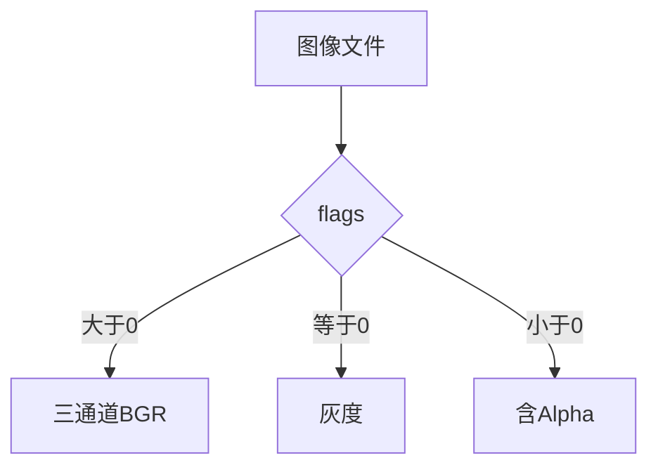
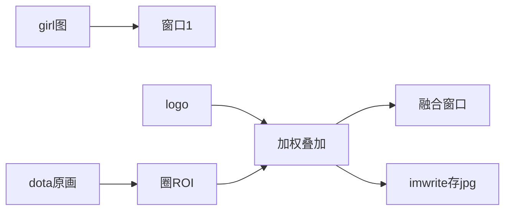
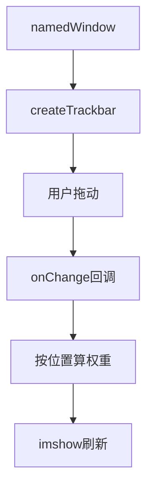
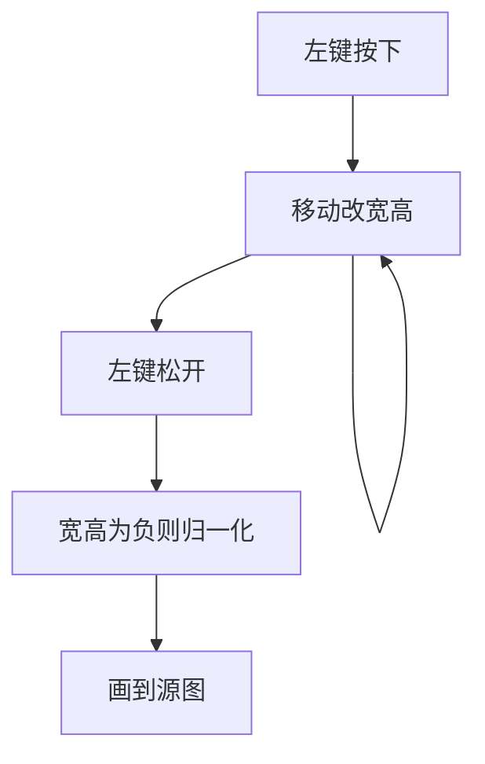

# 第三章 HighGUI 图形用户界面初步

来源：《OpenCV3编程入门》（毛星云等，电子工业出版社，2015）

## 本章总览

这一章把 **HighGUI** 从“能弹出窗口”讲到“能交互”。章首导读回顾：HighGUI 是高层图形界面模块，管媒体输入输出、视频采集、图像/视频编解码，以及图形交互。第 1 章见过的 `VideoCapture` 也属于它，但本章**不展开视频类**，只把日常交互三件事讲清楚：图怎么读、怎么显示、怎么存；滑动条怎么挂到窗口上；鼠标事件怎么回调。学完应能回答：`imread` 的 flags 怎么选、非 8 位图为什么看起来不对、`namedWindow` 什么时候必须显式调用、滑动条和鼠标各自把回调接到哪里。


本章示例程序编号 15–18：透明 PNG、读显存综合、滑动条线性混合、鼠标画矩形。

## 核心知识点

### HighGUI 管什么、和旧接口差在哪

OpenCV 1.0 时代图像装在 C 风格的 **`IplImage*`** 里，用完要自己 `release`，大项目里容易漏释放。从 2.0 起主容器改成 **`Mat`**，内存自己管；读写显示函数名向 MATLAB 靠：`imread` / `imwrite` / `imshow`。

所有 C++ 类和函数都在命名空间 **`cv`** 里。两种用法：

1. 文件开头写 `using namespace cv;`（书推荐，图省事）。
2. 每次加前缀 `cv::`（啰嗦，但能避开重名）。

本章给的起步头文件组合是 `core` + `highgui`（仍是 2.x 的双层路径写法）：

```cpp
#include <opencv2/core/core.hpp>
#include <opencv2/highgui/highgui.hpp>
using namespace cv;
```

`Mat` 本章只点到：默认尺寸为 0；可以指定初始尺寸和初值。书中举例：`cv::Mat pic(320, 640, cv::Scalar(100));`。日常最短用法仍是 `Mat srcImage = imread("dota.jpg");`。完整构造、类型码、引用计数见第 4 章。【信息缺口：本章示例未写出 type 参数，是否笔误待第 4 章对照。】

### 读图：`imread`

新版本里读一张图、显示出来，最短可以只靠 `imread` + `imshow` 两行。

```cpp
Mat imread(const string& filename, int flags=1);
```

| 名称 | 功能 | 主要参数 | 约束&坑点 |
|---|---|---|---|
| `imread` | 从文件读图，返回 `Mat` | `filename`：路径。`flags`：颜色/深度，默认 `1` | 格式靠扩展名识别。OpenCV3 里 `CV_LOAD_IMAGE_*` 宏可能失效，书建议先写整数 |

Windows 下本书列出的可读格式：`bmp`/`dib`，`jpeg`/`jpg`/`jpe`，`jp2`，`png`，`pbm`/`pgm`/`ppm`，`sr`/`ras`，`tiff`/`tif`。

`flags` 枚举写在 `highgui_c.h`（书中排版写成 higui_c.h）里，对应整数如下：

| 宏（OpenCV2 常见） | 整数值 | 含义 |
|---|---|---|
| `CV_LOAD_IMAGE_UNCHANGED` | `-1` | 书称新版本里已弃用、会被忽略 |
| `CV_LOAD_IMAGE_GRAYSCALE` | `0` | 总是灰度图 |
| `CV_LOAD_IMAGE_COLOR` | `1` | 总是彩色图 |
| `CV_LOAD_IMAGE_ANYDEPTH` | `2` | 源图是 16/32 位则保持该深度，否则转成 8 位 |
| `CV_LOAD_IMAGE_ANYCOLOR` | `4` | 按源图颜色情况加载 |

冲突的 flag 取**较小**那个数。例如 `COLOR | ANYCOLOR` 仍按三通道彩色加载。想尽量无损、接近源图，书给的组合是 `ANYDEPTH | ANYCOLOR`，即 `2 | 4`。

按整数记更稳（OpenCV3 宏可能无效）：

| flags 取值 | 结果 |
|---|---|
| `> 0` | 三通道彩色 |
| `= 0` | 灰度 |
| `< 0` | 带 Alpha 通道 |

默认不带 Alpha；要 Alpha 必须用负数。`flags` 是普通 `int`，书举例 `199`、`1999` 和 `1` 一样，都当彩色三通道。彩色解码后通道顺序是 **BGR**，不是 RGB。

```cpp
Mat image0 = imread("1.jpg", 2 | 4);  // 尽量无损
Mat image1 = imread("1.jpg", 0);      // 灰度
Mat image2 = imread("1.jpg", 199);    // 三通道彩色
```



### 显示：`imshow` 和窗口

```cpp
void imshow(const string& winname, InputArray mat);
```

| 参数 | 含义 |
|---|---|
| `winname` | 窗口名字，字符串当身份证 |
| `mat` | 要显示的图，类型写成 `InputArray`，实际当 `Mat` 用即可 |

窗口若按默认的 `WINDOW_AUTOSIZE`（OpenCV2 写作 `CV_WINDOW_AUTOSIZE`）创建，图按原尺寸显示；否则缩放到窗口里。

**按深度自动缩放**（直接把浮点/高位图丢进窗口，看起来会全黑或全白，多半是这里）：

| 深度 | `imshow` 怎么映射到 8 位显示 |
|---|---|
| 8 位无符号 | 原样 |
| 16 位无符号或 32 位整数 | 像素值 ÷ 256，把 `[0, 255×256]` 映到 `[0, 255]` |
| 32 位浮点 | 像素值 × 255，把 `[0, 1]` 映到 `[0, 255]` |

窗口若带 `WINDOW_OPENGL`，`imshow` 还接受 `ogl::Buffer`、`ogl::Texture2D`、`gpu::GpuMat`。

`InputArray` 在 `core.hpp` 里是 `typedef const _InputArray& InputArray;`。书说源码很绕，日常把 `InputArray` / `OutputArray` 都当成 `Mat` 即可。

`imshow` 自己也能开窗口。但窗口名字必须先存在时（比如先挂滑动条），就要显式调用 `namedWindow`。

```cpp
void namedWindow(const string& winname, int flags=WINDOW_AUTOSIZE);
```

| flags（OpenCV3） | OpenCV2 旧名 | 含义 |
|---|---|---|
| `WINDOW_NORMAL` | `CV_WINDOW_NORMAL` | 可随意改窗口大小 |
| `WINDOW_AUTOSIZE` | `CV_WINDOW_AUTOSIZE` | 窗口跟着图走，用户改不了尺寸；**默认** |
| `WINDOW_OPENGL` | `CV_WINDOW_OPENGL` | 打开 OpenGL 支持 |

同名窗口已存在则什么也不做。关闭可用 `destroyWindow` / `destroyAllWindows`；简单程序退出时操作系统也会收掉。

### 存盘：`imwrite`

```cpp
bool imwrite(const string& filename, InputArray img, const vector<int>& params=vector<int>());
```

| 参数 | 含义 | 约束&坑点 |
|---|---|---|
| `filename` | 目标文件名 | **必须带扩展名**，格式靠扩展名决定；能写的类型与 `imread` 能读的一致 |
| `img` | 要保存的图 | 一般是 `Mat` |
| `params` | 按格式成对填写的可选参数 | 默认空向量 |

本书列出的 `params`：

| 格式 | 宏（2.x 带 `CV_`） | 取值 | 默认 |
|---|---|---|---|
| JPEG | `CV_IMWRITE_JPEG_QUALITY` | 0–100，越大越清晰 | 95 |
| PNG | `CV_IMWRITE_PNG_COMPRESSION` | 0–9，越大文件越小、越慢 | 3 |
| PPM / PGM / PBM | `CV_IMWRITE_PXM_BINARY` | 0 或 1 | 1 |

OpenCV3 去掉 `CV_` 前缀，例如 PNG 写成 `IMWRITE_PNG_COMPRESSION`。成对 `push_back`：先宏、再数值。示例 15 生成 4 通道 `CV_8UC4` 的 PNG（480×640），压缩级别设为 9，文件名「透明 Alpha 值图.png」，用 `try-catch` 接转换失败。

### 综合示例在干什么（3.1.9，不抄整段程序）

示例 16 把读、显、叠 logo、存盘串起来。混合细节后文再讲，本章只当预览。流程：

1. `imread("girl.jpg")` → `namedWindow` + `imshow`。
2. 再读 `dota.jpg`（`flags=199`，即彩色）和 `dota_logo.jpg`。
3. 用 `Rect` 或 `Range` 在大图上圈一块和 logo 一样大的 ROI，再 `addWeighted` 叠上去（书中权重 0.5 / 0.3）。
4. `imwrite("由 imwrite 生成的图片.jpg", image)`。
5. `waitKey()` 停住窗口。运行后弹出 4 个窗口。

ROI 两种圈法（位置数字以书中此例为准）：

```cpp
imageROI = image(Rect(800, 350, logo.cols, logo.rows));
imageROI = image(Range(350, 350+logo.rows), Range(800, 800+logo.cols));
```

`addWeighted`、`Rect`/`Range` 的完整参数见后文专章，本章不展开。



### 滑动条：`createTrackbar` / `getTrackbarPos`

滑动条必须挂在某个已有窗口上，用来现场改参数。OpenCV 没有现成按钮，书的做法是做一条范围 0–1 的滑动条，权当开关。

```cpp
int createTrackbar(const string& trackbarname, const string& winname,
    int* value, int count, TrackbarCallback onChange=0, void* userdata=0);
```

| 参数 | 含义 |
|---|---|
| `trackbarname` | 滑动条名字 |
| `winname` | 挂到哪个窗口，须和 `namedWindow` 的名字一致 |
| `value` | 指向当前位置的 `int*`，初值就是滑块起点 |
| `count` | 最大值；最小值固定为 0 |
| `onChange` | 位置一变就调用；默认 0。原型必须是 `void XXXX(int, void*)`：第一个是当前位置，第二个是用户数据。传空则只改 `value`、不回调 |
| `userdata` | 传给回调的自定义指针，默认 0。`value` 若已是全局变量，这个可以不管 |

回调：不是你在 `main` 里直接喊它，而是滑块动了由系统来喊。书中对比度例子（最短调用形态）：

```cpp
createTrackbar("对比度：", "【效果图窗口】", &g_nContrastValue, 300, on_Change);
```

示例 17 用滑动条做两图线性混合：滑块 0–100，`alpha = 当前位置 / 100`，`beta = 1 - alpha`，再 `addWeighted`，`imshow` 刷新。`namedWindow(WINDOW_NAME, 1)` 后创建滑条，并**手动调一次回调**，这样初始位置（书中 70）也能先画出来，最后 `waitKey(0)`。图 3.6–3.8 分别是透明值 70 / 100 / 0 的效果。

```cpp
int getTrackbarPos(const string& trackbarname, const string& winname);
```

按「条名 + 窗口名」取当前整数位置，和 `createTrackbar` 配对用。



### 鼠标：`setMouseCallback`

和滑动条一样走回调。把处理函数挂到指定窗口，鼠标在窗口里动或点，就会进来。

```cpp
void setMouseCallback(const string& winname, MouseCallback onMouse, void* userdata=0);
```

| 参数 | 含义 |
|---|---|
| `winname` | 要监听的窗口名 |
| `onMouse` | 鼠标事件回调名 |
| `userdata` | 传给回调的用户指针，默认 0 |

回调形态：

```cpp
void Foo(int event, int x, int y, int flags, void* param);
```

| 参数 | 本章说明 |
|---|---|
| `event` | 事件类型，常量带 `EVENT_` 前缀。本章点到：`EVENT_MOUSEMOVE`、`EVENT_LBUTTONDOWN`、`EVENT_LBUTTONUP` |
| `x`, `y` | 指针位置，是**图像坐标系**，不是窗口坐标系 |
| `flags` | `EVENT_FLAG` 的组合 |
| `param` | 经 `setMouseCallback` 传进来的用户指针 |

OpenCV2 这些常量可以加 `CV_` 前缀（如 `CV_EVENT_MOUSEMOVE`）。章末函数清单把函数名写成 `SetMouseCallback`（首字母大写），正文原型是 `setMouseCallback`。C++ 接口以正文小写名为准。【信息缺口：本章未给出完整 `EVENT_*` / `EVENT_FLAG_*` 枚举表，只举例三种鼠标事件。】

示例 18 的交互逻辑（不抄整段）：黑底 `600×800`、`CV_8UC3` 画布；`setMouseCallback` 把源图指针传进回调。主循环里先拷到临时图，若正在拖就画临时矩形，`imshow` 刷新；`waitKey(10) == 27` 则 ESC 退出。

| 事件 | 本章例程做什么 |
|---|---|
| `EVENT_LBUTTONDOWN` | 开始画：记下起点，矩形宽高先为 0 |
| `EVENT_MOUSEMOVE` | 若仍按着左键，按当前 `(x,y)` 更新宽高 |
| `EVENT_LBUTTONUP` | 结束画：若宽或高为负（从右下往左上拖），先把原点挪回去再取绝对值，再真正画到源图上 |

自定义 `DrawRectangle` 内部调用 `rectangle(img, box.tl(), box.br(), Scalar(...))`，颜色用 `RNG` 随机。`rectangle` 完整参数见第 4 章绘图。



### `waitKey`：本章只见用法，未见专节

本章没有单独讲 `waitKey` 的函数原型。出现过的写法：

| 写法 | 出现位置 | 本章能确定的含义 |
|---|---|---|
| `waitKey(0)` | 滑动条例、透明 PNG 例 | 一直等到有键按下 |
| `waitKey()` | 综合读显存例 | 停住窗口；书未解释无参默认值 |
| `waitKey(10) == 27` | 鼠标例主循环 | 等 10 毫秒；返回值等于 27 当作 ESC |

【信息缺口：第 3 章未给出 `waitKey` 完整原型、返回值约定和“必须调用才会刷新窗口”是否写在本章。第 1 章已有“参数是毫秒、0 表示无限等”。】

## 容易混淆的点

- **`imshow` 能开窗 ≠ 可以不写 `namedWindow`**：只显示可以靠 `imshow` 自动建窗；要先挂滑动条，必须先有窗口名。
- **`WINDOW_AUTOSIZE` vs `WINDOW_NORMAL`**：前者窗口跟着图像，拖不动；后者人手可缩放。
- **`flags` 宏 vs 整数**：2.x 写 `CV_LOAD_IMAGE_*`；3.x 书说宏可能失效，改写 `-1/0/1/2/4`。随便写个大正整数（如 199）仍按「大于 0 → 彩色」走。
- **彩色是 BGR**：读进来的三通道图不是 RGB。和别的库对像素时先确认顺序。
- **深度缩放**：16 位、32 位整数、浮点图直接 `imshow`，数值会被 ÷256 或 ×255。看起来不对，先查深度，不要先怪文件。
- **`InputArray` ≠ 新容器**：接口上写成它，手里仍递 `Mat`。
- **`IplImage*` vs `Mat`**：旧 C 结构要自己释放；`Mat` 自动管。本章起不要再把 `IplImage*` 当默认。
- **滑动条不是按钮**：没有现成 button，用 0–1 滑条冒充开/关。
- **鼠标坐标是图像坐标**：和窗口客户区坐标不是一回事，缩放窗口时尤其容易混。
- **从右下往左上拖**：宽高会变成负数，松手时要先归一化，否则矩形画反。
- **`addWeighted` / `Mat` 构造 / `rectangle`**：本章例程里出现了，完整参数分别在后文 core / 绘图章，不要按预览例当最终说明。
- **`setMouseCallback` vs 清单里的 `SetMouseCallback`**：同一函数，大小写以正文原型为准。

## 本章要点总结

- HighGUI 管读图、显示、存盘和窗口交互；`VideoCapture` 属于它，但细节仍以第 1 章用法为准。
- C++ 符号在 `cv` 里；`using namespace cv;` 或每次 `cv::`。
- `imread(filename, flags=1)`：`>0` 彩色、`=0` 灰度、`<0` 带 Alpha；彩色为 BGR；冲突 flag 取较小值；尽量无损用 `2|4`。
- `imshow` 按深度缩放；`namedWindow` 默认 `WINDOW_AUTOSIZE`，另有 `NORMAL` / `OPENGL`。
- `imwrite` 看扩展名；JPEG 质量默认 95，PNG 压缩默认 3；3.x 宏去掉 `CV_`。
- 滑动条：`createTrackbar` 挂窗口、绑 `int*`、可选回调；`getTrackbarPos` 按名取值。
- 鼠标：`setMouseCallback`；回调拿 `event, x, y, flags, param`；`x,y` 是图像坐标。
- `waitKey` 本章无专节：静图常用 `waitKey(0)`，循环里用短延时并判断 27（ESC）。
