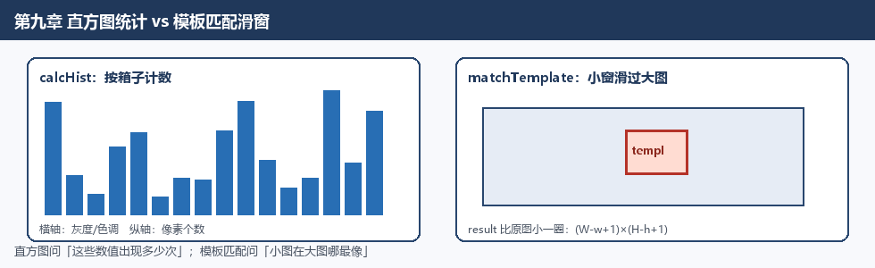
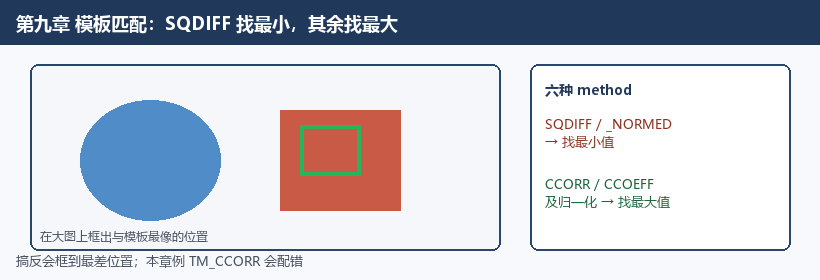
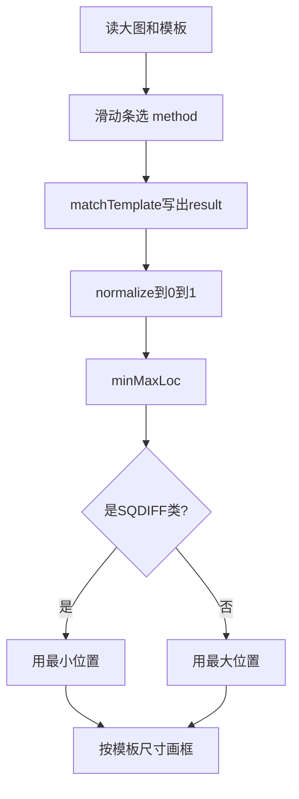

# 第九章 直方图与匹配

来源：《OpenCV3编程入门》（毛星云等，电子工业出版社，2015）
范围：书页 345–374（PDF 362–391）。未读第10章（书页 377 / PDF 394 起；第四部分扉页书页 375 / PDF 392）。

## 本章总览

前面几章在改像素、找边、收轮廓。这一章换一种看法：不盯某一个像素，而是问「整张图里，这些数值出现了多少次」。统计结果画成柱状图，就是**直方图**（histogram）。

章首导读：直方图常用来描述物体颜色分布、边缘梯度模板，以及「目标大概在哪」的概率。

学习目标：直方图是什么、怎么算怎么画、怎么对比、反向投影、模板匹配。

正文五块：概述、计算与绘制、对比、反向投影、模板匹配。学完应能回答：`dims` / `bins` / `range` 各管什么、`calcHist` 通道下标怎么填、对比四种距离谁大谁小才算像、反向投影亮处表示什么、`matchTemplate` 六法里哪两种找最小值。

示例程序编号 79–84。


## 核心知识点

### 直方图：把像素按「箱子」数一遍

直方图可以想成：先定好若干区间（书里叫直条 / 组距，英文 bin），再数每个区间掉进多少样本。样本可以是灰度、色调、梯度方向，不一定是亮度。

统计结果的维度通常比原图低：一张图变成一根或几根柱子。

灰度图习惯画法：横轴左边纯黑、右边纯白；纵轴是该亮度上有多少像素。偏暗的图柱子挤在左中；偏亮、阴影少的图柱子靠右。

书中用途：相邻帧边缘 / 颜色统计一变，可标场景切换；也可当兴趣点标签、识别器特征；颜色和边缘直方图序列还能判断视频是否被复制。



*图注：直方图按箱子计数；模板匹配是小窗滑过大图，result 尺寸为 (W-w+1)×(H-h+1)。两条路不要混成「都是比像不像」。*

三个专有名词要先分清。下表对应书中灰度例子。

| 名词 | 通俗理解 | 书中灰度例子 |
|---|---|---|
| `dims` | 同时统计几个特征 | 单通道灰度 `dims = 1` |
| `bins` | 每个特征切成几段 | 把 `[0, 255]` 切成 16 段，`bins = 16` |
| `range` | 这个特征的取值范围 | `[0, 255]` |

16 个箱子时，大约是 `[0,15]`、`[16,31]`、…、`[240,255]`。箱子越少，柱子越粗、细节越糊；箱子越多，峰能拆开，也更容易被噪声戳出毛刺。

OpenCV **没有**专门的「画直方图」函数。算出数组之后，用 `rectangle` / `line` 自己往画布上画。多维直方图可以放进 `MatND`（用来存这种统计结果的矩阵）。

🔑 关键速记：直方图只分箱计数；`dims` 管几维，`bins` 管每维几箱，`range` 管从哪到哪。

### 直方图均衡化（本章只点到）

直方图均衡化是用这张统计表把灰度拉开、提高对比度，函数是 `equalizeHist`。输入必须是 8 位单通道；步骤是先算直方图 \(H\)，再归一化使各 bin 之和等于 255，积分后当查找表逐点替换。已经摊平的图再做几乎不变；高对比图可能被压坏并出伪轮廓。本章直方图是「数格子」，均衡化是「用格子做增强」，函数都带 Hist，不是一回事。

👉 完整深度讲解见第7章。

🔑 关键速记：本章直方图是统计；`equalizeHist` 是增强，细节回第7章。

### 计算直方图：`calcHist`

把一组同尺寸图像按指定通道、箱子和范围数进去，得到稠密或稀疏直方图。

```cpp
void calcHist(const Mat* images,
              int nimages,
              const int* channels,
              InputArray mask,
              OutputArray hist,
              int dims,
              const int* histSize,
              const float** ranges,
              bool uniform=true,
              bool accumulate=false);
```

下表按参数顺序说明约束。

| 参数 | 含义 | 约束&坑点 |
|---|---|---|
| `images` | 输入图（或一组图）的指针 | 深度须同为 `CV_8U` / `CV_16U` / `CV_32F`，尺寸相同；每张图可以有多个通道 |
| `nimages` | 输入图张数 | 只算一张就填 1 |
| `channels` | 要统计的通道下标列表 | 下标是「把这些图的通道摊平后」的序号。HSV 的 H、S 就是 `{0, 1}` |
| `mask` | 可选掩膜 | 非空则须 8 位、与 `images[i]` 同尺寸；**非零位置才计入** |
| `hist` | 输出直方图 | `dims` 维的稠密或稀疏数组 |
| `dims` | 直方图维数 | 必须为正，且不超过 `CV_MAX_DIMS`（书称当前版本为 32） |
| `histSize` | 每一维有多少个箱子 | 也就是各维的 `bins` |
| `ranges` | 每一维的取值边界 | 类型是 `const float**`，先准备一维数组再取地址 |
| `uniform` | 是否均匀分箱 | 默认 `true` |
| `accumulate` | 是否累加 | 默认 `false`。`true` 时分配阶段不清空，可把多张图叠进同一张直方图 |

深度限 8U/16U/32F 且同尺寸；掩膜非零才统计；`accumulate=true` 用来叠多张。

书中 H-S 二维关键调用：先 `COLOR_BGR2HSV`，再只拿 H、S。

```cpp
int channels[] = {0, 1};
int histSize[] = {30, 32};          // H 30 箱，S 32 箱
float hranges[] = {0, 179};
float sranges[] = {0, 256};
const float* ranges[] = {hranges, sranges};
calcHist(&hsvImage, 1, channels, Mat(), dstHist, 2, histSize, ranges, true, false);
```

Hue 范围写成 `0～179`，Saturation 写成 `0～256`。二维结果用双重循环读 `dstHist.at<float>(hue, saturation)`，按全局最大值缩到 0～255，再 `rectangle` 画成亮度图：某格越亮，那种 H-S 组合的像素越多。

🔑 关键速记：`calcHist` 只出数组；通道下标是摊平后的序号，掩膜非零才计入。

### 找最值：`minMaxLoc`

直方图画出来之前，通常要先知道最高那根柱子有多高，好把高度缩进窗口。模板匹配也靠它在结果图上找「最像」或「最不像」的点。

```cpp
void minMaxLoc(InputArray src,
               double* minVal,
               double* maxVal=0,
               Point* minLoc=0,
               Point* maxLoc=0,
               InputArray mask=noArray());
```

下表强调单通道约束。

| 参数 | 含义 | 约束&坑点 |
|---|---|---|
| `src` | 输入数组 | **必须单通道** |
| `minVal` / `maxVal` | 全局最小 / 最大值 | 不需要就传 `NULL` / `0` |
| `minLoc` / `maxLoc` | 最值所在位置（二维时） | 不需要同样传空 |
| `mask` | 只在掩膜里找 | 可选 |

H-S 例只取最大值：`minMaxLoc(dstHist, 0, &maxValue, 0, 0)`。画直方图时只要最大柱高；做模板匹配时要同时拿最小点和最大点，再按 method 二选一。

🔑 关键速记：`minMaxLoc` 只吃单通道；画柱取峰高，匹配还要按 method 在最小点 / 最大点里二选一。

### 三种画法的输入输出（示例 79–81）

OpenCV 不代画直方图。三种示例都是：`calcHist` → `minMaxLoc` 取峰 → `rectangle` 画柱或方块。格子类型是 `float`，要用 `dstHist.at<float>(...)`。

**H-S 二维（示例 79）**：BGR→HSV → 两维 `calcHist`（H 30 箱、S 32 箱）→ 取峰 → 双重循环画灰度方块。输出是一块亮度图，某格越亮说明该 H-S 组合越多。

**一维灰度（示例 80）**：`imread(..., 0)` 直接灰度；`dims=1`，`size=256`，范围 `{0, 255}`，通道 `0`。画布 256×256，柱高按最大值缩到窗口高度的 90%（`saturate_cast<int>(0.9 * size)`）。旧 C API 对照：`calcHist` ← `cvCalcHist`，`minMaxLoc` ← `cvGetMinMaxHistValue`。

**RGB 三色并排（示例 81）**：对同一张彩图分别 `calcHist` 三次，通道下标 `{0}` / `{1}` / `{2}`，各 256 箱，范围 `{0, 256}`。画布宽度 `bins * 3`，三组柱子左右排开。书把存绿色直方图的变量写成了 `grayHist`，注释却说它是绿色。画柱用 `Scalar(255,0,0)`、`Scalar(0,255,0)`、`Scalar(0,0,255)` 口头标「红 / 绿 / 蓝」。OpenCV 彩色图是 **BGR**，通道 0 实际是蓝，`Scalar(255,0,0)` 也是蓝。书按 RGB 口头点名，和通道顺序容易拧着。

🔑 关键速记：三种画法都是自己 `rectangle`；格子是 `float`；通道 0/1/2 按 BGR 读，不要被口头「红」带偏。

### 直方图对比：`compareHist`

两张直方图像不像，要先选一个距离 \(d(H_1, H_2)\)。比较的是已经算好的直方图，不是原图像素。

函数有两套：稠密数组一套，稀疏矩阵一套。`H1`、`H2` 尺寸必须相同。

```cpp
double compareHist(InputArray H1, InputArray H2, int method);
double compareHist(const SparseMat& H1, const SparseMat& H2, int method);
```

`method` 书列了四种（OpenCV2 写法带 `CV_`）。下表说明怎么读结果。

| method | 名称 | 公式要点 | 怎么读结果 |
|---|---|---|---|
| `CV_COMP_CORREL` | 相关 | 先各自减均值再做归一化点积 | 越大越像。自己比自己是 1 |
| `CV_COMP_CHISQR` | 卡方 | \(\sum (H_1-H_2)^2 / H_1\) | 示例里自己比自己是 0，越小越像 |
| `CV_COMP_INTERSECT` | 相交 | \(\sum \min(H_1, H_2)\) | 越大越像 |
| `CV_COMP_BHATTACHARYYA`（也可写 `CV_COMP_HELLINGER`） | Bhattacharyya / Hellinger | 对开方后再开方的一种距离 | 示例里自己比自己是 0，越小越像 |

相关 / 相交越大越像；卡方 / Bhattacharyya 越小越像（示例中 0 表示全同）。OpenCV3 里这些宏**暂时还带着 `CV_`**，书称以后可能改；也可以先 `#include <cv.h>`。

灰框另写「可用整数 1、2、3、4 分别代表上述四个宏」；同一节综合例却用循环 `i = 0..3` 当 method，打印结果也按 **0=相关、1=卡方、2=相交、3=Bhattacharyya** 解释。以综合例的 0～3 对照表为准，灰框那组 1～4 与示例对不齐，不要混用。

对比前通常先 `normalize(..., 0, 1, NORM_MINMAX)`，否则箱子总数不同，数字没法比。

示例 82 关键调用：三张图（基准、测试1、测试2）转 HSV，再切基准图下半张当「半身图」；H 50 箱、S 60 箱的二维直方图，归一化到 0～1，四种 method 各算四对（基准-基准、基准-半身、基准-测试1、基准-测试2）。

输入输出现象：相关法基准-基准 = 1、半身约 0.91、两张测试图掉到 0.27 / 0.14；相交法同样是基准最大、半身其次、测试图最小。卡方、Bhattacharyya 则是基准-基准为 0，测试图大一个数量级。同一本书封面换个角度拍，直方图就不那么像了。

注意：这个对比例把 `h_ranges` 写成 `{0, 256}`、`s_ranges` 写成 `{0, 180}`，和 9.2.3 的 H∈[0,179]、S∈[0,256] 对调了。以各节当场代码为准，不替书改。

🔑 关键速记：先 `NORM_MINMAX` 到 0～1 再比；相关/相交越大越像，卡方/Bhattacharyya 越小越像；method 整数以 0～3 为准。

### 反向投影：直方图当「像不像」的查表

反向投影（back projection）把直方图当成一张概率表：某个箱子里的数越大，就越像你关心的那种特征。

做法可以想成四步：

1. 先用样本算出模型直方图（比如手掌皮肤的 H-S）
2. 测试图每个像素看自己落进哪个箱子
3. 把那个箱子里的值写到一张新图的对应位置
4. 整张新图就是反向投影。值先归一化到 0～255，就能当灰度图看

亮 = 更像目标，暗 = 不太像。书中手掌例：手心是白的，阴影和边缘变暗，背景更黑，但会带一点散斑噪声。结果一般是**单通道浮点图**（或二维浮点数组）。用途：在大图里按颜色分布定位小目标，哪怕模板只是一块颜色。

#### `calcBackProject`

用已算好的模型直方图，对测试图每个像素查箱并写出投影图。

```cpp
void calcBackProject(const Mat* images,
                     int nimages,
                     const int* channels,
                     InputArray hist,
                     OutputArray backProject,
                     const float** ranges,
                     double scale=1,
                     bool uniform=true);
```

下表强调输出必须与第一张输入图对齐。

| 参数 | 含义 | 约束&坑点 |
|---|---|---|
| `images` | 输入图 | 深度 `CV_8U` 或 `CV_32F`，尺寸相同；通道数可以不同 |
| `nimages` | 输入张数 | |
| `channels` | 用来查表的通道下标 | 要和算 `hist` 时用的通道对上 |
| `hist` | 已经算好的模型直方图 | |
| `backProject` | 输出投影图 | **单通道**，尺寸和深度跟 `images[0]` 相同 |
| `ranges` | 各维取值范围 | 必须和算直方图时一致 |
| `scale` | 输出再乘的系数 | 默认 1 |
| `uniform` | 是否均匀分箱 | 默认 `true` |

通道、范围必须和算 `hist` 时一致；输出单通道、与 `images[0]` 同尺寸同深度。

🔑 关键速记：反向投影是「直方图当查表」；亮处更像模型，输出与第一张输入图对齐。

#### 通道搬运：`mixChannels`

反向投影例只要 HSV 的 H，书不用 `split`，改用更通用的 `mixChannels`：从输入数组里挑通道，拷到已经分配好的输出数组。书称 `split`、`merge`、部分 `cvtColor` 都是它的特例。

两套原型：指针版和 `vector<Mat>` 版。

```cpp
void mixChannels(const Mat* src, size_t nsrcs,
                 Mat* dst, size_t ndsts,
                 const int* fromTo, size_t npairs);

void mixChannels(const vector<Mat>& src,
                 vector<Mat>& dst,
                 const int* fromTo, size_t npairs);
```

下表强调输出必须预分配。

| 参数 | 含义 | 约束&坑点 |
|---|---|---|
| `src` / `nsrcs` | 输入矩阵及个数 | 须同尺寸、同深度 |
| `dst` / `ndsts` | 输出矩阵及个数 | **必须事先分配好**，尺寸深度跟 `src[0]` 走 |
| `fromTo` | 成对下标：从哪拷到哪 | `{from0, to0, from1, to1, ...}` |
| `npairs` | 有几对 | |

通道编号把多张图的通道接成一条长队。书中 RGBA→BGR+Alpha 关键调用：

```cpp
int from_to[] = {0,2, 1,1, 2,0, 3,3};
Mat out[] = {bgr, alpha};
mixChannels(&rgba, 1, out, 2, from_to, 4);
```

注释按 RGBA 读：输入 0(R)→输出 BGR 的 2，1(G)→1，2(B)→0，3(A)→单独那张 Alpha。`dst` 不预分配会出问题。

示例 83 关键调用：读图 → `COLOR_BGR2HSV` → `mixChannels` 只抽出 H 到 `g_hueImage` → 滑动条「色调组距」0～180（回调里箱子数至少 2）→ `calcHist`（H 范围 `[0, 180]`）→ `normalize` 到 0～255 → `calcBackProject` → 再画一根一维 hue 柱状图。

输入输出现象：组距 8 时柱子很粗、投影图手是亮的但噪声多；组距 30 时直方图能看出两个峰，投影更细。滑动条改的是**箱子个数**，不是某个阈值。

🔑 关键速记：`mixChannels` 的 `dst` 必须先建好；`fromTo` 成对「从→到」；反向投影滑动条改的是箱数。

### 模板匹配：小图在大图上滑一遍

模板匹配和直方图不是一条路。它不统计颜色分布，而是拿一小块模板图，在大图上从左到右、从上到下滑动，每到一个位置就算一次「这块像不像」。最像的那个位置，就是匹配点。



*图注：六种 method 里只有 SQDIFF 两类找最小值，CCORR / CCOEFF 四类找最大值；搞反会框到最差位置。*

#### `matchTemplate`

在大图每个合法位置写下与模板的相似度，得到一张比原图小一圈的分数图。

```cpp
void matchTemplate(InputArray image,
                   InputArray templ,
                   OutputArray result,
                   int method);
```

下表给出尺寸公式和输入类型。

| 参数 | 含义 | 约束&坑点 |
|---|---|---|
| `image` | 被搜索的大图 | 8 位或 32 位浮点 |
| `templ` | 模板小图 | 类型须与大图相同，**不能比大图还大** |
| `result` | 每个位置的相似度图 | 单通道 32 位浮点；尺寸 \((W-w+1)\times(H-h+1)\) |
| `method` | 六种度量之一 | 见下表 |

大图 \(W\times H\)、模板 \(w\times h\) 时，结果图每个像素对应「模板左上角放到这里」的分数。所以结果比原图略小一圈，不是原图尺寸。框的位置是模板左上角，还要加上模板宽高才是右下角。

六种 `method`（OpenCV3 无 `CV_` 前缀；OpenCV2 写成 `CV_TM_*`）。下表先分清谁找最小、谁找最大。

| method | 名称 | 直观理解 | 好匹配长什么样 |
|---|---|---|---|
| `TM_SQDIFF` | 平方差 | 对应像素相减再平方求和 | **0 最好**，越大越差 → 找 **最小值** |
| `TM_SQDIFF_NORMED` | 归一化平方差 | 上面再除以双方能量的根 | 同样是越小越好 |
| `TM_CCORR` | 相关 | 对应像素相乘再求和 | **越大越好**，0 最差 → 找 **最大值** |
| `TM_CCORR_NORMED` | 归一化相关 | 上面再除以双方能量的根 | 找最大值 |
| `TM_CCOEFF` | 相关系数 | 先各自减均值再相乘 | 1 最好，−1 很差，0 无相关 → 找最大值 |
| `TM_CCOEFF_NORMED` | 归一化相关系数 | 上面再归一化 | 找最大值 |

只有两种平方差是越小越好，其余四种找最大。书称从平方差走到相关系数，一般更准，也更费时间。实际项目要几种都试，在速度和精度之间折中。本章综合例里，**`TM_CCORR` 找错了位置**，另外五种相对准（图 9.31 / 9.32 是两种相关系数法，框在正确位置）。

示例 84 关键调用：大图 `1.jpg`、模板 `2.jpg` → 滑动条「方法」0～5 对应上表六种 → 按公式分配 `CV_32FC1` 的 `result` → `matchTemplate` → `normalize` 到 0～1 → `minMaxLoc` 同时拿到最小点、最大点 → `TM_SQDIFF` / `TM_SQDIFF_NORMED` 用最小点，其余用最大点 → 按模板宽高画红框（`Scalar(0,0,255)`）。

输入输出现象：平方差类匹配处是暗斑，相关类匹配处是亮斑。`TM_CCORR` 那张效果图亮斑糊成一片，框容易漂到边上。



🔑 关键速记：`result` 是 `(W-w+1)×(H-h+1)` 的 32F；SQDIFF 两类找最小，其余找最大；本章例 `TM_CCORR` 会配错。

### 章末清单（9.6）

核心函数：`calcHist`、`minMaxLoc`、`compareHist`、`calcBackProject`、`mixChannels`、`matchTemplate`。

示例 79–84 依次对应：H-S 二维直方图、一维直方图、RGB 三色直方图、直方图对比、反向投影、模板匹配。

本章未指向尚未处理的其他章节专节。均衡化只回指第7章已有笔记。【本章未登记新的跨章待补全。】

## 易混淆点&差异对比

- **直方图 vs 直方图均衡化**：本章的直方图是「数格子」；第7章的 `equalizeHist` 是用这张统计表把灰度拉开。一个是统计，一个是增强，函数都带 Hist，不是一回事。
- **直方图对比 vs 模板匹配**：`compareHist` 比的是两张已经算好的直方图（颜色分布像不像）。`matchTemplate` 是小图在大图上滑，比的是像素块本身，书明确说它不基于直方图。反向投影介于两者之间：用直方图当查表，但输出的是一张和原图对齐的概率图。
- **谁大才算像**：`compareHist` 的相关、相交是越大越像；卡方、Bhattacharyya 从示例看是越小越像（自己比自己为 0）。`matchTemplate` 里只有两种平方差是越小越好，其余四种找最大。搞反就会框到最不像的地方。
- **`minMaxLoc` 的两种用法**：画直方图时只要最大柱高，用来缩放；做模板匹配时要同时拿最小点和最大点，再按 method 二选一。
- **通道下标和 RGB 口头名**：`calcHist` / `mixChannels` 的 0/1/2 是 B/G/R。书中 RGB 三色例把通道 0 叫「红」，画柱又用 `Scalar(255,0,0)`，按 BGR 理解其实是蓝。
- **H、S 范围两处写法不一致**：9.2.3 用 H `[0,179]`、S `[0,256]`；9.3.2 写成 H `[0,256]`、S `[0,180]`；反向投影例 H 用 `[0,180]`。抄范围时跟当场那一节，不要混用。
- **`compareHist` 的整数编号**：正文灰框写 1～4，综合例按 0～3 打印并解释。以 0～3 与 `CV_COMP_*` 的对应为准。
- **`mixChannels` 的输出必须先建好**：和 `split`「函数给你分配」的直觉不同。`fromTo` 是成对的「从→到」，漏一对或输出没 `create` 都会错。
- **反向投影的组距**：滑动条改的是箱子个数。太少，不同颜色挤进同一箱，手和背景分不开；太多，统计发虚，投影上全是散斑。
- **结果图尺寸**：`matchTemplate` 的 `result` 不是原图那么大，宽高都要减掉模板再加 1。框的位置是模板左上角，还要加上模板宽高才是右下角。

## 本章要点总结

- 直方图把特征取值切成箱子再计数。`dims` 是几维，`histSize` 是每维几箱，`ranges` 是每维从哪到哪。`calcHist` 输入须 8U/16U/32F 且同尺寸；掩膜非零才统计；`accumulate=true` 可叠多张图。
- 没有现成的画直方图 API：`minMaxLoc` 取峰，再用 `rectangle` 画。H-S 二维看颜色分布，一维看灰度，三通道就分别算再并排画。格子是 `float`。
- `compareHist` 四种：相关 / 卡方 / 相交 / Bhattacharyya（可写 Hellinger）。对比前先 `NORM_MINMAX` 到 0～1。相关、相交越大越像；卡方、Bhattacharyya 示例中 0 表示完全一样。OpenCV3 仍写 `CV_COMP_*`。
- 反向投影：模型直方图 → 每个像素查箱子 → 写成一张概率图。`calcBackProject` 的输出须单通道、与 `images[0]` 同尺寸同深度。抽单通道用 `mixChannels`，输出矩阵要预分配。
- `matchTemplate`：大图 8U 或 32F，模板不能更大；结果 `(W-w+1)×(H-h+1)` 的 32F 单通道。六种 method：`TM_SQDIFF` / `_NORMED` 找最小，其余四种找最大。2.x 加 `CV_`。本章例里普通相关法 `TM_CCORR` 会配错，归一化和相关系数更稳，但也更慢。
- 均衡化本章只点到：`equalizeHist` 把灰度摊开提对比度，须 8 位单通道。👉 完整深度讲解见第7章。
- 示例 79–84：H-S 图、一维柱、RGB 三色柱、四方法对比、滑动条改组距的反向投影、滑动条改方法的模板匹配。综合例只提炼输入输出现象与关键调用，不写可运行工程。
