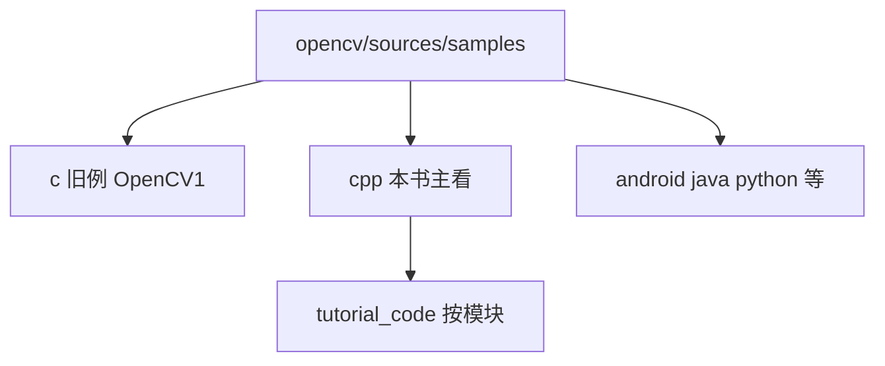
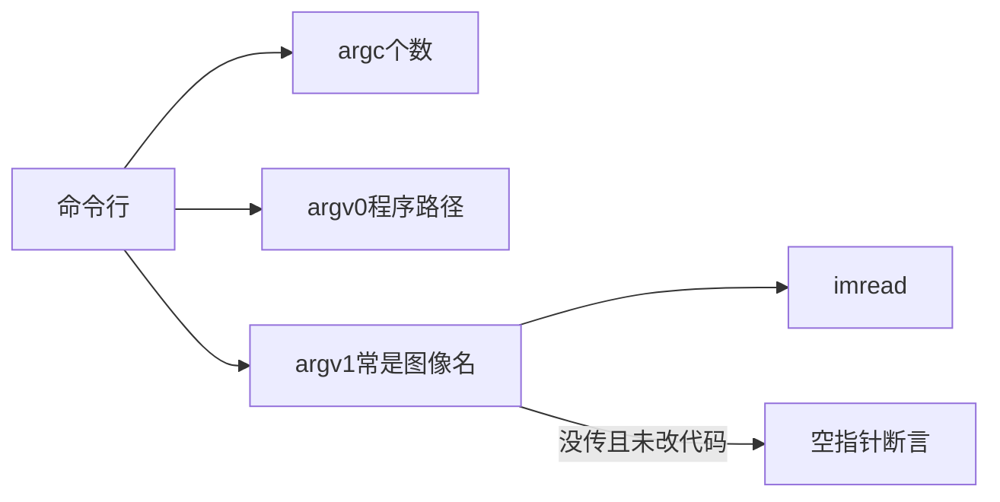

# 第二章 启程前的认知准备

来源：《OpenCV3编程入门》（毛星云等，电子工业出版社，2015）

## 本章总览

这一章不急着讲新算法，而是把“上路前该知道的事”摊开：官方例程在哪、看源码要先过 CMake、总头文件 `opencv.hpp` 里装了什么、书里变量怎么起名、官方样例里常见的 `argc`/`argv` 是什么、控制台怎么用 `printf`、怎样打印当前 OpenCV 版本。章首写明可以跳着读；**2.5、2.6 是给 C 语言偏弱的读者准备的**，有基础可以略读。学完应能回答：官方 C++ 例程放在哪个目录、为什么包含一个头就够用、命令行没传图路径时为什么会崩。


## 核心知识点

### 官方例程：先看能做成什么

官方样例是现成的“展览厅”。装好 SDK 之后，C++ 例程主要在：

`...\opencv\sources\samples\cpp`

书中举例：`D:\Program Files (x86)\opencv\sources\samples\cpp`。按模块整理的教程代码在 `...\opencv\sources\samples\cpp\tutorial_code`。`samples` 目录里还能看到 android / c / cpp / gpu / java / python 等子文件夹；**`c` 里是偏 OpenCV 1.0 的旧例，本书盯 `cpp`（2.x 及以后），数量超过 100 个**。配套光盘/源码包里，第 2 章选了官方例做成示例 8–13（2.1.1–2.1.5；2.1.5 拆成两个工程）。



本章只做引导和赏析，不展开这些算法的完整参数表。【信息缺口：已读目录未标出 CamShift / 光流 / 点追踪 / Haar / SVM 对应的后文专章号，此处不编造章号。】

| 小节 | 官方例程 | 本章说了什么 | 约束&坑点 |
|---|---|---|---|
| 2.1.1 | `camshiftdemo.cpp`（`samples/cpp`） | 彩色目标跟踪。CamShift = Continuously Adaptive Mean-SHIFT，是 MeanShift 的改进。用鼠标按色调圈一块区域，之后跟着这块颜色走。界面有 `Vmin` / `Vmax` / `Smin` 三条滑动条。 | 本章只给运行截图和文件名。【信息缺口：完整参数不在第2章；已读目录未标出对应后文专章号】 |
| 2.1.2 | 官方光流 demo（书页 42 给出运行窗 “optical flow tracking”） | 光流：运动图像分析里看“亮度图案怎么挪”。Gibson 1950 提出；物体一动，图上对应亮度也动，这种视在运动就是光流，可用来判断运动状态。 | 已读页未写明对应 `.cpp` 文件名。【信息缺口】 |
| 2.1.3 | `lkdemo.cpp`（`samples/cpp`） | 点追踪。打开默认摄像头，按 **`r`** 开始自动跟点；物体一动，点跟着走。 | 操作键以本章为准；未给算法公式。 |
| 2.1.4 | `tutorial_code/objectDetection` | 人脸检测，走 `objdetect` 模块。 | 必须把两个 Haar XML **拷到自己的源文件目录**，否则跑不起来：`haarcascade_eye_tree_eyeglasses.xml`、`haarcascade_frontalface_alt.xml`，源在 `...\opencv\sources\data\haarcascades`。 |
| 2.1.5 | 两个 SVM 官方例 | 机器学习入门。第一个用 `CvSVM::train` 训练分类器；第二个演示**线性不可分**数据。 | `CvSVM` 是书中此例的写法（偏 2.x C API）。OpenCV3 主推 `cv::ml` 的类名，本章未对照。【信息缺口：第二例完整函数名未在已读页列出】 |

### 编译源码：为了能点进去看

2.2 的目的不是再配一遍开发环境，而是说明：**想读库内部实现，要用 CMake 从源码生成 IDE 工程**。书称较新版本源码超过六十万行；章末小结又写成四十余万行，两处数字不一致，只作量级参考。

**CMake**（crossplatform make）：跨平台的“生成构建文件”的工具，自己不负责最终编译。核心描述文件叫 `CMakeLists.txt`。它产出 Makefile 或 Visual Studio 工程，再交给对应编译器去编。书中演示用 CMake 2.8、生成器选 Visual Studio 10，源码路径须能找到 `CMakeLists.txt`。

概念上的三步（不写菜单逐步操作）：

1. 指定源码目录、生成目录（生成目录不要带中文路径）。
2. **Configure 做两遍**，再 **Generate**。第一次 Configure 会拉出一堆 `WITH_*` 选项（CUDA、OpenCL、Qt、TBB 等）；第二次把选项落稳，再生成解决方案。
3. 打开生成的 `OpenCV.sln` 去编译。书中 OpenCV **2.4.9** 的解决方案约 **67** 个工程；示例编译结果写成功 62 个。从 **2.4.7** 起，`.sln` 只是链到安装目录里的源文件，不再整份拷贝，所以工程体积从 2.4.6 的数 GB 降到约 3MB。


编译产物是 `.dll` / `.lib` / `.exe`。Debug 编完后 `bin\debug` 里的依赖库很大（书称超过 700MB），可供后续工程使用。

**`ALL_BUILD` 不是可执行程序。** 它是 CMake 的汇总工程。编完若自动“运行”它，会弹出“系统找不到指定文件”——书说这是正常现象。要看某个模块，把对应工程设为启动项，例如点进 `opencv_core` 的 `Src/matrix.cpp`，书中展示过 `Mat` 的一个构造函数（按另一张 `Mat` 和 `Range` 取子范围）。

路径坑：用户名含中文时，CMake 复制 VS 宏文件可能报红；书说只要**生成目录不含中文**，这条宏复制失败可以忽略。

### `opencv.hpp`：一个头带进常用模块

任何程序里对 `#include <opencv2/opencv.hpp>` 跳转到定义，就能看见它是总开关。书页 53 截到的前半段包括：

```cpp
#include "opencv2/core/core_c.h"
#include "opencv2/core/core.hpp"
#include "opencv2/flann/miniflann.hpp"
#include "opencv2/imgproc/imgproc_c.h"
#include "opencv2/imgproc/imgproc.hpp"
#include "opencv2/photo/photo.hpp"
#include "opencv2/video/video.hpp"
#include "opencv2/features2d/features2d.hpp"
#include "opencv2/objdetect/objdetect.hpp"
#include "opencv2/calib3d/calib3d.hpp"
```

后半段截图被裁掉。【信息缺口：是否还列出 `highgui` / `ml` / `contrib` 等，需对照书页 53 原图后半或本机头文件】

正文说：单独包含某个模块头（如 `ml.hpp`、`highgui.hpp`）也可以；**为图省事，日常用总头 `opencv.hpp` 即可**。本书有时故意写分模块头，是为了标明这段在用哪个模块。

注意：这里展示的仍是 **2.x 双层路径**（`opencv2/core/core.hpp`）。第一章说过 3.x 常缩短成 `opencv2/core.hpp`。总头这个名字没变，里面怎么写取决于你装的版本。

### 命名约定：书里变量为什么长这样

2.4 声明本书命名参考《代码大全（第 2 版）》，并掺了 Windows 里常见的匈牙利记法。核心不是背完整张表，而是读官方例和书中代码时能对上号。

| 对象 | 书中约定 | 例子 |
|---|---|---|
| 类 / 类型 / 枚举类型名 | 首字母大写的混合大小写 | `ClassName`、`TypeName`；枚举类型名常用复数 |
| 局部变量 | 首字母小写 | `localVariable` |
| 函数参数 | 首字母大写 | `RoutineParameter` |
| 仅类内可见的成员 | `m_` 前缀 | `m_ClassVariable` |
| 全局变量 | `g_` 前缀 | `g_GlobalVariable` |
| 常量 | 全大写 | `CONSTANT` |
| 宏 | 全大写，下划线分词 | `SCREEN_WIDTH` |
| 枚举成员 | 带类型前缀 | `Color_Red` |

匈牙利记法公式：`属性 + 类型 + 对象描述`。书表 2.2 里和读 OpenCV 代码最常碰上的前缀：`n`（int）、`b`（BOOL）、`p`（指针）、`h`（句柄）、`dw`（DWORD）。表 2.3 又补了视觉里极高频的缩写：

| 含义 | 缩写 |
|---|---|
| 最大 / 最小 | `Max` / `Min` |
| 初始化 | `Init` |
| 临时 | `T` 或 `Temp` |
| 源图 / 结果图 | **`Src` / `Dst`** |

约定要前后一致，但书也说不必学究。OpenCV 函数参数里铺天盖地的 `src`、`dst`，就是这套习惯。

### `argc` 与 `argv`：官方例为什么总问你要一张图

官方样例和《Learning OpenCV》里，`main` 经常写成：

```cpp
int main(int argc, char** argv)
{
    const char* imagename = argc > 1 ? argv[1] : "lena.jpg";
}
```

| 名称 | 含义（本章） |
|---|---|
| `argc` | argument count，命令行参数个数。在 Visual Studio 里默认往往是 **1**（只有程序自己）。 |
| `argv` | argument vector，字符串指针数组。 |
| `argv[0]` | 当前程序的完整路径。 |
| `argv[1]`、`argv[2]`… | 程序名后面跟的第 1、第 2 个字符串（常用来传图像文件名）。 |
| `argv[argc]` | 恒为 `NULL`。 |

UNIX/Linux 上还有第三参数 `char **env`（环境变量）。`argc`/`argv`/`env` 在进入 `main` 之前就已经填好。严格说操作系统入口不一定叫 `main`，但 Windows 控制台程序把它当入口。

缺参数时的典型崩法：代码写了 `imread(argv[1], 1)`，调试又没给命令行，于是读到空指针，弹出 `invalid null pointer`。本章给的两条出路：

1. 在工程调试设置里填命令参数（如 `"1.jpg"`，多个文件用空格分开）。
2. 改成本地文件名，不依赖 `argv`：

```cpp
Mat srcImage = imread("1.jpg", 1);  // 文件放在工程目录
```

书中还列举 VS 里几种 `main` 写法都可能被当时编译器接受（带参 `int`、不带参 `int`、甚至 `void`）。【信息缺口：书页 58 三则示例代码与标题有对不齐的地方，不宜把“三种标准写法”当规范背。】现代 C++ 仍以 `int main()` / `int main(int, char**)` 为准。



### `printf`：控制台格式输出（C 基础）

`printf` 来自 `stdio.h`，不是 OpenCV 函数；但包含 `opencv.hpp` 后通常能直接用。原型：

```cpp
int printf(const char *format, ...);
```

书表 2.4 / 2.5 列出的常用格式与转义（只记本章出现的）：

| 格式/转义 | 本章说明 |
|---|---|
| `%d` / `%u` / `%o` | 有符号十进制 / 无符号十进制 / 八进制 |
| `%f` | 浮点 |
| `%c` | 按 ASCII 当字符 |
| `%s` | 字符串 |
| `%x` / `%X` | 小写 / 大写十六进制 |
| `%p` | 地址 |
| `%%` | 输出百分号本身 |
| `\n` `\t` `\r` `\f` | 换行、制表、回车、换页 |
| `\xhh` | 用十六进制写 ASCII |

本章示例：`a=66`、`b=68` 时，`%d` 打出 66 和 68，`%06d` 打出 `000066`，`%c` 打出 `B` 和 `D`。末尾用 `getchar()` 防止控制台一闪而过。示例程序编号 14，对应 2.6.2。

### 打印当前 OpenCV 版本

许多书中例程会带一行版本提示，靠宏 **`CV_VERSION`**（它是字符串，可和旁边的字面量拼在一起）：

```cpp
printf("\t 当前使用的 OpenCV 版本为 OpenCV "CV_VERSION);
```

两个相邻字符串字面量会在编译期拼成一句。这就是“智能显示当前版本”的全部内容。

## 容易混淆的点

- **赏析 ≠ 会用**：CamShift、光流、Lucas-Kanade 点追踪、Haar 人脸、SVM 在本章只负责“知道官方有这个例、大概干什么”。完整算子表不在本章。
- **人脸例不是开箱即跑**：XML 不在 exe 旁边，检测器加载失败。路径是 `sources/data/haarcascades`，不是 `samples`。
- **`opencv.hpp` vs 分模块头**：一个总头省事；分模块头方便看依赖。本章截到的总头仍是 2.x 的 `core/core.hpp` 写法，和 3.x 短路径可以同时存在于不同安装里。
- **CMake 生成 ≠ 已经编译**：Generate 只做出 `.sln`；还要在 IDE 里编出 `.lib`/`.dll`。`ALL_BUILD` 能编、不能当启动程序跑。
- **`argv[1]` vs 写死文件名**：官方例走命令行，便于换图；VS 调试默认常常没参数。缺参就空指针，不是 OpenCV 坏了。
- **`printf` vs OpenCV 日志**：它是 C 标准库。图像窗口那一套仍是 `imshow`/`waitKey`，和 `printf` 各管各的。
- **`CvSVM` vs 3.x `cv::ml::SVM`**：本章赏析例用前者。升级 3.x 时类名和头文件都可能变，不要按 2.1.5 的符号去对现行主库。
- **源码行数**：2.2 写六十余万行，2.8 写四十余万行，书内不一致，只表示“源码很长、值得自己点进去”。

## 本章要点总结

- 官方 C++ 例程在 `opencv/sources/samples/cpp`，教程向在 `tutorial_code`；旧 C 例在 `samples/c`。
- 本章五个展览：CamShift 跟颜色、光流看运动、`lkdemo` 跟点（按 `r`）、Haar 人脸（先拷 XML）、SVM（含线性不可分）。
- 想读实现：CMake 读 `CMakeLists.txt` → Configure 两次 → Generate → 编译 `OpenCV.sln`；`ALL_BUILD` 不是 exe。
- 日常一个头：`#include <opencv2/opencv.hpp>`；版本字符串用 `CV_VERSION`。
- 书中命名：`src`/`dst`、`m_`/`g_`、匈牙利类型前缀；约定一致比完美更重要。
- `argc` 是个数，`argv[0]` 是程序路径，`argv[1]` 常是图像名；没传参就不要写 `imread(argv[1])`。
- `printf` 是 C 格式输出，格式符见书表 2.4/2.5；2.5、2.6 有 C 基础可以略读。
