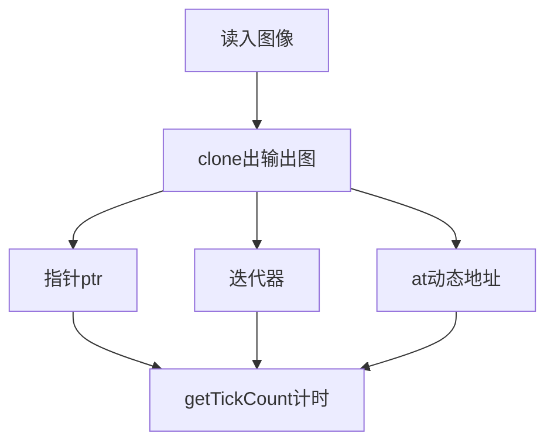
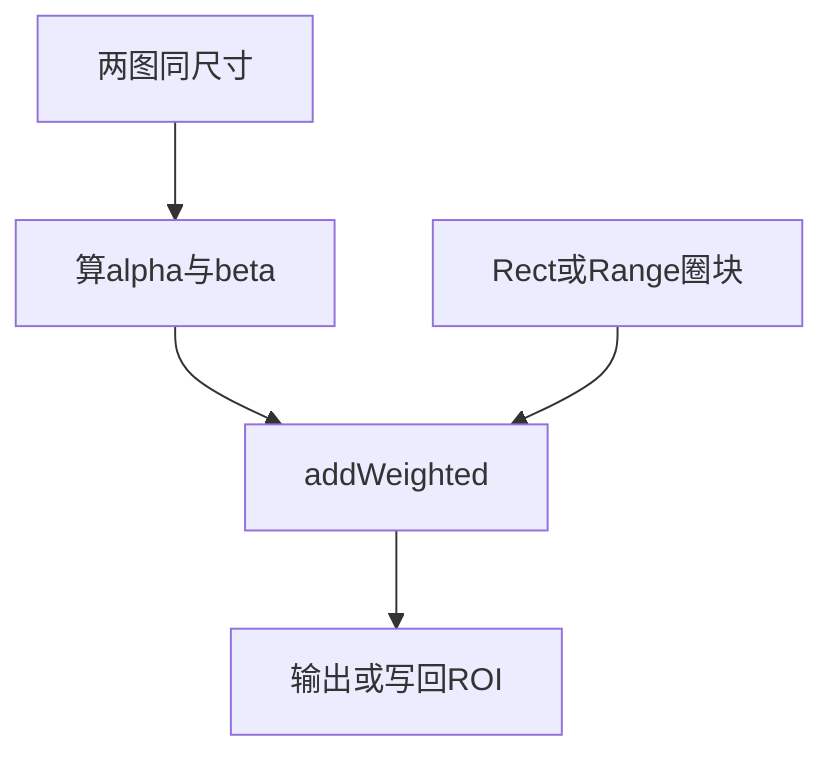
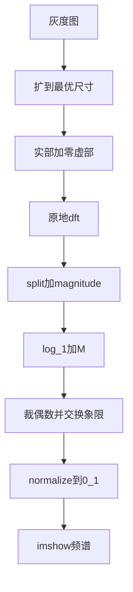

# 第五章 core 组件进阶

来源：《OpenCV3编程入门》（毛星云等，电子工业出版社，2015）

## 本章总览

这一章是第二部分「初探 core 组件」的第二站。章首导读列了八件事：怎么摸到像素、怎么圈 ROI、怎么做图像混合、怎么拆通道、怎么做多通道混合、怎么调对比度/亮度、怎么做离散傅里叶变换、怎么读写 XML/YAML。学完应能回答：三种访像素谁最快、`addWeighted` 两个图为什么必须同尺寸、拆开 BGR 后 logo 为什么只在某一通道显眼、频谱图为什么要交换象限。


本章示例程序编号 21–30：指针/迭代器/`at` 访像素、14 种遍历、初级混合、多通道混合、对比度亮度、DFT、XML/YAML 写与读。

## 核心知识点

### 像素在内存里怎么排

图是矩阵。灰度是一张二维表，一格一个数。彩色一列里紧挨着多个通道。OpenCV 彩色顺序是 **BGR**，不是 RGB。内存够时，行与行往往连成一条长带，扫起来更快；用 `isContinuous()` 检查是否连续。

### 颜色空间缩减，以及为什么先做表

8 位单通道 256 级；三通道约 1600 万种组合，算法会很重。书的缩减办法：把一段灰度并成一档。整数除法会截断，例如除数为 10：

\[
I_{new} = (I_{old} / 10) \times 10
\]

`I_old = 14` 得到 10。`uchar` 范围 0–255。每个像素都做乘除很贵，256 种输入可以先算好一张表，再按下标取值：

```cpp
table[i] = divideWith * (i / divideWith);
p[j] = table[p[j]];
```

官方文档更推荐现成的 **`LUT`**。书里用法：先做一张 `1×256`、`CV_8U` 的 `lookUpTable`，再用 `LUT(I, lookUpTable, J)` 把输入 `I` 映成输出 `J`。

【信息缺口：本章只给出 `LUT` 调用形态，没有单列完整 C++ 原型（参数名、是否还有第四个参数）。】

### 计时：`getTickCount` / `getTickFrequency`

`getTickCount()` 返回从某事件（如开机）起经过的时钟周期数。`getTickFrequency()` 返回每秒周期数。二者相除得到秒：

```
t0 = getTickCount()
……处理……
秒 = (getTickCount() - t0) / getTickFrequency()
```

### 三种访像素：指针、迭代器、`at`

书用颜色缩减当例子，公式写成带中点的量化：`值 / div * div + div / 2`。示例 `div = 32`。三种方法共用同一套 `main`：读 `1.jpg` → 按源图尺寸和类型造结果图 → 计时 → 调 `colorReduce` → 显示。

| 名称 | 功能 | 本章用到的写法 | 约束&坑点 |
|---|---|---|---|
| 指针 + `ptr` | 按行拿首地址，用 `[]` 扫 | `uchar* data = outputImage.ptr<uchar>(i)`；列数写成 `cols * channels()` | 书称**最快**。实验约 0.00665 秒。也可写成 `*data++ = ...`。抽象，越界风险大 |
| 迭代器 | 像 STL 一样从 `begin` 走到 `end` | `Mat_<Vec3b>::iterator`，`begin<Vec3b>()` / `end<Vec3b>()`；`(*it)[通道]` | 书称比指针**更安全**。实验约 0.2426 秒 |
| `at` 动态地址 | 按坐标取像素 | `outputImage.at<Vec3b>(i, j)[c]` | 书称直观。实验约 0.3341 秒。**类型必须编译期已知且与矩阵一致，`at` 不做类型转换** |

`channels()`：灰度 1，彩色 3。`Vec3b` 是三个 `unsigned char`，`[0]/[1]/[2]` 对应 **B/G/R**。

函数说明写的是 `at<type>(int y, int x)`，即先行后列。循环里 `i` 是行、`j` 是列，代码写成 `at<Vec3b>(i, j)`。同页说明另有一处写成 `at<Vec3b>(j, i)`，与循环代码不一致，以 `(y, x)` 说明和循环为准。

Debug 下三种方法速度差更明显，Release 下差得少一些。示例 24 来自一本国外 OpenCV2 书，封装了 14 种遍历，本章只点名、不展开那 14 种实现。



### ROI：圈一块，再叠上去

ROI 是只关心的那一块。用来缩小处理范围、省时间、提高针对性。两种圈法（第 3、4 章已见过，本章给了具体数字）：

| 圈法 | 本章写法 | 怎么读 |
|---|---|---|
| `Rect` | `image(Rect(x, y, logo.cols, logo.rows))` | 左上角 + 宽高。例：`(200, 250, logo宽, logo高)` |
| `Range` | `image(Range(行起, 行止), Range(列起, 列止))` | 终点不含。例：行 `250`～`250+logo.rows`，列 `200`～`200+logo.cols` |

圈出来的 `Mat` 和原图**共享像素**。改 ROI 就是改原图那一块。

掩膜叠加（`ROI_AddImage`）：

1. 读底图 `dota_pa.jpg`、logo `dota_logo.jpg`，空图则 `return false`。
2. 用 `Rect` 圈出和 logo 一样大的块。
3. 再以灰度读同一张 logo 当掩膜：`imread(..., 0)`。书强调**掩膜必须是灰度图**。
4. `logoImage.copyTo(imageROI, mask)`：掩膜非零处才拷过去。
5. `imshow` 看结果（图 5.3）。

### 线性混合与 `addWeighted`

两图按像素加权，典型公式：

\[
g(x) = (1 - \alpha)\, f_0(x) + \alpha\, f_1(x)
\]

\(\alpha\) 在 0～1 之间滑动，就是交叉淡入淡出。OpenCV 用更一般的加权和：

```cpp
void addWeighted(InputArray src1, double alpha, InputArray src2, double beta,
                 double gamma, OutputArray dst, int dtype=-1);
```

| 参数 | 含义 |
|---|---|
| `src1` | 第一幅输入，日常当 `Mat` |
| `alpha` | 第一幅的权重 |
| `src2` | 第二幅；**必须与 `src1` 同尺寸、同通道数** |
| `beta` | 第二幅的权重 |
| `gamma` | 加到每个和上的标量 |
| `dst` | 输出，尺寸和通道跟输入走 |
| `dtype` | 输出深度，默认 `-1`。两输入深度相同时，`-1` 表示与 `src1.depth()` 相同 |

公式：`dst = src1[I] * alpha + src2[I] * beta + gamma`。多通道时各通道独立算。

**输出深度不要用 `CV_32S`**，书称可能内存溢出或算错。

整图混合（`LinearBlending`）：`mogu.jpg` 与 `rain.jpg`，`alphaValue = 0.5`，`betaValue = 1 - alpha`，`gamma = 0.0`。两图类型、宽高必须一样，否则「多出来的部分没有搭档」，程序失败。图 5.4 / 5.5 是原图与混合结果。

ROI + 加权（`ROI_LinearBlending`，示例 25）：先圈块，再

`addWeighted(imageROI, 0.5, logoImage, 0.3, 0., imageROI)`

结果写回 ROI，等于只改那一块。图 5.6 / 5.7 是半透明 logo；图 5.8 / 5.9 是整图混合对照。



### 拆通道、合通道

整图 `addWeighted` 不够时，要把 BGR 拆开分别处理。

| 名称 | 功能 | 主要参数 | 约束&坑点 |
|---|---|---|---|
| `split` | 多通道拆成多个单通道 | 两套原型：`split(const Mat& src, Mat* mvbegin)`；`split(InputArray m, OutputArrayOfArrays mv)` | `mv[c](I) = src(I)_c`。结果常放进 `vector<Mat>` |
| `merge` | 多个单通道合成多通道 | `merge(const Mat* mv, size_t count, OutputArray dst)`；`merge(InputArrayOfArrays mv, OutputArray dst)` | `mv` 里每张图**同尺寸、同深度**。`count` 在 C 数组写法里必须大于 1。输出通道数是各输入通道数之和 |

`channels.at(0/1/2)` 对应 **B/G/R**。`Mat::at()` 返回的是引用，改它就是改原数组。

更复杂的通道抽取/重排，书点名 **`mixChannels()`**，本章不展开。

【信息缺口：`mixChannels` 本章只点名，没有原型和参数表。】

多通道混合（示例 26）流程：`split` → 对某一通道的 ROI 做 `addWeighted`（书中片段权重 1.0 / 0.5，位置 `Rect(385, 250, ...)`）→ `merge` 合回去。蓝、绿、红三段代码结构相同，只换 `channels.at(0/1/2)`。图 5.10–5.12 里，logo 在绿色通道很亮，蓝、红通道几乎看不见——说明这张 logo 主要能量在绿通道。

### 对比度与亮度：点运算

图像算子：输入一张或多张图，输出一张图。对比度、亮度属于**点运算**：输出只由当前像素（外加全局参数）决定。

\[
g(i, j) = a \cdot f(i, j) + b
\]

| 符号 | 书中的名字 | 作用 |
|---|---|---|
| \(a\)（\(a > 0\)） | 增益 gain | 控制**对比度** |
| \(b\) | 偏置 bias | 控制**亮度** |

彩色要三个通道各算一遍。本章用 `at<Vec3b>(y, x)[c]` 走三层循环。\(a\) 观察时常用 0.0～3.0 的浮点；滑动条是整数，所以 `g_nContrastValue` 取 0–300，再乘 `0.01`。

中间结果可能溢出或带小数，必须 **`saturate_cast<uchar>`**：小于 0 收成 0，大于 255 收成 255。

示例 27：对比度条 0–300，亮度条 0–200，初值都是 80；回调里重算并 `imshow`。主循环按 `'q'` 退出。图 5.14 截图是对比度 186、亮度 55。

5.4.1 正文有一处写成「GBR 图像」、通道顺序写成 G/B/R，随后代码和说明仍按 B/G/R。以 BGR 约定为准。

### 离散傅里叶变换

DFT 把空间域拆成正弦/余弦分量，变到频域。实用计算多用 FFT。二维公式书给出：

\[
F(k,l)=\sum_{i=0}^{N-1}\sum_{j=0}^{N-1} f(i,j)\, e^{-i 2\pi (ki/N + lj/N)}
\]

欧拉公式：\(e^{ix}=\cos x + i\sin x\)。结果是复数，可看成实部/虚部，或幅度/相位。多数处理只看**幅度图**（几何结构），但要做逆变换必须同时留幅度和相位。

| 频段 | 书中含义 |
|---|---|
| 高频 | 细节、纹理 |
| 低频 | 轮廓 |
| 低通 | 去掉高频，剩下轮廓 |

应用：增强与去噪、分割与边缘、特征提取、压缩。

| 名称 | 功能 | 主要参数 | 约束&坑点 |
|---|---|---|---|
| `dft` | 一维/二维浮点数组的正/逆变换 | `dft(src, dst, flags=0, nonzeroRows=0)` | `src` 可以是实或复。`nonzeroRows≠0` 时假定只有前 N 行非零，卷积场景用来省时间 |
| `getOptimalDFTSize` | 给出更快的 DFT 尺寸 | `int getOptimalDFTSize(int vecsize)` | 尺寸是 2、3、5 的幂次组合时最快 |
| `copyMakeBorder` | 扩边 | `copyMakeBorder(src, dst, top, bottom, left, right, borderType, value=Scalar())` | 输出尺寸 `cols+left+right` × `rows+top+bottom`。本章常用 `BORDER_CONSTANT`，`value` 默认当作 0 |
| `magnitude` | 二维矢量幅值 | `magnitude(x, y, magnitude)` | \(dst=\sqrt{x^2+y^2}\)。`x`/`y` 是浮点实部/虚部 |
| `log` | 各元素绝对值的自然对数 | `log(src, dst)` | \(src\neq 0\) 时 \(dst=\log\|src\|\)，否则为常数 C。书未说明 C 取多少 |
| `normalize` | 矩阵归一化 | `normalize(src, dst, alpha=1, beta=0, norm_type=NORM_L2, dtype=-1, mask=noArray())` | `norm_type`：`NORM_INF` / `NORM_L1` / `NORM_L2`（默认）/ `NORM_MINMAX`。`dtype=-1` 表示与源相同 |
| `mulSpectrums` | 两个傅里叶谱逐元素相乘 | 前两个输入，第三个输出 | 出现在卷积示意里，本章未单列完整原型 |

`dft` 的 `flags` 可组合。书中表格印成「表 6.1」（印在第 5 章）：

| 标识 | 含义 |
|---|---|
| `DFT_INVERSE` | 做逆变换，默认是正变换 |
| `DFT_SCALE` | 结果乘 \(1/N\)，常和逆变换一起用 |
| `DFT_ROWS` | 对每一行单独变换，用来摊薄多向量/高维变换的开销 |
| `DFT_COMPLEX_OUTPUT` | 实数组正变换，得到复数。因共轭对称，也可用同尺寸实矩阵表示 |
| `DFT_REAL_OUTPUT` | 复数组逆变换，结果常为实矩阵；输入若共轭对称则输出为实 |

卷积示意（`convolveDFT`，只记步骤）：按 `getOptimalDFTSize(A.cols+B.cols-1)` 定尺寸 → 零填充到临时缓冲 → `dft(..., nonzeroRows=A.rows)` → `mulSpectrums` → `dft(..., DFT_INVERSE + DFT_SCALE)` → 裁回结果。

示例 28 显示幅度谱的九步：

1. 灰度读 `1.jpg`（`imread(..., 0)`）。
2. `m/n = getOptimalDFTSize(行/列)`，`copyMakeBorder` 右侧和下侧补 0。
3. `planes[] = { float版 padded, 同尺寸全零 }`，`merge` 成复数图 `complexI`。
4. **原地** `dft(complexI, complexI)`。
5. `split` 出实部/虚部，`magnitude` 得到 \(M=\sqrt{Re^2+Im^2}\)。
6. 对数压缩：`M ← log(1+M)`（先 `+= Scalar::all(1)` 再 `log`）。幅度动态范围太大，直接显示会两极分化。
7. 裁成偶数边（`cols & -2`），把四个象限对角对调，让低频原点到画面中心。
8. `normalize(..., 0, 1, NORM_MINMAX)`。OpenCV2 写 `CV_MINMAX`。
9. `imshow("频谱幅值", ...)`。图 5.15 / 5.16 是原图与频谱。



`normalize` 参数表里，书把 `alpha` 和 `beta` 都写成「归一化后的最大值」。DFT 示例实际是 `alpha=0, beta=1, NORM_MINMAX`，按 0～1 可视范围来用。两处表述不完全对齐。

`copyMakeBorder` 其余 `borderType` 书指向 `borderInterpolate()`，本章只落实 `BORDER_CONSTANT`。

### XML / YAML：`FileStorage`

XML 是可自定义标签的元标记语言。YAML 原名 Yet Another Markup Language，后解释成 YAML Ain't a Markup Language，偏数据、可读性更高。扩展名 `.yml` 与 `.yaml` 都合法。二者能干同一类事，YAML 更「敏捷」。

`FileStorage` 能存 OpenCV 结构和整数、浮点、字符串。三步：打开 → 用 `<<` / `>>` 读写 → `release()` 关掉。析构时也会关。

```cpp
FileStorage::FileStorage();
FileStorage::FileStorage(const string& source, int flags, const string& encoding=string());
```

| 准备做什么 | 构造 | 或先默认构造再 `open` |
|---|---|---|
| 写 | `FileStorage fs("abc.xml", FileStorage::WRITE)` | `fs.open("abc.xml", FileStorage::WRITE)` |
| 读 | `FileStorage fs("abc.xml", FileStorage::READ)` | `fs.open(..., FileStorage::READ)` |

换扩展名即可写 YAML。`encoding` 本章未解释。

| 内容 | 怎么写 | 怎么读 |
|---|---|---|
| 数字/文本 | `fs << "iterationNr" << 100` | `fs["iterationNr"] >> itNr` 或 `(int)fs["iterationNr"]` |
| `Mat` 等结构 | `fs << "R" << R` | `fs["R"] >> R` |
| 序列（vector） | 用 `[` `]` 包起来 | 取出 `FileNode`，确认 `type()==FileNode::SEQ`，再用 `FileNodeIterator` |
| 映射（map） | 用 `{` `}` 包起来 | `FileNode` 下再按键取 |

示例 29 写入 `test.yaml`：`frameCount`、时间字符串、`cameraMatrix`（3×3）、`distCoeffs`（5×1）、`features` 序列（每项含 `x`/`y` 和 8 位 `lbp`）。写完必须 `fs.release()`。生成文件头是 `%YAML:1.0`，矩阵带 `!!opencv-matrix`。

书称把文件名改成 `.xml` / `.yml` / `.txt` 甚至 `.doc` 也能跑出结果。

示例 30 读回：`(int)fs2["frameCount"]`、`>>` 读日期和两个 `Mat`，再对 `features` 做 `FileNodeIterator`，嵌套字段 `(*it)["x"]`、`(*it)["lbp"] >> vector<uchar>`。图 5.17 标题写「配套示例程序第 30 个」，运行环境标 OpenCV 3.0.0-beta。

章末核心函数清单：`addWeighted`、`split`、`merge`、`dft`、`getOptimalDFTSize`、`copyMakeBorder`、`magnitude`、`log`、`normalize`、`FileStorage`。`LUT`、计时函数、`ptr`/`at`、`saturate_cast`、`mixChannels` 正文有讲，但未进这张清单。

## 容易混淆的点

- **三种访像素**：指针最快但不安全；迭代器安全但慢一个数量级；`at` 最慢、最好读。Debug / Release 差距不一样，不要只看 Debug 计时下结论。
- **`cols * channels()`**：指针法把一行当成一串 `uchar`，彩色一行有 `宽×3` 个数。迭代器和 `at` 按像素走，通道用 `[0/1/2]`。
- **`at(y, x)` 不是 `(x, y)`**：先行后列。书中有一处 `(j, i)` 与循环不一致。
- **ROI 是浅拷贝**：`copyTo` 或 `addWeighted` 写进 ROI，就是改原图。
- **掩膜叠加 ≠ 线性混合**：`copyTo(..., mask)` 是按掩膜硬贴；`addWeighted` 是两图按权重半透明。第 3 章预览例走的是后者。
- **`addWeighted` 两图必须同尺寸、同通道**：整图混合如此；ROI 混合则是「那一块」和 logo 一样大。`alpha + beta` 不必等于 1（ROI 例是 0.5 与 0.3）。
- **不要把输出深度设成 `CV_32S`**。
- **`split` 的 0/1/2 是 B/G/R**：和 `Scalar(a,b,c)`、`Vec3b` 同一套顺序。
- **增益 \(a\) 不是滑动条整数**：条上 0–300，真正乘数是 `×0.01`。亮度 \(b\) 是直接加的整数偏置。
- **`saturate_cast` 不是四舍五入装饰**：没有它，`a*f+b` 会溢出成怪颜色。
- **DFT 幅度不能直接 `imshow`**：先 `log(1+M)`，再把象限对调让低频居中，再归一化到 0～1。`imshow` 对 32F 会 ×255，所以 0～1 正好能看。
- **逆变换要幅度+相位**：只显示幅度图不等于能重建原图。
- **`CV_MINMAX` vs `NORM_MINMAX`**：2.x / 3.x 标识不同，和全书宏去 `CV_` 的路线一致。
- **`FileStorage` 的 `[` `]` / `{` `}` 是数据形态**，不是 C++ 数组语法。读序列前先查 `FileNode::SEQ`。
- **扩展名乱写也能跑**：书说 `.txt` / `.doc` 也能生成文件；这不代表那就是合法 YAML/XML 约定，只是本章示例的观察。

## 本章要点总结

- 访像素三条路：`ptr`（快）、迭代器（安全）、`at`（直观）；彩色按 BGR；缩减可手写表或 `LUT`。
- ROI 用 `Rect` 或 `Range`，与原图共享数据。掩膜贴图用灰度 mask + `copyTo`。
- `addWeighted(src1, alpha, src2, beta, gamma, dst, dtype=-1)`：`dst = src1*α + src2*β + γ`；两输入同尺寸同通道；输出深度避开 `CV_32S`。
- `split` / `merge` 拆合通道；多通道混合只改其中一个通道再合回去。
- 对比度亮度：`g = a*f + b`，滑动条整数要换算，结果用 `saturate_cast<uchar>` 夹到 0–255。
- DFT 显示链：扩到最优尺寸 → 实部+零虚部 → `dft` → 幅度 → 对数 → 换象限 → `NORM_MINMAX` 到 0～1。
- `FileStorage`：`WRITE`/`READ` + `<<`/`>>` + `release()`；序列用 `[]`，映射用 `{}`，嵌套用 `FileNodeIterator`。
- 示例 21–30 覆盖从像素到持久化的整条 core 进阶链。
