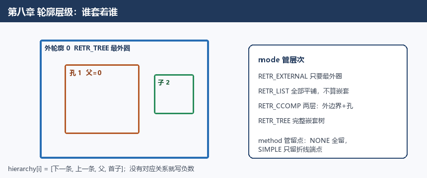
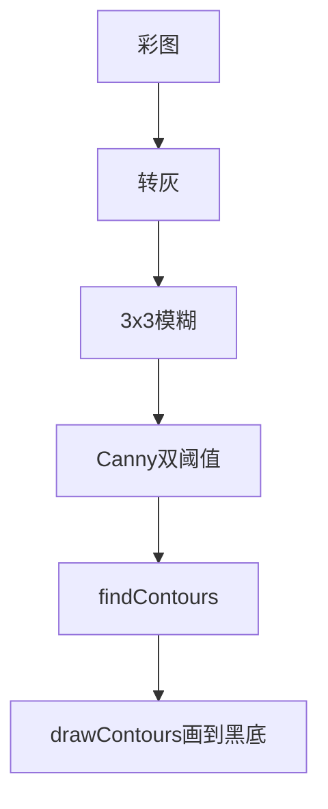
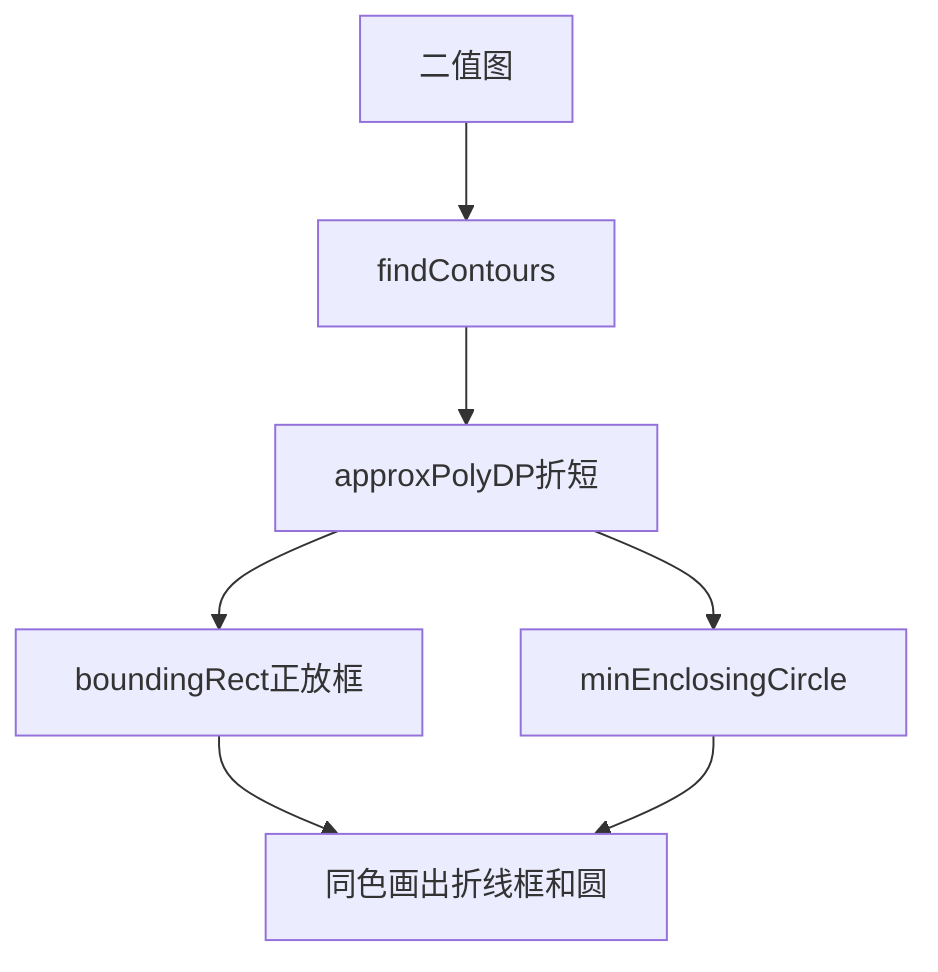
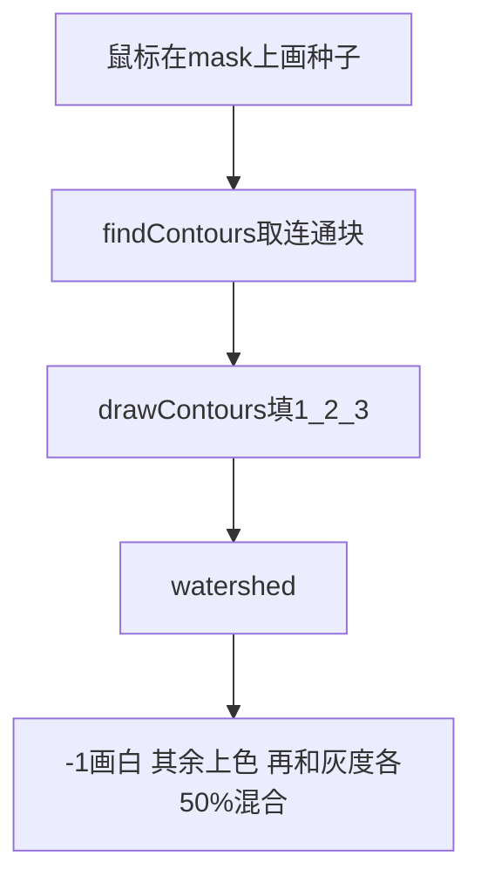
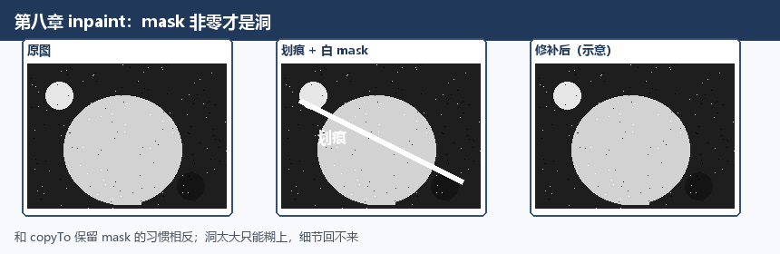

# 第八章 图像轮廓与图像分割修复

来源：《OpenCV3编程入门》（毛星云等，电子工业出版社，2015）
范围：书页 303–344（PDF 320–361）。未读第9章（书页 345 / PDF 362 起）。

## 本章总览

第七章用 Canny、Sobel 这类算子把“边像素”找出来；这一章把这些点收成一条条轮廓（contour）——把边界当成一个整体，而不只是一堆亮点。章首导读说：Canny 能按像素差异标出边界，但不会把轮廓当成对象来用。第六章已经讲过形态学、阈值、金字塔分割；本章再补两块后处理：分水岭分割和图像修补。

学完应能回答：`findContours` 为什么会改源图、检索 mode 和逼近 method 各管什么、正放外接矩形和最小旋转矩形差在哪、`m00` 和 `contourArea` 是不是一回事、分水岭的标记图里 0 和 −1 各表示什么、`inpaint` 的 mask 哪边才是要修的洞。

章首列出的学习目标：

- 怎么查找并绘制轮廓
- 怎么找物体的凸包
- 怎么用多边形去逼近/包住物体
- 认识图像的矩
- 怎么用 OpenCV 做图像修补

正文实际六块：轮廓查找与绘制、凸包、多边形包围、矩、分水岭、修补。


本章示例程序编号 69–78。

## 核心知识点

### 轮廓：把边像素收成一条线

轮廓可以想成：沿着物体外缘走一圈，记下经过的点。边缘检测给的是“这里可能是边”的像素图；轮廓检测要把这些点串成有序点列，还可以记住谁套着谁（层次）。

输入必须先变成二值图：非零当 1，零还是 0。书说可用 `compare`、`inRange`、`threshold`、`adaptiveThreshold`、`Canny` 从灰度或彩色做成这种图。

🔑 关键速记：轮廓是有序点列，还可以记嵌套；先有二值边，才有轮廓。

### 查找轮廓：`findContours`

```cpp
void findContours(InputOutputArray image,
                  OutputArrayOfArrays contours,
                  OutputArray hierarchy,
                  int mode, int method,
                  Point offset=Point());
```

下表对照会改源图、以及 mode / method 各管什么。

| 参数 | 含义 | 约束&坑点 |
|---|---|---|
| `image` | 源图 | 必须 8 位单通道。函数会改写源图，检测前要备份 |
| `contours` | 检出的轮廓 | 每个轮廓是一串点，类型上就是 `vector<vector<Point>>` |
| `hierarchy` | 拓扑关系 | 可选。对第 `i` 条轮廓，`hierarchy[i][0..3]` 分别是：同级下一条、同级上一条、父轮廓、第一个子轮廓（内孔）。没有对应关系就写负数 |
| `mode` | 检索模式 | 见表 8.1 |
| `method` | 轮廓近似办法 | 见表 8.2 |
| `offset` | 每个轮廓点都加的平移 | 轮廓从 ROI 里抽出来、还要画回整图时用。默认 `Point()` |

表 8.1 检索模式 `mode`：

| 标识 | 通俗理解 |
|---|---|
| `RETR_EXTERNAL` | 只要最外圈。所有轮廓的子、父两项写成 −1 |
| `RETR_LIST` | 所有轮廓平铺成一张表，不算谁套谁 |
| `RETR_CCOMP` | 所有轮廓，但只建两层：外边界一层，孔洞边界一层 |
| `RETR_TREE` | 所有轮廓，并还原完整嵌套树 |

表 8.2 逼近方法 `method`：

| 标识 | 通俗理解 |
|---|---|
| `CHAIN_APPROX_NONE` | 每个轮廓点都留下。相邻两点距离不超过 1 |
| `CHAIN_APPROX_SIMPLE` | 水平、竖直、对角线段只留端点。正放矩形只要 4 个点 |
| `CHAIN_APPROX_TC89_L1` / `CHAIN_APPROX_TC89_KCOS` | Teh-Chin 链码近似的两种变体 |

OpenCV2 要在表 8.1、8.2 的宏前面加 `CV_`，例如 `CV_RETR_CCOMP`、`CV_CHAIN_APPROX_NONE`。

调用形态（书中演示）：`findContours(image, contours, CV_RETR_EXTERNAL, CV_CHAIN_APPROX_NONE)`。综合例常用 OpenCV3 写法：`RETR_TREE` + `CHAIN_APPROX_SIMPLE`。



🔑 关键速记：会改写 8 位单通道源图；`mode` 管层次，`method` 管留点。

### 绘制轮廓：`drawContours`

```cpp
void drawContours(InputOutputArray image,
                  InputArrayOfArrays contours,
                  int contourIdx, const Scalar& color,
                  int thickness=1, int lineType=8,
                  InputArray hierarchy=noArray(),
                  int maxLevel=INT_MAX,
                  Point offset=Point());
```

下表对照全画、填实与线型。

| 参数 | 含义 | 约束&坑点 |
|---|---|---|
| `image` | 画到哪张图上 | 通常是 `Mat` |
| `contours` | 轮廓集合 | `vector` 套 `vector<Point>` |
| `contourIdx` | 画第几条 | 负数表示全画 |
| `color` | 颜色 | `Scalar` |
| `thickness` | 线宽，默认 1 | 负数（`FILLED` / OpenCV2 的 `CV_FILLED`）表示把轮廓内部填实 |
| `lineType` | 线型 | 见表 8.3，默认 8 |
| `hierarchy` | 拓扑 | 可选，默认 `noArray()` |
| `maxLevel` | 最多画到第几层嵌套 | 0 只画指定那条；1 再带一层子轮廓。默认 `INT_MAX` |
| `offset` | 整体平移 `(dx, dy)` | 默认 `Point()` |

表 8.3 可选线型（本章给的就是第 4 章指向的那张表）：

| 取值 | 含义 |
|---|---|
| `8`（默认） | 8 连通线 |
| `4` | 4 连通线 |
| `LINE_AA`（OpenCV2 写 `CV_AA`） | 抗锯齿线 |

要点：白底黑线全画可写成 `drawContours(result, contours, -1, Scalar(0), 3)`。

🔑 关键速记：`contourIdx<0` 全画；`thickness` 负/`FILLED` 填实；`lineType=8` 不是线宽 8。

### 示例 69–70：轮廓查找与综合绘制

示例 69（基础）：灰度读图 → `srcImage = srcImage > 119` 做成二值 → 准备 `vector<vector<Point>>` 和 `vector<Vec4i>` → `findContours(..., RETR_CCOMP, CHAIN_APPROX_SIMPLE)` → 顺着 `hierarchy[index][0]` 走同级轮廓，每条随机色，`drawContours(..., FILLED, 8, hierarchy)`。效果示意：荷叶剪影一类高对比图，阈值后叶子轮廓被填成彩色块。

示例 70（综合）：彩图 → `COLOR_BGR2GRAY` → `blur(..., Size(3,3))` → Canny（初值 80，高阈值取低阈值×2，孔径 3）→ `findContours(..., RETR_TREE, CHAIN_APPROX_SIMPLE)` → 在全黑 `CV_8UC3` 上逐条画线宽 2、线型 8。阈值 0 时轮廓密得像蜘蛛网；80 能勾出易拉罐外形和字；187 只剩碎片。



🔑 关键速记：先二值或 Canny，再 `findContours`；门槛越低轮廓越碎、越密。

### 凸包：最外一圈橡皮筋

凸包（convex hull）：把二维点集最外面的点连起来，得到能包住全部点的最小凸多边形。可以想成：在钉子上套一根橡皮筋，松手后橡皮筋的形状。

书还提到凸缺陷（convexity defects）：真实轮廓往里凹、和凸包之间空出来的那一块。手掌图里，手指缝就是凸缺陷；可以用来描述手势。本章只把概念讲清楚，没有单列 `convexityDefects` 函数专节。

#### `convexHull`

```cpp
void convexHull(InputArray points, OutputArray hull,
                bool clockwise=false, bool returnPoints=true);
```

下表对照绕向与返回坐标还是下标。

| 参数 | 含义 | 约束&坑点 |
|---|---|---|
| `points` | 输入二维点集 | `Mat` 或 `std::vector` |
| `hull` | 输出凸包 | 点坐标或原数组下标，看下面两个开关 |
| `clockwise` | 方向 | `true` 顺时针，`false`（默认）逆时针。书假定坐标系 x 向右、y 向上 |
| `returnPoints` | 返回什么 | `true`（默认）返回点坐标；`false` 返回在原点集里的整数下标。输出若是 `std::vector`，这个开关会被忽略 |

示例 71（基础）：黑底 600×600 → 随机 3～103 个点（落在图中央 1/4～3/4）→ `vector<int> hull` + `convexHull(Mat(points), hull, true)` → 点画成小实心圆，再按下标把凸包连成白线。

示例 72（综合）：彩图转灰、3×3 模糊 → 滑动条阈值（初值 50）`THRESH_BINARY` → `findContours(..., RETR_TREE, CHAIN_APPROX_SIMPLE)` → 对每条轮廓 `convexHull(Mat(g_vContours[i]), hull[i], false)` → 原轮廓和凸包用同一随机色各画一遍。阈值变大，细节轮廓消失，凸包也跟着变粗、变少。

🔑 关键速记：输出若是 `vector`，`returnPoints` 会被忽略；`clockwise` 按 x 右 y 上讲。

### 用多边形包住轮廓

点集（或一条轮廓）可以用更简单的几何形状去“框”：正放矩形、可旋转最小矩形、最小圆、拟合椭圆，或用折线把轮廓折短。

```cpp
Rect boundingRect(InputArray points);
RotatedRect minAreaRect(InputArray points);
void minEnclosingCircle(InputArray points, Point2f& center, float& radius);
RotatedRect fitEllipse(InputArray points);
void approxPolyDP(InputArray curve, OutputArray approxCurve,
                  double epsilon, bool closed);
```

下表对照五种包围/逼近。

| 名称 | 功能 | 主要参数 | 约束&坑点 |
|---|---|---|---|
| `boundingRect` | 正放外接矩形（边平行于坐标轴） | 二维点集，`vector` 或 `Mat` | 返回 `Rect`，不一定面积最小 |
| `minAreaRect` | 面积最小的外接矩形，可以旋转 | 同上 | 返回 `RotatedRect`；画出来要用 `box.points(vertex)` 取出四个角再 `line` 连 |
| `minEnclosingCircle` | 面积最小的外接圆（迭代算法） | 点集；圆心、半径用引用带回 | 返回 `void`，结果不在返回值里 |
| `fitEllipse` | 用椭圆去拟合二维点集 | 点集 | 返回 `RotatedRect`（椭圆用旋转矩形表示） |
| `approxPolyDP` | Douglas-Peucker 折线逼近 | `epsilon`：原曲线与折线的最大允许距离；`closed`：是否闭合（首尾相连） | 输出类型跟输入一致 |

要点：示例 73 用随机点 + `minAreaRect` → `box.points` 取四顶点 → 青色线连成旋转矩形。示例 74 换成 `minEnclosingCircle(Mat(points), center, radius)`，再 `circle(..., cvRound(radius), ..., 2, LINE_AA)`。

示例 75（综合，度假屋图）：转灰、模糊、滑动条二值 → `findContours(..., RETR_TREE, CHAIN_APPROX_SIMPLE)` → 对每条轮廓依次：

1. `approxPolyDP(Mat(contours[i]), contours_poly[i], 3, true)`（精度 3，闭合）
2. `boundingRect(Mat(contours_poly[i]))`
3. `minEnclosingCircle(contours_poly[i], center[i], radius[i])`

然后在黑底上画折线轮廓、`rectangle(..., tl(), br())`、外接圆。阈值 21 时小屋被框得较碎；阈值抬到 55、103，框会变少、变粗。



🔑 关键速记：`boundingRect` 正放；`minAreaRect` 可旋转且更紧；`minEnclosingCircle` 用引用带回圆心半径。

### 图像的矩：用几个数概括形状

矩是形状的全局特征，能反映大小、位置、朝向。书的粗分：

- 一阶：和形状位置有关
- 二阶：形状相对某条均值线铺开得有多远
- 三阶：相对均值的对称性

由二阶、三阶还能推出 7 个不变矩，平移、缩放、旋转后数值仍不变，常拿去做识别。本章只点到这个概念，没有单列 Hu 矩函数专节。

#### `moments` / `contourArea` / `arcLength`

```cpp
Moments moments(InputArray array, bool binaryImage=false);
double contourArea(InputArray contour, bool oriented=false);
double arcLength(InputArray curve, bool closed);
```

下表对照面积、周长与重心。

| 名称 | 功能 | 主要参数 | 约束&坑点 |
|---|---|---|---|
| `moments` | 算到三阶的全部矩，后续可取重心、面积、主轴等 | `array`：单通道 8 位/浮点光栅，或 1×N / N×1 点集；`binaryImage=true` 时非零像素当 1，只对图像输入有效 | 返回 `Moments`。示例里重心：\(x=m_{10}/m_{00}\)，\(y=m_{01}/m_{00}\) |
| `contourArea` | 整条或一段轮廓的面积 | `oriented=true` 返回带符号面积，符号跟绕行方向（顺/逆时针）有关，可判断朝向；默认 `false` 取绝对值 | 书中小例子：先算原轮廓面积，再 `approxPolyDP` 后算一次，顶点数会变 |
| `arcLength` | 闭合轮廓的周长，或曲线长度 | `closed`：是否按闭合曲线算 | 示例 76 调用写成 `arcLength(..., true)`。书页 328 末行对 `closed` 的逐字说明落在页缝，本章以原型和示例用法为准 |

示例 76：彩图转灰、3×3 模糊 → Canny（低阈值可调，高阈值×2，孔径 3）→ `findContours(..., RETR_TREE, CHAIN_APPROX_SIMPLE)` → 每条 `moments(..., false)` 算重心并画实心圆（半径 4）→ 控制台对比 `mu[i].m00` 与 `contourArea`，并打印 `arcLength(..., true)`。书中截图里两者面积一致（例如都是 1.50、12.00）。阈值 100 时船和山脊轮廓较干净；降到 40 细节（水纹、船内结构）变多，打印的轮廓编号也更多。

🔑 关键速记：重心 \(m_{10}/m_{00}\)、\(m_{01}/m_{00}\)；`arcLength` 的 `closed` 逐字说明落在书页 328 页缝。

### 分水岭：从低处往上灌水

把灰度图当成地形：灰度是海拔。低洼均匀区是集水盆，高亮边缘是山脊 / 分水岭。想象在每个局部最低点戳一个洞，整座“地形”慢慢浸水；两个盆的水快要汇到一起时，就垒一道坝——这些坝就是分割线。

书提到 L. Vincent 的经典实现：先按灰度从低到高排序，再用 FIFO 按高度层给每个局部最小的影响区打标签。实务上常先算梯度，让边缘变成高脊；再从指定或自动找到的标记（种子）开始灌。

#### `watershed`

```cpp
void watershed(InputArray image, InputOutputArray markers);
```

下表对照彩色源图与 `CV_32S` 标记里的 0 / −1。

| 参数 | 含义 | 约束&坑点 |
|---|---|---|
| `image` | 源图 | 必须 8 位三通道彩色 |
| `markers` | 标记图，既是输入也是输出 | 与源图同尺寸的 32 位单通道（`CV_32S`）。输入时：正整数 1、2、3… 是各种子连通域，0 表示还没标记。输出时：属于多种子的像素写成对应种子值，区域交界写成 −1 |

种子可以从二值 mask 上 `findContours` + `drawContours` 得到。

示例 77 流程（不要当可运行工程抄）：

1. 读彩图，mask 先全 0
2. 鼠标左键在图上拖白线（线宽 5），同时画到 mask 和显示图
3. 对 mask `findContours`（示例仍写 `CV_RETR_CCOMP`、`CV_CHAIN_APPROX_SIMPLE`）→ 每条轮廓用递增整数填进 `CV_32S` 标记图 → `watershed(src, markers)` → 像素值 −1 画白、越界画黑、其余按随机色上色 → 分割色图与灰度原图各乘 0.5 叠在一起显示
4. 可恢复原图

效果示意：雪山照片上先随手划几笔标出峰、云、天空、坡，跑完后山脊和天空被切开。



🔑 关键速记：源图须 8 位三通道，标记须 `CV_32S`；输入 0=未标，输出 −1=坝。

### 图像修补：用周围颜色把洞抹平

镜头上的灰、旧照片划痕、画面里不想要的字，都可以当成“破洞”。图像修补（inpainting）从破洞边缘把颜色和结构往里推，把洞填上。破得太大，填出来会糊，书用大片涂鸦说明：字能去掉，云的细节回不来。

#### `inpaint`

```cpp
void inpaint(InputArray src, InputArray inpaintMask,
             OutputArray dst, double inpaintRadius, int flags);
```

下表对照 mask 非零才是洞。

| 参数 | 含义 | 约束&坑点 |
|---|---|---|
| `src` | 源图 | 8 位单通道或三通道 |
| `inpaintMask` | 修补掩膜 | 8 位单通道；非零像素才是要修的区域 |
| `dst` | 输出 | 与源图同尺寸、同类型 |
| `inpaintRadius` | 每个待修点周围、算法要看的圆邻域半径 | 示例 78 写成 `3` |
| `flags` | 算法标识 | 见表 8.4 |

表 8.4 修补方法：

| 标识 | 含义 |
|---|---|
| `INPAINT_NS` | 基于 Navier-Stokes 方程 |
| `INPAINT_TELEA` | Alexandru Telea 方法 |

OpenCV2 可写成 `CV_INPAINT_NS` / `CV_INPAINT_TELEA`。修补在 `photo.hpp` 里，示例单独 `#include "opencv2/photo/photo.hpp"`。

示例 78：克隆原图 + 全 0 的 `CV_8U` mask → 鼠标拖白线同时画到 mask 和显示图（线宽 5）→ `inpaint(src, mask, dst, 3, INPAINT_TELEA)` → 可清 mask 并拷回原图。夜景图上写 “I love OpenCV”，修完字消失，远处灯带还能对上。



🔑 关键速记：mask 非零才是洞；半径示例为 3；头文件在 `photo.hpp`。

### 章末清单（8.7）

核心函数：`findContours`、`drawContours`、`convexHull`、`boundingRect`、`minAreaRect`、`minEnclosingCircle`、`fitEllipse`、`approxPolyDP`、`moments`、`contourArea`、`arcLength`、`watershed`、`inpaint`。

示例 69–78 依次对应：轮廓查找、查找并绘制、凸包基础、寻找绘制凸包、矩形边界、圆形边界、多边形包围、轮廓矩、分水岭、图像修补。

本章未指向尚未处理的其他章节专节。【本章未登记新的跨章待补全。】

🔑 关键速记：8.7 清单覆盖从轮廓到修补的十三条 API；综合例只提炼流程。

## 易混淆点&差异对比

- **边缘 vs 轮廓**：Canny 给出的是“可能是边”的像素图；`findContours` 把这些点收成有序曲线，还可以记嵌套关系。先有二值边，才有轮廓。
- **`mode` vs `method`**：`RETR_*` 管“要哪些轮廓、层次怎么建”；`CHAIN_APPROX_*` 管“一条轮廓留多少点”。两套开关不要混用。
- **`boundingRect` vs `minAreaRect`**：前者边永远水平/竖直，框可能偏大；后者可以斜着放，面积更紧。画旋转框必须先 `RotatedRect::points` 取出四个角。
- **`contourArea` vs `moments.m00`**：示例 76 打印两者相等，都表示面积；`oriented=true` 时面积带符号，`m00` 那条对照用的是默认绝对值路径。`arcLength` 是周长，不是面积。
- **`findContours` 会改源图**：和“只读边缘图”的直觉相反，调用前要备份。`HoughLines` 要二值边、`HoughCircles` 要灰度，轮廓同样要二值，但还会把这张二值图写坏。
- **`thickness` vs `lineType`**：负数/`FILLED` 是填实；`8`/`4`/`LINE_AA` 是怎么连邻域、要不要抗锯齿。`lineType=8` 不是线宽 8。
- **分水岭标记里的 0 和 −1**：输入 0 = 还没指定属于谁；输出 −1 = 坝（分割线）。种子必须是正整数。源图必须是彩色三通道，标记必须是 `CV_32S`。
- **修补 mask 的极性**：`inpaint` 里非零才是洞。这和“mask 为 1 表示保留”的 `copyTo` 习惯刚好反着。
- **`convexHull` 的顺时针**：书按 y 轴向上解释 `clockwise`；图像坐标通常 y 向下，方向观感可能和纸面几何相反。输出容器若是 `vector`，`returnPoints` 会被忽略——要下标就准备 `vector<int>`，要点就准备 `vector<Point>`。

## 本章要点总结

- 轮廓检测吃 8 位单通道二值图，且会改写输入。`RETR_EXTERNAL` 只要最外圈，`RETR_LIST` 平铺，`RETR_CCOMP` 两层（外轮廓+孔），`RETR_TREE` 建整棵嵌套树。`CHAIN_APPROX_NONE` 留全部点，`CHAIN_APPROX_SIMPLE` 只留折线端点。
- `drawContours` 的 `contourIdx<0` 画全部；`thickness<0` / `FILLED` 填实；线型表 8.3：`8` 八连通、`4` 四连通、`LINE_AA` 抗锯齿（2.x 写 `CV_AA`）。
- 凸包是包住点集的最小凸多边形。`clockwise` 管绕向，`returnPoints` 管返回坐标还是下标。
- 框轮廓：`boundingRect` 正放，`minAreaRect` 可旋转且面积更小，`minEnclosingCircle` 用引用带回圆心半径，`fitEllipse` 拟合椭圆，`approxPolyDP` 按 `epsilon` 折短折线。
- 矩算到三阶；重心 \( (m_{10}/m_{00},\, m_{01}/m_{00}) \)。`contourArea` 算面积，`arcLength(..., true)` 算闭合周长。二阶、三阶可导出 7 个不变矩，本章只介绍概念。
- `watershed`：彩色图 + `CV_32S` 种子图；0 未标记，正整数是种子，结果里 −1 是分水岭。示例靠鼠标划线当种子。
- `inpaint`：8 位图 + 单通道 mask（非零为待修），半径示例为 3；`INPAINT_NS` / `INPAINT_TELEA`（2.x 加 `CV_`）。头文件在 `photo.hpp`。洞太大只能糊上，不能凭空长回细节。
- 示例 69–78：阈值/Canny 找轮廓、填色、凸包、旋转矩形、最小圆、折线+正放框+圆、矩与面积周长对照、鼠标分水岭、鼠标修补。综合例只提炼流程，不写可运行工程。
