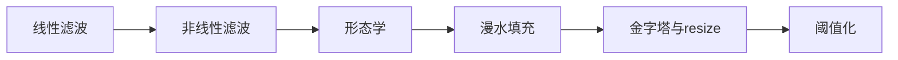
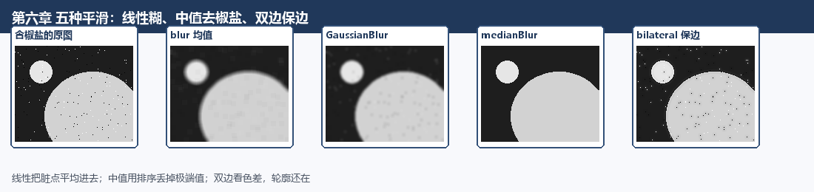
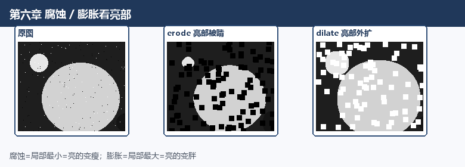
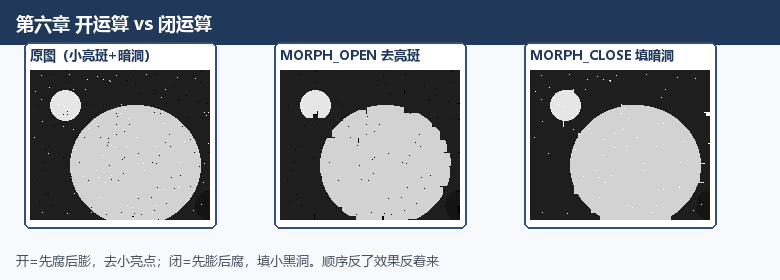
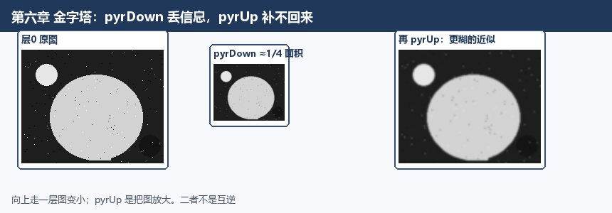

# 第六章 图像处理

来源：《OpenCV3编程入门》（毛星云等，电子工业出版社，2015）
范围：书页 153–245（PDF 170–262）。未读第7章（书页 247 / PDF 264 起）。

## 本章总览

这一章是第三部分「掌握 imgproc 组件」的第一站。前面几章把图当成数组、窗口和像素盒子来摆弄；这一章开始把图当成“要处理的画面”：糊掉噪声、啃掉毛刺、灌色、缩放、切成黑白。

学完应能回答：`blur` 和 `boxFilter` 差在哪、为什么中值更吃椒盐噪声、开运算和闭运算谁先腐蚀、`floodFill` 的 mask 为什么要比图大两圈、`pyrUp` 为什么补不回 `pyrDown` 丢掉的细节。

章首导读列出的学习目标：

- 三种线性滤波：方框、均值、高斯
- 两种非线性滤波：中值、双边
- 七种形态学：腐蚀、膨胀、开、闭、形态学梯度、顶帽、黑帽
- 漫水填充
- 图像缩放与图像金字塔
- 阈值化



本章示例程序编号 31–55。

## 核心知识点

### 滤波和模糊不是同一个词

平滑 / 模糊：用邻域把像素抹平，常用来降噪，或在降分辨率之前先软化一下。邻域越大越糊，边缘也越容易丢。

滤波更宽：按频率把不想要的成分压下去。图像能量多在中低频，噪声常在高频，所以平滑滤波本质是低通。

书里把滤波的两个目标写成：抽出特征给识别用；去掉数字化过程带进来的噪声。两个要求：尽量别伤轮廓和边缘；看起来还清楚。

滤波器可以想成一扇带权重的小窗，往图上挪。每个输出像素是邻域的加权和，这叫线性邻域滤波 / 卷积：

\[
g(i,j)=\sum_{k,l} f(i+k,j+l)\,h(k,l)
\quad\text{或简写}\quad
g=f\otimes h
\]

\(h\) 就是核（kernel），也叫权重系数。

线性滤波器按通过的频带分：低通、高通、带通、带阻、全通、陷波。高斯滤波用的是高斯函数当核；高斯模糊专指高斯低通，高斯高通反而是锐化。所以“滤波 ≠ 一定糊”。

OpenCV 常见五种平滑：`boxFilter`、`blur`、`GaussianBlur`（线性）、`medianBlur`、`bilateralFilter`（非线性）。

🔑 关键速记：平滑是低通；高斯高通是锐化，所以滤波不一定等于糊。

### 方框滤波：`boxFilter`

核里全是 1，再乘一个系数 \(\alpha\)：

- `normalize=true`（默认）：\(\alpha=1/(\text{宽}\times\text{高})\)，就是均值滤波
- `normalize=false`：\(\alpha=1\)，窗口求和，不做平均；书称密光流里算导数协方差会用到

```cpp
void boxFilter(InputArray src, OutputArray dst, int ddepth, Size ksize,
               Point anchor=Point(-1,-1), bool normalize=true,
               int borderType=BORDER_DEFAULT);
```

下表按参数拆开这条七参数原型。

| 参数 | 含义 | 约束&坑点 |
|---|---|---|
| `src` | 输入图 | 通道各自处理。深度：`CV_8U` / `16U` / `16S` / `32F` / `64F` |
| `dst` | 输出图 | 与源同尺寸、同类型 |
| `ddepth` | 输出深度 | `-1` 表示跟 `src.depth()` 一样 |
| `ksize` | 核大小 | 写成 `Size(宽, 高)`，如 `Size(5,5)` |
| `anchor` | 锚点（被平滑的那个点） | 默认 `(-1,-1)` 表示核中心 |
| `normalize` | 是否按面积归一化 | `true` 时与均值滤波等价 |
| `borderType` | 越界像素怎么外推 | 默认 `BORDER_DEFAULT`，书称一般不用改 |

要点：调用形态 `boxFilter(image, out, -1, Size(5, 5));`。书还点到：变窗口求和也可以用 `integral()`。

【信息缺口：本章未展开 `integral` 原型。】

🔑 关键速记：`normalize=true` 时 \(\alpha=1/(w\times h)\)，与均值相同；`false` 时只做窗口求和。

### 均值滤波：`blur`

最简单的线性滤波：邻域里每个点权重一样，输出是平均值。`blur` 内部就是调 `boxFilter`。官方核就是归一化后的全 1 矩阵。

缺陷：噪声被平均进结果里，细节一起糊掉；对付脉冲噪声（孤立脏点）不理想。

```cpp
void blur(InputArray src, OutputArray dst, Size ksize,
          Point anchor=Point(-1,-1), int borderType=BORDER_DEFAULT);
```

下表对照 `blur` 的五个参数。

| 参数 | 含义 | 约束&坑点 |
|---|---|---|
| `src` | 输入图 | 通道独立。深度同上：`CV_8U` / `16U` / `16S` / `32F` / `64F` |
| `dst` | 输出图 | 同尺寸同类型。书建议可用 `clone` 先占坑 |
| `ksize` | 核大小 | `Size(w, h)`，如第一章的 `Size(7, 7)` |
| `anchor` | 锚点 | 默认中心；坐标为负也表示用中心 |
| `borderType` | 边界外推 | 默认 `BORDER_DEFAULT` |

要点：第一章 `blur(src, dst, Size(7,7))` 就是这里的三参数最常用写法。综合示例里核写成 `Size(滑条值+1, 滑条值+1)`，可以为偶数。

🔑 关键速记：`blur` 内部即归一化 `boxFilter`；没有 `ddepth` 和 `normalize`。

### 高斯滤波：`GaussianBlur`

还是加权平均，但越靠近中心权重越大，权重按高斯分布。适合压高斯噪声。看起来像隔着半透明屏，不是镜头散景那种圈。数学上是图与正态分布做卷积，傅里叶变换后还是高斯，所以是低通。

一维零均值：\(G(x)=\exp(-x^2/(2\sigma^2))\)。\(\sigma\) 越大，鼓包越宽，糊得越狠。

```cpp
void GaussianBlur(InputArray src, OutputArray dst, Size ksize,
                  double sigmaX, double sigmaY=0, int borderType=BORDER_DEFAULT);
```

下表对照核尺寸与两个 sigma 谁推谁。

| 参数 | 含义 | 约束&坑点 |
|---|---|---|
| `src` / `dst` | 输入 / 输出 | 深度与 `blur` 相同；`dst` 同尺寸同类型 |
| `ksize` | 高斯核尺寸 | 宽高须为正奇数，或为 0。为 0 时由 sigma 推算 |
| `sigmaX` | X 方向标准差 | |
| `sigmaY` | Y 方向标准差 | 为 0 则等于 `sigmaX`；两者都为 0 则由 `ksize` 推算 |
| `borderType` | 边界外推 | 默认 `BORDER_DEFAULT` |

要点：书建议最好把 `ksize`、`sigmaX`、`sigmaY` 都写明白。示例常写 `GaussianBlur(image, out, Size(5,5), 0, 0)`，让库按核去算 sigma。综合示例里核必须保持奇数，所以写成 `Size(滑条值*2+1, 滑条值*2+1)`。源码剖析结论：内部是 `createGaussianFilter` 再 `apply`。

示例 31–34：分别演示方框 / 均值 / 高斯，再加一条三窗综合例。方框和均值的核用 `值+1`，高斯用 `值*2+1`。

🔑 关键速记：核宽高须为正奇数或 0；两个 sigma 都为 0 则由 `ksize` 反推。

### 非线性滤波：中值与双边

线性滤波的输出是邻域加权和。碰上“椒盐 / 脉冲”这种偶尔蹦出来的大脏点，高斯只会把脏点抹成一片颗粒，去不干净。这时换非线性。

#### 中值滤波：`medianBlur`

把邻域灰度排个序，用中位数替换中心点。奇数窗口直接取中间那个；偶数窗口取中间两个的平均。孤立脏点很难排到正中间，所以对斑点、椒盐、扫描噪声很有效，边缘也比均值保得住。

代价：书称比均值慢五倍以上。细线、尖点多的图不适合，容易被当成噪声吃掉。

```cpp
void medianBlur(InputArray src, OutputArray dst, int ksize);
```

下表对照孔径与深度约束。

| 参数 | 含义 | 约束&坑点 |
|---|---|---|
| `src` | 输入图 | 1 / 3 / 4 通道。`ksize` 为 3 或 5 时深度可以是 `CV_8U` / `16U` / `32F`；更大孔径只支持 `CV_8U` |
| `dst` | 输出图 | 同尺寸同类型。支持原地 |
| `ksize` | 孔径边长 | 必须是大于 1 的奇数：3、5、7、9… |

要点：调用形态 `medianBlur(image, out, 7);`。综合示例写成 `medianBlur(..., 滑条值*2+1)`，保证奇数。

🔑 关键速记：`ksize` 必须是大于 1 的奇数；孔径大于 5 时深度只支持 `CV_8U`。

#### 双边滤波：`bilateralFilter`

同时看两件事：空间上近不近，颜色上像不像。权重是定义域核（距离）和值域核（灰度差）的乘积：

\[
\omega(i,j,k,l)=\exp\left(-\frac{(i-k)^2+(j-l)^2}{2\sigma_d^2}-\frac{\|f(i,j)-f(k,l)\|^2}{2\sigma_r^2}\right)
\]

隔着一条边、颜色差很大的点，值域权重接近 0，所以边能留下来。短处：高频细节也留着，彩色图里的高频噪声反而去不干净。

```cpp
void bilateralFilter(InputArray src, OutputArray dst, int d,
                     double sigmaColor, double sigmaSpace,
                     int borderType=BORDER_DEFAULT);
```

下表对照直径与两个 sigma。

| 参数 | 含义 | 约束&坑点 |
|---|---|---|
| `src` | 输入图 | 8 位或浮点；单通道或三通道 |
| `dst` | 输出图 | 同尺寸同类型 |
| `d` | 邻域直径 | 非正数时由 `sigmaSpace` 推算 |
| `sigmaColor` | 颜色空间 sigma | 越大，邻域里更多颜色会被混在一起 |
| `sigmaSpace` | 坐标空间 sigma | 越大，更远的点也能互相影响（颜色还得够像）。`d>0` 时邻域大小听 `d`，不再听 `sigmaSpace` |
| `borderType` | 边界外推 | 默认 `BORDER_DEFAULT` |

要点：书中示范 `bilateralFilter(image, out, 25, 25*2, 25/2);` 即直径 25、颜色 sigma 50、空间 sigma 12。综合示例同样按 `d / 2d / d/2` 绑在同一条滑条上。

示例 35–37：中值、双边，再加五滤波对照窗（方框 / 均值 / 高斯 / 中值 / 双边）。效果上：线性三种都糊；中值去脏点但纹理会“油画化”；双边最贴近原图，皮肤一类区域被抹平、轮廓还在。



🔑 关键速记：双边看距离×色差，边能留；高频噪声往往去不干净。

### 形态学（1）：膨胀与腐蚀

书里的“形态学”指数学形态学。最底层两步是膨胀和腐蚀，后面开闭梯度顶帽黑帽都是它们的组合。用途：去噪、拆开或粘上邻近团块、找局部最大/最小、算梯度。

重要约定：操作对象是亮的那一边，不是暗的那一边。

- 膨胀 `dilate`：邻域里取局部最大。亮区域往外长。
- 腐蚀 `erode`：邻域里取局部最小。亮区域被啃一圈。

\[
dst(x,y)=\max_{\text{核非零}} src(x+x',y+y')
\quad/\quad
dst(x,y)=\min_{\text{核非零}} src(x+x',y+y')
\]

核（结构元）是一块小模板，有锚点；常见是实心方块或圆盘，锚在中心。源码剖析结论：`erode` / `dilate` 都只是去调内部的 `morphOp`，标志分别是 `MORPH_ERODE` / `MORPH_DILATE`。路径：`opencv/sources/modules/imgproc/src/morph.cpp`。

#### `dilate` / `erode`

```cpp
void dilate(InputArray src, OutputArray dst, InputArray kernel,
            Point anchor=Point(-1,-1), int iterations=1,
            int borderType=BORDER_CONSTANT,
            const Scalar& borderValue=morphologyDefaultBorderValue());

void erode(InputArray src, OutputArray dst, InputArray kernel,
           Point anchor=Point(-1,-1), int iterations=1,
           int borderType=BORDER_CONSTANT,
           const Scalar& borderValue=morphologyDefaultBorderValue());
```

下表两函数共用同一套七参数。

| 参数 | 含义 | 约束&坑点 |
|---|---|---|
| `src` | 输入图 | 通道数任意。深度：`CV_8U` / `16U` / `16S` / `32F` / `64F`。支持原地 |
| `dst` | 输出图 | 同尺寸同类型 |
| `kernel` | 结构元 | 传 `NULL` 时默认中心锚点的 `3×3` 矩形。日常用 `getStructuringElement` 造 |
| `anchor` | 锚点 | 默认 `(-1,-1)` 为中心 |
| `iterations` | 重复次数 | 默认 1 |
| `borderType` | 边界外推 | 原型写默认 `BORDER_CONSTANT`；同节后文参数表有一处写成 `BORDER_DEFAULT`，以原型为准 |
| `borderValue` | 常值边界时的填充 | 默认 `morphologyDefaultBorderValue()` |

要点：日常只填前三个参数就够。



🔑 关键速记：膨胀=局部最大=亮的变胖；腐蚀=局部最小=亮的变瘦。

#### `getStructuringElement`

结构元用 `getStructuringElement` 生成，返回 `Mat`。书给出的用法：`getStructuringElement(MORPH_RECT, Size(15, 15))`，或显式指定中心锚点 `Size(2*n+1, 2*n+1), Point(n, n)`。

形状三种：`MORPH_RECT` 矩形、`MORPH_CROSS` 十字、`MORPH_ELLIPSE` 椭圆。锚点默认 `Point(-1,-1)` 表示中心。十字的形状完全由锚点位置决定；其它形状锚点主要影响结果偏移。

第一章的见面礼就是：`15×15` 矩形核 + `erode`。综合示例 40：一条滑条在腐蚀/膨胀之间切换（0 腐蚀、1 膨胀），另一条调核尺寸，核边长 `2*滑条+1`。

🔑 关键速记：三种形状 RECT / CROSS / ELLIPSE；`NULL` 核默认中心锚的 3×3 矩形。

### 形态学（2）：开、闭、梯度、顶帽、黑帽

都用一个函数 `morphologyEx`，靠第三个参数 `op` 换招。内部就是一大段 `switch`，最终还是 `erode` / `dilate` 加减。

下表对照表 6.2 的七种 `op`。

| 标识 | 含义 | 组合 |
|---|---|---|
| `MORPH_OPEN` | 开运算 | 先腐蚀再膨胀：`dilate(erode(src))` |
| `MORPH_CLOSE` | 闭运算 | 先膨胀再腐蚀：`erode(dilate(src))` |
| `MORPH_GRADIENT` | 形态学梯度 | `dilate - erode`，勾边 |
| `MORPH_TOPHAT` | 顶帽 | `src - open`，抽出比周围亮的小斑 |
| `MORPH_BLACKHAT` | 黑帽 | `close - src`，抽出比周围暗的小斑 |
| `MORPH_ERODE` | 腐蚀 | 直接 `erode` |
| `MORPH_DILATE` | 膨胀 | 直接 `dilate` |

要点对照：

- 开：去掉小亮点、在细脖子处断开，大块物体面积差不多，边界更光。
- 闭：填小黑洞。
- 梯度：二值图上能把团块轮廓亮出来。
- 顶帽：开运算会把暗缝撑大，原图减开运算，剩下比邻域亮的碎块；核尺寸决定抽出多粗的亮斑。适合从大背景里抠规则的细亮结构。
- 黑帽：闭运算减原图，剩下轮廓附近比周围更暗的斑，轮廓往往很完整。

OpenCV 1.x / 2.x 旧标识是 `CV_MOP_*`（如 `CV_MOP_CLOSE`）。OpenCV3 废弃这套，改用 `MORPH_*`。源码剖析页里 switch 仍混着旧宏，以表 6.2 新名为准。



#### `morphologyEx`

```cpp
void morphologyEx(InputArray src, OutputArray dst, int op, InputArray kernel,
                  Point anchor=Point(-1,-1), int iterations=1,
                  int borderType=BORDER_CONSTANT,
                  const Scalar& borderValue=morphologyDefaultBorderValue());
```

下表对照 `op` 与结构元。

| 参数 | 含义 | 约束&坑点 |
|---|---|---|
| `src` / `dst` | 输入 / 输出 | 深度与 `erode` 相同；`dst` 同尺寸同类型。多通道按通道独立。支持原地 |
| `op` | 操作类型 | 见表 6.2 |
| `kernel` | 结构元 | `NULL` 走默认核；一般用 `getStructuringElement` |
| `anchor` / `iterations` / `borderType` / `borderValue` | 同膨胀腐蚀 | 默认分别是中心、1、`BORDER_CONSTANT`、`morphologyDefaultBorderValue()` |

要点：范例 `morphologyEx(image, image, MORPH_GRADIENT, element);` 换第三个参数就能换效果。综合示例 48：四个窗口（原图 / 开闭 / 腐蚀膨胀 / 顶帽黑帽）。滑条“迭代值”以 10 为中点：偏左做开/腐蚀/顶帽，偏右做闭/膨胀/黑帽；核边长由偏离中点的绝对值决定。可切换椭圆 / 矩形 / 十字。运行环境标 OpenCV 3.0.0-beta。

🔑 关键速记：开=先腐后膨去小亮点；闭=先膨后腐填小黑洞；OpenCV3 用 `MORPH_*`。

### 漫水填充：`floodFill`

从种子点出发，把颜色足够接近的连通像素涂成指定颜色。结果永远是一块连续区域。常用来标记、隔离一块区域，或顺手做出一张 mask，后面只处理这块。书把它比作 Photoshop 魔棒；差别是这里按给定色差范围连，不是“随便找相似色”。

连通性看像素值有多近。范围由 `loDiff`（向下最多差多少）和 `upDiff`（向上最多差多少）决定，比较对象可以是种子点，也可以是已经填过的邻居。

两套 C++ 重载。无 mask 版书页 214 起笔，完整参数表与有 mask 版共用（只是少 `mask`）。示例调用证实无 mask 形态为：`floodFill(image, seed, newVal, rect, loDiff, upDiff, flags)`。有 mask 版原型：

```cpp
int floodFill(InputOutputArray image, InputOutputArray mask, Point seedPoint,
              Scalar newVal, Rect* rect=0, Scalar loDiff=Scalar(),
              Scalar upDiff=Scalar(), int flags=4);
```

返回值：被重绘的像素个数。

下表对照有 mask 版的参数。

| 参数 | 含义 | 约束&坑点 |
|---|---|---|
| `image` | 输入输出图 | 1 或 3 通道，8 位或浮点。直接改原图 |
| `mask` | 可选掩膜（仅第二套） | 8 位单通道；尺寸必须是宽+2、高+2。mask 上非 0 的位置不会再填。mask 坐标 `(x+1,y+1)` 对应图像 `(x,y)` |
| `seedPoint` | 种子点 | |
| `newVal` | 要涂的新颜色 | |
| `rect` | 可选，输出被涂区域的最小外接矩形 | 默认 0 |
| `loDiff` / `upDiff` | 下/上色差上限 | 默认空 `Scalar()` |
| `flags` | 见下 | 默认 4（四连通） |

`flags` 拆三段：

- 低 8 位：连通方式。`4` 只看上下左右；`8` 再加上对角。
- 中 8 位：写入 mask 的值。为 0 则填 1。写法：`(38 << 8)` 表示 mask 填 38。
- 高 8 位：`FLOODFILL_FIXED_RANGE` 表示和种子点比色差（固定范围）；不设则和已填邻居比（浮动范围）。`FLOODFILL_MASK_ONLY` 只改 mask、不改原图（忽略 `newVal`），仅第二套重载有效。

组合示例：`flags = 8 | FLOODFILL_MASK_ONLY | FLOODFILL_FIXED_RANGE | (38 << 8)`。

无 mask 短例：种子 `(50,300)`，新色 `Scalar(155,255,55)`，上下色差都是 20。

综合示例 50（改自官方文档）：鼠标左键当种子，随机新色；可调负差/正差、彩/灰、显隐 mask、还原、空色差、固定/浮动范围、四/八连通。造 mask：`create(rows+2, cols+2, CV_8UC1)`。2.x 的 `CV_EVENT_LBUTTONDOWN` / `CV_THRESH_BINARY` / `CV_WINDOW_AUTOSIZE` 在 OpenCV3 写成 `EVENT_LBUTTONDOWN` / `THRESH_BINARY` / `WINDOW_AUTOSIZE`。

🔑 关键速记：mask 须宽+2、高+2，坐标错开 1 格；`MASK_ONLY` 只改 mask。

### 图像金字塔与 `resize`

改尺寸有两条路：

- `resize`：几何变换里最直接的缩放
- `pyrUp` / `pyrDown`：套着金字塔皮的上取样 / 下取样，挂在 imgproc 的滤波子模块

金字塔：同一张图的多分辨率栈，底下是原图（层 0，最大），往上每层更糊更小，常用于分割和压缩。相邻层像素有父子关系，可以从粗到细做分割。

两种常见金字塔：

- 高斯金字塔：下取样用。从 \(G_i\) 到 \(G_{i+1}\)：先高斯卷积，再丢掉偶数行偶数列，面积变成原来的 1/4。
- 拉普拉斯金字塔：用来尽量把细节补回去。第 \(i\) 层：

\[
L_i = G_i - \mathrm{pyrUp}(G_{i+1})
\]

也就是原层减去“下一层先缩小再放大”的预测，剩下的是预测残差。把残差加回去可以重建上一层。书称拉普拉斯金字塔可以看成高斯金字塔的逆形式。

方向用词容易拧：

- 金字塔向上走一层：图变小（分辨率降）
- 向上取样 `pyrUp`：图变大（边长约 ×2）
- 向下取样 `pyrDown`：图变小（边长约 ÷2）

`pyrUp` 和 `pyrDown` 不是互逆。`pyrDown` 会丢信息；`pyrUp` 只是插零再卷积估像素，得到的是近似，更糊。要补细节得靠拉普拉斯层。



🔑 关键速记：往金字塔上层走图变小；`pyrUp` 是把图放大，补不回 `pyrDown` 丢掉的信息。

#### `resize`

```cpp
void resize(InputArray src, OutputArray dst, Size dsize,
            double fx=0, double fy=0, int interpolation=INTER_LINEAR);
```

下表对照目标尺寸与比例不能同时为 0。

| 参数 | 含义 | 约束&坑点 |
|---|---|---|
| `src` | 输入图 | 若设了 ROI，只缩放那一块 |
| `dst` | 输出图 | 不必预先初始化。若 `dst` 带 ROI，结果填进那一块 |
| `dsize` | 目标尺寸 | 为 0 时用 `Size(round(fx*cols), round(fy*rows))` |
| `fx` / `fy` | 宽 / 高比例 | 为 0 时用 `dsize` 反推。`dsize` 与 `fx/fy` 不能同时为 0 |
| `interpolation` | 插值 | 默认 `INTER_LINEAR` |

本章列出的插值：

| 标识 | 含义 |
|---|---|
| `INTER_NEAREST` | 最近邻 |
| `INTER_LINEAR` | 线性（默认） |
| `INTER_AREA` | 按像素区域关系重采样 |
| `INTER_CUBIC` | 4×4 邻域双三次 |
| `INTER_LANCZOS4` | 8×8 邻域 Lanczos |

选用建议（书同时写了带 `CV_` 的旧名）：缩小多用 `CV_INTER_AREA`；放大多用 `CV_INTER_LINEAR`（快）或 `CV_INTER_CUBIC`（更好但慢）。反复缩小再放大，插值选不好会马赛克或发雾。

两种调用：

- 指定目标尺寸：`resize(src, dst, dst.size());`（`fx/fy` 自动算）
- 指定比例：`resize(src, dst, Size(), 0.5, 0.5);`（`dsize` 空）

示例里整数 `3` 对应 `INTER_AREA`。

🔑 关键速记：`dsize` 与 `fx/fy` 不能同时为 0；缩小优先 AREA，放大优先 LINEAR 或 CUBIC。

#### `pyrUp` / `pyrDown`

```cpp
void pyrUp(InputArray src, OutputArray dst, const Size& dstsize=Size(),
           int borderType=BORDER_DEFAULT);

void pyrDown(InputArray src, OutputArray dst, const Size& dstsize=Size(),
             int borderType=BORDER_DEFAULT);
```

下表对照默认输出尺寸与边长约束。

| 名称 | 功能 | 默认输出尺寸 | 尺寸约束 |
|---|---|---|---|
| `pyrUp` | 先插零再卷积（核是 `pyrDown` 那套乘 4），把图放大 | `(cols*2, rows*2)` | \(\|dst.w-src.cols*2\|\le(dst.w \bmod 2)\)，高同理 |
| `pyrDown` | 先用 5×5 高斯核卷积再抽偶数行/列，把图缩小 | `((cols+1)/2, (rows+1)/2)` | \(\|dst.w*2-src.cols\|\le 2\)，高同理 |

要点：`pyrDown` 的 5×5 核：\(\frac{1}{256}\) 乘以中心 36、十字 24、对角 16 那套二项式系数。`dst` 与源同类型。`borderType` 默认 `BORDER_DEFAULT`。

综合示例 54：`resize` 放大 / 缩小与 `pyrUp` / `pyrDown` 对照。每次结果写回临时图，可以连按累计缩放。书提醒：打算连缩/连放多次时，边长最好能被 \(2^N\) 整除。

🔑 关键速记：`pyrDown` 默认约一半边长；`pyrUp` 默认约两倍；二者不是互逆。

### 阈值化

最简单的分割：每个像素和门槛比大小，决定留下还是丢掉，把目标和背景分开。门槛选多少完全看这张图。固定门槛用 `threshold`，每个点自己算门槛用 `adaptiveThreshold`。书还点到 `compare()` 也能做类似事。

【信息缺口：`compare` 本章无原型。】

#### 固定阈值：`threshold`

只吃单通道 8 位或 32 位浮点。常用来从灰度做二值，或滤掉特别大/特别小的值。

```cpp
double threshold(InputArray src, OutputArray dst,
                 double thresh, double maxval, int type);
```

【信息缺口：原型返回 `double`，本章未解释返回值含义。】

下表对照五个参数。

| 参数 | 含义 |
|---|---|
| `src` / `dst` | 输入 / 输出；`dst` 同尺寸同类型 |
| `thresh` | 门槛 |
| `maxval` | `THRESH_BINARY` / `BINARY_INV` 时用的“亮值” |
| `type` | 见下。OpenCV2 写成 `CV_THRESH_*` |

五种 `type`：

| type | 像素怎么变 |
|---|---|
| `THRESH_BINARY` | \(>thresh\) 变成 `maxval`，否则 0 |
| `THRESH_BINARY_INV` | \(>thresh\) 变成 0，否则 `maxval` |
| `THRESH_TRUNC` | \(>thresh\) 截成门槛本身，否则原值 |
| `THRESH_TOZERO` | \(>thresh\) 保留，否则 0 |
| `THRESH_TOZERO_INV` | \(>thresh\) 变成 0，否则保留 |

🔑 关键速记：只吃单通道 8U 或 32F；五种切法里只有 BINARY 两类用到 `maxval`。

#### 自适应阈值：`adaptiveThreshold`

每个点用自己邻域算出门槛 \(T(x,y)\)，再按二值或反二值切。适合光照不匀。

```cpp
void adaptiveThreshold(InputArray src, OutputArray dst, double maxValue,
                       int adaptiveMethod, int thresholdType,
                       int blockSize, double C);
```

下表对照局部门槛怎么算。

| 参数 | 含义 | 约束&坑点 |
|---|---|---|
| `src` | 输入图 | 必须 8 位单通道 |
| `dst` | 输出图 | 同尺寸同类型 |
| `maxValue` | 满足条件时写成的非零值 | |
| `adaptiveMethod` | 怎么算局部门槛 | `ADAPTIVE_THRESH_MEAN_C`：邻域均值减 \(C\)；`ADAPTIVE_THRESH_GAUSSIAN_C`：高斯加权和减 \(C\) |
| `thresholdType` | 切法 | 只能 `THRESH_BINARY` 或 `THRESH_BINARY_INV` |
| `blockSize` | 邻域边长 | 如 3、5、7 |
| `C` | 从均值/加权和里再减的常数 | 通常为正，也可以是 0 或负 |

要点：综合示例 55 只演示固定阈值：先 `COLOR_BGR2GRAY`，再 `threshold(gray, dst, 门槛, 255, 模式)`。模式 0–4 对应上表五种；门槛 0–255。`adaptiveThreshold` 本章有完整原型，但 55 号例未调用。

🔑 关键速记：src 须 8 位单通道；`thresholdType` 只有二值 / 反二值。

## 易混淆点&差异对比

- **滤波 ≠ 模糊**：滤波是去某段频率；模糊是低通的一种结果。高斯高通是锐化。
- **`boxFilter` vs `blur`**：`normalize=true` 时两者一回事；`blur` 没有 `ddepth` 和 `normalize`，内部直接走归一化方框。`normalize=false` 是窗口求和，不是“更糊的均值”。
- **核奇偶**：`GaussianBlur` 和 `medianBlur` 的边长必须是奇数（高斯还可以是 0）。`boxFilter` / `blur` 的综合例用 `值+1`，可以为偶数。
- **线性 vs 中值 vs 双边**：线性把脏点平均进去；中值用排序丢掉极端值，保边但慢、伤细线；双边看颜色差，保边最明显，高频噪声去不干净。
- **腐蚀 / 膨胀看的是亮部**：膨胀 = 局部最大 = 亮的变胖；腐蚀 = 局部最小 = 亮的变瘦。别按“黑字变粗就是膨胀”去猜，先看谁是亮的。
- **开 vs 闭**：开是先腐蚀后膨胀（去小亮点、断开细桥）；闭是先膨胀后腐蚀（填小黑洞）。顺序反了效果反着来。
- **顶帽 vs 黑帽**：顶帽 = 原图 − 开（亮斑）；黑帽 = 闭 − 原图（暗斑）。分子分母别记反。
- **`MORPH_*` vs `CV_MOP_*`**：OpenCV3 用前者，后者废弃。源码剖析页仍出现旧宏，写新代码跟表 6.2。
- **金字塔“向上” vs `pyrUp`**：往金字塔上层走，图变小；`pyrUp` 是把图放大。`pyrUp` 补不回 `pyrDown` 丢掉的信息。
- **`resize` vs 金字塔对**：`resize` 可任意比例、可选插值；`pyrUp`/`pyrDown` 基本按 2 倍走，还带那套高斯核。模块归属也不同（几何变换 vs 滤波）。
- **缩小用 AREA、放大用 LINEAR/CUBIC**：书在建议里仍写 `CV_INTER_*`，和 OpenCV3 去 `CV_` 的路线并存。
- **固定阈值 vs 自适应**：前者全局一道门槛；后者每点用邻域算 \(T\)。自适应的 `thresholdType` 只有二值和反二值，没有截断 / 置零那三种。
- **`floodFill` 的 mask**：必须比图各边多 1 像素（共 +2）；mask 非 0 处不再填。`FLOODFILL_MASK_ONLY` 只涂 mask。固定范围跟种子比，浮动范围跟邻居比。
- **`threshold` 只吃单通道**：彩色要先 `cvtColor` 成灰度，示例 55 就是这样做的。

## 本章要点总结

- 线性滤波是邻域加权和。`boxFilter` 在 `normalize=true` 时等于 `blur`；`GaussianBlur` 的核必须是正奇数（或 0），sigma 可按核反推。
- 中值取邻域中位数，吃椒盐、保边、更慢，`ksize` 必须为大于 1 的奇数。双边同时看距离和色差，保边最明显。
- 形态学看亮部：膨胀取最大，腐蚀取最小。结构元用 `getStructuringElement` 选矩形 / 十字 / 椭圆。开闭梯度顶帽黑帽都走 `morphologyEx`，OpenCV3 用 `MORPH_*`。
- `floodFill` 从种子按 `loDiff`/`upDiff` 灌色；有无 mask 两套重载；mask 尺寸为宽+2、高+2；`flags` 低 8 位是 4/8 连通。
- 高斯金字塔往上走面积变 1/4。拉普拉斯层 = 本层 − `pyrUp(下一层)`。`pyrUp`/`pyrDown` 不是互逆。`resize` 的 `dsize` 与 `fx/fy` 不能同时为 0；缩小优先 AREA，放大优先 LINEAR 或 CUBIC。
- `threshold` 五种固定切法，输入单通道 8U 或 32F。`adaptiveThreshold` 按邻域均值或高斯加权减 \(C\)，且只能二值 / 反二值。
- 示例 31–55 覆盖从五种滤波到阈值的整条 imgproc 入门链；源码剖析页只用来确认 `blur`→`boxFilter`、`erode`/`dilate`→`morphOp`、`morphologyEx` 是大 switch。
