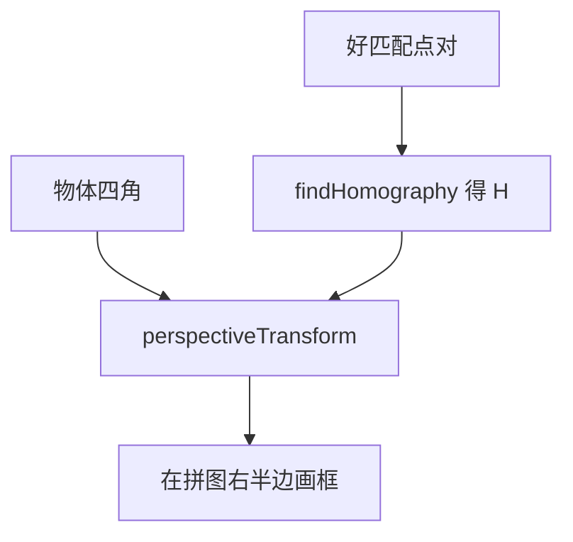

# 第十一章 特征检测与匹配

来源：《OpenCV3编程入门》（毛星云等，电子工业出版社，2015）
范围：书页 395–431（PDF 412–448）。书页 432（PDF 449）为空白页。未读附录（书页 433 / PDF 450 起）。

## 本章总览

前一章在找「角点」：图里往哪边挪都大变的位置。这一章把事情做完整：先在图里找出稳定的兴趣点，再给每个点算一段「指纹」（描述子），最后拿两张图的指纹去对，看是不是同一处。书把整条链路叫**特征检测与匹配**。

导读给的用途：物体检测、视觉跟踪、三维重建。章首列出 OpenCV 当时支持的 10 种特征检测方法（字符串名 → 类名）：

| 字符串 | 对应类 | 本章是否展开 |
|---|---|---|
| `"FAST"` | `FastFeatureDetector` | 否（ORB 里会用到 FAST 的思路） |
| `"STAR"` | `StarFeatureDetector` | 否 |
| `"SIFT"` | `SIFT`（nonfree） | 是（对照表 + 综合例） |
| `"SURF"` | `SURF`（nonfree） | 是（原理 + 检测 + 描述 + 匹配） |
| `"ORB"` | `ORB` | 是 |
| `"MSER"` | `MSER` | 否 |
| `"GFTT"` | `GoodFeaturesToTrackDetector` | 否（上一章已讲） |
| `"HARRIS"` | `GoodFeaturesToTrackDetector`（配合 Harris） | 否（上一章已讲） |
| `"Dense"` | `DenseFeatureDetector` | 否 |
| `"SimpleBlob"` | `SimpleBlobDetector` | 否 |

本章用 **OpenCV2** 讲并实现 SIFT、SURF、ORB；并在 FLANN 匹配之后，用单应性（Homography）把已知物体框出来。

学完应能回答：检测 / 描述 / 匹配各干什么、SURF 为什么比 SIFT 快、64 维和 128 维差在哪、暴力匹配和 FLANN 怎么选、ORB 为什么要用汉明距离、`findHomography` 算出的 \(H\) 怎么变成画面上的框。

示例程序 7 个，对应 11.1.6、11.2.3、11.3.3–11.3.5、11.4.3、11.5.4。控制台分别出现过「第 91 个」「第 94 个」示例编号。


## 核心知识点

### 先看清版本坑：本章代码跟 OpenCV2 走

章首灰框 Note 写明：官方 OpenCV3 把若干著名检测器（书点名 SIFT、SURF、ORB 等）的源码从主库挪到第三方模块 `xfeatures2d`（`opencv_contrib`）。因此本章讲解和配套工程都按稳定的 **OpenCV2** 来；示例源码只在 OpenCV2 源码包里。

实际头文件也按 2.x 路径写：`opencv2/nonfree/nonfree.hpp` 或 `opencv2/nonfree/features2d.hpp`（SIFT/SURF）、`opencv2/legacy/legacy.hpp`（`BruteForceMatcher`）、`opencv2/calib3d/calib3d.hpp`（`findHomography`）。示例演示版本仍是 **2.4.9**。

SIFT、SURF 书明确写在 **nonfree** 模块（专利相关，前面章节已提醒最好不要商用）。

### 11.1 SURF：先找出点，再画出来

**SURF** = Speeded Up Robust Features，Herbert Bay 2006 年提出。书称它是 SIFT 的加速版：通常比 SIFT 快若干倍，多图之间也更稳。核心加速手段是 **Haar 特征** + **积分图**。

#### SURF 五步在干什么（11.1.2）

1. **用 Hessian 搭尺度空间**  
   每个像素都能算一个二阶偏导方阵 \(H\)。行列式 \(\det(H)\) 用来判断是不是局部极值。为了尺度不变，还要在不同尺度 \(\sigma\) 上算：

   \[
   H(x,\sigma)=\begin{bmatrix} L_{xx}(x,\sigma) & L_{xy}(x,\sigma) \\ L_{xy}(x,\sigma) & L_{yy}(x,\sigma) \end{bmatrix}
   \]

   高斯二阶导算起来慢，Bay 改成盒子滤波近似，再用积分图一次求出。近似行列式：

   \[
   \det(H_{\mathrm{approx}})=D_{xx}D_{yy}-(0.9D_{xy})^2
   \]

   `0.9` 是经验系数，用来补盒子滤波和真正高斯之间的误差。图 11.1 / 11.2 给了 \(9\times9\) 的 \(L_{yy}\)、\(L_{xy}\) 模板（白块 +1、黑块 −1 或 −2）。

   和 SIFT 最大的结构差别：SIFT 靠缩小图（DOG 金字塔）；**SURF 保持原图尺寸，只把滤波核变大**（9、15、21…）。核变大几乎不更贵，因为积分图是常数时间，还可以并行算多层。

2. **26 邻域非极大抑制**  
   Hessian 处理过的像素，要和三维邻域里 26 个点比：本层 8 个 + 上一尺度 9 个 + 下一尺度 9 个。是极值才留下当候选。

3. **三维线性插值精确定位**  
   做法类似 SIFT，把点收到亚像素；再按阈值丢掉弱响应，只留强特征。

4. **选主方向**  
   SIFT 用梯度直方图。SURF 在半径 \(6s\)（\(s\) 是尺度）的圆里算水平/垂直 Haar 响应（小波尺寸 \(4s\)），再用 **60° 扇形** 绕一圈，哪一扇累加最大，那一扇的方向就是主方向。方向偏一点，后面描述子会对不上。

5. **构造描述子**  
   沿主方向取边长 \(20s\) 的正方形，切成 \(4\times4=16\) 块。每块对 25 个采样点记 Haar 响应，压成 4 个数：\((\sum dx,\ \sum|dx|,\ \sum dy,\ \sum|dy|)\)。一共 **64 维**（\(16\times4\)）。SIFT 是 128 维，所以 SURF 匹配也更快。

书还补了三条评价：Hessian 极值稳；主方向一旦偏，匹配容易整批失败；金字塔层数疏了尺度不准，作者用「层数适中 + 插值」折中。

#### SURF 在 OpenCV 里其实是同一个类（11.1.3）

头文件：`...\opencv\sources\modules\nonfree\include\opencv2\nonfree\features2d.hpp`

```cpp
typedef SURF SurfFeatureDetector;
typedef SURF SurfDescriptorExtractor;

class CV_EXPORTS_W SURF : public Feature2D { /* ... */ };
```

`Feature2D` 又同时继承 `FeatureDetector` 和 `DescriptorExtractor`，这两类都虚继承自 `Algorithm`。所以 `SURF` / `SurfFeatureDetector` / `SurfDescriptorExtractor` **三个名字等价**，既能 `detect` 找点，也能 `compute` 算描述子。

`detect` 从 `FeatureDetector` 继承，两套重载：

```cpp
CV_WRAP void detect(const Mat& image,
                    CV_OUT vector<KeyPoint>& keypoints,
                    const Mat& mask=Mat()) const;

void detect(const vector<Mat>& images,
            vector<vector<KeyPoint>>& keypoints,
            const vector<Mat>& masks=vector<Mat>()) const;
```

| 名称 | 功能 | 主要参数 | 约束&坑点 |
|---|---|---|---|
| `detect`（单图） | 在一张图上找关键点 | `image` 输入图；`keypoints` 检出点；`mask` 可选，空则全图 | 示例都没传 mask |
| `detect`（多图） | 一批图一起检 | `images` / `keypoints` / `masks` 按图对齐 | 本章示例未用这套 |

【信息缺口：`SURF` / `SurfFeatureDetector` 完整构造函数参数表本章未列。示例只写了 `SurfFeatureDetector detector(minHessian)`，阈值分别用过 400、700、300、80。】

#### 把点画出来：`drawKeypoints`（11.1.4）

```cpp
void drawKeypoints(const Mat& image,
                   const vector<KeyPoint>& keypoints,
                   Mat& outImage,
                   const Scalar& color=Scalar::all(-1),
                   int flags=DrawMatchesFlags::DEFAULT);
```

| 参数 | 含义 | 约束&坑点 |
|---|---|---|
| `image` | 源图 | — |
| `keypoints` | 已检出的点 | 书参数表有一处写成「输出参数」，实际是输入的点列表 |
| `outImage` | 画完的图 | 内容还受 `flags` 管 |
| `color` | 点的颜色 | 默认 `Scalar::all(-1)` = **每个点随机色** |
| `flags` | 怎么画 | 见 `DrawMatchesFlags` |

`DrawMatchesFlags`（11.1.4 / 11.2.1 共用）：

| 取值 | 值 | 含义 |
|---|---|---|
| `DEFAULT` | 0 | 用 `Mat::create` 建输出图；只画关键点中心 |
| `DRAW_OVER_OUTIMG` | 1 | 不新建图，直接画到已有 `outImage` 上 |
| `NOT_DRAW_SINGLE_POINTS` | 2 | 没有匹配上的单点不画 |
| `DRAW_RICH_KEYPOINTS` | 4 | 每个点画带尺寸和方向的圆 |

示例 11.1.6：两张图、`minHessian = 400`、`detect`、再 `drawKeypoints(..., Scalar::all(-1), DrawMatchesFlags::DEFAULT)`。图 11.8–11.11 是 DEFAULT（小圆点），图 11.12–11.13 是 RICH（大小圆 + 方向线）。效果示意：DEFAULT 像撒了一层针尖；RICH 能看出这个点「管多大一块、朝哪」。

#### `KeyPoint` 一个点装什么（11.1.5）

| 成员 | 类型 | 通俗含义 |
|---|---|---|
| `pt` | `Point2f` | 坐标 |
| `size` | `float` | 邻域直径 |
| `angle` | `float` | 方向，范围 \([0,360)\)；负值表示不用方向 |
| `response` | `float` | 响应强弱，用来排序 |
| `octave` | `int` | 在金字塔哪一层检出 |
| `class_id` | `int` | 聚类用的编号 |

### 11.2 SURF 特征提取：给点算指纹，再暴力对

检测只告诉你「这里有点」。**提取 / 描述**是给每个点算一段向量。书强调：尺度决定窗口多大，理想描述子不怕光照和小透视；比较时常用欧氏距离。

OpenCV 这边主要两样：`drawMatches` 画线，`BruteForceMatcher` 做一对一穷举。

#### `drawMatches`（11.2.1）

两套重载，只在第 5、第 9 个参数类型上不同：一套吃扁平的 `vector<DMatch>`，一套吃分组的 `vector<vector<DMatch>>`（后面 knn 常用）。

```cpp
void drawMatches(const Mat& img1,
                 const vector<KeyPoint>& keypoints1,
                 const Mat& img2,
                 const vector<KeyPoint>& keypoints2,
                 const vector<DMatch>& matches1to2,
                 Mat& outImg,
                 const Scalar& matchColor=Scalar::all(-1),
                 const Scalar& singlePointColor=Scalar::all(-1),
                 const vector<char>& matchesMask=vector<char>(),
                 int flags=DrawMatchesFlags::DEFAULT);

void drawMatches(const Mat& img1,
                 const vector<KeyPoint>& keypoints1,
                 const Mat& img2,
                 const vector<KeyPoint>& keypoints2,
                 const vector<vector<DMatch>>& matches1to2,
                 Mat& outImg,
                 const Scalar& matchColor=Scalar::all(-1),
                 const Scalar& singlePointColor=Scalar::all(-1),
                 const vector<vector<char>>& matchesMask=vector<vector<char>>(),
                 int flags=DrawMatchesFlags::DEFAULT);
```

| 参数 | 含义 | 约束&坑点 |
|---|---|---|
| `img1` / `img2` | 左右两张源图 | — |
| `keypoints1` / `keypoints2` | 各自的点 | 书又写「输出参数」，实际是已检出的点 |
| `matches1to2` | 从图1到图2的对应 | 一对一；knn 时用第二套（每点一组） |
| `outImg` | 拼好的结果图 | 受 `flags` 影响 |
| `matchColor` | 匹配线和匹配点颜色 | `-1` 随机色 |
| `singlePointColor` | 没配上的单点颜色 | `-1` 随机色 |
| `matchesMask` | 哪些匹配真画 | 空则全画 |
| `flags` | 同 `DrawMatchesFlags` | 筛好匹配后常用 `NOT_DRAW_SINGLE_POINTS` |

#### `BruteForceMatcher`（11.2.2）

继承链：`BruteForceMatcher` → `BFMatcher` → `DescriptorMatcher` → `Algorithm`。

- `BruteForceMatcher` 定义在 `...\opencv\sources\modules\legacy\include\opencv2\legacy\legacy.hpp`
- `BFMatcher` / `DescriptorMatcher` 在 `features2d.hpp`

最常用的是基类带来的 `match`：给查询集里每个描述子找**一个**最佳对手。

```cpp
CV_WRAP void match(const Mat& queryDescriptors,
                   const Mat& trainDescriptors,
                   CV_OUT vector<DMatch>& matches,
                   const Mat& mask=Mat()) const;
```

暴力匹配的意思：图1每个描述子都和图2所有描述子比一遍，距离最近的当配对。SURF 默认 **64 维**，用 `BruteForceMatcher< L2<float> >`（L2 = 欧氏距离）。

示例 11.2.3 流程（只记步骤，不写完整工程）：

1. `SurfFeatureDetector detector(700)` 检出点（这里阈值改成 700，比检测例的 400 更严）
2. `SurfDescriptorExtractor extractor; extractor.compute(图, 点, 描述子Mat)`
3. `matcher.match(descriptors1, descriptors2, matches)`
4. `drawMatches` 画线，`imshow` 看

图 11.14：两盒包装并排，细线把对应点连起来。

### 11.3 FLANN：点多了就别再穷举

**FLANN** = Fast Library for Approximate Nearest Neighbors。接口类是 `FlannBasedMatcher`，同样继承 `DescriptorMatcher`，所以还是调用 `match`。

#### `DescriptorMatcher::match` 两套（11.3.2）

```cpp
void DescriptorMatcher::match(const Mat& queryDescriptors,
                              const Mat& trainDescriptors,
                              vector<DMatch>& matches,
                              const Mat& mask=Mat());

void DescriptorMatcher::match(const Mat& queryDescriptors,
                              vector<DMatch>& matches,
                              const vector<Mat>& masks=vector<Mat>());
```

| 参数 | 含义 | 约束&坑点 |
|---|---|---|
| `queryDescriptors` | 要去查的描述子 | 「我手里这张图」 |
| `trainDescriptors` | 被查的参考库 | 第一套当场传入；第二套用事先 `add`/`train` 好的库 |
| `matches` | 结果 | 查询描述子若被 mask 挡掉，**不会**往 matches 里塞，所以条数可能少于查询点数 |
| `mask` / `masks` | 允许哪些配对 | 第二套里 `masks[i]` 对应训练库第 \(i\) 张图 |

#### 示例 11.3.3：静态两图 + 按最小距离筛

- `minHessian = 300`，`SURF` 既当 detector 又当 extractor
- `FlannBasedMatcher matcher; matcher.match(...)`
- 先扫一遍 `matches[i].distance`，记下最大、最小距离（例：Max 0.557617，Min 0.047603）
- **好匹配**：`distance < 2 * min_dist`
- 书评：也可以改用 `radiusMatch`【信息缺口：`radiusMatch` 本章无原型】
- `drawMatches(..., DrawMatchesFlags::NOT_DRAW_SINGLE_POINTS)`
- 控制台按 `queryIdx` / `trainIdx` 打印「特征点1 — 特征点2」

#### 示例 11.3.4：摄像头实时，SURF + FLANN + Lowe 比

训练图先灰度（`CV_BGR2GRAY`），`SurfFeatureDetector(80)` 检点、`SurfDescriptorExtractor` 算描述子，再：

```text
matcher.add(训练描述子);
matcher.train();
```

循环里对摄像头帧同样检点、算描述子，然后 **`knnMatch(..., 2)`**（每点留 2 个近邻）。Lowe 法则：

\[
\mathrm{matches}[i][0].\mathrm{distance} < 0.6 \times \mathrm{matches}[i][1].\mathrm{distance}
\]

才进 `goodMatches`。意思是：第一名必须明显比第二名近，否则这个点模棱两可。

效果：对着无关物体，线很少（图 11.19）；对着同一本书，线又多又齐（图 11.20）。帧率大约 **3.2～4.4 FPS**，书说偏低，算法效率还有提升空间。计时仍是 `(getTickCount()-t0)/getTickFrequency()` 的倒数当帧率。

【信息缺口：`knnMatch` / `add` / `train` 本章只有调用，无完整官方原型。】

#### 示例 11.3.5 与表 11.1：SIFT + 暴力匹配

SIFT 原理本章没有像 SURF 那样逐步拆，而是用 **表 11.1** 对照。书称 SURF 是 SIFT 加速版，理论上大约 **快 3 倍**。

| 对照点 | SIFT | SURF |
|---|---|---|
| 尺度空间 | 不同尺度上 DOG 与图像卷积 | 盒子滤波与**原图**在不同尺度卷积 |
| 找点 | 先非极大抑制 → 去低对比 → Hessian 去边缘点 | 先 Hessian 定候选 → 再非极大抑制 |
| 方向 | 方形邻域梯度直方图，可有多方向 | 圆形邻域 Haar 扇形，取最大扇 |
| 描述子 | \(16\times16\) 再切 \(4\times4\)，每块 8 方向直方图，**128 维** | \(20s\times20s\) 切 \(4\times4\)，每块 4 个数，**64 维** |

综合例流程几乎同 11.3.4，只是检测/提取换成 `SiftFeatureDetector` / `SiftDescriptorExtractor`，匹配换成 `BFMatcher`，仍然 `knnMatch(k=2)` + Lowe 0.6。循环注释有一处仍写「检测 SURF」，以实际创建的 SIFT 对象为准。

帧率大约 **2.6～3.0**。书说在相近代码下，这种匹配帧率比 SURF 平均大约低 4.0 FPS。图 11.23 / 11.24：无关物体几乎没线，对上同一本书则线很齐（图注写「暴力匹配」）。

【信息缺口：`SiftFeatureDetector` / `SiftDescriptorExtractor` / `SIFT` 完整构造参数本章未列。】

### 11.4 寻找已知物体：匹配之后再框出来

光有一堆连线还不够。书的下一步：用**单应性**（Homography）把物体四角映射到场景里，再画框。两步：

1. `findHomography` 从匹配点对求出透视矩阵 \(H\)
2. `perspectiveTransform` 把物体角点乘到场景坐标

#### `findHomography`（11.4.1）

关系（书中写法）：

\[
s_i\begin{bmatrix}x'_i\\ y'_i\\ 1\end{bmatrix}\sim H\begin{bmatrix}x_i\\ y_i\\ 1\end{bmatrix}
\]

```cpp
Mat findHomography(InputArray srcPoints,
                   InputArray dstPoints,
                   int method=0,
                   double ransacReprojThreshold=3,
                   OutputArray mask=noArray());
```

| 参数 | 含义 | 约束&坑点 |
|---|---|---|
| `srcPoints` | 源平面点 | `CV_32FC2` 或 `vector<Point2f>` |
| `dstPoints` | 目标平面对应点 | 类型同上 |
| `method` | 怎么估 \(H\) | 表 11.2：`0` 用全部点（默认最小二乘）；`CV_RANSAC`；`CV_LMEDS`（最小中位数） |
| `ransacReprojThreshold` | 内点最大重投影误差 | 默认 3；像素坐标常见 1～10。满足 \(\|dst_i-\mathrm{proj}(H\cdot src_i)\|\le\) 阈值才算内点 |
| `mask` | 稳健方法标出哪些是内点 | 默认 `noArray()`；**输入值会被忽略**，只当输出 |

头文件：`calib3d.hpp`。示例用 `findHomography(obj, scene, CV_RANSAC)`。

#### `perspectiveTransform`（11.4.2）

```cpp
void perspectiveTransform(InputArray src,
                          OutputArray dst,
                          InputArray m);
```

| 参数 | 含义 | 约束&坑点 |
|---|---|---|
| `src` | 要变的点集 | 两通道或三通道浮点 `Mat`，每个元素是 2D/3D 向量 |
| `dst` | 变完的点 | **尺寸和类型必须与 src 相同** |
| `m` | 变换矩阵 | \(3\times3\) 或 \(4\times4\) 浮点阵（2D 用 3×3，就是上面的 \(H\)） |

#### 示例 11.4.3 流程

`minHessian = 400` → SURF 检点、算描述子 → FLANN `match` → 按距离筛 **好匹配：`distance < 3 * min_dist`**（注意：这里是 3 倍，11.3.3 是 2 倍）→ 从 `good_matches` 取出 `queryIdx` / `trainIdx` 对应的 `pt` → `H = findHomography(obj, scene, CV_RANSAC)` → 物体四角 `(0,0)`、`(cols,0)`、`(cols,rows)`、`(0,rows)` 做 `perspectiveTransform` → 在 `img_matches` 上画四条线。

画框时有个容易忘的偏移：`img_matches` 是左右拼图，场景在右半边，线的 \(x\) 要再加 `srcImage1.cols`。线色 `Scalar(255, 0, 123)`，线宽 4。窗标题 `Good Matches & Object detection`。控制台 Max 0.517203 / Min 0.047603。图 11.26：细线是点对应，粗框是检出的物体边界。



### 11.5 ORB：给实时用的二进制描述

**ORB** 书写作 ORiented Brief（常见全称 Oriented FAST and Rotated BRIEF），2011 年论文 *ORB: an efficient alternative to SIFT or SURF*。它是 **BRIEF** 的改进版。

书给的速度口径：比 SIFT 大约快 **100 倍**，比 SURF 大约快 **10 倍**；综合评价里整体最好。

#### BRIEF 缺什么，ORB 补什么（11.5.2）

**BRIEF** = Binary Robust Independent Elementary Features（Calonder，ECCV 2010）。想法：在特征点附近随机抽若干点对，比灰度，拼成 0/1 串当描述子。优点就是快。缺点三条：

- 没有旋转不变
- 对噪声敏感
- 没有尺度不变

书明确写：ORB 试图解决前两条（旋转、噪声）。尺度呢？ORB 底层的 FAST 本身没有尺度不变；书说它面向实时视频，尺度问题常常靠跟踪或启发式策略补，而不是在检测器里一次解决。

#### ORB 类关系（11.5.3）

和 SURF 同一套路。`features2d.hpp` 里：

```cpp
class CV_EXPORTS_W ORB : public Feature2D { /* ... */ };
```

`ORB` / `OrbFeatureDetector` / `OrbDescriptorExtractor` 三个 typedef 等价。继承图同图 11.7：`Algorithm` ← 虚继承 `FeatureDetector` / `DescriptorExtractor` ← `Feature2D` ← `ORB`。

【信息缺口：`ORB` 完整构造函数参数本章未列，示例用默认构造。】

#### 示例 11.5.4：ORB + FLANN-LSH + 摄像头

和 SURF 实时例骨架相同，关键差别在**距离和索引**：

- `OrbFeatureDetector` / `OrbDescriptorExtractor`，`detect` + `compute`
- 索引：`flann::Index` + `flann::LshIndexParams(12, 20, 2)`
- 距离：`cvflann::FLANN_DIST_HAMMING`（二进制串用汉明距离，不是 L2）
- 循环里 `flannIndex.knnSearch`，\(k=2\)
- 仍用 Lowe：`matchDistance.at<float>(i,0) < 0.6 * matchDistance.at<float>(i,1)`
- ESC（ASCII 27）退出

摄像头示例还 `set` 了宽 360、高 900。【信息缺口：`LshIndexParams` 三个数字各自含义、以及 `VideoCapture::set` 的属性宏，本章未解释。】

效果：帧率大约 **23～30**（图 11.29 出现 23.46、27.32、29.75、30.77），比 SURF/SIFT 实时例高一个数量级。无关物体几乎没线（图 11.30）；对上目标书则线多且整齐（图 11.31）。

### 章末清单（11.6）

SURF 是 SIFT 的加速版；ORB 是 BRIEF 的改进版；FLANN 做快速近似近邻匹配；在 FLANN 结果上再用单应性找已知物体。

| 名称 | 功能 | 对应小节 |
|---|---|---|
| `SURF` / `SurfFeatureDetector` / `SurfDescriptorExtractor` | 三者等价，做 SURF 检测和描述 | 11.1.3 |
| `drawKeypoints` | 在图上画关键点 | 11.1.4 |
| `drawMatches` | 画两图之间的匹配 | 11.2.1 |
| `KeyPoint` | 一个特征点的信息 | 11.1.5 |
| `BruteForceMatcher` | 暴力匹配 | 11.2.2 |
| `FlannBasedMatcher` | FLANN 匹配 | 11.3.1 |
| `DescriptorMatcher::match` | 为每个查询描述子找最佳配对 | 11.3.2 |
| `findHomography` | 求透视矩阵 \(H\) | 11.4.1 |
| `perspectiveTransform` | 用 \(H\) 变换点集 | 11.4.2 |
| `ORB` / `OrbFeatureDetector` / `OrbDescriptorExtractor` | 三者等价，做 ORB 检测和描述 | 11.5.3 |

示例程序清单（11.6 续页）：

| 主题 | 小节 |
|---|---|
| SURF 特征点检测 | 11.1.6 |
| SURF 特征提取 | 11.2.3 |
| 用 FLANN 做特征点匹配 | 11.3.3 |
| FLANN + SURF 描述与匹配 | 11.3.4 |
| SIFT + 暴力匹配 | 11.3.5 |
| 寻找已知物体 | 11.4.3 |
| ORB 描述与匹配 | 11.5.4 |

书说本章写完，主线四个组件就齐了：`core`、`highgui`、`imgproc`、`feature2d`。

本章未指向尚未处理的其他章节专节。源码剖析只落到类关系、`typedef` 和 `detect`/`match` 接口，没有「见附录某节补全参数」的占位。【本章未登记新的跨章待补全。】

## 容易混淆的点

- **检测 vs 描述 vs 匹配**：`detect` 只给坐标（和尺度、方向）；`compute` 才算出向量；`match` / `knnMatch` 是拿两堆向量对。三个类名（`XxxFeatureDetector` / `XxxDescriptorExtractor` / `Xxx`）在 SURF、ORB 里是同一个类的别名，不是三套无关实现。
- **SIFT vs SURF vs ORB**：SIFT 128 维、DOG 金字塔、最经典也最慢；SURF 64 维、盒子滤波 + 积分图，书称大约快 3 倍；ORB 是二进制串，书称比 SIFT 快约 100 倍、比 SURF 快约 10 倍，实时例帧率也对得上（ORB 二十多帧，SURF/SIFT 只有两三帧）。ORB **没有从根上解决尺度不变**。
- **暴力 vs FLANN**：暴力是每个对每个，稳但慢；FLANN 是近似最近邻，点多、维高时更合适。ORB 的二进制描述子不要套 SURF 那套 L2，书用 **Hamming + LSH**。
- **`match` vs `knnMatch`**：`match` 每点只给第一名，后面用 `2*min_dist` 或 `3*min_dist` 砍。`knnMatch(...,2)` 留前两名，再用 Lowe 0.6 比「第一名是不是明显更好」。两种门槛不是一回事，数字不能跨例抄。
- **好匹配倍数不统一**：11.3.3 用 `2 * min_dist`，11.4.3 用 `3 * min_dist`，实时例用 Lowe 0.6。没有「全书统一阈值」。
- **`minHessian` 也不是一个数**：检测例 400、提取例 700、FLANN 静态例 300、摄像头 SURF 例 80。越小点越多，越大越「硬」。
- **OpenCV2 / OpenCV3 放哪**：本章实现按 2.x，`nonfree` + `legacy`。OpenCV3 官方主库书称已把 SIFT/SURF/ORB 等挪到 `xfeatures2d`。不要拿 3.x 默认安装直接抄本章 `#include`。
- **`Scalar::all(-1)` 不是黑色**：在 `drawKeypoints` / `drawMatches` 里表示随机色。
- **拼图画框要加宽度**：`img_matches` 左图右图拼接，场景角点的 \(x\) 必须再加左图 `cols`，否则框会画到左半边。
- **`findHomography` 的 `mask` 是输出**：稳健方法用来标内点，传入的旧值会被忽略。
- **SIFT 例注释笔误**：11.3.5 循环里仍可能写「检测 SURF」，对象其实是 SIFT。

## 本章要点总结

- 特征链路：检点 → 算描述子 → 匹配 →（可选）筛距离 / Lowe →（可选）单应性框物体。
- SURF：Hessian + 盒子滤波 + 积分图；图尺寸不变、核变大；26 邻域抑制；60° 扇形定方向；\(20s\) 窗、64 维。`SURF` ≡ `SurfFeatureDetector` ≡ `SurfDescriptorExtractor`，在 nonfree。
- SIFT：本章用表 11.1 对照，128 维、DOG；综合例走 `SiftFeatureDetector` + `BFMatcher`。
- 匹配：`BruteForceMatcher<L2<float>>` 穷举；`FlannBasedMatcher` 近似近邻。`match` 给第一名，`knnMatch(k=2)` 才能做 Lowe 0.6。
- 找物体：好匹配点 → `findHomography(..., CV_RANSAC)` → `perspectiveTransform` 变四角 → 在拼图右半边 `line` 画框。
- ORB：改进 BRIEF，补旋转和噪声；尺度靠别的策略。描述子是二进制，匹配用 Hamming + LSH。实时例约 23～30 FPS。
- 可视化：`drawKeypoints` / `drawMatches`；`DEFAULT` 只画中心，`DRAW_RICH_KEYPOINTS` 带大小和方向，`NOT_DRAW_SINGLE_POINTS` 不画落单点；颜色 `-1` 表示随机。
- 本章示例按 OpenCV 2.4.9 写。OpenCV3 要把 SIFT/SURF/ORB 等到 `xfeatures2d` 里找。综合例只提炼流程，不写可运行工程。
