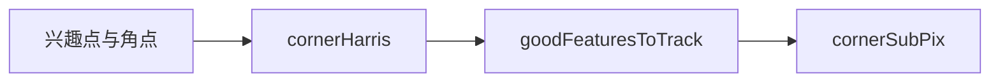
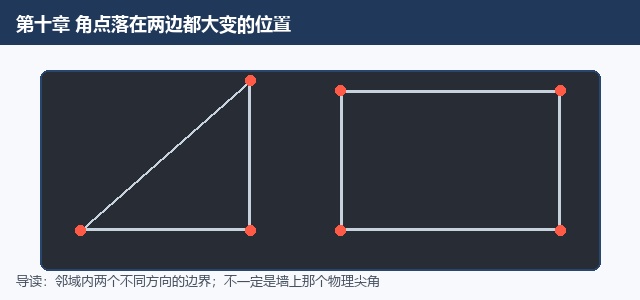
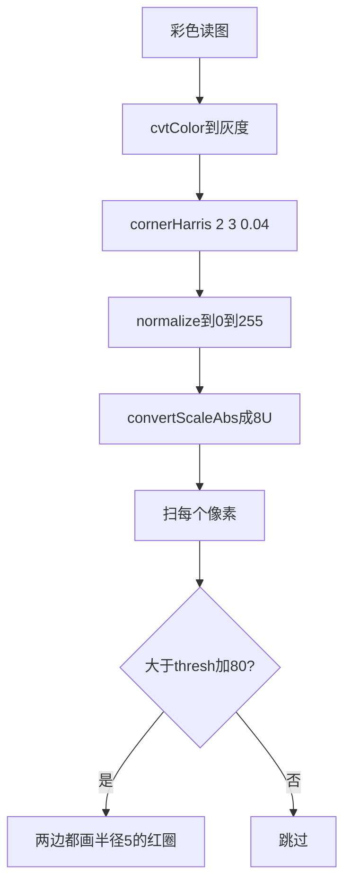
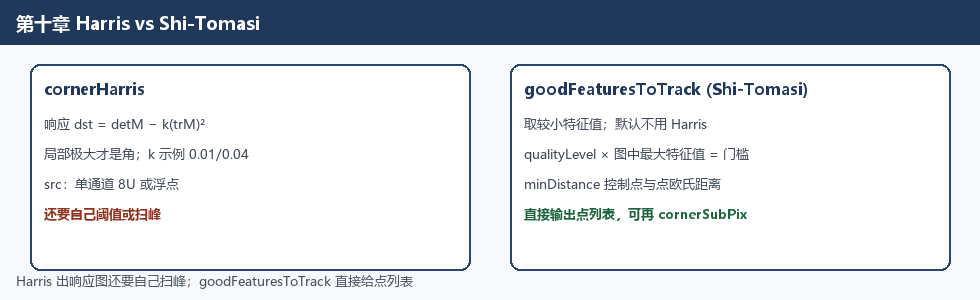
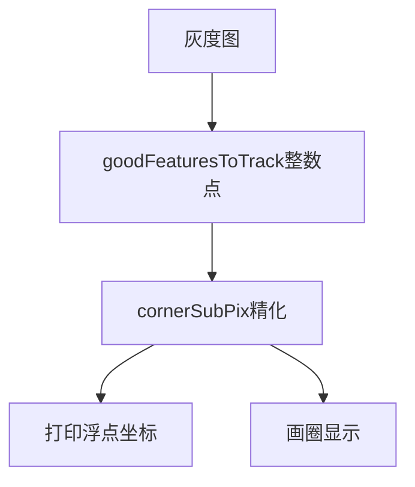

# 第十章 角点检测

来源：《OpenCV3编程入门》（毛星云等，电子工业出版社，2015）
范围：书页 377–393（PDF 394–410）。书页 394（PDF 411）为空白页。未读第11章（书页 395 / PDF 412 起；第四部分扉页书页 375 / PDF 392）。

## 本章总览

前面几章在找边、收轮廓、数直方图。这一章换到「兴趣点」：图里哪些位置一挪就变、以后还能再找到。书把这种位置叫**角点**（corner），也常说成特征点检测。

导读给的日常定义是两条边的交点；更严一点：某个小邻域里，出现了两个不同方向的边界。实际算法找的往往是梯度、极值这类数学特征，不一定是墙上那个物理尖角。

用途：运动检测、图像匹配、视频跟踪、三维建模、物体识别。

学习目标：什么是角点、角点检测概念、Harris、Shi-Tomasi、亚像素级角点检测。

正文三块加小结：Harris、Shi-Tomasi、亚像素精化。学完应能回答：角点和边缘/斑点差在哪、Harris 的响应公式怎么写、Shi-Tomasi 为什么改看较小特征值、`goodFeaturesToTrack` 九个参数各管什么、`cornerSubPix` 为什么输出小数坐标。

示例程序编号 85–88。



## 核心知识点

### 兴趣点、角点、斑点先分清

兴趣点（interest point）书里也叫关键点、特征点。用来认物体、配图、跟踪、做三维重建。

图像特征书分成三类。下表先分清「一个方向在变」和「两个方向都在变」。

| 名称 | 通俗理解 | 书里的说法 |
|---|---|---|
| 边缘 | 只在一个方向上灰度猛变 | 沿轮廓走 |
| 角点 | 往哪个方向挪，灰度都大变 | 「兴趣关键点」 |
| 斑点 | 一块区域整体和周围不一样 | 「兴趣区域」 |

角点好用的原因：信息多、比边和斑点更好定位，还能做到亚像素；通常是两条边的交点，边缘方向在这里拐了两次。平滑区域里的点和轮廓上的点，换一张相似图就对不齐；角点相对稳。

书还列了几种数学说法（不必全背，知道在说「变化剧烈」即可）：

- 灰度一阶导（梯度）的局部最大对应的像素
- 两条或更多边的交点
- 梯度幅值大，梯度方向变化也快
- 一阶导最大、二阶导为零，物体边缘方向在这里不连续

评价一套角点算法，关键看：光照变、图转了，还能不能在多张图里找到同一批点。不少算法要靠大批训练样本才压得住假特征。

检测路线书分成三类：基于灰度图、基于二值图、基于轮廓曲线。灰度这一路再拆成梯度法、模板法、二者结合。模板法把「邻域对比够强」当角点，点名 Kitchen-Rosenfeld、Harris、KLT、SUSAN。



*图注：角点落在两边灰度都大变的位置（矩形 / 三角顶点），不一定是物理墙上的尖角。*

🔑 关键速记：角点是两个方向都大变的位置；检测看的是数学响应，不必等于墙上的尖角。

### Harris：先出一张「角点响应图」

Harris 是直接吃灰度的算法。书称稳定性高，对 **L 形角** 尤其准；缺点是高斯滤波拖速度，还可能丢角、位置漂、好几个响应挤成一团（聚类）。

做法可以想成：每个像素周围开一个 `blockSize × blockSize` 的窗，算 2×2 的梯度协方差矩阵 \(M\)，再压成一个标量响应：

\[
dst(x,y)=\det M^{(x,y)}-k\cdot(\mathrm{tr}\,M^{(x,y)})^2
\]

\(dst\) 里的**局部极大**就是角点。\(\det\) 是行列式，\(\mathrm{tr}\) 是迹（对角线之和），\(k\) 是自己调的自由参数。

#### `cornerHarris`

函数本身不画圈。它只交出一张和原图一样大的分数图。要看见角点，还得自己阈值或扫局部极大。书说后面常接 `threshold()`。

```cpp
void cornerHarris(InputArray src,
                  OutputArray dst,
                  int blockSize,
                  int ksize,
                  double k,
                  int borderType=BORDER_DEFAULT);
```

下表给出输入类型和 \(k\) 的示例取值。

| 参数 | 含义 | 约束&坑点 |
|---|---|---|
| `src` | 输入图 | 须**单通道** 8 位或浮点 |
| `dst` | 响应图 | 正文写「与源同尺寸同类型」；综合示例 86 却把 `dst` 建成 `CV_32FC1` 再归一化。以公式和示例用法为准：响应是浮点分数，不能当 8 位图直接看 |
| `blockSize` | 算 \(M\) 的邻域边长 | 更细的解释书指向 `cornerEigenValsAndVecs()`，本章未展开该函数【信息缺口】 |
| `ksize` | 内部 Sobel 的孔径 | 示例用 3 |
| `k` | 公式里的自由参数 | 示例 85 用 `0.01`，示例 86 用 `0.04` |
| `borderType` | 边界外推 | 默认 `BORDER_DEFAULT`；其余写法指向 `borderInterpolate()`，本章未列表 |

输入须单通道 8U 或浮点。响应是浮点分数，不要按 8U 原图去 `imshow` 指望直接看见角点。

示例 85 关键调用：灰度读图 → `cornerHarris(..., 2, 3, 0.01)` → `threshold(..., 0.00001, 255, THRESH_BINARY)`。输入输出现象：并排看原图和二值白点；白点落在高对比棱角。阈值写得很小，因为原始响应本来就接近 0。

示例 86（10.1.5）加了滑动条，三个窗口：原图、带条的彩色结果、灰度结果。关键调用链：



滑动条变量 `thresh` 初值 30、上限 175；真正比较的是 `thresh + 80`。条越小圈越多，条越大只剩更「硬」的角。回调注释有一处写成 `on_HoughLines()`，函数名其实是 `on_CornerHarris`。

两套 Harris 示例的门槛不是一回事：示例 85 对原始响应用 `0.00001` 的二值阈值；示例 86 先归一化到 0～255，再和 `thresh+80` 比。抄数字不要跨例。

🔑 关键速记：`cornerHarris` 只出响应图，还要自己阈值或扫峰；邻域 2、孔径 3，`k` 示例为 0.01 或 0.04。

### Shi-Tomasi：直接给你一组「强角点」坐标

Harris 用 \(\det M - k(\mathrm{tr} M)^2\) 跟阈值比。1994 年 Shi 和 Tomasi 在论文 *Good Features to Track* 里换了判据：看 \(M\) 的两个特征值，**较小的那个**还大于最低门槛，就认作强角点。OpenCV 对应函数因此叫 `goodFeaturesToTrack`。



*图注：Harris 输出响应图需自己扫峰；`goodFeaturesToTrack` 直接给点列表，`qualityLevel` 要乘图中最大特征值。*

和 Harris 的直观差别：Harris 先铺一张响应图，你自己找峰；Shi-Tomasi 这条接口直接吐出点列表，还能限制最多几个、彼此至少隔多远。

#### `goodFeaturesToTrack`

九参数接口。默认走 Shi-Tomasi；`useHarrisDetector=true` 才切回 Harris。书称这个函数常用来给「按点跟踪」当初始点。

```cpp
void goodFeaturesToTrack(InputArray image,
                         OutputArray corners,
                         int maxCorners,
                         double qualityLevel,
                         double minDistance,
                         InputArray mask=noArray(),
                         int blockSize=3,
                         bool useHarrisDetector=false,
                         double k=0.04);
```

下表强调 `qualityLevel` 不是最终阈值。

| 参数 | 含义 | 约束&坑点 |
|---|---|---|
| `image` | 输入图 | 须 8 位或 32 位浮点、**单通道灰度** |
| `corners` | 检出的角点 | 输出向量，示例用 `vector<Point2f>` |
| `maxCorners` | 最多返回几个 | 滑动条常改这个；示例下限按至少 1 处理 |
| `qualityLevel` | 最低质量（对应最小特征值） | **真正门槛 = qualityLevel × 图里最大的那个特征值**。常见 0.10 或 0.01。先按质量筛，再按距离再筛一层 |
| `minDistance` | 两点最小欧氏距离（像素） | 太近的会丢掉，避免一堆点糊在同一个角上 |
| `mask` | 可选检测区域 | 默认 `noArray()`；非空须 `CV_8UC1`、与输入同尺寸 |
| `blockSize` | 算导数自相关矩阵的邻域 | 默认 3 |
| `useHarrisDetector` | 是否改走 Harris | 默认 `false`（Shi-Tomasi）；`true` 才用 Harris |
| `k` | Harris 的自由参数 | 默认 0.04；只有 `useHarrisDetector=true` 时才用得上 |

输入须 8U 或 32F 单通道。真正门槛是 `qualityLevel` 乘图里最大特征值，填 0.01 不代表响应大于 0.01 就算角点。

示例 87 关键调用：读图 → `COLOR_BGR2GRAY` → 滑动条「最大角点数」0～500（初值 33）→ 回调里 `qualityLevel=0.01`、`minDistance=10`、`blockSize=3`、`mask=Mat()`、`useHarrisDetector=false`、`k=0.04` → `goodFeaturesToTrack` → 每个点画半径 4、颜色随机的圆。

输入输出现象：控制台标题写的是本书第 87 例、OpenCV 3.0.0-beta；点数随条变成 33 / 133 / 233 / 333。条在 33 时只有少数强角；条拉到 500，轮廓上密成一片。

🔑 关键速记：`goodFeaturesToTrack` 直接给点列表；默认 Shi-Tomasi；门槛是 `qualityLevel` × 图中最大特征值。

### 亚像素：整数格子不够时，再往里抠小数

`goodFeaturesToTrack` 给出的是整数像素。几何测量、相机标定、相机轨迹、三维重建这类活，格子太粗。这时要把坐标收成浮点数，也就是**亚像素**（sub-pixel）。

几何直觉（图 10.11）：真正的角在 \(q\)。邻域里任取一点 \(p\)：

- \(p\) 落在平坦区：梯度 \(\nabla I(p)=0\)
- \(p\) 落在边上：梯度与向量 \(q-p\) 垂直

两种情况都满足

\[
\langle \nabla I(p),\; q-p\rangle = 0
\]

周围多取一些 \(p\)，联立求解，就能把 \(q\) 算到像素格子中间。

#### `cornerSubPix`

在已有粗位置上迭代，输出浮点坐标。`corners` 既是输入也是输出。

```cpp
void cornerSubPix(InputArray image,
                  InputOutputArray corners,
                  Size winSize,
                  Size zeroZone,
                  TermCriteria criteria);
```

下表强调 `winSize` 是半窗。

| 参数 | 含义 | 约束&坑点 |
|---|---|---|
| `image` | 输入图 | 示例用灰度；正文未另写深度约束 |
| `corners` | 角点坐标 | **既是输入也是输出**：进去是粗位置，出来是精化后的浮点坐标 |
| `winSize` | 搜索窗的**半边长** | `Size(5,5)` 实际窗口是 \((5\times2+1)\times(5\times2+1)=11\times11\)，不要当成全窗尺寸 |
| `zeroZone` | 窗正中「死区」的半边长 | 中间这块不算，避免自相关矩阵奇异。`(-1,-1)` 表示不设死区 |
| `criteria` | 迭代何时停 | 可按最大迭代次数、精度，或两者一起 |

`winSize` 是半窗不是全窗。`zeroZone=(-1,-1)` 表示不死区。

示例 88 是在 Shi-Tomasi 回调里追加三步，不是另起一套检测：

1. `winSize = Size(5,5)`，`zeroZone = Size(-1,-1)`
2. 终止条件：OpenCV3 写 `TermCriteria(TermCriteria::EPS + TermCriteria::MAX_ITER, 40, 0.001)`（最多 40 次，或精度到 0.001）；OpenCV2 对应宏是 `CV_TERMCRIT_EPS + CV_TERMCRIT_ITER`
3. `cornerSubPix(g_grayImage, corners, winSize, zeroZone, criteria)`，再打印带小数的坐标

输入输出现象：控制台会出现 `精确角点坐标[110] (426.347, 589.625)` 这种数，整数检测给不出小数。圈仍然画在建筑棱角上，但坐标已经不是整格。



🔑 关键速记：`cornerSubPix` 在已有点上精化；`Size(5,5)` 实际是 11×11；示例停于 40 次或精度 0.001。

### 章末清单（10.4）

核心函数对照如下。

| 名称 | 功能 | 对应小节 |
|---|---|---|
| `cornerHarris` | 跑 Harris 算子，得到响应图 | 10.1.4 |
| `goodFeaturesToTrack` | 结合 Shi-Tomasi，取出强角点坐标 | 10.2.2 |
| `cornerSubPix` | 把已有角点收到亚像素 | 10.3.2 |

小结还点名：自己做角点函数时可以用 `cornerMinEigenVal` 和 `minMaxLoc`。【信息缺口：这两个函数本章没有原型和参数表。】

`minMaxLoc` 用来在单通道数组上找全局最小 / 最大值及其位置；第9章画直方图取峰高、模板匹配找最像 / 最不像的点，都靠它。本章与 `cornerMinEigenVal` 搭配自造检测时仍未给原型，不展开构造。

👉 完整深度讲解见第9章。

选点标准要看具体应用；精度要求高时再用 `cornerSubPix`。

示例 85–88 依次对应：`cornerHarris` 最小用法、Harris 滑动条绘制、Shi-Tomasi、亚像素精化。

本章未指向尚未处理的其他章节专节。`blockSize` 的更细说明指向 `cornerEigenValsAndVecs()`，`borderType` 指向 `borderInterpolate()`，都不是「见第 X 章」。【本章未登记新的跨章待补全。】

🔑 关键速记：三条实用路径都是灰度；自定义检测书只点名 `cornerMinEigenVal` + `minMaxLoc`，本章无原型。

## 易混淆点&差异对比

- **角点 vs 边缘 vs 斑点**：边缘是「一个方向在变」；角点是「两个方向都在变」；斑点是一块区域。角点检测不是边缘检测的简化版。
- **Harris vs Shi-Tomasi**：都看同一个邻域矩阵 \(M\)。Harris 用 \(\det M - k(\mathrm{tr} M)^2\)；Shi-Tomasi 看较小特征值够不够大。`goodFeaturesToTrack` 默认走后者；`useHarrisDetector=true` 才切回 Harris，那时 `k` 才有意义。
- **响应图 vs 点列表**：`cornerHarris` 输出一张和原图一样大的分数图，还要自己阈值或扫峰。`goodFeaturesToTrack` 直接给 `vector<Point2f>`，还能限个数、限间距。
- **像素级 vs 亚像素**：前两个函数的坐标落在整数格上（Shi-Tomasi 示例用 `Point2f` 存，值仍是检出格点）。`cornerSubPix` 在原有点上迭代，控制台才会出现 `426.347` 这种小数。
- **`qualityLevel` 不是最终阈值**：实际门槛是它乘上「图里最大的那个特征值」。填 0.01 不代表响应大于 0.01 就算角点。
- **`winSize` 是半窗**：`Size(5,5)` 是 11×11，不是 5×5。
- **两套 Harris 示例的门槛不是一回事**：示例 85 对原始响应做 `0.00001` 的二值阈值；示例 86 先归一化到 0～255，再和 `thresh+80` 比。抄数字不要跨例。
- **`dst` 类型正文和示例不一致**：参数表写与源同类型；示例 86 明确建 `CV_32FC1`。当浮点响应图用，不要按 8U 原图去 `imshow` 指望直接看见角点。
- **回调注释笔误**：Harris 综合例注释写成 `on_HoughLines()`，以函数名 `on_CornerHarris` 为准。
- **`TermCriteria` 的 2.x / 3.x 写法**：2.x 用 `CV_TERMCRIT_*`；3.x 用类内 `TermCriteria::EPS` / `MAX_ITER`。和全书升级说明一致。

## 本章要点总结

- 角点是往哪边挪灰度都大变的位置，也叫兴趣点/特征点。检测路线有灰度、二值、轮廓三类；本章三条实用路径都是灰度。
- `cornerHarris`：单通道 8U 或浮点 → 按 \(dst=\det M-k(\mathrm{tr} M)^2\) 出响应图 → 局部极大为角。示例邻域 2、Sobel 孔径 3、`k` 为 0.01 或 0.04。函数不画点，后面自己 `threshold` 或扫像素。
- `goodFeaturesToTrack`：8 位或 32F 单通道；九参数。`qualityLevel` 乘最大特征值才是门槛，`minDistance` 再拉开间距，`maxCorners` 封顶。默认 Shi-Tomasi（看较小特征值）；`useHarrisDetector` 可切 Harris。
- `cornerSubPix`：在已有点上精化。`winSize` 是半窗，`zeroZone=(-1,-1)` 表示不死区。示例：`TermCriteria::EPS + MAX_ITER`、40 次、精度 0.001。输出是浮点坐标。
- 精度要求高（标定、重建、轨迹）再上亚像素；日常先 `goodFeaturesToTrack` 取强角点即可。自定义检测书只点名 `cornerMinEigenVal` + `minMaxLoc`，本章无原型。
- 示例 85–88：Harris 二值、Harris 滑动条画圈、Shi-Tomasi 限点数、亚像素打印小数。综合例只提炼输入输出现象与关键调用，不写可运行工程。
