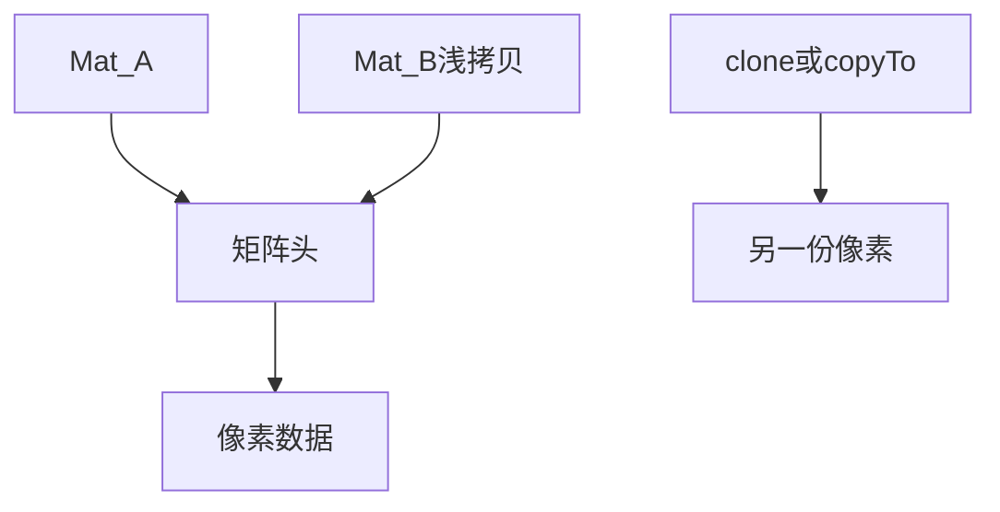
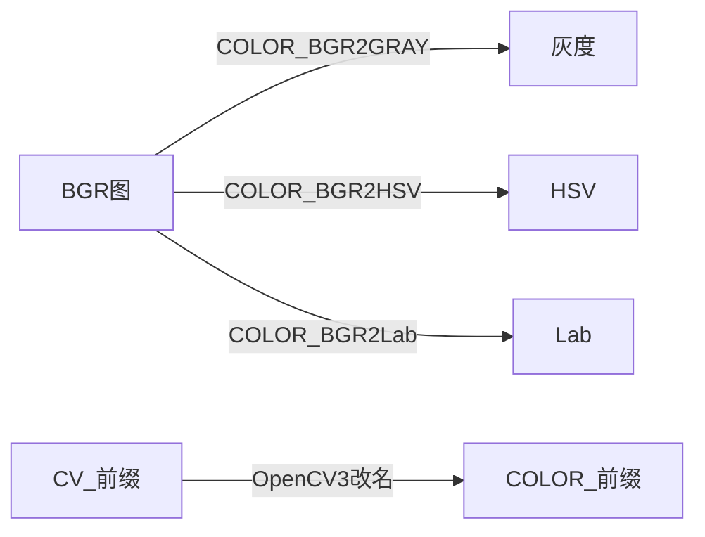
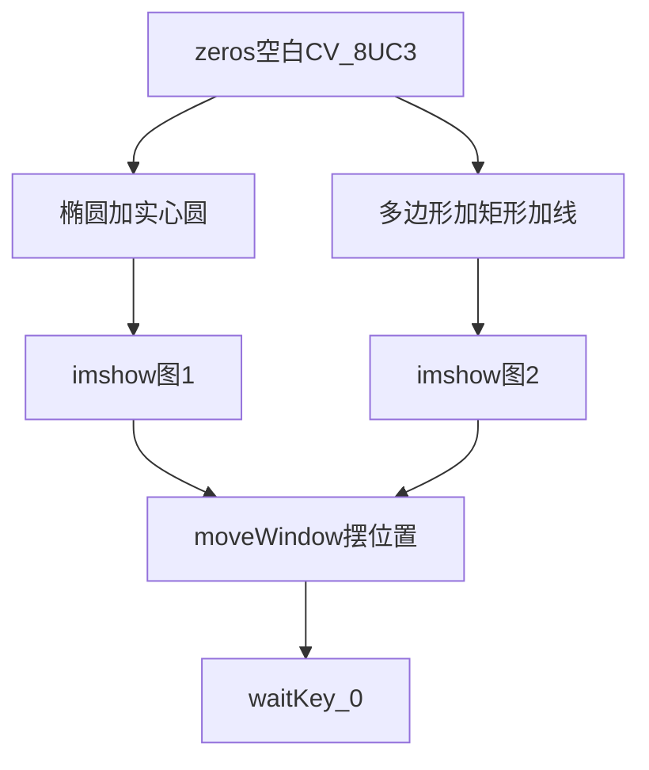

# 第四章 OpenCV 数据结构与基本绘图

来源：《OpenCV3编程入门》（毛星云等，电子工业出版社，2015）

## 本章总览

这一章是第二部分「初探 core 组件」的第一站。章首导读列出四件事：`Mat` 怎么用、控制台怎么格式化打印、常用数据结构有哪些、基本图形怎么画。学完应能回答：拷贝 `Mat` 会不会把像素再复制一份、类型码 `CV_8UC3` 怎么拆、`Scalar(a,b,c)` 哪个是蓝、`cvtColor` 的 `CV_` 和 `COLOR_` 差在哪、`thickness = -1` 为什么能画出实心。


本章示例程序编号 19–20：`Mat` 格式化输出、基本图形绘制（化学原子示意 + 组合图）。

## 核心知识点

### 图像在机器里是什么

屏幕上看见的是图，设备里存的是每个点的数值。一张图就是一张**像素矩阵**。OpenCV 的本职工作，就是处理、改写这些矩阵。

### `Mat`：从手动释放到引用计数

OpenCV 早期走 C 接口，图装在 **`IplImage*`** 里，用完必须自己 `release`，项目一大就容易漏。2.0 起主推 C++ 接口和 **`Mat`**：内存自动管。书说除非嵌入式环境只支持 C，否则没必要再死守旧 C 接口。函数名向 MATLAB 靠，和读写显示那套 `imread` / `imwrite` / `imshow` 同一路。

`Mat` 拆成两块：

| 部分 | 装着什么 | 大小 |
|---|---|---|
| 矩阵头 | 尺寸、存储方式、数据地址 | 固定、很小 |
| 数据指针 | 真正的像素 | 随图像变，通常很大 |

复制大图很贵，所以 OpenCV 用**引用计数**：每个 `Mat` 有自己的头，但多份对象可以指向同一块像素。赋值、拷贝构造只复制头和指针，不复制像素。

```cpp
Mat A, C;                              // 只造头
A = imread("1.jpg", CV_LOAD_IMAGE_COLOR); // 这时才分配像素
Mat B(A);                              // 拷贝构造，共享数据
C = A;                                 // 赋值，共享数据
```

`A`、`B`、`C` 改像素会互相影响。也可以只给一块区域做新头（ROI）：

```cpp
Mat D(A, Rect(10, 10, 100, 100));   // 矩形框出一块
Mat E = A(Range::all(), Range(1, 3)); // 用行、列范围框
```

`Range::all()` 在后文 4.2.6 对照 MATLAB 的 `:`；`Range(a, b)` 对照 `a:b`。

要真正复制像素，用 `clone()` 或 `copyTo()`：

```cpp
Mat F = A.clone();
Mat G;
A.copyTo(G);
```

改 `F`、`G` 不影响 `A`。

引用计数规则：复制头则计数加一，释放头则减一，减到 0 才清掉底层矩阵。

必须记住的四条：

1. 输出图的内存一般由函数自动分配（除非另有指定）。
2. C++ 接口下不必自己释放。
3. 赋值和拷贝构造只拷头（浅拷贝）。
4. 要拷像素，用 `clone()` / `copyTo()`（深拷贝）。



### 像素值怎么存：颜色空间和深度

存什么数，取决于**颜色空间**和**数据类型**。

| 颜色空间 | 本章说法 |
|---|---|
| 灰度 | 最简单，只有黑、白和中间灰 |
| RGB | 最常见；有时再加 **Alpha** 表示透明 |
| HSV / HLS | 拆成色调、饱和度、亮度；对光照变化更稳 |
| YCrCb | JPEG 里常用 |
| CIE L\*a\*b\* | 感知上更均匀，适合量两色距离 |

OpenCV 默认通道顺序是 **BGR**，不是 RGB。这一点后面 `Scalar`、`cvtColor` 还会再强调。

深度和精度：

| 类型 | 书中写法 |
|---|---|
| `char` | 1 字节（8 位）。无符号 0–255，有符号 −127～+127 |
| `float` | 4 字节（32 位） |
| `double` | 8 字节（64 位） |

三个 `char` 就能表示约 1600 万种 RGB 颜色。`float` / `double` 更准，也更占内存。

### 类型码：`CV_8UC3` 怎么拆

多通道二维图的类型名按这个模板拼：

`CV_[位数][带符号与否][类型前缀]C[通道数]`

例如 `CV_8UC3`：8 位无符号 `char`，每像素 3 通道。预定义通道数最多到 4。通道数也可以写成函数形式，如 `CV_8UC(2)`。

`Scalar` 用来给矩阵填初值。4.1.4 把它说成短向量；4.2.2 又写明常用的 `Scalar` 其实是 `Scalar_<double>`。预定义通道最多四个。

### 显式创建 `Mat` 的七种方法

调试时，二维矩阵可以直接 `cout << M`。七种造法如下。

| 方法 | 做法 | 主要参数 / 写法 | 约束&坑点 |
|---|---|---|---|
| 一、构造函数 | 最常用 | `Mat M(2, 2, CV_8UC3, Scalar(0, 0, 255));` → rows、cols、类型、初值 | 第 3 章 `Mat pic(320, 640, Scalar(100))` **没写 type**，对照本章应是不完整写法 |
| 二、多维构造 | 维数 + 各维尺寸数组 | `int sz[3] = {2,2,2}; Mat L(3, sz, CV_8UC, Scalar::all(0));` | 用于超过二维的矩阵 |
| 三、包旧指针 | 给已有 `IplImage*` 做新头 | `IplImage* img = cvLoadImage("1.jpg", 1); Mat mtx(img);` | 旧 C 结构接到新容器；不负责把旧指针的释放规则讲完 |
| 四、`create()` | 成员函数按尺寸、类型分配 | `M.create(4, 4, CV_8UC(2));` | **不能设初值**。尺寸或类型变了才重新分配。书中运行结果里出现过残留值 205 |
| 五、MATLAB 风格 | 静态函数 | `Mat::eye` / `ones` / `zeros`，如 `Mat::eye(4,4,CV_64F)`、`ones(2,2,CV_32F)`、`zeros(3,3,CV_8UC1)` | 空白画布常用 `zeros` |
| 六、逗号初始化 | 小矩阵逐元素 | `Mat C = (Mat_<double>(3,3) << 0,-1,0, -1,5,-1, 0,-1,0);` | 适合核、小掩模 |
| 七、已有对象再做头 | `row` / ROI 后再深拷 | `Mat RowClone = C.row(1).clone();` | 这里的 `clone()` 会拷出独立数据 |

方法一运行结果：2×2、每像素 `[0, 0, 255]`（BGR 下是纯红）。方法五对应单位阵、全 1、全 0。方法六得到中心为 5 的 3×3。方法七取出第 1 行（0 起算）得到 `[-1, 5, -1]`。

### 格式化输出：`<<` 和 `format`

先造一张随机矩阵再打印：

```cpp
Mat r = Mat(10, 3, CV_8UC3);
randu(r, Scalar::all(0), Scalar::all(255));
```

`randu` 要上下界，保证随机数落在给定范围。

| 风格 | OpenCV2 写法 | OpenCV3 写法 | 观感 |
|---|---|---|---|
| 默认 | `cout << r` | 同左 | 方括号，元素逗号分隔，行用分号 |
| Python | `format(r, "python")` | `format(r, Formatter::FMT_PYTHON)` | 多层方括号，像 Python 列表 |
| 逗号分隔 CSV | `format(r, "csv")` | `format(r, Formatter::FMT_CSV)` | 逗号分隔 |
| Numpy | `format(r, "numpy")` | `format(r, Formatter::FMT_NUMPY)` | 带 `array([[[...]]], type='uint8')` |
| C 语言 | `format(r, "C")` | `format(r, Formatter::FMT_C)` | 花括号，方便贴进 C 数组 |

示例 19 就是把这些风格跑一遍；运行窗标明配套第 19 例、OpenCV 3.0.0-beta。

### 其他结构也能直接 `<<`

| 对象 | 本章写法 | 打印结果形态 |
|---|---|---|
| 二维点 | `Point2f p(6, 2);` | `[6, 2]` |
| 三维点 | `Point3f p3f(8, 2, 0);` | `[8, 2, 0]` |
| `vector<float>` | 先 `push_back`，再 `cout << Mat(v)` | 打成一列 |
| `vector<Point2f>` | 填 20 个点后直接 `cout << points` | `[x, y; x, y; ...]` |

`vector<Point2f>` 例里点按 `Point2f(i * 5, i % 7)` 填。

### 点、颜色、尺寸、矩形

#### `Point`

二维点，成员 `x`、`y`。两种写法：先默认构造再赋值，或 `Point(10, 8)`。

书中 typedef：`Point_<int>` → `Point2i` → `Point`；`Point_<float>` → `Point2f`。也就是 `Point`、`Point2i`、`Point_<int>` 是同一路；浮点用 `Point2f`。

#### `Scalar`

四元数组，常用来传像素值。只写三个数时按三通道用。

`Scalar(a, b, c)` 的通道对应：

| 参数 | 通道 |
|---|---|
| `a` | 蓝 B |
| `b` | 绿 G |
| `c` | 红 R |

来源：`Scalar_` 是 `Vec4x` 的变种；日常 `Scalar` 是 `Scalar_<double>`。所以不少接口既能收 `Mat` 也能收 `Scalar`。

#### `Size`

表示宽高。源码路径书指向 `opencv/sources/modules/core/include/opencv2/core/core.hpp`。`Size_<int>` → `Size2i` → `Size`，三者等价。

最常用构造：`Size_(_Tp _width, _Tp _height)`。成员 `width`、`height` 可直接读写。`area()` 返回宽×高。还能从 `CvSize`、`CvSize2D32f`、`Point_` 转过来。例：`Size(5, 5)`。

注意：`Mat` 构造的前两个数是 **rows、cols**（先行后列）；`Size` 是 **width、height**（先宽后高）。正方形时看不出来，矩形时容易对调。

#### `Rect`

成员：`x`、`y`（左上角）、`width`、`height`。

| 名称 | 功能 | 主要参数 | 约束&坑点 |
|---|---|---|---|
| `Size()` | 取出尺寸 | 无 | 返回 `Size` |
| `area()` | 面积 | 无 | 宽×高 |
| `contains(Point)` | 点是否在矩形内 | 一个点 | — |
| `inside(Rect)` | 自己是否完全在另一个矩形里 | 另一个 `Rect` | 和 `contains` 别反着记 |
| `tl()` / `br()` | 左上角 / 右下角 | 无 | 第 3 章画框就用过这对点 |
| `rect1 & rect2` | 交集 | 两个矩形 | — |
| `rect1 \| rect2` | 并集（包住两者的最小矩形） | 两个矩形 | 不是像素级或运算 |
| `rect + point` | 平移 | 一个 `Point` | 位置挪走，尺寸不变 |
| `rect + size` | 缩放 | 一个 `Size` | 书页 98 出现 `Rect rectScale = rect + size;` |

### `cvtColor`：颜色空间转换

```cpp
void cvtColor(InputArray src, OutputArray dst, int code, int dstCn=0);
```

| 名称 | 功能 | 主要参数 | 约束&坑点 |
|---|---|---|---|
| `cvtColor` | 在颜色空间之间转换 | `src` 输入；`dst` 输出；`code` 转换代号；`dstCn` 目标通道数，默认 0 | `dstCn=0` 时书称目标通道数自动跟源图走。默认通道顺序是 BGR |

版本对照：

```cpp
cvtColor(srcImage, dstImage, CV_GRAY2BGR);     // OpenCV 2
cvtColor(srcImage, dstImage, COLOR_GRAY2BGR);  // OpenCV 3
```

2.x 用 `CV_` 前缀，3.x 改成 `COLOR_`。书中对照例有一处注释写成「转灰度」，但标识是 `GRAY2BGR`（灰度→彩色），以标识为准。

表 4.1（OpenCV2，`CV_*`）和表 4.2（OpenCV3，`COLOR_*`）按转换族列出标识。族名两边一致，只换前缀。书表用「等」收尾，下面只收本章明确点到的族和代表标识。

| 转换族 | OpenCV2 代表 | OpenCV3 代表 |
|---|---|---|
| RGB ↔ BGR / 带 Alpha | `CV_BGR2BGRA`、`CV_RGB2BGRA`、`CV_BGRA2RGBA`、`CV_BGRA2BGR` | `COLOR_BGR2BGRA` 等，前缀替换 |
| RGB ↔ 565 / 555 | `CV_BGR5652RGBA`、`CV_BGR2RGB555` | `COLOR_BGR5652RGBA`、`COLOR_BGR2RGB555` |
| RGB ↔ Gray | `CV_RGB2GRAY`、`CV_GRAY2RGB`、`CV_RGBA2GRAY`、`CV_GRAY2RGBA` | `COLOR_RGB2GRAY` 等 |
| RGB ↔ CIE XYZ | `CV_BGR2XYZ`、`CV_RGB2XYZ` 及反向 | `COLOR_BGR2XYZ` 等 |
| RGB ↔ YCrCb / YUV（JPEG） | `CV_BGR2YCrCb`、`CV_RGB2YCrCb` 及反向；YCrCb 可换成 YUV | `COLOR_*` 同族 |
| RGB ↔ HSV | `CV_BGR2HSV`、`CV_RGB2HSV` 及反向 | `COLOR_BGR2HSV` 等 |
| RGB ↔ HLS | `CV_BGR2HLS` 等 | `COLOR_BGR2HLS` 等 |
| RGB ↔ CIE L\*a\*b\* | `CV_BGR2Lab` 等 | `COLOR_BGR2Lab` 等 |
| RGB ↔ CIE L\*u\*v\* | `CV_BGR2Luv` 等 | `COLOR_BGR2Luv` 等 |
| RGB ↔ Bayer | `CV_BayerBG2BGR` / `GB` / `RG` / `GR` 及 RGB 方向；CCD/CMOS 常见 | `COLOR_Bayer*` |
| YUV420 ↔ RGB | `CV_YUV420sp2BGR`、`CV_YUV420i2RGB` 等 | `COLOR_YUV420*` |

试跑例：读 `1.jpg`，`cvtColor(..., COLOR_BGR2Lab)`，再 `imshow`。头文件用 `imgproc` + `highgui`（仍是 2.x 双层路径）。书说表里其他标识可以替换 `COLOR_BGR2Lab` 做试验。



### 4.2.6 点到为止的其它符号

本节只列名字，不给完整原型：

| 类别 | 本章点到的名字 |
|---|---|
| 轻量矩阵 | `Matx`（尺寸事先定死，如 `Matx23f` 表示 2×3 float）；`Vec` 是一维 `Matx`，如 `typedef Vec<uchar,2> Vec2b` |
| 范围 | `Range`：`Range::all()` ≈ MATLAB `:`；`Range(a,b)` ≈ `a:b` |
| 内存 | `alignPtr`、`alignSize`、`allocate`、`deallocate`、`fastMalloc`、`fastFree` |
| 数学 | `fastAtan2`、`cubeRoot`；`cvCeil` / `cvFloor` / `cvRound`；`cvIsInf` / `cvIsNaN` |
| 文字 | `getTextSize`、`cvInitFont`、`putText` |
| 描边 | `circle`、`clipLine`、`ellipse`、`ellipse2Poly`、`line`、`rectangle`、`polylines`、`LineIterator` |
| 填充 | `fillConvexPoly`、`fillPoly` |
| 随机 | `RNG()`：初始化随机数状态 |

其余少用结构，书指向官方文档和源码。

### 基本图形：五个函数 + 两张示意

4.3 用来画的五个函数：`line`、`ellipse`、`rectangle`、`circle`、`fillPoly`。例程改编自官方样例，自定义几个包装函数，画出化学原子示意和组合图。窗口边长宏：`WINDOW_WIDTH 600`。

本章**没有**单独列出这五个函数的完整官方原型，参数从包装函数和 `main` 里还原。线型 `lineType` 的完整含义书指向第 8 章 8.1.2 的表 8.3。

| 名称 | 功能 | 本章用到的参数 | 约束&坑点 |
|---|---|---|---|
| `ellipse` | 画椭圆 | 目标图；中心 `Point`；轴 `Size`；旋转角；起止角 0～360；颜色 `Scalar`；线宽；线型 | 例：中心在窗正中，轴 `WINDOW_WIDTH/4` × `WINDOW_WIDTH/16`，颜色 `Scalar(255,129,0)`（BGR 偏蓝），线宽 2，线型 8 |
| `circle` | 画圆 | 目标图；圆心；半径；颜色；线宽；线型 | **线宽 −1 表示实心**。例：半径 `WINDOW_WIDTH/32`，`Scalar(0,0,255)` 纯红 |
| `fillPoly` | 填多边形 | 目标图；顶点指针数组；每块顶点数；多边形个数；颜色；线型 | 例：20 个点、1 个多边形、白色 `Scalar(255,255,255)`。用来画凹多边形 |
| `line` | 线段 | 目标图；起点；终点；颜色；线宽；线型 | 例：黑色、线宽 2、线型 8（8 连通） |
| `rectangle` | 矩形 | 目标图；对角两点；颜色；线宽；线型 | 例：`Point(0, 7*W/8)` 到 `Point(W,W)`，`Scalar(0,255,255)` 黄，**线宽 −1 实心**，线型 8 |

`lineType = 8` 书解释为 8 连通线。

> 📝待补全：【lineType / 线型表】完整讲解位于本书第8章，待处理到第8章后回来补充本处内容。

`main` 的流程（示例 20，不抄整段）：

1. 头文件：`core` + `highgui` + `imgproc`，`using namespace cv;`
2. 两张空白画布：`Mat::zeros(WINDOW_WIDTH, WINDOW_WIDTH, CV_8UC3)`
3. 原子图：四个椭圆（角 90 / 0 / 45 / −45）+ 中心实心圆
4. 组合图：`fillPoly` 凹多边形 → 底部实心黄矩形 → 若干黑线段
5. `imshow` 两窗，并用 `moveWindow` 把第二窗挪到第一窗右侧；`waitKey(0)`



章末清单把构造函数写成 `Mat::Mat()`，把 `create` 写成 `Mat::Create()`（正文调用是小写 `create()`）。

## 容易混淆的点

- **浅拷贝 vs 深拷贝**：`B(A)`、`C = A` 共享像素；只有 `clone` / `copyTo` 才各拿一份。改 ROI 等于改原图对应块。
- **`create()` 不会填初值**：只负责按尺寸、类型分配。内容可能是旧内存里的残留数。
- **`Mat(rows, cols, type)` vs `Size(width, height)`**：矩阵先写行再写列；尺寸先写宽再写高。
- **第 3 章 `Mat pic(320, 640, Scalar(100))`**：对照本章方法一，中间应有类型码。按本章应写成带 `type` 的四参数构造，或先 `create` 再赋值。
- **`Scalar(a,b,c)` 是 BGR**：第一个数是蓝。`Scalar(0,0,255)` 是红，`Scalar(255,129,0)` 偏蓝，`Scalar(0,255,255)` 是黄。
- **`CV_8UC3` 拆开读**：位数 + 符号 + 类型前缀 + 通道。不要把 `8U` 当成「8 通道」。
- **`CV_*` vs `COLOR_*`**：颜色转换在 3.x 换前缀；2.x 旧名可能编不过。
- **`COLOR_GRAY2BGR` 不是转灰度**：灰度→三通道。转灰用 `COLOR_BGR2GRAY` / `CV_BGR2GRAY`。
- **线宽 −1 = 填实**：`circle`、`rectangle` 都是这个约定。正数才是描边宽度。
- **`lineType = 8` ≠ 线宽 8**：一个是连通方式，一个是粗细。完整线型表在第 8 章。
- **`Rect` 的 `\|` 是外接并集**：得到包住两个矩形的最小矩形，不是把像素或在一起。
- **`IplImage*` 还能喂给 `Mat`**：方法三只是包一层头；日常新代码仍以 `Mat` 为准。
- **`format` 的第二个参数**：2.x 写字符串 `"python"` / `"csv"` / `"numpy"` / `"C"`；3.x 写 `Formatter::FMT_*`。

## 本章要点总结

- `Mat` = 小头 + 大块像素；赋值只拷头，计数到 0 才释放；独立副本用 `clone` / `copyTo`。
- 类型码：`CV_[位数][S/U][前缀]C[通道]`，如 `CV_8UC3`。
- 七种造法：构造函数、多维尺寸数组、包 `IplImage*`、`create()`、`eye`/`ones`/`zeros`、逗号初始化、对已有对象再 `clone`。
- 打印：默认可 `<<`；另外四种风格靠 `format`，2/3 写法不同。
- `Point` / `Point2f`、`Scalar`（BGR）、`Size`（宽高）、`Rect`（左上 + 宽高，支持交、并、平移、缩放）。
- `cvtColor(src, dst, code, dstCn=0)`：3.x 用 `COLOR_*`，2.x 用 `CV_*`；默认通道顺序 BGR。
- 绘图五件套：`ellipse`、`circle`、`fillPoly`、`line`、`rectangle`；`thickness=-1` 填实。空白画布用 `Mat::zeros(..., CV_8UC3)`。
- 示例 19 练 `Mat` 输出，示例 20 练组合绘图。
