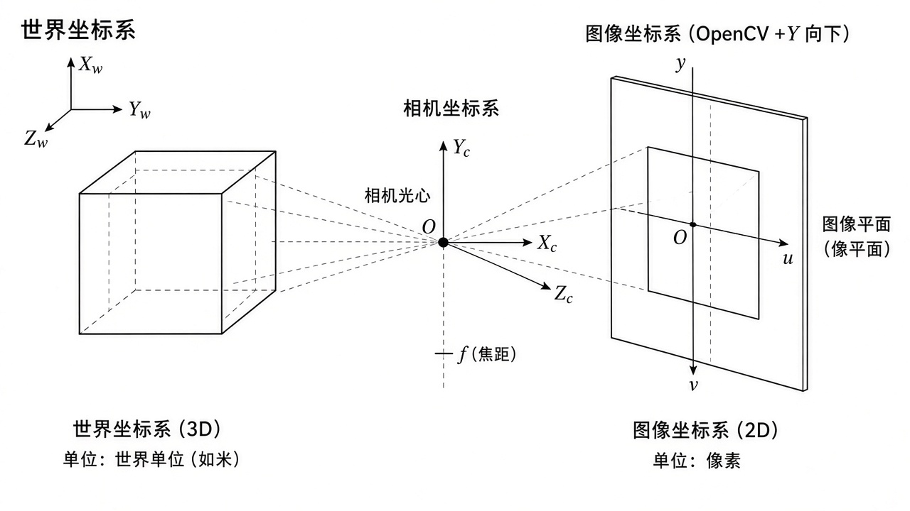
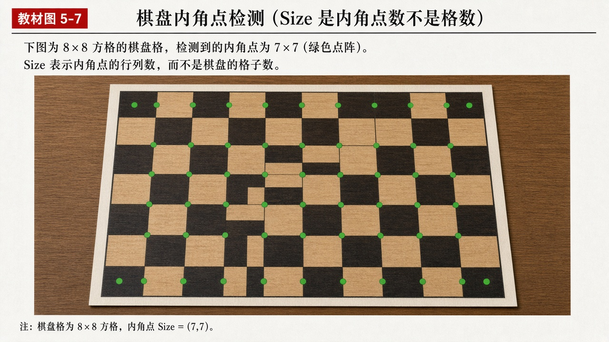
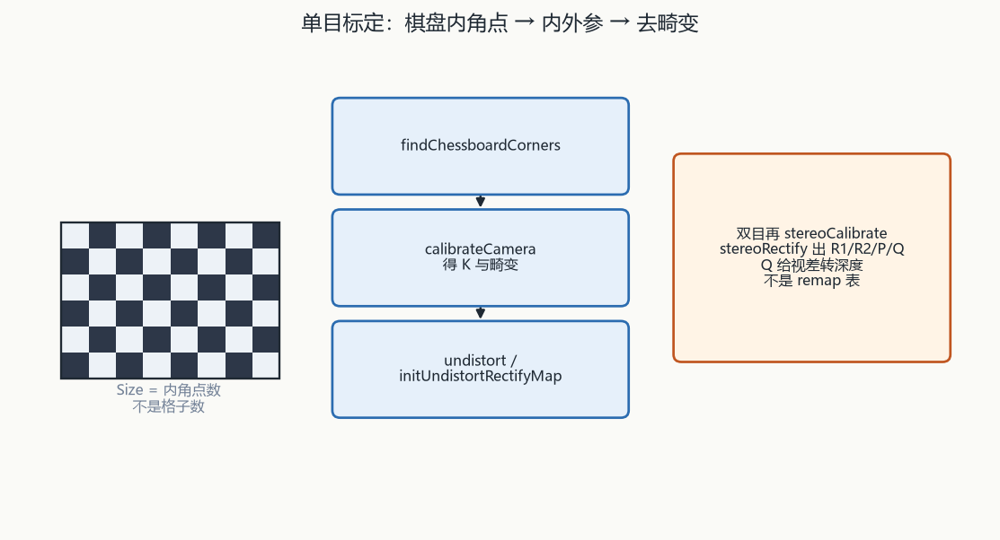

# 第10章 深度估计与立体视觉

来源：文档1《OpenCV 4计算机视觉:Python语言实现》第4章「深度估计和分割」（PDF 132–178）**只收深度摄像头 / 视差 / 立体 / SfM**（4.1–4.7，约 PDF 132–165）；**跳过 4.8 GrabCut、4.9 分水岭**（已在融合第8章）。文档2《opencv4快速入门》第10章「立体视觉」（用户给定书页 323–353 = PDF 326–356；实测章标题在 PDF 328 / 书页约 325，双目校正收到 PDF 356）。扫描件 OCR 嘈杂；吃不准处标【信息缺口】。

## 本章总览

深度可以「深度摄像头直接给」，也可以「两张普通图用对极几何推视差」。学完应能回答：OpenNI 各通道单位是毫米还是米、10 位图为什么被 `imshow` 显示成全黑、视差中位数掩模在挡什么、StereoSGBM 和标定是不是同一件事、针孔模型里像素坐标系和图像坐标系差在单位、`calibrateCamera` 返回值是什么、双目标定除了内参还要 R/T。

文档1侧重深度摄像头通道（OpenNI 2）、10 位→8 位、`createMedianMask` 抠前景、阳光下红外深度失效、对极几何直觉、`cv2.StereoSGBM` 交互调参。GrabCut/分水岭不读。

文档2侧重单目针孔、齐次坐标、棋盘/圆点标定板、`calibrateCamera`、去畸变、`projectPoints`、`solvePnP` / `solvePnPRansac`、`Rodrigues`、双目模型、`stereoCalibrate`、`stereoRectify`。

把 3D 轴画到被跟踪物体上，用的是 `projectPoints` 把轴端点投到像素。标定、内参和畸变仍在本章算；画轴与 AR 循环在第11章。

👉 完整深度讲解见第11章。

Cameo 换脸时，每人脸矩形各做一份深度中位数掩模，再 `swapRects`，不要整块矩形把脸旁背景一起换走。深度单位与阳光红外失效仍以本章为准。

👉 完整深度讲解见第12章。

文档1把 `solvePnPRansac` 详细 12 参数与 AR 循环放在相机/AR 章。文档2把 PnP 写在标定章，本章只收「由 3D–2D 点求位姿」的标定用法，不写增强现实绘制。

StereoSGBM 文档1只写「为若干参数设初值后构造实例」，完整参数表是插图。

👉 该细节原书未完整抽出，暂不展开（文档1 表4-1 为插图）。

## 核心知识点

### 文档1：深度摄像头通道（OpenNI 2）

深度摄像头一个设备多个通道：不同镜头/传感器，或不同类型的数据（彩色 vs 深度）。给定相机可能只支持其中一部分。

🔑 关键速记：毫米深度、米点云、像素视差，三种单位不要混。

#### 通道清单

下面这张表按 OpenNI 2 通道列出单位和坑。设备可能只实现其中一部分。

| 名称 | 功能 | 主要参数 | 约束&坑点 |
|---|---|---|---|
| `cv2.CAP_OPENNI_DEPTH_MAP` | 深度图 | 每像素 16 位无符号，单位毫米 | 灰度图，值越大通常越远（按「到曲面的估计距离」） |
| `cv2.CAP_OPENNI_POINT_CLOUD_MAP` | 点云伪彩 | BGR：B=x（右）、G=y（上）、R=z（深），单位米 | 从相机视角看 |
| `cv2.CAP_OPENNI_DISPARITY_MAP` / `_32F` | 视差图 | 8U 整数 或 32F 浮点 | 近处视差大、看起来更亮。立体视差 = 两视角叠在一起时孪生点的像素间距 |
| `cv2.CAP_OPENNI_VALID_DEPTH_MASK` | 有效深度掩模 | 非零有效、零无效 | 红外闪光被挡的阴影区会无效 |
| `cv2.CAP_OPENNI_BGR_IMAGE` / `GRAY_IMAGE` | 可见光彩/灰 | 8 位 | 有的深度相机没有 BGR 传感器 |
| `cv2.CAP_OPENNI_IR_IMAGE` | 近红外 | 16 位整数，常用不满 16 位（如 10 位） | 深度机常投射近红外网格；脸上可能有亮点 |

记住：点云的 B/G/R 分别是 x/y/z，单位是米，不是彩色照片。

设备索引例：`cv2.CAP_OPENNI2`（Kinect）、`cv2.CAP_OPENNI2_ASUS`（华硕 Xtion PRO / Occipital Structure）。CameoDepth 优先取视差 + 有效掩模 + BGR，没有 BGR 再取红外灰。

🔑 关键速记：优先视差+有效掩模+BGR；没有彩图再退红外。

### 文档1：10 位图显示与中位数掩模

`imshow` 对 16 位图的缩放假设，和红外实际只有 10 位，会对不上。中位数掩模用来抠「和主体差不多远」的像素。

🔑 关键速记：10 位当 16 位显示会全黑；掩模差 ≥12 当异常。

#### `imshow` 与 10 位红外

`cv2.imshow`：16U/32S ÷256 再截到 8U；32F/64F 假定 [0,1] 再 ×255。若数据其实是 10 位（0–1023）却按 16 位去 ÷256，会暗约 64 倍，看起来全黑。

文档1做法：`shouldConvertBitDepth10To8==True` 且帧为 16U 时，假设是 10 位，右移 2 位（`>>2`，等价整数 ÷4）再显示。对 `CAP_OPENNI_IR_IMAGE` 尤其有用。

🔑 关键速记：16U 一律 ÷256；10 位红外要自己 `>>2`。

#### `createMedianMask`

`createMedianMask(disparity, validDepthMask, rect=可选)`：在有效像素里算视差中位数；与中位数相差 ≥12 的视为异常（太近或太远），掩模 0；接受区 255。12 是实验值，可按相机改。

有 `rect` 时掩模与该矩形同大（预告第5章人脸框，融合第12章）。`numpy.median`：奇数长度取中，偶数取中间两数平均。`numpy.where` 按布尔写入 0/255。

局限：肩部可能被误剔、头发后阴影可能被误留。户外阳光近红外比相机闪光灯亮得多，典型深度相机看不到红外图案，深度失效。

替代：两台普通相机同时拍 = 立体视觉；一台相机移动多视角 = 运动结构（SfM）。本章文档1假定主体静止。

🔑 关键速记：阳光会冲掉红外图案；没有深度机就改 SGBM 或 SfM。

### 文档1：对极几何与 StereoSGBM

对极几何：从两台相机分别向场景中每个物体拉虚线，用对应线交点估距离。输入：同一主体两个视角。

🔑 关键速记：SGBM 出视差，标定出几何；不是同一层问题。

#### 半全局块匹配

算法：半全局块匹配 SGBM，`cv2.StereoSGBM`，用 `compute` 出视差图；近处更亮，黑色表示不一致/无效。文档1用滑块改实例属性并重算。书称「已用许多但不是全部参数」，完整表 4-1 是插图。

下面这张表故意不编造未抽出的形参。

| 名称 | 功能 | 主要参数 | 约束&坑点 |
|---|---|---|---|
| `cv2.StereoSGBM` + `compute` | 由左右图算视差 | 文档1只写「为若干参数设初值后构造实例」 | 【信息缺口：表 4-1 文本层为空，具体 `minDisparity` / `numDisparities` / `blockSize` 等以原书插图为准】 |

👉 该细节原书未完整抽出，暂不展开（文档1 表4-1 为插图）。

GrabCut、分水岭（PDF 166–178）已在第8章，本章不重复。

🔑 关键速记：近处视差亮；黑色是不一致或无效。

### 文档2：单目针孔与坐标系

像素坐标系原点在图像左上，单位是像素。图像坐标系原点在主点，单位是物理长度。二者不要当成同一套轴。

🔑 关键速记：像素左上；图像系原点在光轴落点，单位是毫米级长度。

#### 三套坐标系

像素坐标系：轴与图像坐标系平行同向。图像坐标系：原点在光轴落在感光片上的点（常为几何中心），\(O_i x\) 水平向右、\(O_i y\) 向下。二者靠主点 \((c_x,c_y)\)（常约宽/高的一半）和单像素物理宽高 \(dx,dy\) 互转，齐次形式见书式 (10.2)。

相机坐标系：原点在镜头光心，\(Z_c\) 沿光轴由感光片指向镜头为正，\(X_c\) 平行成像面向右，\(Y_c\) 向下。针孔：空间点 P 投到像点 P'，光心到像面距离为焦距 \(f\)，相似比见式 (10.3)。

工艺误差和震动都会让真实内参偏离铭牌，使用前要标定。

🔑 关键速记：针孔用相似比；铭牌焦距不能直接当内参。

#### 齐次坐标转换

下面这张表两个函数名方向容易读反：To 是「变成齐次」，From 是「从齐次回来」。

| 名称 | 功能 | 主要参数 | 约束&坑点 |
|---|---|---|---|
| `void cv::convertPointsToHomogeneous(InputArray src, OutputArray dst)` | 非齐次 → 齐次（维数 +1） | 2D：`vector<Point2f>`/`Mat` → `vector<Point3f>`/`Mat`。3D 输入则输出只能进 `Mat`（维数=通道） | 函数名 To = 「去」齐次 |
| `void cv::convertPointsFromHomogeneous(InputArray src, OutputArray dst)` | 齐次 → 非齐次（维数 −1） | 与上相反；齐次维数 >4 只能用 `Mat` | From = 「从齐次来」 |

记住：3D 变齐次、或齐次维数 >4，输出只能进 `Mat`。

🔑 关键速记：To 加一维，From 减一维。

### 文档2：标定板角点

内角点 = 黑白格相接处。8×8 格 → 7×7 内角点。建议行列数不相等，便于认方向。找到且数目与 `patternSize` 一致才算成功（返回非 0）。

🔑 关键速记：`Size` 填内角点数，不是格子数。

#### 棋盘、圆点、画角点

下面这张表是找角点/圆心的接口；找到的只是近似坐标，还要亚像素。

| 名称 | 功能 | 主要参数 | 约束&坑点 |
|---|---|---|---|
| `bool cv::findChessboardCorners(InputArray image, Size patternSize, OutputArray corners, int flags=CALIB_CB_ADAPTIVE_THRESH+CALIB_CB_NORMALIZE_IMAGE)` | 棋盘内角点 | `image`：`CV_8U` 灰或彩。`patternSize`：内角点 (列,行)【书称行和列】。`corners`：`vector<Point2f>`，逐行从左到右。`flags` 可组合（`+`） | 只给近似坐标，还需亚像素 |
| `bool cv::find4QuadCornerSubpix(InputArray img, InputOutputArray corners, Size region)` | 专用于标定板的亚像素 | `region` 常用 `Size(5,5)` 或 `Size(3,3)` | 输入就是上一函数的点 |
| `bool cv::findCirclesGrid(InputArray image, Size patternSize, OutputArray centers, int flags=CALIB_CB_SYMMETRIC_GRID, const Ptr<FeatureDetector>& blobDetector=SimpleBlobDetector::create())` | 圆点阵列圆心 | `flags`：对称 / 非对称 / `CLUSTERING`（透视更稳、背景杂乱更敏感）。默认找浅底黑圆 | 返回 0/1 同棋盘 |
| `void cv::drawChessboardCorners(InputOutputArray image, Size patternSize, InputArray corners, bool patternWasFound)` | 画角点 | `image` 必须 `CV_8U` 彩色。`patternWasFound=false` 只画点；`true` 且完整则按行着色连线，不完整用红圈 | 与 `drawKeypoints` 不是同一个函数 |

记住：画角点必须彩图；`cornerSubPix`（第9章）也可细化棋盘点。

表 10-1 棋盘 flags（文档2）：`CALIB_CB_ADAPTIVE_THRESH`、`NORMALIZE_IMAGE`（阈值前均衡化）、`FILTER_QUADS`（轮廓阶段滤假四边形）、`FAST_CHECK`。默认常把前两项加在一起。

🔑 关键速记：成功才返回非 0；点序是逐行从左到右。

### 文档2：单目标定、去畸变、投影、位姿

世界系常把标定板当 \(Z=0\) 平面，格真实尺寸写入 `Point3f`（例 10 cm）。多图：`vector<vector<Point3f>>` / `vector<vector<Point2f>>`。

🔑 关键速记：多图同一相机只出一套内参；每图各有一套 rvec/tvec。

#### `calibrateCamera` 与去畸变

下面这张表从标定走到去畸变。`calibrateCamera` 的返回值是重投影误差（double），不是成功与否的 bool。

| 名称 | 功能 | 主要参数 | 约束&坑点 |
|---|---|---|---|
| `double cv::calibrateCamera(InputArrayOfArrays objectPoints, InputArrayOfArrays imagePoints, Size imageSize, InputOutputArray cameraMatrix, InputOutputArray distCoeffs, OutputArrayOfArrays rvecs, OutputArrayOfArrays tvecs, int flags=0, TermCriteria criteria=TermCriteria(COUNT+EPS, 30, DBL_EPSILON))` | 算内参、畸变、每图外参 | 返回重投影误差（double）。`cameraMatrix`：3×3 `CV_32FC1`。畸变也是 `CV_32FC1`。`rvecs`/`tvecs`：`vector<Mat>`，相机系相对世界系 | 多图同一相机只出一套内参。`flags` 见表 10-3 |
| `void cv::initUndistortRectifyMap(InputArray cameraMatrix, InputArray distCoeffs, InputArray R, InputArray newCameraMatrix, Size size, int m1type, OutputArray map1, OutputArray map2)` | 生成去畸变/校正映射 | `R` 可给单位阵。`m1type`：`CV_32FC1` / `CV_32FC2` / `CV_16SC2`。`map1` 为 x，`map2` 为 y | 再交给 `remap` |
| `void cv::remap(...)` | 按映射重采样 | `dst` 尺寸跟 `map1`，类型跟 `src`。不支持 `INTER_AREA` | 第3章几何变换已见；此处专用于去畸变 |
| `void cv::undistort(InputArray src, OutputArray dst, InputArray cameraMatrix, InputArray distCoeffs, InputArray newCameraMatrix=noArray())` | 一步去畸变 | 等价「单位 R 的 initUndistortRectifyMap + 双线性 remap」。无对应像素填 0。畸变系数个数按模型可以是 4/5/8/12/14；空矩阵=无畸变 | 比 map+remap 省事 |

记住：`remap` 此处不支持 `INTER_AREA`；空畸变矩阵表示无畸变。

表 10-3 常用 `flags`（OCR 简记残，含义按正文）：`CALIB_USE_INTRINSIC_GUESS`（要有内参初值，否则主点放图像中心、最小二乘估焦距）、`FIX_PRINCIPAL_POINT`、`FIX_ASPECT_RATIO`、`ZERO_TANGENT_DIST`（切向畸变置 0）、`FIX_K1`…`FIX_K6`、`RATIONAL_MODEL`（六阶径向，否则三阶）。

🔑 关键速记：`undistort` 等于单位 R 的 map + 双线性 remap。

#### 投影与 PnP

下面这张表是标定验证常用的投影和位姿；画轴进视频是第11章。

| 名称 | 功能 | 主要参数 | 约束&坑点 |
|---|---|---|---|
| `void cv::projectPoints(InputArray objectPoints, InputArray rvec, InputArray tvec, InputArray cameraMatrix, InputArray distCoeffs, OutputArray imagePoints, OutputArray jacobian=noArray(), double aspectRatio=0)` | 3D → 像素 | 点：`N×3`/`3×N`/`vector<Point3f>`。`rvec`/`tvec` 为 3×1。`aspectRatio≠0` 时固定宽高比。文档2例平均重投影误差 0.407301 | 雅可比默认不要。文档1 AR 章会再用它画轴 |
| `bool cv::solvePnP(...)` | 3D–2D 对应求 rvec/tvec | 用全部点；个别坏点会拉偏。`useExtrinsicGuess` 仅当算法为 `SOLVEPNP_ITERATIVE`。表 10-4 含 `SOLVEPNP_ITERATIVE` / `DLS` / `UPNP` / `AP3P` 等 | 标定验证可用；AR 主循环在第11章 |
| `bool cv::solvePnPRansac(..., bool useExtrinsicGuess=false, int iterationsCount=100, float reprojectionError=8.0, double confidence=0.99, OutputArray inliers=noArray(), int flags=SOLVEPNP_ITERATIVE)` | PnP+RANSAC | 重投影小于阈 → 内点，默认阈 8.0，迭代默认 100，置信默认 0.99 | 与文档1第9章（融合第11章）同名函数；文档1未在本章给默认值 |
| `void cv::Rodrigues(InputArray src, OutputArray dst, OutputArray jacobian=noArray())` | 旋转向量 ↔ 3×3 矩阵 | 输入向量则输出矩阵，反之亦然。雅可比 9×3 或 3×9 | 罗德里格斯公式见书 (10.13)(10.14) |

记住：文档2 默认重投影阈 8.0；文档1 AR 章会另给用法，不要混抄默认。

🔑 关键速记：`solvePnP` 吃全体点，`solvePnPRansac` 能丢外点。

### 文档2：双目模型、标定、校正

理想双目：两光轴平行、像面共面、x 轴共线。深度只跟该点在两图上的视差以及基线、焦距有关（式 10.16）。实际两相机之间既有平移也有旋转。

标定三步：① 各自内参+畸变；② 两相机之间 R、T（以及本征 E、基本 F）；③ 把像面校正到理想构型。

🔑 关键速记：先锁内参，再估 R/T；Q 给测距，不是 remap 表。

#### `stereoCalibrate` 与 `stereoRectify`

下面这张表默认 `CALIB_FIX_INTRINSIC`：先单目标定再锁内参。图像列表要左右配对。

| 名称 | 功能 | 主要参数 | 约束&坑点 |
|---|---|---|---|
| `double cv::stereoCalibrate(InputArrayOfArrays objectPoints, InputArrayOfArrays imagePoints1, InputArrayOfArrays imagePoints2, InputOutputArray cameraMatrix1, InputOutputArray distCoeffs1, InputOutputArray cameraMatrix2, InputOutputArray distCoeffs2, Size imageSize, InputOutputArray R, InputOutputArray T, OutputArray E, OutputArray F, int flags=CALIB_FIX_INTRINSIC, TermCriteria criteria=...)` | 双目标定 | 两相机同时拍同一板。E 含 R/T，F 再含两内参。默认 `CALIB_FIX_INTRINSIC`（先单目标定再锁内参） | 图像列表要左右配对。文档2例：每相机 4 张，格边 10 cm，文件名列表在 txt |
| `void cv::stereoRectify(InputArray cameraMatrix1, InputArray distCoeffs1, InputArray cameraMatrix2, InputArray distCoeffs2, Size imageSize, InputArray R, InputArray T, OutputArray R1, OutputArray R2, OutputArray P1, OutputArray P2, OutputArray Q, int flags=CALIB_ZERO_DISPARITY, double alpha=-1, Size newImageSize=Size(), Rect* validPixROI1=0, Rect* validPixROI2=0)` | 立体校正 | `R1`/`R2`：校正前→后的旋转。`P1`/`P2`：校正后投影阵。`Q`：视差→深度的映射，测距用、与「把图拉直」不是同一件事。`flags=0`：移动图像最大化有效区；`CALIB_ZERO_DISPARITY`：光心投影对齐。`alpha` 0～1：0 尽量铺满有效像素，1 显示校正后全图；默认不拉伸【OCR 默认印成 −1 一类「不拉伸」】 | 两图须同尺寸。之后仍用 `initUndistortRectifyMap` + `remap` 出左右校正图 |

【信息缺口：`stereoRectify` 的 `alpha` 默认值 OCR 为「默认值时不进行拉伸」，数字行残。】

记住：校正之后仍要 map+`remap` 才得到左右拉直图。

🔑 关键速记：E 含 R/T，F 再含两内参；Q 只给视差转深度。

## 易混淆点&差异对比

下面这张表对照两书主线：文档1从深度机出发，文档2从针孔标定出发。

| 对比项 | 文档1观点 | 文档2观点 |
|---|---|---|
| 本章主线 | 有深度相机就用通道+掩模；没有就 SGBM/SfM 估相对远近 | 先把针孔和标定算准，再谈双目 R/T 与校正 |
| 视差 | OpenNI 通道直接给，或 SGBM 从两张普通图算 | 理想双目里深度 ∝ 1/视差；先标定再谈数值 |
| PnP | 放到相机/AR 章（融合第11章）细讲 12 参数 | 写在单目标定后：验证外参、`reprojectionError` 默认 8.0 |
| 分割 | 4.8/4.9 GrabCut、分水岭 本章不收 | 无分割专节 |
| AR 绘制 | 点到第9章（融合第11章） | 无 AR 章；`projectPoints` 只做重投影误差验证 |

两书把 PnP 放在不同章，默认数字以各自章节为准。

其他易混：

- 深度图（毫米）≠ 点云（米）≠ 视差图（像素差）。
- `imshow` 对 16U 一律 ÷256，10 位红外要自己 `>>2`。
- SGBM 出视差和 `stereoCalibrate` 出 R/T 解决的不是同一层问题：前者是匹配，后者是几何标定。
- 像素坐标系原点左上；图像坐标系原点在主点，单位毫米级物理长度。
- `findChessboardCorners` 的 Size 是内角点数，不是格子数（8 格 → 7 内角）。
- `CALIB_FIX_INTRINSIC`：双目标定时锁住已单目标定的内参，主要估 R/T。
- `Q` 矩阵给测距，不是给 `remap` 当 map。
- `solvePnP` 吃全体点，`solvePnPRansac` 能丢外点；文档2 默认重投影阈 8.0，文档1 AR 章会另给用法。
- 换脸的深度 ROI 是每人脸一份中位数掩模，不是整块矩形。

🔑 关键速记：单位、坐标系、匹配 vs 标定，三组概念先分开。

## 本章要点总结

深度相机：选对 OpenNI 通道和单位；10 位当 16 位显示会全黑；有效掩模 + 视差中位数可抠前景；阳光下红外方案容易挂。

普通相机：两视角 → 对极几何 → SGBM 视差（参数表本章文本层缺失）；SfM 是「一台相机换位置」，主体宜静止。

单目标定：棋盘/圆点 → 亚像素 → `calibrateCamera`（返回重投影误差）→ `undistort` 或 map+`remap`。

位姿：`solvePnP` / `solvePnPRansac` + `Rodrigues`；把轴画进视频是第11章。

双目：先各自内参，再 `stereoCalibrate` 得 R/T/E/F，再 `stereoRectify` 得 R1/R2/P1/P2/Q，最后 remap。

GrabCut/分水岭不在本章；AR 绘制不在本章。
