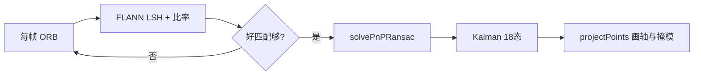
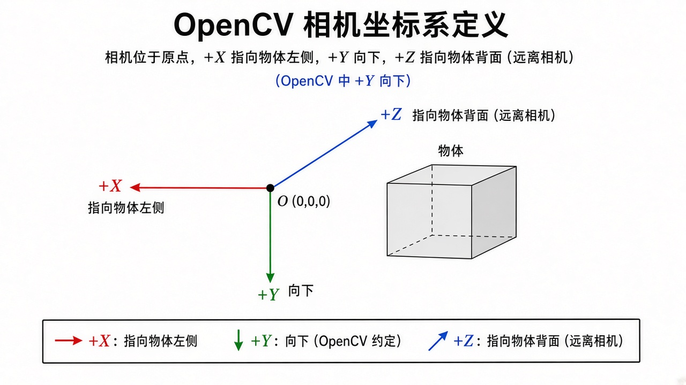
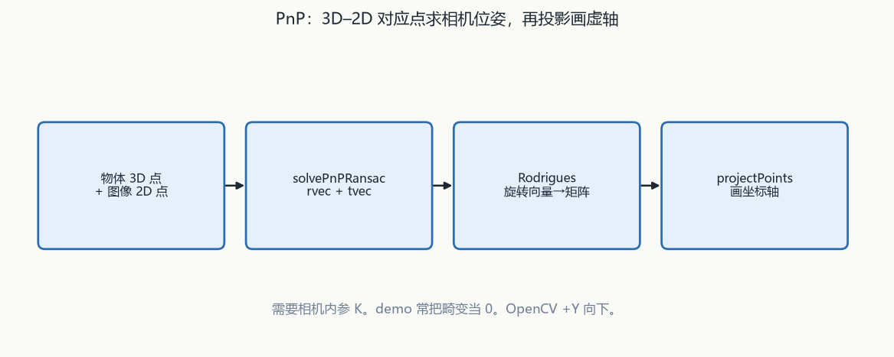
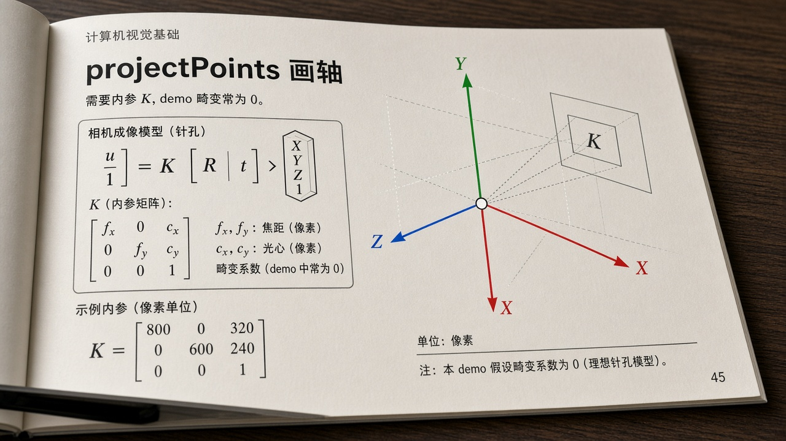

# 第11章 相机模型与增强现实

来源：文档1《OpenCV 4计算机视觉:Python语言实现》第9章「摄像头模型和增强现实」（PDF 413–478；章标题 PDF 413，9.1 技术需求 PDF 414，小结 PDF 478）。**对应文档2：无 AR 专章**（单目/双目标定、`projectPoints`/`solvePnP` 已在融合第10章用文档2第10章覆盖，本章不重抄那套 C++ 标定表）。假定已具备第9章 ORB/FLANN/比率检验和第10章针孔/内参直觉。

## 本章总览

增强现实（AR）= 持续跟踪真实物体之间的关系，再把同一套关系用到虚拟物体上，让人觉得虚拟物「粘」在实物上。本章的典型做法是透视投影：在被跟踪平面上画 3D 图形的投影。学完应能回答：6DOF 六个量是什么、罗德里格斯向量为什么不能按分量单独读、摄像头矩阵里 \(f,c_x,c_y\) 怎么从视角推、`solvePnPRansac` 的误差是重投影距离、为什么跟踪用 ORB+LSH 而不是默认 kd-tree、卡尔曼为什么是 18 维、OpenCV 坐标轴和 OpenGL 右手系差在哪。

文档1侧重 6DOF 与罗德里格斯、针孔三对象（主体/镜头/传感器）、用纸测对角线视角、畸变类型、`cv2.solvePnPRansac` 十二参数、ORB 分块提取、FLANN 多探头 LSH、18 态卡尔曼、`projectPoints` 画轴、掩模限下一帧搜索、改进方向（光流/IMU/GPS）。

文档2无对应主章节。标定与 PnP 的 C++ 默认值见第10章笔记。

本章只用 `KalmanFilter(18,6)` 跟 6DOF：6 个测量是平移加旋转向量，18 个状态再加一阶速度和二阶加速度。平面点跟踪是 `(4,2)`，先 `predict` 再 `correct`，一个实例跟一个物体。方法清单与矩阵填法在插图。

👉 完整深度讲解见第13章。

棋盘标定走 `findChessboardCorners` / `calibrateCamera` / `stereoRectify`。本章 demo 假定畸变全 0，用纸测对角线视角估 \(f\)，不是认真标定流程。

👉 完整深度讲解见第10章。

神经网络分两路：`ANN_MLP` 自训浅层网；`dnn` 加载现成网。传统 SVM 在第14章，不是本章跟踪工具。

👉 完整深度讲解见第15章。

灰度转换、ORB、FLANN 比率只按跟踪需要写，不回头重讲第9章全套。检测器训练 / HOG+SVM / 词袋在第14章。

## 核心知识点

### 6DOF 跟踪与 AR 步骤

3D 跟踪 = 不断更新物体姿态，通常 6 个数：平移 \(t_x,t_y,t_z\) + 旋转。OpenCV 不用欧拉角，用罗德里格斯旋转向量 \((r_x,r_y,r_z)\)。合起来叫 6DOF。

🔑 关键速记：相机在原点；跟踪的是物体相对当前相机的姿态。

#### 罗德里格斯不是欧拉角

向量 \(\mathbf{r}\) 编码旋转轴和转角 \(\theta\)，与 3×3 旋转矩阵 \(R\) 的关系见书公式；不要单独解释 \(r_x\) 或 \(r_y\)。OpenCV 函数负责进出这个向量。

摄像头是坐标原点：任意帧里相机自己的 6 个数定义为 0。

🔑 关键速记：三个分量不是绕 X/Y/Z 各转一次。

#### demo 流水线

典型流水线（代码摘自 Howse 的开源项目 Visualizing the Invisible）：

1. 定义摄像头和镜头参数。
2. 初始化卡尔曼，稳住 6DOF（原理见第8章 / 融合第13章）。
3. 选一幅参考图代表要跟踪的表面（例：打印纸）。
4. 建物体顶点的 3D 点列（单位任意：米、毫米，或「物体高度=1」）。
5. 提取参考图描述子。实时跟踪常用 ORB。
6. 按同一映射把描述子从像素坐标换成 3D。
7. 对每一帧：提描述子 → FLANN + 比率检验 → 好匹配不够就跳过 → `cv2.solvePnPRansac` 估 6DOF → 卡尔曼平滑 → 按内参和姿态把 3D 图形投到图上。

🔑 关键速记：匹配不够就跳过本帧；PnP 之后才卡尔曼和投影。

### 摄像头矩阵与畸变（本章公式，标定细节在第10章）

成像至少三件东西：主体（希望在焦平面上清晰）、镜头（光心；焦距长度 = 光心到像面距离，当物方焦距无穷时）、图像传感器（矩形，盖不住圆形像面的角）。

🔑 关键速记：demo 用视角+像素当量拼矩阵；畸变直接当 0。

#### 用纸测对角线视角

对角线视角 FOV 与焦距长度、传感器宽高成三角关系。变焦 = 改焦距长度。

OpenCV 摄像头矩阵用 \(f\) 和主点 \((c_x,c_y)\)。传感器在像面中心时：\(c_x=w/2\)，\(c_y=h/2\)。已知对角线视角 \(\theta\) 可算 \(f\)；或由水平/垂直视角算。传感器尺寸和 \(f\) 不必用毫米，可用像素当量：1280×720 的帧就说 \(w=1280\)、\(h=720\)。不同真实尺寸或不同分辨率之间不可比，但对固定相机+分辨率内部一致。

测 \(\theta\)：纸贴墙，镜头正对、纸对角线刚好铺满帧（长宽比不符就裁纸）；量纸对角线 \(s\)、纸到镜头筒中点 \(d\)，用三角关系得 \(\theta\)。例：\(\theta=70^\circ\)、1280×720 → 可算出 \(f\) 和主点，从而写出摄像头矩阵。

🔑 关键速记：换分辨率或换传感器，像素当量的 \(f\) 要重算。

#### 五系数畸变与「全 0」假设

真实镜头还有畸变系数（OpenCV 最多 5 个，顺序 k1, k2, p1, p2, k3）：

- 径向 \(k_n\)：\(k_1<0\) 常桶形（边向外弯）；\(k_1>0\) 常枕形（边向内弯）；符号交错可能波浪（书称「胡行」畸变）。
- 切向 \(p_n\)：光轴不垂直传感器，透视歪。

供应商很少给系数。可用棋盘标定估矩阵+畸变（官方教程链接在书 PDF 425；步骤在第10章）。本章 demo 假定全部畸变为 0：不是相信网摄像无失真，而是认为对 3D 跟踪 demo 影响不大；做精密测量就不能这样。

书认为：纸+视角的理想模型更易复现；棋盘每人做法不同，有时会得到错结果。

🔑 关键速记：五系数顺序固定；畸变全 0 只适合 demo。

### `cv2.solvePnPRansac`

PnP（Perspective-n-Point）：给定 n 组 3D↔2D 唯一匹配，以及把 3D 投成 2D 的相机参数，估物体相对相机的 6DOF。类似第6章（融合第9章）的 2D–2D 单应，但多出来的信息够估位姿，不只是投影关系。

🔑 关键速记：误差是重投影距离；多数匹配应一致，并标出内点。

#### RANSAC 在这里比什么

RANSAC：迭代找使平均误差最小的解，把误差过大的输入标成外点丢掉，直到不再发现新外点且平均误差可接受。这里的误差是重投影误差：观测 2D 点 vs 按当前姿态预测的 2D 点之间的距离。

四个返回值：`retval`（是否收敛）、`rvec`（\(r_x,r_y,r_z\)）、`tvec`（\(t_x,t_y,t_z\)）、`inliers`（`objectPoints`/`imagePoints` 中内点下标）。

🔑 关键速记：四个返回值是收敛标志、rvec、tvec、内点下标。

#### 十二参数含义

下面这张表只列文档1的参数含义。文档1未列出默认数字；文档2（第10章）C++ 默认：迭代 100、重投影阈 8.0、置信 0.99、`SOLVEPNP_ITERATIVE`。

| 名称 | 功能 | 主要参数 | 约束&坑点 |
|---|---|---|---|
| `cv2.solvePnPRansac` | 带 RANSAC 的 PnP | `objectPoints`：姿态全 0 时物体关键点的 3D。`imagePoints`：图中对应 2D，`imagePoints[i]` 配 `objectPoints[i]`。`cameraMatrix`、`distCoeffs`（未知可全 0）。`rvec`/`tvec`：收敛则写入。`useExtrinsicGuess`：True 时把传入的 r/t 当初值。`iterationsCount`：最大迭代，不收敛就放弃。`reprojectionError`：超过则当外点。`confidence`：目标置信。`inliers`：内点索引。`flags` 默认 `cv2.SOLVEPNP_ITERATIVE`（无特殊限制，通常最好）；平面物体可用 `cv2.SOLVEPNP_IPPE` | 文档1未列出默认数字。文档2（第10章）C++ 默认：迭代 100、重投影阈 8.0、置信 0.99、`SOLVEPNP_ITERATIVE`。两书同名，默认以各自章节为准，不要混抄 |

记住：平面可试 IPPE；畸变未知时可全 0，这和 demo 假设一致。

🔑 关键速记：3D 与 2D 按下标一一对应；两书默认不要混抄。

### 灰度：跟踪不要默认加权

OpenCV 默认 BGR→灰是 CCIR 601 加权（约偏绿黄）。Macêdo 等（2015）对 SIFT 的比较：加权平均结果不稳；非加权平均和单通道更一致；伽马校正有时最好但更贵。

demo 用 B、G、R 非加权平均，`cv2.transform`（1×3 矩阵），算得便宜、希望比默认加权更稳。

🔑 关键速记：跟踪灰度用三通道等权平均，不用默认偏绿加权。

### 2D 像素 → 物体平面 3D

打印纸 = 3D 平面。局部系：6DOF 全 0 时像挂在墙上的画，原点在图像中心，正面有图。

由像素坐标、图像像素尺寸、像素→3D 单位的比例（打印真实高度，或定义「高度=1」）映射到平面。先映射全部关键点，再映射四角顶点。

绘图 API 常要求每个面的顶点从正面看为顺时针。非平面（长方体、圆柱）见 Visualizing the Invisible，本章只做平面。

🔑 关键速记：先把参考图像素映到平面 3D，PnP 才能吃模型点。

### ImageTrackingDemo 里与算法有关的选择

类职责：摄像头矩阵、参考图 2D/3D 点、卡尔曼、主循环。下列选择都来自文档1，不是文档2 的 C++ 默认表。

🔑 关键速记：ORB 分块 + LSH；已跟踪则只在上一帧掩模里搜。

#### 内参、卡尔曼 18 态、轴方向

先抓一帧定像素宽高；失败再读相机属性。用对角线视角（度）和像素尺寸算 \(f\)，拼摄像头矩阵。畸变全 0。

`cv2.KalmanFilter(18, 6)`：6 个测量（\(t_x,t_y,t_z,r_x,r_y,r_z\)），18 个状态（6DOF + 一阶速度 + 二阶加速度）。测量矩阵 6×18，在对应位置放 1。转移矩阵按 FPS 填：速度转换率与 \(1/\mathrm{fps}\) 成正比，加速度转换率与 \(1/\mathrm{fps}^2\) 成正比（书取速度基率 1.0、加速度基率 0.5）。

每帧因帧率可能变而重填转移阵；从「未跟踪」到「跟踪」时清状态，假设静止（速度加速度为 0），只信当前 PnP。

3D 轴箭头长度 = 打印图像高度的一半。OpenCV 轴：+X 物体左（观察者右），+Y 向下，+Z 物体后（观察者前）。标准右手系（OpenGL）三轴都相反。本章 demo 故意转换到右手系，以便以后接 OpenGL；若只在 OpenCV 里画，也可以保持 OpenCV 轴。

🔑 关键速记：刚跟上要清卡尔曼，当静止、只信当前 PnP。

#### ORB 分块、LSH、两套匹配阈值

ORB：描述直径 31，金字塔 16 层、层间 1.2，每次最多 250 个点。参考图缩到帧高的 2 倍（任意倍数，意图是金字塔底比帧大、顶比帧小，近处裁切和远处缩小都能配）。例：参考 4000×3000、帧 1280×720 → 缩到 1920×1440；16 层、1.2 后顶层约 124×93，物体只占帧宽/高约 10% 仍可能配上，但要镜头、对焦、光线够好。

参考图切成 6×6=36 块，每块最多 250 点，避免纹理集中在标题区时其余部分没点；遮挡/出画也能跟。

FLANN：多探头 LSH，6 个哈希表、12 位键、1 个多探头层（论文 Multi-Probe LSH, VLDB 2007）。先 `train` 参考描述子。二进制 ORB 配 LSH，不是第9章文档2默认的 kd-tree。

已在跟：只在上一帧物体掩模里检测；没在跟：全图搜。刚开始跟踪用较高的最少好匹配数，持续跟踪用较低阈值【信息缺口：两个具体整数正文未抽出】。不够则掩模改回全图。

🔑 关键速记：跟踪 ORB 是 250 点 / 16 层 / LSH，不是第9章默认 500 点 / kd-tree。

#### 画轴、掩模、黄膜

收敛且本帧开始重新跟 → 重初始化卡尔曼状态；然后 `_apply_kalman`。先把候选点画红，内点再画绿。最后画轴、做物体掩模。

`timeit.default_timer` 测真实 FPS，更新转移阵。Esc 退出。main 例：采集 1280×720，对角线 70°，目标 25 FPS——按自己的镜头和机器改。

下面这张表是投影和掩模相关选择，不是第10章那份 C++ 全参数表。

| 名称 | 功能 | 主要参数 | 约束&坑点 |
|---|---|---|---|
| `cv2.projectPoints` | 把 3D 点投到当前帧 | 使用当前 rvec/tvec、摄像头矩阵、畸变（demo 为 0）。还返回雅可比（偏导），标定有用，本 demo 不用 | 输出是浮点，交给绘图前要转 int。第10章文档2有 C++ 全参数 |
| 画轴 | 投轴端点，画三条带箭头的线 | 轴长 = 参考真实高度 / 2 | 注意 OpenCV 轴 vs 右手系 |
| 物体掩模 | 投参考四顶点 → 凸多边形白、底黑 | 下一帧只在白区找点 | 书建议可再形态学膨胀，把搜索区扩一圈 |
| `cv2.subtract` + mask | 掩模区减标量，突出黄色 | 书称减标量时只减第一个通道（BGR 的 B），蓝少了看起来发黄；作者怀疑是 bug，但正好能用 | 不要当成官方「染色 API」 |

记住：黄膜靠减 B 通道「碰巧发黄」，不是正式染色接口。

🔑 关键速记：内点画绿；掩模限制下一帧搜索区。

### 实验观察与改进（文档1 9.4）

参考图（书封面）最好的点集中在顶部高对比文字；底部高对比线也有用。近处正面：轴方向符合预期（右手系下 X 指书面右侧即观察者左，Y 上，Z 指向观察者）；半透明黄膜可盖住手指遮挡处；绿点（内点）多在标题。书面大部分出画时，因分块仍可能轴和黄膜正确。

可用屏幕显示参考图代替打印纸：背光/反光会不像印刷品，但跟踪常常仍可用。务必自己测视角。

商业方案常加后备：光流更新旧匹配再用单应更新位姿；陀螺仪/磁力计更新旋转；气压计（约 10 cm 海拔）和 GPS（约 10 m）更新位置——山顶画龙或许够，手指上画戒指不够；加速度计更新卡尔曼加速度，但消费器件易漂移。这些超出本书。也可换灰度转换再数内点。

🔑 关键速记：分块能扛部分出画；消费级 GPS/气压计精度不够做指尖级 AR。

## 易混淆点&差异对比

下面这张表强调：文档2没有 AR 章，PnP 默认值在第10章。

| 对比项 | 文档1（本章） | 文档2 |
|---|---|---|
| 有无 AR 专章 | 有：从相机模型讲到实时叠图 | 无。标定/PnP/投影在第10章，到校正和重投影误差为止 |
| 内参来源 | demo 用纸测 FOV + 像素当量；畸变直接 0 | `calibrateCamera` 多图棋盘，出矩阵和畸变 |
| `solvePnPRansac` 默认 | 本章列齐参数含义，不给数字默认 | 迭代 100、阈 8.0、置信 0.99（见第10章笔记） |
| FLANN | 跟踪 ORB 用 LSH（6 表、12 bit、1 probe） | 第9章默认 kd-tree，ORB 还要先转 `CV_32F` |
| `projectPoints` | 用来画轴和掩模轮廓 | 用来对比「投影点 vs 检测到的角点」 |

两书同名函数，默认以各自章节为准。

其他易混：

- 单应性（第9章）是 2D↔2D；PnP 是 3D↔2D + 内参 → 6DOF。
- 罗德里格斯三个分量不是绕 X/Y/Z 各转一次的欧拉角。
- 像素当量的 \(f\) 换分辨率或换传感器就要重算。
- 畸变全 0 只适合 demo，不适合测量装置。
- OpenCV 的 +Y 向下，和 OpenGL 相反；本章 demo 为对接图形库做了轴翻转。
- 刚跟上和持续跟用两套最少匹配数；丢跟后掩模回到全图，卡尔曼状态作废重来。
- 第10章的双目 `Q`、SGBM、OpenNI 不是本章 AR demo 的输入。
- 第13章 `KalmanFilter(4,2)` 跟平面点；本章 `(18,6)` 跟 6DOF。

🔑 关键速记：2D 单应到此为止；要位姿必须 PnP + 内参。

## 本章要点总结

AR 在本章 = 6DOF 跟踪 + 透视投影画虚物。相机在原点，物体相对相机动。

内参：摄像头矩阵（\(f,c_x,c_y\)）可用视角和像素尺寸构造；畸变五系数顺序固定。demo 畸变=0，认真标定走第10章。

`solvePnPRansac` 吃 3D 模型点、2D 匹配、内参，吐 rvec/tvec 和内点。平面可试 IPPE。

实时链路：自定义灰度 → ORB（分块+深金字塔）→ LSH+比率 → PnP → 18 维卡尔曼 → `projectPoints` 画轴和掩模。

文档2没有 AR 章；PnP/投影的 C++ 默认值以第10章为准。不训练检测器，不讲 ANN。
