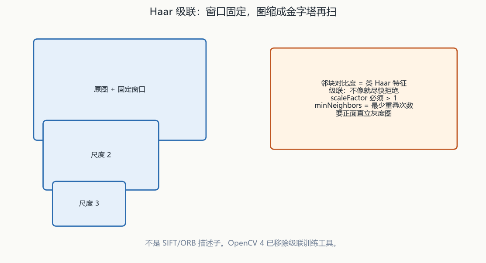
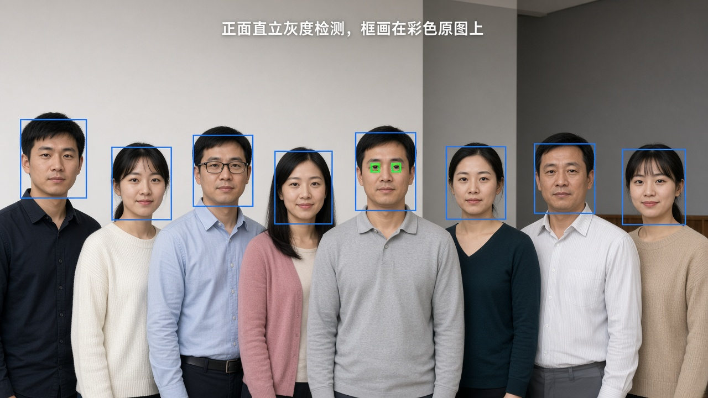

# 第12章 人脸检测与识别

来源：文档1《OpenCV 4计算机视觉:Python语言实现》第5章「人脸检测和识别」（PDF 179–223；章标题 PDF 180，5.1 技术需求 PDF 182，5.6 小结 PDF 224——小结页略超用户给定 223，只收章末结论句，不展开第6章）。**对应文档2：无对应主章节**（文档2第12章的 DNN 性别检测归融合第15章，本章不展开）。假定已具备第2章摄像头/`waitKey`、第3章灰度与矩形 ROI、第10章深度/OpenNI 中位数掩模。

## 本章总览

人脸检测 = 在图里框出人脸；人脸识别 = 把这张脸对应到某个具体的人。OpenCV 用预训练 Haar 级联做检测，用 Eigenface / Fisherface / LBPH 做识别。学完应能回答：类 Haar 特征比的是什么、为什么要图像金字塔、级联为什么对倒立/侧面不鲁棒、`detectMultiScale` 的 `scaleFactor` 和 `minNeighbors` 各管什么、三种识别器的置信度 0 代表什么、为什么只有 LBPH 允许训练图和检测框尺寸不同、换脸为什么要用深度掩模而不是整块矩形。

文档1侧重 Haar 概念与预训练 XML、`cv2.CascadeClassifier` + `detectMultiScale`、采集 200×200 灰度训练图、`EigenFaceRecognizer_create` / `FisherFaceRecognizer_create` / LBPH 工厂、`predict` 的标签与置信度、Cameo 里按深度掩模交换两张脸。

文档2无对应主章节。不要把文档2第12章的 DNN 性别/年龄例子写进本章。

预训练 XML 的具体文件名印在 PDF 185 清单图，文本层未抽出。

👉 该细节原书未完整抽出，暂不展开（PDF 185 插图）。

`detectMultiScale` 正文落实了四个旋钮：`scaleFactor` 必须 > 1.0，每次迭代把图缩小的比率；`minNeighbors` 是保留该框所需的最少重叠检测次数；视频例还用 `minSize=(120,120)`；眼检测可再试 `maxSize`，或让 min/max 跟人脸的 `w,h` 成比例。完整形参表在代码插图。

👉 该细节原书未完整抽出，暂不展开（完整形参在代码插图）。

LBPH 正文只称「算法工厂」，按顺序可选 `radius` / `neighbors` / `grid_x` / `grid_y` / `confidence`；完整 `*_create` 函数名在代码插图。

👉 该细节原书未完整抽出，暂不展开（声明行在插图）。

第15章用 SSD/TF 人脸检测器再接年龄/性别网，不是本章 Haar XML。本章检测器仍是级联。

👉 完整深度讲解见第15章。

OpenCV 4 已移除级联训练工具；自定义检测走 HOG+SVM。书指向另一本书讲自造级联，不是本仓库可运行的训练路径。

👉 完整深度讲解见第14章。

深度通道单位与阳光红外失效见第10章。Haar 不是第9章的 SIFT/ORB 描述子。

## 核心知识点

### 检测 vs 识别、特征为什么要抽象

检测是定位；识别是「这是谁」。图里细节受光照、视角、距离、抖动、数字噪声影响，物理上的真实差异也不一定对分类有用（书用「雪花在显微镜下都不一样、但人仍能认雪」作比）。

所以要把细节收成数量更少的特征，再当成向量，用向量距离衡量两幅图像不像。一个人脸检测器还可以和眼睛检测器叠成层次：先框父区域（脸），再在子区域里找眼睛。

文档2无对应主章节。

🔑 关键速记：检测给框，识别给身份；特征是压缩后的向量。

### 类 Haar 特征与级联

类 Haar 特征描述相邻图像区域之间的对比度模式（边、顶点、细线都会出一种特征）。有些特征几乎只出现在某一类物体（如正面人脸）上。

🔑 关键速记：窗口固定，图缩成金字塔；不是 SIFT/ORB 描述子。

#### 级联与金字塔

把这些特征排成层次，叫做级联：最高层是最显著的特征，好让分类器尽快拒绝「根本不像」的窗口。

尺度：同一张脸在不同图尺寸、不同对比度邻域下，特征会变。正在评估对比度的邻域叫窗口大小。OpenCV 的 Haar 级联要尺度不变，做法是窗口大小固定，把图多次缩小，使某层上的脸刚好配上窗口。原图加各层缩小图合称图像金字塔；`cv2.CascadeClassifier` 从特定格式的 XML 加载模型，并在内部自己建金字塔。

🔑 关键速记：金字塔只解决尺度，不解决旋转。

#### 姿态不鲁棒

旋转/透视：OpenCV 这份实现对旋转角和透视变化不鲁棒——倒立脸 ≠ 正立脸，侧面 ≠ 正面。书称更复杂的实现会同时考虑多种变换和多种窗口，但更耗资源；本章只讲 OpenCV 自带实现。

出处：Viola & Jones, “Robust Real-Time Face Detection”, IJCV 2001。

下面这张表只记概念，还不是加载 XML 的接口。

| 名称 | 功能 | 主要参数 | 约束&坑点 |
|---|---|---|---|
| 类 Haar 特征 | 用相邻块对比度当特征 | 窗口大小固定；尺度靠金字塔 | 不是 SIFT/ORB 那种描述子；换尺度靠缩图，不靠改窗口 |
| 级联（cascade） | 按层次尽快拒绝非目标 | 高层 = 最显著特征 | 正面直立才稳；侧面、倒立、大俯仰会漏 |
| 图像金字塔 | 同一窗口配多种尺度的脸 | 分类器内部生成 | 只解决尺度，不解决旋转 |

记住：要正面、直立、灰度；侧面和倒立会漏。

🔑 关键速记：不像的窗口尽早拒绝；姿态要正面直立。

### 预训练 XML 与 `CascadeClassifier`

OpenCV 4 源码或预编译包里应有 `data/haarcascades`。其中 XML 交给 `cv2.CascadeClassifier` 解释成某类物体的检测模型，可对静图、视频文件或摄像头逐帧使用。

🔑 关键速记：必须喂灰度图；路径错则后续检测空结果。

#### 文件从哪来、能不能自己训

书要求把若干 XML 复制到项目的 `cascades` 子目录；正文说这些级联「用来跟踪脸和眼睛」，并且需要正面、直立。【信息缺口：具体文件名印在 PDF 185 清单图，文本层未抽出，禁止按记忆补 `haarcascade_*.xml`】

👉 该细节原书未完整抽出，暂不展开（PDF 185 插图）。

自造级联：书指向 Howse《OpenCV 4 for Secret Agents》第3章，并强调要足够耐心和算力。融合知识库把「训练自定义检测器」放在第14章；第1章已写 OpenCV 4 移除了训练 Haar/LBP 级联的工具。本章只用预训练文件。

🔑 关键速记：本章只用现成 XML；OpenCV 4 已去掉级联训练工具。

#### `CascadeClassifier` 与 `detectMultiScale`

下面这张表是检测入口。完整形参表在代码插图，正文只落实四个常用旋钮。

| 名称 | 功能 | 主要参数 | 约束&坑点 |
|---|---|---|---|
| `cv2.CascadeClassifier` | 加载 Haar XML，得到检测器 | 构造时传入 XML 路径 | 路径错则后续检测空结果。脸、眼各建一个对象。必须喂灰度图 |
| `detectMultiScale` | 在图里多尺度扫目标，返回矩形列表 | 正文落实：`scaleFactor` 必须 > 1.0，每次迭代把图缩小的比率；`minNeighbors` = 保留该框所需的最少重叠检测次数（重叠越多越像真脸）；视频例还用 `minSize=(120,120)`，假定人坐得近、脸不会比这更小；眼检测可再试 `maxSize`，或让 min/max 跟人脸的 `w,h` 成比例 | 完整形参表在代码插图【信息缺口】。返回值是人脸矩形的元组列表，每项含左边 `x`、顶 `y`、宽 `w`、高 `h`。画框要画在彩色原图上，不要画在灰度副本上 |

👉 该细节原书未完整抽出，暂不展开（完整形参在代码插图）。

记住：返回的是 `(x, y, w, h)` 元组列表；框画在彩图上。

🔑 关键速记：`scaleFactor>1` 缩图；`minNeighbors` 管重叠次数。

### 静图检测与视频检测

对分类器来说，视频只是连续静图，基本做法就是每帧各做一次。更先进的做法会跨帧判断「是不是同一张脸」，但书认为先掌握逐帧也够用。

🔑 关键速记：视频 = 逐帧检测；眼在脸的灰度 ROI 里再检一层。

#### 静图例

一排正面站立的伐木工（普罗库金–戈尔斯基 1909 年丝薇尔河照片）。流程：加载级联 → `imread` → 转灰 → `detectMultiScale` → 在原图上画蓝框 → `imshow` + `waitKey`。

🔑 关键速记：静图也要先转灰再检测，框仍画回原图。

#### 视频例与眼检测

开摄像头，每帧转灰，先检脸（蓝框），再在该脸的灰度 ROI 里检眼（绿框）。眼检测器比脸更容易把阴影、部分镜框等人脸区域当成眼睛。

书建议：把 `roi_gray` 收成脸的更小上半区；设 `maxSize` 丢掉大得不可能是眼睛的误报；或按脸的 `w,h` 比例设 min/max。请在明暗、戴/摘眼镜、不同表情下试参数。

步骤（视频，只记流程）：

1. 建两份 `CascadeClassifier`（脸、眼）。
2. 读帧，转灰。
3. 对人脸 `detectMultiScale`（含 `scaleFactor`、`minNeighbors`、`minSize`）。
4. 在彩色帧上画蓝框；在对应灰度矩形里检眼。
5. 给眼睛画绿框，显示；按任意键结束。

🔑 关键速记：眼比脸更容易误报；用上半脸 ROI 和 `maxSize` 收紧。

### 三种人脸识别算法

识别 = 用一组已分类的人脸样本训练模型，再对检测到的脸给出身份 + 置信度。置信度可设阈值，压错误识别。

样本可自制，也可下公开库（书列 Yale、Extended Yale B、AT&T/Cambridge；入口页 `http://www.face-rec.org/databases/`）。自制往往更有教学乐趣。

🔑 关键速记：分值 0 表示与模型完全匹配；越小越好。

#### 共同套路与 `predict`

三种实现都走同一套路：分类观察（每人多张）→ 训练 → 对检测框分析 → 输出标签和「有多确信」。

`predict`：输入已对齐（Eigen/Fisher 还要缩到训练尺寸）的灰度脸，返回 `(标签, 置信度)`。标签是训练时按子文件夹编的数字 ID，再用名称列表反查人名。可在框上方用蓝字写名字和置信度。

三种都可以先不设阈、把所有结果留下，再自己按后续帧的置信度序列做判决（例如连续多帧都够好才画框）。

🔑 关键速记：标签是整数 ID，不是文件夹字符串。

#### Eigenface / Fisherface / LBPH

下面这张表三套识别器阈值段差一个数量级，不能共用同一门槛。LBPH 工厂函数名正文未印清。

| 名称 | 功能 | 主要参数 | 约束&坑点 |
|---|---|---|---|
| 特征脸 Eigenface | PCA 找这组观察的主成分，再算当前脸相对数据集的散度 | 工厂：`cv2.EigenFaceRecognizer_create`（同节后文又写成 `cv2.createEigenFace-Recognizer_create`，书内两处写法不一致）。可选 `num_components`（PCA 保留的主成分个数）、`threshold`（置信度阈，默认最大浮点 = 不丢弃） | 训练图要先对齐到同一尺寸（示例 200×200）。置信度大致 0～20000，书称低于 4000 算比较有信心 |
| Fisherface | 也从 PCA 来，逻辑更复杂 | `cv2.face.FisherFaceRecognizer_create`，可选参数与 Eigenface 那两个相同 | 计算更密，书称结果往往比 Eigenface 更准。置信度取值范围与 Eigenface 同类（约 0～20000，<4000 较好） |
| LBPH | 把脸划成小格，每格建直方图，描述沿某方向比较邻域像素时亮度是否在增加；再和模型对应格比相似度 | 正文称「算法工厂」，按顺序可选：`radius`（算格直方图时邻域像素距离，默认 1）、`neighbors`（邻域数，默认 8）、`grid_x` / `grid_y`（水平/垂直分格数，默认都 8）、`confidence`（阈，默认最高浮点 = 不丢）。【信息缺口：完整 `*_create` 函数名在代码插图】 | 三种里唯一允许模型样本和检测到的脸形状、尺寸不同的实现，因此不必先 `resize`。好识别参考低于 50，超过 80 书称很差。作者认为准确度优于另外两个 |

👉 该细节原书未完整抽出，暂不展开（声明行在插图）。

记住：Eigen 工厂书内两种写法并列，不擅自统一；Fisher 明确在 `cv2.face` 下。识别在可选的 `opencv_contrib`。

🔑 关键速记：只有 LBPH 可以不统一尺寸；Eigen/Fisher 示例必须 200×200。

### 采集与加载训练数据

训练图最好正方形、同尺寸。示例要求 200×200；不少公开库比这更小。准确率很大程度上取决于训练数据质量——要覆盖多种表情、姿态、光照。

🔑 关键速记：一人一子目录；父目录保持不变，加载函数会遍历全部子文件夹。

#### 采集脚本与 `read_images`

采集脚本：摄像头逐帧检脸 → 裁灰度脸 → 缩到 200×200 → 存成 PGM，文件名用累加计数。每人一个子文件夹（示例 `'../data/at/jm'`，按姓名或首字母）。跑若干秒、换几次表情，建议至少约 20 帧再换下一个人。父目录保持不变（示例 `'../data/at'`）。

`read_images`（书中自写，不是 OpenCV API）：遍历子目录，加载并缩到指定尺寸，同时建「人名列表」和「每张图的数字标签」。最后把图像、标签转成 NumPy 数组，返回「名称、图像数组、标签数组」。

下面这张表里的采集/`read_images` 是应用层，不要写成 `cv2` API。

| 名称 | 功能 | 主要参数 | 约束&坑点 |
|---|---|---|---|
| 采集脚本（应用层） | 用检测器批量产出训练脸 | 输出 200×200 灰度 PGM；一人一子目录 | 不是官方 API。公开库尺寸常对不上 200，不要混用而不缩放（LBPH 除外） |
| `train(图像数组, 标签数组)` | 把样本喂给识别器 | 标签是整数 ID，不是文件夹字符串 | Eigen/Fisher 依赖统一尺寸；路径要和采集时的父目录一致 |
| `predict(灰度脸)` | 推断身份 | 返回标签 + 置信度 | 0 = 全匹配。阈值语义是「丢掉置信度差于阈的结果」；默认不丢 |

记住：默认阈值等于最大浮点，等于先不丢任何结果。

改进方向（书点到为止）：正确对准并旋转检测到的脸，以提高识别率。

🔑 关键速记：建议每人至少约 20 帧再换人；LBPH 才能混用不同尺寸。

### 红外换脸与矩形掩模复制（Cameo）

检测/识别不限于可见光。近红外摄像头 + 近红外光源时，人眼全黑的场景仍可能做人脸检测。第4章（融合第10章）已用深度把主层（如用户的脸）和其他层分开。

本章把「至少两张脸」的矩形按主深度层掩模互换：只复制矩形里属于前景深度的像素，避免把脸旁背景一起换过去，矩形硬边会少很多。

🔑 关键速记：每人脸各做一份深度中位数掩模，不要整块矩形交换。

#### Cameo 模块与按键

Cameo 新增两个应用模块（不是 OpenCV 官方类）：

- `trackers.FaceTracker`：把 `CascadeClassifier` 收成面向对象接口；可选择是否画脸框。实现细节书不讲，指向 GitHub `chapter05/cameo`。
- `rects.copyRect` / `rects.swapRects`：带可选掩模的矩形复制与循环交换。

按键：书给 X 切换是否显示脸框。

技术需求：Python + OpenCV + NumPy；识别在可选的 `opencv_contrib`；深度部分要 OpenCV 对 OpenNI 2 的可选支持。代码目录：GitHub `chapter05`。

🔑 关键速记：没有深度时退化为整块矩形交换，背景会跟着走。

#### `copyRect` / `swapRects`

`copyRect` 步骤：无掩模时，把源矩形内容缩到目标矩形尺寸后整块写入；有掩模时，掩模须与源矩形同大，只复制掩模非零处。掩模常是单通道，图可能是 BGR 三通道，书用 `numpy.repeat` / `reshape` 把通道数对齐，再用 `numpy.where` 按条件写。

`swapRects` 对矩形列表做循环交换，`masks` 为 `None` 则每步都不加掩模。两个函数的 mask 默认都是 `None` = 整块矩形。

下面这张表不是 `cv2.copyRect`；不要把 Cameo 函数写成官方 API。

| 名称 | 功能 | 主要参数 | 约束&坑点 |
|---|---|---|---|
| 深度掩模 + Haar 框 | 框出脸，但只交换主深度层 | 每人脸矩形各做一份视差/深度掩模（第4章是整图一份，这里改成按脸） | 深度单位、16U 显示、阳光失效见第10章。没有深度时退化为整块矩形交换，背景会跟着走 |
| `copyRect` / `swapRects`（Cameo） | 矩形复制 / 多脸循环交换 | `mask`/`masks` 默认 `None` | 应用函数，依赖 NumPy，不要写成 `cv2.copyRect` |

记住：和 `copyTo` 的「掩模非零才留下」同类，和修复里「掩模非零才是洞」相反（见第8章）。

🔑 关键速记：掩模与源矩形同大；默认 `None` 就是整块复制。

## 易混淆点&差异对比

下面这张表强调文档2没有人脸专章；它的 DNN 性别例归第15章。

| 对比项 | 文档1（本章） | 文档2 |
|---|---|---|
| 有无人脸专章 | 有：Haar 检测 + 三种识别 + 深度换脸 | 无。DNN 性别检测在它的第12章，归融合第15章 |
| 检测器 | 预训练 Haar XML + `CascadeClassifier` | 本章无对应 API |
| 识别 | Eigenface / Fisherface / LBPH，需 contrib | 本章无 |
| 「训练」一词 | 章首写「采集图像训练和测试人脸检测器」，正文训练的是识别器，检测用现成 XML | — |

文档2第12章的年龄/性别网不要写进本章检测流程。

其他易混：

- Haar 级联 ≠ 第9章特征点。Haar 比的是邻块对比度并靠金字塔扫窗；SIFT/ORB 出关键点+描述子再匹配。
- 检测 ≠ 识别。检测给框；识别要训练图和标签，再出 ID。
- 置信度越小越好，0 是全匹配。Eigen/Fisher 与 LBPH 的「好/差」数字段差一个数量级（4000 vs 50），不能共用同一阈值。
- 书内 Eigenface 工厂写成 `cv2.EigenFaceRecognizer_create` 与 `cv2.createEigenFace-Recognizer_create` 两种；Fisher 明确在 `cv2.face` 下。笔记并列书中写法，不擅自统一。
- 只有 LBPH 可以不统一尺寸；Eigen/Fisher 示例必须先缩到 200×200。
- 眼检测比脸检测更「认错」：阴影、镜框都可能当眼睛。
- 换脸的矩形是几何框，真正该换的是深度主层。
- OpenCV 4 已去掉 Haar 训练工具（第1章）；本章「自己做级联」只是指向另一本书，不是本仓库第14章的 HOG+SVM。
- 第15章人脸检测是 SSD/TF，不是本章 Haar XML。

🔑 关键速记：检测用现成级联，识别才训练；DNN 人脸不在本章。

## 本章要点总结

人脸检测用预训练 Haar 级联：特征是邻块对比度，尺度靠金字塔，姿态要正面直立。`CascadeClassifier` 吃灰度，`detectMultiScale` 用 `scaleFactor>1` 和 `minNeighbors` 控尺度与置信。

视频就是逐帧检测；眼在脸 ROI 里再检一层。XML 文件名本章插图未抽出。

识别三条线都是「多样本训练 → `predict` → (ID, 置信度)」。0 为全匹配。Eigen/Fisher 走 PCA，要统一尺寸；LBPH 分格比直方图，可不同尺寸，经验阈约 <50 好、>80 差。

训练数据质量决定上限：表情、姿态、光照都要覆盖。识别在 `opencv_contrib`。

Cameo 换脸 = Haar 框 + 每脸深度掩模 + 矩形循环交换。文档2无人脸专章；DNN 性别/年龄见第15章。
