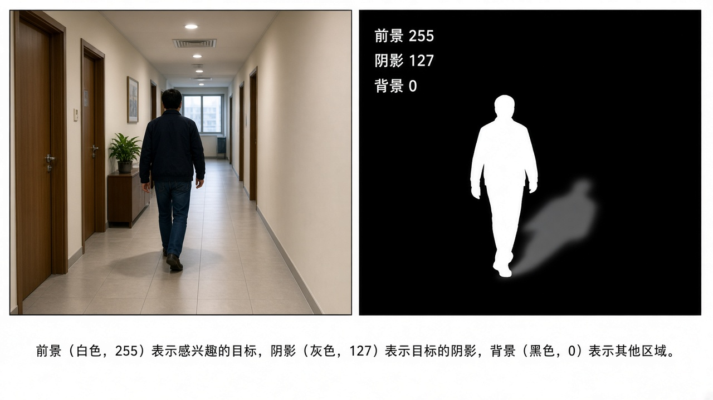
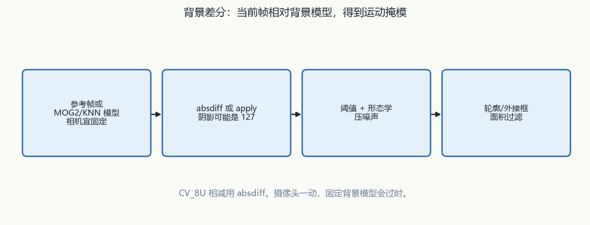
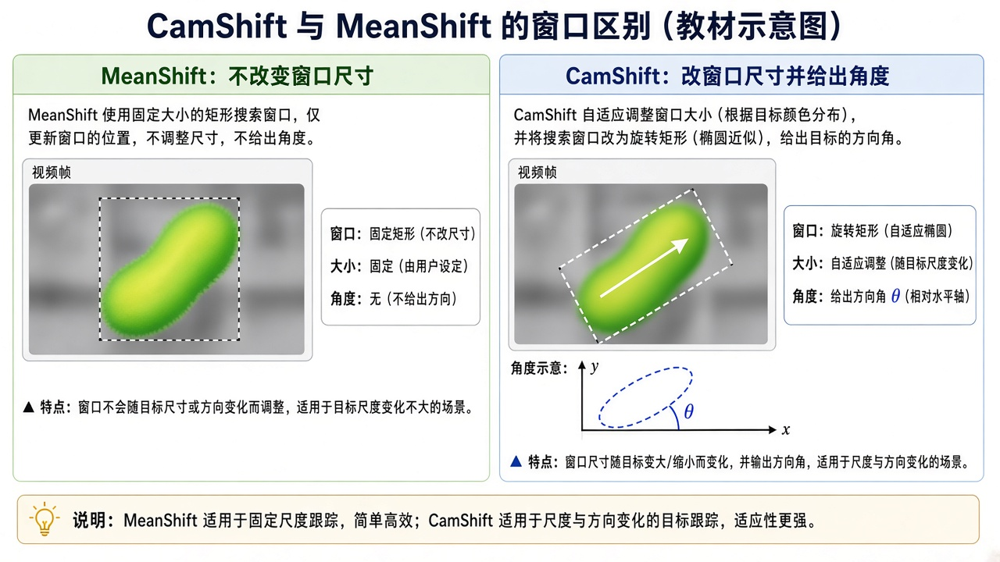
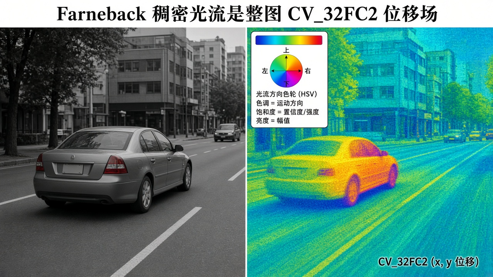

# 第13章 视频分析与物体跟踪

来源：文档1《OpenCV 4计算机视觉:Python语言实现》第8章「物体跟踪」（PDF 338–412；章标题 PDF 339，8.1 技术需求 PDF 341，8.5.5 收尾 PDF 412，未见单独「8.6 小结」标题）；文档2《opencv4快速入门》第11章「视频分析」（用户给定书页 354–375 = PDF 357–378；实测章标题在 **PDF 359 / 书页 354**，11.4 小结 PDF 380 / 书页 375）。扫描件 OCR 嘈杂，函数名按可辨识的 OpenCV 4 写法还原；吃不准处标【信息缺口】。假定已具备第2章 `VideoCapture`、第6章直方图与反向投影、第7章轮廓、第9章角点。

## 本章总览

跟踪 = 在连续帧里定位运动物体，并尽量保持「这是同一个目标」。学完应能回答：固定背景差值、相邻帧差、MOG2/KNN 各解决什么、阴影为什么会被当成运动、MeanShift 窗口为什么不会跟着物体变大、CamShift 多返回了什么、卡尔曼的 predict/correct 谁先谁后、Farneback 与 LK 谁算全图像素、光流两个前提假设会在什么场景失效。

- **文档1侧重**：手写背景差 → `BackgroundSubtractorMOG2` / `KNN` / `bgsegm` 一族；色调直方图 + `meanShift` / `CamShift`；`KalmanFilter(4,2)` 跟鼠标；KNN + MeanShift + 卡尔曼跟行人。**本章没有光流函数**。

- **文档2侧重**：`absdiff` 差值法；`meanShift` / `selectROI` / `CamShift`；`calcOpticalFlowFarneback` + `cartToPolar`；`calcOpticalFlowPyrLK`。**没有 MOG/KNN/GMG，没有卡尔曼**。

属于后续章，本章不展开：自定义检测器 / SVM 给行人分类（第14章，文档1 8.5.5 只点名）；6DOF / 18 维卡尔曼画轴（第11章）；DNN（第15章）。直方图箱数、H 范围以第6章为准，本章只写跟踪怎么用。不要把本章扩成文档1第7章的检测器训练。

跨章回填与仍缺项：

- DIS 稠密光流：第1章只点名从 contrib 迁到 `video`。两书跟踪章均未讲算子与参数。
  👉 该细节原书未完整抽出，暂不展开，两书跟踪章均未给出。

- 文档1 表 8-1 / 8-2：C++ 原型见第6章 `calcHist` / `calcBackProject`；文档1 表仍为插图。
  👉 完整深度讲解见第6章。
  👉 该细节原书未完整抽出（文档1 表为插图）。

- `cv2.KalmanFilter` 方法清单：PDF 387 称「具有下列方法」，表在插图；正文已落实 `predict` / `correct`。
  👉 该细节原书未完整抽出，暂不展开（PDF 387 插图）。

- `createBackgroundSubtractorMOG2` / `KNN` 除 `detectShadows` 外的默认项：本章未列。
  👉 该细节原书未完整抽出，暂不展开。

- LK 示例第 10 个实参 `derivlambda=0.5`：与清单 11-11 的 `flags` / `minEigThreshold` 对不齐。
  👉 该细节原书未完整抽出，暂不展开。

- 行人新出现 / 出画删除：文档1只列为后续改进，未给实现。
  👉 该细节原书未完整抽出，暂不展开。

- 用 SVM 判断「是人不是狗」：窗口级 HOG 或词袋向量交给 SVM，再金字塔滑窗与 NMS。
  👉 完整深度讲解见第14章。

- 18 维卡尔曼画轴：`KalmanFilter(18,6)`，测 6DOF、状态含速度与加速度。
  👉 完整深度讲解见第11章。

## 核心知识点

### 三条路线怎么分工

【文档1观点】最优技术取决于任务。本章三条线：① 当前帧相对背景模型的差（先手写，再 MOG / KNN / GMG）；② 用物体自己的颜色直方图跟踪（反投影 + MeanShift / CamShift）；③ 用卡尔曼按运动规律平滑、预测。

最后把 KNN、MeanShift、卡尔曼合成行人跟踪。背景差假设「背景能从过去的帧预测」，摄像头一动模型就过时，所以鲁棒系统还要给前景物体单独建模。

跟踪要的是「这辆红车 ≠ 那辆蓝车」，和检测器「所有汽车都算一类」的目标不同。

【文档2观点】视频是有时序的图像集合。本章三种方法：差值法、均值迁移、光流。差值适合摄像头不动、背景基本不变；背景也在动时差值会失效，改用均值迁移跟踪指定目标（静止也能跟）；光流用像素对应关系估计运动。

#### 文档1：背景差、颜色跟踪、卡尔曼

文档1不把光流写进第8章。行人例是「差分器开场检出 + 每目标一份直方图和一份卡尔曼」，不是再训一套检测器。

🔑 关键速记：文档1三条线是背景模型、颜色直方图、卡尔曼平滑，最后拼成行人跟踪。

#### 文档2：差值、均值迁移、光流

文档2没有 MOG / KNN / GMG，也没有卡尔曼。均值迁移吃反投影，光流另走 Farneback 与 LK。

🔑 关键速记：文档2三条线是 `absdiff`、MeanShift/CamShift、光流，相机一动就不要指望固定背景差。

🔑 关键速记：两书都在跟「同一个目标」，但文档1靠统计背景和卡尔曼，文档2靠差值和光流。

### 差值法与 `absdiff`

【文档2观点】对应像素相减。为了少受颜色干扰、结果可比，通常先转灰。直接减容易被光照和噪声带动，减完还要二值化、开闭运算。

`CV_8U` 不能表示负数，减反了会大面积变 0；两边差值都要看时，用绝对值。

下面这张表只收文档2给出的 C++ 原型；文档1同样用 `cv2.absdiff` 做手写背景差。

| 名称 | 功能 | 主要参数 | 约束&坑点 |
|---|---|---|---|
| `void cv::absdiff(InputArray src1, InputArray src2, OutputArray dst)` | 两图（或两数组）对应位置差的绝对值 | `src1` / `src2`：**同尺寸同类型**；多通道则**各通道独立**。`dst` 与输入同尺寸同类型 | 不要用普通减法替代。文档1同样用 `cv2.absdiff` 做手写背景差 |

取值：`CV_8U` 上普通减会截成 0，必须走绝对值差。

#### 文档2 示例：固定背景 vs 相邻帧

文档2示例（`bike.avi`）：第一帧当背景；同时演示相邻帧差。先 `GaussianBlur(..., Size(0,0), 15)`，再 `absdiff`，`threshold(..., 10, 255, THRESH_BINARY | THRESH_OTSU)`，`morphologyEx` 开运算，核 `7×7` 矩形。

注释掉 `gray.copyTo(preGray)` 就变成固定背景差；保留则是相邻帧差。相邻帧差时，物体内部灰度接近的区域可能「空心」，只在周圈检到运动。

🔑 关键速记：同一套 `absdiff`，拷不拷上一帧灰图，就是固定背景差和相邻帧差的开关。

#### 文档1 手写背景差

【文档1观点】步骤：丢弃前 9 帧等自动曝光；第 10 帧转灰、高斯模糊当参考；之后每帧模糊+转灰，`absdiff` → 阈值 → 形态学平滑 → `findContours`，面积太小的轮廓丢掉，画外接矩形。

高斯模糊和形态学都用来压小振动和数字噪声。限制：参考图不更新，相机一动或光线一变就过时。初始化完成前，人和其它运动物不要进画面。

🔑 关键速记：手写差是「丢曝光、锁第10帧当参考」，参考不更新就怕光照和停住的新物体。

🔑 关键速记：8 位相减用 `absdiff`，先模糊再阈值/开运算，相邻帧差会空心。

### 背景差分器：MOG2、KNN、GMG

【文档1观点】`cv2.BackgroundSubtractor` 有多个子类。类似 GrabCut，输出掩模：前景白 255，背景黑 0，有的实现阴影灰 127。与 GrabCut 不同，它们用一串帧做机器学习，随时间更新模型，名字常来自所用的聚类法。

OpenCV 有两套 MOG：`BackgroundSubtractorMOG` 与更晚的 `BackgroundSubtractorMOG2`（支持阴影）。创建函数：`cv2.createBackgroundSubtractorMOG2`。把帧交给 `apply`：内部更新模型并返回掩模。

书把阴影当背景，对掩模再做接近白的阈值 244。`detectShadows=True` 时，大厅里人的影子和地板/墙反射可被阈值清掉，框更贴人；关掉则人和影子、倒影会合成不准确的框，墙上倒影还可能变成第二个目标。

换成 `cv2.createBackgroundSubtractorKNN` 即可改用 K 近邻聚类，同样支持 `detectShadows` 和 `apply`。两套都是 `BackgroundSubtractor` 子类。

交通视频例：横向细长核更贴汽车。书称 5 辆里 3 辆框准；黑车尾部与沥青、白车与路面白线+影子仍会糊。

`opencv_contrib` 的 `cv2.bgsegm` 还可建：`CNT`、`GMG`、`GSOC`、`LSBP`、`MOG`，以及 `createSyntheticSequenceGenerator`。这些不支持 `detectShadows`，但都有 `apply`。

GMG 取自 Godbehere–Matsukawa–Goldberg（ACC 2012），要先吃一些帧才开始出白色物体区。交通例上比 KNN 差，因为不区分影子，框会沿影子/反射拉长。

下面这张表只落实本章正文写出的创建函数、`apply` 与阴影开关；其余默认项未抽出。

| 名称 | 功能 | 主要参数 | 约束&坑点 |
|---|---|---|---|
| `cv2.createBackgroundSubtractorMOG2` | 建 MOG2 差分器 | 正文落实 `detectShadows`（True 则阴影标 127，不并进前景）。其余默认【信息缺口】 | 必须连续 `apply`。阴影当背景时再阈值约 244 |
| `cv2.createBackgroundSubtractorKNN` | 建 KNN 差分器 | 同样有 `detectShadows`、`apply` | 接口与 MOG2 可替换；形态学核仍要按目标形状改 |
| `bgsegm.createBackgroundSubtractorGMG` 等 | contrib 里更多差分器 | 无 `detectShadows` | GMG 有初始化帧数；影子会拉框 |
| `apply(帧)` | 更新模型并出掩模 | 返回 8 位掩模 | 不是单帧分割 API，历史不够时结果空或乱 |

取值：掩模 0 / 127 / 255 三分法只在打开阴影检测时成立；contrib 那一族没有这个开关。

除 `detectShadows` 外的历史长度、学习率等默认项，本章正文未列。

👉 该细节原书未完整抽出，暂不展开。

背景差的共性限制（文档1）：相机/曝光/光照一变，整幅模型过时；有东西进来并长期停住（走廊贴纸），模型局部失效，需要动态更新——高级算法在做这件事。影子和实物会以类似方式影响差分，高级算法尝试区分影子。差分器不嵌入「这种晃动的频率可以忽略」（地铁车厢振动），预处理模糊只能粗暴压某些频率。运动频率分析书称超出范围。

【文档2观点】无 MOG/KNN/GMG 专节。差值法是固定背景或相邻帧，不维护统计背景模型。

#### MOG2 与阴影 127

打开 `detectShadows` 后，阴影标 127、不并进前景；再阈值约 244 才能把影子当背景清掉。关掉则影子、倒影会拉框或变成第二个目标。

🔑 关键速记：MOG2 的阴影不是前景 255，灰 127 必须再阈值，否则框会包进影子。

#### KNN 与 contrib GMG

KNN 与 MOG2 接口可替换，都要连续 `apply`。GMG 等 contrib 差分器没有 `detectShadows`，初始化帧不够时白色物体区出不来。

🔑 关键速记：KNN 可换 MOG2；GMG 不认影子，框会沿反射拉长。

🔑 关键速记：统计背景靠连续 `apply` 更新；相机一动、长期停住的新物体，整幅或局部模型都会过时。

### 颜色直方图、反投影、MeanShift

【文档1观点】一旦检出运动物，要用能把它和其它运动物分开的描述。颜色直方图是像素颜色的概率分布估计，当查找表：像素值 → 概率，空间分辨率高、算得起实时。

MeanShift：每帧在当前跟踪矩形里按概率算质心，把矩形中心移到质心，再算、再移，直到收敛或达到最大迭代。Fukunaga & Hostetler, 1975。第一个 demo 不检运动，直接取第 10 帧画面中心当 ROI（用户得保证目标一开始在正中），算该 ROI 的直方图，后续帧用它跟踪。淡紫色玩具电话在场景里颜色独特，所以好跟。

只用 HSV 的 H 通道。OpenCV 的 H 是 0～179（别的系统可能 0～359 或 0～255）。纯黑、纯白没有有意义的色调，却常被标成 0（红）。

`calcHist` 可出一维或多通道联合的多维数组。`calcBackProject` 把图变成 8 位概率图，0 小概率、255 大概率（取决于缩放）。反投影最亮处是目标，胡子、黄镜框、海报红边等相近色也会亮一截。

`cv2.calcHist` / `cv2.calcBackProject` 的签名和表 8-1、8-2 印成插图【信息缺口】。文档1示例：算 ROI 色调直方图 → `normalize` 到 0～255 → 每帧转 HSV → 反投影 H → `meanShift`。

第6章文档2给出的 C++ 约束可先记两句：`calcHist` 要求各图同尺寸、深度限 `CV_8U` / `16U` / `32F`，维数不超过 `CV_MAX_DIMS`（OpenCV 4.0 / 4.1 为 32），空 mask 表示全图计入。`calcBackProject` 参数几乎与 `calcHist` 对称，输出 `backProject` 是与 `images[0]` 同尺寸同类型的单通道图，`scale` 默认 1。

👉 完整深度讲解见第6章。

👉 该细节原书未完整抽出（文档1 表为插图）。

终止准则示例：`cv2.TERM_CRITERIA_COUNT | cv2.TERM_CRITERIA_EPS`，10 次迭代或位移不超过 1 像素。`cv2.meanShift` 返回实际迭代次数和新窗口；实际次数小于最大值则一定已收敛。MeanShift 窗口大小不随物体远近改变。

下面两张表分别收文档1跟踪用法和文档2 的 `selectROI` / 示例参数。

| 名称 | 功能 | 主要参数 | 约束&坑点 |
|---|---|---|---|
| `cv2.calcHist` | 统计 ROI 颜色分布 | 文档1示例只用 H；范围按 OpenCV 0～179 | 全参见表8-1 插图。黑白像素的 H=0 会污染「红色」箱 |
| `cv2.calcBackProject` | 直方图当查找表，出概率图 | 文档1在 HSV 图上反投影 H | 相近色会亮。完整签名见表8-2 插图；约束见第6章 |
| `cv2.meanShift` / `int cv::meanShift(probImage, window, criteria)` | 在反投影图上迭代移窗 | `probImage`：目标直方图的反向投影。`window`：**既是初值也是结果**。`criteria`：终止条件。视频里相邻帧位移小，初窗常用上一帧的窗 | 只移中心，**不改尺寸、不给角度**。目标被挡或擦肩而过易跟丢，丢了不会自己找回，除非目标又走进搜索窗。颜色和场景差得大才稳 |

取值：MeanShift 吃的是反投影，不是原图 BGR；窗是输入也是输出。

【文档2观点】均值迁移 = 爬山：在搜索圆里比较整体密度与各扇形密度，往更密的方向移，直到圆心在峰上。跟踪四步：① 选目标区（人点或按特性自动给）；② 算该区直方图和反向投影；③ 给初始窗并算均值；④ 不满足阈就往目标方向移，重复 ③④。OpenCV 的 `meanShift` 负责 ③④。

选区用 `selectROI`：拖出矩形，返回 `Rect`（位置不是图像块；要像素用 `Mat(image, Rect)`）。空格或回车确认，否则一直停在选区界面；选错可重选；C 取消并返回空矩形，要小心。

| 名称 | 功能 | 主要参数 | 约束&坑点 |
|---|---|---|---|
| `Rect cv::selectROI(const String& windowName, InputArray img, bool showCrosshair=true, bool fromCenter=false)` | 鼠标选跟踪框 | `showCrosshair` 默认 true 画十字。`fromCenter=true` 时按下点是矩形中心，默认 false = 左上角 | 必须确认键。C 得到空 `Rect`。内部会自己 `imshow` |
| 文档2 MeanShift 例 | `vtest.avi`，H 箱 **16**，范围 **{0,180}** | `mixChannels` 抽出 H；`calcHist` + `normalize` 0～255；`calcBackProject`；`TermCriteria(EPS\|COUNT, 10, 1)` | 窗口标题写成 `"CamShift Demo"`，实际调用的是 `meanShift`。静止目标框也几乎不动——这是优点 |

取值：文档1 写 H 为 0～179，文档2 例用 `{0,180}`，与第6章同一类写法；看调用不要看窗口标题。

#### `selectROI` 选窗

必须空格或回车确认。C 得到空 `Rect`。`fromCenter=true` 时按下点是矩形中心，默认 false 是左上角。

🔑 关键速记：`selectROI` 返回的是位置矩形，不是图像块；取消键会给出空框。

#### MeanShift 只移中心

窗口大小不随物体远近改变，也不给角度。目标被挡或擦肩而过易跟丢，丢了不会自己找回，除非目标又走进搜索窗。

🔑 关键速记：MeanShift 吃反投影、定尺寸、无角度，颜色不够独特就会抢窗。

🔑 关键速记：第6章反投影只出概率图，本章才把概率图交给 `meanShift`。

### CamShift

【文档1观点】Bradski 提出连续自适应 MeanShift（书称论文年份 1988）。接口几乎相同，但收敛后改窗口大小，并返回带旋转角的矩形。用 `cv2.boxPoints` 取四顶点，`cv2.polylines` 连线。参数含义与 `meanShift` 相同。

【文档2观点】自适应均值迁移能随目标远近改搜索窗，还能返回角度。`CamShift` 返回 `RotatedRect`，可用 `ellipse` 画椭圆。初窗同样常用上一帧窗口。对比例（`mulballs.mp4`）里，物体远离时 MeanShift 框里会掺进许多其它东西，CamShift 框会收小。

下面这张表对照两书画法：文档1 用四点折线，文档2 用椭圆。

| 名称 | 功能 | 主要参数 | 约束&坑点 |
|---|---|---|---|
| `cv2.CamShift` / `RotatedRect cv::CamShift(probImage, window, criteria)` | 自适应均值迁移 | 三参数与 `meanShift` 同义；`window` 仍是输入输出的轴对齐窗 | 返回旋转矩形，不是普通 `Rect`。文档2用 `ellipse` 画，文档1用 `boxPoints`+`polylines`。尺寸会变，擦肩时仍可能跟到别人 |

取值：返回值是旋转矩形；传入的 `window` 仍是轴对齐的输入输出窗。

#### 返回旋转矩形

文档1 用 `boxPoints` + `polylines` 画四边。文档2 正文写可用 `ellipse`。尺寸会随远近收放，擦肩时仍可能跟到别人。

🔑 关键速记：CamShift 改尺寸并给角度，输入窗仍是轴对齐的，返回才是 `RotatedRect`。

🔑 关键速记：MeanShift 定框，CamShift 变框；两者都吃反投影，不是吃原图。

### 卡尔曼滤波（仅文档1）

【文档1观点】卡尔曼对带噪输入流做系统状态的统计最优估计；视觉里用来平滑位置。它自己不检物体，靠 MeanShift 等提供测量，再按运动规律预测。无法预见碰撞，但事后能按新测量改模型。

两阶段：① 预测：用截至当前的协方差估计新位置；② 更新（OpenCV 称修正）：记下位置，调协方差供下一轮。用法：先 `predict` 估位置，再 `correct` 把另一种算法的跟踪结果喂回去。

鼠标 demo：`cv2.KalmanFilter(4, 2)` —— 4 个状态（x, y, vx, vy），2 个测量（x, y）。还要填描述变量关系的若干矩阵【信息缺口：矩阵具体填法在代码插图】。第一次收到鼠标坐标时，必须把状态初始化成「预测 = 当前测量」，否则默认从 (0,0) 起步。

绿线 = 测量轨迹，红线 = 预测轨迹；高速急转时红线更「甩」，因为它带着当时的动量。

PDF 387 称「具有下列方法」，方法清单表在插图；正文落实 `predict` / `correct`。

👉 该细节原书未完整抽出，暂不展开（PDF 387 插图）。

第9章（融合第11章）会把状态扩到 3D 的位置/速度/加速度/角量，用 `KalmanFilter(18,6)`。第11章 AR demo 的用法：6 个测量是 \(t_x,t_y,t_z,r_x,r_y,r_z\)，18 个状态是 6DOF 再加一阶速度与二阶加速度；测量矩阵 6×18 在对应位置放 1；转移矩阵按 FPS 填，速度转换率与 \(1/\mathrm{fps}\) 成正比，加速度转换率与 \(1/\mathrm{fps}^2\) 成正比（书取速度基率 1.0、加速度基率 0.5）；每帧因帧率可能变而重填转移阵，从「未跟踪」到「跟踪」时清状态、假设静止。

👉 完整深度讲解见第11章。

下面这张表只收本章平面点滤波；18 维用法见第11章，不要混维数。

| 名称 | 功能 | 主要参数 | 约束&坑点 |
|---|---|---|---|
| `cv2.KalmanFilter(dynamParams, measureParams)` | 建滤波器 | 本章例 `(4,2)`。方法清单在插图；正文用 `predict`、`correct` | 一个实例只跟**一个**物体。第一帧要手动对齐状态。它不替代检测/MeanShift |
| `predict` | 估下一位置 | 在拿到本帧测量之前调用 | 输出是状态估计，不是检测框 |
| `correct` | 用测量修正 | 测量来自鼠标或 MeanShift 窗中心等 | 和 `predict` 成对，不要只预测不修正 |

取值：本章 `(4,2)` 跟平面点；第11章 `(18,6)` 跟 6DOF。一个实例只跟一个物体。

【文档2观点】无卡尔曼专节。第11章 AR demo 的 18 维用法见融合第11章，理论以本章文档1为准。

#### predict 先于 correct

先用截至当前的协方差估新位置，再把 MeanShift 或鼠标测量喂回去改协方差。不要只预测不修正。

🔑 关键速记：卡尔曼不检物体；先 `predict` 再 `correct`，第一帧要把状态对齐到当前测量。

#### 维数不要和 AR 章混用

本章 `(4,2)` 是平面位置加速度。第11章 `(18,6)` 是 6DOF 加速度加速度，转移阵还跟 FPS 走。

🔑 关键速记：平面跟踪用 `(4,2)`，AR 画轴用 `(18,6)`，测量维数对不上就会填错矩阵。

🔑 关键速记：一个卡尔曼实例只跟一个物体，测量来自 MeanShift 窗中心或鼠标，不替代检测。

### 行人跟踪拼装（仅文档1）

流程：读 `vtest.avi`（或书库 `pedestrians.avi`）；前 20 帧填背景差分器历史；第 21 帧用前景当行人，每人一个 ID、初始窗、直方图；之后每帧用卡尔曼 + MeanShift 更新。示例不记录路径，也自动接收不了中途新进场的人——只跟开场附近那些。

`Pedestrian` 类（应用层）：持有一个卡尔曼、一份色调直方图、一个 MeanShift 窗、一个 ID。构造：ID + 初始 HSV 帧 + 初始窗；窗中心当卡尔曼初值。`update`：反投影 + MeanShift → 取窗中心做卡尔曼 → 把窗移到修正后的中心。蓝圈 = 预测中心，青框 = 修正后的 MeanShift 窗，蓝字 = ID。细边框是轮廓检测框，粗框是卡尔曼校正后的跟踪框。

主循环：`createBackgroundSubtractorKNN` + 设历史长度；形态学；帧计数；历史未满只 `apply`；满了才阈值/腐蚀膨胀/轮廓；转 HSV；够大的轮廓在列表仍空时新建 `Pedestrian`；之后每帧 `update`。Esc 退出。书鼓励改成 MOG、改成 CamShift，只动几行。

改进（未实现）：预测出画就从列表删掉；每个新轮廓若对不上已有行人就新增。文档1只列为后续改进，未给实现。

👉 该细节原书未完整抽出，暂不展开。

「用 SVM 判断是人不是狗」归第14章。第14章检测器流水线是：HOG 或词袋向量 → SVM 判窗 → 金字塔滑窗 → 折回原尺度再 NMS；预训练行人默认窗 64×128。自定义汽车则是 SIFT → BoW → SVM。不要把本章 KNN 开场检出写成已经训好的行人检测器。

👉 完整深度讲解见第14章。

文档1 8.5.2 用一节对比 OOP 与函数式：OpenCV 的 `rectangle`/`circle` 会改传入的图，有副作用。可用先 `copy` 再画的包装避免副作用，但更贵。这一节不引入新跟踪 API。

#### 开场 KNN，之后每目标一份卡尔曼

前 20 帧只喂差分器。第 21 帧才按轮廓建 `Pedestrian`。之后每帧 MeanShift 给测量、卡尔曼做修正；列表在开场建完后不再自动加人。

🔑 关键速记：KNN 只负责开场检出；跟踪靠每目标一份直方图加一份卡尔曼。

#### 进出画与 SVM 滤狗

出画删除、中途新人入列、SVM 判「是人不是狗」，书都列为后续改进。进出画未给实现；SVM 检测器见第14章。

🔑 关键速记：本章示例不增删行人；SVM 分类不是跟踪 API，完整讲解在第14章。

🔑 关键速记：行人拼装 = KNN 开场 + 每目标 MeanShift 测量 + 卡尔曼修正，不记录路径。

### 光流：前提、金字塔、稠密 vs 稀疏（仅文档2）

【文档2观点】光流 = 空间运动在像平面上的瞬时速度，短间隔内可当成像素位移。忽略光照变化时，来源是目标动、相机动、或两者一起动。两个强假设：① 亮度不变（同一物对应像素亮度不能变，强反光也会坏）；② 位移小（只在原像素附近搜）。帧率低或物体太快会坏。

由亮度守恒做泰勒展开，得到灰度对 x/y/t 的偏导与速度 \(u,v\) 的约束。一个像素两个未知数，要假设 \(w\times w\) 邻域运动相同，再最小二乘。位移太大时用图像金字塔：200×200 上速度 [4,4]，缩到 100×100 变成 [2,2]，50×50 变成 [1,1]。

稠密 = 每个像素都算；稀疏 = 只用部分点（如 Harris）。本章讲 Farneback 多项式扩展（稠密）和 LK（稀疏）。

【文档1观点】第8章不讲光流。第1章点名的 DIS 稠密光流也不在本章两书正文。第1章只记：DIS 从 contrib 迁到 `video` 模块。两书跟踪章均未给出 DIS 的函数名、参数表或示例。

👉 该细节原书未完整抽出，暂不展开，两书跟踪章均未给出。

#### 两个强假设

亮度变或跨帧跳太远就失效。金字塔缓解大位移，不解除亮度假设。强反光也会坏亮度不变。

🔑 关键速记：光流先认「亮度差不多、位移不太大」；金字塔只帮大位移，帮不了光照突变。

#### DIS 本章两书都没写

第1章新特性清单点过 DIS 迁入 `video`。跟踪章（文档1第8章、文档2第11章）均未讲。

🔑 关键速记：DIS 只在第1章点名迁模块，跟踪章不要脑补它的参数。

🔑 关键速记：稠密算每个像素，稀疏只跟角点；本章文档2讲 Farneback 与 LK，不讲 DIS。

### Farneback 稠密光流

下面这张表按文档2清单 11 还原；`poly_n` OCR 一处「70」按后文 7 还原。`pyr_scale` 必须小于 1。

| 名称 | 功能 | 主要参数 | 约束&坑点 |
|---|---|---|---|
| `void cv::calcOpticalFlowFarneback(InputArray prev, InputArray next, InputOutputArray flow, double pyr_scale, int levels, int winsize, int iterations, int poly_n, double poly_sigma, int flags)` | Farneback 多项式扩展，算全图光流 | `prev`/`next`：必须 **`CV_8UC1`**，同尺寸。`flow`：同尺寸 **`CV_32FC2`**，两通道是 x/y 速度。`pyr_scale` **必须 < 1**（例 0.5 = 每层边长减半）。`levels`：**1 = 不建金字塔**，只用原图。`winsize`：均值窗，大则抗噪、更好抓快运动，但光流场更糊。`iterations`：每层迭代次数。`poly_n`：多项式展开邻域，大则表面更光滑、更稳但更糊，书称一般 **5 或 7**（OCR 一处「70」按后文 7 还原）。`poly_sigma`：平滑导数的高斯标准差，常用 **1～1.5**；`poly_n=5` 可取 1.1，`=7` 可取 1.5。`flags`：`OPTFLOW_USE_INITIAL_FLOW` 把输入 `flow` 当初值；`OPTFLOW_FARNEBACK_GAUSSIAN` 用高斯窗代替方框，更准更慢 | 相机一动，全图像素都在动，难单独跟目标，书称**更适合相机固定**。示例：`vtest.avi`，参数 `(0.5, 3, 15, 3, 5, 1.2, 0)`——`poly_sigma=1.2` 与「5 配 1.1」略差一截，按示例记 |

取值：输入必须 8 位单通道；输出整图 `CV_32FC2`。示例 `poly_sigma=1.2` 与「5 配 1.1」不完全一致，以示例为准。

显示光流场时，文档2把位移拆成模长和方向，再映射成 HSV 假彩色。

| 名称 | 功能 | 主要参数 | 约束&坑点 |
|---|---|---|---|
| `void cv::cartToPolar(InputArray x, InputArray y, OutputArray magnitude, OutputArray angle, bool angleInDegrees=false)` | 二维向量 → 模长和方向 | `x`/`y`：单精度或双精度浮点。输出与 `x` 同尺寸同类型。`angleInDegrees` 默认 **false = 弧度** | 示例先按弧度算，再乘 `180/π/2` 才当角度用【信息缺口：除以 2 的理由正文未解释】。再把模长 `normalize` 到 0–255 当 V、角度当 H、S=255，转 BGR 显示：非黑区 = 有运动，颜色 = 速度方向 |

取值：默认角度是弧度；示例另做了一次缩放，除以 2 的理由正文未解释。

#### 输出是整图速度场

`flow` 两通道是 x/y 速度。相机一动，全图像素都在动，难单独跟某一个目标，书称更适合相机固定。

🔑 关键速记：Farneback 出整图 `CV_32FC2`；相机一动就难单独跟目标。

#### `cartToPolar` 只负责显示

模长当 V、角度当 H、S=255。示例角度换算里除以 2 的理由未写，标缺口，不脑补。

🔑 关键速记：假彩色只是看光流方向，不是跟踪框；角度默认弧度。

🔑 关键速记：稠密光流慢、吃灰度对、适合固定相机。

### LK 稀疏光流

稠密太慢，难实时。只跟关心的点。

下面这张表按文档2清单 11-11；示例第 10 个实参写成 `derivlambda=0.5`，与该清单的 `flags` / `minEigThreshold` 对不齐。

| 名称 | 功能 | 主要参数 | 约束&坑点 |
|---|---|---|---|
| `void cv::calcOpticalFlowPyrLK(InputArray prevImg, InputArray nextImg, InputArray prevPts, InputOutputArray nextPts, OutputArray status, OutputArray err, Size winSize=Size(21,21), int maxLevel=3, TermCriteria criteria=…, int flags=0, double minEigThreshold=1e-4)` | 金字塔 LK，跟稀疏点 | `prevImg`/`nextImg`：**8 位**、同尺寸。`prevPts`/`nextPts`：**单精度浮点**坐标。`status`：找到对应点则为 **1**，否则 0。`err`：每点误差，度量标准由 `flags` 定。`winSize` 默认 21×21。`maxLevel` 从 0 计：**0 = 不建金字塔**；书称值为 1 表示两层，默认 **3**。`flags`：`OPTFLOW_USE_INITIAL_FLOW` 把 `nextPts` 当初始估计（此时与 `prevPts` 同尺寸）；`OPTFLOW_LK_GET_MIN_EIGENVALS` 用最小特征值当误差。`minEigThreshold` 默认 **1e-4**，特征值更小则当丢失、不算 | 点要自己提供，通常 `goodFeaturesToTrack`。只进不补的话点数会越跟越少，要在低于阈时重新检角点；画面里的静止角点会一直「成功」，需要再删**两帧位置几乎没变**的点。示例：`Size(31,31)`，`TermCriteria(COUNT+EPS, 30, 0.01)`，位移和 \(>2\) 才保留，点数 **小于 30** 再检。示例第 10 个实参写成 `derivlambda=0.5`，与清单 11-11 对不齐【信息缺口】 |

取值：`maxLevel` 从 0 计，0 = 不建金字塔；点是 `Point2f`，不是整图像素场。

👉 该细节原书未完整抽出，暂不展开。

示例视频 `mulballs.mp4`：大位移能拉出轨迹；位移过小的球按设定不画光流点。

文档2章末函数清单：`absdiff`、`meanShift`、`selectROI`、`CamShift`、`calcOpticalFlowFarneback`、`cartToPolar`、`calcOpticalFlowPyrLK`。示例：`myAbsdiff`、`myMeanShift`、`myCamShift`、`myCalcOpticalFlowFarneback`、`myCalcOpticalFlowPyrLK`。

#### 点数会掉，要重检、要删不动点

只进不补则点数越跟越少；低于阈（示例少于 30 个点）再 `goodFeaturesToTrack`。两帧位置几乎没变的点要删，否则静止角点会一直显示「跟踪成功」。

🔑 关键速记：LK 只跟角点，点数会掉；要补点，还要删几乎不动的点。

#### `derivlambda` 对不齐清单

示例第 10 个实参写成 `derivlambda=0.5`，清单 11-11 同一位置是 `flags` / `minEigThreshold`。按缺口记，不把 OCR 误参当成官方形参。

🔑 关键速记：LK 形参以清单 11-11 为准；`derivlambda=0.5` 与清单对不齐，暂不展开。

🔑 关键速记：稀疏光流快，但点要自己给、自己补、自己删静止点。

## 易混淆点&差异对比

| 对比项 | 文档1 | 文档2 |
|---|---|---|
| 运动检测 | 手写差 + MOG2/KNN/GMG 等，掩模含阴影灰 127 | 只有 `absdiff`（固定背景或相邻帧），无统计背景模型 |
| MeanShift 启动 | 丢 9 帧后取画面**中心**当 ROI | `selectROI` 鼠标选；空格/回车确认 |
| CamShift 画法 | `boxPoints` + `polylines` | 返回 `RotatedRect`，正文写可用 `ellipse` |
| 卡尔曼 | 有：`(4,2)` 鼠标 + 行人拼装 | 无 |
| 光流 | 无（DIS 也不在本章） | Farneback 全图 + LK 角点 |
| 行人/车辆例 | `apply` + 轮廓 + 每目标一个卡尔曼 | 差值用 `bike.avi`；MeanShift 用 `vtest.avi`；光流用 `vtest.avi` / `mulballs.mp4` |

两书任务不同：文档1要维持多目标身份，文档2要演示差值和光流场。不要把文档2的窗口标题 "CamShift Demo" 当成调用了 `CamShift`。

其他易混：

- 背景差 vs 均值迁移：前者建背景，摄像头一动就垮；后者建目标颜色，背景动也能跟，但颜色相似会抢窗，丢了不会自动重锁。

- MeanShift vs CamShift：前者窗死尺寸、无角度；后者改尺寸并给旋转。两者都吃反投影，不是吃原图 BGR。

- 相邻帧差 vs 固定背景差：文档2用是否 `copyTo(preGray)` 切换。相邻帧会在均匀物体内部「挖空」。

- `absdiff` vs 普通减：`CV_8U` 无负数，减反变 0。

- 阴影 127 vs 前景 255：要当背景必须再阈值；关掉 `detectShadows` 会把影子、倒影当第二目标。

- 卡尔曼 vs MeanShift：卡尔曼预测趋势，MeanShift 给本帧测量；一个卡尔曼只跟一个物体。

- 稠密 vs 稀疏：Farneback 每像素、慢、相机最好固定；LK 只跟角点、快，但要补点和删静止点。

- 光流两假设：亮度变或跨帧跳太远就失效；金字塔缓解大位移，不解除亮度假设。

- H 范围：文档1写 0～179，文档2 例用 `{0,180}`，与第6章同一类写法。黑白的 H=0 不是「真的红」。

- 第6章反投影只出概率图；本章才把概率图交给 MeanShift/CamShift。

- 第11章 `KalmanFilter(18,6)` 跟 6DOF；本章 `(4,2)` 跟平面点。不要混维数。

- 文档2 MeanShift 示例窗口名叫 CamShift Demo，看调用不要看标题。

- SVM 滤「是人不是狗」是第14章检测器，不是本章跟踪 API。

## 本章要点总结

- 差值/`absdiff`：相机固定时最直接；要绝对值、先模糊再阈值/开运算。相邻帧差会空心，固定背景差怕光照和停住的新物体。

- 文档1的 MOG2/KNN 用 `apply` 维护模型，阴影 127；contrib 的 GMG 等无阴影开关。文档2不讲这一族。

- 跟踪单目标：直方图 → 反投影 → `meanShift`（定尺寸）或 `CamShift`（变尺寸+角度）。颜色要够独特；遮挡易跟丢。

- 文档1用 `KalmanFilter(4,2)` 的 predict/correct 平滑测量；行人例是「每目标一份直方图 + 一份卡尔曼 + KNN 只负责开场检出」。18 维用法见第11章；SVM 判人见第14章。

- 文档2光流：亮度不变 + 小位移；大位移靠金字塔。Farneback 出 `CV_32FC2` 全图速度；LK 跟 `Point2f` 角点，点数会掉，要重检、要删不动点。

- 不训练自定义检测器；DIS 光流本章两书都没写。表 8-1/8-2、卡尔曼方法清单、MOG2/KNN 其余默认、LK `derivlambda`、行人进出画仍是原书未抽出的缺口。
