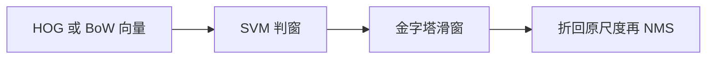
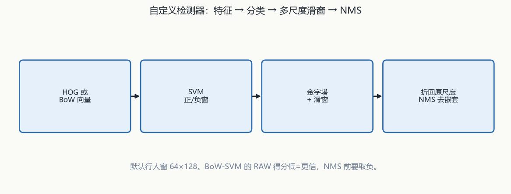
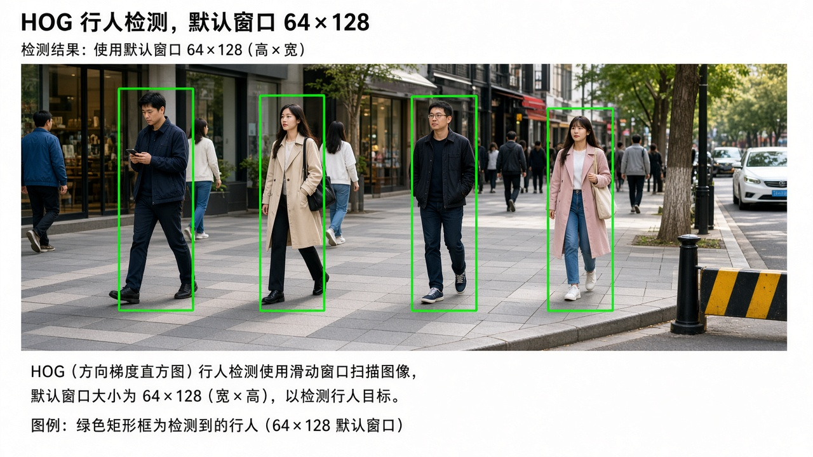
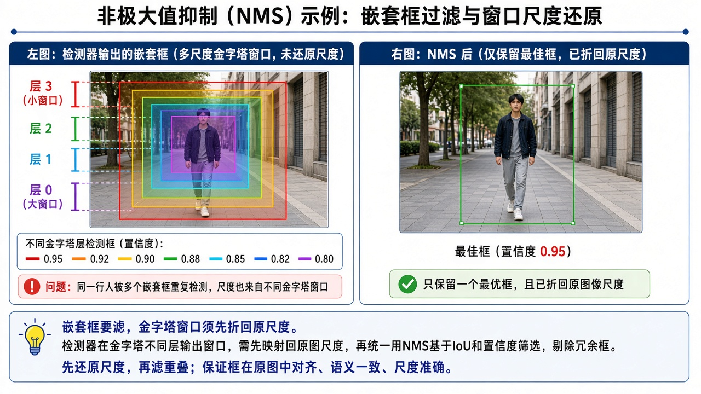

# 第14章 自定义物体检测器与传统机器学习

来源：文档1《OpenCV 4计算机视觉:Python语言实现》第7章「建立自定义物体检测器」（用户给定 PDF 287–337；实测章标题 PDF 288，7.8 小结 PDF 338；PDF 287 仍是第6章 6.11 页缝，本章不展开特征匹配）；文档2《opencv4快速入门》第12章 12.1「OpenCV 与传统机器学习」（书页 378–396 = PDF 381–399；12.1.5 SVM 示例代码跨到书页 397–398 / PDF 400–401 页缝，按节收录，**12.2 DNN 不读**）。文档2为扫描件 OCR，函数名按可辨识的 OpenCV 4 写法还原；吃不准处标【信息缺口】。假定已具备第9章 SIFT/FLANN。

## 本章总览

把「在图里找到某类物体」拆成：特征（HOG 或词袋）→ 分类器（SVM 等）→ 多尺度滑窗 → 非极大值抑制。学完应能回答：HOG 单元和块差在哪、NMS 为什么要先把金字塔窗口折回原尺度、BoW 的视觉词是怎么用 k 均值来的、`detectMultiScale` 三个常用旋钮、文档2 的 `ml` 五类算法各自继承谁、`kmeans` 和 `BOWKMeansTrainer` 不是同一个接口。

- **文档1侧重**：HOG 直觉与行人预训练检测器、NMS 流程、SVM 当检测器、SIFT+BoW+SVM 训汽车分类器、图像金字塔+滑动窗口定位、模型存 XML。Python：`cv2.HOGDescriptor`、`cv2.BOWKMeansTrainer`、`cv2.ml_SVM`。

- **文档2侧重**：C++ `ml` 模块标准化接口。`cv::kmeans`、`StatModel`/`TrainData`、K 近邻、决策树、随机森林、支持向量机。DNN 实例放到第15章。

属于后续章，本章不展开：ANN / DNN 结构与加载（第15章）；Haar / LBP 级联人脸（第12章，文档1把 HOG 接口比作 `CascadeClassifier` 但不讲级联训练）；视频跟踪 / 背景差分（第13章，文档1 7.5 把「塔不会动所以不是人」指向第8章）。滑动窗口用到的金字塔只按检测器需要写，不重讲第3章 `pyrUp`/`pyrDown`。

跨章回填与仍缺项：

- Haar 级联人脸：预训练 XML + `CascadeClassifier`；OpenCV 4 已移除级联训练工具，与本章 HOG+SVM 自训不是一条线。
  👉 完整深度讲解见第12章。

- 视频中滤假正例 / 行人跟踪：KNN 开场检出 + 每目标 MeanShift / 卡尔曼。
  👉 完整深度讲解见第13章。

- ANN_MLP / DNN：`ANN_MLP` 自训；`dnn` 的 `readNet` 加载。SVM 只当检测器。
  👉 完整深度讲解见第15章。

- `cv2.HOGDescriptor` 构造函数全参数：文档1只写实例 + `setSVMDetector` + `detectMultiScale` 三个可选参数，其余未抽出。
  👉 该细节原书未完整抽出，暂不展开（代码插图）。

## 核心知识点

### 检测器流水线（文档1第7章）

【文档1观点】第5章人脸、第6章角点/斑点是「特定样子」；本章要能应付同一类物体的真实多样性（不同车型、不同衣服）。多数技术不是互斥，而是检测器的零件。主题清单：HOG、NMS、SVM 高层次直觉、预训练 HOG 行人、BoW 汽车检测（自定义金字塔、滑窗、NMS）。

典型组合：

1. 用 HOG 或「底层描述子 → 词袋」得到窗口级向量。
2. 用 SVM 把窗口判为正/负，并可给出与超平面距离有关的置信度。
3. 固定窗口在图上滑；把图缩成金字塔，覆盖尺度。
4. 重叠的正窗口用 NMS（或更简单的「丢掉被完全包住的子窗」）收成少数框。

Haar 人脸检测不是这条流水线。第12章用预训练 XML 交给 `cv2.CascadeClassifier`，在灰度图上 `detectMultiScale`；姿态要正面直立，尺度靠分类器内部金字塔。第1章已写 OpenCV 4 移除了训练 Haar / LBP 级联的工具。本章 HOG+SVM 或 BoW+SVM 是另一条自训检测器，不要把级联 XML 和 `setSVMDetector` 抄进同一段。

👉 完整深度讲解见第12章。

#### 零件不是互斥路线

HOG、词袋、SVM、滑窗、NMS 可以组合。预训练行人走 HOG+内置 SVM；自定义汽车走 SIFT+BoW+SVM。

🔑 关键速记：检测器 = 窗口特征 + 分类器 + 多尺度滑窗 + 重叠抑制。

🔑 关键速记：Haar XML 级联与本章 HOG/BoW+SVM 不是一条线，级联训练工具在 OpenCV 4 里已经拿掉。

### HOG：面向梯度直方图

【文档1观点】HOG 与 SIFT/SURF/ORB 同属特征描述子家族，常用于物体检测。行人检测来自 Dalal & Triggs，2005，*Histograms of Oriented Gradients for Human Detection*。

- 把图划成单元，每单元算一组梯度：某方向上像素密度怎么变。这些梯度组成该单元的直方图。文档1称与第5章人脸识别里的局部二值模式直方图「类似」。
- 单元再合成更大的块。块可以含任意多个单元；Dalal & Triggs 发现行人检测时 2×2 单元块最好。对块向量做标准化，补偿局部光照/阴影（单个单元太小看不出这些变化）。
- HOGgles（Vondrick 等）把 HOG「看见」的世界画出来：单元里梯度像拉长的星，轴越长梯度越强；反演重构后仍能认出轮子和车身大结构。
- 位置用滑动窗口；尺度用图像金字塔。小步长会多次框住同一个人，所以必须 NMS。

【文档2观点】本章 12.1 没有 HOG 专节。第9章点过 HOG，检测器训练在文档1。

#### 单元直方图与块标准化

单元太小看不出光照变化，所以把若干单元收成块再标准化。行人检测书称 2×2 单元块最好。

🔑 关键速记：HOG 先按单元统计梯度方向，再按块标准化抗阴影。

🔑 关键速记：滑窗给位置、金字塔给尺度；重叠框必须再做 NMS。

### 非极大值抑制（NMS）

【文档1观点】听起来是「重叠里留分最高的」，实现要更小心：金字塔各层的框必须先折回原图尺度再比重叠。典型步骤：

1. 建金字塔。
2. 每层滑窗；超过任意置信度阈值的窗口折回原尺度，连同置信度进正检列表。
3. 按置信度降序排。
4. 对每个窗口 W，去掉与 W 明显重叠的后续窗口。

另一种过滤：丢掉完全落在另一框内部的子窗口（比角点坐标即可）。7.5 行人例用子窗口抑制；也可以和 NMS 一起用。文档1指向 Malisiewicz 的 MATLAB 快实现和 Rosebrock 的 Python 移植；7.7.2 汽车例在该实现上改。

文档1 7.5 建议用视频运动信息排除「不会动的塔」。第13章行人拼装是：KNN 背景差分开场检出，每人一份色调直方图和一份卡尔曼，之后 MeanShift 给测量、卡尔曼做修正。塔不会动，差分器不会把它当开场行人；只出现一两帧的假正例也可再滤。

👉 完整深度讲解见第13章。

#### 先折回原尺度再比

各层窗口坐标若还停在金字塔尺度上，重叠比例会比错。NMS 输入形状在汽车例是 N×5：`[左x, 顶y, 右x, 底y, 得分]`。

🔑 关键速记：NMS 必须先把金字塔窗折回原图，再按得分降序丢重叠。

#### 子窗口抑制不是 IoU-NMS

丢掉完全被包住的框，只比角点是否落在另一框内部。行人例用它滤嵌套；可以和 NMS 一起用。

🔑 关键速记：子窗口抑制只丢「完全被包住」的框，不是按重叠比例的 NMS。

🔑 关键速记：视频里滤假正例靠第13章的运动跟踪，不是再训一套 HOG。

### SVM 当分类器（两书都有，用途不同）

【文档1观点】有标记训练数据时，SVM 找最优超平面：最大限度划开两类。图 7-4：H1 没划开；H2、H3 都划开，只有 H3 间隔最大。行人检测：窗口的 HOG 向量为人/非人；之后任意窗口的 HOG 都能判，并给出与超平面距离有关的置信度。现代实现基础见 Cortes & Vapnik，1995。自定义检测器阶段用的是 BoW 向量 + `cv2.ml_SVM`，不是再训一套 HOG-SVM 行人模型。

【文档2观点】`cv::ml::SVM` 继承 `StatModel`，用法与 KNN/决策树/随机森林同一套路：`create` → 设核与类型 → `TrainData::create` → `train` → `predict`。二维点分类例因「高维数据处理速度较慢」才改用点集，不用 20×20 手写图。非线性点集示例核为 `SVM::INTER`（直方图交叉，表 12-5 简记 5），类型 `C_SVC`。间隔 = 过两类边缘的两条平行线之间的距离，最佳分割线是其中线；直线离样本太近则怕噪声、泛化差。

本章 SVM 只当检测器/分类器工具。自己训浅层网走 `cv2.ml_ANN_MLP`（与 SVM 同 `ml` 模块、同 `StatModel`）；加载别人训好的深度网走 `dnn::readNet` → `blobFromImage` → `setInput` → `forward`。不要在检测器章展开层结构和 blob 预处理。

👉 完整深度讲解见第15章。

#### 文档1：窗口向量为人/非人

置信度与到超平面的距离有关。预训练行人挂内置 SVM；汽车自定义挂 `cv2.ml_SVM` + BoW，两条链不要混。

🔑 关键速记：文档1 的 SVM 判的是窗口特征向量，不是整张图的像素。

#### 文档2：核与类型同一套路

`create` 之后必须 `setKernel`；示例 `INTER` + `C_SVC`。高维慢，手写数字例改用二维点。

🔑 关键速记：文档2 的 SVM 和 KNN/树共用 `StatModel`，检测器场景仍是两类分类不是回归。

🔑 关键速记：ANN_MLP 自训和 `dnn.readNet` 加载都在第15章；本章 SVM 只当检测器。

### 预训练 HOG 行人：`cv2.HOGDescriptor`

【文档1观点】接口有点像第5章的 `cv2.CascadeClassifier`，但 HOG 有时返回嵌套矩形（例如小孩完全落在成人体内）。常规情况下嵌套多半是错的，所以常先滤掉被包住的框。`setSVMDetector` 指定分类器用哪套 SVM，从而决定检测哪类物体。

示例用 OpenCV 内置默认人员检测器，图像是 1909 年普罗库金–戈尔斯基在卢辛斯基修道院干草地的照片：最近 6 名女性检出 5 名，背景一座塔被误检为人。文档1建议用视频运动信息排除塔（跟踪见第13章）。

`detectMultiScale` 返回两个列表：矩形框、权重/置信度（越高越信）。

下面这张表只列文档1写出的三个可选参数；构造函数其余形参在代码插图，未抽出。

| 名称 | 功能 | 主要参数 | 约束&坑点 |
|---|---|---|---|
| `cv2.HOGDescriptor` | HOG 描述 + 多尺度检测 | 文档1未列构造全参。用 `setSVMDetector` 挂 SVM（示例为默认行人） | 可能返回嵌套框，通常要自己滤子窗口。与 Haar 级联不是同一套 XML |
| `detectMultiScale` | 金字塔+滑窗检测 | `winStride`：连续尝试之间窗口移动的 (x,y)。HOG 能吃重叠，步长可相对窗口较小；越小检测越多、越贵。**默认步长 = 窗口大小、无重叠**，默认行人窗 **(64, 128)**。`scale`：金字塔相邻层尺度因子，必须 **>1.0**，默认 **1.5**，越小层越多越贵。`finalThreshold`：越小越不严、检出越多，默认 **2.0** | 文档1只列这三个可选参数。【信息缺口：其余形参未抽出】 |

取值：默认行人窗 64×128；默认步长等于窗口所以无重叠；`scale` 必须大于 1.0。

👉 该细节原书未完整抽出，暂不展开（代码插图）。

#### 嵌套框与塔误检

小孩落在成人体内会出嵌套矩形，常先滤子窗口。塔不会走，可用第13章运动信息排除；那不是 Haar，也不是再训 HOG。

🔑 关键速记：`setSVMDetector` 决定检哪类；嵌套框要自己滤，塔误检靠视频运动。

🔑 关键速记：`detectMultiScale` 常用旋钮是步长、尺度因子 1.5、最终阈 2.0；构造全参仍在插图里。

### BoW 词袋与 k 均值视觉词

【文档1观点】BoW 来自语言/信息检索；视觉里有时叫 BoVW，但 OpenCV 用 BoW。文档变成「词计数向量」（直方图），可拿去训垃圾邮件之类分类器。视觉步骤：

1. 准备样本图。
2. 每张图用 SIFT/SURF/ORB 等抽描述子。
3. 描述子向量交给 BoW 训练器。
4. 聚成 k 个簇，质心 = 视觉词。数据集越大词表通常越丰富，「在某种程度上词汇越多越好」。

测试：抽描述子，按到各质心的距离做直方图（量化/降维），得到 BoW 向量再送给 SVM。`cv2.BOWKMeansTrainer`：文档原话「基于 k 均值的类使用词袋方法训练视觉词表」。k 均值：指定 k，簇的均值即质心。

【文档2观点】k 均值是无监督聚类，四步：指定 k 并随机 k 个中心 → 点归最近中心 → 用均值更新中心 → 重复直到中心收敛。函数在 `ml` 模块之外（书称模块设计前就已存在）。用来聚二维点，或把像素 BGR 聚成 3/5 类做分色分割。与文档1的「描述子→视觉词」不是同一条调用链。

下面这张表把 `cv::kmeans`、初始化 flags、词袋训练器和提取器分开写，避免抄成同一个 API。

| 名称 | 功能 | 主要参数 | 约束&坑点 |
|---|---|---|---|
| `cv::kmeans` 【文档2】 | 对行排列数据做 K 均值 | `double cv::kmeans(data, K, bestLabels, criteria, attempts, flags, centers=noArray())`。`data` 必须**行排列**（一行一个样本）；二维点可放 `Mat(N,2,CV_32F)`、`Mat(N,1,CV_32FC2)`、`Mat(1,N,CV_32FC2)` 或 `vector<Point2f>`。`K` 正整数。`bestLabels` 与输入同尺寸的索引。`criteria` 迭代终止。`attempts` 不同初始化尝试次数。`flags` 见表 12-1。`centers` 各类中心，不需要可 `noArray()` | 返回类型是 `double`，【信息缺口：文档2未解释返回值含义】。图像分割例：`reshape(3, sampleCount)` 后 `convertTo` 到 `CV_32F`；示例把 `attempts` 写成与 `K` 相同的 `number`。聚类种类数目是「重要参数」 |
| 表 12-1 `flags` 【文档2】 | 中心初始化 | `KMEANS_RANDOM_CENTERS` 简记 0：每次尝试随机中心。`KMEANS_USE_INITIAL_LABELS`：第一次用用户标签算初始中心，后续随机/半随机。`KMEANS_PP_CENTERS` 简记 2：Arthur & Vassilvitskii 的 k-means++ | OCR 把第二项简记印残，笔记按后文「用户提供的标签」还原 |
| `cv2.BOWKMeansTrainer` 【文档1】 | 用 k 均值训视觉词表 | 构造时必须指定聚类数。汽车整图分类例 **40**；加上滑窗后实验改成 **12**（书称随机选的） | 与 `cv::kmeans` 不是同一个 API。无特征则 keypoints/descriptors 为 `None`，不能硬加进训练器 |
| `cv2.BOWImgDescriptorExtractor` 【文档1】 | 底层描述子 → BoW 向量 | 初始化必须指定**描述子提取器**和**匹配器**（例：已建的 `cv2.SIFT` + `cv2.FlannBasedMatcher`）。`cluster` 得到词表后再赋给提取器 | 有了 SIFT + FLANN + 词表之后，提取器才能从 DoG 特征算 BoW。匹配本身不是终点，只是 BoW 的零件 |

取值：`kmeans` 不在 `ml` 里；词袋训练器必须先指定聚类数；无特征的图不能硬加进训练器。

#### `cv::kmeans` 聚点或像素

数据必须行排列。返回 `double`，文档2未解释含义。像素分割要把图 `reshape` 成样本再转 `CV_32F`。

🔑 关键速记：`cv::kmeans` 在 `ml` 外，用来聚点或像素，不是词袋训练器。

#### `BOWKMeansTrainer` 聚描述子

汽车整图分类例 k=40，加上滑窗后改成 12。提取器还要挂 SIFT 和 FLANN，匹配只是零件。

🔑 关键速记：视觉词是描述子聚类的质心；无特征就不要往训练器里塞。

🔑 关键速记：两条 k 均值调用链不要抄进同一段。

### 汽车检测：数据、整图分类、再滑窗

【文档1观点】正样例=车，负样例=检测时真会碰到的背景（路边、人行道、行人、自行车），不要用「土星环」这种不相干负例。理想情况下样本应代表这套摄像头和算法看见主体的方式。本章用固定大小滑窗，所以训练图要固定尺寸，正例应紧裁、少背景。样本越多通常越准，但训练集太大则训练变慢，且可能过拟合、推不到集外样本。示例用 UIUC 汽车集（另点名斯坦福汽车集）：解压后 `CarData/TrainImages` 的 `pos-x.pgm` / `neg-x.pgm`（x 从 1），测试在 `TestImages`。

两个训练阶段可以用不同数量的样本：词表阶段用大量图；SVM 阶段用大量 BoW 向量。两类可用不同数量，示例用相同数量。SIFT/FLANN 初始化方式与第6章（融合第9章）相同。

标签：正 1、负 −1。多正类可再加标签（例：1 车、2 人、−1 背景）。可以没有负类，但没有负类时分类器会假定所有内容都属于正类。训练数据必须先变成 NumPy 数组再交给 `train`。预测整图：1.0=车，−1.0=非车。6 张简单测试里错 1 张。

滑窗改进：同一类多个物体、给出位置和大小。流程：窗口按步长右移，到右端则 x 归零再下移；每步用 BoW-SVM 分类；记下正窗；整图扫完后缩小再扫，直到最小尺度；最后 NMS。NMS 输入形状 N×5：`[左x, 顶y, 右x, 底y, 得分]`（分越高越信）。第二参数是重叠最大比例；超过则丢掉得分低的。示例重叠阈 15%（随机选的）。另用 `SVM_SCORE_THRESHOLD` 区分正/负窗。

SVM 的 C：C 增大 → 假正例风险降、假负例风险升。假正=不是车判成车；假负=是车判成非车。

`predict(..., cv2.ml.STAT_MODEL_RAW_OUTPUT)` 返回的是得分不是标签；得分可为负，低值表示置信度高。为迎合 NMS「越高越好」，要对得分取负。多层金字塔的窗口坐标必须先变到原图尺度再进列表。

结果观察：能检到车；两车图可能只检到一辆；特征多的背景会假正。训练集很小；金字塔+滑窗产生海量 ROI，书认为假正比例其实已经相当低。视频里可再滤「只出现一两帧」的检测。训练很慢，不要每次检测都重训。

下面这张表并列 Python / C++ SVM；核与类型两张附表仍以文档2 为准。

| 名称 | 功能 | 主要参数 | 约束&坑点 |
|---|---|---|---|
| `cv2.ml_SVM` 【文档1】 | 支持向量机 | `train` 吃样本和标签（须 NumPy）。`predict` 默出标签；`cv2.ml.STAT_MODEL_RAW_OUTPUT` 出原始得分 | 原始得分越低越信，NMS 前要取负。C 同时撬假正/假负。保存/加载到 XML，精确方法名在代码插图【信息缺口】 |
| `cv::ml::SVM` 【文档2】 | 同上，C++ | `SVM::create()`。表 12-4：`setKernel` **必需**；`setType` 否；`setTermCriteria` 否；`setGamma` 默认 1，用于 POLY / RBF / SIGMOID / CHI2；`setC` 默认 **0**，用于 C_SVC / EPS_SVR / NU_SVR；`setP`（OCR 作「z」）默认 0，EPS_SVR；`setNu` 默认 0，NU_SVC / ONE_CLASS / NU_SVR；`setDegree` 默认 0，POLY | 核与类型见表 12-5/12-6。示例 `setKernel(SVM::INTER)` + `setType(C_SVC)` + `TermCriteria(MAX_ITER+EPS, 100, 0.01)`。高维慢，手写数字例改用点集 |
| 表 12-5 核 【文档2】 | 核函数 | `LINEAR` 0：不映射，特征空间回归，快。`POLY` 多项式。`RBF` 2 径向基。`SIGMOID` 3。`CHI2` 4。`INTER` 5 直方图交叉 | POLY 的简记 OCR 残 |
| 表 12-6 类型 【文档2】 | SVM 类型 | `C_SVC` 100：C-支持向量分类。`NU_SVC` 101。`ONE_CLASS` 102：一类边界，训练数据都来自同一类。`EPS_SVR` 103、`NU_SVR` 104：回归 | 检测器场景文档1用的是两类分类，不是回归 |

取值：RAW 得分低 = 更信，送给 NMS 前取负；文档2 表写 `setC` 默认 0。保存 XML 的精确方法名未抽出。

#### 无负类会全判正

负例要像真实背景。标签正 1、负 −1。没有负类时分类器假定所有内容都属于正类。

🔑 关键速记：负例要像检测时会碰到的背景；没有负类就等于全是正类。

#### RAW 得分要取负再进 NMS

`STAT_MODEL_RAW_OUTPUT` 出的是得分不是标签。低值更信，NMS 要「越高越好」，所以取负。C 越大假正越少、漏检越多。

🔑 关键速记：金字塔坐标先折回原尺度；RAW 得分取负后再按重叠阈做 NMS。

🔑 关键速记：整图分类先判「是不是车」，滑窗之后才有框；不要每次检测都重训。

### 文档2：`ml` 公共接口与其余三类算法

【文档2观点】OpenCV 4 两个机器学习模块：`ml`（传统）和 `dnn`（深度，第15章）。传统算法尽量做成同一套继承：基础类提供 `train`/`predict`，具体算法再 `create`。`kmeans` 是少数还留在 `ml` 外的。书不讲透原理，重点在函数。

手写数字共用数据：官方图 `digits.png` 里 5000 个数字，每个 20×20，抽成 5000×400 行向量；50 行×100 列铺在图上（高 50×20、宽 100×20）。标签按行号 `row/5` 得到 0–9。`TrainData` 前样本转 `CV_32F`、标签转 `CV_32S`。KNN 训完准确率书给 0.964；测新图要先缩到 20×20。

下面这张表收公共接口和 KNN / 决策树 / 随机森林；SVM 已在上一节。

| 名称 | 功能 | 主要参数 | 约束&坑点 |
|---|---|---|---|
| `StatModel::train` | 训练 | `bool train(trainData, flags=0)`。`trainData` 为 `Ptr<TrainData>`。`flags` 如 `UPDATE_MODEL` 表示用新数据更新已有模型，默认 0 通常够用 | 返回是否训成功。能否更新取决于具体算法 |
| `TrainData::create` | 打包样本 | `samples` 必须 `CV_32F`。`layout`：`ROW_SAMPLE` 简记 0 一行一个样本；`COL_SAMPLE` 简记 1 一列一个。`responses` 标量标签放单行或单列，`CV_32F` 或 `CV_32S`。后四个 `varIdx`/`sampleIdx`/`sampleWeights`/`varType` 一般默认可关 | 与文档1的「列表转 NumPy 再 train」是同一件事的 C++ 写法 |
| `StatModel::predict` | 预测 | `samples` 须 `CV_32F`（OCR 有一处写成 `CV_32`）。`results` 输出。`flags` 取决于模型 | 文档2正文有一处把 flags 误写成「与 TrainData::train 最后一参相同」，以原型 `StatModel::predict` 为准 |
| `Algorithm::load` | 读已训模型 | `filename`；可选 `objname`，读全部节点用默认 `String()`。返回 `Ptr<Tp>`，如 `load<KNearest>(...)` | 与文档1「SVM/ANN 存 XML 再加载」同类。扩展名示例常见 yml |
| `KNearest::create` | K 近邻 | 继承 `StatModel`。`setDefaultK(整数)` 设邻居数；`setIsClassifier(bool)` 是否分类。另有 `findNearest(samples, k, results, neighborResponses=noArray(), dist=noArray())` | `samples` 行排列 `CV_32F`。`k` 必须 **>1**（至少一个以上样本才能决策）。`results` 为 `CV_32F`。示例 K=5。适合「每类都有大量已知样本」如手写数字 |
| `DTrees::create` | 决策树 | 表 12-2：`setMaxDepth` **必需**，正整数；`setCVFolds` **必需**，一般用 **0**；`setUseSurrogates` 否，bool，是否建替代分裂；`setMinSampleCount` 否，节点样本少于此值不再细分；`setUse1SERule` 否，是否严格剪枝；`setTruncatePrunedTree` 否，剪掉的枝是否完全移除 | 后四项可默认，但书称默认会降一定精度。一棵树易过拟合。示例注释误把部分 setter 写成 `RTmodel` |
| `RTrees::create` | 随机森林 | 继承 `DTrees`，多棵树**投票**。除表 12-2 外，表 12-3：`setRegressionAccuracy`（float，回归精度）、`setPriors`（常 `Mat()`）、`setCalculateVarImportance`（bool）、`setActiveVarCount`（正整数）。示例还 `setTermCriteria(MAX_ITER+EPS, 100, 0.01)`，并点名 `setMaxCategories` | **全部约束都可默认**以加快速度，但会影响准确性。类名从 DTrees 换成 RTrees 其余几乎照搬 |

取值：样本必须 `CV_32F`；KNN 的 k 必须大于 1；决策树 `setMaxDepth` 与 `setCVFolds` 书称必需。

K 近邻直觉【文档2】：看最近 N 个已知样本里哪类多。图 12-3：k=3 判成三角，k=5 判成方，k 会改结论。

决策树直觉【文档2】：每个分支一个测试，叶节点一个类；样本太少不再细分。

#### `StatModel` + `TrainData`

`kmeans` 不在这套继承里。`predict` 的 flags 以 `StatModel::predict` 原型为准，不要抄成 `TrainData::train` 的最后一参。

🔑 关键速记：KNN / 树 / 森林 / SVM 共用 `train`/`predict`；k 均值单独在 `ml` 外。

#### KNN 的 k 不能为 1

`findNearest` 的 k 必须大于 1。手写数字例 K=5，准确率书给 0.964；新图要先缩到 20×20。

🔑 关键速记：KNN 靠邻居投票，k 会改结论，样本必须行排列浮点。

#### 森林是多棵树投票

约束全默认可跑但不一定准。示例注释有一处把 setter 写成 `RTmodel`，按类名 `RTrees` 理解。

🔑 关键速记：随机森林不是另写一套 `train`，是多棵决策树投票。

🔑 关键速记：手写数字 20×20、行向量 400 维是文档2 三类算法的共同实验，ANN 留给第15章。

## 易混淆点&差异对比

| 对比项 | 文档1（第7章） | 文档2（12.1） |
|---|---|---|
| 本章任务 | 自定义**检测器**：定位+分类（行人现成、汽车自训） | 传统 **ml 五类算法**的 C++ 用法；k 均值还可做像素分割 |
| HOG / 滑窗 / NMS | 主线 | 无 |
| k 均值 | `BOWKMeansTrainer` 聚描述子得视觉词 | `cv::kmeans` 聚点或像素；明确写不在 `ml` 里 |
| SVM | `cv2.ml_SVM` + BoW；C 调假正/假负；原始得分要取负再 NMS | `ml::SVM` + 核/类型表；例用 INTER 核画二维分界；默认 `setC` 书表写 0 |
| 手写数字 | 留给第15章 ANN | KNN / DTrees / RTrees 的共同实验（20×20、5000 字） |
| 模型文件 | SVM 存 **XML** | `save` 成 **yml**，`Algorithm::load` 读回 |
| DNN | 不在本章 | 12.2 起，归融合第15章 |

文档1 做「在图里框出某类物体」；文档2 做「同一套 `StatModel` 怎么 train/predict」。两套 SVM 同算法、不同调用链。

其他易混：

- 整图分类 ≠ 检测：先能判「这张是不是车」，再滑窗才得到框。

- HOG-SVM 行人是 OpenCV 自带检测器；SIFT-BoW-SVM 汽车是自己训的另一条链，不要把 `setSVMDetector` 和 `BOWKMeansTrainer` 抄进同一段。

- NMS 的重叠在折回原尺度之后比；金字塔坐标未还原会比错。

- 子窗口抑制只丢「完全被包住」的框，不是 IoU-NMS。

- 无负类会把什么都判成正类。

- 文档2 `predict` 要 `CV_32F` 样本；KNN 另走 `findNearest`，k 不能为 1。

- 随机森林不是「再写一套 train」，是多棵决策树投票；约束默认可跑但不一定准。

- 【文档1观点】第7章 k 均值只服务词袋；【文档2观点】同一算法还可以当第8章点过的「第五种分割」。融合笔记把分割用法收在本章，不把 DNN 性别检测收进来。

- Haar 级联吃灰度、正面直立、预训练 XML；本章 HOG 接口「有点像」级联，但不是同一套 XML，也不能在 OpenCV 4 里再训 Haar。

- 视频滤塔、滤一两帧假正例，走第13章跟踪，不在本章重写差分器。

## 本章要点总结

- 检测器 = 窗口特征 + 分类器 + 金字塔滑窗 + 重叠抑制。HOG 用单元直方图和块标准化抗光照；NMS 必须先统一尺度。

- 现成行人：`HOGDescriptor` + 默认 SVM + `detectMultiScale`（默认窗 64×128、scale 1.5、finalThreshold 2.0），注意嵌套框。构造函数全参仍在代码插图，未抽出。

- 自定义汽车：SIFT → BoW（k 均值词表）→ SVM；再滑窗定位。RAW 得分低=更信，送给 NMS 前取负。C 越大假正越少、漏检越多。

- 文档2 把 KNN/DTrees/RTrees/SVM 收成 `StatModel` + `TrainData`；`kmeans` 单独。手写数字实验图 20×20、行向量 400 维。

- Haar 见第12章，跟踪见第13章，ANN/DNN 见第15章。模型训一次存盘，检测时只加载。
