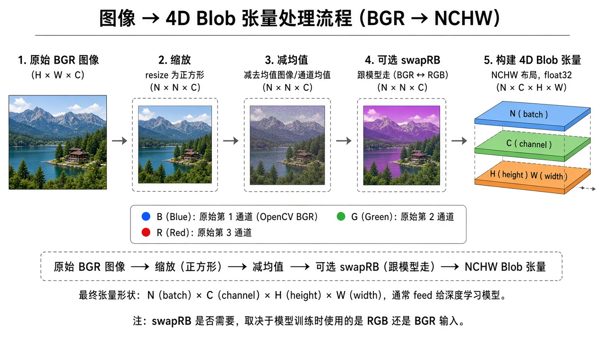
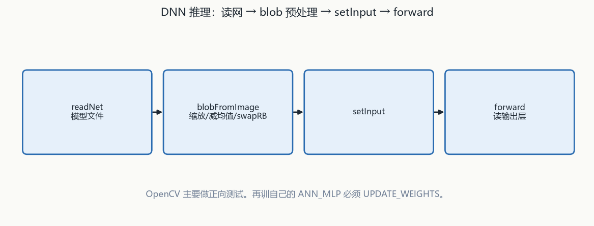
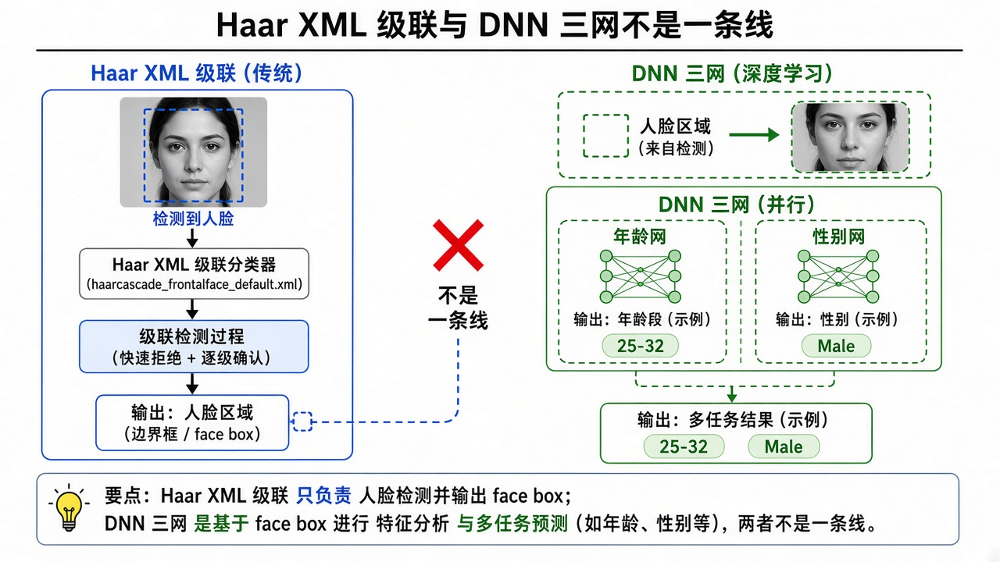

# 第15章 神经网络与深度学习

来源：文档1《OpenCV 4计算机视觉:Python语言实现》第10章「基于 OpenCV 的神经网络导论」（用户给定 PDF 479–551；实测章标题 PDF 480，10.9 小结 PDF 552；PDF 479 仍是第9章 9.5 页缝，本章不展开 AR）；文档2《opencv4快速入门》第12章 12.2–12.3（书页 397–407 = PDF 400–410；12.1.5 SVM 代码页缝已归第14章，**不重复 KMeans/KNN/DTrees/RTrees/SVM**）。文档2扫描件 OCR 嘈杂，函数名按可辨识写法还原。假定已具备第14章「有监督学习分类器」和第7章轮廓直觉。

## 本章总览

OpenCV 里神经网络分两层：自己训的浅层 MLP（`ml` 里的 `ANN_MLP`），以及加载别人在 Caffe/TensorFlow/Torch 等框架里训好的 DNN（`dnn` 模块）。学完应能回答：感知器为什么要非线性激活、输入/输出/隐藏层节点怎么定、MNIST 为什么是 784→10、多阶段训练为什么必须 `UPDATE_WEIGHTS`、`blobFromImage` 的减均值和 `swapRB` 各干什么、人脸框为什么要扩成正方形再送给年龄/性别网。

- **文档1侧重**：ANN 统计模型与 MLP 拓扑、`cv2.ml_ANN_MLP`、MNIST 手写数字（先轮廓检出数字再分类）、用 `cv2.dnn` 加载第三方网做 20 类物体、人脸框 + 年龄/性别三网串联。

- **文档2侧重**：不训网，只 `dnn::readNet` 加载。GoogLeNet 看层名、Inception 认物体、Torch 风格迁移、TF 人脸 + Caffe 性别。表 12-7/12-8 是 C++ 对照表。

属于后续章，本章不展开：K 均值 / KNN / 决策树 / 随机森林 / SVM（第14章已写；文档1只说可以把 ANN 接到当年 BoW 那种描述子上，反之亦然）；Haar 级联（第12章；本章人脸检测用的是 SSD 风格 DNN）；Cameo 颜色曲线（附录）。轮廓/`findContours`、阈值、形态学只按数字检测需要点到，不重讲第5/7章。

跨章回填与仍缺项：

- 传统 ml 五类：kmeans、KNN、DTrees、RTrees、SVM 共用 `StatModel`+`TrainData`（kmeans 不在 `ml` 内）。
  👉 完整深度讲解见第14章。

- Haar / LBP 级联：灰度正面直立级联，与本章 SSD / TF 人脸检测器不是一条线。
  👉 完整深度讲解见第12章。

- 文档1 各框架加载函数名：PDF 531 用代码插图列出文件类型与 OpenCV 函数，文本层未抽出。
  👉 该细节原书未完整抽出，暂不展开（PDF 531 插图）。

- 年龄分类完整标签表：正文只举例 `'0-2'`/`'4-6'`、`'25-32'`/`'38-43'`，未逐条列出。
  👉 该细节原书未完整抽出，暂不展开。

## 核心知识点

### 为什么还要神经网络

【文档1观点】第7章（融合第14章）已经用 SURF/BoW/SVM 做过汽车分类。ANN 更擅长：多个输入之间非线性关系、多个输出（多类置信度）、以及多层匿名隐藏变量（彼此相关，不一定直接连到输入或输出）。DNN = 多个隐藏层。代价是模型不透明。本章只做监督学习（无监督、强化学习只给定义）。

三种学习（只展开第一种）：

- 监督：已知输入对应已知输出；分类时输出可以是一类或多类置信度。
- 无监督：输出集合未知，训练要同时发现输出变量和映射；可含聚类（见第14章）。
- 强化：已有「输入→输出」的系统，能给输出序列打分；模型学的是根据上一输出选下一个最优输入。

第14章传统五类：`cv::kmeans` 在 `ml` 外，用来聚点或像素；KNN、决策树、随机森林、SVM 继承 `StatModel`，打包样本用 `TrainData::create`（样本 `CV_32F`），再 `train` / `predict`。检测器章的 SVM 只当窗口分类器。文档1说 ANN 也可以接到 BoW 那种描述子上，反之亦然，本章不重训那条检测器。

👉 完整深度讲解见第14章。

#### 监督、无监督、强化只展开第一种

无监督可含聚类，细节在第14章 k 均值。强化只给定义。本章实现都是有标签的监督分类。

🔑 关键速记：本章只做监督学习；无监督聚类回第14章，强化只点名不实现。

🔑 关键速记：ANN 擅长非线性多输出和隐藏变量；不透明是代价，SVM/BoW 检测器不在本章重讲。

### 神经元、感知器、层

【文档1观点】分类常用多层感知器 MLP：每个神经元当二值分类感知器（概念可追溯到 1950 年代）。多输入各带权重 → 非线性激活（常见 sigmoid / S 曲线）→ 判别函数切成 0/1。权重表示连接强度，随学习改变。网络至少三层：输入、隐藏、输出。多个隐藏层时常叫 DNN。分类时看哪个输出节点分数最高。

定拓扑：

1. 输入层大小 = 输入个数。动物玩具例：重量、长度、牙数 → 3 个输入。
2. 输出层大小 = 类数。狗/秃鹰/海豚/龙 → 4 个输出。未知动物会被判成最像的那一类。
3. 隐藏层没有统一公式，靠训、测、再训。书转述的宽泛建议（应保留态度）：输入很大则隐藏介于输入与输出之间、常更靠近输出；输入输出都小则隐藏应最大；输入小输出大则隐藏更靠近输入。训练样本越多，可能用得上的隐藏节点越多。隐藏太大、数据不够会过拟合。本章若干例子用 60 个隐藏节点当起点。

#### 三层怎么定大小

输入个数、类数是硬约束。隐藏层没有统一公式，60 只是本章起点。未知类会被判成最像的那一类，不会单独出「未知」。

🔑 关键速记：输入=特征数，输出=类数，隐藏靠试；太大加数据不够就会过拟合。

🔑 关键速记：没有非线性激活就叠不出多层判别能力；分类看哪个输出节点分最高。

### `cv2.ml_ANN_MLP`：自己训练

【文档1观点】`cv2.ml_ANN_MLP` 在 `cv2.ml`，与 SVM 同模块，并和 `cv2.ml_SVM` 共享基类 `cv2.ml_StatModel`，所以 API 像。`setLayerSizes` 吃 NumPy 数组：首元输入、末元输出、中间每个隐藏层。例 `[9,15,9]` 一个隐藏层；`[9,15,13,9]` 两个隐藏层。

最小例子（数据无意义，只练接口）：对称 sigmoid `cv2.ml.ANN_MLP_SIGMOID_SYM` + 反向传播 `cv2.ml.ANN_MLP_BACKPROP`（在输出层算预测误差，回追各层，改权重）。`train` 要 samples、responses、layout（每样本一行或一列）。分类响应是各类置信度向量，如 9 类里类 5 为 `[0,0,0,0,0,1,0,0,0]`。`predict` 返回元组：类别 + 各类概率数组，预测类概率最高。只喂一条类 5 样本时，新输入也会被判成类 5。

多阶段动物分类：输入 3、隐藏 50、输出 4；每类伪随机 20 000 条；循环多 epoch。必须把 `cv2.ml.ANN_MLP_UPDATE_WEIGHTS` 传给 `train`，否则是从头新建而不是接着改权重。现实问题可能要数百阶段，直到收敛（再训准确率不再明显升）。隐藏更大、阶段更多都能把准确率抬到过拟合点；输入范围若故意重叠，准确率会掉。玩具数据各类范围不重叠时，准确率可以很高甚至满分。

保存/加载接口「类似于 7.7.3 节」（融合第14章 SVM 存 XML）。精确调用在代码插图【信息缺口】。

下面这张表只收文档1写出的层大小、激活和训练方法枚举；精确 save/load 名字未抽出。

| 名称 | 功能 | 主要参数 | 约束&坑点 |
|---|---|---|---|
| `cv2.ml_ANN_MLP` | MLP 人工神经网络 | `setLayerSizes`：`[输入, 隐藏…, 输出]`。激活示例 `ANN_MLP_SIGMOID_SYM`。训练方法示例 `ANN_MLP_BACKPROP`。多阶段再训加 `ANN_MLP_UPDATE_WEIGHTS` | 与 SVM 同 `ml` 模块、同 `StatModel`。忘记 UPDATE 会丢掉已有权重。文档1写「10.2.4 节」讲多次 `train` 的额外参数，目录并无此小节【信息缺口】 |
| 可试用的激活 【文档1 10.5.6】 | 换非线性 | 已用 `SIGMOID_SYM`；还可 `ANN_MLP_IDENTITY`、`ANN_MLP_GAUSSIAN`、`ANN_MLP_RELU`、`ANN_MLP_LEAKYRELU` | 书指向官方 ANN_MLP 文档，未在正文展开每项公式 |
| 可试用的训练方法 | 换优化 | 已用 `BACKPROP`；还可 `ANN_MLP_RPROP`、`ANN_MLP_ANNEAL` | 同上，只点名 |

取值：多阶段必须带 `UPDATE_WEIGHTS`；激活与训练方法其余项只点名，公式在官方文档。

#### 层大小数组

`[9,15,9]` 一个隐藏层，`[9,15,13,9]` 两个。分类响应是 one-hot 式置信度向量，不是单个整数标签。

🔑 关键速记：`setLayerSizes` 首元输入、末元输出；中间每一项都是一层隐藏。

#### 再训必须 UPDATE_WEIGHTS

忘记这个标志会从头新建，丢掉已有权重。这和文档2 `StatModel::train` 的 `UPDATE_MODEL` 是同一类「接着训」开关，枚举名不同，不要抄错模块。

🔑 关键速记：多 epoch 必须 `ANN_MLP_UPDATE_WEIGHTS`；目录并无书中写的「10.2.4 节」。

🔑 关键速记：`ANN_MLP` 与 SVM 同 `StatModel`，但激活和反向传播是网络自己的枚举。

### MNIST 手写数字：训网 + 轮廓检出

【文档1观点】MNIST：60 000 训练 + 10 000 测试，灰度 28×28，黑底白（灰）字。一半普查局雇员、一半美国高中生。输入层 784（28×28 展平），输出 10（数字 0–9）。作者实验起点：隐藏 60、训练样本 50 000、阶段 10，希望几分钟内能做初步测试。像素值浮点 0.0～1.0。标签要变成 10 维向量（如 ID 1 → 第二位为 1.0）。`predict` 封装会把图先弄成 28×28 再展平。

MNIST 测试集准确率书给 95.39%（默认 60 隐藏 / 5 万样本 / 10 阶段）。

主程序对「一页纸上的手写数字」：灰度 → 模糊去噪 → `THRESH_BINARY_INV` 逆二值（MNIST 是黑底白字，所以要反相）→ 形态学让轮廓别太碎 → `findContours` → 丢掉太大/太小和被包住的框 → `wrap_digit`：短边拉到与长边相等且中心不动，再四周 +5 像素，越界则裁进图内（宁可变非正方形，也不因贴边丢掉数字）→ 缩到 28×28 再分类。110 个样本（10 个单独数字 + 100 个两位数字 10–59）：边界检对 108（98.18%），其中分类对 80（74.07%），随机乱猜约 10%。只检出 8 的下半会被当成 0，所以外框必须包全。

提升方向：改数据集大小/隐藏数/阶段；`create_ann` 支持多隐藏层；换激活和训练方法；用目标地区的笔迹——MNIST 在美国编，美国手写 7 常无横杠，欧洲手写 7 中间常有一小横以区别 1。领域内数据通常最好。

【文档2观点】手写数字在 12.1 用 KNN/树完成，本章 12.2 不再训 MLP。

#### 黑底白字必须反相

白纸黑字要 `THRESH_BINARY_INV` 才贴近 MNIST。框要补成近似正方形再缩 28×28，否则瘦的 1 和胖的 0 拉伸比例不同。

🔑 关键速记：MNIST 是 784→10、黑底白字；纸上数字要逆二值，外框必须包全。

#### 测试集约 95%，真实纸页约 74%

110 个样本里边界检对 108，分类对 80。欧洲手写 7 常有横杠，MNIST 美国 7 常没有，换地区笔迹会掉点。

🔑 关键速记：隐藏 60、5 万样本、10 阶段是作者起点；领域内笔迹比再堆隐藏更要紧。

🔑 关键速记：文档2 的手写数字在第14章走 KNN/树，本章 MLP 只属于文档1。

### 加载他人训好的 DNN

【文档1观点】OpenCV 可加载：Caffe、TensorFlow、Torch、Darknet、ONNX、DLDT（Intel OpenVINO 的 Deep Learning Deployment Toolkit，配合 Open Model Zoo）。若干框架用「文本配置 + 二进制权重」两套文件。预处理因网而异，必须了解该网怎么训的。`cv2.dnn.blobFromImage` 做常见预处理；也可在调用前手工做。输入向量有时叫张量或 blob。

PDF 531 用代码插图列出文件类型与 OpenCV 函数（各框架 `readNetFrom*` 一类名字）。文本层未抽出，本章不以记忆补函数名。

👉 该细节原书未完整抽出，暂不展开（PDF 531 插图）。

【文档2观点】训练又慢又容易失败，实际使用直接加载。`dnn::readNet(model, config="", framework="")` 返回 `Net`。`model` 是权重二进制；`config` 默认表示不读配置；`framework` 默认空=按扩展名猜。表 12-7 未列 ONNX。

下面这组表按文档2 的 `readNet`、框架成对文件、`Net` 常用方法和 blob 预处理来写；文档1 的 Python `blobFromImage` 只强调参数跟该网走。

| 名称 | 功能 | 主要参数 | 约束&坑点 |
|---|---|---|---|
| `dnn::readNet` 【文档2】 | 加载已训模型 | `model`、`config`（默认可空）、`framework`（默认可空） | 见表 12-7。空模型用 `empty()` 判断。文档1同目的，但精确 `readNetFrom*` 名字在插图里 |
| 表 12-7 框架 【文档2】 | 文件成对 | Caffe：`.caffemodel` + `.prototxt`。TensorFlow：`.pb` + `.pbtxt`（OCR 作 `.pboo`）。Torch：`.t7` / `.net`。Darknet：`.weights` + `.cfg`。DLDT：`.bin` + `.xml`（OCR 残） | 【文档1观点】另有 ONNX、DLDT/OpenVINO/Model Zoo。两书框架表不要混成一张 |
| `Net` 常用 【文档2 表 12-8】 | 查层、推理 | `empty()` 空则 true。`getLayerNames()` → `vector<String>`。`getLayerId(名字)`。`getLayer(id)` → `Ptr<Layer>`。`forward(输出层名)` → `Mat`。`setInput` 见下 | 输出 `Mat` 布局随模型变，SSD 与分类网不同 |
| `Net::setInput` 【文档2】 | 送 blob | `blob` 须 `CV_32F` 或 `CV_8U`；`name` 输入层名可默认；`scalefactor` 默认 1.0；`mean` 默认 `Scalar()` | 层名必须和该网一致，Inception 例用 `"input"` |
| `blobFromImages` / 例中的 `blobFromImage` 【文档2】 | 缩放到网的输入尺寸 | `images`：1/3/4 通道。`scalefactor` 默认 1.0。`size` 输出尺寸。`mean` 去均值（减光照敏感）。`swapRB` 默认 false：BGR↔RGB。`crop` 默认 false：true 时先让短边等于目标再从中心裁；false 直接拉伸、不保纵横比。`ddepth` 默认 `CV_32F`，或 `CV_8U` | 函数名正文有单数/复数两种写法。网训成多大，推理就必须多大 |
| `cv2.dnn.blobFromImage` 【文档1】 | 同上（Python） | 文档1未列全参，强调「参数取决于该 DNN 怎么设计和训练」 | MobileNet-SSD 例：高 300，像素先减 127.5 再除 127.5，映射到约 −1～1 |

取值：文档2 表 12-7 无 ONNX；文档1 另有 ONNX 与 DLDT。空网用 `empty()` 判断。输入层名必须和该网一致。

示例加载【文档2】：Caffe GoogLeNet `bvlc_googlenet.caffemodel` + `.prototxt`，打印每层 ID/名称/类型。

#### `readNet` 按扩展名猜框架

`config`、`framework` 默认可空。文档1 的 `readNetFrom*` 名字在 PDF 531 插图，不在此补。

🔑 关键速记：OpenCV 主要做正向测试；加载用 `readNet`，各框架成对文件见表 12-7。

#### blob 的减均值和 swapRB

`mean` 减光照敏感；`swapRB` 默认 false。OpenCV 图是 BGR，许多 TF/Caffe 模型按 RGB 训，跟该模型走，不要统一抄。`crop=false` 会拉坏纵横比。

🔑 关键速记：输入尺寸、减均值、通道顺序全部绑定具体模型；blob 深度默认 `CV_32F`。

🔑 关键速记：`ml` 的 `ANN_MLP` 是 `train`/`predict`；`dnn` 的 `Net` 是 `readNet`/`setInput`/`forward`，不是同一套对象。

### 图像识别、风格迁移、检测器串联

Haar 人脸检测不是下面这些 DNN。第12章用预训练 XML + `CascadeClassifier`，必须喂灰度，姿态要正面直立；`detectMultiScale` 用 `scaleFactor>1` 和 `minNeighbors` 控尺度与置信。OpenCV 4 已去掉 Haar 训练工具。本章人脸是 SSD / TF 检测器，出框（有的还出类），与级联 XML 不是一条线。

👉 完整深度讲解见第12章。

#### 20 类物体（文档1，MobileNet-SSD Caffe）

文件：`MobileNetSSD_deploy.caffemodel` / `.prototxt`。

输入高 300，宽度按原图长宽比变。像素：相对 0–255，减 127.5 再除 127.5。类 ID 1～20（不是 0～19），查标签表时 ID−1。输出含置信度、矩形、类 ID；低于自设阈值丢掉。

客厅例：人 99.4%、猫 85.4%、装饰瓶 72.1%、沙发一部分 61.2%、编织船图 52.0%。书称普通笔记本也可实时。

🔑 关键速记：SSD 类号从 1 起，查 0-based 表要减一；输入高 300，像素先减再除 127.5。

#### ImageNet 分类（文档2，TensorFlow Inception）

模型 `tensorflow_inception_graph.pb`，标签 `imagenet_comp_graph_label_strings.txt`。

输入 224×224。例：`blobFromImage(img, 1.0, Size(224,224), Scalar(), true, false)`——`swapRB=true`。`setInput(blob, "input")`，`forward("softmax2")`，`minMaxLoc` 取最大概率。飞机图 97.3004%。

🔑 关键速记：Inception 是整图分类不出框；输入层名 `"input"`，输出 `"softmax2"`。

#### 风格迁移（文档2，Torch `.t7`）

五种：`the_wave.t7`、`mosaic.t7`、`feathers.t7`、`candy.t7`、`udnie.t7`。

输入 256×256。先算原图每通道均值，blob 去均值；输出 `CV_32F`，把均值加回，再 ÷255 归一到 0–1 以便显示，最后 `resize` 回原图尺寸。输出 `Mat` 用 `size[1/2/3]` 取通道/行/列（NCHW 排布），再填进 `CV_32FC3`。

🔑 关键速记：风格网出 NCHW 浮点图，要拆通道、加回均值、÷255，再缩回原图。

#### 人脸 + 年龄 + 性别（文档1，三网 Caffe）

检测：OpenCV 的 `res10_300x300_ssd_iter_140000.caffemodel` + `deploy.prototxt`，拓扑类似 MobileNet-SSD，只出框不出类。

年龄/性别：Gil Levi & Tal Hassner。年龄标签有间隔（`'0-2'` 后面是 `'4-6'`），故意让类在输入上可分——差一天的 4 岁和未满 4 岁看起来一样，连续年龄区间当分类问题是错的。也可训连续年龄回归，但那就不是「各类置信度」分类器。

正文举例档：`'0-2'`、`'4-6'`，以及示例结果落在 `'25-32'`、下一档书称为 `'38-43'`。完整标签表未逐条列出。

👉 该细节原书未完整抽出，暂不展开。

年龄与性别用同一 blob 尺寸和同一平均脸（`average_face.npy`，不是单色均值）。从脸图减去平均脸再分类。平均脸是该训练集的模糊合成，正方形、鼻尖为中心、从前额顶到脖子底；推理裁法应一致。

检测框高大于宽，分类网要正方形：把框扩成正方形；正方形越出图像则跳过该检测。

示例：Joseph Howse 男性、拍摄时约 35.8 岁；性别网 100% 男性；年龄网 96.6% 落在 25–32（下一档书称为 38–43）。书提醒：这是分类不是连续岁数，把 25–32 中点 28.5 当成 −7.3 岁误差是对预测含义的延伸。

🔑 关键速记：三网串联先脸后年龄/性别；框要扩成正方形，越界就跳过，减的是平均脸不是单色均值。

#### 人脸 + 性别（文档2，TF 检测 + Caffe 性别）

人脸：`opencv_face_detector_uint8.pb` + `opencv_face_detector.pbtxt`，输入 300×300。输出矩阵每行人脸信息：第 3 列置信度，后 4 列是左上/右下相对宽高的百分比。阈值越大越严，例 0.5。

性别：`gender_net.caffemodel` + `gender_deploy.prototxt`，输入 227×227，输出 1×2（男、女概率），取较大者。标签 `Male` / `Female`。

框四周各扩 25 像素（防越界用 `max`/`min` 夹到图内）。书称仍有识别错误；可把 25 改成 20、15 看影响。输入不理想时再好的网也会错。

例：`blobFromImage(..., Size(300,300), Scalar(), false, false)` 给人脸网，输入层名 `"data"`，`forward("detection_out")`。同一套 `swapRB`，飞机分类例是 true，人脸例是 false。

🔑 关键速记：TF 人脸输出是相对宽高的百分比；性别网 227×227 出 1×2，框扩 25 像素仍可能错。

🔑 关键速记：检测网出框+类，分类网出向量再取峰，风格网出图；Haar 级联不在这条 DNN 链上。

## 易混淆点&差异对比

| 对比项 | 文档1（第10章） | 文档2（12.2–12.3） |
|---|---|---|
| 自己训 MLP | 有：`ANN_MLP`、MNIST、动物玩具 | **无**（手写数字在 12.1，属第14章） |
| 加载 DNN | Caffe/TF/Torch/Darknet/**ONNX**/DLDT | `readNet` + 表 12-7，**无 ONNX** |
| 物体识别 | MobileNet-SSD **检测+分类** 20 类，出框 | Inception **整图分类**，出类名和概率，不出框 |
| 人脸 | Caffe SSD `res10` + 年龄网 + 性别网 | TF 检测 + 仅性别网，无年龄 |
| 风格迁移 | 无 | 五种 Torch `.t7`，256、加减均值、÷255 |
| blob 均值 | SSD 用标量 127.5；年龄/性别用**平均脸图** | 分类例 `Scalar()`；风格迁移用 `mean(image)` |

文档1 既训浅层又加载深度网；文档2 只加载。人脸检测两条 DNN 链都不是第12章 Haar。

其他易混：

- `ml` 的 ANN_MLP 和 `dnn` 的 Net 不是同一套对象：前者 `train`/`predict`，后者 `readNet`/`setInput`/`forward`。

- 多阶段 `train` 必须 UPDATE_WEIGHTS；这和文档2 `StatModel::train` 的 `UPDATE_MODEL` 是同一类「接着训」开关，但枚举名不同，不要抄错模块。

- MNIST 黑底白字 ↔ 白纸黑字必须 `THRESH_BINARY_INV`。框要补成近似正方形再缩 28×28，否则瘦的 1 和胖的 0 拉伸比例不同。

- SSD 类号从 1 起；查 0-based 表要减一。

- 年龄档有缺口，不是连续岁数回归。正文已见 `'0-2'`/`'4-6'`、`'25-32'`/`'38-43'`，全表仍在缺口。

- `swapRB`：OpenCV 图是 BGR，许多 TF/Caffe 模型按 RGB 训。文档2 飞机例 `swapRB=true`，人脸例 `false`——跟该模型走，不要统一抄。

- `crop=false` 会拉坏纵横比；检测网常用按比例改宽、固定高（文档1 SSD）。

- 文档1 把「车牌 OCR、把 ANN 接到 SIFT 描述子」只当延申，不是本章实现。

- 第14章 SVM 的 C、BoW、滑窗不要在本章重讲。

- Haar 灰度正面直立级联，与 `res10` / TF 人脸检测器不是一条线。

## 本章要点总结

- 浅层分类器走 `cv2.ml_ANN_MLP`：定层大小、非线性激活、反向传播；再训加 `UPDATE_WEIGHTS`。MNIST 784-60-10 在测试集约 95%，换一页真实笔迹会掉到约 74%，要注意地区笔迹和黑底白字。

- 深度网在 OpenCV 里主要是加载与推理：blob 预处理 → `setInput` → `forward`。输入尺寸、减均值、通道顺序全部绑定具体模型。`readNetFrom*` 名字仍在 PDF 531 插图。

- 检测网（SSD）出框+类；分类网出向量再 `minMaxLoc`；风格网出 NCHW 浮点图要自己拆通道、加回均值、归一化。

- 多任务 = 多模型串联：先脸后年龄/性别。脸框几何必须改成该分类网训练时的裁法（正方形、平均脸、或扩边 25 像素）。年龄完整标签表未抽出。

- 传统机器学习算法见第14章；Haar 见第12章。文档2 不覆盖 ONNX，文档1 点到但加载函数名未从插图抽出。
