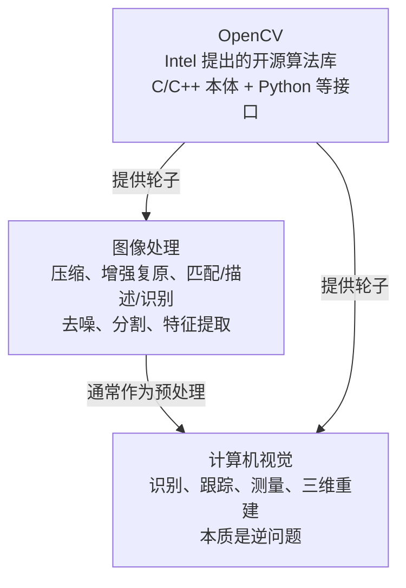
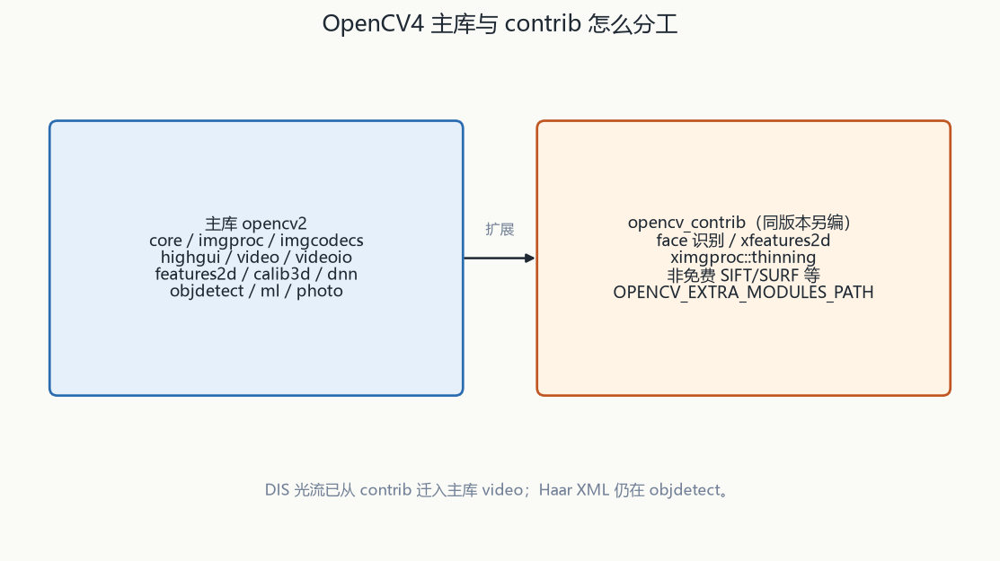
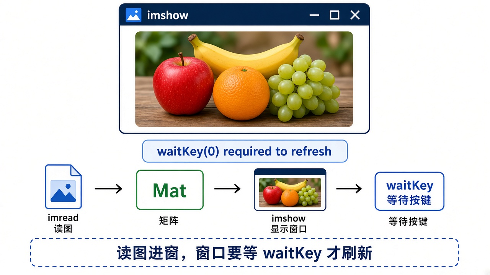

# 第1章 认识 OpenCV4 与环境安装

来源：文档1《OpenCV 4计算机视觉:Python语言实现（原书第3版）》第1章（PDF 16–41）；文档2《opencv4快速入门》第1章（书页 2–26 / PDF 5–29）

## 本章总览

这一章是「先认库、再装库、再摸一手官方示例」。学完应能回答：图像处理和计算机视觉差在哪、OpenCV 4 相对 3 改了什么、主库和 `opencv_contrib` 怎么分工、Python 与 C++ 两条安装路径各自踩什么坑、示例程序该去哪找。

- **文档2侧重**：概念史、OpenCV 4.0/4.1 官方更新清单、Windows Visual Studio 配置、Ubuntu 源码编译、Image Watch、模块目录导览、C++ 官方示例（edge / kmeans / qrcode / video_capture_starter / camshiftdemo）。演示版本以 **OpenCV 4.1** 为主。
- **文档1侧重**：Python 3 + OpenCV 4、pip / 源码 / Homebrew / apt、NumPy/SciPy、可选 OpenNI 2、`samples/python` 试跑、文档站点与 `cv2` 模块名。环境下限：Windows 7 SP1、macOS 10.7、Debian Jessie / Ubuntu 14.04 / Linux Mint 17。

安装步骤只记约束和分叉，不抄逐步点菜单。

## 核心知识点

### 图像处理、计算机视觉与 OpenCV

#### 图像处理通常被看成预处理

【文档2观点】图像处理通常被看成计算机视觉的预处理：对二维数字图像做压缩、增强复原、匹配/描述/识别，涵盖去噪、分割、特征提取。

🔑 关键速记：图像处理先改二维像素，给后面的「看懂」铺路。

#### 计算机视觉是逆问题

计算机视觉是让机器「看」：用摄像头代替人眼做识别、跟踪、测量，再抽出更深信息（三维重建、能否通过前方区域等）。

它是**逆问题**——从观测恢复场景时会丢信息，例如单目图里「人比楼还高」。

🔑 关键速记：视觉要从不完整观测反推场景，信息一定会丢。

#### OpenCV 是什么

OpenCV（Open Source Computer Vision Library）由 Intel 提出，把通用算法收成「轮子」，避免每人重写基础程序。

本体是 C 函数 + C++ 类，另有 Python、MATLAB、Java 等接口，可在 Linux / Windows / macOS / Android / iOS 上跑。

【文档1观点】OpenCV 是免费库，用来操作图像和视频：从显示网络摄像头帧，到教机器人认真实物体。本书用 Python 绑定；并强调要装 **opencv_contrib**（社区维护的附加模块，不是核心团队主库）。

🔑 关键速记：OpenCV 是跨语言开源视觉库；文档1还强调另装 contrib。

#### 三大起步目标

文档2转述 Intel 创建时的说法：

1. 为基本视觉应用提供开放且优化过的源码。
2. 用一套通用架构传播视觉知识，让人站在上面继续做。
3. **不要求**商业产品继续开源。

🔑 关键速记：开源优化源码、共用架构、商业产品不必再开源。

🔑 关键速记：处理改像素，视觉从图里读意思，OpenCV 把两者收成轮子。

### 版本节点与 OpenCV 4 新内容

#### 版本年表

文档2表 1-1（OCR 个别年份可能糊，以书中能辨认者为准）：1999 alpha；2000 年 12 月 Linux beta 1；2006 的 1.0（偏 C，易内存泄漏）；2009 的 2.0（C++ 接口、更安全）；2014-08 的 3.0；**2018-11 的 4.0.0**、**2019-04 的 4.1.0**。

文档2后续简称 OpenCV 4.0 / 4.1。

🔑 关键速记：4.0.0 在 2018-11，4.1.0 在 2019-04；1.0 偏 C，2.0 起走 C++。

#### 4.x 新特性对照

两书对 4.x 新特性高度重合，可并成一张表。下表只记「相对 3.x 改了什么」，算法细节见后文各章。

| 变化 | 说明 | 来源 |
|---|---|---|
| C++11 | 4.0 用 C++11 标准；CMake 至少 **3.5.1**（文档2）；Python 绑定包着 C++ 实现，Python 用户也能吃到部分性能（文档1） | 两书 |
| 删旧 C API | 去掉 OpenCV 1.x 大量 C API；core 里 Persistence（XML/YAML/JSON）改用 C++ 重写 | 文档2；文档1写「移除已弃用的 C 实现及其 Python 绑定」 |
| G-API | 基于图的高效图像处理流水线。文档1写明：**Python 绑定当时还不支持** | 两书 |
| DNN | 更多模型；实验 Vulkan 后端；支持 **ONNX**；正向传递（测试）为主，原则上不支持反向训练（文档2） | 两书 |
| 二维码 | `objdetect` 增加检测器与解码器 | 两书 |
| DIS 光流 | 稠密光流 DIS 从 contrib 迁到 **video** 模块 | 两书 |
| KinectFusion | 用 Kinect 2 做三维重建；文档2称已针对 CPU/GPU 优化 | 两书 |
| 级联训练工具 | 文档1：移除训练 Haar / LBP 级联（自定义物体）的工具，有人提议以后再实现 | 仅文档1 |
| OpenNI 1 | 文档1：4.x **放弃 OpenNI 1** 及 Sensor-Kinect，老 Xbox Kinect 可能不再支持 | 仅文档1 |
| 4.1 增量（文档2） | 优化 core/imgproc 部分函数；videoio 加 Android Media NDK；contrib/stereo 密集立体匹配；quality 模块进 contrib；手眼标定；dnn 增加多个 TensorFlow 网络 | 仅文档2 |

骨架一致：C++11、删 C API、G-API、DNN、二维码、DIS、KinectFusion；文档1多写工具移除与 OpenNI 1，文档2多写 4.1 增量。

🔑 关键速记：4.x 砍旧 C、加图流水线与 DNN；二维码进 objdetect，DIS 进 video。

#### 二维码检测与解码

QR 检测在 `objdetect`。`QRCodeDetector` 的 `detect` 给出四个顶点，`decode` 解出字符串，`detectAndDecode` 一次做完。

定位图形黑白比约 1:1:3:1:1。检出后帧率会明显下降（官方示例称未检出约 8 FPS，检出约 1 FPS，详见本章「官方示例导览」）。

👉 完整深度讲解见第7章。

🔑 关键速记：先 `detect` 四顶点，再 `decode` 出字符串；定位图形是 1:1:3:1:1。

#### DIS 稠密光流

第1章写 DIS 稠密光流已从 contrib 迁到 **video**。融合第13章两书只讲 Farneback 与 Lucas-Kanade，没有 DIS 函数原型。

👉 该细节原书未完整抽出，暂不展开，两书跟踪章均未给出。

🔑 关键速记：DIS 已进主库 video，但两书跟踪章都没给出函数原型。

#### DNN / ONNX 加载与推理

加载他人训好的网：`readNet` → `blobFromImage`（缩放/减均值/`swapRB`）→ `setInput` / `forward`。

文档1点名 ONNX；文档2 表12-7 未列 ONNX。正向传递（测试）为主，原则上不支持反向训练，详见本章「4.x 新特性对照」。

👉 完整深度讲解见第15章。

🔑 关键速记：读网、做成 blob、setInput、forward；OpenCV 主做正向测试。

#### Haar 级联人脸检测

预训练 XML + `CascadeClassifier`，`detectMultiScale` 多尺度扫窗。要**正面直立灰度图**。

`scaleFactor` 必须 **>1**，`minNeighbors` 是最少重叠次数。OpenCV 4 已移除训练 Haar / LBP 级联的工具，详见本章「4.x 新特性对照」。

👉 完整深度讲解见第12章。

🔑 关键速记：XML 级联 + 多尺度扫窗；scaleFactor>1，要正面直立灰度图。

### 模块架构（文档2，OpenCV 4.1 头目录）

#### 主库合成一个 opencv2

OpenCV 4 把旧的 `include/opencv` 与 `include/opencv2` **合成一个 `opencv2` 文件夹**。下面按文档2点名的文件夹顺序记通俗理解。

| 模块 | 通俗理解 |
|---|---|
| calib3d | 相机标定、立体视觉、位姿、三维重建 |
| core | 基础结构与基本操作、绘图、数组 |
| dnn | 深度学习：组网、加载序列化模型；本章强调正向测试 |
| features2d | 特征检测、描述、匹配 |
| flann | 高维近似近邻搜索与聚类 |
| gapi | 4.0 新增框架，加速常规图像处理，不是某条具体算法 |
| highgui | 窗口、鼠标、键盘、图形交互 |
| imgcodecs | 图像文件读与存 |
| imgproc | 滤波、几何变换、直方图、特征与目标检测等「改图」主力 |
| ml | 统计分类、回归、聚类 |
| objdetect | 目标检测（如 Haar）、二维码 |
| photo | 修复、去噪 |
| stitching | 拼接流水线 |
| video | 运动估计、背景分离、跟踪 |
| videoio | 视频或图像序列读/写 |

头文件只认 `opencv2`；DNN 正向测试、二维码/Haar 在 objdetect、DIS 在 video，与 4.x 新特性表对得上。

🔑 关键速记：include 只剩 opencv2；改图像走 imgproc，读视频走 videoio，检测走 objdetect。

#### opencv_contrib 与非免费特征

contrib 不在默认主库：人脸识别、生物视觉、部分特征（如专利 SIFT）等。文档2称非商业可免费用专利算法，商业仍需自己查许可。

【文档1观点】contrib 是社区模块；pip 另有「含非免费内容」的包。

两书仍走 `xfeatures2d` + 专利/非免费开关；ORB 免费，描述子配 Hamming。SIFT/SURF 见第6章（融合知识库第9章）。

👉 完整深度讲解见第9章。

🔑 关键速记：SIFT/SURF 在 contrib 非免费开关里；ORB 免费、描述子走 Hamming。

🔑 关键速记：主库一个 opencv2 文件夹，扩展算法同版本另编 contrib。

### 依赖：NumPy、SciPy、OpenNI 2（文档1）

#### 三个库各干什么

下面这张表只回答「Python 侧还要不要另装什么」。

| 库 | 角色 |
|---|---|
| NumPy | Python 绑定的依赖，高效数组 |
| SciPy | OpenCV **不强制**；方便操作图像数据 |
| OpenNI 2 | **可选**，给部分深度相机（如华硕 Xtion PRO）用。全书只贯穿第4章 |

NumPy 是硬依赖；SciPy 和 OpenNI 2 都可以不装，缺深度相机时不要为 OpenNI 去源码硬编。

🔑 关键速记：NumPy 必装，SciPy 可选，OpenNI 2 只为部分深度相机。

#### 深度摄像头与 OpenNI 2

OpenNI 深度多为毫米制 16U；`imshow` 会把 16U ÷256，10 位红外须自己 `>>2`。阳光下结构光/ToF 易失效。

通道用 `CAP_OPENNI_*`。4.x 已放弃 OpenNI 1 及 Sensor-Kinect，详见本章「4.x 新特性对照」。

👉 完整深度讲解见第10章。

🔑 关键速记：深度常是毫米 16U，imshow 会除 256；阳光下结构光/ToF 易失效。

🔑 关键速记：Python 绑定靠 NumPy；深度相机才考虑可选的 OpenNI 2。

### 安装路径怎么选（只记分叉，不抄向导）

#### 文档1：Python 总原则

推荐用 `pip`；多项目、依赖冲突时用 `venv`。

🔑 关键速记：Python 优先 pip；冲突就 venv。

#### Windows（Python）

先装 Python 3.8（可用 64 位）；`pip` 装 NumPy/SciPy；现成包 `pip` 装 OpenCV（含 contrib），或再选含非免费算法的包。

要深度相机：**不要**装 pip 包，改 CMake + Visual Studio 2015+ 从源码编，并装 OpenNI 2。编 Python 绑定要用 **Release** 不是 Debug。

装完删掉 `site-packages` 里冲突的 `cv2.pyd` / `opencv_*.dll`，再编 INSTALL，把 `install\x64\vc15\bin` 加进 Path。

🔑 关键速记：普通用 pip；深度相机必须源码 Release 编，并清掉冲突的 cv2.pyd。

#### macOS（Python）

不要用系统自带 Python。先装 Xcode 命令行工具，再用 Homebrew。

当时 MacPorts **没有** OpenCV 4 / OpenNI 2 包。Homebrew 总是带 contrib 和非免费 SIFT/SURF；**不提供** OpenNI 2 选项。

🔑 关键速记：Mac 走 Homebrew，自带 contrib/非免费，但不提供 OpenNI 2。

#### Debian / Ubuntu / Mint 与其他类 UNIX

apt 当时还没到 OpenCV 4，可用 pip（无深度相机）或源码。Ubuntu 14.04 / Mint 17 上普通 `cmake` 包可能是 CMake 2，要用 cmake 3 包。

源码需要 Python 3 开发头、常需 V4L；代理时设 `http_proxy` / `https_proxy`。其他类 UNIX：先查包版本是否为 4.x、有无 Python 绑定和 OpenNI 2。

🔑 关键速记：旧发行版 apt 不够 4.x；源码要 CMake 3 和 Python 开发头。

#### 文档2：Windows C++（OpenCV 4.1）

书称 4.1 **当时只支持 VS 2015 和 2017**（虽已有 VS 2019）。作者用 VS 2015。SDK 是自解压 `opencv-4.1.0-vc14_vc15.exe`，得到 `build` 与 `sources`。

包含目录只剩两个：`build\include` 与 `build\include\opencv2`（取消旧 `\include\opencv`）。库目录按 IDE 选 `x64\vc14\lib`（VS2015）或 `vc15`（VS2017），选错会不兼容。

链接器大幅简化：Debug 用 `opencv_world410d.lib`，Release 用无 `d` 的 `opencv_world410.lib`。Path 加对应 `bin`，建议改**系统变量**并用分号拼接旧路径。改完需重启 VS 才能加载头文件。

验证：`#include <opencv2/opencv.hpp>`，`imread` + `imshow` + `waitKey(0)`。

🔑 关键速记：include 只剩 opencv2，一个 world lib，vc14/vc15 必须对齐 VS。

#### Image Watch

VS 插件，调试时可看 `Mat` 的类型、通道、尺寸，滚轮到像素，坐标形式为 **(列, 行)**。

🔑 关键速记：Image Watch 坐标是 (列, 行)，和 at(y,x) 容易反。

#### Ubuntu 源码（C++）

依赖 CMake ≥ 3.5.1；常用编解码/GTK/JPEG/PNG 等可缺，缺了只影响对应功能。Python 绑定要装 `python2.7-dev` / `python3.5-dev`。CMake 必须声明 **C++11**。

环境：`ld.so.conf` 加安装库路径、`PKG_CONFIG_PATH`、`ldconfig`。

🔑 关键速记：Ubuntu 编 4.x 要 CMake≥3.5.1 且声明 C++11。

#### 同版本 contrib 与下载缓存

contrib：GitHub 上取**同版本**包。Windows 用 CMake 勾 `BUILD_opencv_world`、`OPENCV_ENABLE_NONFREE`，填 `OPENCV_EXTRA_MODULES_PATH` 指向 contrib 的 `modules`。Ubuntu 在 cmake 命令加同一路径。

编译时若 `ippicv.zip`、`face_landmark_model.dat` 下载失败：可从 `CMakeDownloadLog.txt` 抄地址浏览器下，放到 `sources/.cache` 对应子目录，文件名须为 **MD5+原名**，否则会重新下。`.cache` 是隐藏文件夹。

文档2逐步点 VS 菜单、DOS 调 exe 的操作不写入笔记。

🔑 关键速记：contrib 必须同版本；缓存文件名是 MD5+原名。

🔑 关键速记：Python 走 pip/venv，C++ 走 world 一个 lib；深度相机才离开现成包。

### 官方示例导览（只认路，算法留后文）

#### Python 示例（文档1）

源码 `samples/python`。无参可试：`hist.py`（按 A–E 看直方图变化）、`opt_flow.py`（光流叠加，按 1/2 切换）。

退出按 **Esc**，不是窗口关闭按钮。`ImportError: No module named cv2`：安装失败，或跑错了 Python（macOS 自制 Python vs 系统 Python）；可删脚本 shebang 再试。

🔑 关键速记：Python 示例在 samples/python；退出按 Esc，cv2 导入失败先查装没装对解释器。

#### C++ 示例（文档2）

C++ 示例在 `samples/cpp`。多数有 `help()` 说明参数；缺参会直接起不来。本书点了五个，下表只认路。

| 示例 | 本章只记什么 | 算法正文在 |
|---|---|---|
| `edge.cpp` | Canny；默认可吃 `fruits.jpg`；界面有 Sobel / Scharr + 滑动条 | 第4章 |
| `kmeans.cpp` | 伪随机点聚类，空格再来一轮，Q 退出 | 第14章 |
| `qrcode.cpp` | `-i` + 图路径，否则摄像头；书称未检出约 8 FPS，检出约 1 FPS | 第7章 |
| `video_capture_starter.cpp` | 设备号 / 视频文件 / `prefix%02d.jpg` 图像序列 | 第2章（I/O） |
| `camshiftdemo.cpp` | 默认相机 0；鼠标框颜色鲜明区域跟踪 | 第13章 |

五个示例只用来验安装；Canny、K 均值、QR、VideoCapture、CamShift 都不要在本章展开算法。

> ✅已回填：【Canny / Sobel / Scharr】见第4章（Sobel/Scharr/Laplacian/Canny 原型与双阈值 2:1～3:1）

QR 检测与帧率：详见本章「二维码检测与解码」。SIFT / SURF 与非免费：详见本章「opencv_contrib 与非免费特征」。

🔑 关键速记：C++ 示例在 samples/cpp，缺参起不来；五个 demo 只认路。

#### K 均值聚类

文档2 `cv::kmeans` 可聚点或像素；文档1 `BOWKMeansTrainer` 是把描述子聚成视觉词，**不是同一 API**。

官方示例 `kmeans.cpp` 是伪随机点聚类，空格再来一轮，Q 退出。

👉 完整深度讲解见第14章。

🔑 关键速记：cv::kmeans 聚点/像素，BOWKMeansTrainer 聚视觉词，不是同一个函数。

#### VideoCapture 读相机与视频

`VideoCapture` 吃文件名、设备号或 `prefix%02d.jpg` 序列。用 `isOpened`/`read`。

相机 FPS 的 `get` 经常返回 0。

👉 完整深度讲解见第2章。

🔑 关键速记：Capture 吃文件、设备号或图像序列；相机 FPS 的 get 常为 0。

#### CamShift 跟踪

颜色直方图反投影后，`CamShift` 会改窗口尺寸并返回 `RotatedRect`；`meanShift` 不改尺寸。

官方示例默认相机 0，鼠标框颜色鲜明区域跟踪。

👉 完整深度讲解见第13章。

🔑 关键速记：CamShift 能改窗口大小并给出 RotatedRect，meanShift 不会。

🔑 关键速记：示例只验安装和认路，算法全部留到后文专章。

### 文档与模块名（文档1）

#### 查文档时看 Python 标题

文档：http://docs.opencv.org/（可下载离线）。查函数时看 **Python** 标题。

论坛：answers.opencv.org；作者站点 nummist.com/opencv；源码 github.com/opencv/opencv。

🔑 关键速记：官方文档站点可离线；查绑定时看 Python 标题。

#### 模块名永远是 cv2

Python 模块名永远是 **`cv2`**。这个 2 与 OpenCV 4 的版本号无关。

历史上 `cv` 包过时 C API，4.x 已无 `cv`；官方文档有时仍误写成 `cv`。

🔑 关键速记：import 永远写 cv2，不要被文档里的 cv 带偏。

本章几乎不给算法函数原型（验证安装用的 `imread`/`imshow`/`waitKey` 也不展开参数）。下表只当「装没装上」的探针。

| 名称 | 功能 | 主要参数 | 约束&坑点 |
|---|---|---|---|
| （验证用）`imread` / `imshow` / `waitKey` | 读图、弹窗、等按键 | 文档2测试例：路径、窗口名、`waitKey(0)` | 完整 flags/深度缩放见第2章；本章只当「装没装上」的探针 |

三个函数能弹出图，只能说明头文件、库和 Path 通了，不代表 flags 已经会用。

🔑 关键速记：本章不记算法原型；imread/imshow/waitKey 只当安装探针。

## 易混淆点&差异对比

### 语言栈不要合成一条万能命令

文档1 是 pip/venv 的 Python；文档2 是 VS + `opencv_world410[d].lib` 的 C++。

笔记后文算子会并列两种调用习惯，不混装一条「万能命令」。

🔑 关键速记：Python 与 C++ 两条安装路径分开记，不要合成一条命令。

### 4.x 新特性两边多写了什么

骨架一致（C++11、删 C API、G-API、DNN、二维码、DIS、KinectFusion）。

文档1多写「级联训练工具被拿掉」「OpenNI 1 废弃」「G-API 无 Python」。文档2多写 4.1 的 Android NDK、手眼标定、quality、stereo contrib。

🔑 关键速记：公共骨架一样；文档1补废弃项，文档2补 4.1 增量。

### contrib / 非免费与 VS 版本

两边都说 SIFT 等在扩展或非免费包里。文档2写非商业可免费用；文档1写发布软件前自己查专利。

文档1源码构建写 VS 2019；文档2写 4.1 **当时**只认 2015/2017。以各自成书时的声明为准，不要合成「永远只能用 2015」。

🔑 关键速记：专利要自己查；VS 版本以各书成书声明为准，不要合并成永远 2015。

### 示例目录与 Image Watch 坐标

Python 在 `samples/python`，C++ 在 `samples/cpp`。文档2 OCR 有一处写成 `smaples`，以 `samples` 为准。

Image Watch 坐标 **(列, 行)**：和后面 `at(y,x)` 的行列习惯容易反，记在 GUI/像素章再对照。

🔑 关键速记：目录是 samples 不是 smaples；Watch 坐标列在前。

## 本章要点总结

OpenCV 是把「改像素」和「从图里读意思」打包的开源库；4.x 砍旧 C API、加 DNN/二维码/G-API，实验能力继续放 contrib。

装库先选语言：Python 走 pip 或带 contrib 的源码，深度相机才上 OpenNI 2；C++ 在 Windows 上记住 include 只剩 opencv2、world 一个 lib、vc14/vc15 对齐。

示例只用来验安装和认路，Canny、K 均值、QR、CamShift 都留到后面专章。Python 里模块名写 `cv2`，不要被文档里的 `cv` 带偏。

🔑 关键速记：先认模块再选语言装库，示例只探路，算法全部后移。
