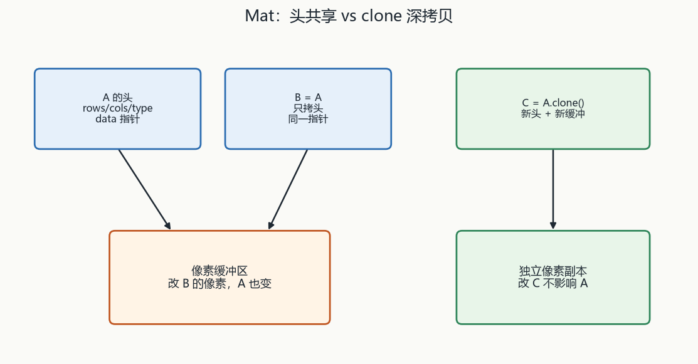
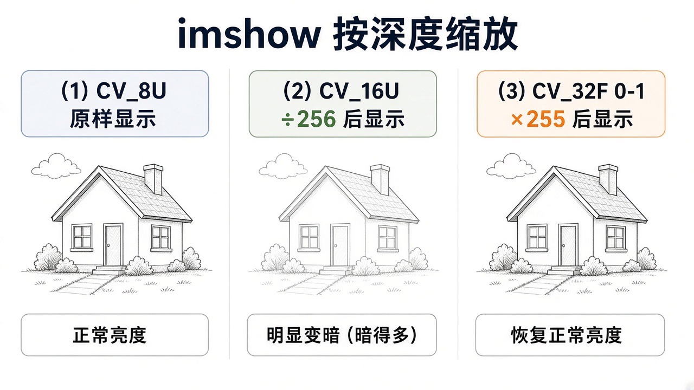

# 第2章 图像容器、文件 I/O、摄像头与 GUI

来源：文档1《OpenCV 4计算机视觉:Python语言实现》第2章（PDF 42–85）；文档2《opencv4快速入门》第2章（书页 27–53 / PDF 30–56）及第3章 3.7 窗口交互（书页 104–109 / PDF 107–112）

## 本章总览

图像进程序、在窗口里给人看、再存回去——这是后面所有算法共用的外壳。学完应能回答：`Mat`/NumPy 数组怎么存、浅拷贝和深拷贝差在哪、读图 flags 怎么选、窗口为什么必须配 `waitKey`、视频编解码怎么填、XML/YAML 怎么当小数据库。

- **文档2侧重**：C++ `Mat` 构造/运算/四种读元素、`imread`/`namedWindow`/`imshow`、`VideoCapture`/`VideoWriter`、`FileStorage`（XML/YAML，目录写作 YMAL）、滑动条与鼠标。
- **文档1侧重**：Python `cv2` + NumPy、原始字节互转、摄像头 `get` 不可靠、鼠标事件枚举、Cameo 的 `CaptureManager`/`WindowManager` 外壳。

> ✅已回填：【绘图 line/circle 等】见第3章（circle/line/ellipse/rectangle/fillPoly/putText）
> ✅已回填：【滤波】见第4章（filter2D/blur/GaussianBlur/medianBlur/双边与 Sobel/Canny）
> ✅已回填：【颜色转换】见第3章（cvtColor/BGR/HSV/YUV/Lab）

## 核心知识点

### Mat / NumPy：头 + 数据指针

#### Mat 只拷头就共享像素

【文档2观点】OpenCV 1.x 用 `IplImage`，要手动释放，容易漏。2.x 起用 `Mat`：矩阵头（尺寸、存储方式、地址、引用计数）+ 指向像素的指针。

赋值/`Mat(const Mat&)` 只拷头，改像素两边一起变；引用计数到 0 才释放。独立副本用 `clone()`。

🔑 关键速记：赋值和拷贝构造只拷头；要独立像素必须 clone。

#### 类型写法与行列顺序

类型写成 `CV_[位数][U/S/F]C[通道]`，如 `CV_8UC3`。单通道可省略 `C1`。

`Size(cols, rows)` 与 `Mat(rows, cols, type)` **行列顺序相反**。`uchar` 不能直接当 `Mat` 的 type。

🔑 关键速记：Size 是列先行，Mat 构造是行先列；uchar 不能当 type。

#### 常用构造与运算

常用构造/赋值：默认构造后 `imread`；`Mat(rows,cols,type,Scalar)`（每像素同一颜色，`Scalar` 个数多于通道则多的丢掉，少于则补 0）；逗号枚举；循环 `at`；`eye`/`ones`/`zeros`/`diag`；用数组填充（元素不够填一个很大的填充值，书给 `1.0737418e+08`）。

运算：与常数四则；两 `Mat` 加减须同类型。矩阵乘 `*` 要求列=行，且类型限于 `CV_32FC1/64FC1/32FC2/64FC2`。

`dot` 把两边展成向量得点积（`double`）。`mul` 对应位相乘，`CV_8U` 易饱和成 255。

🔑 关键速记：两 Mat 加减要同类型；矩阵乘只认那四种浮点，mul 在 8U 会饱和。

#### 四种读元素与属性

读元素：`at<T>(行,列)` 类型必须对，多通道用 `Vec3b` 等（数字=通道，后缀 b/s/w/d/f/i）；`ptr<uchar>(行)[列*通道+…]`；迭代器 `begin`/`end`；地址 `data + step[0]*row + step[1]*col + channel`。

属性：`cols`/`rows`/`step`/`elemSize()`/`total()`/`channels()`。

🔑 关键速记：at 是 (行,列) 且类型必须对；还有 ptr、迭代器、按 step 算地址三条路。

#### Python 里图像就是 NumPy 数组

【文档1观点】Python 里图像就是 `numpy.array`。索引 `[y, x]` 或 `[y, x, c]`，y=0 在顶、x=0 在左、c 为 B/G/R。

`item`/`itemset` 改单点比切片慢，大区域用切片或 OpenCV 函数。`shape`：灰度长度 2，彩色长度 3（高、宽、通道）；`size` 是元素个数（BGR 是像素×3）；`dtype` 常为 `uint8`。ROI 两块赋值须同形状。

默认 `imread` 出 BGR，即使文件是灰度。HSV 色调范围书称 0–180。

> ✅已回填：【颜色空间与 cvtColor】见第3章

🔑 关键速记：Python 用 [y,x,c]，shape 灰度长度 2、彩色长度 3；默认读出来是 BGR。

🔑 关键速记：Mat/NumPy 都是头加指针；拷头共享像素，clone 才独立。

### 读图、窗口、显示

#### 读、写、建窗、显示、等键

下表把「图怎么进、怎么给人看、怎么存回去」收在一起，flags 细节紧跟其后。

| 名称 | 功能 | 主要参数 | 约束&坑点 |
|---|---|---|---|
| `imread(filename, flags=IMREAD_COLOR)` | 读进 `Mat` | flags 见表 | 失败返回空；看 `empty()`/`data`。类型看文件内容不看扩展名。默认像素数 < 2^30，超大图改系统变量 `OPENCV_IO_MAX_IMAGE_PIXELS`（文档2）。BMP/DIB 各系统都能读；Win/mac 默认可 JPEG/PNG/TIFF；Linux 需自装编解码器 |
| `imwrite(filename, img, params=[])` | 存盘 | JPEG 质量 0–100 默认 95；PNG 压缩 0–9，文档2写默认 1（最快） | 一般 8 位 1/3 通道；16U 可 PNG/JPEG/TIFF；32F 可 PFM/TIFF/OpenEXR/HDR；Alpha 用 PNG。成功返回 true |
| `namedWindow(winname, flags)` | 建窗 | 默认 `WINDOW_AUTOSIZE`；另有 NORMAL、OPENGL、全屏、KEEP_RATIO 等 | 同名已存在则空操作。4.0 结束不关窗可能报错，4.1 不报（文档2） |
| `imshow(winname, mat)` | 显示 | 无窗则按 AUTOSIZE 建 | 8U 原样；16U/32S ÷256；32F/64F ×255（当数据在 0–1） |
| `waitKey(delay=0)` | 抽事件队列、等键 | 0=无限等；返回 -1 或 ASCII（Esc=27） | **窗口只在 waitKey 时才真正刷新**；waitKey 只在 OpenCV 窗有焦点时收键（文档1） |
| `destroyWindow` / `destroyAllWindows` | 关窗 | 窗口名 / 全部 | 简单程序退出也会释放，但文档2建议主动关 |

读失败先查空图；显示前先认深度缩放；没有 waitKey 窗口等于没画出来。

🔑 关键速记：读失败看 empty；imshow 会按深度缩放；窗口只在 waitKey 时刷新。

#### imread 的 flags

`imread` flags（两书可并）：`UNCHANGED` 留 Alpha；`GRAYSCALE`=0；`COLOR` 三通道 BGR；`ANYDEPTH`=2 保 16/32 位；`ANYCOLOR`=4；缩小 1/2、1/4、1/8 的 GRAY/COLOR；文档2另有 `LOAD_GDAL`、`IGNORE_ORIENTATION`。

不冲突可用 `|` 组合。文档2：编解码器内部转灰度，可能和程序里 `cvtColor` 结果不一致。

路径相对**工作目录**，不是脚本文件所在目录（文档1）。

🔑 关键速记：flags 可按位或；路径相对工作目录；解码器转灰可能和 cvtColor 不一致。

🔑 关键速记：读图认 flags 和空图，显示认深度缩放，刷新必须 waitKey。

### 视频与摄像头

#### VideoCapture 吃什么

`VideoCapture`：文件名 / 图像序列 `prefix%02d.jpg` / 设备号从 0。用 `isOpened()`；取帧 `>>` 或 `read`；播完再取则 `Mat` 变空。

`get` 常用：宽=3、高=4、FPS=5、FOURCC=6、帧数=7；相机还有亮度/对比度等。

🔑 关键速记：Capture 吃文件、序列或设备号；isOpened 后再 read，播完 Mat 变空。

#### 相机 get 经常不可靠

【文档1观点】相机 `CAP_PROP_FRAME_WIDTH/HEIGHT` 可能不准，先抓一帧用 `frame.shape[:2]`。开始可能有坏帧，可丢掉几帧。

FPS 的 `get` **经常返回 0**。无效索引则 `read` 得 `(False, None)`。多相机同步用 `grab` + `retrieve`，不要各 `read` 一次。OpenCV **不能查询**系统有几台相机。

🔑 关键速记：宽高和 FPS 别全信 get；多相机用 grab+retrieve；查不到相机台数。

#### VideoWriter

`VideoWriter(filename, fourcc, fps, frameSize, isColor=true)`：尺寸必须与帧一致。`isOpened()`。写用 `<<` 或 `write`，最后 `release()`。

文档2：4.0 用 `CV_FOURCC`，4.1 用 `VideoWriter::fourcc`。文档1列出 I420/PIM1/XVID/MP4V/X264/THEO/FLV1 等与扩展名配对。

🔑 关键速记：Writer 的帧尺寸必须一致；4.0/4.1 的 fourcc 写法不同。

🔑 关键速记：视频当帧序列；相机属性以实际抓到的帧为准。

### FileStorage：XML / YAML

#### 当小数据库用

文档2目录写作 YMAL，正文也写 YAML/`.yaml`/`.yml`。`FileStorage(filename, flags, encoding="")`：`READ`/`WRITE`（覆盖）/`APPEND`/`MEMORY`。

不支持 UTF-16 XML。`isOpened()`。写入 `<< "name" << value` 或 `write`；序列用 `[]`，映射用 `{}`。

读 `fs["x"] >> x`；多值用 `FileNode` / `FileNodeIterator` 或 `node[0]`、`node["子名"]`。用完 `release()`。

🔑 关键速记：XML/YAML 当键值库；WRITE 会覆盖，不支持 UTF-16 XML。

🔑 关键速记：目录里的 YMAL 是拼写风险，正文以 yaml/yml 为准。

### 滑动条与鼠标（文档2 3.7 + 文档1 2.2.7）

#### 滑条与鼠标回调

下表只记「窗上怎么收整数、怎么收鼠标」，事件枚举跟在后面。

| 名称 | 功能 | 主要参数 | 约束&坑点 |
|---|---|---|---|
| `createTrackbar(name, winname, value*, count, onChange=0, userdata=0)` | 窗上整数滑条 | 范围 0–count；回调 `void Foo(int, void*)` | 只要小数就自己除 10/100。`value` 既是初值也是当前位置 |
| `setMouseCallback(winname, onMouse, userdata=0)` | 鼠标 | 回调五参：event, x, y, flags, userdata | x,y 是图像坐标。点画轨迹会断，两点间 `line` 更连 |

滑条只给整数；鼠标给的是图像坐标，不是窗口装饰条上的位置。

🔑 关键速记：滑条范围 0–count 且只有整数；鼠标 x,y 是图像坐标。

#### 鼠标事件与 flags

事件：MOVE、左/右/中键 DOWN/UP/DBLCLK。文档2另有滚轮 `MOUSEWHEEL`/`MOUSEHWHEEL`。flags 按位：左/右/中拖、Ctrl/Shift/Alt。

文档1：关窗按钮**不能**停程序；GUI 弱，Cameo 用抽象层方便以后换框架。

🔑 关键速记：事件含滚轮；关窗按钮停不了程序。

🔑 关键速记：GUI 只提供整数滑条和鼠标回调，关窗不等于退出。

### Cameo 外壳（文档1，本章只到 I/O）

#### 由外向内的进出水管

由外向内：先把「从哪进、到哪出」做成可替换接口，算法以后再塞进每一帧。

- `CaptureManager`：包 `VideoCapture`；主循环 `enterFrame` / `exitFrame`；中间改 `frame`。截图/录像请求推迟到 `exitFrame` 才写。相机 FPS 用计数器 + `time.time` 估。`shouldMirrorPreview=True` 时预览镜像，**文件不镜像**。
- `WindowManager`：面向对象的建窗/显图/`processEvents`；`keypressCallback(键码)`。
- `Cameo`：空格截图、Tab 开关录像、Esc 退出。

滤波、换脸本章不写算法细节。

🔑 关键速记：enterFrame/exitFrame 夹一帧；预览可镜像，存盘不镜像；空格截图、Tab 录像、Esc 退出。

#### Cameo 换脸与深度

换脸：Haar 框出人脸后，用深度中位数掩模而不是整块矩形，再 `copyRect`/`swapRects`。

深度单位与阳光失效见第10章（毫米制 16U、`imshow` 除 256、阳光下结构光/ToF 易失效，详见第1章「深度摄像头与 OpenNI 2」）。

👉 完整深度讲解见第12章、第10章。

🔑 关键速记：换脸用深度中位数掩模，不要整块矩形拷贝。

🔑 关键速记：Cameo 本章只搭进出水管，滤镜和人脸还没接上。

## 易混淆点&差异对比

### BGR 不是 RGB

文档1写默认 BGR、字节反序；和深度学习框架常要再转。

🔑 关键速记：文件和摄像头默认 BGR，不是 RGB。

### itemset 的 (x,y) vs at(行,列)

文档1 `item` 参数顺序写成 x、y、通道；文档2 `at` 是 (行, 列)。NumPy 切片是 `[y,x]`。不要混。

🔑 关键速记：item 写成 x,y；at 是行,列；NumPy 是 [y,x]。

### waitKey 两书说法不同但结论一样

没有它窗口可能闪一下就没（文档2）；没有它窗口根本不刷新（文档1）。

🔑 关键速记：没有 waitKey，窗口等于没画出来。

### YAML 拼写与 PNG 压缩默认

文档2目录 YMAL，扩展名 `.ymal` 是 OCR/笔误风险，正文同时出现 `.yaml`/`.yml`。

world 一个 lib vs Python cv2：装法不同，I/O 语义同一套。`imwrite` PNG 压缩默认：文档2写默认 1；OpenCV3 旧笔记里常见默认 3——本章以文档2为准，标差异不脑补现行官方默认。

🔑 关键速记：YAML 别写成 YMAL；PNG 压缩默认以文档2 的 1 为准。

## 本章要点总结

`Mat`/NumPy 是引用计数数组：拷头共享像素，独立数据用 `clone`。读图认 flags 和空图检查；显示认深度缩放和 `waitKey`。

视频当帧序列，相机属性别全信 `get`。小数据用 `FileStorage`。Cameo 只搭好进出水管，滤镜和人脸还没接上。

🔑 关键速记：拷头共享、读图查空、显示配 waitKey、相机 get 不可靠。
