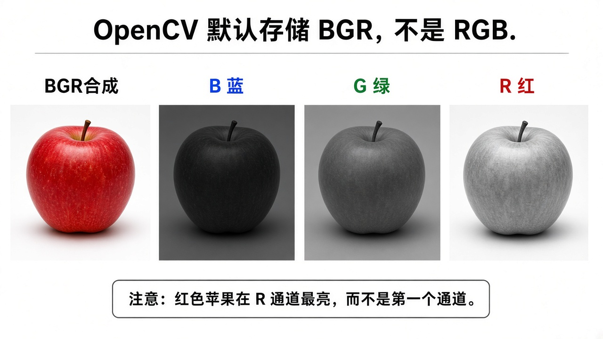
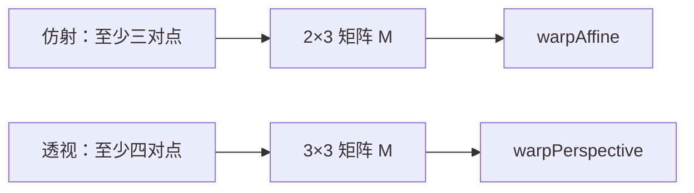
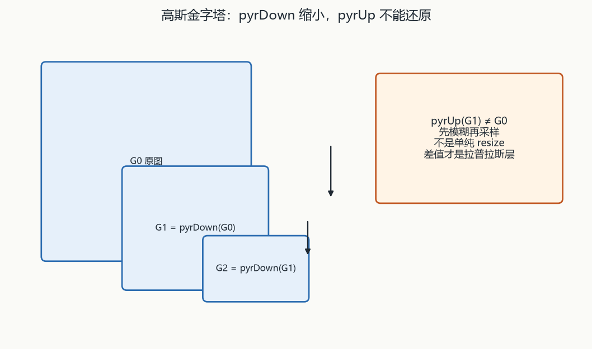

# 第3章 图像基本操作

来源：文档1《OpenCV 4计算机视觉:Python语言实现（原书第3版）》第3章开篇+3.2 颜色模型（PDF 86–89，至 3.3 傅里叶变换前止）；文档2《opencv4快速入门》第3章 3.1–3.6（书页 54–103 / PDF 57–106；3.6.2 的 `pyrUp` 落在 PDF 107 页缝，按节收录）。**不读 3.7 窗口交互**（已在融合第2章）。

## 本章总览

拿到图之后先改颜色、改像素、改几何、再画标注、再切 ROI。学完应能回答：BGR 和 HSV/YUV/Lab 差在哪、`cvtColor` 非线性转换为什么要先缩到 0–1、通道怎么拆怎么并、统计/比较/位运算吃什么输入、二值化五种比较加两种自动阈值、LUT 输出类型跟谁走、缩放插值怎么选、仿射三点与透视四点差在哪、ROI 浅拷贝会不会改原图、高斯金字塔下采样不是 `resize`。

- **文档2侧重**：C++ 算子原型、参数表、公式、约束。本章几乎全部 API 来自文档2。
- **文档1侧重**：灰度 / BGR / HSV 三种常用中间模型，以及「光是加法、颜料是减法」。**未给出 `cvtColor` 原型**。章首把傅里叶、HPF/LPF、Canny、轮廓列为后续主题。

属于后续章，本章不展开。下表把文档1章首点到、但不在本章正文的主题指到融合后的位置。

| 主题 | 文档1出现位置 | 归入 |
|---|---|---|
| 傅里叶变换、DFT、`numpy.fft.fft2`、幅度谱 | 3.3 起（PDF 90） | 融合第8章 |
| HPF / LPF、核、`filter2D` / `sepFilter2D`、高斯模糊 | 3.3 后半～3.6 | 融合第4章 |
| Laplacian / Sobel / Scharr / Canny、`medianBlur`/`blur`/`GaussianBlur` | 3.5 | 融合第4章 |
| 轮廓、线、圆、几何形状 | 章首与后文 | 融合第7章 |
| 窗口滑动条、鼠标 | 文档2 3.7 | 已在第2章 |
| 形态学 | 无 | 融合第5章 |

金字塔只讲结构，分割/修复在第8章。Cameo 的 `filters.py` 封装见第4章。

> ✅已回填：【直方图与模板匹配】见第6章（calcHist/normalize/compareHist/equalizeHist/自写匹配/calcBackProject/matchTemplate；MeanShift 在第13章）
> ✅已回填：【滤波核与边缘】见第4章（HPF/LPF、filter2D/sepFilter2D、线性/非线性滤波、Sobel/Scharr/Laplacian/Canny）

## 核心知识点

### 颜色模型

#### 三种常用中间模型（文档1）

【文档1观点】输入输出设备各有颜色模型；计算机视觉中间处理常用三种：

- **灰度**：丢掉色度只留亮度。人脸检测等「只要亮度」的中间步骤常用。每像素通常一个 8 位值，0 黑～255 白。
- **BGR**：每像素蓝/绿/红三通道。Web/图形界更熟 RGB（通道反序）。8 位三元组：`[0,0,0]` 黑、`[255,0,0]` 蓝、`[0,255,0]` 绿、`[0,0,255]` 红、`[255,255,255]` 白。
- **HSV**：色调（hue，颜色基调）、饱和度（saturation，颜色强度）、值（value，亮度）。

默认：OpenCV 从文件或摄像头拿到的图按 **BGR、每通道 8 位**。加法模型（光）与减色模型（颜料）不同：BGR `(0,255,255)` 是黄，不是颜料里绿+红得到的棕。

🔑 关键速记：中间处理常用灰、BGR、HSV；文件和摄像头默认 BGR 8 位。

#### YUV、Lab、GRAY（文档2）

【文档2观点】常见可互转模型：RGB/BGR、YUV、HSV、Lab、GRAY。OpenCV 存储顺序是 **B、G、R**，不是名字里的 RGB；另有通道反序格式，颜色空间仍相同。

8UC3 每通道 0–255。第四通道为透明度时称 RGBA，无透明度需求则退回 RGB。

YUV（电视兼容编码）：Y 亮度（黑白机只吃 Y），U=红与亮度差，V=蓝与亮度差。文档2 式(3-1)，RGB 均 0–255：

- `Y = 0.299R + 0.587G + 0.114B`
- `U = -0.147R - 0.289G + 0.436B`
- `V = 0.615R - 0.515G - 0.100B`
- `R = Y + 1.14V`；`G = Y - 0.39U - 0.58V`；`B = Y + 2.03U`

HSV：H 色度（红/蓝等）、S 纯度（0–100%，越低越灰暗）、V 明亮程度（0 到机器允许最大值）。空间用锥形。比 RGB 更接近「颜色、深浅、亮暗」的感知。

Lab：设备无关、偏生理。L 亮度；a、b 取值区间书写作 **128–127**【信息缺口：按常规应为 −128～127，OCR 可能丢了负号】；a 从小到大绿→红，b 从小到大蓝→黄。空间为球形。

GRAY：单通道。8UC1 中 255 为白。RGB→灰文档2 式(3-2)：`GRAY = 0.3R + 0.59G + 0.11B`（与 YUV 的 Y 系数不完全相同）。

🔑 关键速记：存储是 BGR；YUV 的 Y 和 GRAY 公式系数不完全相同；Lab 的 a/b 书印 128–127。

#### 两书对颜色模型写到哪一步

下表对照文档1只讲概念、文档2给出公式与 API 的差别，避免合成「两边都有同一张官方表」。

| 点 | 文档1 | 文档2 |
|---|---|---|
| 本章是否给转换 API | 只讲三种模型概念，无 `cvtColor` | 完整 `cvtColor`/`convertTo` 原型与标志表 |
| HSV 的 S/V 含义 | S=强度，V=亮度；本章无数值范围（第2章曾写色调 0–180） | S=纯度 0–100%；V=明亮程度 0～允许最大值 |
| 灰度用途 | 明确点名人脸检测等中间处理 | 强调省容量、易采集传输 |
| 加法/减法 | 专节「光不是绘画颜料」 | 未展开颜料类比 |
| YUV/Lab | 本章未讲 | 有公式/几何 |

文档1贡献三种模型和加色/减色；文档2贡献 YUV/Lab 公式以及后面的 `cvtColor` 表。

🔑 关键速记：文档1无 cvtColor 原型；HSV 色调 0–180 写在第2章，不在文档1本章。

🔑 关键速记：先认 BGR 默认和灰/HSV/YUV/Lab 各自管什么，再谈转换 API。

### 颜色转换 API（文档2）

#### cvtColor 与 convertTo

下表给出颜色互转和深度线性缩放两个入口；非线性转换前必须先把范围归对。

| 名称 | 功能 | 主要参数 | 约束&坑点 |
|---|---|---|---|
| `void cv::cvtColor(InputArray src, OutputArray dst, int code, int dstCn=0)` | 颜色模型互转 | `code` 见表；`dstCn=0` 则由 src 与 code 自动导出通道数 | 取值范围：8U 为 0–255，16U 为 0–65535，32F 为 0–1。线性变换一般不越界；**非线性**须先把 RGB 归到合适范围（如 8U→32F 先 `/255` 到 0–1）。加 alpha 时该通道填该深度最大值（8U=255，16U=65535，32F=1） |
| `void cv::Mat::convertTo(OutputArray m, int rtype, double alpha=1, double beta=0)` | 深度/线性缩放 | 式(3-3)：`m(x,y)=saturate_cast<rtype>(α·src(x,y)+β)` | 既可改类型，也可在同类型里做线性变换。示例：`convertTo(img32, CV_32F, 1.0/255)` |

非线性走 `cvtColor` 前先 `convertTo` 缩到 0–1；加 alpha 时该通道填该深度最大值。

🔑 关键速记：非线性 cvtColor 前 8U 应先缩到 0–1 的 32F。

#### 表 3-1 常用 code

表 3-1 常用 `code`（名称按标准 OpenCV 推断；**简记整数以书表为准**）：

| 标志 | 简记 | 作用 |
|---|---|---|
| `COLOR_BGR2BGRA` | 0 | 给 RGB/BGR 图加 alpha |
| `COLOR_BGR2RGB` | 4 | 通道顺序对调 |
| `COLOR_BGR2GRAY` | 10 | 彩色转灰。【信息缺口：现行枚举常见为 6，书表印 10，可能 OCR/版次差】 |
| `COLOR_GRAY2BGR` | 8 | 灰转彩（伪彩色，三通道同值） |
| `COLOR_BGR2YUV` | 82 | BGR→YUV |
| `COLOR_YUV2BGR` | 84 | YUV→BGR |
| `COLOR_BGR2HSV` | 40 | BGR→HSV |
| `COLOR_HSV2BGR` | 54 | HSV→BGR |
| `COLOR_BGR2Lab` | 44 | BGR→Lab |
| `COLOR_Lab2BGR` | 56 | Lab→BGR |

其余标志书称查官方教程。Lab 含负数，`imshow` 显示不了负值，示例用 Image Watch。示例里有一处 `COLOR_RGB2HSV` 套在 `imread` 的 BGR 图上【坑：通道序写反】。

🔑 关键速记：简记以书表为准；BGR2GRAY 书印 10；Lab 负值不能靠 imshow。

🔑 关键速记：先 convertTo 归范围，再 cvtColor；code 不要把 RGB 和 BGR 写反。

### 通道分离与合并（文档2 3.1.2）

#### split 与 merge

原理：`mv[c](I) = src(I)` 的第 c 通道。合并时通道数 = 各输入通道数之和；输入**不必都是单通道**，但必须同尺寸、同深度。

| 名称 | 功能 | 主要参数 | 约束&坑点 |
|---|---|---|---|
| `void cv::split(const Mat& src, Mat* mvbegin)` | 拆多通道 | `mvbegin` 数组，长度须等于通道数且**预先分配** | 式(3-4) |
| `void cv::split(InputArray m, OutputArrayOfArrays mv)` | 同上 | `mv` 为 `vector<Mat>`，不必预先知道通道数 | 与上一重载原理相同 |
| `void cv::merge(const Mat* mv, size_t count, OutputArray dst)` | 多图并成多通道 | `count>0`；各图同尺寸同类型 | `dst` 尺寸/类型跟 `mv[0]`，通道数为输入通道总和 |
| `void cv::merge(InputArrayOfArrays mv, OutputArray dst)` | 同上，vector 版 | 各图同尺寸同类型 | `imshow` **最多显示 4 通道**；5 通道须 Image Watch |

指针版 split 要预先分配；vector 版不必先知道通道数。示例：把 RGB 的 B/R 置零再 merge，可只留绿色。HSV 的 H/S/V 分开显示。

🔑 关键速记：拆并要同尺寸同深度；imshow 最多 4 通道。

🔑 关键速记：split 拆开改某一通道，merge 按通道数之和拼回去。

### 像素统计（文档2 3.2.1）

#### 点的坐标约定

`Point(x,y)`：原点左上，x 水平=列，y 垂直=行。二维还有 `Point2i`（≡`Point`）、`Point2d`、`Point2f`；三维把 2 改成 3，字段 `x/y/z`。

🔑 关键速记：Point 的 x 是列、y 是行，原点在左上。

#### 最值、均值、标准差

下表三个统计入口：最值必须单通道，均值最多四通道。

| 名称 | 功能 | 主要参数 | 约束&坑点 |
|---|---|---|---|
| `void cv::minMaxLoc(InputArray src, double* minVal, double* maxVal=0, Point* minLoc=0, Point* maxLoc=0, InputArray mask=noArray())` | 单通道最值及位置 | 不需要的指针可 `NULL`；`mask` 限定区域 | **必须单通道**。多通道先 `reshape` 成单通道，或逐通道再比。多个最值时，位置是**按行从左到右第一次出现**。传指针要取地址 |
| `Mat cv::Mat::reshape(int cn, int rows=0) const` | 改通道/行数（不拷数据） | `rows=0` 则行数不变 | 供 `minMaxLoc` 把多通道摊成单通道 |
| `Scalar cv::mean(InputArray src, InputArray mask=noArray())` | 各通道均值 | src 通道 **1–4** | 返回 4 元 `Scalar`，缺的通道为 0。掩膜像素为 0 的位置不计入。式(3-5)：`N=非零掩膜点数`，`Mc = Σ src_c / N` |
| `void cv::meanStdDev(InputArray src, OutputArray mean, OutputArray stddev, InputArray mask=noArray())` | 同时均值与标准差 | mean/stddev 为 `Mat`，长度=通道数 | 无返回值。式(3-6)：标准差 `sqrt(Σ(src_c−Mc)² / N)`。均值越大整体越亮；标准差越大明暗对比越强 |

`minMaxLoc` 拒多通道，位置取第一次出现；`reshape` 不拷数据，只改通道/行数理解。

🔑 关键速记：minMaxLoc 只吃单通道；mean 最多 4 通道；均值亮、标准差对比强。

🔑 关键速记：统计前先认单通道限制，多通道要 reshape 或逐通道。

### 两图像素运算（文档2 3.2.2）

#### 逐像素 max/min 与按位逻辑

本章只讲 **逐像素 max/min** 和 **按位逻辑**，没有 `add`/`addWeighted` 专节。

| 名称 | 功能 | 主要参数 | 约束&坑点 |
|---|---|---|---|
| `void cv::max(InputArray src1, InputArray src2, OutputArray dst)` | 逐元素取较大 | src2 与 src1 同尺寸、通道、类型 | 任意通道数。与白框 mask `min` 可抠图；与 `Scalar(0,0,255)` 图 `min` 可只留红通道示意 |
| `void cv::min(InputArray src1, InputArray src2, OutputArray dst)` | 逐元素取较小 | 同上 | dst 与 src1 同尺寸/通道/类型 |
| `void cv::bitwise_and(InputArray src1, InputArray src2, OutputArray dst, InputArray mask=noArray())` | 按位与 | 两图同尺寸、类型、通道 | 多通道各通道独立。CV_8U 先当 8 位二进制：5(101) 与 6(110)→4 |
| `void cv::bitwise_or(...)` | 按位或 | 同上四参 | 5∨6→7 |
| `void cv::bitwise_xor(...)` | 按位异或 | 同上 | 5⊕6→3 |
| `void cv::bitwise_not(InputArray src, OutputArray dst, InputArray mask=noArray())` | 按位非 | 单输入 | 8U 的 0 取反为 255；5 取反为 250 |

max/min 任意通道；按位运算把 8U 当二进制。本章没有加权相加。

🔑 关键速记：max/min 逐元素比大小；按位与或异或非把像素当二进制。

🔑 关键速记：本章像素运算只有 max/min 和按位，没有 add 专节。

### 二值化（文档2 3.2.3）

#### threshold 与 adaptiveThreshold

二值图像素只有该类型的最小/最大值。`threshold` 是「阈值比较」集成，部分 type 输出并非严格两值。部分参数对某些算法无用，**调用时仍必须显式给出，不能省**。

| 名称 | 功能 | 主要参数 | 约束&坑点 |
|---|---|---|---|
| `double cv::threshold(InputArray src, OutputArray dst, double thresh, double maxval, int type)` | 全局阈值 | src 仅 **CV_8U 或 CV_32F**；通道限制随 type。dst 与 src 同尺寸/类型/通道。`maxval` 只用于 BINARY / BINARY_INV | 前 5 种 type 支持多通道（逐通道）。`THRESH_OTSU`(8)、`THRESH_TRIANGLE`(16) 是**求阈值**的标志，可与前 5 种按位或，如 `THRESH_BINARY \| THRESH_OTSU`。此时 `thresh` 仍要传但不用，真正阈值由**返回值**给出。OTSU/TRIANGLE **目前只支持 CV_8UC1** |
| `void cv::adaptiveThreshold(InputArray src, OutputArray dst, double maxValue, int adaptiveMethod, int thresholdType, int blockSize, double C)` | 局部自适应阈值 | src **仅 CV_8UC1**。method：`ADAPTIVE_THRESH_MEAN_C` / `ADAPTIVE_THRESH_GAUSSIAN_C`。`thresholdType` **只能** BINARY 或 BINARY_INV。`blockSize` 一般为 3/5/7 等奇数。`C` 从邻域均值或加权均值里减去，可正可负 | 全局单阈值在阴影处会把该白的打成黑。示例 `blockSize=55, C=0` |

OTSU/TRIANGLE 与 adaptive 都只要 8 位单通道；不用的参数仍必须传。

🔑 关键速记：OTSU 的真正阈值是返回值；adaptive 只吃 8UC1，且 type 仅 BINARY 两种。

#### 表 3-2 type 简记

表 3-2 type（简记）：

| type | 简记 | 行为（相对 thresh） |
|---|---|---|
| `THRESH_BINARY` | 0 | `>thresh → maxval`，否则 0 |
| `THRESH_BINARY_INV` | 1【OCR 简记空，按续表顺序推断为 1；若只用名称可不依赖简记】 | `>thresh → 0`，否则 maxval |
| `THRESH_TRUNC` | 2 | `>thresh → thresh`，否则不变；**不用 maxval** |
| `THRESH_TOZERO` | 3 | `>thresh → 不变`，否则 0；不用 maxval |
| `THRESH_TOZERO_INV` | 4 | `>thresh → 0`，否则不变；不用 maxval |
| `THRESH_OTSU` | 8 | 大津法自动全局阈值 |
| `THRESH_TRIANGLE` | 16 | 三角形法自动全局阈值 |

前五种是比较方式，后两种是求阈值的标志，可与前五种按位或。

🔑 关键速记：BINARY 才用 maxval；OTSU=8、TRIANGLE=16 是求阈值标志。

🔑 关键速记：全局五种比较加两种自动阈值；阴影处改用 adaptive。

### LUT（文档2 3.2.4）

#### 灰度当索引查表

查找表：以灰度当索引，表项为映射后的值。

| 名称 | 功能 | 主要参数 | 约束&坑点 |
|---|---|---|---|
| `void cv::LUT(InputArray src, InputArray lut, OutputArray dst)` | 按表映射像素 | src **只能 CV_8U**（可多通道）。lut 为 **1×256**，单通道或与 src 通道数相同。dst 尺寸=src，**类型=lut 的类型**（不跟 src） | 单通道 lut：所有通道共用一张表。多通道 lut：书 OCR 写成「第 2 通道按 lut 第 4 通道」【信息缺口：原文句残，按常理应为第 c 通道用 lut 第 c 通道】。示例：分段把 0–100→0、101–200→100、201–255→255 |

dst 深度跟 lut 走，不跟 src。多通道 lut 的通道对应原文残缺。

🔑 关键速记：src 只能 8U；dst 类型跟 lut，不跟 src。

🔑 关键速记：LUT 是 256 项查表，不是卷积核。

### 拼接、缩放、翻转（文档2 3.3.1–3.3.3）

#### vconcat / hconcat / resize / flip

`vconcat` 上下接（第一幅在上）；`hconcat` 左右接。数组重载要求：纵向接则**同列数**、同类型同通道；横向接则**同行数**、同类型同通道。两图重载同理（纵向同宽，横向同高）。`dst` 高度（或宽度）为各段之和。

| 名称 | 功能 | 主要参数 | 约束&坑点 |
|---|---|---|---|
| `void cv::vconcat(const Mat* src, size_t nsrc, OutputArray dst)` | 多图纵向拼接 | 数组内同列数、类型、通道 | dst 宽=第一幅，高=各高之和 |
| `void cv::vconcat(InputArray src1, InputArray src2, OutputArray dst)` | 两图纵向 | src2 与 src1 同宽、类型、通道 | |
| `void cv::hconcat(const Mat* src, size_t nsrc, OutputArray dst)` | 多图横向拼接 | 数组内同高、类型、通道 | |
| `void cv::hconcat(InputArray src1, InputArray src2, OutputArray dst)` | 两图横向 | src2 与 src1 同高、类型、通道 | |
| `void cv::resize(InputArray src, OutputArray dst, Size dsize, double fx=0, double fy=0, int interpolation=INTER_LINEAR)` | 改尺寸 | 式(3-10)：`dsize = Size(round(fx*src.cols), round(fy*src.rows))`。dsize 与 fx/fy 算出来不一致时 **以 dsize 为准**。两类参数实际只用一类即可 | dst 类型同 src。缩小优先 `INTER_AREA`；放大常用 `INTER_CUBIC`（慢、较好）或 `INTER_LINEAR`（快、也够用） |
| `void cv::flip(InputArray src, OutputArray dst, int flipCode)` | 翻转 | `flipCode>0` 绕 **y 轴**（左右）；`=0` 绕 **x 轴**（上下）；`<0` 两轴都翻 | dst 与 src 同大小/类型/通道 |

拼接看齐宽或齐高；`resize` 冲突时听 `dsize`；`flipCode` 的 x/y 是坐标轴不是「宽/高口语」。

🔑 关键速记：resize 冲突听 dsize；缩小 AREA，放大 LINEAR/CUBIC；flip 绕的是坐标轴。

#### 表 3-3 插值

表 3-3 插值（resize；warpAffine 等共用）：

| 标志 | 简记 | 作用 |
|---|---|---|
| `INTER_NEAREST` | 0 | 最近邻 |
| `INTER_LINEAR` | 1【书表简记空，按顺序为 1】 | 双线性（默认） |
| `INTER_CUBIC` | 2 | 双三次（书表写作「双二次」【OCR 疑误，示例注释为双三次】） |
| `INTER_AREA` | 3 | 像素区域关系重采样；缩小首选；放大时效果接近最近邻 |
| `INTER_LANCZOS4` | 4 | Lanczos |
| `INTER_LINEAR_EXACT` | 5 | 位精确双线性 |
| `INTER_MAX` | 7 | 书表写「用掩码进行插值」【信息缺口：与现行枚举含义可能不符，只记书表】 |

这张表给 `resize` 和后面的 `warpAffine` / `warpPolar` 共用，不要当成 resize 私有。

🔑 关键速记：默认双线性；缩小首选 AREA；INTER_MAX 只记书表原文。

🔑 关键速记：拼接对齐边，缩放听 dsize，翻转认坐标轴。

### 仿射与透视（文档2 3.3.4–3.3.5）

#### 仿射是三点、2×3

无单独「旋转函数」。流程：定中心与角度 → `getRotationMatrix2D` 得 2×3 → `warpAffine`。仿射 = 线性变换 A(2×2) + 平移 B(2×1)，拼成 `M=[A|B]`。又称**三点变换**：三对对应点 → `getAffineTransform`。

`getRotationMatrix2D` 参数（原型页 OCR 残，名称由后续示例还原）：`center` 旋转中心；`angle` 单位度，**正值逆时针**；`scale` 两轴比例，不缩放传 1。返回 2×3 `Mat`。式(3-11)(3-12)：`α=scale·cos(angle)`，`β=scale·sin(angle)`。

透视按投影规律把平面投到新成像面，用于相机不垂直地面时的校正。**四点变换**，矩阵 3×3。

🔑 关键速记：仿射三点得 2×3，正角逆时针；透视四点得 3×3。

#### 求矩阵与 warp 算子

下表把「怎么得到 M」和「怎么把 M 作用到图上」放在一起。

| 名称 | 功能 | 主要参数 | 约束&坑点 |
|---|---|---|---|
| `getRotationMatrix2D(center, angle, scale)` | 由中心/角/尺度得 2×3 旋转矩阵 | 见上 | 【信息缺口：完整 C++ 返回类型行在 OCR 中残缺，示例按 `Mat` 接收】 |
| `void cv::warpAffine(InputArray src, OutputArray dst, InputArray M, Size dsize, int flags=INTER_LINEAR, int borderMode=BORDER_CONSTANT, const Scalar& borderValue=Scalar())` | 仿射 | `M` 为 2×3。`dsize` 为输出尺寸。`flags` 用表 3-3 + 表 3-4。`borderMode` 见表 3-5。`BORDER_CONSTANT` 时用 `borderValue`，默认 0 | dst 类型同 src，尺寸=dsize。示例中心写成 `Point2f(img.rows/2, img.cols/2)`，与「x=列 y=行」易对调【坑】 |
| `getAffineTransform(const Point2f src[], const Point2f dst[])` | 三对点求 2×3 | 点顺序可变，**对应关系必须对** | 返回 2×3 |
| `getPerspectiveTransform(const Point2f src[], const Point2f dst[], int solveMethod=DECOMP_LU)` | 四对点求 3×3 | `solveMethod` 见表 3-6，默认最佳主元高斯消元 | 返回 3×3。二维码例用手填四角，书称工程上应用角点检测（后续章） |
| `void cv::warpPerspective(InputArray src, OutputArray dst, InputArray M, Size dsize, int flags=INTER_LINEAR, int borderMode=BORDER_CONSTANT, const Scalar& borderValue=Scalar())` | 透视 | `M` 为 **3×3**；其余与 `warpAffine` 同义 | |

旋转没有单独函数；示例把 rows/cols 当中心时容易和 x=列 y=行对调。

🔑 关键速记：warpAffine 吃 2×3，warpPerspective 吃 3×3；中心不要把行列写反。

#### 表 3-4 / 3-5 / 3-6 附加标志

表 3-4 额外 warp 标志，与表 3-3 插值一起填进 `flags`：

| 标志 | 简记 | 作用 |
|---|---|---|
| `WARP_FILL_OUTLIERS` | 8 | 落在输入外的输出像素填 fillval |
| `WARP_INVERSE_MAP` | 16 | M 视为输出→输入的逆映射 |

`flags` 是插值加上这两位，不是另起一个参数。

表 3-5 边界（简记），`borderMode` 用这张表；第8章 `copyMakeBorder` 也用同一套枚举，本章 DFT 不展开，只登记。

| 标志 | 简记 | 作用 |
|---|---|---|
| `BORDER_CONSTANT` | 0 | 常值 |
| `BORDER_REPLICATE` | | 端点复制 |
| `BORDER_REFLECT` | 2 | 倒序含边界 |
| `BORDER_WRAP` | 3 | 正序循环 |
| `BORDER_REFLECT_101` = `BORDER_REFLECT101` = `BORDER_DEFAULT` | 4 | 倒序不含边界 |
| `BORDER_TRANSPARENT` | 5 | 随机/透 |
| `BORDER_ISOLATED` | 16 | 不考虑 ROI 外 |

默认 `BORDER_DEFAULT` 是倒序不含边界，不是填 0。

表 3-6 给 `getPerspectiveTransform` 的 `solveMethod`：

| 标志 | 简记 | 作用 |
|---|---|---|
| `DECOMP_LU` | 0 | 默认最佳主元高斯消元 |
| `DECOMP_SVD` | 1【简记 OCR 空】 | |
| `DECOMP_EIG` | 2 | |
| `DECOMP_CHOLESKY` | 3 | |
| `DECOMP_QR` | 4 | |
| `DECOMP_NORMAL` | 16 | 可与其他标志合用 |

默认 LU；`DECOMP_NORMAL` 可与其他标志合用。

🔑 关键速记：flags 含 FILL_OUTLIERS 与 INVERSE_MAP；边界默认是 REFLECT_101。

#### 二维码角点自动检测

透视例在第3章是手填四角；自动四顶点用 `QRCodeDetector::detect`。特征点匹配不能替代 QR 定位图形。

定位图形黑白比与 `detectAndDecode` 详见第1章「二维码检测与解码」。

👉 完整深度讲解见第7章。

🔑 关键速记：本章透视靠手填四角；自动四顶点走 QRCodeDetector::detect，不是特征匹配。

🔑 关键速记：仿射 2×3 三点，透视 3×3 四点；二维码四角留给检测器。

### 极坐标（文档2 3.3.6）

#### warpPolar 把圆拉直

圆变矩形，钟表/圆盘边缘字可被拉直。正变换与逆变换靠 `flags`。

| 名称 | 功能 | 主要参数 | 约束&坑点 |
|---|---|---|---|
| `void cv::warpPolar(InputArray src, OutputArray dst, Size dsize, Point2f center, double maxRadius, int flags)` | 极坐标 / 半对数极坐标 | src 灰或彩。dst 类型通道同 src。`center` 极点（逆变换同样用）。`maxRadius` 边界圆半径，也决定逆变换比例。`flags` = 插值（表 3-3）与映射（表 3-7）用 `+` 或 `\|` 连接 | 示例：`INTER_LINEAR + WARP_POLAR_LINEAR`；逆变换再加 `WARP_INVERSE_MAP` |

正逆变换共用同一个 `center`；`maxRadius` 同时决定逆变换比例。

🔑 关键速记：圆拉直用 warpPolar；正逆靠 flags，极点正逆共用。

#### 表 3-7 映射标志

表 3-7：

| 标志 | 作用 |
|---|---|
| `WARP_POLAR_LINEAR` | 极坐标 |
| `WARP_POLAR_LOG` | 对数极坐标【OCR「制制坐标」按标准名还原】 |
| `WARP_INVERSE_MAP` | 逆变换 |

线性极坐标与对数极坐标二选一，逆变换再或上 `WARP_INVERSE_MAP`。

🔑 关键速记：LINEAR 与 LOG 二选一，逆变换加 INVERSE_MAP。

🔑 关键速记：极坐标把圆周拉成矩形，flags 里同时写插值和映射。

### 绘图与文字（文档2 3.4）

#### 公共约定

公共约定：`thickness<0`（或负）画实心；`lineType` 可为 `FILLED`、`LINE_4`、`LINE_8`、`LINE_AA`；`shift` 为坐标/半径里的小数位数；颜色 `Scalar`。函数改的是传入的图（`InputOutputArray`）。

🔑 关键速记：负厚度实心；改的是传入的那张图。

#### 圆、线、椭圆、矩形、多边形、文字

下表是本章全部绘图入口；`putText` 目前只支持英文。

| 名称 | 功能 | 主要参数 | 约束&坑点 |
|---|---|---|---|
| `void cv::circle(InputOutputArray img, Point center, int radius, const Scalar& color, int thickness=1, int lineType=LINE_8, int shift=0)` | 圆 | radius 单位像素 | thickness 负 → 实心圆 |
| `void cv::line(InputOutputArray img, Point pt1, Point pt2, const Scalar& color, int thickness=1, int lineType=LINE_8, int shift=0)` | 直线 | pt1/pt2 起终点 | 其余同 circle |
| `void cv::ellipse(InputOutputArray img, Point center, Size axes, double angle, double startAngle, double endAngle, const Scalar& color, int thickness=1, int lineType=LINE_8, int shift=0)` | 椭圆/弧 | `axes` 为主轴一半；角单位度；起止角可画弧 | thickness 负 → 实心。示例另用 `RotatedRect` 重载【信息缺口：该重载未列正式原型】 |
| `void cv::ellipse2Poly(Point center, Size axes, int angle, int arcStart, int arcEnd, int delta, vector<Point>& pts)` | 只算椭圆折线点，不画 | `delta` 为相邻折线顶点角度步长（近似精度） | 再用 `line` 把点连上 |
| `void cv::rectangle(InputOutputArray img, Point pt1, Point pt2, const Scalar& color, int thickness=1, int lineType=LINE_8, int shift=0)` | 矩形 | 对角两点 | 负 thickness → 实心 |
| `void cv::rectangle(InputOutputArray img, Rect rec, const Scalar& color, int thickness=1, int lineType=LINE_8, int shift=0)` | 同上 | `Rect(x,y,宽,高)`，左上 + 宽高。另有 `Rect2i`/`Rect`、`Rect2d`、`Rect2f` | |
| `void cv::fillPoly(InputOutputArray img, const Point** pts, const int* npts, int ncontours, const Scalar& color, int lineType=LINE_8, int shift=0, Point offset=Point())` | 填充多边形 | `pts` 为多个多边形的顶点数组；`npts` 每个多边形顶点数；`ncontours` 多边形个数；顶点须顺时针或逆时针 | 正文又称可用线宽控制空心/实心，但本原型**无 thickness**【信息缺口：是否另有 `polylines` 本章未列】 |
| `void cv::putText(InputOutputArray img, const String& text, Point org, int fontFace, double fontScale, Scalar color, int thickness=1, int lineType=LINE_8, bool bottomLeftOrigin=false)` | 写字 | `org` 为字符串**左下角**。`fontFace` 见表 3-8。`bottomLeftOrigin=true` 则图像原点改左下 | **目前只支持英文**；中文需额外依赖，本章不展开。`lineType` 原型 OCR 曾作 `LINE_9`，按同节默认理解为 `LINE_8` |

`ellipse2Poly` 只算点不画；`fillPoly` 正文提到线宽但本原型无 thickness；`putText` 的 `org` 是左下角。

🔑 关键速记：putText 只写英文、org 是左下角；fillPoly 本原型没有 thickness。

#### 表 3-8 fontFace

表 3-8 `fontFace`：

| 标志 | 简记 | 作用 |
|---|---|---|
| `FONT_HERSHEY_SIMPLEX` | 0 | 正常无衬线 |
| `FONT_HERSHEY_PLAIN` | 1 | 小无衬线 |
| `FONT_HERSHEY_DUPLEX` | 2 | 较复杂无衬线 |
| `FONT_HERSHEY_COMPLEX` | 3 | 衬线 |
| `FONT_HERSHEY_TRIPLEX` | 4 | 较复杂衬线 |
| `FONT_HERSHEY_COMPLEX_SMALL` | 5 | 小衬线 |
| `FONT_HERSHEY_SCRIPT_SIMPLEX` | 6 | 手写 |
| `FONT_HERSHEY_SCRIPT_COMPLEX` | 7 | 复杂手写 |
| `FONT_ITALIC` | 16 | 斜体（可与上面合用） |

0–7 选字形，16 是斜体开关，可与上面合用。

🔑 关键速记：0–7 选字形，ITALIC=16 可与字形合用。

🔑 关键速记：绘图改原图；负厚度实心；文字目前只有英文。

### ROI 与拷贝（文档2 3.5）

#### 怎么截、什么叫浅拷贝

截取：`img(Rect(x, y, width, height))` 或 `img(Range(rowStart, rowEnd), Range(colStart, colEnd))`。

`Rect_<_Tp>(x, y, w, h)`：x=左上列，y=左上行。`Range(start, end)` 半开区间。

浅拷贝：截 ROI、`=` 赋值都只共享数据；改 ROI 即改原图，重叠 ROI 一起变。深拷贝才独立。赋值/拷贝构造只拷头、独立副本用 `clone`，详见第2章。

🔑 关键速记：ROI 和 = 都是浅拷贝，改一块等于改原图。

#### copyTo

下表两个成员重载加一个命名空间版，都是深拷贝。

| 名称 | 功能 | 主要参数 | 约束&坑点 |
|---|---|---|---|
| `void cv::Mat::copyTo(OutputArray m) const` | 深拷贝 | `m` 可同尺寸同类型或空 | |
| `void cv::Mat::copyTo(OutputArray m, InputArray mask) const` | 带掩膜深拷贝 | mask **只能 CV_8U**，与原图同尺寸，通道可为 1 或多。非 0 位置才复制 | |
| `void cv::copyTo(InputArray src, OutputArray dst, InputArray mask)` | 命名空间版三参深拷贝 | 原图、输出、掩膜 | 示例 `copyTo(img, img_copy, img)` 用自身当 mask |

要独立副本用 `copyTo`/`clone`（`clone` 本章未单列原型）。mask 只能 CV_8U。

🔑 关键速记：独立副本用 copyTo 或 clone；带掩膜时 mask 必须 8U。

🔑 关键速记：截 ROI 是共享像素，copyTo 才是独立数据。

### 高斯 / 拉普拉斯金字塔（文档2 3.6）

#### 金字塔是什么

金字塔：底层高分辨率，顶层低分辨率。常见 3–6 层，每层通常长宽减半（也可按需求改，但要满足尺寸约束）。

🔑 关键速记：底层清晰、顶层缩小；常见 3–6 层，通常长宽减半。

#### 高斯金字塔与拉普拉斯金字塔

**高斯金字塔**：底层原图，向上 `pyrDown`。内部：先与 5×5 核卷积（式 3-16，系数形如 1/256 的 `[1 4 6 4 1]` 外积），再丢掉偶数行、列。与 `resize` 缩小功能相近，**算法不同**。

**拉普拉斯金字塔**：由高斯金字塔做预测残差。第 i 层（最底为 0）：`L_i = G_i − pyrUp(G_{i+1})`。最顶层：先 `pyrDown` 再 `pyrUp` 再相减。须与高斯金字塔联用。`pyrUp` 与 `pyrDown` **不是互逆**（残差不为零）。

🔑 关键速记：pyrDown 先 5×5 再丢偶数行列；pyrUp 不是逆运算，差值才是拉普拉斯层。

#### pyrDown / pyrUp

下表两个采样入口共用 `dstsize` 与边界类型。

| 名称 | 功能 | 主要参数 | 约束&坑点 |
|---|---|---|---|
| `void cv::pyrDown(InputArray src, OutputArray dst, const Size& dstsize=Size(), int borderType=BORDER_DEFAULT)` | 模糊并下采样 | 默认输出约为输入一半。`dstsize` 可指定，但须满足式(3-15)【OCR 残，大意：`\|2·dst.宽 − src.cols\|`、`\|2·dst.高 − src.rows\|` 有界，常见写法 ≤2】。`borderType` 见表 3-5 | dst 类型通道同 src |
| `void cv::pyrUp(InputArray src, OutputArray dst, const Size& dstsize=Size(), int borderType=BORDER_DEFAULT)` | 上采样 | 参数含义与 `pyrDown` 相同 | 用于由小图还原到上一层尺寸后再做差 |

`dstsize` 不等式原文 OCR 残；边界类型见表 3-5（详见本章「表 3-4 / 3-5 / 3-6」）。

🔑 关键速记：默认约一半尺寸；pyrUp 用来还原尺寸再做差，不是还原原图。

🔑 关键速记：金字塔不是 resize；往下 pyrDown，往上做差才得到拉普拉斯层。

## 易混淆点&差异对比

### 语言与原型

文档2给 C++ 原型和表 3-1～3-5；文档1第3章 3.2 只讲灰度/BGR/HSV 概念，**没有** `cvtColor` 形参。不要把两边合成「Python 也有同一张官方表」。

🔑 关键速记：本章 API 几乎全部来自文档2；文档1本章没有 cvtColor 形参。

### BGR vs RGB

存储默认 BGR。文档2 示例出现 `COLOR_RGB2HSV` 配 `imread`，容易和真实通道顺序打架。详见本章「表 3-1 常用 code」。

🔑 关键速记：imread 是 BGR，不要配 COLOR_RGB2HSV。

### 浅拷贝 vs 独立副本

ROI 与 `=` 共享像素；要独立副本用 `copyTo`/`clone`（`clone` 本章未单列原型）。详见本章「ROI 与拷贝」。

🔑 关键速记：ROI 和赋值共享像素，独立副本走 copyTo/clone。

### 仿射 vs 透视

仿射矩阵 2×3、至少三点；透视矩阵 3×3、至少四点。详见本章「仿射与透视」。

🔑 关键速记：三点 2×3 仿射，四点 3×3 透视。

### 金字塔 vs resize

`pyrDown`/`pyrUp` 先模糊再采样，不是单纯改尺寸；`pyrUp(pyrDown(G))` 回不到 G，差值才是拉普拉斯层。详见本章「高斯 / 拉普拉斯金字塔」。

🔑 关键速记：金字塔先模糊再采样，不是 resize；往返回不了原图。

### 非线性颜色、最值、LUT、阈值

8U 做非线性 `cvtColor` 前应先缩到 0–1 的 32F。`minMaxLoc` 拒多通道。LUT 输出类型跟查找表走，不跟 src。`threshold` 的 OTSU/TRIANGLE 与 `adaptiveThreshold` 只要 8 位单通道。

`imshow` 最多 4 通道；Lab 负值不能靠 `imshow`。`flipCode` 的 x/y 是坐标轴。`putText` 不写中文。

边界类型表 3-5 也供第8章 `copyMakeBorder` 使用；本章 DFT 不展开，只登记枚举。

🔑 关键速记：非线性先缩到 0–1；minMaxLoc 单通道；LUT 跟表走；OTSU 只吃 8UC1。

## 本章要点总结

拿到图之后：先认颜色空间，再做通道/统计/位运算/阈值，再几何变换和绘图，最后切 ROI 或建高斯金字塔。

API 几乎全部来自文档2；文档1只贡献灰度/BGR/HSV 与加色/减色模型。`imshow` 最多 4 通道，Lab 负值不能靠它看。`putText` 不写中文。傅里叶、滤波边缘、轮廓形状、形态学、直方图都不在本章展开。

🔑 关键速记：颜色 → 像素运算 → 几何绘图 → ROI/金字塔；算法型主题全部后移。

### 遗留待确认

- 表 3-1 `COLOR_BGR2GRAY` 简记 10 与常见 6 是否版误。
- Lab 的 a/b「128–127」是否应为 −128～127。
- `getRotationMatrix2D` 完整声明行（返回类型）。
- 多通道 `LUT` 通道对应原文。
- `pyrDown` 的 dstsize 不等式原文。
- `fillPoly` 与「线宽控制空心」如何同时成立；`ellipse(RotatedRect)` 正式原型。
- `INTER_MAX`、`THRESH_BINARY_INV` 简记空格。
- 文档1 3.2 是否在 PDF 89 之后还有半页被 3.3 截断（已见到 3.3 标题，概念节到此结束）。

🔑 关键速记：以上都是 OCR/版次缺口，不把推断写成已确认事实。
