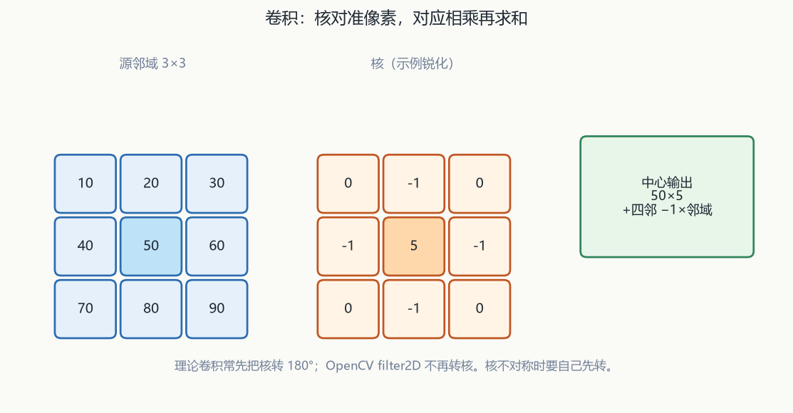
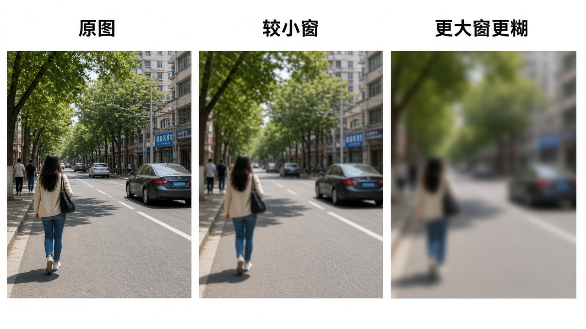
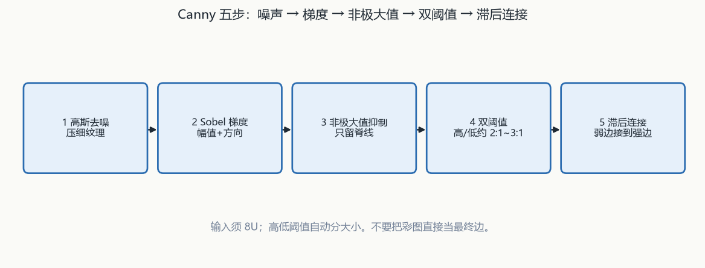
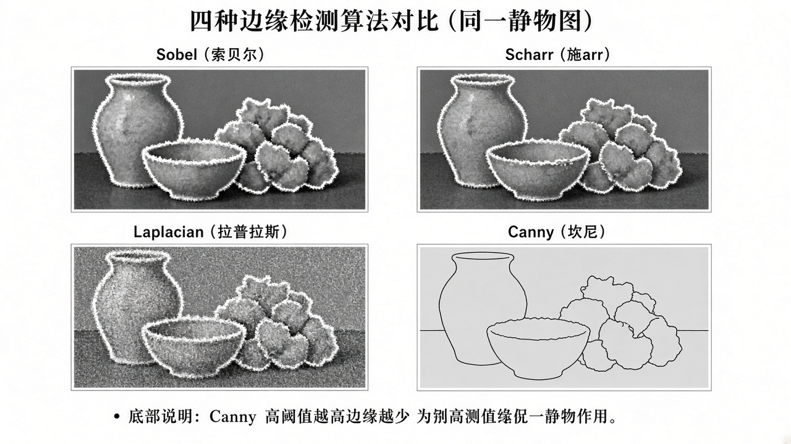

# 第4章 图像滤波与边缘检测

来源：文档1《OpenCV 4计算机视觉:Python语言实现（原书第3版）》第3章滤波相关页片（PDF 90–131；**3.3 傅里叶理论细节不读**，只收 HPF/LPF 作滤波引言；收录 `filter2D` / 卷积核 / Canny / Sobel 相关；**3.9 轮廓、3.10 霍夫与形状不读**；在 PDF 132「第4章 深度估计」之前停止）；文档2《opencv4快速入门》第5章「图像滤波」（书页 132–173。用户给定 PDF 135–176 按书页+3；实测章标题在 PDF 137、5.6 小结在 PDF 178–179，PDF 135–136 仍是第4章模板匹配页缝，本章不展开直方图/模板匹配）。扫描件 OCR 嘈杂，函数名按可辨识的 OpenCV 4 写法还原；吃不准处标【信息缺口】。

## 本章总览

先把图当成信号：卷积核在图上滑，点乘求和，用来去噪或抽边。学完应能回答：理论卷积为什么要先把核转 180°、`filter2D` 转不转、椒盐和高斯噪声怎么造、`blur` 和 `boxFilter` 差在归一化、高斯核尺寸和 σ 谁推谁、中值为什么更吃椒盐、双边为什么能保边、Sobel / Scharr / Laplacian / Canny 各自多哪一步。

- **文档2侧重**：C++ 原型、噪声生成、线性/非线性低通、边缘高通整条链。本章几乎全部参数表来自文档2。
- **文档1侧重**：HPF/LPF 直觉、核=一组权值、`cv2.filter2D` / `sepFilter2D`、Cameo 的 `filters.py`（描边、锐化、模糊、浮雕）、Canny 五步概念。多数函数**没有完整 Python 原型**。

属于后续章，本章不展开：傅里叶变换 / DFT / 幅度谱 / `numpy.fft.fft2`（融合第8章，3.3 只借 HPF/LPF 当滤波入口）；轮廓、`findContours`、霍夫直线/圆、Douglas-Peucker（融合第7章，读到 3.8 末「将在 3.10 节实验」即停）；形态学核（融合第5章）；直方图（融合第6章）；深度估计（融合第10章，文档1第4章 PDF 132 起）。

DFT、轮廓/霍夫、Cameo 胶片色的预告见本章对应小节，不在这里展开公式。

## 核心知识点

### 卷积与核

#### 核是一组权值

【文档1观点】核（kernel）= 一组权值，作用在源图一块邻域上，产出目标图的一个像素。`ksize=7` 表示每个目标像素看 7×7=49 个源像素。

可把核想成在源图上移动的磨砂玻璃。卷积矩阵是奇数行、奇数列的二维数组，中心对应当前像素。基于核的滤波器也称卷积滤波器。

🔑 关键速记：核是奇数边长的权值表，中心对应当前像素。

#### 理论卷积五步与 filter2D 不转核

【文档2观点】图像每一行/列都可看成亮度变化的信号，故可卷积。过程约五步：① 把模板旋转 180°（中心对称时常可省，不对称则必须转）；② 把核中心对准待算像素；③ 对应相乘再求和；④ 结果写到中心像素；⑤ 从左到右、从上到下扫完全图。

边缘处核会探出图外，需外推（例：3×3 核可在四周补一层 0）。核系数和若太大，8U 易越界，常把核缩放到**系数和为 1**。

下表是指定核做滤波的两个入口；`filter2D` **不会把核再转 180°**。

| 名称 | 功能 | 主要参数 | 约束&坑点 |
|---|---|---|---|
| `void cv::filter2D(InputArray src, OutputArray dst, int ddepth, InputArray kernel, Point anchor=Point(-1,-1), double delta=0, int borderType=BORDER_DEFAULT)` | 用指定核对图做卷积/滤波 | `ddepth=-1` 时输出深度自动选。`kernel`：书称 **`CV_32FC1` 矩阵**，多为奇数边长（3×3、5×5）。`anchor=(-1,-1)` 表示核中心。`delta` 加在卷积结果上。`borderType` 见表 3-5，默认 `BORDER_DEFAULT`（书：不包含边界值的倒序填充） | **不会把核再转 180°**；核不对称时要自己先转。多通道共用同一核；通道要不同核须先 `split`。dst 与 src 同尺寸同通道数。输出深度见表 5-1 |
| `void cv::sepFilter2D(InputArray src, OutputArray dst, int ddepth, InputArray kernelX, InputArray kernelY, Point anchor=Point(-1,-1), double delta=0, int borderType=BORDER_DEFAULT)` | 可分离滤波：先一方向再另一方向 | `kernelX` / `kernelY` 两个一维核 | 与 `filter2D` 不同：不靠 `K×1` / `1×K` 区分方向，写成哪种形状都不影响。先 X 再 Y 与先合成矩形核再滤，结果应一致 |
| `cv2.filter2D` / `cv2.sepFilter2D`（文档1） | 同上，Python | `ddepth`：如 `cv2.CV_8U`；**负值（例 −1）表示与源同深** | 彩色图对每个通道用同一核；通道不同核仍要 `split`/`merge`。文档1 还点名 NumPy 一维 `convolve`、SciPy `ndimage.convolve` |

理论卷积要转核，`filter2D` 当滤波用所以不转；多通道默认共用一核。边界类型见表 3-5，详见第3章。

🔑 关键速记：理论卷积先转 180°；filter2D 不转，不对称核要自己先转。

#### 表 5-1 输出深度

表 5-1 `filter2D` / 同类 `ddepth` 与输入深度的对应（OCR 残，按书表格子还原）：

| 输入深度 | 输出可选 |
|---|---|
| `CV_8U` | −1 / `CV_16S` / `CV_32F` / `CV_64F` |
| `CV_16U` / `CV_16S` | −1 / `CV_32F` / `CV_64F` |
| `CV_32F` | −1 / `CV_32F` / `CV_64F` |
| `CV_64F` | −1 / `CV_64F` |

【信息缺口：表 5-1 第三行 OCR 把 −1 印成 `l`，以上按「与上下行同一套路」还原。】后面线性滤波的 `boxFilter` 等也按这张表选 `ddepth`。

🔑 关键速记：ddepth=-1 跟源同深；8U 还可出 16S/32F/64F。

#### 锐化、边缘、模糊、浮雕核直觉

文档1给的核直觉（数字来自正文，不是图）：

- **锐化**：中心 9，直接邻域各 −1；输出 ≈ 9×中心 − 8 个邻居。权值和为 **1**，整体亮度大致不变。
- **边缘**：把锐化核改成权和为 **0**，边变白、非边变黑。文档1：边缘检测核通常权和为 0。
- **模糊**：邻域权值为正且和为 1，例如对邻域求平均。
- **浮雕 / 脊**：一边正权（糊）、一边负权（锐），核不对称。

权和为 1 保亮度，为 0 偏找边；浮雕核不对称，走 `filter2D` 前要自己转。

🔑 关键速记：权和 1 保亮度，权和 0 找边；浮雕核不对称。

#### HPF / LPF 与 DFT 预告

【文档1观点】HPF：看一块区域，按与周围强度差**增强**某些像素；水平邻域平均差一类核是高增益 HPF，找边很有效。LPF：若与周围差低于某阈值则**抹平**，用来去噪和模糊。

高斯模糊是流行的 LPF，衰减高频。也可用「原图 − LPF」当另一种 HPF。文档1 3.3 的 DFT / 幅度谱 / `fft2` 不在本章展开。

空间域卷积也可用频谱相乘：扩到同一最优尺寸 → `dft` → `mulSpectrums` → `idft`，正逆须 `DFT_SCALE`。

👉 完整深度讲解见第8章。

🔑 关键速记：HPF 增强差、LPF 抹平差；频谱相乘等价卷积，正逆要 DFT_SCALE。

🔑 关键速记：核在邻域加权；filter2D 不转核；权和 1 保亮度、0 找边。

### 噪声种类与生成（文档2 5.2）

#### 四类噪声本章只展开两种

常见四类：高斯、椒盐、泊松、乘性。本章只展开前两种。采集/传输会引入光子噪声、暗电流等，去噪是预处理。

🔑 关键速记：本章只造椒盐和高斯，泊松与乘性不展开。

#### 椒盐噪声

**椒盐（脉冲）噪声**：随机改某些像素，黑白亮暗点像盐和胡椒。位置随机，黑/白也随机。OpenCV 4 **没有**现成加椒盐函数。

步骤：① `rand` 定行列；② 再随机奇偶决定黑或白；③ 按通道改像素（灰：0 或 255；BGR 三通道可一起拉满/拉黑）。

下表三个随机数入口都在 `cvflann` 里，不要和 `stdlib.h` 的 `rand` 混。

| 名称 | 功能 | 主要参数 | 约束&坑点 |
|---|---|---|---|
| `int cvflann::rand()` | 无参随机整数 | 无 | **在 `cvflann` 里**，要写 `cvflann::rand()`。不写前缀时可能用到 `stdlib.h` 的 `rand`，那就不是 OpenCV 这一份。可用 `rand()%100` 把范围卡到 0–100 |
| `double cvflann::rand_double(double high=1.0, double low=0)` | 浮点随机 | 默认 0–1 | 要上下界 |
| `int cvflann::rand_int(int high=RAND_MAX, int low=0)` | 整数随机 | 书中作者机上 `RAND_MAX` 为 32767 | 要上下界 |

没有现成「加椒盐」函数；必须自己抽位置再改成 0 或 255。

🔑 关键速记：椒盐是稀疏黑白点；用 cvflann::rand，不要用到 stdlib 的 rand。

#### 高斯噪声

**高斯噪声**：概率密度服从高斯分布。较暗、亮度不均、相机过热、电路噪声都会引入。出现在**所有位置**，不是稀疏撒点。密度公式见书式(5-2)（μ 均值、σ 标准差）。

同样没有现成「加高斯噪声」函数，用 `RNG::fill` 造同尺寸随机矩阵再与原图相加。

| 名称 | 功能 | 主要参数 | 约束&坑点 |
|---|---|---|---|
| `void cv::RNG::fill(InputOutputArray mat, int distType, InputArray a, InputArray b, bool saturateRange=false)` | 按分布填随机数 | `mat` 目前须 **少于 5 通道**。`distType`：`RNG::UNIFORM`（简记 0）或 `RNG::NORMAL`（简记 1）。均匀：`a` 下限、`b` 上限；高斯：`a` 均值、`b` 标准差。`saturateRange` 仅均匀分布用 | **非静态成员**，先构造 `RNG rng;` 再 `rng.fill(...)`。示例：彩色 `NORMAL, 10, 20`，灰度 `NORMAL, 15, 30`，再 `图像 = 图像 + 噪声矩阵` |

先构造 `RNG` 再 `fill`；通道须少于 5；造完再与原图相加。

🔑 关键速记：高斯铺满全图；RNG::fill 用 NORMAL，再和原图相加。

🔑 关键速记：椒盐稀疏自造点，高斯全图 RNG::fill；都没有现成加噪函数。

### 线性滤波（文档2 5.3）

#### 低通专指去噪模糊

滤波 = 去掉不关心的、让关心的更清楚。噪声多在高频：低通/高阻 → 去噪（平滑）；纹理变化大的地方频率高：高通 → 抽边、锐化。

书把 5.3/5.4 的「滤波」专指**低通**，5.5 的边缘检测专指**高通**。部分书把低通直接叫模糊；高斯模糊 ≡ 高斯低通。

线性滤波过程像卷积，但**不必把模板转 180°**。核描述中心像素与邻域的线性关系。常见：均值、方框、高斯。

🔑 关键速记：本章 5.3/5.4 的滤波=低通=常说的模糊；线性滤波不必转核。

#### blur / boxFilter / sqrBoxFilter / GaussianBlur

下表是均值、方框、平方方框、高斯四个线性低通入口，外加生成一维高斯核；默认归一化时 `blur` 与 `boxFilter` 一回事。

| 名称 | 功能 | 主要参数 | 约束&坑点 |
|---|---|---|---|
| `void cv::blur(InputArray src, OutputArray dst, Size ksize, Point anchor=Point(-1,-1), int borderType=BORDER_DEFAULT)` | 均值滤波：窗内像素等权平均 | src 深度须为 `CV_8U` / `CV_16U` / `CV_16S` / `CV_32F` / `CV_64F`。核形式书式(5-3)：每个系数 = `1/(width×height)` | dst 与 src 同尺寸、同类型、同通道。窗越大越糊。边缘靠外推，近边可能看起来「变一截」，属正常 |
| `void cv::boxFilter(InputArray src, OutputArray dst, int ddepth, Size ksize, Point anchor=Point(-1,-1), bool normalize=true, int borderType=BORDER_DEFAULT)` | 方框滤波：窗内求和，可选归一化 | `normalize=true`（默认）时与 `blur` 结果相同（不考虑 `ddepth`）。`false` 时输出是窗内**和**，不是平均。`ddepth` 见表 5-1 | 均值是方框的归一化特例 |
| `void cv::sqrBoxFilter(InputArray src, OutputArray dst, int ddepth, Size ksize, Point anchor=Point(-1,-1), bool normalize=true, int borderType=BORDER_DEFAULT)` | 窗内**平方和**，再可选归一化 | 参数同 `boxFilter` | `CV_8U` 平方易超出 0–255；`CV_32F` 的 0–1 平方会更小，归一化后往往更暗。书称去噪任务主要针对 `CV_32F` |
| `void cv::GaussianBlur(InputArray src, OutputArray dst, Size ksize, double sigmaX, double sigmaY=0, int borderType=BORDER_DEFAULT)` | 按离中心距离做高斯加权 | 任意通道数；深度同上五种。`ksize` 可不为正方形，但须**正奇数**；为 0 则由 σ 反推尺寸。`sigmaY=0` 则等于 `sigmaX`；两轴 σ 都 0 则由 `ksize` 算 σ | 书建议 **ksize、sigmaX、sigmaY 都写明白**。对高斯噪声效果较好，仍会糊，窗越大越糊 |
| `Mat cv::getGaussianKernel(int ksize, double sigma, int ktype=CV_64F)` | 生成**一维**高斯核 | `ksize` 须正奇数。`ktype`：`CV_32F` 或 `CV_64F`（默认 64F）。σ 为负数则用书式(5-4) 由尺寸推 σ | 得到 `ksize×1` 的 `Mat`。二维核 = X 向一维 × Y 向一维。式(5-4) OCR 接近 `0.3*((ksize-1)*0.5-1+0.8)`【信息缺口：括号位置可能糊】。返回类型行 OCR 残，按「生成 Mat」还原 |

`normalize=false` 是求和不是「更糊的均值」；高斯建议三个参数都写明白。

【文档1观点】预定义滤波器几乎都带 `ksize`：奇数，表示核的宽和高（像素）。模糊可用 `blur`（简单平均）、`medianBlur`、`GaussianBlur`。中值见本章「非线性滤波」。

🔑 关键速记：blur 是归一化方框；高斯 ksize 与 σ 可互推，最好都写上。

🔑 关键速记：线性低通会糊边；均值最简单，高斯更克高斯噪声。

### 非线性滤波（文档2 5.4）

#### 中值与双边

线性组合消不掉「系数非零」的那颗噪声，只会把它抹柔。排序/逻辑类非线性可以把离群点丢掉。常见：中值、双边。

| 名称 | 功能 | 主要参数 | 约束&坑点 |
|---|---|---|---|
| `void cv::medianBlur(InputArray src, OutputArray dst, int ksize)` | 窗内排序取中值换中心 | 通道：单 / 三 / 四。`ksize` 须 **>1 的奇数**（正方形）。`ksize` 为 3 或 5 时深度 `CV_8U` / `CV_16U` / `CV_32F`；更大孔径**只能 `CV_8U`** | 对斑点/椒盐较好，一定条件下比均值更护边；窗大了同样糊，且**比均值慢得多**。彩色是各通道分别取中值。不能处理「两通道或更多通道却不像图像」的 Mat【与「四通道可以」并列，按「像图像的 1/3/4 通道」理解】 |
| `void cv::bilateralFilter(InputArray src, OutputArray dst, int d, double sigmaColor, double sigmaSpace, int borderType=BORDER_DEFAULT)` | 空域 × 值域，去噪并尽量保边 | src：**单通道或三通道**，深度 `CV_8U` / `CV_32F` / `CV_64F`。`d`：邻域直径；非正则由 `sigmaSpace` 算。`d>0` 时邻域听 `d`，`d≤0` 时邻域正比于 `sigmaSpace`。两个 σ 小于 10 作用弱，大于 150 很强、偏卡通 | `d>5` 明显变慢；实时建议 `d=5`，离线大噪声示例用 `d=9`（OCR 一处像「90」，示例代码是 9 与 25）。两 σ 可设成相同。比其他滤波慢。书称有「美颜」效果 |

中值克椒盐但慢；双边保边，σ 太大变卡通。中值按「像图像的 1/3/4 通道」理解。

🔑 关键速记：中值克椒盐、孔径>5 只能 8U；双边保边但慢，σ>150 偏卡通。

#### 文档1 的描边顺序与 Cameo

【文档1观点】找边之前先模糊，少把噪声当边。彩色数字视频噪声，文档1 描边例用 **`medianBlur`**；找边用 **`Laplacian`**。顺序：BGR→灰度 → 中值 → Laplacian。

`blurKsize` 给中值，`edgeKsize` 给 Laplacian；网络摄像头示例值 7 与 5。中值 `ksize=7` 很贵，卡就减小；**小于 3 则关闭模糊**。

Cameo：滤波器放到 `filters.py`，通用数学放到 `utils.py`；`cameo.py` 导入后对抓帧套描边、胶片色。

Cameo 胶片味用控制点插值成查找表（SciPy），不是卷积核。LUT 输出类型跟表走，详见第3章。

👉 完整深度讲解见附录。

🔑 关键速记：文档1 描边是中值再 Laplacian；胶片色是 SciPy 查表，不是卷积核。

🔑 关键速记：非线性可丢掉离群点；中值打椒盐，双边保边，胶片色走 LUT。

### 边缘检测原理（文档2 5.5.1）

#### 差分近似导数

边缘 = 灰度突然变的地方 ≈ 导数大的地方。离散信号用差分近似：相邻差 `[-1, 1]` 的梯度落在两像素中间；表示某像素处的梯度改用前后像素，X/Y 核约为 `[-0.5, 0, 0.5]`。

45° 可用 2×2 核。正值=低变高，负值=高变低，都是边，故取绝对值。两方向边再相加（并集）得全图边。差分结果可能为负，**不要用 `CV_8U` 当滤波输出**，示例用 `CV_16S` 再取绝对值。

🔑 关键速记：边是导数大的地方；有符号深度用 16S，不要用 8U 当梯度输出。

#### convertScaleAbs

下表不是滤波器，只是把有符号梯度变成能 `imshow` 的绝对值。

| 名称 | 功能 | 主要参数 | 约束&坑点 |
|---|---|---|---|
| `void cv::convertScaleAbs(InputArray src, OutputArray dst, double alpha=1, double beta=0)` | 按 `dst = \|src·α + β\|` 取绝对值（可缩放） | `alpha` 默认只取绝对；`beta` 默认不加偏置 | src、dst 可以是同一变量（原地） |

它只做 `|src·α+β|`，可以原地写回。

🔑 关键速记：convertScaleAbs 不是滤波，只是取绝对值方便 imshow。

🔑 关键速记：先用有符号深度算差分，再取绝对值看边。

### Sobel / Scharr / 生成核（文档2 5.5.2–5.5.4）

#### Sobel 与 Scharr 差在哪

Sobel：离散微分 + 高斯平滑，把 `ksize×1` 扩成 `ksize×ksize`，平缓区的边更明显。步骤：① X 向一阶（式 5-16，标准 3×3 为中列 0、右正左负）；② Y 向一阶（式 5-17）；③ 合成：绝对值之和，或平方和开方（式 5-18）。

Scharr：放大核内权重，把弱边差拉开；固定 **3×3**，也称 Scharr 滤波器。式(5-19) OCR 还原：Gx 中列 0、两侧 ±3/±10/±3；Gy 中行 0、上下 ±3/±10/±3。

【文档1观点】OpenCV 找边滤波器包括 Laplacian、Sobel、Scharr：非边变黑，边变白或饱和色，但容易把噪声当边。

🔑 关键速记：Sobel 把高斯平滑做进核；Scharr 固定 3×3、权更大、弱边更明显。

#### 三个算子原型

下表 Sobel 有 ksize，Scharr 无 ksize，`getDerivKernels` 可把核抠出来。

| 名称 | 功能 | 主要参数 | 约束&坑点 |
|---|---|---|---|
| `void cv::Sobel(InputArray src, OutputArray dst, int ddepth, int dx, int dy, int ksize=3, double scale=1, double delta=0, int borderType=BORDER_DEFAULT)` | Sobel 边缘 | `dx`/`dy`：各向差分阶数。`ksize`：**1 / 3 / 5 / 7**。`scale` 默认不缩放 | **不要用 `CV_8U` 输出**，反向梯度会被截掉。任一方向阶数须 **< ksize**；`ksize=1` 时阶数须 **<3**。经验：最大阶 1→核 3，阶 2→5，阶 3→7。`ksize=1` 实际是 3×1 或 1×3 不是正方形。用法接近 `sepFilter2D`。示例注释写「X 一阶」却调用 `Sobel(..., 2, 0, 1)`（dx=2、ksize=1），**注释与参数不一致** |
| `void cv::Scharr(InputArray src, OutputArray dst, int ddepth, int dx, int dy, double scale=1, double delta=0, int borderType=BORDER_DEFAULT)` | Scharr 边缘 | **无 ksize**，核固定 3×3 | `dx`、`dy` **只能一个为 1，且不能同时为 0**。同样不要 `CV_8U` 输出。比 Sobel 更能抽出弱边 |
| `void cv::getDerivKernels(OutputArray kx, OutputArray ky, int dx, int dy, int ksize, bool normalize=false, int ktype=CV_32F)` | 生成分离的 Sobel/Scharr 核 | `kx`/`ky`：`ksize×1`。`ksize`：`FILTER_SCHARR` 或 1/3/5/7。`ktype`：`CV_32F`（默认）或 `CV_64F` | 数字 1/3/5/7 → Sobel；`FILTER_SCHARR` → Scharr。`ksize` 须大于 dx、dy 的最大者；`ksize=1` 时最大阶 <3；`FILTER_SCHARR` 时 dx、dy 为 0 或 1 且**和为 1**。两向量按可分离原理合成最终核。`Sobel`/`Scharr` 内部就是调它 |

不要 8U 输出；Scharr 的 dx/dy 互斥；书上 Sobel 示例注释与参数不一致。

🔑 关键速记：Sobel 阶数必须小于 ksize；Scharr 只能一阶且 dx/dy 互斥。

🔑 关键速记：一阶差分核很小；Sobel/Scharr 把平滑做进核，输出不要用 8U。

### Laplacian（文档2 5.5.5）

#### 各向同性二阶导

各向同性二阶导，一次出全方向边，不必分 X/Y。对噪声敏感，常先高斯。定义式(5-20)：∂²f/∂x² + ∂²f/∂y²。

| 名称 | 功能 | 主要参数 | 约束&坑点 |
|---|---|---|---|
| `void cv::Laplacian(InputArray src, OutputArray dst, int ddepth, int ksize=1, double scale=1, double delta=0, int borderType=BORDER_DEFAULT)` | Laplacian 边缘 | src 可以是灰或彩。`ksize` 须**正奇数** | 不要 `CV_8U` 输出。`ksize>1`：用 Sobel 算 X、Y 二阶再相加（式 5-21）。`ksize=1`：3×3 核中心 −4、十字四邻为 1、四角 0（式 5-22）。示例：未模糊 vs `GaussianBlur` 后再 `Laplacian(..., CV_16S, 3)`，去噪后边更干净 |

`ksize=1` 用固定 3×3；更大则 internally 走 Sobel 二阶再相加。文档2 推荐先高斯。

【文档1观点】Laplacian 在灰度上线条较粗。描边流程把 Laplacian 结果转到白底黑边，归一化到 0–1 再与源图相乘，把边压暗。文档1 找边前用中值，详见本章「文档1 的描边顺序与 Cameo」。

🔑 关键速记：Laplacian 一次出全边、更怕噪声；ksize=1 是中心 −4 的 3×3。

🔑 关键速记：二阶、无方向、先模糊；文档2 用高斯，文档1 描边用中值。

### Canny

#### 五步流水线

【文档1观点】以 John F. Canny 命名，OpenCV 里往往「一行代码」。五步：① 高斯去噪；② 算梯度；③ 边上做非极大值抑制（NMS，重叠边里留最好的；更细的 NMS 文档1 指向第7章）；④ 双阈值丢掉假正例；⑤ 看边与边的连接，留真边、丢弱边。

【文档2观点】同样五步，写得更操作化：① 一般用 5×5 高斯（式 5-23，系数 OCR 残）；② Sobel 得 Gx、Gy，再算幅值与方向（式 5-24）；方向常量化成 0°/45°/90°/135°；③ 沿梯度正负方向比邻域，不是最大就抑制；④ 梯度 < 低阈值删除，介于两阈值标弱边，> 高阈值标强边；⑤ 弱边 8 邻域里有强边才保留，否则删掉。

🔑 关键速记：高斯 → 梯度 → NMS → 双阈值 → 弱边接到强边才留。

#### Canny 函数原型

下表是一行调用背后的约束；双阈值谁大谁小由函数自己分。

| 名称 | 功能 | 主要参数 | 约束&坑点 |
|---|---|---|---|
| `void cv::Canny(InputArray image, OutputArray edges, double threshold1, double threshold2, int apertureSize=3, bool L2gradient=false)` | Canny 边缘 | `image`：**`CV_8U` 单通道或三通道**。`edges`：同尺寸 **单通道 `CV_8U`**。`threshold1`/`threshold2`：滞后双阈值，**不区分谁大谁小，函数会自动比较**。`apertureSize`：内部 Sobel 直径。`L2gradient`：幅值公式，见式(5-25) | 较大阈值 : 较小阈值 一般 **2:1～3:1**。阈值高则噪声少、边也少。示例先高斯再 Canny：纹理密的区域边会变少，平坦区影响较小。文档1 **未给** 双阈值/孔径/`L2gradient` 原型 |

【信息缺口：式(5-25) 两种幅值 OCR 残；按参数名理解为默认近似 \|Gx\|+\|Gy\|，`L2gradient=true` 走平方和开方。5×5 高斯系数图无法从 OCR 可靠还原。】

输入允许三通道，输出一定是单通道 8U。文档1 只讲五步，不给这些参数。

🔑 关键速记：输入 8U 可彩可灰，输出单通道 8U；双阈值约 2:1～3:1，谁大谁小函数自分。

#### 轮廓 / 霍夫直线与圆

找到 Canny 边后可用霍夫分析线/圆 → **本章不展开**。直线霍夫吃二值边，圆霍夫吃灰度；轮廓 `findContours` 再外接多边形。

👉 完整深度讲解见第7章。

🔑 关键速记：直线霍夫吃二值边，圆霍夫吃灰度；轮廓先 findContours 再外接多边形。

🔑 关键速记：Canny 把五步捆成一行；边之后的轮廓和霍夫留给第7章。

## 易混淆点&差异对比

### 两书本章各写到哪

下表对照文档1的直觉/Cameo 与文档2的 C++ 约束表，避免把两边合成一套完整 Python 原型。

| 点 | 文档1 | 文档2 |
|---|---|---|
| 本章任务 | Python/Cameo：HPF/LPF 直觉、自定义核、描边、Canny 五步 | C++ 手册：造噪声 + 低通全家桶 + 边缘算子原型 |
| 卷积是否转核 | 讲核与 `filter2D`，未强调 180° | 理论卷积要转 180°；**`filter2D` 不转** |
| 低通 vs 模糊 | 高斯模糊是 LPF；也可用原图减 LPF 当 HPF | 5.3/5.4「滤波」= 低通 = 常说的模糊；5.5 才叫边缘/高通 |
| 找边前去噪 | 推荐 **中值** + Laplacian（`strokeEdges`） | Laplacian 节推荐 **高斯**；Canny 内部已含高斯 |
| Canny 输入 | 未写通道约束 | 8U，**允许单通道或三通道**；输出一定是单通道 8U |
| Canny 参数 | 只说「一行」+ 五步，无 `threshold`/`apertureSize` | 双阈值自动分大小，建议 2:1～3:1 |
| Sobel / Scharr | 点名，无完整参数 | 完整原型；Scharr 无 ksize；`getDerivKernels` 可把核抠出来改 |
| 噪声 | 未专节造噪声 | 椒盐用 `cvflann::rand`；高斯用 `RNG::fill` 再相加 |
| 可分离 | 点名 `sepFilter2D`（二维核能拆成两个一维时） | 专节 + 与两次 `filter2D`、联合核对照 |

文档1贡献核直觉和 Canny 五步；参数表几乎全部来自文档2。

🔑 关键速记：文档1讲直觉和 Cameo，文档2给原型；找边前去噪一边中值一边高斯。

### 容易混的概念

- **`blur` vs `boxFilter`**：默认归一化时两者一回事；`normalize=false` 是求和，更亮/易饱和，不是「更糊的均值」。
- **`boxFilter` vs `sqrBoxFilter`**：后者先平方再累加，8U 易爆，32F 会变暗。
- **卷积 vs 滤波**：文档2：滤波不必转核；卷积理论要转。`filter2D` 名字像卷积，行为按滤波（不转核）。
- **`filter2D` vs `sepFilter2D`**：前者一个二维核，方向靠核形状；后者两个一维核，形状不决定方向。
- **高斯 `ksize` 与 σ**：可互相推；都写 0 时由另一方算。`getGaussianKernel` 的 σ 为负才走默认公式。
- **中值 vs 双边**：中值克椒盐；双边保边、慢、σ 太大变卡通/美颜。
- **Sobel vs Scharr**：同流程；Scharr 固定 3×3、权更大、弱边更明显，且 dx/dy 互斥。
- **一阶差分 vs Sobel**：裸差分核是 1×2 或 1×3；Sobel 把高斯平滑做进 ksize×ksize。
- **Laplacian vs Sobel**：二阶、无方向、一次出全边，更怕噪声。
- **Canny 双阈值**：低阈值连弱边，高阈值定强边；两参数谁大谁小文档2 说函数自己分。
- **`convertScaleAbs` 不是滤波**：只是把有符号梯度变成能 `imshow` 的 8U。

🔑 关键速记：归一化方框才是均值；filter2D 不转核；梯度输出不要用 8U。

## 本章要点总结

核在邻域上加权。理论卷积先转 180°；OpenCV `filter2D` **不转**。权和为 1 保亮度，为 0 偏找边。多通道默认共用一核。

噪声：椒盐是稀疏黑白点（自己 `rand`）；高斯铺满全图（`RNG::fill` + 相加）。低通去噪会糊边：均值/归一化方框最简单；高斯按距离加权、更克高斯噪声；中值克椒盐；双边尽量保边但慢。

高通找边：先差分或 Sobel/Scharr，有符号深度用 `CV_16S`，再 `convertScaleAbs`。Laplacian 各向同性、更吵，先模糊。Canny 把高斯、梯度、NMS、双阈值、弱边跟踪捆成一步。

文档1 用这些核给 Cameo 做描边/锐化/浮雕；文档2 给出 C++ 约束表。轮廓和霍夫从 Canny 往后接到第7章；DFT 细节接到第8章。

🔑 关键速记：不转核的滤波去噪，有符号梯度找边，Canny 五步一行调用。
