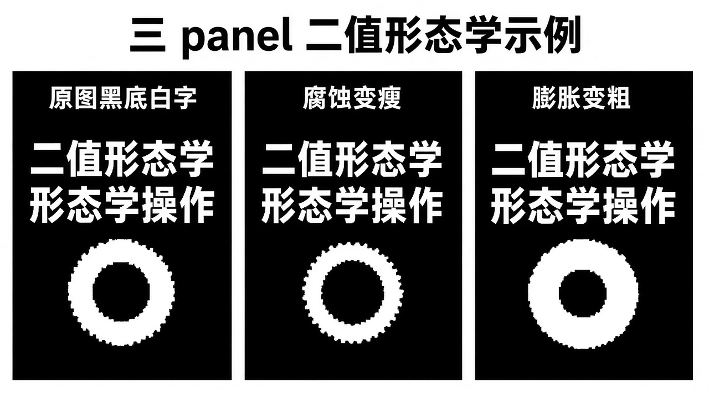
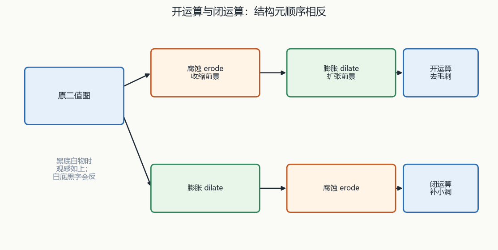
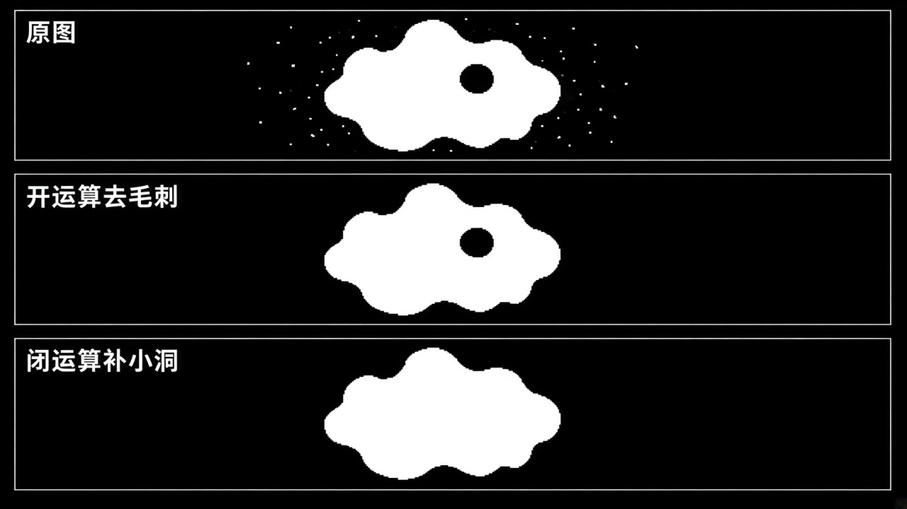

# 第5章 图像形态学

来源：文档2《opencv4快速入门》第6章「图像形态学操作」（书页 175–205 / 实测 PDF 180–210；用户给定 PDF 178–208 含上一章 5.6 小结页，正文自 PDF 180「第 6 章」起）。对应文档1：无对应主章节（规划大纲写明后续分割章可能用到开运算，本章不从文档1正文补）。扫描件 OCR 嘈杂，函数名按书中可辨识的 OpenCV 4 写法还原；吃不准处标【信息缺口】。

## 本章总览

形态学关注的是物体的形状与位置，常先把图变成二值再处理，好把内部纹理先放下。

学完应能回答：欧氏 / 街区 / 棋盘三种像素距离差在哪、`distanceTransform` 算的是离谁的距离、连通域 4-邻域和 8-邻域会不会把一块拆成两块、腐蚀和膨胀随黑底/白底怎么「看起来反了」、开闭梯度顶帽黑帽击中击不中各自是腐蚀膨胀的哪种组合、细化为啥适合文字和圆环却不适合实心圆。

- **文档2侧重**：C++ 原型、距离公式、结构元、`morphologyEx` 一张表换操作、Zhang 细化条件、`ximgproc::thinning`。
- **文档1侧重**：无对应主章节。

> 属于后续章，本章不展开：直线 / 圆 / 轮廓与几何形状（融合第7章）；漫水填充、分水岭等分割（融合第8章）。腐蚀过程「像卷积」只作类比，卷积滤波本身在融合第4章。

> 📝待补全：【轮廓发现与外接多边形】
>
> 连通域只给标签、外接框、面积。真正沿边缘抽出带层次的轮廓用 `findContours`，再用 `boundingRect` / `minAreaRect` / `approxPolyDP` / 凸包描述形状。本章米粒例只数块、画轴对齐框，不进入多边形逼近。
>
> 👉 完整深度讲解见第7章。

> 📝待补全：【漫水填充 / 分割】
>
> 连通域是二值相同标签块。按色差灌、建坝、图割是 `floodFill` / `watershed` / `grabCut`。本章只处理「值相同且相邻」的块，不按色差漫灌。
>
> 👉 完整深度讲解见第8章。

> 📝待补全：【`opencv_contrib` / `ximgproc` 模块安装】
>
> `thinning` 头文件 `opencv2/ximgproc.hpp`，不在默认 `opencv.hpp`。contrib 须同版本，CMake `OPENCV_EXTRA_MODULES_PATH`；Python 可用含 contrib 的 pip 包。形态学其余函数在主库，只有细化走扩展模块。
>
> 👉 完整深度讲解见第1章。

## 核心知识点

### 像素距离（文档2 6.1.1）

形态学里，互不粘连的独立区域叫集合或连通域。像素用坐标描述，像素距离用来谈两个区域的远近。

#### 欧氏 / 街区 / 棋盘

常用三种距离。下表公式以书为准；式(6-1) 根号内容 OCR 残，按「勾股」还原。

| 名称 | 公式（书） | 特点 |
|---|---|---|
| 欧氏距离 | \(d=\sqrt{(x_1-x_2)^2+(y_1-y_2)^2}\)（OCR 式(6-1) 根号内容残，按「勾股」还原） | 可含小数。例：\(P(1,0)\) 与 \(P(0,1)\) 为 \(d=1.414\) |
| 街区距离 | \(d=\|x_1-x_2\|+\|y_1-y_2\|\) | 必为整数。同上两点 \(d=2\)。沿街走、不能斜穿 |
| 棋盘距离 | \(d=\max(\|x_1-x_2\|,\|y_1-y_2\|)\) | 必为整数。同上两点 \(d=1\)。表示两像素要走到同行或同列时，两轴里较大的那一段 |

同一对对角点三种距离分别约 1.414 / 2 / 1：欧氏可小数、最短直线；街区沿轴走、整数和；棋盘取两轴差的最大者。

🔑 关键速记：先定距离种类，再谈两个区域有多远。

#### `distanceTransform`

该函数统计每个非零像素到最近 0 像素的距离。0 是黑，图太小或黑块太多时结果几乎全黑，不便观察。

示例先把米粒图二值化，再把黑白反转后变换，好对比「白底黑图 / 黑底白图」。

两套原型：一套同时输出离散 Voronoi 标签图 `labels`（`CV_32S`）；一套只要距离图，省掉 Voronoi 内存。下表先给带标签的重载。

| 名称 | 功能 | 主要参数 | 约束&坑点 |
|---|---|---|---|
| `void cv::distanceTransform(InputArray src, OutputArray dst, OutputArray labels, int distanceType, int maskSize, int labelType=DIST_LABEL_CCOMP)` | 距离变换 + 离散 Voronoi | `src`：`CV_8U` 单通道。`dst`：同尺寸，`CV_8U` 或 `CV_32F`。`labels`：同尺寸 `CV_32S`。`distanceType` 见表 6-1。`maskSize`：`DIST_MASK_3`（3×3）或 `DIST_MASK_5`（5×5）。`labelType` 见表 6-2 | 图可能大于 256，最近 0 的距离可超过 255，故 `dst` 常用 `CV_32F` |

带 Voronoi 时多一张 `CV_32S` 标签图；只要距离图时用下一套，少占内存。

只要距离图的重载如下。街区 / 棋盘对掩码尺寸无影响。

| 名称 | 功能 | 主要参数 | 约束&坑点 |
|---|---|---|---|
| `void cv::distanceTransform(InputArray src, OutputArray dst, int distanceType, int maskSize, int dstType=CV_32F)` | 只要距离图 | 前几项同上。`dstType`：`CV_8U` 或 `CV_32F` | 第二种原型在街区 / 棋盘下把 `maskSize` 强制为 3（书印「30」，按 3×3 理解）。欧氏：3×3 粗算、5×5 精算，推荐 5×5。`CV_8U` 只在街区距离下真正生效；欧氏、棋盘即使写 `CV_8U`，实际输出仍是 `CV_32F` |

距离图量的是非零点到最近 0，不是到前景；`CV_8U` 输出几乎只给街区，欧氏 / 棋盘会 silently 变成 `CV_32F`。

表 6-1 `distanceType`（简记以书表为准；示例用整数 1/2/3 分别算街区 / 欧氏 / 棋盘）：

| 标志 | 简记 | 作用 |
|---|---|---|
| `DIST_USER` | 【OCR 空】 | 自定义距离 |
| `DIST_L1` | 示例用 1 | 街区距离 |
| `DIST_L2` | 2 | 欧氏距离 |
| `DIST_C` | 3 | 棋盘距离 |

示例里 1/2/3 对应街区 / 欧氏 / 棋盘；`DIST_USER` 简记 OCR 空，不要脑补整数。

表 6-2 `labelType` 决定 Voronoi 标签按块还是按像素：

| 标志 | 简记 | 作用 |
|---|---|---|
| `DIST_LABEL_CCOMP` | 0 | 每个相连的 0 像素（以及离该连通块最近的非零像素）共用同一标签 |
| `DIST_LABEL_PIXEL` | 【OCR 空】 | 每个 0 像素（及最近的非零）各自标签 |

`CCOMP` 按「相连的 0 块」共用标签；`PIXEL` 是每个 0 像素各一号。`DIST_LABEL_PIXEL` 简记 OCR 空。

🔑 关键速记：距离图量的是非零点到最近 0；欧氏用 5×5，`CV_8U` 几乎只给街区。

🔑 关键速记：谈远近先定三种距离，再用 `distanceTransform` 决定要不要 Voronoi 标签。

### 连通域（文档2 6.1.2）

连通域：像素值相同且位置相邻的一块。分析 = 找出彼此独立的块并打标签。

一个连通域里通常只有一种像素值，故常先二值化，免得灰度波动把一块撕碎。车牌、文字、目标检测里用来切感兴趣区。

#### 4-邻域与 8-邻域

邻域必须声明：4-邻域只认水平 / 垂直（坐标只有一维差 1）；8-邻域允许对角线（X、Y 差的最大值 ≤1）。

两种定义得到的块不一样。对角算不算「挨着」直接改变连通域个数，必须写进分析条件。

🔑 关键速记：先写清 4 还是 8，再数有几块。

#### 两遍扫描与种子填充

书上两种算法思路（概念，不是单独 API）：

- 两遍扫描：第一遍给非零像素贴号，若上方和左侧已有标签则取较小者，否则发新号；同一块可能被贴多个号，第二遍合并。
- 种子填充：把非零像素放进集合，随机抽种子按邻域扩张，删掉已并入的点，直到集合空。

这是书上讲「怎么标号」的思路，调用时仍走下面的 `connectedComponents` 系列。

🔑 关键速记：两遍扫描会先多号再合并；种子填充是从点往外长。

#### `connectedComponents`

计连通域个数并打标签。标签 0 = 背景。下表两个重载：五参数无默认值，简易版最少两参数。

| 名称 | 功能 | 主要参数 | 约束&坑点 |
|---|---|---|---|
| `int cv::connectedComponents(InputArray image, OutputArray labels, int connectivity, int ltype, int ccltype)` | 计连通域个数并打标签 | `image`：`CV_8U` 单通道，最好已二值。`labels` 同尺寸。`connectivity`：4 或 8。`ltype`：`CV_32S` 或 `CV_16U`。`ccltype` 见表 6-3 | 返回值为 `int` 连通域数目。标签 0 = 背景。本重载无默认值，五个参数都要传 |
| `int cv::connectedComponents(InputArray image, OutputArray labels, int connectivity=8, int ltype=CV_32S)` | 简易版 | 邻域默认 8，输出类型默认 `CV_32S` | 最少两参数即可调用 |

五参数版每个实参都要写；简易版默认 8-邻域、`CV_32S`。返回值是连通域数目，不是最大标签的「减一」口诀——以返回值为准。

表 6-3 `ccltype`（目前只支持 Grana(BBDT) 与 Wu(SAUF)）：

| 标志 | 简记 | 作用（按书表） |
|---|---|---|
| `CCL_WU` | 0 | 8-邻域用 SAUF，4-邻域用 SAUF |
| `CCL_DEFAULT` | 【OCR 空】 | 8-邻域用 BBDT，4-邻域用 SAUF |
| `CCL_GRANA` | 【OCR 残】 | 8-邻域用 BBDT，4-邻域用 SAUF |

`DEFAULT` 与 `GRANA` 在书表里 8-邻域都走 BBDT、4-邻域走 SAUF；`WU` 两种邻域都走 SAUF。`CCL_DEFAULT` 简记 OCR 空，`CCL_GRANA` 简记 OCR 残。

🔑 关键速记：只数块、打标签用 `connectedComponents`，标签 0 是背景。

#### `connectedComponentsWithStats`

打标签同时给框、面积、质心。要框、面积、质心必须走这一套，不能只从标签图「猜」出来。

| 名称 | 功能 | 主要参数 | 约束&坑点 |
|---|---|---|---|
| `int cv::connectedComponentsWithStats(InputArray image, OutputArray labels, OutputArray stats, OutputArray centroids, int connectivity, int ltype, int ccltype)` | 打标签同时给框、面积、质心 | `stats`：`CV_32S`，有 N 个连通域则为 N×5，第 i 行是标签 i 的统计（表 6-4）。`centroids`：`CV_64F`，N×2，每行质心 x、y | 读宽：`stats.at<int>(i, CC_STAT_WIDTH)` 或 `stats.at<int>(i, 2)`。质心：`centroids.at<double>(i,0)` / `(i,1)`。书有一处把「第 i 个」写成「第 1 个」，以循环下标为准 |
| `int cv::connectedComponentsWithStats(..., int connectivity=8, int ltype=CV_32S)` | 简易版 | 最少四个参数：图、标签、stats、centroids | 示例从 i=1 画框，跳过背景 0 |

`stats` 是 N×5 的 `CV_32S`，`centroids` 是 N×2 的 `CV_64F`。画图从标签 1 起，0 是背景。

表 6-4 `stats` 列：

| 标志 | 简记 | 含义 |
|---|---|---|
| `CC_STAT_LEFT` | 0 | 最左像素的 x，水平包围盒起点 |
| `CC_STAT_TOP` | 【OCR 空，按序为 1】 | 最上像素的 y，垂直包围盒起点 |
| `CC_STAT_WIDTH` | 2 | 包围盒水平长度 |
| `CC_STAT_HEIGHT` | 3 | 包围盒垂直长度 |
| `CC_STAT_AREA` | 4 | 面积（像素个数） |
| `CC_STAT_MAX` | 5 | 统计种类数目，无实际含义 |

列顺序是 LEFT / TOP / WIDTH / HEIGHT / AREA；`CC_STAT_TOP` 简记 OCR 空，按序为 1。`CC_STAT_MAX=5` 只表示统计种类数目，无实际含义。

米粒例：二值化后直接计数会把两个非零噪点也当成独立连通域；后面用腐蚀去掉小块再数。

🔑 关键速记：要框、面积、质心必须 `WithStats`，从标签 1 画起。

🔑 关键速记：连通域先定 4/8 邻域，再决定只要标签还是连统计一起拿。

### 结构元、腐蚀、膨胀（文档2 6.2）

结构元类似卷积核：可自定尺寸、内容和中心。腐蚀过程「像卷积」只作类比，卷积滤波本身在融合第4章。

#### 腐蚀与膨胀公式

书述腐蚀流程：结构元绕中心转 180°，中心依次放到每个非零像素上——若结构元覆盖处全非零则保留中心像素，否则删掉。

式(6-4)：\(A \ominus B = \{z \mid (B)_z \subseteq A\}\)，即找能把结构元 B 全部装进 A 的位置。

膨胀相反：中心放到非零处，把结构元盖住的像素改成与中心对应值同类的前景。式(6-5)：\(A \oplus B = \{z \mid (B)_z \cap A \neq \emptyset\}\)。

🔑 关键速记：腐蚀要结构元全部装进前景；膨胀只要与前景有交集。

#### `getStructuringElement`

生成常用结构元。`ksize` 越大，同类结构元效果越强。

| 名称 | 功能 | 主要参数 | 约束&坑点 |
|---|---|---|---|
| `Mat cv::getStructuringElement(int shape, Size ksize, Point anchor=Point(-1,-1))` | 生成常用结构元 | `shape` 见表 6-5。`ksize` 越大，同类结构元效果越强。`anchor` 默认几何中心 | 只有十字的中心位置会改腐蚀后轮廓形状；矩形 / 椭圆的中心主要造成平移 |

十字锚点改形状，矩形 / 椭圆锚点主要平移。`anchor` 默认几何中心。

表 6-5 `shape` 三种常用结构元：

| 标志 | 简记 | 作用 |
|---|---|---|
| `MORPH_RECT` | 0 | 矩形，元素全 1 |
| `MORPH_CROSS` | 【OCR 空，示例用 1】 | 十字，中间行和列打 1 |
| `MORPH_ELLIPSE` | 2 | 椭圆，矩形的内接椭圆为 1 |

矩形 0、椭圆 2；十字简记 OCR 空，示例用 1。

🔑 关键速记：矩形 / 十字 / 椭圆三种核，只有十字锚点会改轮廓形状。

#### `erode` 与 `dilate`

通道任意；深度必须是 `CV_8U` / `16U` / `16S` / `32F` / `64F`。多通道按通道独立。

| 名称 | 功能 | 主要参数 | 约束&坑点 |
|---|---|---|---|
| `void cv::erode(InputArray src, OutputArray dst, InputArray kernel, Point anchor=Point(-1,-1), int iterations=1, int borderType=BORDER_CONSTANT, const Scalar& borderValue=morphologyDefaultBorderValue())` | 腐蚀 | 通道任意；深度必须是 `CV_8U` / `16U` / `16S` / `32F` / `64F`。`dst` 同尺寸同类型。`kernel` 可自制或 `getStructuringElement`。`iterations` 默认 1，次数越多越狠。多通道按通道独立 | 原型默认 `BORDER_CONSTANT`，后文又写默认 `BORDER_DEFAULT`（倒序不含边界）。【信息缺口：以哪句为准】。边界参数对图像中部几乎无影响。`anchor` 默认 `(-1,-1)` = 几何中心 |
| `void cv::dilate(...)` | 膨胀 | 七参数与 `erode` 同形同约束 | 结构元越大、次数越多，效果越强 |

`dilate` 七参数与 `erode` 同形同约束。`borderType` 原型写 `BORDER_CONSTANT`、后文又写 `BORDER_DEFAULT`，【信息缺口：以哪句为准】。

🔑 关键速记：深度五选一，次数越多越狠；边界默认两处说法不一致，标缺口。

#### 黑底与白底观感

只处理非零像素，所以观感取决于背景是 0 还是 255：

- 背景为 0：腐蚀后物体更瘦更小；膨胀后更粗更大。
- 背景为 255：腐蚀后看起来更粗更大；膨胀后更细更小。

不要用「变瘦=腐蚀」死记。示例用「黑底字腐蚀」与「白底字膨胀」做按位异或 / 与，说明两者互为相反过程。

米粒图：腐蚀后再 `connectedComponentsWithStats`，小噪声连通域消失，粒数才对。

🔑 关键速记：黑底前景变瘦是腐蚀，白底观感相反。

🔑 关键速记：结构元定形状，腐蚀收缩、膨胀扩张，观感跟着底色走。

### 开 / 闭 / 梯度 / 顶帽 / 黑帽 / 击中击不中（文档2 6.3.1–6.3.6）

单做腐蚀会去掉噪声也缩小主体；单做膨胀会填洞也放大噪声。按顺序组合。

OpenCV 4 没有单独的开运算函数，一律走 `morphologyEx`。

#### 开运算与闭运算

开 = 先腐蚀后膨胀；闭 = 先膨胀后腐蚀。下表按书给出组合与直观效果。

| 操作 | 组合（按书） | 直观效果 |
|---|---|---|
| 开运算 | 先腐蚀后膨胀 | 去小连通域、在细连接处断开、大致保住大块面积并平滑边界 |
| 闭运算 | 先膨胀后腐蚀 | 填连通域内小洞、平滑轮廓、把邻近块连上。书提醒：膨胀顶到图像边缘时，默认外推下边缘可能腐蚀不掉，面积仍偏大（图 6-23） |

开去小亮点、断开细颈；闭填小洞、粘邻近块。闭运算若膨胀顶到图像边缘，默认外推下边缘可能腐蚀不掉，面积仍偏大（图 6-23）。

🔑 关键速记：开是腐→膨去毛刺，闭是膨→腐补小洞。

#### 梯度、顶帽、黑帽

基本梯度 = 膨胀图 − 腐蚀图，用来勾边界。另有内部梯度 = 原 − 腐蚀、外部梯度 = 膨胀 − 原；后两种要自己做，`morphologyEx` 只给基本梯度。

顶帽 = 原 − 开，分离比邻近更亮的斑；开运算放大裂缝 / 局部暗区，相减后突出轮廓附近更亮的部分。

黑帽 = 闭 − 原，分离比邻近更暗的斑。书有一句写成「原与顶帽之差」，与后文公式、图 6-26 不一致，【以后文「闭运算结果减原图」为准】。

下表按书给出梯度 / 顶帽 / 黑帽的组合。

| 操作 | 组合（按书） | 直观效果 |
|---|---|---|
| 形态学梯度 | 基本梯度 = 膨胀图 − 腐蚀图 | 勾边界。另有内部梯度 = 原 − 腐蚀、外部梯度 = 膨胀 − 原；后两种要自己做，`morphologyEx` 只给基本梯度 |
| 顶帽 | 原 − 开 | 分离比邻近更亮的斑；开运算放大裂缝 / 局部暗区，相减后突出轮廓附近更亮的部分 |
| 黑帽 | 闭 − 原 | 分离比邻近更暗的斑。书有一句写成「原与顶帽之差」，与后文公式、图 6-26 不一致，【以后文「闭运算结果减原图」为准】 |

函数只给膨胀−腐蚀；顶帽抽亮斑（原−开），黑帽抽暗斑（闭−原），不要用书中那句「原与顶帽之差」。

🔑 关键速记：梯度勾边，顶帽抽亮斑，黑帽抽暗斑。

#### 击中击不中

要求图中存在与结构元一模一样的配置（含结构元里的 0），比腐蚀苛刻。

结构元中心为 0 时，结果可与腐蚀差很多；矩形结构元时与腐蚀相同。

下表按书给出击中击不中相对腐蚀的苛刻程度。

| 操作 | 组合（按书） | 直观效果 |
|---|---|---|
| 击中击不中 | 要求图中存在与结构元一模一样的配置（含结构元里的 0） | 比腐蚀苛刻。结构元中心为 0 时，结果可与腐蚀差很多；矩形结构元时与腐蚀相同 |

击中击不中连结构元里的 0 也要匹配；矩形核时两者相同。

🔑 关键速记：击中击不中连核里的 0 也要匹配，矩形核时等于腐蚀。

#### `morphologyEx`

多种形态学走同一入口，用 `op` 换操作。深度同 `erode`。多通道按通道独立。

| 名称 | 功能 | 主要参数 | 约束&坑点 |
|---|---|---|---|
| `void cv::morphologyEx(InputArray src, OutputArray dst, int op, InputArray kernel, Point anchor=Point(-1,-1), int iterations=1, int borderType=BORDER_CONSTANT, const Scalar& borderValue=morphologyDefaultBorderValue())` | 多种形态学 | 深度同 `erode`。`op` 见表 6-6。多通道按通道独立 | 后文同样把 `borderType` 默认说成 `BORDER_DEFAULT`，与原型 `BORDER_CONSTANT` 打架【信息缺口】。结构元越大、`iterations` 越多，效果越强 |

`borderType` 同样与后文 `BORDER_DEFAULT` 打架【信息缺口】。结构元越大、`iterations` 越多，效果越强。

表 6-6 `op` 用一张表换形态学操作：

| 标志 | 简记 | 含义 |
|---|---|---|
| `MORPH_ERODE` | 0 | 腐蚀 |
| `MORPH_DILATE` | 【OCR 空，按序为 1】 | 膨胀 |
| `MORPH_OPEN` | 2 | 开 |
| `MORPH_CLOSE` | 3 | 闭 |
| `MORPH_GRADIENT` | 4 | 形态学（基本）梯度 |
| `MORPH_TOPHAT` | 5 | 顶帽 |
| `MORPH_BLACKHAT` | 6 | 黑帽 |
| `MORPH_HITMISS` | 7 | 击中击不中 |

开 2、闭 3、梯度 4、顶帽 5、黑帽 6、击中击不中 7。`MORPH_DILATE` 简记 OCR 空，按序为 1。

示例 `myMorphologyApp.cpp`：9×12 二值矩阵 + 3×3 矩形核验证各操作；再对钥匙灰度图阈值 80 后用 5×5 矩形核做同样一组操作。击中击不中因结构元与原理示意图不同，结果也不同于图 6-27。

🔑 关键速记：没有单独开运算函数，一律 `morphologyEx` 换 `op`。

🔑 关键速记：开闭梯度顶帽黑帽击中击不中都是腐蚀膨胀的组合，一张表换操作。

### 细化（文档2 6.3.7）

细化 = 把线条从多像素宽收到单位像素宽，也称「骨架化 / 中轴变换」。

文字识别常用：更易辨认、数据量下降。要求：骨架连通、细节保留、端点保留、交叉处不畸变。

#### 适用对象与分类

适合线条物体（圆环、文字）；实心圆不适合——示例里实心圆细化后只剩一个像素，圆环仍是圆。

分类（概念）：

- 非迭代：一次遍历出中心线（距离变换、游程编码等），快但易出噪声点。
- 迭代：反复删满足条件的边缘像素。串行：第 n 次删点依赖第 n−1 次以及本次已处理过的点；并行：第 n 次只看第 n−1 次结果，可同时检测。

距离变换给出到 0 的远近；细化把线条收到骨架。非迭代细化会用到距离变换思路，但 `thinning` 走的是 Zhang / Guo。

🔑 关键速记：线条可以收骨架，实心块会收成点。

#### Zhang 细化

并行里广泛使用 Zhang 细化。OpenCV 4 把它收进函数。

每次循环对白色点 \(P_1\) 的 8-邻域做两轮删除判定，都要满足约 4 个条件（邻域黑点数 \(2 \le N(P_1) \le 6\)、顺时针 0→1 跳变次数 \(A(P_1)=1\)，以及两组不同的邻点乘积为 0）。

先整图标记再删；循环直到没有可删点。【信息缺口：书页 203–204 邻点下标 \(P_2\ldots P_8\) 乘积条件 OCR 残，不要按残句硬背公式】

🔑 关键速记：Zhang 是并行两轮删点，邻点乘积条件 OCR 残，不要硬背。

#### `ximgproc::thinning`

头文件 `opencv2/ximgproc.hpp`，调用写成 `ximgproc::thinning(...)`（示例）。不在默认 `opencv.hpp` 里。

| 名称 | 功能 | 主要参数 | 约束&坑点 |
|---|---|---|---|
| `thinning(src, dst, thinningType=THINNING_ZHANGSUEN)` | 二值图细化到单位像素宽 | `src` 必须 `CV_8U` 单通道。`dst` 同尺寸同类型。`thinningType`：`THINNING_ZHANGSUEN`（简记 0，默认）或 `THINNING_GUOHALL`（简记 1） | 头文件 `opencv2/ximgproc.hpp`，调用写成 `ximgproc::thinning(...)`（示例）。书警告框 OCR 成 `ximgproc::ximgproc()`【按示例与函数名理解】。不在默认 `opencv.hpp` 里 |

默认 Zhang（简记 0），GuoHall 简记 1。书警告框 OCR 成 `ximgproc::ximgproc()`，按示例与函数名理解。

章末清单函数：`distanceTransform`、`connectedComponents`、`connectedComponentsWithStats`、`getStructuringElement`、`erode`、`dilate`、`morphologyEx`、`thinning`。示例：`myDistanceTransform`、`myConnectedComponents`、`myConnectedComponentsWithStats`、`myErode`、`myDilate`、`myMorphologyApp`、`myThinning`。

🔑 关键速记：细化在 `ximgproc`，默认 Zhang，输入必须 8U 单通道。

🔑 关键速记：细化收骨架，主库形态学函数收不到单位像素宽。

## 易混淆点&差异对比

下表对照本章最容易记反的概念与文档范围。全部 API 与约束只来自文档2 第6章。

| 点 | 说明 |
|---|---|
| 文档1 vs 文档2 | 对应文档1：无对应主章节。全部 API 与约束只来自文档2 第6章 |
| 欧氏 vs 街区 vs 棋盘 | 欧氏可小数、最短直线；街区沿轴走、整数和；棋盘取两轴差的最大者。同一对对角点三种距离分别约 1.414 / 2 / 1 |
| `distanceTransform` 的 0 | 算的是非零点到最近 0 的距离，不是到前景。黑多则结果发黑 |
| `CV_8U` 输出 | 只对街区距离靠谱；欧氏 / 棋盘会 silently 变成 `CV_32F` |
| 4-邻域 vs 8-邻域 | 对角算不算「挨着」直接改变连通域个数，必须写进分析条件 |
| `connectedComponents` vs `WithStats` | 前者只给标签图 + 个数；要框、面积、质心必须 `WithStats`。画图从标签 1 起，0 是背景 |
| 腐蚀 vs 膨胀 | 互逆方向；观感取决于背景是 0 还是 255，不要用「变瘦=腐蚀」死记 |
| 开 vs 闭 | 开 = 腐→膨（去小亮点、断开细颈）；闭 = 膨→腐（填小洞、粘邻近块） |
| 顶帽 vs 黑帽 | 顶帽抽比周围亮的斑（原−开）；黑帽抽比周围暗的斑（闭−原）。不要用书中那句「原与顶帽之差」 |
| 基本 / 内 / 外梯度 | 函数只给膨胀−腐蚀；内部、外部要自己减 |
| 击中击不中 vs 腐蚀 | 击中击不中连结构元里的 0 也要匹配；矩形核时两者相同 |
| 细化 vs 距离变换 | 距离变换给出到 0 的远近；细化把线条收到骨架。非迭代细化会用到距离变换思路，但 `thinning` 走的是 Zhang / Guo |
| `thinning` 模块 | 形态学其余函数在主库；细化在 `ximgproc` |

文档1 无对应主章节；黑底/白底会让腐蚀膨胀「看起来反了」；开闭顺序不要记反。

## 本章要点总结

- 形态学先看形状：常二值化，用结构元度量区域。

- 三种距离 + `distanceTransform`（到最近 0）；Voronoi 标签可选。欧氏用 5×5 掩码；`CV_8U` 输出几乎只给街区。

- 连通域先定 4/8 邻域。`connectedComponents` 数块；`WithStats` 额外给 LEFT/TOP/WIDTH/HEIGHT/AREA 和质心。标签 0 是背景。

- `getStructuringElement`：矩形 0、十字、椭圆 2。十字锚点改形状，其余锚点主要平移。

- `erode` / `dilate`：深度五选一，多通道独立。黑底前景变瘦是腐蚀，白底观感相反。

- `morphologyEx` 一张表：开 2、闭 3、梯度 4、顶帽 5、黑帽 6、击中击不中 7。开先腐后膨，闭先膨后腐。

- `thinning` 在 `ximgproc`，默认 Zhang；线条可以收骨架，实心块会收成点。
