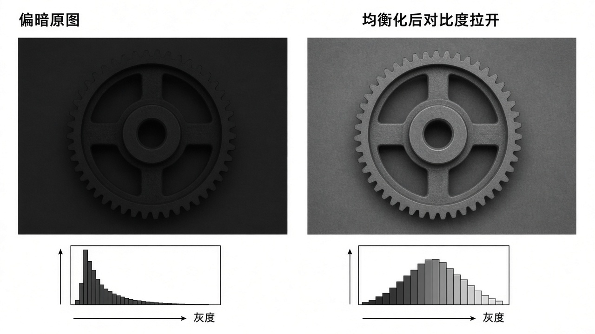
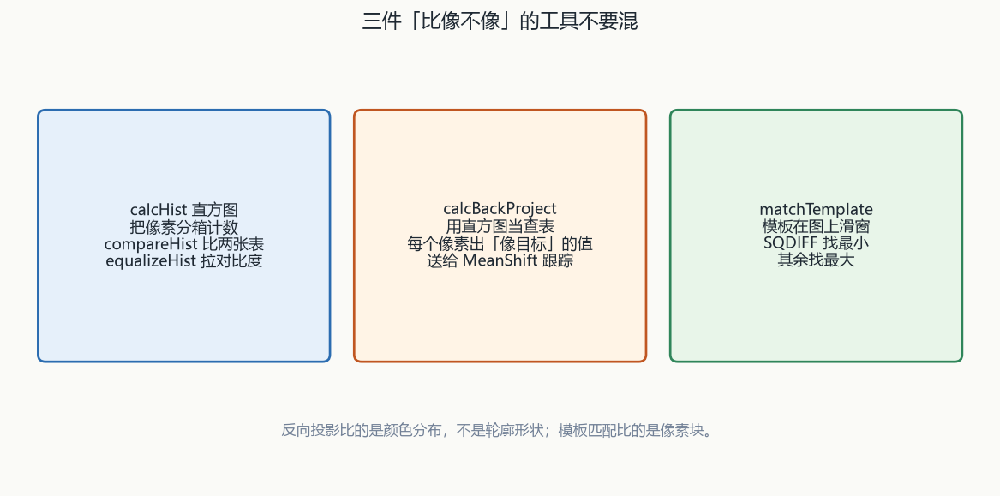
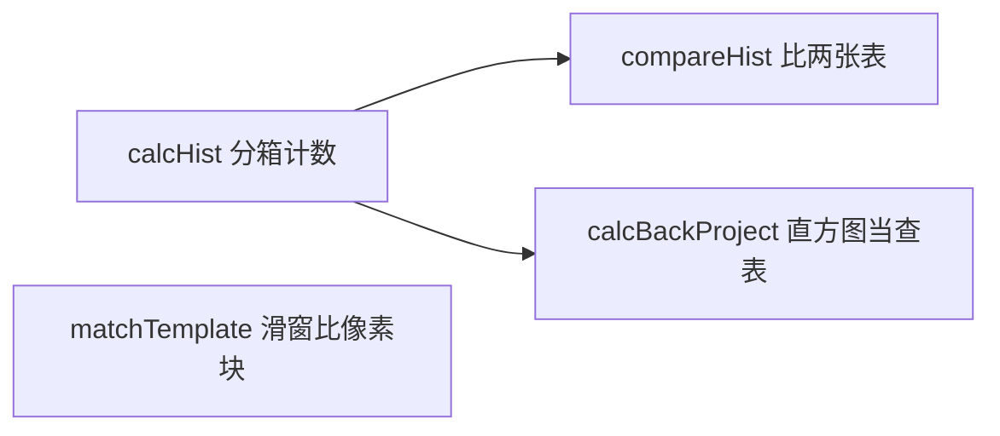
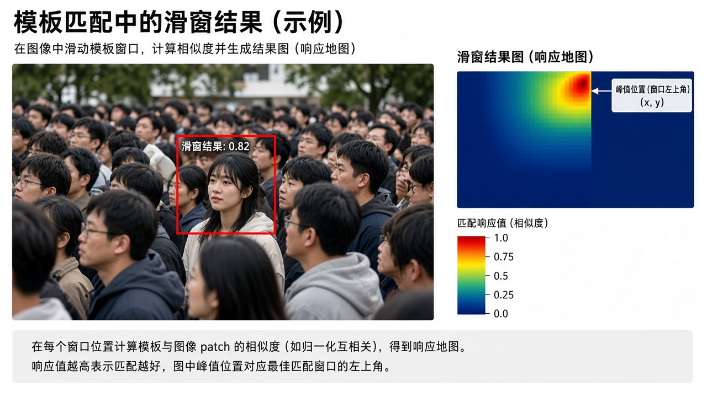

# 第6章 直方图与模板匹配

来源：文档2《opencv4快速入门》第4章「图像直方图与模板匹配」（书页 111–131 / 实测 PDF 116–136；用户给定 PDF 114–134 含上一章 3.8 小结页，正文自 PDF 116「第 4 章」起）。对应文档1：无对应主章节（跟踪章会用到反投影，不在本章从文档1展开）。扫描件 OCR 嘈杂；函数名按书中可辨识的 OpenCV 4 写法还原，吃不准处标【信息缺口】。

## 本章总览

直方图不再表示纹理，只统计像素取值。

学完应能回答：`calcHist` 并不负责画柱、要自己 `rectangle`、归一化 L1 和 INF 各代表什么、六种 `compareHist` 谁大谁小才算像、均衡化只能吃哪类图、直方图匹配为何没有现成函数、反向投影图亮的地方表示什么、`matchTemplate` 六种方法里哪两种要找最小值。

- **文档2侧重**：C++ 原型、归一化标志表、六种直方图比较、均衡化、自写匹配（CDF+LUT）、`calcBackProject`、六种模板匹配。
- **文档1侧重**：无对应主章节。

> 属于后续章，本章不展开：MeanShift / CamShift（融合第13章；反向投影会作为跟踪输入，本章只讲投影本身）。颜色空间转换、`minMaxLoc`、`LUT`、`resize` 的完整约束已在第3章，本章只按用到的程度点名。

> 📝待补全：【MeanShift / CamShift 跟踪】
>
> `calcBackProject` 得到像目标的概率图后，`meanShift` 窗口尺寸不变，`CamShift` 会改尺寸并给出角度。颜色要够独特。本章反向投影到此为止，不把投影扩成跟踪。
>
> 👉 完整深度讲解见第13章。

> 📝待补全：【HSV 与 `cvtColor` 细节】
>
> 反向投影例常用 HSV：H 范围约 0–179、S 0–255。存储默认仍是 BGR，须 `cvtColor`。非线性转换前 8U 宜先缩到 0–1。示例范围写成 `{0,180}` / `{0,256}`，注释写成 0–179 / 0–255。
>
> 👉 完整深度讲解见第3章。

> 📝待补全：【`minMaxLoc` 单通道约束】
>
> 只吃单通道。模板匹配结果图上用它找峰：SQDIFF 找最小，其余找最大。最值位置是第一次出现。无论输入几通道，`matchTemplate` 的结果都是单通道，所以可以直接交给它。
>
> 👉 完整深度讲解见第3章。

## 核心知识点

### 直方图是什么、怎么画（文档2 4.1）

图像直方图：横轴灰度值，纵轴个数或占比。同一物体旋转、平移后灰度集合仍可相同，故有平移 / 缩放不变性的优点，可看整体偏暗还是灰度挤在哪一段；特定条件下也能认数字。

它不携带纹理。通常灰度代表亮暗，所以直方图可用来谈对比度。

#### 只统计、不代画

OpenCV 4 只提供统计函数 `calcHist`，不提供现成的「画直方图」API。画柱要自己用矩形。

示例：先统计，再因某些灰度计数太大，把数目缩到约 1/20（正文）或 `cvRound(hist.at<float>(i-1)/15)`（清单 4-2，两处比例不一致【信息缺口：以哪次缩放为准只作示例，不是 API 约束】），画在 512×400 的黑底上。

`cvRound`：输入 `double`，返回四舍五入后的 `int`。作者建议：只统计单通道；多通道先分离再分别统计。

🔑 关键速记：`calcHist` 只出数组，柱状图是 `rectangle` 自己画。

#### `calcHist`

统计各灰度（或各维取值）出现次数。某灰度一次都没有则该箱为 0。下表给出 C++ 原型约束。

| 名称 | 功能 | 主要参数 | 约束&坑点 |
|---|---|---|---|
| `void cv::calcHist(const Mat* images, int nimages, const int* channels, InputArray mask, OutputArray hist, int dims, const int* histSize, const float** ranges, bool uniform=true, bool accumulate=false)` | 统计各灰度（或各维取值）出现次数 | `images`：同尺寸、同深度，深度只能 `CV_8U` / `16U` / `32F`，通道数可以不同。`nimages`：图个数。`channels`：要统计的通道下标；第一幅从 0 到 `images[0].channels()-1`，第二幅接着累加。`mask` 空 = 全图计入；非空须与图同尺寸且 `CV_8U`。`hist`：`dims` 维数组。`dims` 为整数且 ≤ `CV_MAX_DIMS`，OpenCV 4.0 / 4.1 为 32。`histSize`：每维箱数。`ranges`：每通道取值范围。`uniform` 默认均匀。`accumulate=true` 时不清空旧统计，用来叠多张图 | 某灰度一次都没有则该箱为 0。示例：灰度 `channels={0}`，范围 `{0,255}`，`bins={256}`，`dims=1` |

深度限 8U/16U/32F，通道数可以不同。`dims` ≤ 32（OpenCV 4.0 / 4.1）。`accumulate=true` 用来叠多张图。

🔑 关键速记：建议单通道统计；深度限 8U/16U/32F，维数 ≤32。

🔑 关键速记：直方图是分箱计数，不表示纹理；库只统计、不代画。

### 归一化（文档2 4.2.1）

只统计个数有两个麻烦：画布高度往往小于最大箱计数，每次都要另算缩小比；图一缩放，箱计数跟着变，两张「同一内容不同尺寸」的直方图会对不上。

改成占比（各箱 / 总像素，0–1）可比不同尺寸，但 8U 有 256 级，平均每级约 0.39%，柱太矮，常再乘一个倍数。另一种做法：全体除以最大箱值，压到 0–1。

#### 范数含义

两种归一化（以及更多范数）由 `normalize` 完成。归一化不改变分布形状，只改纵轴刻度。示例数组 `[2.0, 8.0, 10.0]`：

- `NORM_L1` → `[0.1, 0.4, 0.5]`（绝对值之和）
- `NORM_L2` → 约 `[0.154303, 0.617213, 0.771517]`（模长）
- `NORM_INF` → `[0.2, 0.8, 1]`（除以最大值）
- `NORM_MINMAX` → `[0, 0.75, 1]`（偏移到 0–1）

画直方图时：L1 占比再 ×30×图高；INF 用图高当 1。L1 ≈ 占比，INF ≈ 除以最大箱。

🔑 关键速记：归一化只改纵轴刻度，不改变分布形状。

#### `normalize`

按选定范数缩放数组。书称输出常为 `CV_32F`，可原地。

| 名称 | 功能 | 主要参数 | 约束&坑点 |
|---|---|---|---|
| `void cv::normalize(InputArray src, InputOutputArray dst, double alpha=1, double beta=0, int norm_type=NORM_L2, int dtype=-1, InputArray mask=noArray())` | 按选定范数缩放数组 | `alpha`：范围归一化时的下限标准值；正文又说「缩放到最大范围」。`beta`：范围归一化上限，标准范数不用它。`norm_type` 见表 4-1。`dtype<0` 则输出类型同 `src`，否则通道同 `src`、深度另设。`mask` 可选 | 书称输出常为 `CV_32F`，可原地。L1 = 各灰度占比；INF = 除以最大值到 0–1 |

`alpha` 在范围归一化时是下限；正文又说「缩放到最大范围」。`beta` 是范围归一化上限，标准范数不用它。

表 4-1（简记 OCR 部分空，L2SQR=5、MINMAX 书表印成「l2」疑为 32【信息缺口】）：

| 标志 | 简记 | 作用 |
|---|---|---|
| `NORM_INF` | 【OCR 空】 | 无穷范数，向量最大值 |
| `NORM_L1` | 2 | L1，绝对值之和 |
| `NORM_L2` | 4 | L2 / 模 |
| `NORM_L2SQR` | 5 | L2 平方 |
| `NORM_MINMAX` | 【OCR「l2」，疑 32】 | 偏移归一化 |

L1 简记 2、L2 简记 4、L2SQR 简记 5。`NORM_INF` 简记 OCR 空；`NORM_MINMAX` 书表印成「l2」，疑为 32【信息缺口】。

🔑 关键速记：要比图或要画柱，先 `normalize`；L1 给占比，INF 除以最大箱。

🔑 关键速记：箱计数跟分辨率走，不同尺寸先归一化再比。

### 直方图比较（文档2 4.2.2）

直方图像，不能反推两图一定像；但两图像，直方图一定相近。缩放后直方图不会逐箱相同，仍可很高相关，可作初筛。

#### `compareHist`

要求：同一种归一化之后、尺寸相同的两张直方图。返回 `double`。方法不同，数值含义不同。

| 名称 | 功能 | 主要参数 | 约束&坑点 |
|---|---|---|---|
| `double cv::compareHist(InputArray H1, InputArray H2, int method)` | 比较两直方图 | `H2` 与 `H1` 同尺寸。`method` 见表 4-2 | 不同尺寸图的像素数不同，必须先归一化再比 |

比较的是两张已算好的直方图，不是原图像素。不同尺寸必须先归一化再比。

表 4-2 六种直方图比较（Hellinger 与巴氏同值 3）：

| 标志 | 简记 | 名称 | 完全一致时（按书） | 越不像 |
|---|---|---|---|---|
| `HISTCMP_CORREL` | 0 | 相关法 | 1；完全不相关为 0 | 变小 |
| `HISTCMP_CHISQR` | 1 | 卡方 | 0 | 变大 |
| `HISTCMP_INTERSECT` | 2 | 相交法 | 不归一化：两张「自己比自己」也可因图而异；同一参照下越大越像 | 变小 |
| `HISTCMP_BHATTACHARYYA` | 3 | 巴氏距离 | 0 | 变大 |
| `HISTCMP_HELLINGER` | 3 | 与巴氏相同 | 同左 | 同左 |
| `HISTCMP_CHISQR_ALT` | 4 | 替代卡方 | 书称判据与巴氏相同，常替代巴氏做纹理比较 | 变大（按巴氏同类叙述） |
| `HISTCMP_KL_DIV` | 5 | 相对熵 / Kullback-Leibler 散度 | 0 | 变大 |

相关 / 相交：越大越像（相交还受原图尺度影响）。卡方 / 巴氏 / KL：越小越像（0 常表示全同）。Hellinger 与巴氏同值 3。公式编号 (4-1)–(4-7) OCR 残，上表只保留书中文字结论，不抄残式。

示例 `myCompareHist.cpp`：苹果原图、缩小一半、Lena 三张灰度直方图，用 `HISTCMP_CORREL`。自比 = 1；原图 vs 缩小 ≈ 0.998067；苹果 vs Lena 明显更低。

🔑 关键速记：先同法归一化、同尺寸；相关越大越像，卡方 / 巴氏 / KL 越小越像。

🔑 关键速记：直方图相近不能反推两图一定像，但两图像则直方图一定相近。

### 均衡化（文档2 4.3.1）

直方图挤在窄区间 → 对比度小、纹理看不清（例：120 与 121 肉眼不分；全图挤在 100–150 发糊）。把灰度范围拉开、加大相邻灰度差，叫均衡化。

#### `equalizeHist`

只能单通道灰度。接口不要求你先 `calcHist`。

| 名称 | 功能 | 主要参数 | 约束&坑点 |
|---|---|---|---|
| `void cv::equalizeHist(InputArray src, OutputArray dst)` | 直方图均衡化 | `src`：必须 `CV_8UC1`。`dst` 同尺寸同类型 | 只能单通道灰度。示例：偏暗齿轮图均衡后对比度上升，直方图更摊开 |

输入必须 `CV_8UC1`。示例：偏暗齿轮图均衡后对比度上升，直方图更摊开。

🔑 关键速记：均衡化自动摊平，只要 8 位单通道，无目标直方图。

🔑 关键速记：挤在窄区间就均衡化，但不能指定目标分布。

### 直方图匹配 / 规定化（文档2 4.3.2）

均衡化不能指定目标分布。把直方图映射成指定形状叫匹配或规定化：可有目的地增强某一灰度区间，多一个输入（目标分布），结果更灵活。

#### 累积概率最近邻映射

不同图像素数不同，要用概率。理想情况下匹配后与目标的累积概率一致。

\(F_n\) = 原图各灰度累积概率，\(G_r\)（书符号 OCR 残）= 目标累积概率。原灰度 \(n\) 映射到 \(r\) 的条件：选使 \(|F(n)-G(r)|\) 最小的 \(r\)（式(4-8) OCR 残，按后文「最小差值」还原）。

图 4-7 数值例子：目标在灰度 2 以下概率为 0，灰度 3 累积 0.16、灰度 4 累积 0.35；原图灰度 0 累积 0.19 离 0.16 比离 0 更近 → 映射到 3；灰度 1 累积 0.43 离 0.35 比离 0.64 更近 → 映射到 4。

实现：建 256×256 累积概率差表，对每个 \(n\) 找最小差对应的 \(r\)，写入 LUT，再 `LUT` 整图。`LUT` 完整约束见第3章。

🔑 关键速记：匹配是 CDF 最近邻映射，不是形态学顶帽。

#### 无官方匹配函数

OpenCV 4 没有直方图匹配函数，要按上述算法自写。

示例：偏暗图去匹配一幅较亮图的直方图，匹配后变亮、分布更匀，再用 `LUT`（第3章）应用映射。名称与形态学顶帽无关；本章匹配是灰度映射。

🔑 关键速记：库函数没有直方图匹配，用 CDF+LUT 自写。

🔑 关键速记：要指定目标分布就走匹配，不要指望 `equalizeHist`。

### 反向投影（文档2 4.3.3）

若某区域呈现一种纹理或独特形状，其直方图可看成该结构的概率模型。反向投影：记录给定图像各点如何贴合这个模型——先算特征直方图，再用它去原图里找「像不像」。

#### `calcBackProject`

参数几乎与 `calcHist` 对称，但输出是图不是直方图。

| 名称 | 功能 | 主要参数 | 约束&坑点 |
|---|---|---|---|
| `void cv::calcBackProject(const Mat* images, int nimages, const int* channels, InputArray hist, OutputArray backProject, const float** ranges, double scale=1, bool uniform=true)` | 直方图反向投影 | `images` 约束同 `calcHist`（`CV_8U`/`16U`/`32F`，同尺寸）。`hist`：模板直方图。`backProject`：与 `images[0]` 同尺寸同类型的单通道图。`scale`：输出比例因子。`uniform` 默认 true | 参数几乎与 `calcHist` 对称，但输出是图不是直方图 |

输出与 `images[0]` 同尺寸同类型的单通道图，和原图对齐，不是缩小一圈的结果图。

书上四步：① 加载模板图与待投影图；② 转颜色空间，常用灰度或 HSV；③ 算模板直方图（灰度一维，HSV 用 H-S 二维）；④ 把待投影图和模板直方图交给 `calcBackProject`。

示例：大图 `apple.jpg` 与从中截的 `sub_apple.jpg` → `COLOR_BGR2HSV` → H 箱 32、S 箱 32；H 范围 `{0,180}`（注释写 0–179），S 范围 `{0,256}`（注释写 0–255） → 对模板 `calcHist` 二维、`normalize` 到 255 后显示 → `calcBackProject`（`scale=1`）。反向投影亮处表示更像模板的色彩分布。

不要把反向投影扩成 MeanShift / CamShift：那是第13章。

🔑 关键速记：反向投影用直方图当查表，输出与原图对齐的概率图。

🔑 关键速记：投影对「直方图相同、样子不同」失效，亮处只表示更像模板的色彩分布。

### 模板匹配（文档2 4.4）

反向投影只看直方图。两块纹理不同但直方图一样时，投影没有参考价值。这时改为直接比像素，在大图上用与模板同尺寸的窗口滑动，记录每处相似度，取最佳窗口。

直方图、反向投影、模板匹配三件「比像不像」的工具不要混：比较的是两张已算好的直方图；反向投影用直方图当查表；模板匹配滑窗比像素块，不基于直方图。

#### 滑窗流程

流程：① 在待匹配图上取与模板同大的窗口；② 算窗口与模板的相似度；③ 窗口先向右再换行，记所有位置；④ 选相似度最大（或最小，取决于方法）的窗口。

🔑 关键速记：模板匹配直接比灰度，结果图比原图小一圈。

#### `matchTemplate`

灰、彩都支持。相似度写在窗口左上角对应的结果像素上。不把原图向外扩边。

| 名称 | 功能 | 主要参数 | 约束&坑点 |
|---|---|---|---|
| `void cv::matchTemplate(InputArray image, InputArray templ, OutputArray result, int method, InputArray mask=noArray())` | 滑窗模板匹配 | `image`：`CV_8U` 或 `CV_32F`。`templ` 同类型且不能大于原图。`result`：`CV_32F`。`method` 见表 4-3。`mask` 须与模板同类型同尺寸，默认不设；目前仅 `TM_SQDIFF` 与 `TM_CCORR_NORMED` 支持掩码 | 灰、彩都支持。相似度写在窗口左上角对应的结果像素上。原图 \(W\times H\)、模板 \(w\times h\) → 结果 \((W-w+1)\times(H-h+1)\)。无论输入几通道，结果都是单通道。不把原图向外扩边 |

输入 8U 或 32F，模板不能大于原图。结果 \((W-w+1)\times(H-h+1)\) 的 32F 单通道。`calcHist` 的 mask 管哪些像素进统计；`matchTemplate` 的 mask 管模板哪些位置参与，且只支持两种 method。

表 4-3 六种模板匹配方法，谁大谁小因方法而异：

| 标志 | 简记 | 方法 | 完全匹配 | 越差 |
|---|---|---|---|---|
| `TM_SQDIFF` | 0 | 平方差 | 0 | 越大 |
| `TM_SQDIFF_NORMED` | 【OCR 空，按序 1】 | 归一化平方差 | 0（结果约 0–1） | 越大 |
| `TM_CCORR` | 2 | 相关（乘法） | 越大越好；0 最差 | 越小 |
| `TM_CCORR_NORMED` | 3 | 归一化相关 | 1（约 0–1） | 0 为完全不匹配 |
| `TM_CCOEFF` | 4 | 系数匹配：模板减均值 × 图像减均值 | 越高越好，可为负 | 越低越小 |
| `TM_CCOEFF_NORMED` | 5 | 归一化相关系数 | 完全匹配为 1。完全不匹配的另一端 OCR 残【信息缺口：书称做了归一化】 | 需结合 `minMaxLoc` 看峰 |

仅平方差两类找最小，其余找最大。`TM_SQDIFF_NORMED` 简记 OCR 空，按序 1。`TM_CCOEFF` 先减均值再相关，减轻模板与原图整体亮度差。`TM_CCOEFF_NORMED` 完全不匹配的另一端 OCR 残【信息缺口：书称做了归一化】。

结果矩阵要用 `minMaxLoc` 找最大或最小，再以该点为左上角画与模板同大的矩形。示例 `myMatchTemplate.cpp`：`TM_CCOEFF_NORMED` + `minMaxLoc` 取最大点，红框标脸。

章末清单：`calcHist`、`normalize`、`compareHist`、`equalizeHist`、`calcBackProject`、`matchTemplate`。无直方图匹配官方函数。示例：`myCalcHist`、`myNormalize`、`myCompareHist`、`myEqualizeHist`、`myHistMatch`、`myCalcBackProject`、`myMatchTemplate`。

🔑 关键速记：SQDIFF 两类找最小，其余找最大；掩码仅 SQDIFF 与 CCORR_NORMED。

🔑 关键速记：直方图相同但样子不同时改用滑窗比像素，不要继续反向投影。

## 易混淆点&差异对比

下表对照统计、比较、投影、滑窗四条路，以及文档范围。跟踪里的反投影留给第13章。

| 点 | 说明 |
|---|---|
| 文档1 vs 文档2 | 对应文档1：无对应主章节。跟踪里的反投影留给第13章，不在本章从文档1补 |
| 统计 vs 绘图 | `calcHist` 只出数组；柱状图是 `rectangle` 自己画 |
| 个数 vs 占比 | 箱计数跟分辨率走；要比不同尺寸先 `normalize`。L1≈占比，INF≈除以最大箱 |
| `compareHist` vs `matchTemplate` vs 反向投影 | 比较的是两张已算好的直方图；模板匹配滑窗比像素块，不基于直方图；反向投影用直方图当查表，输出与原图对齐的概率图 |
| 谁大才算像 | 相关 / 相交：越大越像（相交还受原图尺度影响）。卡方 / 巴氏 / KL：越小越像（0 常表示全同）。模板匹配：仅平方差两类找最小，其余找最大 |
| 均衡化 vs 匹配 | 均衡化自动摊平，无目标直方图，且只要 8 位单通道。匹配可指定目标分布，库函数没有，用 CDF+LUT |
| 顶帽类形态学 vs 本章 | 名称无关；本章匹配是灰度映射，不是形态学顶帽 |
| `equalizeHist` vs `calcHist` | 均衡化内部会动分布，但接口不要求你先 `calcHist` |
| 反向投影 vs 模板匹配 | 投影对「直方图相同、样子不同」失效；模板匹配直接比灰度，结果图比原图小一圈 |
| 掩码 | `calcHist` 的 mask 管哪些像素进统计；`matchTemplate` 的 mask 管模板哪些位置参与，且只支持两种 method |
| MeanShift | 本章出现反向投影，不展开 MeanShift / CamShift |

文档1 无对应主章节；「谁大才算像」随方法反转，平方差是唯一要找最小的一类模板方法。

## 本章要点总结

- 直方图是分箱计数，不表示纹理；OpenCV 只统计、不代画。`calcHist` 深度限 8U/16U/32F，维数 ≤32（4.0/4.1），建议单通道。

- 要比图或要画柱，先 `normalize`。L1 给占比，INF 除以最大箱；形状不变。

- `compareHist` 六法（含 Hellinger=巴氏、替代卡方、KL）。先同法归一化、同尺寸。相关越大越像，卡方 / 巴氏 / KL 越小越像；相交越大越像但不跨图绝对可比。

- `equalizeHist` 仅 `CV_8UC1`。直方图匹配无 API：累积概率最近邻映射 → LUT。

- `calcBackProject` 输出与输入对齐的单通道图；HSV 例 H∈[0,180)、S∈[0,256)。到跟踪算法为止，见第13章。

- `matchTemplate`：8U 或 32F，模板不大过原图，结果 \((W-w+1)\times(H-h+1)\) 的 32F 单通道。SQDIFF 两类找最小，其余找最大。掩码仅 SQDIFF 与 CCORR_NORMED。
