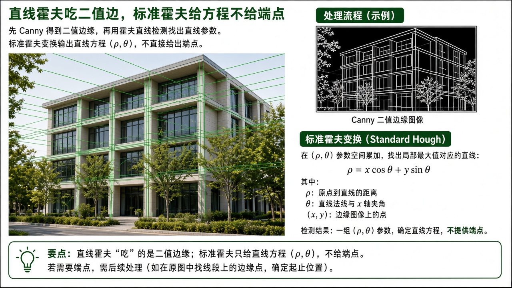
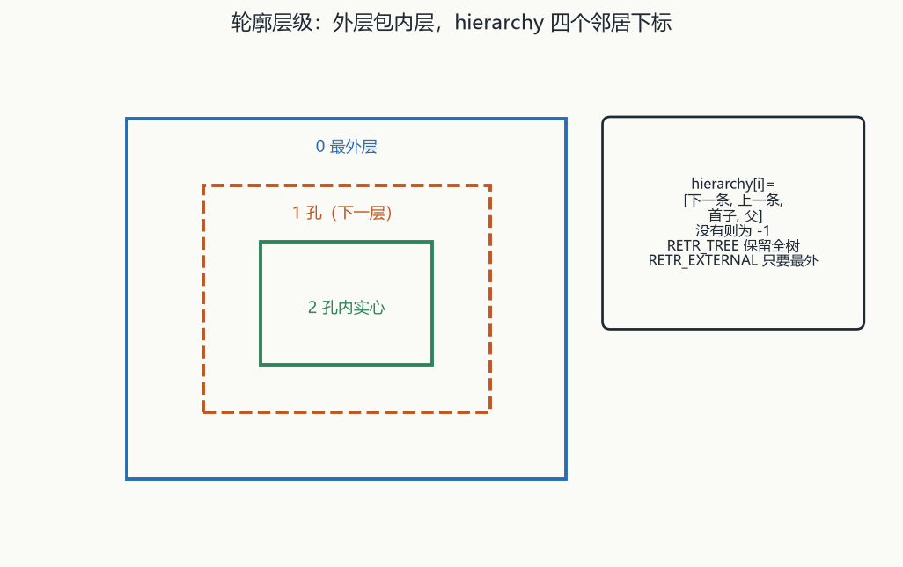
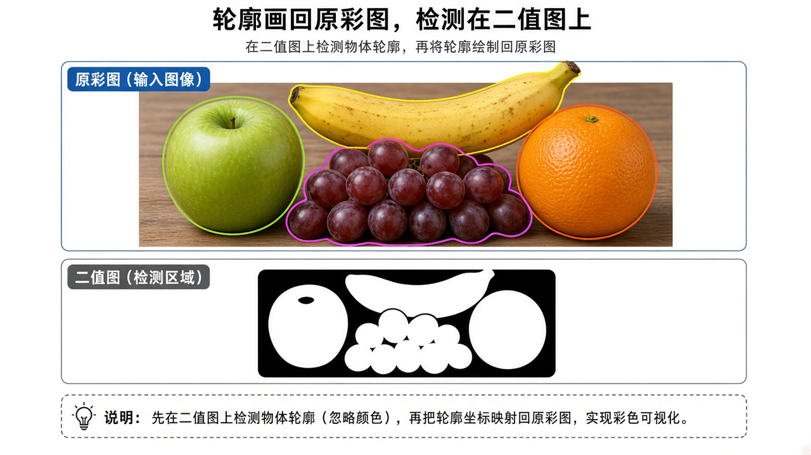

# 第7章 轮廓、形状检测与二维码

来源：文档1《OpenCV 4计算机视觉:Python语言实现（原书第3版）》第3章 仅 3.9 轮廓、3.10 霍夫/形状（PDF 112–132；3.8 Canny 细节已在融合第4章，本章不重读；3.3 DFT / 3.11 小结后的深度估计不读）；文档2《opencv4快速入门》第7章「目标检测」（用户给定书页 208–251 / PDF ~211–254；实测分篇题 PDF 212、章标题 PDF 213 书页约 210，7.6 小结 PDF 256–257 书页约 253–254，第8章标题 PDF 258。正文自 PDF 213「第7章」起）。扫描件 OCR 嘈杂，函数名按书中可辨识的 OpenCV 4 写法还原；吃不准处标【信息缺口】。

## 本章总览

形状是物体比较稳的外观线索：先找直线和圆，再沿边缘抽出带层次的轮廓，最后用面积、周长、外接多边形、凸包、矩去描述，必要时把一堆点包进三角形或圆，或把 QR 四个角点读出来解码。

学完应能回答：标准霍夫和概率霍夫各给出什么、圆检测为何直接吃灰度、轮廓的 `RETR_*` 和 `CHAIN_APPROX_*` 各管什么、正放外接框和可旋转最小框差在哪、点到轮廓的有向距离怎么读、Hu 矩匹配比的是什么、QR 的 `detect` / `decode` / `detectAndDecode` 何时该拆开用。

- **文档2侧重**：C++ 原型、霍夫四种直线/圆入口、轮廓全套统计与拟合、几何矩/Hu/`matchShapes`、点集外包、`QRCodeDetector`。本章几乎全部参数表来自文档2。
- **文档1侧重**：Python 轮廓三参数调用、边框/`minAreaRect`/最小外接圆、Douglas-Peucker 与凸包直觉、霍夫线/圆概念。多数函数没有完整 Python 原型。

> 属于后续章，本章不展开：分水岭 / GrabCut / 漫水填充（融合第8章）；角点与 SIFT/SURF/ORB（融合第9章）；Canny 双阈值细节（融合第4章，霍夫前只当二值边来源点名）；形态学开运算/膨胀（融合第5章，示例里用来连边或去碎块）。

> 📝待补全：【分水岭 / GrabCut】
>
> 复杂图上阈值+轮廓不够。watershed 要彩图+CV_32S 种子，输出 −1 是坝。grabCut 掩码 0/1 确定、2/3 可能。文档1 3.9 末点到更复杂算法，本章不读分割原型。
>
> 👉 完整深度讲解见第8章。

> 📝待补全：【特征点检测】
>
> 形状检测不升级到关键点。角点/SIFT/SURF/ORB 走 detect→描述子→匹配。本章只到轮廓、霍夫、矩和 QR 四角。
>
> 👉 完整深度讲解见第9章。

> 📝待补全：【Canny 完整原型】
>
> 霍夫前常用 Canny 得边。双阈值约 2:1～3:1，输入 8U，输出单通道 8U。圆检测内部自己调 Canny，不要先二值。本章只当霍夫/轮廓前处理点名。
>
> 👉 完整深度讲解见第4章。

## 核心知识点

### 直线检测：霍夫把「找线」变成「找峰值」（文档2 7.1.1 / 文档1 3.10.1）

【文档2观点】笛卡尔式 \(y=kx+b\) 过一点对应 \(k\)-\(b\) 空间一条直线；同一直线上的点交于同一参数点。竖直线斜率无穷，\(k\)-\(b\) 空间互相平行交不上，故改用极坐标 \(r=x\cos\theta+y\sin\theta\)（\(r\) 为原点到直线距离，\(\theta\) 为该垂线与 \(x\) 轴夹角）。

优点：残缺、噪声、间隙不敏感；缺点：时/空复杂度高，精度受离散间隔制约。

【文档1观点】霍夫由 Hough 提出，Duda & Hart 推广。`HoughLines` 是标准霍夫，输出「一点+角度」、无端点；`HoughLinesP` 是概率霍夫（只抽点子集体估计共线概率），更快，输出两端点。Canny 不是硬性要求，但是去噪后的边是理想输入。

#### 投票四步

霍夫变换四步（文档2）：① 把 \(\theta\)、\(r\) 轴离散成格子；② 每个非零像素给它穿过的格子投票；③ 票数过阈值的格子当作直线；④ 用格子参数还原图像直线。

🔑 关键速记：找线变成在 \((r,\theta)\) 格子里找峰值。

#### `HoughLines`

标准/多尺度霍夫，输出极坐标直线。只给解析式，不给端点。输入必须 `CV_8U` 单通道二值。

| 名称 | 功能 | 主要参数 | 约束&坑点 |
|---|---|---|---|
| `void cv::HoughLines(InputArray image, OutputArray lines, double rho, double theta, int threshold, double srn=0, double stn=0, double min_theta=0, double max_theta=CV_PI)` | 标准/多尺度霍夫，输出极坐标直线 | `image`：必须 `CV_8U` 单通道二值。`lines`：`N×2` 的 `vector<Vec2f>`，每行 `(r, θ)`，原点在图像左上角。`rho`：\(r\) 离散步长（像素），常 1。`theta`：\(\theta\) 离散步长（弧度），常 `CV_PI/180`。`threshold`：累加器门槛，越大线越长、越少。`srn`/`stn`：多尺度时粗分辨率除数，精确分辨率为 `rho/srn`、`theta/stn`；同时为 0 = 标准霍夫，须非负。`min_theta`/`max_theta`：角度范围，默认 0～`CV_PI`（书给出 π 的长小数） | 只给解析式，不给端点；画线要自己从 `(r,θ)` 算出尽量远的两点再 `line`。彩图/灰度须先 Canny 再二值。两角度须 ≥0 且 ≤`CV_PI`，且最小 < 最大。示例累加器 50 vs 150：小门槛短线也会出 |

`srn=stn=0` 为标准霍夫。两角度须 ≥0 且 ≤`CV_PI`，且最小 < 最大。示例累加器 50 vs 150：小门槛短线也会出。

🔑 关键速记：标准霍夫给 \((r,\theta)\) 无穷长直线，原点在图像左上角。

#### `HoughLinesP`

渐进概率霍夫，输出线段两端点。条目标题 OCR 曾印 `CV_8C`，后文明确 `CV_8U`。

| 名称 | 功能 | 主要参数 | 约束&坑点 |
|---|---|---|---|
| `void cv::HoughLinesP(InputArray image, OutputArray lines, double rho, double theta, int threshold, double minLineLength=0, double maxLineGap=0)` | 渐进概率霍夫，输出线段两端点 | `image`：必须 `CV_8U` 单通道二值（条目标题 OCR 曾印 `CV_8C`，后文明确 `CV_8U`）。`lines`：`N×4` 的 `vector<Vec4i>`，`(x1,y1,x2,y2)`。`minLineLength`：短于此的丢掉。`maxLineGap`：同一直线上相邻点最大间距，倾斜长线宜加大 | 能定位线段。示例同一图 `maxLineGap` 10 vs 30，大者斜线更完整 |

`minLineLength` 丢掉太短的段；`maxLineGap` 管同一直线上相邻点最大间距，倾斜长线宜加大。示例同一图 10 vs 30，大者斜线更完整。

【文档1观点】`HoughLinesP` 参数：图；`rho` 像素步长、`theta` 弧度步长（例 `rho=1` 且 `theta=π/180` 表示 1 像素、1 度）；`threshold` 是投票箱门槛；再加上 `minLineLength`、`maxLineGap`。文档1示例段落先写 `HoughLines` 吃单通道二值+Canny，随后列出的却是带端点约束的参数，把标准/概率两套搅在一段里。

🔑 关键速记：概率霍夫给端点；`maxLineGap` 加大才能把斜长线连完整。

#### `HoughLinesPointSet`

在二维点集里用标准霍夫找直线。不是整图，是点坐标。无默认值，十个参数都要传。

| 名称 | 功能 | 主要参数 | 约束&坑点 |
|---|---|---|---|
| `void cv::HoughLinesPointSet(InputArray _point, OutputArray _lines, int lines_max, int threshold, double min_rho, double max_rho, double rho_step, double min_theta, double max_theta, double theta_step)` | 在二维点集里用标准霍夫找直线 | `_point`：平面二维点，`CV_32FC2` 或 `CV_32SC2`（可用 `vector<Point2f>` / `Point2i`）。`_lines`：`1×N`、`CV_64FC3`，每条 `(权重, r, θ)`，按权重大到小。`lines_max`：最多出几条。`min_rho`/`max_rho`：书称「检测直线长度」的距离范围（像素）。`rho_step`/`theta_step`：离散步长 | 不是整图，是点坐标。`lines_max` 过大可能掺进权重很小的线。无默认值，十个参数都要传 |

输出按权重大到小。`lines_max` 过大可能掺进权重很小的线。

🔑 关键速记：点集霍夫吃坐标不吃图，输出带权重的 \((r,\theta)\)。

🔑 关键速记：直线霍夫必须二值边；标准给方程，概率给端点，点集给带权直线。

### 直线拟合：已知共线、只拟合一条（文档2 7.1.2）

检测是「有没有线、可能有多条」；拟合是「这些点该落在哪一条上」，用最小二乘 M-estimator，保证点到直线距离整体最小。文档1无此节。

#### `fitLine`

只出一条线。二维输出 `Vec4f`：\((v_x,v_y,x_0,y_0)\)，前两维是与直线共线的归一化向量，后两维是直线上一点。

| 名称 | 功能 | 主要参数 | 约束&坑点 |
|---|---|---|---|
| `void cv::fitLine(InputArray points, OutputArray line, int distType, double param, double reps, double aeps)` | 拟合距离全体点最近的一条直线 | `points`：二维或三维点，`vector<>` 或 `Mat`。二维输出 `Vec4f`：\((v_x,v_y,x_0,y_0)\)，前两维是与直线共线的归一化向量，后两维是直线上一点，点斜式 \(y=\frac{v_y}{v_x}(x-x_0)+y_0\)。三维输出 `Vec6f`：\((v_x,v_y,v_z,x_0,y_0,z_0)\)。`distType` 见表 7-1。`param`：部分距离的数值 \(C\)，0 = 自动选最佳。`reps`：原点到直线的距离精度，0=自适应，一般 0.01。`aeps`：角度精度，0=自适应，一般 0.01 | 只出一条线。示例：`y=x` 上加点噪声，`DIST_L1`，`param=0`，`reps=aeps=0.01` |

`param=0` 自动选最佳 \(C\)。`reps`/`aeps` 一般 0.01。示例：`y=x` 上加点噪声，`DIST_L1`。

表 7-1 `distType`（简记以书表为准；公式 OCR 残，只落实标志名）：

| 标志 | 简记 | 距离（书） |
|---|---|---|
| `DIST_L1` | 【OCR 空】 | \(p(r)=r\)。示例用此 |
| `DIST_L2` | 2 | \(p(r)=r^2/2\) |
| `DIST_L12` | 4 | 书印 \(2(\sqrt{\cdot}-1)\) 一类【信息缺口：式 OCR 残】 |
| `DIST_FAIR` | 5 | 【信息缺口：式 OCR 残】 |
| `DIST_WELSCH` | 6 | 分段，当 \(r<C\) 等【信息缺口】 |
| `DIST_HUBER` | 7 | 分段，\(C\) 相关【信息缺口】 |

L2=2、L12=4、FAIR=5、WELSCH=6、HUBER=7。`DIST_L1` 简记 OCR 空。L12 / FAIR / WELSCH / HUBER 公式 OCR 残，不要硬背。

🔑 关键速记：`fitLine` 假定点已共线，只拟合一条，不是检测有几条。

🔑 关键速记：检测问「有没有线」，拟合问「这些点落在哪一条上」。

### 圆检测（文档2 7.1.3 / 文档1 3.10.2）

圆参数 \((a,b,R)\)，\(x=a+R\cos\theta\)，\(y=b+R\sin\theta\)。霍夫同样投到参数空间找交点。

#### `HoughCircles`

必须 `CV_8UC1` 灰度，内部自己调 Canny，不要先二值。与直线霍夫输入不同。

| 名称 | 功能 | 主要参数 | 约束&坑点 |
|---|---|---|---|
| `void cv::HoughCircles(InputArray image, OutputArray circles, int method, double dp, double minDist, double param1=100, double param2=100, int minRadius=0, int maxRadius=0)` | 霍夫找圆 | `image`：必须 `CV_8UC1` 灰度，内部自己调 Canny，不要先二值。`circles`：`vector<Vec3f>`，\((x,y,radius)\)。`method`：目前仅 `HOUGH_GRADIENT`。`dp`：累加器分辨率相对原图的反比；`dp=1` 同分辨率，`dp=2` 宽高各减半。`minDist`：两圆心最小距离；太小会在真圆旁再检出一圈假圆，太大漏圆。`param1`：交给内部 Canny 的较大阈值，较小阈值默认为其一半。`param2`：圆心累加门槛，越大越精确、越少。`minRadius`≥0，默认 0。`maxRadius` 任意；≤0 时最大半径取图像尺寸最大值，且结果只出圆心、不出半径 | 与直线霍夫输入不同：直线要二值边，圆要灰度。示例：硬币图，`dp=2`，`minDist=10`，两 param 100，半径 20–100 |

`param1` 是内部 Canny 的较大阈值，较小阈值默认为其一半。`maxRadius≤0` 时书称只出圆心、不出半径，与默认「三个数 \((x,y,r)\)」不是同一输出形态。

【文档1观点】工作方式类似 `HoughLines`，但丢掉的是「圆心最小间距」以及半径最小/最大，而不是线段长/间隙。

🔑 关键速记：圆检测吃灰度不吃二值，`HOUGH_GRADIENT`，`minDist` 管圆心间距。

🔑 关键速记：直线要二值边，圆要灰度；混用会空结果或乱结果。

### 轮廓发现与绘制（文档2 7.2.1 / 文档1 3.9）

轮廓 = 带结构关系的边缘。层级：外层包围内层则级别更高；互不包含且被同一外轮廓包住的是同级。

#### 层次四元组

每个轮廓用 4 个数描述层次：`hierarchy[i] = [同层下一条, 同层上一条, 下一层首子, 上层父]`，没有则 -1。

文档2 图 7-14 示例：0 号无同级无父 → `[-1, -1, 1, -1]`；1 号下一同级为 2、无上一同级、子为 3、父为 0 → `[2, -1, 3, 0]`。

【文档1观点】轮廓还服务于多边形边界、近似形状、ROI。Python `findContours` 三个参数：输入图、层次类型、逼近方法；返回两个元素：轮廓和层次。`cv2.RETR_TREE` 取完整内外结构；只关心最外层用 `cv2.RETR_EXTERNAL`（物体在普通背景上、不搜内部时合适）。检测在阈值图上做，颜色已丢，画回原彩图。

🔑 关键速记：`hierarchy` 四个下标，缺席为 -1；TREE 留全树，EXTERNAL 只要最外层。

#### `findContours`

理论要二值。非零当作 1、0 保持，故也能吃非二值灰度，但默认这种「二值化」留不住主要内容，常先 `threshold` / `adaptiveThreshold`。

| 名称 | 功能 | 主要参数 | 约束&坑点 |
|---|---|---|---|
| `void cv::findContours(InputArray image, OutputArrayOfArrays contours, OutputArray hierarchy, int mode, int method, Point offset=Point())` | 找轮廓并给层次 | `image`：`CV_8U` 单通道灰度或二值；非零当作 1、0 保持，故也能吃非二值灰度，但默认这种「二值化」留不住主要内容，常先 `threshold` / `adaptiveThreshold`。`contours`：`vector<vector<Point>>`。`hierarchy`：`vector<Vec4i>`，条数=轮廓数。`mode` 见表 7-2。`method` 见表 7-3。`offset`：每个轮廓点平移，用于 ROI 里找轮廓、再按整图坐标分析 | 理论要二值。第二套原型去掉 `hierarchy`，省内存。文档2未写会改写源图（与部分旧版手册不同，本章不按旧说） |
| `void cv::findContours(InputArray image, OutputArrayOfArrays contours, int mode, int method, Point offset=Point())` | 只要轮廓、不要层次 | 其余同上 | 不关心拓扑时用 |

文档2 未写会改写源图（与部分旧版手册不同，本章不按旧说）。`offset` 用于 ROI 里找轮廓、再按整图坐标分析。Python 三参数 vs C++ 六/五参数：不要把 Python 参数个数套到 C++ 上。

表 7-2 `mode`（`RETR_*`）管层次怎么建：

| 标志 | 简记 | 含义 |
|---|---|---|
| `RETR_EXTERNAL` | 【OCR 空】 | 只检测最外层；书称对所有轮廓把 hierarchy 置为 -1 |
| `RETR_LIST` | 【OCR 空】 | 取全部轮廓放进 list，不建等级 |
| `RETR_CCOMP` | 2 | 全部轮廓，组织成双层：顶层=连通域外边界，次层=孔的内边界 |
| `RETR_TREE` | 3 | 全部轮廓，重建树状结构 |

`RETR_*` 管层次。EXTERNAL / LIST 简记 OCR 空；CCOMP=2、TREE=3。

表 7-3 `method`（`CHAIN_APPROX_*`）管轮廓留哪些点：

| 标志 | 简记 | 含义 |
|---|---|---|
| `CHAIN_APPROX_NONE` | 【OCR 空】 | 保留每个轮廓像素；相邻点满足 \(\max(\|x_2-x_1\|,\|y_2-y_1\|)=1\)（书印 `>=1`，按链码一步理解） |
| `CHAIN_APPROX_SIMPLE` | 2 | 压掉水平/垂直/对角上的中间点，只留该方向终点；矩形往往 4 个点就够 |
| `CHAIN_APPROX_TC89_L1` | 3 | Teh-Chin 链逼近之一 |
| `CHAIN_APPROX_TC89_KCOS` | 4 | Teh-Chin 链逼近之另一 |

`CHAIN_APPROX_*` 管留点。NONE 简记 OCR 空；书印 `>=1`，按链码一步理解。SIMPLE=2 时矩形往往 4 个点就够。

🔑 关键速记：`RETR_*` 管层次，`CHAIN_APPROX_*` 管留点；常先阈值再找轮廓。

#### `drawContours`

会改传入的图。`contourIdx` 负数 = 画全部；`thickness` 负 = 填充内部。

| 名称 | 功能 | 主要参数 | 约束&坑点 |
|---|---|---|---|
| `void cv::drawContours(InputOutputArray image, InputArrayOfArrays contours, int contourIdx, const Scalar& color, int thickness=1, int lineType=LINE_8, InputArray hierarchy=noArray(), int maxLevel=INT_MAX, Point offset=Point())` | 把轮廓画上 | `contourIdx`：负数 = 画全部；否则画该下标，须小于轮廓总数。`thickness` 负 = 填充内部。`lineType` 见表 7-4，默认 `LINE_8`。`maxLevel`：0 只画指定轮廓，1 含嵌套一层，2 再嵌套，依此类推，默认 `INT_MAX`。`offset`：整体平移再画 | 会改传入的图。单通道用 `Scalar(x)`，三通道 `Scalar(x,y,z)` |

【文档1观点】`drawContours` 第 2 参是轮廓数组，一次可画多条；一组点若表示多边形，须再包一层数组。第 3 参索引：-1 画全部。最后两参通常是 BGR 颜色和线宽（像素）。函数像其它绘图一样改原图。文档1 用 -1，文档2 说负数都画全部。

表 7-4 `lineType`（简记 OCR 疑把枚举序号印成 3/4，以名称含义为准）：

| 类型 | 简记（书表） | 含义 |
|---|---|---|
| `LINE_4` | 【与 4 连通并列】 | 4 连通 |
| `LINE_8` | 书表印 3 | 8 连通（默认） |
| `LINE_AA` | 书表印 4 | 抗锯齿 |

以名称含义为准：`LINE_8` 书表印 3，`LINE_AA` 书表印 4。默认 8 连通。

🔑 关键速记：线宽为负则填实；文档1 用 -1 画全部，文档2 说负数都行。

🔑 关键速记：轮廓带层次，先选 RETR 模式再决定要不要 `hierarchy`。

### 面积与周长（文档2 7.2.2–7.2.3 / 文档1 用 `arcLength` 给 ε）

面积单位为像素，由相邻点连成的多边形围成。只需顶点即可（直角三角形给 3 顶点，或再加斜边中点，面积仍等于三角形面积）。面积:周长² = 1:16 时书称该区域为正方形。

#### `contourArea`

返回 `double`。三点共线不贡献面积。

| 名称 | 功能 | 主要参数 | 约束&坑点 |
|---|---|---|---|
| `double contourArea(InputArray contour, bool oriented=false)` | 轮廓围成面积 | `contour`：`vector<Point>` 或 `Mat`。`oriented=true`：面积有方向，顺时针与逆时针互为相反数；`false`（默认）输出绝对值 | 返回 `double`。三点共线不贡献面积 |

`oriented=true` 时顺时针与逆时针互为相反数；默认输出绝对值。

🔑 关键速记：面积默取绝对值；三点共线不贡献面积。

#### `arcLength`

返回像素为单位的 `double`。文档2 未写默认值，两参数都要传。

| 名称 | 功能 | 主要参数 | 约束&坑点 |
|---|---|---|---|
| `double arcLength(InputArray curve, bool closed)` | 轮廓周长或曲线长 | `curve`：二维点，`vector<Point>` 或 `Mat`。`closed=true` 闭合（含首尾边）；`false` 只把点依次连起来（三角形 ABC 只计 AB+BC，不计 CA） | 返回像素为单位的 `double`。文档2未写默认值，两参数都要传。文档1用 `arcLength` 取周长，再把 ε 设成周长的 1% |

`closed=true` 含首尾边；`false` 时三角形 ABC 只计 AB+BC，不计 CA。文档1 用周长的 1% 当 ε。

🔑 关键速记：是否闭合差一条闭合边；两参数都要传。

🔑 关键速记：面积可定向，周长看开闭；正方判断用面积:周长² = 1:16。

### 外接矩形与多边形逼近（文档2 7.2.4 / 文档1 3.9.1–3.9.2）

最大外接矩形：X/Y 两端像素，边与图像轴平行。最小外接矩形：四边都挨轮廓，可旋转。多边形逼近比矩形更贴圆等形状。

#### `boundingRect`

轴对齐最大外接矩形。返回 `Rect`：左上角坐标 + 宽高，可直接 `rectangle`。

| 名称 | 功能 | 主要参数 | 约束&坑点 |
|---|---|---|---|
| `Rect boundingRect(InputArray array)` | 轴对齐最大外接矩形 | 灰度图 `Mat`，或二维点 `vector<Point>` / `Mat` | 返回 `Rect`：左上角坐标 + 宽高，可直接 `rectangle` |

边平行于轴、面积往往偏大。输入可以是灰度图或二维点。

🔑 关键速记：正放框边平行于轴，面积往往偏大。

#### `minAreaRect`

可旋转最小外接矩形。返回中心、宽高、旋转角。

| 名称 | 功能 | 主要参数 | 约束&坑点 |
|---|---|---|---|
| `RotatedRect minAreaRect(InputArray points)` | 可旋转最小外接矩形 | 二维点集 | 返回中心、宽高、旋转角。`rrect.points(pts)` 填 4 个 `Point2f` 顶点；`rrect.center` 为 `Point2f` 中心 |

【文档1观点】没有「从轮廓直接给出最小矩形四个顶点」的函数，须先 `minAreaRect` 再算顶点；顶点是浮点，绘图按整数像素，要转换。可贴斜物。

🔑 关键速记：旋转框可贴斜物；四个顶点是浮点，绘图要转整数。

#### `approxPolyDP`

Douglas-Peucker 多边形逼近。用顶点数：3 三角、4 矩形、8 标 `poly-8`，再多当圆（示例逻辑，不是 API 保证）。

| 名称 | 功能 | 主要参数 | 约束&坑点 |
|---|---|---|---|
| `void cv::approxPolyDP(InputArray curve, OutputArray approxCurve, double epsilon, bool closed)` | Douglas-Peucker 多边形逼近 | `curve`：轮廓点。`approxCurve`：顶点，书称 `CV_32SC2` 的 \(N\times1\) `Mat`，顶点数可初步判断形状。`epsilon`：原始曲线与逼近曲线之间的最大距离。`closed=true`：末顶点连回首顶点 | 示例 `epsilon=4`、`closed=true`。用顶点数：3 三角、4 矩形、8 标 `poly-8`，再多当圆（示例逻辑，不是 API 保证） |

【文档1观点】`approxPolyDP` 三参数：轮廓、ε、是否闭合。ε = 近似多边形周长与原始轮廓周长之差的最大值，越小越贴原轮廓；示例取原弧长的 1%。`minEnclosingCircle` 返回二元组：第一元是圆心坐标元组，第二元是半径。

> 📝待补全：【`epsilon` 究竟是「点到边最大距离」还是「周长差」】
>
> approxPolyDP 的 ε：文档2=点到边最大距离，文档1写成两周长之差。以易混淆点对照为准，不要合成一个公式。调参时两边都要试，不要只背一个。
>
> 👉 该细节两书表述不一致，暂不强行统一，完整对照见本章「易混淆点」。

🔑 关键速记：ε 两书说法不一致，不要合成一个公式。

🔑 关键速记：正放框偏大，旋转框可贴斜，折线逼近用 `approxPolyDP`。

### 点到轮廓（文档2 7.2.5）

用来看点在轮廓里外、两点/两轮廓距离。文档1无专节。

#### `pointPolygonTest`

`measureDist=true`：有向距离，内正外负。`false`：只判位置，内 = 1，边上 = 0，外 = -1。

| 名称 | 功能 | 主要参数 | 约束&坑点 |
|---|---|---|---|
| `double pointPolygonTest(InputArray contour, Point2f pt, bool measureDist)` | 点到轮廓最短距离或里外判定 | `contour`：`vector<Point>` 或 `Mat`。`measureDist=true`：有向距离，内正外负。`false`：只判位置，内 = 1，边上 = 0，外 = -1 | 返回 `double`。示例对每个轮廓测外部一点和该轮廓 `minAreaRect` 中心 |

条目标题把 `measureDist` 写成「是否具有方向性」，后文 `false` 分支其实是离散里外标记，不是绝对值距离。【信息缺口：`false` 时是否仍可能返回非 ±1/0，本章未写】

🔑 关键速记：`true` 连续有向距离，`false` 是 1/0/-1 里外标记。

🔑 关键速记：看点在里外用 `pointPolygonTest`，不要把 `false` 当成无方向像素距离。

### 凸包（文档2 7.2.6 / 文档1 3.9.2）

把点集最外层点连成凸多边形。也是多边形逼近，但结果一定凸。人手、海星等复杂形常用。

#### `convexHull`

`clockwise=true` 顺时针，默认逆时针。`returnPoints=true`（默认）输出顶点坐标；`false` 输出顶点索引。

| 名称 | 功能 | 主要参数 | 约束&坑点 |
|---|---|---|---|
| `void cv::convexHull(InputArray points, OutputArray hull, bool clockwise=false, bool returnPoints=true)` | 二维点集/轮廓的凸包 | `clockwise=true` 顺时针，`false`（默认）逆时针。`returnPoints=true`（默认）输出顶点坐标 `vector<Point>`；`false` 输出顶点索引 `vector<int>` | 输入 `vector<Point>` 或 `Mat`。示例：手部二值 → 开运算去碎块 → 轮廓 → 默认参数凸包，画顶点与边 |

示例：手部二值 → 开运算去碎块 → 轮廓 → 默认参数凸包。开运算完整约束见第5章。

【文档1观点】一行表达式。同图画：凸包包住整个主体，近似多边形最靠内，中间是带弧的原始轮廓。阈值+轮廓只适合少物体、少颜色的简单图。

🔑 关键速记：凸包保证凸、可能比原轮廓「鼓」一圈。

🔑 关键速记：文档1 图上凸包最外、原轮廓居中、近似多边形最内。

### 几何矩、Hu 矩、轮廓匹配（文档2 7.3）

几何矩 \(m_{ji}=\sum I(x,y)\,x^j y^i\)（书式 7-8；下标顺序以书为准）。零阶 \(m_{00}\)；质心书式 (7-9)：\(\bar x=m_{10}/m_{00}\)，\(\bar y=m_{01}/m_{00}\)（正文有一句「零阶矩可以用于计算质心」，与公式不符，以公式为准）。

中心矩相对质心；再按式 (7-11) 归一化。Hu 矩由二阶和三阶中心矩得到 7 个不变矩，具有旋转、平移、缩放不变性；式 (7-12) OCR 残，不抄公式。文档1无矩专节。

#### `moments`

`binaryImage` 是否把所有非零当 1；只在输入是图像时生效，对点集轮廓无效。

| 名称 | 功能 | 主要参数 | 约束&坑点 |
|---|---|---|---|
| `Moments moments(InputArray array, bool binaryImage=false)` | 几何矩、中心矩、归一化中心矩 | `array`：二维点集或单通道 `CV_8U` 图。`binaryImage`：是否把所有非零当 1；只在输入是图像时生效 | 返回 `Moments`。空间矩：`m00,m10,m01,m20,m11,m02,m30,m21,m12,m03`。中心矩：`mu20,mu11,mu02,mu30,mu21,mu12,mu03`（无 `mu00/mu10/mu01`）。归一化：`nu20,nu11,nu02,nu30,nu21,nu12,nu03`。示例对轮廓 `moments(contour, true)` |

空间矩含 `m00` 等十项；中心矩无 `mu00/mu10/mu01`。质心用 \(m_{10}/m_{00}\)、\(m_{01}/m_{00}\)，不是单独用零阶矩。

🔑 关键速记：质心用 \(m_{10}/m_{00}\) 与 \(m_{01}/m_{00}\)，不要单独用零阶矩。

#### `HuMoments`

Hu 矩写入长度 7 的数组或 `Mat`。两套只是输出容器不同。

| 名称 | 功能 | 主要参数 | 约束&坑点 |
|---|---|---|---|
| `void cv::HuMoments(const Moments& moments, double hu[7])` | Hu 矩写入长度 7 的数组 | 输入已算好的 `Moments` | 两套只是输出容器不同 |
| `void cv::HuMoments(const Moments& m, OutputArray hu)` | Hu 矩写入 `Mat` | 同上 | 示例 `cout << hu` |

输入必须是已算好的 `Moments`。Hu 对旋转、平移、缩放不敏感。

🔑 关键速记：Hu 由二阶和三阶中心矩得到 7 个不变矩。

#### `matchShapes`

用 Hu 比两个轮廓/灰度图。`parameter` 书称现在不支持，可置 0。

| 名称 | 功能 | 主要参数 | 约束&坑点 |
|---|---|---|---|
| `double matchShapes(InputArray contour1, InputArray contour2, int method, double parameter)` | 用 Hu 比两个轮廓/灰度图 | `method` 见表 7-6。`parameter`：书称现在不支持，可置 0 | 返回相似度。示例把两轮廓的 Hu `Mat` 送进去（也允许直接送轮廓）。`CONTOURS_MATCH_I1`，`dist<1` 当相似并画出来。模板字母比原图小，仍能配上 |

示例 `CONTOURS_MATCH_I1`，`dist<1` 当相似。模板字母比原图小，仍能配上。

表 7-6 `method`（公式 OCR 残，只落实标志）：

| 标志 | 简记 | 公式 |
|---|---|---|
| `CONTOURS_MATCH_I1` | 【OCR 残】 | 【信息缺口】。示例用此 |
| `CONTOURS_MATCH_I2` | 2 | 【信息缺口】 |
| `CONTOURS_MATCH_I3` | 3 | 【信息缺口】 |

三种 `CONTOURS_MATCH_I*` 公式本章 OCR 不可用。I2=2、I3=3；I1 简记 OCR 残。

🔑 关键速记：`matchShapes` 的 `parameter` 填 0；三种 I 公式 OCR 不可用。

🔑 关键速记：匹配链路是 `moments` → `HuMoments` → `matchShapes`。

### 点集外包三角形 / 圆（文档2 7.4）

很多小连通域或散点挤在一起时，逐个外接多边形会碎。把它们看成一大块，找包住全部点的三角形或圆。文档1的最小外接圆挂在单条轮廓上，见 3.9.1。

本章点集拟合只有三角形和圆。未给出 `fitEllipse`。【信息缺口：椭圆拟合不在文档2第7章】

#### `minEnclosingTriangle`

最小面积包围三角形。一处正文误写「三维点集」，同段后文与参数表均为二维。

| 名称 | 功能 | 主要参数 | 约束&坑点 |
|---|---|---|---|
| `double minEnclosingTriangle(InputArray points, OutputArray triangle)` | 最小面积包围三角形 | `points`：`vector<>` 或 `Mat`，`CV_32S` 或 `CV_32F`。`triangle`：3 个顶点，书称输出 `vector<Point2f>`（类型码 OCR 残） | 返回 `double` 面积。一处正文误写「三维点集」，同段后文与参数表均为二维 |

返回 `double` 面积。`triangle` 类型码 OCR 残，书称 `vector<Point2f>`。

🔑 关键速记：外包三角形吃二维点，正文「三维」是笔误。

#### `minEnclosingCircle`

迭代求最小包围圆。无返回值，引用带回。

| 名称 | 功能 | 主要参数 | 约束&坑点 |
|---|---|---|---|
| `void minEnclosingCircle(InputArray points, Point2f& center, float& radius)` | 迭代求最小包围圆 | `center`：`Point2f`；`radius`：`float` | 无返回值，引用带回。示例：随机 ≤100 个点，按 `q`/`Q`/`Esc` 退出循环；每次结果不同 |

【文档1观点】`cv2.minEnclosingCircle` 返回 `((cx,cy), radius)`，转整数后再 `circle`。示例随机 ≤100 个点，每次结果不同。

🔑 关键速记：C++ 用引用带回圆心半径；Python 返回 `((cx,cy), radius)`。

🔑 关键速记：散点外包是包住一堆点，不是逐轮廓拟合；本章没有 `fitEllipse`。

### QR 二维码（文档2 7.5；文档1无对应主章节）

日常常见 QR。三顶点「回」字形定位：过中心任一直线在黑白段长度比 1:1:3:1:1；中间较小「回」字用于对齐，数目随版本/尺寸变。

流程：先搜三个定位图形，给出 4 个顶点，再解码。OpenCV 4 新功能；4 之前常用第三方 zbar。只定位不解码可加快（视觉定位只要四角）。

函数挂在 `QRCodeDetector` 类上（示例 `QRCodeDetector qrcodedetector;`）。

#### `detect`

只定位。含码返回 `true`，否则 `false`。

| 名称 | 功能 | 主要参数 | 约束&坑点 |
|---|---|---|---|
| `bool QRCodeDetector::detect(InputArray img, OutputArray points)` | 只定位 | `img`：灰度或彩色，尺寸任意。`points`：包住 QR 的最小四边形 4 顶点，`vector<Point>` | 含码返回 `true`，否则 `false` |

`img` 灰度或彩色，尺寸任意。`points` 是包住 QR 的最小四边形 4 顶点。

🔑 关键速记：只要四角用 `detect`，不解码更快。

#### `decode`

按已定位结果解码。`points` 必须非空（输入）。

| 名称 | 功能 | 主要参数 | 约束&坑点 |
|---|---|---|---|
| `string QRCodeDetector::decode(InputArray img, InputArray points, OutputArray straight_qrcode=noArray())` | 按已定位结果解码 | `points` 必须非空（输入）。`straight_qrcode`：校正并二值化后的 QR，`Mat`。校正图里每个有效数据点以单像素出现；定位「回」字中心黑块书称 3×3，白边宽 1 | 返回解码 `string` |

校正图里每个有效数据点以单像素出现；定位「回」字中心黑块书称 3×3，白边宽 1。

🔑 关键速记：已有角再解用 `decode`，此时 `points` 是输入。

#### `detectAndDecode`

一步定位+解码。`points` 此处是输出，不要顶点可 `noArray()`。

| 名称 | 功能 | 主要参数 | 约束&坑点 |
|---|---|---|---|
| `string QRCodeDetector::detectAndDecode(InputArray img, OutputArray points=noArray(), OutputArray straight_qrcode=noArray())` | 一步定位+解码 | `img`：灰度或彩色。`points` 此处是输出，不要顶点可 `noArray()`。第三参同样可省略 | 返回解码 `string`。正文有一句把四顶点说成函数返回值，以原型为准：返回值是 string，顶点走输出参数。示例灰度化后先 `detect`+`decode`，再 `detectAndDecode`，并把字 `putText` 到图上 |

正文有一句把四顶点说成函数返回值，以原型为准：返回值是 string，顶点走输出参数。文档1无 QR。

🔑 关键速记：两者都要一次做完用 `detectAndDecode`，返回值是 string 不是四顶点。

🔑 关键速记：QR 先搜三个定位图形（黑白比 1:1:3:1:1），再给出四顶点解码。

## 易混淆点&差异对比

下面逐条对照两书与易混入口，不合成公式。

- 直线霍夫 vs 圆霍夫输入：【文档2观点】`HoughLines` / `HoughLinesP` 必须二值边（常 Canny 后再 `threshold`）；`HoughCircles` 必须灰度 `CV_8UC1`，内部自带 Canny。混用会空结果或乱结果。

- 标准霍夫 vs 概率霍夫 vs 点集霍夫 vs 拟合：`HoughLines` 给 \((r,\theta)\) 无穷长直线；`HoughLinesP` 给端点；`HoughLinesPointSet` 吃点不吃图，输出带权重；`fitLine` 假定点已共线、只拟合一条。

- Python 三参数 vs C++ 六/五参数：【文档1观点】`findContours(图, 层次类型, 逼近)` 返回 `(contours, hierarchy)`。【文档2观点】C++ 还要 `mode`/`method`/`offset`，层次可省略。不要把 Python 参数个数套到 C++ 上。

- `drawContours` 的「画全部」：【文档1观点】索引 -1。【文档2观点】负数都画全部。

- 轴对齐框 vs 旋转框 vs 逼近多边形 vs 凸包：`boundingRect` 边平行于轴、面积往往偏大；`minAreaRect` 可贴斜物；`approxPolyDP` 用折线贴轮廓；`convexHull` 保证凸、可能比原轮廓「鼓」一圈。文档1图上：凸包最外、原轮廓居中、近似多边形最内。

- `approxPolyDP` 的 ε：【文档2观点】原曲线与逼近曲线的最大距离。【文档1观点】两周长之差的最大值，示例 1% 弧长。同一函数两种说法，调参时两边都要试，不要只背一个。

- `pointPolygonTest` 的 `measureDist`：`true` 连续有向距离；`false` 是 1/0/-1 里外标记，不是「无方向的像素距离」。

- 圆半径默认：`HoughCircles` 的 `maxRadius≤0` 时书称只出圆心、不出半径，与默认「三个数 \((x,y,r)\)」不是同一输出形态。

- 矩的质心：用 \(m_{10}/m_{00}\)、\(m_{01}/m_{00}\)，不是单独用零阶矩。`binaryImage` 对点集轮廓无效。

- `matchShapes` 的 `parameter`：OpenCV 4 书称无意义，填 0。三种 `CONTOURS_MATCH_I*` 公式本章 OCR 不可用。

- QR 三函数：只要四角用 `detect`；已有角再解用 `decode`（`points` 是输入）；两者都要一次做完用 `detectAndDecode`（`points` 是输出）。文档1无 QR。

- 文档1范围：霍夫「只实现线与圆」，其它多边形靠 `findContours`+`approxPolyDP`。文档2另有点集三角形/圆、矩、QR。

- Canny：本章只当霍夫/轮廓前处理；五步与原型见第4章。

两书 ε 不要合成一个公式；直线/圆输入类型不要混；Python/C++ 轮廓参数个数不要套用。

## 本章要点总结

- 找线：先把边变成二值，再用霍夫投票。要方程用 `HoughLines`（`srn=stn=0` 为标准），要端点用 `HoughLinesP`，只有点坐标用 `HoughLinesPointSet`，点已共线则 `fitLine`。

- 找圆：灰度进 `HoughCircles`，`HOUGH_GRADIENT`，`param1` 是内部 Canny 高阈值，`minDist` 管圆心间距。

- 轮廓：`findContours` 的 `RETR_*` 管层次、`CHAIN_APPROX_*` 管留点；`hierarchy` 四元组缺席为 -1。`drawContours` 线宽为负则填实。

- 描述：面积 `contourArea`（可定向）、周长 `arcLength`（是否闭合差一条闭合边）、正放框 `boundingRect`、旋转框 `minAreaRect`、折线 `approxPolyDP`、凸包 `convexHull`、里外 `pointPolygonTest`。

- 匹配：`moments` → `HuMoments` → `matchShapes`；Hu 对旋转平移缩放不敏感。

- 散点：`minEnclosingTriangle` / `minEnclosingCircle` 包住一堆点，不是逐轮廓拟合。

- QR：`QRCodeDetector` 的 detect / decode / detectAndDecode；四顶点定位图形黑白比 1:1:3:1:1。

- 文档1补 Python 侧轮廓三参数、ε 与周长挂钩、概率霍夫端点语义；完整 C++ 约束以文档2为准。复杂彩色场景阈值+轮廓会垮，分割算法交给第8章。
