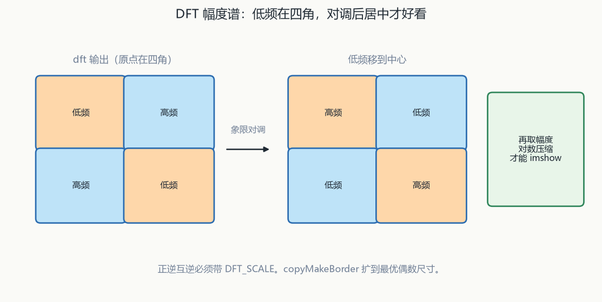
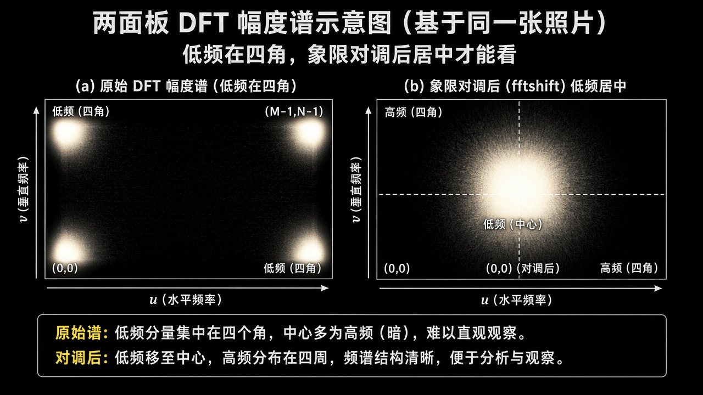
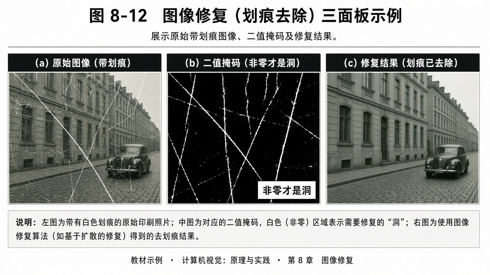

# 第8章 频域分析、分割与修复

来源：文档1《OpenCV 4计算机视觉:Python语言实现（原书第3版）》第3章 仅 3.3 傅里叶理论（PDF 91 起；HPF/LPF/`filter2D` 已在融合第4章，本章不重讲滤波核；PDF 90 仍是 3.2 加法模型页缝）。第4章 仅 4.8 GrabCut、4.9 分水岭（PDF 166–178；跳过 4.1–4.7 深度摄像头 / 视差 / StereoSGBM / SfM，那些归融合第10章）；文档2《opencv4快速入门》第8章「图像分析与修复」（用户给定书页 253–285 / PDF ~256–288；实测章标题 PDF 258 书页约 255，8.5 小结 PDF 290 书页约 287。正文自 PDF 258「第8章」起）。扫描件 OCR 嘈杂，函数名按书中可辨识的 OpenCV 4 写法还原；吃不准处标【信息缺口】。

## 本章总览

空间域改像素，频域看快变/慢变：DFT/DCT 把图拆成正弦/余弦，积分图让矩形求和变成几次加减，再用漫水、分水岭、GrabCut、Mean-Shift 把区域切开，最后用邻域估计把划痕/水印补上。

学完应能回答：`dft` 为何常要最优尺寸扩边、正逆变换为何要 `DFT_SCALE`、用频谱乘法做卷积时核也要扩到同样大小、积分图为何比原图大一圈、`floodFill` 的 mask 为何宽高各 +2、分水岭标记 0 和输出 -1 各是什么、GrabCut 四个掩码值怎么合成前景、Mean-Shift 的半径和颜色幅度各管什么、`inpaint` 的 mask 非零才是洞。

- **文档2侧重**：C++ 原型、DFT/DCT 标志表、积分三种重载、四种分割、`inpaint`。本章几乎全部参数表来自文档2。
- **文档1侧重**：傅里叶/幅度谱/`numpy.fft.fft2` 直觉（API 以文档2为准）；GrabCut 七步图割故事与 `GC_*` 四值；分水岭「山谷注水建坝」流程（形态学开、距离变换、连通域标号）。文档1无 DCT、积分图、`floodFill`、Mean-Shift 分割、`inpaint` 专节。

> 属于后续章，本章不展开：深度摄像头、视差、`StereoSGBM`、运动结构 SfM（融合第10章，文档1 4.1–4.7）；K-Means 分割（文档2点名留给机器学习章，融合第14章）；CamShift/Mean-Shift 跟踪（融合第13章；本章 Mean-Shift 是 `pyrMeanShiftFiltering` 分色，不是跟目标）；Canny/`findContours` 完整约束（第4、第7章，分割示例只调用）。`copyMakeBorder` 的其余边界类型见第3章，本章只按 DFT 扩边用到的程度写。

> 📝待补全：【深度摄像头 / 立体视差 / SfM】
>
> OpenNI 深度通道、SGBM 视差、SfM 不在本章。GrabCut/watershed 仍属本章。文档1第4章前半不读，深度图、10bit→8bit、`createMedianMask`、SGBM 表 4-1 全部留给第10章。
>
> 👉 完整深度讲解见第10章。

> 📝待补全：【K-Means 分割】
>
> 文档2把像素聚类当第五种分割，实现用 `cv::kmeans` 对 BGR 聚 3/5 类。K 是重要参数。与 `BOWKMeansTrainer` 不是同一接口。文档2 8.3 点名第五种分割不在本章展开。
>
> 👉 完整深度讲解见第14章。

> 📝待补全：【Mean-Shift / CamShift 跟踪】
>
> 本章 `pyrMeanShiftFiltering` 是分色平滑。跟踪吃的是反投影+meanShift/CamShift。两种 Mean-Shift 不要混成同一个函数。
>
> 👉 完整深度讲解见第13章。

> 📝待补全：【`copyMakeBorder` 全套 `borderType`】
>
> 第3章表 3-5：CONSTANT/REPLICATE/REFLECT/WRAP/REFLECT_101=DEFAULT/TRANSPARENT/ISOLATED。本章 DFT 例只用 CONSTANT 填 0。扩到最优 DFT 尺寸，避免直接缩放图像。
>
> 👉 完整深度讲解见第3章。

## 核心知识点

### 离散傅里叶变换（文档2 8.1.1 / 文档1 3.3）

【文档1观点】图像处理里很多算法都沾傅里叶：任意波形 = 不同频率正弦之和。变化剧烈的区域 vs 变化不大的区域可标成噪声/ROI、前景/背景。NumPy `fft2` 算图像 DFT。

幅度谱：把最亮像素拖到中间、最暗推到边界，用来看亮暗像素多少和分布。线/形状检测等也以傅里叶为基础。HPF/LPF 与卷积核细节已在第4章。

【文档2观点】图是离散二维信号，故用 DFT。结果是复数，常拆成实部/虚部，或幅值/相位。高频 = 细节与纹理（像素波动大），低频 = 轮廓；光照多在低频，去掉低频可减光照干扰。高斯滤波核是低通。数学公式本章不多展开。

#### `dft` 与 `idft`

输入必须 `CV_32F` 或 `CV_64F`；单通道实数或双通道复数。不默认缩放。正逆互逆必须加 `DFT_SCALE`（通常乘在逆变换上）。

| 名称 | 功能 | 主要参数 | 约束&坑点 |
|---|---|---|---|
| `void cv::dft(InputArray src, OutputArray dst, int flags=0, int nonzeroRows=0)` | 一维/二维 DFT（也可靠 flags 做逆变换） | `src`：必须 `CV_32F` 或 `CV_64F`；单通道实数或双通道复数。`dst` 尺寸类型随 `flags`。`flags` 见表 8-1。`nonzeroRows` 默认 0；非 0 时正向假定只输入前若干非零行，逆向只输出前若干非零行，便于相关/卷积加速 | 不默认缩放。实数正向且未设 `DFT_COMPLEX_OUTPUT` 时输出与输入同尺寸的实数包装谱（共轭对称，式 8-7，原点在四角） |
| `void cv::idft(InputArray src, OutputArray dst, int flags=0, int nonzeroRows=0)` | 专做逆 DFT | 参数同 `dft` | `idft(src,dst,flags)` ≡ `dft(src,dst, flags\|DFT_INVERSE)`。正逆互逆必须加 `DFT_SCALE`（通常乘在逆变换上） |

`idft` 只是默认带上 `DFT_INVERSE`。两者都能逆。实数正向且未设 `DFT_COMPLEX_OUTPUT` 时得到实数包装谱，原点在四角。

表 8-1 `dft`/`idft` 的 `flags`（简记以书表为准；OCR 把部分数字印残）：

| 标志 | 简记 | 含义 |
|---|---|---|
| `DFT_INVERSE` | 【OCR 空】 | 逆变换 |
| `DFT_SCALE` | 2 | 输出除以元素个数 \(N\)，常与逆变换合用，保证正→逆回到原数据 |
| `DFT_ROWS` | 4 | 对输入每一行做一维正/逆；可减少高维开销 |
| `DFT_COMPLEX_OUTPUT` | 16 | 实数正向 → 同尺寸共轭对称复数矩阵 |
| `DFT_REAL_OUTPUT` | 【OCR 印成 J2，疑 32】 | 复数逆变换等到实数矩阵的路径；书表后半句 OCR 乱，【信息缺口：与 `COMPLEX_OUTPUT` 对仗的完整句】 |
| `DFT_COMPLEX_INPUT` | 64 | 声明输入是复数；设了则输入必须两通道。两通道时函数也默认当复数 |

`DFT_SCALE=2`、`DFT_ROWS=4`、`COMPLEX_OUTPUT=16`、`COMPLEX_INPUT=64`。`DFT_INVERSE` 简记 OCR 空；`DFT_REAL_OUTPUT` OCR 印成 J2，疑 32【信息缺口】。

书列执行规则（文档2）：设了 `DFT_ROWS` 或输入单行/单列 → 一行一维变换，否则二维；实数且未 `DFT_INVERSE` → 正向；设 `COMPLEX_OUTPUT` 且未逆 → 同尺寸复数；实数正向且两标志都不设 → 同尺寸实数包装谱；复数输入且未逆、未 `REAL_OUTPUT` → 同尺寸复数；实数+逆 或 复数+`REAL_OUTPUT` → 同尺寸实数；`DFT_SCALE` 在变换后缩放。

🔑 关键速记：正逆都不默认 `/N`，忘了 `DFT_SCALE` 逆回去对不上。

#### 最优尺寸与扩边

最优尺寸是 2、3、5 的公倍数。宽、高须分别调用 `getOptimalDFTSize`。扩边填 0，避免直接缩放图像。

| 名称 | 功能 | 主要参数 | 约束&坑点 |
|---|---|---|---|
| `int cv::getOptimalDFTSize(int vecsize)` | 算更快的 DFT 长度 | `vecsize`：要变换的行数或列数（宽、高须分别调用） | 返回 ≥ 输入的 2、3、5 的公倍数（例 300=5×5×3×2×2）。数据大到接近 `INT_MAX` 则返回负数 |
| `void cv::copyMakeBorder(InputArray src, OutputArray dst, int top, int bottom, int left, int right, int borderType, const Scalar& value=Scalar())` | 四周加边，不缩放内容 | 输出尺寸 `Size(src.cols+left+right, src.rows+top+bottom)`。DFT 常用 `BORDER_CONSTANT`，`value` 默认即填 0 | 扩到最优 DFT 尺寸，避免直接缩放图像。边界类型细节见第3章 |

数据大到接近 `INT_MAX` 则返回负数。本章 DFT 例只用 `BORDER_CONSTANT` 填 0。

🔑 关键速记：宽高分别求最优长度，再 `copyMakeBorder` 填 0 扩边。

#### 幅度与象限对调

`magnitude` 算 \(\sqrt{x^2+y^2}\)，用于复数谱的幅值。显示前还要归一化，并按式 (8-7) 把原点从四角换到中心。

| 名称 | 功能 | 主要参数 | 约束&坑点 |
|---|---|---|---|
| `void cv::magnitude(InputArray x, InputArray y, OutputArray magnitude)` | \(\sqrt{x^2+y^2}\) | `x`/`y`：浮点矩阵（向量的两个分量）。输出与 `x` 同尺寸同类型 | 输入必须 `CV_32F` 或 `CV_64F`。用于复数谱的幅值 |

显示流程（文档2示例）：最优尺寸 → `copyMakeBorder` 填 0 → `dft` → `magnitude` → 归一化才能看 → 按式 (8-7) 把原点从四角换到中心。另用小矩阵验证正逆。

DFT 里高频是细节纹理、低频是轮廓；这和空间域 `findContours` 的「轮廓」不是同一个对象。去光照 ≈ 压低频，不是去物体外接框。

🔑 关键速记：包装谱原点在四角，对调象限后再取幅度才能看。

🔑 关键速记：DFT 输入浮点，扩到 2/3/5 公倍数，正逆成对记得 `DFT_SCALE`。

### 用 DFT 做卷积（文档2 8.1.2）

卷积 ↔ 频谱点乘。DFT 结果是共轭对称复数，点乘要按复数乘。核必须先扩到与图像相同的最优尺寸，乘完再逆变换。

#### `mulSpectrums`

两幅 DFT 谱对应相乘。`conjB=true` 对 b 取共轭再乘（相关时用）。

| 名称 | 功能 | 主要参数 | 约束&坑点 |
|---|---|---|---|
| `void cv::mulSpectrums(InputArray a, InputArray b, OutputArray c, int flags, bool conjB=false)` | 两幅 DFT 谱对应相乘 | `a`/`b` 同尺寸同类型：单通道共轭包装谱或双通道复数谱，数值来自 `dft`。`c` 同尺寸同类型。`conjB=false`：普通乘；`true`：对 b 取共轭再乘（相关时用） | 示例 5×5 全 1 核、图转 `float`，最优尺寸用 `getOptimalDFTSize(图边+核边-1)`，`dft(..., nonzeroRows=原行数)`，`mulSpectrums(..., DFT_COMPLEX_OUTPUT)`，再 `idft` 带 `DFT_SCALE`。示例里宽高与 `copyMakeBorder` 的 top/bottom/left/right 有一处行列对调 OCR，以「扩到最优宽高」为准【信息缺口：示例 A_B/A_R 赋值是否写反】 |

最优尺寸用 `getOptimalDFTSize(图边+核边-1)`。示例里宽高与 `copyMakeBorder` 的 top/bottom/left/right 有一处行列对调 OCR，以「扩到最优宽高」为准【信息缺口：示例 A_B/A_R 赋值是否写反】。

🔑 关键速记：图和核扩到同一最优尺寸 → 各自 `dft` → `mulSpectrums` → `idft`。

🔑 关键速记：`conjB=true` 走相关；卷积加速不要忘了 `DFT_SCALE`。

### 离散余弦变换（文档2 8.1.3；文档1无）

DCT 类似 DFT 但只用实数，常用在有损压缩；能量集中在低频。目前 `dct` 只支持偶数尺寸，最佳长度书给：\(2\times\) `getOptimalDFTSize((N+1)/2)`。彩色须分通道再拼回。

#### `dct` 与 `idct`

`src` 为浮点。书先误写成「逆变换函数 idft」，紧接着给出 `idct` 原型。

| 名称 | 功能 | 主要参数 | 约束&坑点 |
|---|---|---|---|
| `void cv::dct(InputArray src, OutputArray dst, int flags=0)` | 一维/二维 DCT | `src`：浮点。`dst` 同尺寸同类型。`flags` 见表 8-2 | `(flags & DCT_INVERSE)==0` 正向，否则逆向；`(flags & DCT_ROWS)!=0` 则逐行一维；单行/单列一维；否则二维 |
| `void cv::idct(InputArray src, OutputArray dst, int flags=0)` | 逆 DCT | `src`：单通道浮点 | 书先误写成「逆变换函数 idft」，紧接着给出 `idct` 原型。又写 `idct(src,dst,flags)` ≡ `dct(src,dst, flags\|DFT_INVERSE)`——标志名印成 `DFT_` 而非 `DCT_`。【信息缺口：以 `idct` 函数名为准；等价 flags 待对照官方是否为 `DCT_INVERSE`】 |

书把 `idct` 等价标志印成 `DFT_INVERSE`，与表 8-2 的 `DCT_INVERSE` 打架，调用时不要混用两套前缀。【信息缺口：以 `idct` 函数名为准】。

表 8-2 `dct` 标志（简记以书表为准）：

| 标志 | 简记 | 含义 |
|---|---|---|
| （0，无标志） | 0 | 一维或二维正变换 |
| `DCT_INVERSE` | 【OCR 空】 | 逆变换 |
| `DCT_ROWS` | 4 | 对每行做正或逆，可一次转多个向量 |

无标志 = 正变换。`DCT_ROWS=4`。`DCT_INVERSE` 简记 OCR 空。

🔑 关键速记：DCT 只要实数、吃偶数边长；`idct` 名称以原型为准，不要和 `idft` 混。

🔑 关键速记：彩图 DCT 分通道；能量堆低频，常用于有损压缩。

### 积分图像（文档2 8.2；文档1无）

矩形平均灰度若每次把框内像素加一遍，重叠区会重复加。积分图让每个像素只加一次：积分图像素 = 该点与原点围成矩形的和。

积分图比原图每边大 1：原 \(N\times N\) → \((N+1)\times(N+1)\)。任意轴对齐矩形和 = 四角积分值加减。三种：标准求和、平方求和、倾斜 45° 求和（倒三角，式 8-19）。

#### 三种 `integral` 重载

多通道分通道积。`sdepth` 默认 -1 自适应。平方积分没有 `CV_32S`。

| 名称 | 功能 | 主要参数 | 约束&坑点 |
|---|---|---|---|
| `void cv::integral(InputArray src, OutputArray sum, int sdepth=-1)` | 只出标准求和积分 | `src`：`CV_8U` / `32F` / `64F`，单通道或多通道（多通道分通道积）。`sum`：`CV_32S` / `32F` / `64F`，尺寸 \((M+1)\times(N+1)\)。`sdepth` 默认 -1 自适应 | 第一套 |
| `void cv::integral(InputArray src, OutputArray sum, OutputArray sqsum, int sdepth=-1, int sqdepth=-1)` | 标准 + 平方 | `sqsum` 只有 `CV_32F` 或 `64F`（平方可能很大，无 `CV_32S`） | 两张输出同尺寸 |
| `void cv::integral(InputArray src, OutputArray sum, OutputArray sqsum, OutputArray tilted, int sdepth=-1, int sqdepth=-1)` | 再加倾斜 45° | `tilted` 与 `sum` 同尺寸同类型；`sdepth` 同时管 `sum` 和 `tilted` | 示例 16×16 全 1 加 ±0.5 噪声：标准和平方都是左下最大，平方亮得更快；倾斜最大在下方中间。显示前转 `CV_8U` |

输出比输入大一圈，下标和原图像素不是 1:1 对齐。示例：标准和平方都是左下最大，平方亮得更快；倾斜最大在下方中间。

🔑 关键速记：积分图大一圈；平方积分没有 `CV_32S`。

🔑 关键速记：三种重载是和 / 和+平方 / 再加倾斜；矩形和用四角加减。

### 漫水填充（文档2 8.3.1；文档1无）

把灰度当高度，从种子往外灌：4/8 邻域里与种子差在阈值内的点并入，再当新种子，直到灌不动。三步：选种子 → 邻域差值过关则加入 → 新点当种子重复。

文档2 8.3 还点名 K-Means，留给后续机器学习章。

#### `floodFill`

`image` 为 `CV_8U` 或 `32F`，单通道或三通道，既入又出。带 mask 时 mask 比图宽+2、高+2 的单通道，须预先初始化。

| 名称 | 功能 | 主要参数 | 约束&坑点 |
|---|---|---|---|
| `int cv::floodFill(InputOutputArray image, InputOutputArray mask, Point seedPoint, Scalar newVal, Rect* rect=0, Scalar loDiff=Scalar(), Scalar upDiff=Scalar(), int flags=4)` | 带 mask 的漫灌 | `image`：`CV_8U` 或 `32F`，单通道或三通道，既入又出。`mask`：比图宽+2、高+2 的单通道，须预先初始化；非零表示已灌到。`newVal` 写回原图。`rect` 默认 0 不输出外接框。`flags` 三部分：低位 4 或 8 邻域；中 8 位 mask 填充值；高位算法规则（表 8-3）。例：`4 \| (255<<8) \| FLOODFILL_FIXED_RANGE` | 返回灌了多少像素。mask 坐标相对图像差 1 圈 |
| `int cv::floodFill(InputOutputArray image, Point seedPoint, Scalar newVal, Rect* rect=0, Scalar loDiff=Scalar(), Scalar upDiff=Scalar(), int flags=4)` | 不要 mask | 参数含义同左 | `FLOODFILL_MASK_ONLY` 无意义（没有 mask 可写） |

返回灌了多少像素。mask 坐标相对图像差 1 圈。不要 mask 的重载里 `FLOODFILL_MASK_ONLY` 无意义。

表 8-3 规则位写在 `flags` 高位：

| 标志 | 简记 | 含义 |
|---|---|---|
| `FLOODFILL_FIXED_RANGE` | `1<<16` | 只跟初始种子比差；不设则跟当前新种子比（范围浮动） |
| `FLOODFILL_MASK_ONLY` | `1<<17` | 不改原图，忽略 `newVal`，只写 mask |

`FIXED_RANGE` 只跟初始种子比；不设则范围浮动。`MASK_ONLY` 不改原图。

`loDiff`/`upDiff` 书上两句一处写「差值大于则加入」、一处写「小于则加入」，互相打架。【信息缺口：不宜按字面「大于才加入」；后文只强调它们是上下界阈值。OpenCV3 手册常用闭区间 \([\mathrm{src}-\mathrm{loDiff},\mathrm{src}+\mathrm{upDiff}]\)，本章文档2未写清该式】

🔑 关键速记：漫水从一个种子局部灌；mask 宽高各 +2，坐标差 1 圈。

🔑 关键速记：比的是灰度差；`loDiff`/`upDiff` 两处说法打架，标缺口。

### 分水岭（文档2 8.3.2 / 文档1 4.9）

【文档2观点】也是注水，但是全局：多个局部最低点同时灌，水位涨到两洼将汇合处成坝。经典两步：按灰度排序找注水点 → 淹没、汇合处标分割线。OpenCV 接口是：你先用正整数粗标区域，函数再细化。

【文档1观点】低变化=谷，高变化=峰；谷里注水，两谷将汇合时建屏障，屏障即分割线。

#### 文档1 扑克牌流水线

扑克牌例流程：① 彩转灰、阈值；② `morphologyEx(..., MORPH_OPEN)` 去噪（大白吞小黑噪声，大黑物体相对不动）；③ 开运算后再膨胀得确定背景；④ `distanceTransform` 后阈值得确定前景（离前景–背景边越远越像真前景）；⑤ 背景减确定前景 = 未知带；⑥ `connectedComponents` 给确定前景编号（断开的谷不该连通）；⑦ 全体标签 +1，让未知区为 0；⑧ `watershed` 把分量之间边上的像素标 -1，原图上涂蓝。

用途：扑克识别、纸上硬币分割计数。文档1步骤里的 `distanceTransform` / `connectedComponents` / `MORPH_OPEN` 完整约束见第5章，本章只记分水岭流水线角色。

🔑 关键速记：文档1用开运算/距离变换造确定前背景，未知带标 0。

#### `watershed`

`image` 必须 `CV_8U` 三通道彩色。`markers` 同尺寸 `CV_32S` 单通道。输入用 >0 的整数粗标各区域，未标为 0；输出区域间分割线为 -1。

| 名称 | 功能 | 主要参数 | 约束&坑点 |
|---|---|---|---|
| `void cv::watershed(InputArray image, InputOutputArray markers)` | 分水岭 | `image`：必须 `CV_8U` 三通道彩色。`markers`：同尺寸 `CV_32S` 单通道。输入：用 >0 的整数粗标各区域（1、2、3… 各一块或多块连通元），未标为 0。输出：区域间分割线为 -1 | 须先自己做标记。文档2示例：Canny → `findContours` → `drawContours` 把 `index+1` 填进 `CV_32S` 图 → `watershed`。书提示：用边缘当种子被动、碎区域多，人工标记往往更好 |

文档2示例用 Canny 轮廓当种子，并承认碎。人工标记往往更好。

🔑 关键速记：分水岭要彩图 + `CV_32S` 种子，输出 -1 是坝。

🔑 关键速记：漫水从一个种子局部灌，分水岭从多个谷全局灌。

### GrabCut（文档2 8.3.3 / 文档1 4.8）

【文档1观点】七步：① 画一个包住主体的矩形；② 矩形外自动当背景；③ 用矩形外当参考，再分矩形内的前景/背景；④ GMM 建前景/背景模型，未定像素标「可能前景/可能背景」；⑤ 像素用虚边连邻居，边权随颜色相似度变成前景/背景概率；⑥ 每像素连到前景节点或背景节点（源/汇）；⑦ 切开连到不同终端的边（故名 GrabCut）。

迭代次数参数（例 5）：再加迭代到某点会收敛，更多次数不一定更好。细化：再手标背景并加迭代；官方 `samples/python/grabcut.py`。

【文档2观点】GMM + 迭代最小化能量。处理同一幅图时不要改 `bgdModel`/`fgdModel`。示例：ROI `(80,30,340,390)`，模型 `1×65` 的 `CV_64FC1` 全 0，`iterCount=5`，`GC_INIT_WITH_RECT`；掩码里 1 或 3 当前景，其余当背景，再 `bitwise_and`。画框须对原图深拷贝，避免框线进分割。

文档1说 StereoSGBM 更像从二维收三维，GrabCut 才是前景/背景工具。

#### `grabCut`

`img` 为 `CV_8U` 三通道。`mask` 为 `CV_8U` 单通道，既入又出。`rect` 仅 `mode=GC_INIT_WITH_RECT` 时使用，框外标成明显背景。

| 名称 | 功能 | 主要参数 | 约束&坑点 |
|---|---|---|---|
| `void cv::grabCut(InputArray img, InputOutputArray mask, Rect rect, InputOutputArray bgdModel, InputOutputArray fgdModel, int iterCount, int mode=GC_EVAL)` | GrabCut 分割 | `img`：`CV_8U` 三通道。`mask`：`CV_8U` 单通道，既入又出，像素取值见表 8-4。`rect`：仅 `mode=GC_INIT_WITH_RECT` 时使用，框外标成明显背景。`iterCount`：迭代次数。`mode` 见表 8-5 | 前景可视化：把 0 和 2 收成 0，1 和 3 收成 1（文档1 `mask2`） |

可视化时常把 0+2 当背景、1+3 当前景。文档1未列 `mode` 枚举，只演示矩形初始化 + 迭代次数 5。

表 8-4 掩码值（两书一致）：

| 标志 | 简记 | 含义 |
|---|---|---|
| `GC_BGD` | 0 | 明显背景 |
| `GC_FGD` | 1 | 明显前景 |
| `GC_PR_BGD` | 2 | 可能背景 |
| `GC_PR_FGD` | 3 | 可能前景 |

矩形外=确定背景；掩码 0/1 确定，2/3 可能。两书一致。

表 8-5 `mode` 决定矩形初始化还是掩码初始化：

| 标志 | 简记 | 含义 |
|---|---|---|
| `GC_INIT_WITH_RECT` | 0 | 用矩形初始化状态和掩码，再迭代更新 |
| `GC_INIT_WITH_MASK` | 【OCR 空】 | 用提供的掩码初始化；可与 RECT 组合，然后用 `GC_BGD` 自动初始化 ROI 外所有像素 |
| `GC_EVAL` | 2 | 算法应恢复（默认） |
| `GC_EVAL_FREEZE_MODEL` | 3 | 只用固定模型跑 GrabCut（书称单次迭代） |

RECT=0、EVAL=2、FREEZE=3。`GC_INIT_WITH_MASK` 简记 OCR 空。同一幅图不要改两个 GMM 模型缓冲。

🔑 关键速记：GrabCut 掩码 0/1 确定、2/3 可能；可视化常把 0+2 当背景、1+3 当前景。

🔑 关键速记：矩形外是确定背景；迭代例 5 次，更多不一定更好。

### Mean-Shift 分割（文档2 8.3.4；文档1无）

均值漂移。输出是滤色后的「分色」图：颜色变渐变、细纹变平缓。每像素五维 \((x,y,b,g,r)\)。从颜色分布峰值起滑窗：半径管空间范围，颜色幅度管窗内是否算同一类。不是第13章的目标跟踪。

#### `pyrMeanShiftFiltering`

`src`/`dst` 必须 `CV_8U` 三通道，同尺寸。`sp` 是滑窗半径，`sr` 是颜色幅度。

| 名称 | 功能 | 主要参数 | 约束&坑点 |
|---|---|---|---|
| `void cv::pyrMeanShiftFiltering(InputArray src, OutputArray dst, double sp, double sr, int maxLevel=1, TermCriteria termcrit=TermCriteria(TermCriteria::MAX_ITER+TermCriteria::EPS, 5, 1))` | 金字塔 Mean-Shift 分色 | `src`/`dst`：必须 `CV_8U` 三通道，同尺寸。`sp`：滑窗半径。`sr`：颜色幅度。`maxLevel`：金字塔层数相关；>1 时建 `maxLevel+1` 层高斯金字塔，先在最小层分类，再传到大图，仅对与上层颜色差 > `sr` 的像素再分，边界更清；0 = 直接在原图做。`termcrit`：迭代停止 | 结果纹理少，便于再接 Canny / `findContours`。示例连续处理两次，Canny 边明显变少 |
| `TermCriteria::TermCriteria(int type, int maxCount, double epsilon)` | 迭代终止条件 | `type` 见表 8-6，可组合。`maxCount`：在 `COUNT`/`MAX_ITER` 时生效。`epsilon`：在 `EPS` 时生效 | 枚举要加类名前缀 `TermCriteria::`。许多迭代 API 共用此类型 |

`maxLevel>1` 时建 `maxLevel+1` 层高斯金字塔；0 = 直接在原图做。结果纹理少，便于再接 Canny / `findContours`。示例连续处理两次，Canny 边明显变少。

表 8-6 `TermCriteria` 的 `type`，可组合：

| 标志 | 简记 | 含义 |
|---|---|---|
| `TermCriteria::COUNT` | 【OCR 空】 | 迭代次数到了就停 |
| `TermCriteria::MAX_ITER` | 【OCR：同上】 | 与 `COUNT` 相同 |
| `TermCriteria::EPS` | 2 | 精度够了就停 |

`COUNT` 与 `MAX_ITER` 相同。`EPS=2`。枚举要加类名前缀 `TermCriteria::`。

🔑 关键速记：本章是五维颜色空间分色，不是跟目标的 MeanShift。

🔑 关键速记：`sp` 管空间半径，`sr` 管颜色幅度；可走金字塔。

### 图像修复（文档2 8.4；文档1无）

用损坏区边缘像素的值和结构，估计洞里该长什么样。可去划痕、水印、日期。函数不会自己找洞，必须用 mask 指出。离边缘越远估计越不准，污染区大则效果差。

#### `inpaint`

修补是非零才是洞；`copyTo` 常是非零才保留。方向相反。

| 名称 | 功能 | 主要参数 | 约束&坑点 |
|---|---|---|---|
| `void cv::inpaint(InputArray src, InputArray inpaintMask, OutputArray dst, double inpaintRadius, int flags)` | 按 mask 修补 | `src`：单通道可为 `CV_8U` / `16U` / `32F`；三通道必须 `CV_8U`。`inpaintMask`：同尺寸 `CV_8U` 单通道，非零 = 待修。`dst` 与 `src` 同尺寸同类型。`inpaintRadius`：每个像素考虑的圆形邻域半径。`flags` 见表 8-7 | 示例半径 5、`INPAINT_NS`；先把近白划痕阈值成 mask 再膨胀加大洞。细而稀的纹修得好，密纹修不好。示例 `cvtColor` 写成 `COLOR_RGB2GRAY`，OpenCV 默认读入是 BGR，【信息缺口：是否笔误】 |

三通道必须 `CV_8U`。示例半径 5、`INPAINT_NS`；细而稀的纹修得好，密纹修不好。示例 `cvtColor` 写成 `COLOR_RGB2GRAY`，OpenCV 默认读入是 BGR，【信息缺口：是否笔误】。

表 8-7 `inpaint` 的两种算法：

| 标志 | 简记 | 含义 |
|---|---|---|
| `INPAINT_NS` | 0 | Navier-Stokes 算法 |
| `INPAINT_TELEA` | 【OCR 空】 | Alexandru Telea 算法 |

NS=0。Telea 简记 OCR 空。洞大只能糊。

🔑 关键速记：`inpaint` 非零才是洞，函数不会自己找划痕。

🔑 关键速记：自己提供 mask，半径看邻域；NS / Telea 两法。

## 易混淆点&差异对比

下面对照频域、分割、修复里最容易记反的入口。

- 频域高低 vs 空间轮廓：【文档2观点】DFT 里高频是细节纹理、低频是轮廓；这和空间域 `findContours` 的「轮廓」不是同一个对象。去光照 ≈ 压低频，不是去物体外接框。

- `dft` 逆变换 vs `idft`：都能逆；`idft` 只是默认带上 `DFT_INVERSE`。两者都不默认 `/N`，忘了 `DFT_SCALE` 逆回去对不上。

- 实数谱包装 vs `COMPLEX_OUTPUT`：不设复数输出时得到实数共轭对称包装，原点在四角，显示必须换象限；设了则同尺寸复数。

- DCT vs DFT：DCT 只要实数、吃偶数边长；书把 `idct` 等价标志印成 `DFT_INVERSE`，与表 8-2 的 `DCT_INVERSE` 打架，调用时不要混用两套前缀。

- 积分图尺寸：输出比输入大一圈，下标和原图像素不是 1:1 对齐。平方积分没有 `CV_32S`。

- 漫水 vs 分水岭：漫水从一个种子局部灌，比的是灰度差；分水岭从多个谷全局灌，接口要彩色图 + `CV_32S` 种子，输出 -1 是坝。文档1分水岭还要自己用开运算/距离变换造确定前背景；文档2示例用 Canny 轮廓当种子，并承认碎。

- GrabCut vs 视差分割：文档1说 StereoSGBM 更像从二维收三维，GrabCut 才是前景/背景工具。矩形外=确定背景；掩码 0/1 确定，2/3 可能。可视化时常把 0+2 当背景、1+3 当前景。

- 两种 Mean-Shift：本章 `pyrMeanShiftFiltering` 是五维颜色空间分色；跟踪用的 MeanShift/CamShift 在第13章，吃的是直方图反投影。

- `inpaint` mask vs `copyTo` mask：修补是非零才是洞；`copyTo` 常是非零才保留。方向相反。

- 文档1第4章切分：4.8/4.9 进本章；深度图、10bit→8bit、`createMedianMask`、SGBM 表 4-1 全部留给第10章。

- Python vs C++：文档1 GrabCut/watershed 给步骤和 `GC_*` 含义，无完整 `cv2.grabCut`/`cv2.watershed` 原型表；C++ 约束以文档2为准。

频域「轮廓」不是 `findContours`；两种 Mean-Shift 不是同一接口；修补 mask 与拷贝 mask 方向相反。

## 本章要点总结

- DFT：输入浮点；最优尺寸是 2/3/5 公倍数；扩边填 0；幅值用 `magnitude`；要看谱须对数或归一化并对调象限；正逆成对记得 `DFT_SCALE`。

- 卷积加速：图和核扩到同一最优尺寸 → 各自 `dft` → `mulSpectrums` → `idft`。`conjB=true` 走相关。

- DCT：实数、偶数边、能量堆低频；彩图分通道；`idct` 名称以原型为准。

- 积分图：三种重载（和 / 和+平方 / 再加倾斜）；输出大一圈；多通道分开积。

- 分割四件：`floodFill`（种子+色差，mask 大一圈）；`watershed`（彩图 + 正整数种子，-1 为坝）；`grabCut`（矩形或掩码初始化，GMM，四值掩码）；`pyrMeanShiftFiltering`（空间半径 + 颜色幅度，可走金字塔）。

- 修复：自己提供 mask，半径看邻域，洞大只能糊；NS / Telea 两法。

- 文档1贡献：幅度谱直觉、GrabCut 图割故事与四值、分水岭注水+未知带流水线。文档2贡献：全部 C++ 标志表与积分/漫水/Mean-Shift/inpaint。
