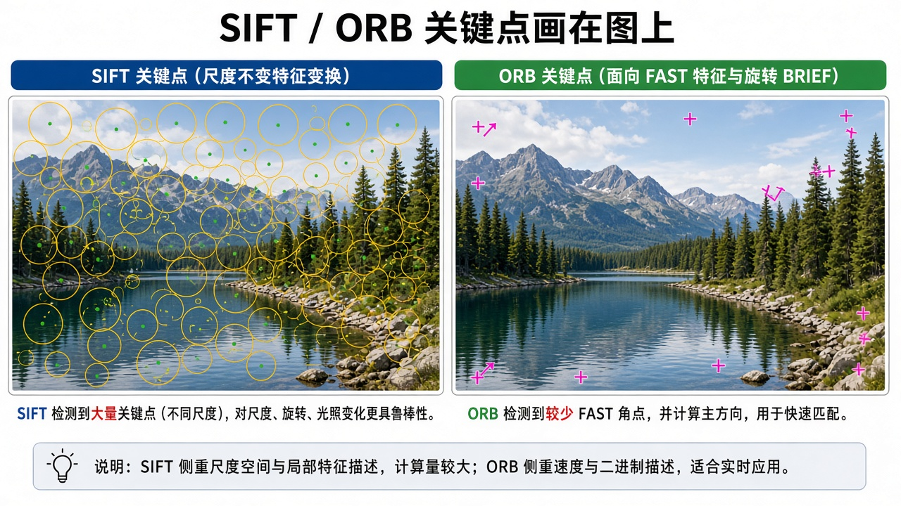
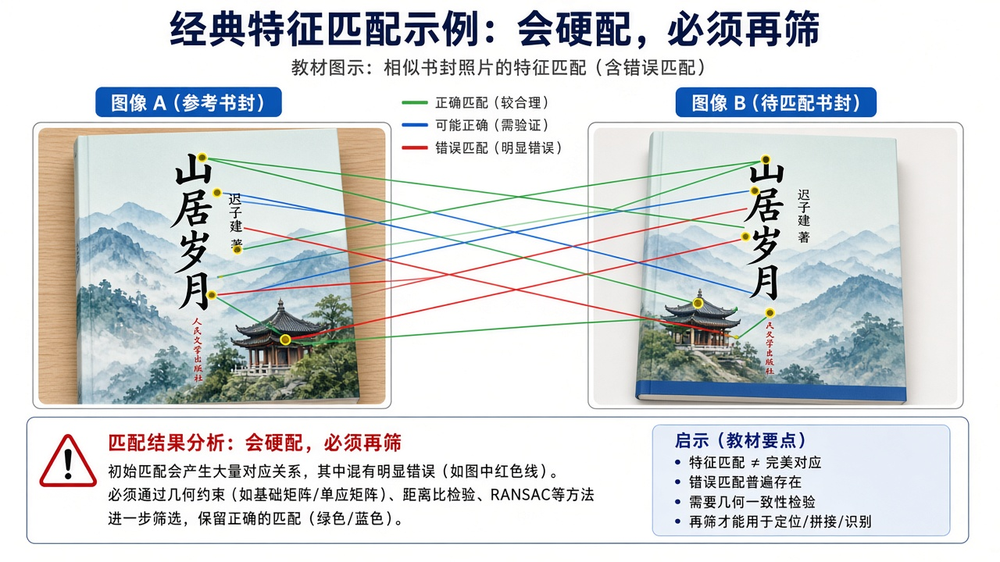
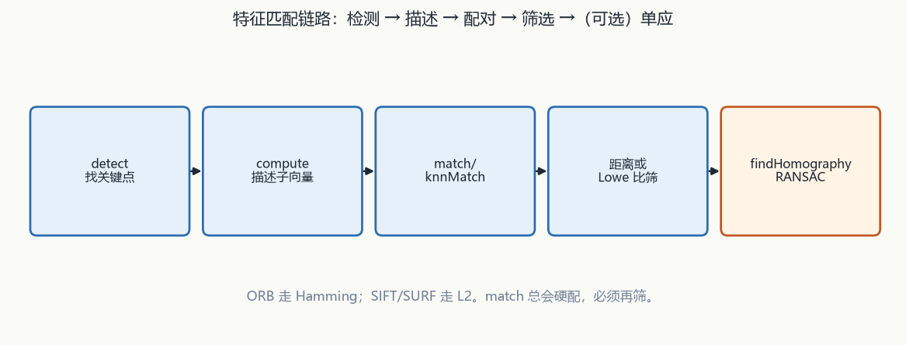
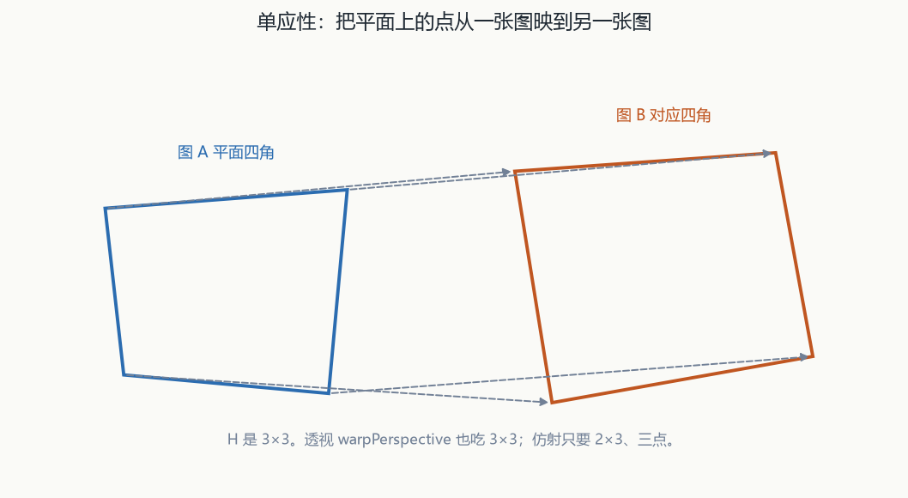

# 第9章 特征点检测与匹配

来源：文档1《OpenCV 4计算机视觉:Python语言实现（原书第3版）》第6章「检索图像与搜索图像」（PDF 224–286；章标题在 PDF 224，6.1 技术需求在 PDF 225）；文档2《opencv4快速入门》第9章「特征点检测与匹配」（用户给定书页 287–322 = PDF 290–325；实测 PDF 290 仍是第8章小结，**章标题在 PDF 292 / 书页约 289**，RANSAC 例在 PDF 325）。扫描件 OCR 嘈杂，函数名按可辨识的 OpenCV 4 写法还原；吃不准处标【信息缺口】。

## 本章总览

特征点是能代表局部特性、数据量远小于全图像素的点。学完应能回答：Harris 出响应图还是直接给点、Shi-Tomasi 的门槛为什么是相对值、亚像素 `winSize` 是半窗还是全窗、SIFT/SURF 为什么在 contrib 且商用要小心、ORB 该配 Hamming 还是 L2、暴力与 FLANN 谁穷举谁近似、Lowe 比率检验在比什么、RANSAC 单应性最少要几对点。

文档2侧重 C++ 原型：`drawKeypoints` / `KeyPoint`、`cornerHarris`、`goodFeaturesToTrack`、`cornerSubPix`、`Feature2D` 的 `detect` / `compute` / `detectAndCompute`、`SIFT::create` / `SURF::create` / `ORB::create`、`DescriptorMatcher` 三套匹配、`BFMatcher`、`drawMatches`、`FlannBasedMatcher`、`findHomography`。

文档1侧重特征/角点/斑点/岭的直觉；`cv2.cornerHarris` 的块大小与 Sobel 孔径；DoG+SIFT、快速 Hessian+SURF；FAST/BRIEF/ORB；蛮力与 `knnMatch`+比率检验；FLANN+kd-tree；单应性框物体；文身描述符入库检索。多数没有完整 Python 原型。

Haar 级联靠邻块对比度，窗口尺寸固定、图像缩成金字塔再扫窗。它不是 SIFT/ORB 那种关键点描述子，也不能拿来做本章的跨图匹配。

👉 完整深度讲解见第12章。

HOG+SVM 走另一条检测线：`HOGDescriptor` 挂默认行人 SVM，`detectMultiScale` 默认窗 64×128、尺度因子 1.5，嵌套框通常要滤。词袋 BoW+SVM 是同一章里的自定义检测路线，不是特征点匹配。

👉 完整深度讲解见第14章。

匹配到物体平面之后，增强现实用 `solvePnPRansac` 估 6DOF，再 Kalman 平滑、`projectPoints` 画轴。本章只走到 2D 单应性。

👉 完整深度讲解见第11章。

二维码四个顶点只作「为什么要特征点」的例子，定位算法在第7章。

## 核心知识点

### 特征、角点、关键点、描述子

特征是图里独特、好认的一块。关键点主要带位置和角度；特征点通常还要加上能标识唯一性的描述子，才能跨图匹配。

🔑 关键速记：好特征要独特；只有坐标不够跨图，还要描述子。

#### 文档1：什么算好特征

密纹理角点、边缘、斑点（和周围差很大的区）是好特征；蓝天那种低密度重复不是。有的算法还看岭（细长物的对称轴，如道路）。

Harris 擅长角点，SIFT/SURF/BRIEF 偏斑点，FAST 偏角点。ORB = Oriented FAST + Rotated BRIEF，角点加斑点都能用。匹配可用蛮力或 FLANN；空间验证用单应性。

🔑 关键速记：Harris/FAST 偏角，SIFT/SURF/BRIEF 偏斑，ORB 两边都能用。

#### 文档2：为何只要几个点

处理时不必用到物体全部像素：定位二维码、算尺寸往往只要 4 个顶点。角点能大幅减数据、提速，用于匹配、定位、三维重建。

常见角点说法：灰度梯度最大处、两线或曲线交点、一阶导数最大且方向变化率最大、一阶最大但二阶为 0。

🔑 关键速记：文档2把角点当减数据的手段；关键点≠带描述子的特征点。

#### `drawKeypoints` 与 `KeyPoint`

下面这张表给出画点和关键点结构本身的接口，还不涉及检测算法。

| 名称 | 功能 | 主要参数 | 约束&坑点 |
|---|---|---|---|
| `void cv::drawKeypoints(InputArray image, const std::vector<KeyPoint>& keypoints, InputOutputArray outImage, const Scalar& color=Scalar::all(-1), DrawMatchesFlags flags=DrawMatchesFlags::DEFAULT)` | 一次画完全部关键点（空心圆） | `image`：单通道灰或三通道彩。`keypoints`：`KeyPoint` 向量。`outImage`：输出。`color` 默认 −1 = 随机色。`flags` 见表 9-1 | `DRAW_OVER_OUTIMG` 时直接画在输入图上，第三个参数仍要传、书称不会改它。坐标可超出画布，超界的点画不上。标志要加 `DrawMatchesFlags::` 前缀 |
| `cv2.KeyPoint` / `cv::KeyPoint` | 关键点数据结构 | `pt`（`Point2f`）、`size`（邻域直径）、`angle`、`response`（强度，可再分类/二次采样）、`octave`（金字塔层）、`class_id` | 只画点时坐标必须有值，其余可默认。文档1：`octave` 与检测时的图像尺度有关 |

记住：超界点画不上；`DRAW_OVER_OUTIMG` 仍要传第三个参数。

表 9-1 是 `DrawMatchesFlags`（文档2），画点和画匹配共用。

| 标志 | 含义 |
|---|---|
| `DEFAULT` | 创建输出图，圆只标位置，不画大小和方向 |
| `DRAW_OVER_OUTIMG` | 不新建输出矩阵，直接在原图上画 |
| `NOT_DRAW_SINGLE_POINTS` | 不画未匹配的单个关键点 |
| `DRAW_RICH_KEYPOINTS` | 圆体现大小和方向 |

文档1画 SIFT 点时用 `cv2.DRAW_MATCHES_FLAGS_DRAW_RICH_KEYPOINTS`，与表中最后一项同类。

🔑 关键速记：默认只画位置；要大小和方向用 `DRAW_RICH_KEYPOINTS`。

### Harris 角点

窗口无论往哪移，像素值衡量系数都变小，中心才是 Harris 角点。接口只出响应图，不直接给点列表。

🔑 关键速记：Harris 给每个像素一个 \(R\)，阈值要自己定。

#### 原理：\(R\) 怎么分角、边、平面

【文档2观点】平滑区各向不变、不是角；边缘只垂直方向变、不是角；两线交点才是。窗口权常用类高斯或小窗（如 2×2）。

评价 \(R=\det(M)-k(\mathrm{tr}\,M)^2\)。\(R\) 大：两特征值接近 → 角；\(R<0\)：两特征值差大 → 在直线上；\(R\) 很小：特征值都小 → 在平面。

【文档1观点】`cv2.cornerHarris` 第 3 个参数是 Sobel 孔径，须 3～31 的奇数。3（灵敏）会把棋盘黑格斜线碰到边也当成角；23（迟钝）往往只留方格角。返回浮点图，每个像素一个分值，中高分更可能是角。示例把分值 ≥ 最高分 1% 的像素涂红。第 2 个参数是块大小：越小标出的区域越小。

🔑 关键速记：\(R\) 大是角、负是边、很小是平面；孔径须奇数。

#### `cornerHarris`

下面这张表是 Harris 的 C++ 原型；它只出图，后续还要归一化再阈值。

| 名称 | 功能 | 主要参数 | 约束&坑点 |
|---|---|---|---|
| `void cv::cornerHarris(InputArray src, OutputArray dst, int blockSize, int ksize, double k, int borderType=BORDER_DEFAULT)` | 算每个像素的 Harris 系数 \(R\) | `src`：`CV_8U` 或 `CV_32F` 单通道灰。`dst`：`CV_32F` 单通道，与输入同尺寸。`blockSize`：邻域，文档2「通常取 2」。`ksize`：Sobel 半径/孔径，须奇数，多用 3 或 5。`k`：式中权重，文档2一般 0.02～0.04 | 只出响应图，不直接给点。\(R\) 可正可负、范围宽，常先 `normalize` 到 0–255，再 `convertScaleAbs` 成 `CV_8U` 后阈值。阈值大点少、小点多，靠经验。文档1示例门槛是 max 的 1%，文档2示例用归一化后与 125 比【信息缺口：例程阈值 OCR 作「25」，以正文「按工程经验」为准】 |

记住：文档1用「最大响应的 1%」，文档2用归一化后再比经验阈值，不要混成同一套数字。

🔑 关键速记：`cornerHarris` 出 `CV_32F` 响应图；k 多取 0.02～0.04。

### Shi-Tomasi 与 `goodFeaturesToTrack`

Harris 的 \(R\) 是两特征值的组合，看不出「较小那个」有多大。Shi-Tomasi 改用 \(R=\min(\lambda_1,\lambda_2)\)，超过相对门槛才算角。

🔑 关键速记：门槛跟图里最佳角挂钩，并且直接输出坐标。

#### 相对门槛为什么换图不失效

【文档2观点】`goodFeaturesToTrack` 的门槛跟图里最佳角挂钩，避免绝对阈值换图就失效。`qualityLevel` 不是最终阈值本身：例 0.01 且最佳=1500 则门槛=15。

🔑 关键速记：`qualityLevel` 要乘最佳响应，不要当成绝对阈。

#### `goodFeaturesToTrack`

下面这张表是直接出点的接口；默认走 Shi-Tomasi，不是 Harris。

| 名称 | 功能 | 主要参数 | 约束&坑点 |
|---|---|---|---|
| `void cv::goodFeaturesToTrack(InputArray image, OutputArray corners, int maxCorners, double qualityLevel, double minDistance, InputArray mask=noArray(), int blockSize=3, bool useHarrisDetector=false, double k=0.04)` | 在指定区域找 Shi-Tomasi（或可选 Harris）角点 | `image`：`CV_8U` 或 `CV_32F` 单通道灰。`corners`：`vector<Point2f>` 或单列 `CV_32F` 的 `Mat`（行数=点数）。`maxCorners`：最多留几个（超了按特征值大小挑）。`qualityLevel`：门槛 = 该值 × 最佳角响应。`minDistance`：两点最小欧氏距离。`mask` 非空须同尺寸 `CV_8U` 单通道。`useHarrisDetector` 默认 false（走 Shi-Tomasi）。`k` 仅 Harris 时用，默认 0.04 | 不要把 `qualityLevel` 当成最终阈值。全图检测 `mask` 用 `noArray()`。文档2：`circle` 可调半径和单点颜色；`drawKeypoints` 圆大小固定但一次画完 |

记住：默认 `useHarrisDetector=false`；`k` 只在改走 Harris 时有用。

🔑 关键速记：出点不出资质图；默认不是 Harris。

### 亚像素角点

上面两函数只给整数像素坐标。亚像素是在邻域里把点再挤细一档。

🔑 关键速记：必须先有像素级角点，再交给 `cornerSubPix`。

#### 几何直觉

【文档2观点】找一点 \(q\)，使「指向邻域各点的向量」与「该点梯度」乘积之和最小。邻域内平滑点梯度≈0；边缘点梯度垂直于边。

🔑 关键速记：平滑点几乎不出力，边缘点把解往垂直于边的方向推。

#### `cornerSubPix`

下面这张表要盯住半窗：`winSize` 不是全窗边长。

| 名称 | 功能 | 主要参数 | 约束&坑点 |
|---|---|---|---|
| `void cv::cornerSubPix(InputArray image, InputOutputArray corners, Size winSize, Size zeroZone, TermCriteria criteria)` | 把已有角点迭代成亚像素 | `image`：`CV_8U` 或 `CV_32F` 单通道灰。`corners`：既是输入也是输出。`winSize`：搜索窗的一半，须整数；实际窗边长 = 2×该值+1。`zeroZone`：中间「死区」的一半，`(-1,-1)` 表示没有死区。`criteria`：迭代终止 | 必须先有像素级角点。不要把 `winSize` 当成全窗 |

记住：`zeroZone=(-1,-1)` 是没有死区，不是死区很大。

🔑 关键速记：`winSize` 是半窗；`(-1,-1)` 表示无死区。

### Feature2D：检测、描述、一次做完

OpenCV 4 搭 `Feature2D` 虚类，具体特征类都继承它。描述子是一串数字，用来区分或在另一幅图里找回同一个关键点（统计邻域梯度、随机比 128 对像素大小等）。

🔑 关键速记：检测出点、描述出向量；图必须和点对应，否则不报错但数据乱。

#### `detect` / `compute` / `detectAndCompute`

`compute` 过程中可能删掉算不出描述子的点，也可能加点。必须喂与关键点对应的那张图。

下面这张表是统一入口，要在 ORB、SIFT 这类具体类上调用。

| 名称 | 功能 | 主要参数 | 约束&坑点 |
|---|---|---|---|
| `void Feature2D::detect(InputArray image, std::vector<KeyPoint>& keypoints, InputArray mask=noArray())` | 只算关键点 | `mask` 同尺寸 `CV_8U`，非零才算 | 要在具体类上调用，如 `ORB::detect`、`SIFT::detect` |
| `void Feature2D::compute(InputArray image, std::vector<KeyPoint>& keypoints, OutputArray descriptors)` | 已知点算描述子 | `descriptors` 形态随特征种类变 | 图必须与点对应 |
| `void Feature2D::detectAndCompute(InputArray image, InputArray mask, std::vector<KeyPoint>& keypoints, OutputArray descriptors, bool useProvidedKeypoints=false)` | 一次出点和描述子 | `useProvidedKeypoints=true` 时本质同 `compute`；`false`（默认）既检测又描述 | 掩码约束同 `detect` |

记住：默认 `useProvidedKeypoints=false` 才会重新检测。

【文档1观点】`detectAndCompute` 返回「关键点列表 + 描述子列表」元组。`cv2.SIFT` 后台是 DoG 检测 + SIFT 描述；`cv2.SURF` 是快速 Hessian + SURF 描述。OpenCV 对所支持的检测/描述提供统一 API，SIFT 例改 SURF 往往只改创建那一行。

🔑 关键速记：`compute` 可能增删点；换算法常常只改 `create` 那一行。

### SIFT（DoG + 描述）

SIFT 本身不检测关键点，检测靠 DoG；OpenCV 的 `SIFT` 类把两步包在一起。它在 contrib，且有专利约束。

🔑 关键速记：尺度不变靠金字塔；商用要小心 NONFREE。

#### 文档1：为何 Harris 不够

Harris 对旋转相对稳，但缩放会丢角（F1 赛道缩小后弯顶角消失）。SIFT = 尺度不变特征变换：不管图放大缩小都要能出同类特征。

检测靠 DoG（同一图不同高斯模糊之差，思路接近边缘检测）；SIFT 描述关键点周围。要 `opencv_contrib` + CMake `OPENCV_ENABLE_NONFREE`（专利，商用不免费）。

🔑 关键速记：缩放会弄丢 Harris 角；DoG 找点，SIFT 写描述。

#### 文档2：`SIFT::create`

Lowe 1999 提出、2004 完善。光照、噪声、视角、缩放、旋转下较稳。先建多尺度高斯金字塔（近大远小、近清远糊）。创建在 `cv::xfeatures2d`。书明确：只能研究学习、不能商用；本书不提供 SIFT 示例，请仿 SURF/ORB。

下面这张表是文档2 的创建参数；`edgeThreshold` 越大点越多，和对比度阈方向相反。

| 名称 | 功能 | 主要参数 | 约束&坑点 |
|---|---|---|---|
| `static Ptr<SIFT> cv::xfeatures2d::SIFT::create(int nfeatures=0, int nOctaveLayers=3, double contrastThreshold=0.04, double edgeThreshold=10, double sigma=1.6)` | 创建 SIFT 对象 | `nfeatures=0` 输出全部合格点；非 0 按响应排序取前若干。`nOctaveLayers` 每组层数，默认 3，图大可加。`contrastThreshold` 越大点越少（响应低于此去掉）。`edgeThreshold` 越大点越多（滤掉的边缘点越少），默认 10。`sigma` 第 0 层高斯系数，默认 1.6 | 头文件/命名空间在 `xfeatures2d`。与文档1的 `OPENCV_ENABLE_NONFREE` 是同一类专利约束 |

记住：对比度阈升 → 点少；边缘阈升 → 点多。

🔑 关键速记：类在 `xfeatures2d`；文档2干脆不给 SIFT 例。

### SURF（快速 Hessian + 描述）

Bay 2006，受 SIFT 启发，快几倍，同样专利 + NONFREE。尺度空间用方框滤波逼近，可走积分图。

🔑 关键速记：默认 64 维；`extended=true` 才 128 维。

#### 尺度空间与描述维数

【文档2观点】SIFT 用高斯差分建尺度空间，慢，难实时。SIFT 下一组边长减半、组内尺寸同、σ 渐增；SURF 各组图尺寸相同，组间方框核变大，组内核尺寸同、模糊系数渐增。

方向：半径 6s 圆内水平/垂直小波 + 高斯权，60° 滑窗取响应和最大的方向。描述：20s 邻域切 4×4，每块 4 维（水平、垂直、两方向绝对值）→ 64 维；也可把正负再拆 → 128 维。类在 `xfeatures2d`，`#include <xfeatures2d.hpp>`，`using namespace xfeatures2d`。

🔑 关键速记：SURF 组间改核大小，不改图尺寸。

#### `SURF::create`

【文档1观点】`cv2.xfeatures2d.SURF_create` 的参数是快速 Hessian 阈值：越大点越少。示例阈值 8000。

下面这张表默认阈值是 100，和文档1示例 8000 差一个数量级。

| 名称 | 功能 | 主要参数 | 约束&坑点 |
|---|---|---|---|
| `Ptr<SURF> cv::xfeatures2d::SURF::create(double hessianThreshold=100, int nOctaves=4, int nOctaveLayers=3, bool extended=false, bool upright=false)` | 创建 SURF 对象 | `hessianThreshold` 越大点越少，默认 100（与文档1示例 8000 差一个数量级，按任务调）。`nOctaves` 组数默认 4。`nOctaveLayers` 每组层数默认 3【OCR 有一处残】。`extended=true` → 128 维，`false` → 64 维，默认 false。`upright` 是否算方向 | 与 SIFT 一样走 contrib。文档1/文档2 默认阈值不可混用 |

记住：两书阈值不能互相套用。

🔑 关键速记：默认 Hessian 阈 100；示例 8000 只是文档1的一道题。

### ORB（FAST + 带方向的 BRIEF）

2011 年的 SIFT/SURF 快速替代。ORB 在主命名空间，不在 `xfeatures2d`。匹配不要用 L2。

🔑 关键速记：二进制描述走 Hamming；`WTA_K` 决定用 Hamming 还是 Hamming2。

#### FAST 与 BRIEF 各干什么

【文档1观点】FAST：看 16 像素圆周，相对圆心阈值标亮/暗；若有一串连续更亮或更暗则是角。可先只查圆周上 1/5/9/13 四点：刚好 3 个或 1 个更亮才可能是角；2 个是边；0 或 4 个则均匀。对输入（阈值）敏感，可用机器学习按应用调。BRIEF 不是检测器，是目前最快的描述子之一。ORB 目标：给 FAST 加定位、高效算 BRIEF、处理旋转。

【文档2观点】FAST 本身无尺度/旋转不变。ORB：金字塔各层提 FAST → 尺度；角点指向邻域质心的向量 → 方向（图像矩，第7章）。FAST 易扎堆，要用非极大值抑制只留局部响应最大者。BRIEF：按分布随机比邻域 p、q 灰度，大记 1、小记 0，常用 128 对；再结合关键点方向补旋转。

🔑 关键速记：FAST 找角，BRIEF 写比特；金字塔给尺度，质心向量给方向。

#### `ORB::create`

下面这张表是主库 ORB 的默认；第11章跟踪配置（最多 250 点、16 层）不是本表默认。

| 名称 | 功能 | 主要参数 | 约束&坑点 |
|---|---|---|---|
| `static Ptr<ORB> cv::ORB::create(int nfeatures=500, float scaleFactor=1.2f, int nlevels=8, int edgeThreshold=31, int firstLevel=0, int WTA_K=2, ORB::ScoreType scoreType=ORB::HARRIS_SCORE, int patchSize=31, int fastThreshold=20)` | 创建 ORB 对象 | `nfeatures` 默认 500，大致跟图尺寸走。`scaleFactor` 默认 1.2：太大评价掉、太小层数多变慢。`nlevels` 默认 8【OCR 印「&」，按后文默认 8 还原】。`edgeThreshold` 应与 `patchSize` 大致相同，默认 31。`firstLevel` 原图放哪一层，默认 0。`WTA_K=2`：标准 BRIEF、1 bit、后期 `NORM_HAMMING`；`=3` 或 `4`：2 bit、`NORM_HAMMING2`。`scoreType`：`ORB::HARRIS_SCORE`（默认）或 `FAST_SCORE`。`fastThreshold` 默认 20，书称中心差阈值 \(T=20\%\times I_c\) | 文档1 AR 章会把直径 31、16 层、1.2、最多 250 点再写一遍，那是第11章的跟踪配置，不是本表默认。匹配不要用 L2 |

`patchSize` 默认 31 按「与 edgeThreshold 大致相同 + 文档1 直径 31」还原；OCR 未单独印清默认数字。【信息缺口：若需逐字默认，回看 PDF 313 原型行】

🔑 关键速记：默认最多 500 点、8 层、1.2；跟踪章的 250/16 不要抄回来。

### 匹配：DescriptorMatcher / 暴力 / 画出结果

匹配是在另一幅图里找描述子相近的点。浮点描述（SIFT/SURF）比欧氏；二进制（ORB、BRISK）比汉明。查询集对训练集。

🔑 关键速记：`match` 总会硬配一条「最佳」，即使场景里没有该物体。

#### 三套匹配与 `BFMatcher`

`match` 每个查询只留 1 个最佳；`knnMatch` 留最多 k 个；`radiusMatch` 留距离小于阈值的全部。因 mask，匹配条数可以少于查询点数。

下面这张表是匹配虚类与暴力实现；默认范数是 L2，不要拿默认去配 ORB。

| 名称 | 功能 | 主要参数 | 约束&坑点 |
|---|---|---|---|
| `void DescriptorMatcher::match(InputArray queryDescriptors, InputArray trainDescriptors, std::vector<DMatch>& matches, InputArray mask=noArray())` | 一对一最佳匹配 | 描述子为 `Mat`。`DMatch`：`distance`、`queryIdx`、`trainIdx`、`imgIdx` | 虚类，要在 `BFMatcher` / `FlannBasedMatcher` 上用 |
| `void DescriptorMatcher::knnMatch(..., std::vector<std::vector<DMatch>>& matches, int k, InputArray mask=noArray(), bool compactResult=false)` | 每个查询最多 k 个近邻 | 实际可能少于 k。`compactResult=false`：输出长度跟查询数相同；`true`：不含被 mask 掉的查询 | 文档1用它做比率检验（k=2） |
| `void DescriptorMatcher::radiusMatch(..., float maxDistance, ...)` | 距离小于阈值的都留下 | `maxDistance` 是描述子距离（欧氏/汉明），不是像素坐标距离 | 其余参数同 knn |
| `cv::BFMatcher::BFMatcher(int normType=NORM_L2, bool crossCheck=false)` | 暴力：算完所有对再排序 | SIFT/SURF：`NORM_L1` / `NORM_L2`。ORB：`WTA_K=2` 用 `NORM_HAMMING`，`WTA_K=3/4` 用 `NORM_HAMMING2`。`crossCheck` 默认 false | 查询里独有的点也会被硬配出去，距离往往偏大，要再按距离筛。默认范数是 L2，不要拿默认去配 ORB |
| `void cv::drawMatches(...)` | 两图左右拼，画连线 | 两图通道数须相同，尺寸可不同；矮的一侧用黑像素补齐。`matchColor` / `singlePointColor` 默认 `Scalar::all(-1)` 随机色。`matchesMask` 默认画全部。`flags` 同表 9-1 | 只需要关键点位置和 `DMatch`，不要描述子。查询图是 img1，训练图是 img2 |

记住：`radiusMatch` 的距离是描述子空间距离，不是像素坐标距离。

🔑 关键速记：SIFT/SURF 用 L2，ORB 用 Hamming；暴力会硬配独有点。

#### 文档1：Lowe 比率检验

蛮力几乎不优化：每个查询跟训练里每个描述子比，取最小距离。`cv2.BFMatcher`。标识 vs 场景例：多数连线是假匹配，必须再过滤。

假设查询每个点在场景里最多一个正确匹配 → 次优几乎一定是错的 → 门槛 = 次优距离 × 小于 1 的系数（Lowe 比率检验）。`knnMatch` 的 k 是「每个查询最多留几条」。画成对匹配用 `drawMatchesKnn`；滤完只剩最佳时用 `drawMatches`。文档1 NASA 例比率 0.8；FLANN 高更画作例 0.7。

🔑 关键速记：k=2 时最佳要明显小于次优；文档1 用过 0.8 和 0.7。

### FLANN

Fast Library for Approximate Nearest Neighbor，高维近似最近邻，可按数据选算法。封装为 `cv2.FlannBasedMatcher` / `cv::FlannBasedMatcher`。

🔑 关键速记：默认 kd-tree 要浮点描述；ORB 在本章须先转 `CV_32F`。

#### 文档1：kd-tree 检索画作

例：`indexParams` 用含 5 棵树的 kd-tree（建议 1～16 棵），`searchParams` 检查 50 次（越多越准越慢）。匹配后仍做比率检验；可用 `mask_matches`（每个查询长度为 k 的 0/1）交给 `drawMatchesKnn` 只画好的。

🔑 关键速记：文档1 本章用 SIFT+kd-tree 做画作检索，不是 ORB+LSH。

#### 文档2：构造与距离筛

构造：`indexParams`（表 9-2：`KDTreeIndexParams` 随机 kd-tree、`KMeansIndexParams`、`HierarchicalClusteringIndexParams`，默认 kd-tree）、`searchParams`（遍历次数、误差、是否排序，一般默认即可）。

描述子须 `CV_32F`，ORB 的二进制描述要先 `convertTo(CV_32F)` 才能走 FLANN。例程把最大距离的 0.4 倍当筛门槛；筛完可能只剩极少点，说明纯距离阈值不稳，靠经验。

下面这张表是近似最近邻匹配器；第11章对 ORB 改用 LSH，不要和本章默认 kd-tree 混为一谈。

| 名称 | 功能 | 主要参数 | 约束&坑点 |
|---|---|---|---|
| `cv::FlannBasedMatcher::FlannBasedMatcher(const Ptr<flann::IndexParams>& indexParams=makePtr<flann::KDTreeIndexParams>(), const Ptr<flann::SearchParams>& searchParams=makePtr<flann::SearchParams>())` | 近似最近邻匹配 | 默认随机 kd-tree | ORB 必须先转 `CV_32F`。文档1 跟踪章对 ORB 改用 LSH（融合第11章），不要和本章默认 kd-tree 混为一谈 |

记住：文档2 用 `0.4×max_dist` 当筛，并承认不稳。

🔑 关键速记：本章默认 kd-tree；跟踪章 ORB 走 LSH。

### 单应性 + RANSAC

单应性：一张图是另一张的透视变形时，点与点的对应。这是 2D↔2D 透视，不是第11章的 6DOF 位姿。

🔑 关键速记：理论 4 对点就能算；一对坏点会毁结果。

#### 文档1：实践至少约 10 对

技术上 4 对就能算，但一对坏点会毁结果；实际至少约 10 对，算法才能丢掉一些外点。`findHomography` 后用透视把查询图四角投到场景，再画框。

文身取证：`numpy.save` 把描述子存成 `.npy`，查询时 `np.load` + FLANN + 比率；≥10 个好匹配标成嫌疑人，取匹配数最多者。

文档1把「画框 / `perspectiveTransform`」只点到步骤，完整 AR 绘制在第11章。

🔑 关键速记：文身检索用「好匹配数 ≥10」当嫌疑人门槛。

#### 文档2：RANSAC 三步与 `findHomography`

RANSAC：随机抽规律，重复找让尽量多数据符合的那份。两图变换是单应；4 对点定一个单应，其余点应服从。三步：随机 4 对 → 重投影，误差小于阈的算内点 → 重复，取内点最多的那次。`findHomography` 在算单应的同时给出哪些点满足。

下面这张表是单应接口；`mask` 是输出，不是输入筛选表。

| 名称 | 功能 | 主要参数 | 约束&坑点 |
|---|---|---|---|
| `Mat cv::findHomography(InputArray srcPoints, InputArray dstPoints, int method, double ransacReprojThreshold=3, OutputArray mask=noArray(), int maxIters=2000, double confidence=0.995)` | 算单应；RANSAC/RHO 时可剔误匹配 | 点为 `CV_32FC2` 或 `vector<Point2f>`。`method` 见表 9-3。`ransacReprojThreshold` 只在 RANSAC/RHO 时有用，默认 3。`mask`：非零 = 满足重投影误差。`maxIters` 默认 2000【OCR「3 0」按 2000 还原】。`confidence` 0–1，默认 0.995 | 先按距离做粗筛再送 RANSAC 更稳。`mask` 是输出。文档2例：粗筛用约 `2×min_dist` 的 Hamming，再 `method=RANSAC` |

记住：先粗筛再 RANSAC 更稳；默认重投影阈 3。

表 9-3（文档2）是 `method` 取值。

| 标志 | 含义 |
|---|---|
| `0` | 最小二乘 |
| `RANSAC` | 随机抽样一致 |
| `LMEDS` | 最小中值【OCR「壘小中值」】 |
| `RHO` | PROSAC |

`0` 是全体点最小二乘，没有外点剔除。

🔑 关键速记：RANSAC/RHO 才用重投影阈；`mask` 标内点。

## 易混淆点&差异对比

下面这张表对照两书在本章的侧重点，不是两套互相矛盾的 API。

| 对比项 | 文档1观点 | 文档2观点 |
|---|---|---|
| 语言与原型 | Python：`cv2.cornerHarris`、`cv2.SIFT`、`cv2.xfeatures2d.SURF_create`、`cv2.BFMatcher`、`cv2.FlannBasedMatcher`；少完整形参表 | C++ 完整原型 + 默认值；SIFT/SURF 写在 `xfeatures2d` |
| Harris 门槛 | 示例：≥ 最大响应的 1% | 先归一化 0–255 再比经验阈值；k 取 0.02–0.04 |
| SURF 阈值 | 示例 8000 | `create` 默认 100，越大点越少 |
| 比率 / 距离筛 | Lowe 比：最佳 < 系数×次优；例 0.8 / 0.7 | 也讲按 min/max 距离设阈；FLANN 例用 `0.4×max_dist`，并承认不稳 |
| FLANN + ORB | 本章用 SIFT+kd-tree 做画作检索 | 可用 ORB，但须转 `CV_32F`；第11章文档1改 LSH |
| 单应最少点数 | 理论 4，实践 ≥10 | 随机抽 4 对，靠迭代凑内点 |
| 专利 | SIFT/SURF 要 NONFREE | SIFT 不能商用，本书干脆不给 SIFT 例 |
| 不在本章 | 人脸 Haar、HOG 检测器、AR | 同；二维码只当角点动机 |

两书语言栈不同，默认数字不要混抄。

其他易混：

- 角点检测 ≠ 特征点：Harris/Shi-Tomasi 常常只有坐标；SIFT/SURF/ORB 还有描述子，才能跨图匹配。
- `cornerHarris` 出图，`goodFeaturesToTrack` 出点。后者默认不是 Harris（`useHarrisDetector=false`）。
- `winSize` 是半窗。`zeroZone=(-1,-1)` 不是「死区很大」，而是没有死区。
- SIFT 检测器是 DoG，描述才是 SIFT；OpenCV 的 `SIFT` 类把两步包在一起。
- ORB 配 Hamming，SIFT/SURF 配 L2；FLANN 默认 kd-tree 要浮点描述。
- `match` 总会给每个查询一条「最佳」，即使场景里没有该物体；必须距离筛或比率或 RANSAC。
- 单应性是 2D↔2D 透视；6DOF 位姿是第11章的 PnP。
- Haar 级联比的是邻块对比度并靠金字塔扫窗，不是本章描述子。
- HOG+SVM / BoW+SVM 是检测器，不是匹配器。

🔑 关键速记：出点、出描述、配对、再几何验证，四步不要跳。

## 本章要点总结

好特征要独特：角、边、斑点；平滑天空不是。

Harris：协方差矩阵 → \(R=\det-k(\mathrm{tr})^2\) → 自己阈值。Shi-Tomasi：看较小特征值；`qualityLevel` 乘的是图内最大响应。

要亚像素：`cornerSubPix`，半窗 + 无死区 `(-1,-1)`。

检测 / 描述 / `detectAndCompute` 是 `Feature2D` 统一入口；`compute` 可能增删点。

SIFT/SURF 在 contrib+专利；ORB 免费、快，二进制描述走 Hamming。

匹配链：描述子 → `match`/`knnMatch`/`radiusMatch` → 比率或距离筛 → 需要几何一致再用 `findHomography(RANSAC)`。

文档1用这套做文身以图搜图；文档2用同一套讲给点、给描述、给匹配、给单应。画 3D、PnP、人脸、HOG 都不在本章。
