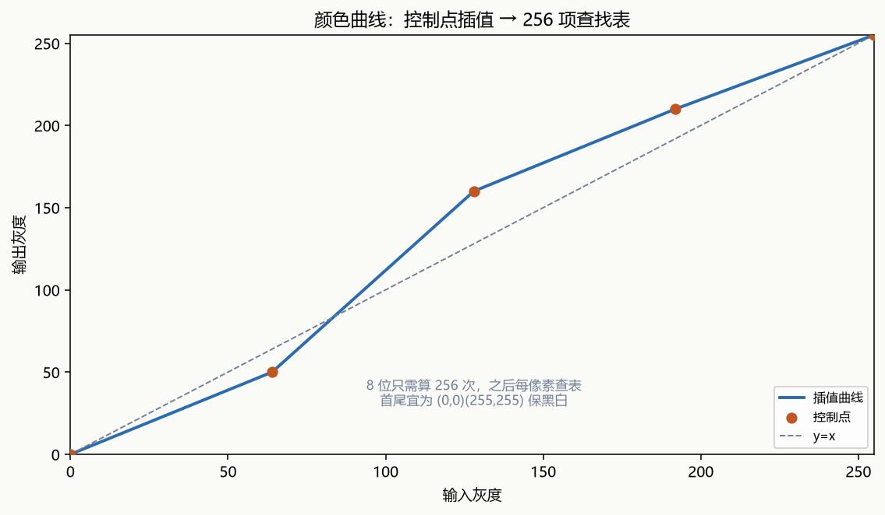
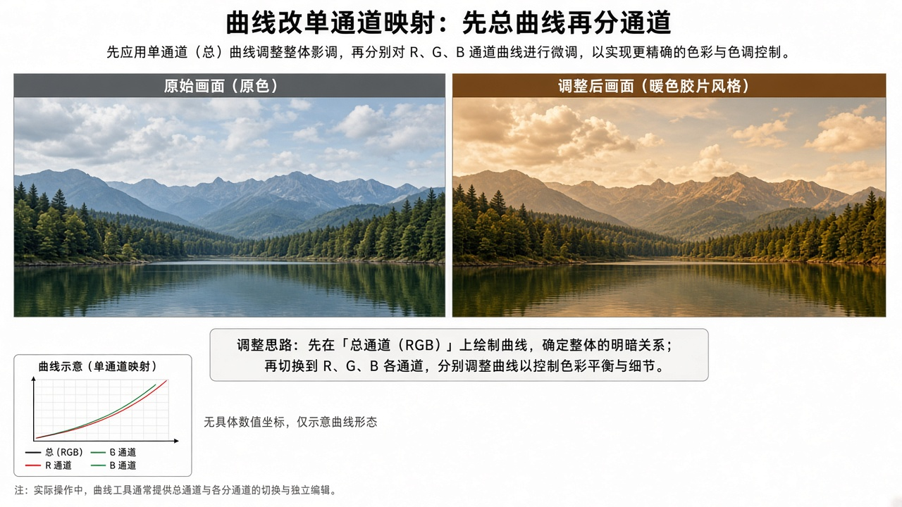

# 附录 颜色曲线

来源：文档1《OpenCV 4计算机视觉:Python语言实现》附录「基于曲线滤波器弯曲颜色空间」（用户给定 PDF 552–567；实测附录标题 PDF 553，小结 PDF 567；PDF 552 仍是第10章 10.9 页缝，本章不展开 ANN）。**对应文档2：无**。文档1第3章 Cameo 从「曲线」胶片效果起就指向此处，正文章不展开插值数学。

## 本章总览

曲线 = 对单个通道做「输入灰度 → 输出灰度」的重映射：目标像素某通道的新值，只是源像素同一通道旧值的函数。函数不直接写公式，而是给一组控制点，用插值拟合出必须经过这些点的光滑曲线。学完应能回答：为什么查表而不是每像素跑一次插值、三次样条至少几个点、BGR 上「全通道曲线」和「分通道曲线」谁先谁后、`ravel` 和 `flatten` 哪个会拷贝、Portra / Provia / Velvia / 交叉处理各自偏什么色。

- **文档1侧重**：`scipy.interp1d`（正文一处写作 `sciPy.interp1d`）封装成 `createCurveFunc`；查找数组；函数复合；V/BGR 四类滤波器；四种胶片味子类。控制点取自摄影师 Petteri Sulonen 的胶片曲线文章。

- **文档2侧重**：无对应章节。

属于正文章的内容，附录不展开：Cameo 主循环与窗口（第2章）；滤波/描边核（第4章，3.7 只把柯达效果指到这里）；ANN/DNN（第15章）。本附录只有 SciPy 曲线，没有 OpenCV `LUT` 专节（`LUT` 在融合第3章文档2）。

跨章回填与仍缺项：

- Cameo 如何挂上 Portra 滤波器：附录只实现曲线/查找表；Cameo 窗口外壳在第2章；第3/4章只指向附录，两书未给主程序逐行挂接。
  👉 完整深度讲解见第2章、第3章。

- 四套胶片控制点的具体坐标：正文用代码插图给出，文本层未抽出数值表。
  👉 该细节原书未完整抽出，暂不展开（代码插图）。

- `cv2.LUT` 官方原型：文档2 LUT 的 `dst` 类型跟查找表走；本附录是 SciPy 查表。
  👉 完整深度讲解见第3章。

## 核心知识点

### 曲线在做什么

【文档1观点】对 BGR 图，伪代码层面：每个通道独立，`dst[c] = f_c(src[c])`。插值实现可以不同；应避免控制点处斜率不连续，而应得到曲线。控制点够多时用三次样条。

这和「邻域滤波」不同：新值不看邻居，只看本通道本像素。也和文档2 第3章的 `LUT` 同一类「按灰度查表」，但本附录的表由控制点插值生成，并缓存成数组。

第2章 Cameo 只搭好进出水管：`CaptureManager` 包 `VideoCapture`，主循环 `enterFrame` / `exitFrame`；`WindowManager` 建窗显图；`Cameo` 空格截图、Tab 开关录像、Esc 退出。滤波、换脸当时不写。第3章、第4章把柯达胶片效果指到本附录的 `filters.py` / `utils.py`，两书都没有把 Portra 逐行接进 `cameo.py` 主循环的完整清单。

👉 完整深度讲解见第2章、第3章。

#### 通道独立，不看邻居

新值只是同一通道旧值的函数。锐化/模糊核解决不了「胶片色偏」，那是第4章邻域滤波的事。

🔑 关键速记：颜色曲线是每通道一维映射，不是卷积，也不在附录里重写 Cameo 主循环。

🔑 关键速记：附录实现曲线和查找表；窗口外壳在第2章，第3/4章只指向这里，未给主程序逐行挂接。

### 用 SciPy 从控制点得到函数

大部分工作交给 SciPy 的 `scipy.interp1d`：两个数组（x 与 y）→ 返回插值这些点的函数。可选 `kind`：`'linear'`、`'nearest'`、`'zero'`、`'slinear'`（书注「球面线性」）、`'quadratic'`、`'cubic'`。可选 `bounds_error=False` 时允许外插和内插。

Cameo 的 `utils.py` 用更简单的接口封装：接受 (x, y) 对的数组（比两个独立坐标数组好读）。数组必须按 x 严格递增排序。想看起来自然，y 通常也应递增，且首尾控制点为 (0, 0) 与 (255, 255) 以保住黑和白。x = 通道输入，y = 对应输出。例：(128, 160) 让中间调变亮。

次数与点数：

- 三次插值至少 4 个控制点。
- 只有 3 个点 → 改二次。
- 只有 2 个点 → 改线性。
- 书建议：为了自然逼真，应避免后两种备用。

下面这张表只收 SciPy 插值与 Cameo 封装；不是 OpenCV API。

| 名称 | 功能 | 主要参数 | 约束&坑点 |
|---|---|---|---|
| `scipy.interp1d` | 由散点得到插值函数 | x、y 数组；`kind` 见上；`bounds_error=False` 允许外推 | 附录接口名按书：一处 `sciPy.interp1d`、后文 `scipy.interp1d`。不是 OpenCV API |
| `createCurveFunc`（utils） | 用 (x,y) 对生成曲线函数 | 点列须 x 递增；内部按点数选 cubic / quadratic / linear | 2～3 个点能算但不自然。首尾不是 (0,0)/(255,255) 时黑白会漂移 |

取值：x 必须严格递增；首尾宜钉在 (0,0) 与 (255,255)；2～3 个点能跑，书认为不自然。

#### 控制点是映射，不是画布坐标

(128, 160) 表示输入 128 映射到 160，不是把点画在图像上。四套胶片的具体数字在代码插图。

👉 该细节原书未完整抽出，暂不展开（代码插图）。

🔑 关键速记：控制点按 x 递增；(128,160) 是灰度映射，首尾钉死 0 和 255 才保黑白。

🔑 关键速记：三次样条至少 4 点；两点/三点能算，书认为看起来不自然。

### 缓存查找表，再应用到图

曲线函数可能很贵，不能每通道每像素都跑一遍（书算 640×480×3 = 每帧 921 600 次）。8 位通道只有 256 个可能输入，可预计算并存储输出，之后每像素只是查表。

`createLookupArray`：为给定函数建查找数组。`applyLookupArray`：把查找数组用到另一数组（图像）上。源数组的值当索引；Python 切片 `[:]` 把查到的值写进目标。

约束：`createLookupArray` 只适用于非负整数输入（当数组下标）。连续套两条以上曲线时，多次查找又慢又掉精度——应在建表之前把两个函数合成一个函数（`createCompositeFunc`）。该书实现用 `lambda` 做单参数匿名函数；两函数的参数类型须兼容。

全通道同一条曲线时，不必 `split`/`merge`：`numpy.ravel` 给出已有数组的一维视图（`numpy.view`，与 `numpy.array` 接口相同，只有引用没有副本）。`flatten` 会返回副本。`ravel` 适用任意通道数，可抹平灰图和彩图在「所有通道同样处理」时的差异。

第3章文档2 的 `cv::LUT`：`src` 只能 `CV_8U`（可多通道）；`lut` 为 1×256，单通道或与 `src` 通道数相同；`dst` 尺寸等于 `src`，类型等于 lut 的类型（不跟 `src`）。单通道 lut 时所有通道共用一张表。本附录的表由 SciPy 插值生成，再用 NumPy 按下标写入，不是调用 `cv2.LUT`。

👉 完整深度讲解见第3章。

下面这张表收附录自制的建表/套表/复合，以及 `ravel` 与 `flatten` 的差别。

| 名称 | 功能 | 主要参数 | 约束&坑点 |
|---|---|---|---|
| `createLookupArray` | 函数 → 查找表 | 输入当作下标，故须非负整数 | 浮点通道不能直接当索引 |
| `applyLookupArray` | 按源像素查表写入目标 | 源值 = 下标 | 与文档2 `LUT` 同类思路，实现是 NumPy 索引不是 `cv2.LUT` |
| `createCompositeFunc` | 先复合再造表 | 只吃单参数函数 | 连续多条曲线不要查两次表 |
| `numpy.ravel` | 多维 → 一维视图 | 不拷贝 | 不要用 `flatten` 当省内存方案 |

取值：查找表按下标寻址，负数或非整数不能当索引；复合多条曲线要先合成函数再造表。

#### 8 位只需 256 项

640×480×3 若每像素跑插值是每帧 921 600 次。预计算后每像素只查表。浮点通道不能直接当索引。

🔑 关键速记：8 位通道先算 256 项表；连续多条曲线先复合函数，不要查两次表。

#### `ravel` 是视图，`flatten` 是副本

改视图即改原图。全通道同一条曲线时用 `ravel`，不必先 `split`。

🔑 关键速记：`ravel` 不拷贝，`flatten` 拷贝；不要用错当省内存。

🔑 关键速记：文档2 `LUT` 的 `dst` 类型跟查找表走；本附录是 SciPy 插值再 NumPy 下标，不是那条 API。

### 面向对象：V 通道与 BGR 四类

因为每条曲线缓存一张查找表，滤波器带状态，所以做成类而不是裸函数。文档1列出：

- `VFuncFilter`：用函数构造，`apply` 到图像。函数作用在灰度的 V（值）通道，或彩色图的所有通道。
- `VCurveFilter`：`VFuncFilter` 子类；用控制点构造，内部生成曲线函数。
- `BGRFuncFilter`：最多 4 个函数：一个作用于所有通道，另外三个各管一通道。顺序：先整体函数，再分通道函数。
- `BGRCurveFilter`：`BGRFuncFilter` 子类；用 4 组控制点构造。

所有类还接受数值类型（如 `numpy.uint8`，每通道 8 位），用来决定查找表有多少项：整数类型，范围 0 到该类型最大值（含）。内部用 `numpy.iinfo` 定范围；BGR 类还用 `cv2.split` / `cv2.merge`。这四类可直接传入自定义函数或控制点；也可再派生硬编码点子类，从而无参构造。

下面这张表对照单曲线与 BGR 四函数的叠加顺序。

| 名称 | 功能 | 主要参数 | 约束&坑点 |
|---|---|---|---|
| `VFuncFilter` / `VCurveFilter` | 单曲线（灰或全通道） | 函数或控制点；dtype 决定表长 | 彩图走 ravel 式全通道同一曲线 |
| `BGRFuncFilter` / `BGRCurveFilter` | 1 条总曲线 + 3 条通道曲线 | 先总后分；dtype 同上 | 通道顺序是 BGR。分通道与总通道叠加顺序写反会偏色 |

取值：dtype 决定表长；BGR 必须先整体再分通道，顺序写反会偏色。

#### 先整体曲线再分通道

`BGRFuncFilter` 最多 4 个函数。先套总曲线，再套 B/G/R。与「先分通道再整体」结果不同。通道顺序是 BGR。

🔑 关键速记：BGR 类先总后分；写反会偏色，通道序是 B、G、R。

🔑 关键速记：查找表长度由整数 dtype 的最大值（含）决定，内部用 `iinfo`。

### 模拟胶片：四种子类

【文档1观点】每种胶片有独特的颜色/灰色再现。概括相对数码传感器：胶片常在阴影丢细节和饱和，数码常在高光出这些缺陷；胶片在光谱各段饱和不均匀，于是有「特定颜色」。好看的胶片照往往亮、带主色调；另一极端是曝光不足、怎么冲也糊。

四种效果都是 `BGRCurveFilter` 的薄子类，只重写构造函数、给各通道控制点。灵感：

- 柯达 Portra：肖像与婚礼。宽高光，高光偏暖（琥珀），阴影偏冷（蓝）；肤色更白；夸大乳白色（婚纱）和深蓝色（西装/牛仔裤）。
- 富士 Provia：通用。对比强，多数色调略冷（蓝）；天空、水、阴影比太阳更强。
- 富士 Velvia：风景。阴影深、颜色鲜；白天湛蓝天空、日落红云。书称很难模拟，只能尝试。
- 交叉处理：非标准冲洗，时尚/乐队摄影里的「邋遢」外观。暗部强蓝或蓝绿，高光强黄或绿黄，不一定保住黑白，对比高。书称看起来令人作呕：人像黄疸，静物像上了色。

Portra / Provia / Velvia 应得到「正常」图像，不做前后对比时效果可以不明显。控制点按 Sulonen 推荐；具体数字在代码插图【信息缺口，需要局部查阅文档】。附录结尾让读者回到第3章 Cameo 主实现（那里演示了 Portra）。

👉 该细节原书未完整抽出，暂不展开（代码插图）。

没有官方「胶片算子」。第3章 Cameo 引用的是这里的滤波器类。

#### 正常胶片 vs 交叉处理

Portra / Provia / Velvia 应首尾钉死 0 和 255，看起来可以不明显。交叉处理可以故意不保黑白，对比高，人像会偏黄疸。

🔑 关键速记：Portra 暖高光冷阴影，Provia 冷对比，Velvia 浓饱和，交叉处理可不保黑白。

🔑 关键速记：四套控制点数值仍在 PDF 插图里；附录没有 OpenCV 官方胶片 API。

## 易混淆点&差异对比

| 对比项 | 文档1 附录 | 文档2 |
|---|---|---|
| 有无专章 | 有：曲线数学 + SciPy + 胶片子类 | **无** |
| 重映射手段 | 控制点 → `interp1d` → 查找数组 | 第3章 `LUT` 是现成查表 API，不讲样条控制点 |
| 胶片味 | Portra / Provia / Velvia / 交叉处理 | 无 |

文档2 没有这一附录。`cv2.LUT` 的参数表不能当成这里 SciPy 实现的原型。

其他易混：

- 曲线不是卷积：不看邻域，只看本通道取值。第4章的锐化/模糊核解决不了「胶片色偏」。

- (128,160) 是「输入 128 映射到 160」，不是坐标点画在图上。

- 先整体曲线再分通道，与「先分通道再整体」结果不同。

- `ravel` 视图 vs `flatten` 副本：改视图即改原图。

- 查找表按下标寻址，负数或非整数不能当索引。

- 两点/三点的备用插值能跑，但书认为看起来不自然。

- 交叉处理可以故意不保黑白；Portra 等「正常胶片」则应首尾钉死 0 和 255。

- 第3章 Cameo 引用的是这里的滤波器类，不是再实现一套 OpenCV 官方「胶片 API」（没有这个官方算子）。

- 第2章只搭 CaptureManager / WindowManager 外壳；本附录不重写主循环挂接。

## 本章要点总结

- 颜色曲线 = 每通道的一维映射，由递增控制点插值而来；8 位下预计算 256 项查找表，复合多条曲线时先合成函数再造表。

- 三次样条至少 4 点；首尾 (0,0)/(255,255) 保黑白；BGR 类先套总曲线再套 B/G/R。

- 胶片模拟是硬编码控制点的 `BGRCurveFilter` 子类：Portra 暖高光冷阴影，Provia 冷对比，Velvia 浓饱和，交叉处理高对比且可不保黑白。

- Cameo 窗口外壳见第2章；`cv2.LUT` 见第3章。具体控制点数值仍在 PDF 插图里，未写入本笔记。
