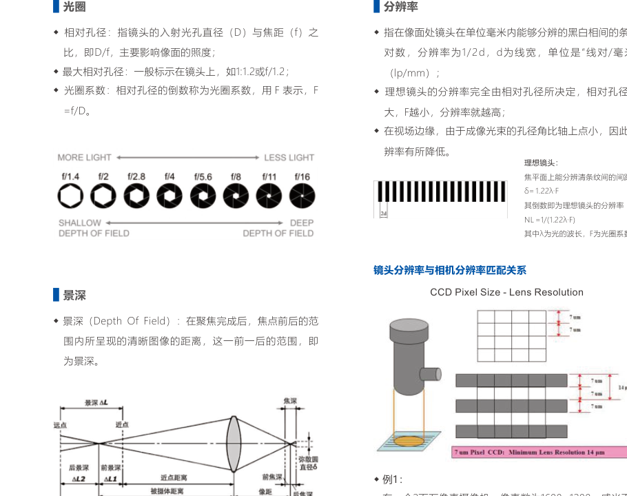
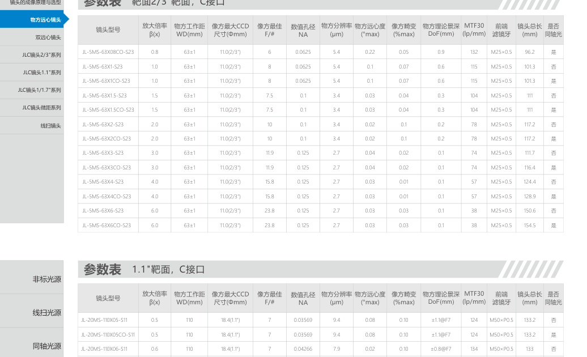

# 第10章 工业镜头

来源：工业视觉硬件产品手册（2026版）。首页标题核对：镜头成像原理与选型起于约书页 183–184（PDF idx 92），线扫镜头接到相机章页缝（idx 102 起为相机概述）。型号保留原编号，叙述去掉品牌前缀。

## 本章总览

镜头把物平面成像到传感器。机器视觉镜头是厚透镜组，但选型仍用薄透镜三条光线：平行轴的光线过像方焦点；过物方焦点的光线出射平行轴；过光心方向不变。工作距离一般指镜头前端到被测物。

选镜头四件事：**靶面是否覆盖传感器、焦距/倍率是否覆盖视野、工作距是否装得下、接口与畸变是否满足测量。** 远心用来压透视误差；普通 FA 用来看清、看远、看视场。

👉 同轴光口版本（型号带 CO）仍要配同轴灯，见第2章。

🔑 关键速记：先对靶面再对倍率/焦距，远心只在要测尺寸时上。

## 核心知识点（成像原理）

### 薄透镜与焦距

光心：过该点光线方向不变。主轴：两折射面曲率中心连线，一条；副光轴无数。物方平行轴的光线过像方焦点；物方焦点发出的光线出射平行轴。物方焦距 f：物方主点 H 到物方主焦点 F。物距：物方主点到物平面；像距：像方主点到像平面。

### 焦距、视场与光圈

- 长焦：视场角小，远处景物更大；短焦：视场角大，近处范围大；中焦约等于靶面对角线。
- 相对孔径 = 入射光孔直径 D / 焦距 f；最大相对孔径标在镜身上，如 1:1.2 或 f/1.2。光圈系数 F 是相对孔径的倒数。
- 景深：聚焦后仍可视为清晰的前后范围。
- 分辨率：像面单位毫米能分辨的黑白条纹对数；理想情况由相对孔径决定，孔径越大分辨率潜力越大；视场边缘孔径角变小，分辨率下降。

### 工作距离与畸变

工作距离（Working Distance）：镜头前端到被测物。短焦易桶形失真，长焦易枕形；人眼对小于 **2%** 的畸变不敏感，精密测量仍要校。定焦：只有一个焦距。

远心：出瞳或入瞳在无穷远的设计，一定物距范围内物体远近变化时像大小更稳，用来纠正普通镜头的透视误差。种类含物方远心、双远心（手册分开列表）。



🔑 关键速记：WD 是前端到物，焦距决定视角，F 数决定进光和景深。

## 核心产品系列

### 5MS / 20MS 系列物方远心镜头

#### 产品特点

- 支持 2/3" 及 1.1" 靶面工业相机。
- 物方远心，提高测量精度。
- 2/3" 物方远心覆盖约 **0.3–6 倍**；1.1" 覆盖约 **0.246–6 倍**。
- 全系列均有带同轴光版本（型号含 CO）。

#### 核心参数表（型号线索）

2/3" 示例：5MS-110X03-S23 … 5MS-108X6-S23，以及 5MS-63X08-S23 至 X6；带 CO 为同轴口。

1.1" 示例：20MS-110X05-S11 … 20MS-108X6-S11，20MS-180X08-S11，20MS-220X05/0345/0246-S11。

更多型号手册写咨询渠道，不编造。

#### 适用场景

小工件尺寸测量、需要同轴口的远心检测。

🔑 关键速记：物方远心选 5MS/20MS，倍率对靶面，要同轴加 CO。

### 5MD / 20MD 系列双远心镜头

#### 产品特点

- 支持 2/3" 及 1" 靶面。
- 双侧远心，超高远心度，手册称可提升数倍测量精度。
- 2/3" 双远心约 **0.038–0.317 倍**；1" 约 **0.055–0.460 倍**。

#### 核心参数表（型号线索）

5MD-110X0317-S23 至 5MD-465X0038-S23。

20MD-110X0460-S1 至 20MD-465X0055-S1。

低倍率、大视野精密测量优先双远心；高倍率小视野用物方远心。



🔑 关键速记：要测得稳用双远心 MD，要放大看细节用物方 MS。

### 2/3" 系列工业镜头（6MP 档示例）

手册编码：焦距 + 最大光圈 + 像素档。示例：JLC-0619-6MP、0828C-6MP、1216C-6MP、1616-6MP、2516-6MP、3516-6MP、5020-6MP、7528-6MP、10056-6MP。STL 结构光页亦列出 0828/1216/1616/2516/3516-6MP 为适配镜头。

C 口常见。畸变、最低摄距【信息缺口：6MP 表未在本批完整抽出】。

🔑 关键速记：普通 2/3" 看像素档和焦距，测量级不够再升级远心。

### 1.1" 系列工业镜头（25MP 档示例）

示例：DLC-0618-20MP，JLC-0828-25MP、1228C-25MP、1624-25MP、2524-25MP、3524-25MP、5024-25MP、7526-25MP。靶面 1.1"；光圈范围示例 1.8–16 至 2.6–20；最低摄距示例 100 mm 或 250 mm（随焦距变）。Tv 畸变、滤镜螺纹【部分在原表，文本层未全抽出 → 信息缺口】。

🔑 关键速记：大靶面高像素先确认镜头 1.1" 能罩住，否则边角黑。

### 1/1.7" 系列工业镜头

侧栏有 500 万 / 1200 万像素 1/1.7" 系列。具体型号表【信息缺口：本批未完整抽出】。

### 微距系列工业镜头

型号含 M：JLC-3516M-5MP、5016M-5MP、2528M-20MP、3528M-20MP、5028M-20MP、7538M-20MP。近距离大倍率外观/字符，工作距短。

🔑 关键速记：微距看近，不要拿长焦当微距用。

### 100MP 档镜头（接口变体）

JLC-3528/5028/8035-100MP，接口 M42 / M58 / M72 / F。超高像素面阵用，接口必须和相机口一致。

### 线扫镜头 JS 系列

示例：JS2040/2540/3528（M42）、JS4032/5028（M42/M58/M72/F）、JS4056，以及大靶 JS14640 / JS11640（M42–M95，倍率线索 0.5 / 0.75 / 1 / 1.33 / 2 / 3）。线阵幅面宽，镜头像面要罩住线长，不能拿面阵镜头硬套。

👉 线阵相机见第11章。

🔑 关键速记：线扫镜头对线长和接口，倍率写在型号末段。

## 选型对比与建议

```mermaid
flowchart TD
  A[测量还是观察] -->|精密尺寸| T[远心]
  T -->|高倍| MS[物方 5MS/20MS]
  T -->|大视野低倍| MD[双远心 5MD/20MD]
  A -->|观察/定位| FA[按靶面选 FA]
  FA --> B{传感器}
  B -->|2/3"| S23[6MP 等]
  B -->|1.1"| S11[25MP 等]
  B -->|线阵| JS[JS 系列]
```

手册远心选型提示：已知 2/3" 靶面 8.8×6.6 时，用视野短边/长边去反推倍率（例题原文未抄全，不编数字）。

| 类型 | 何时选 |
| --- | --- |
| 物方远心 | 中高倍测量 + 可选同轴口 |
| 双远心 | 低倍大视野测量 |
| FA 定焦 | 普通检测 |
| 微距 | 极近工作距 |
| 线扫 JS | 线阵 |

🔑 关键速记：测量走远心，观察走 FA，线阵走 JS。

## 本章要点总结

- 机器视觉镜头按厚透镜制造，用薄透镜模型选型。
- 畸变 <2% 人眼可忽略，测量不能忽略。
- 同轴口镜头仍要配同轴光源。
- 1/1.7" 全表、部分畸变/螺纹为信息缺口。
