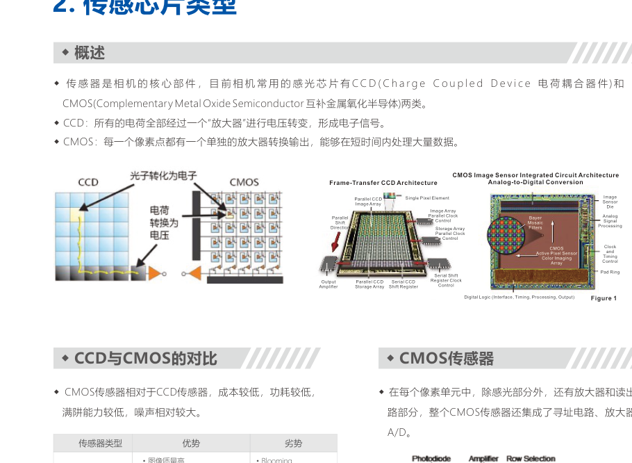
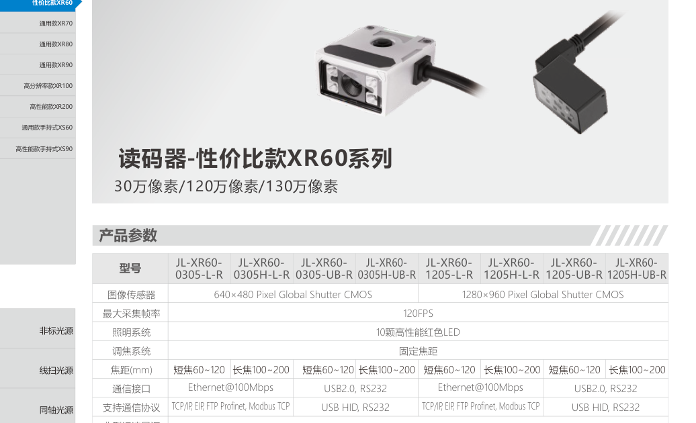
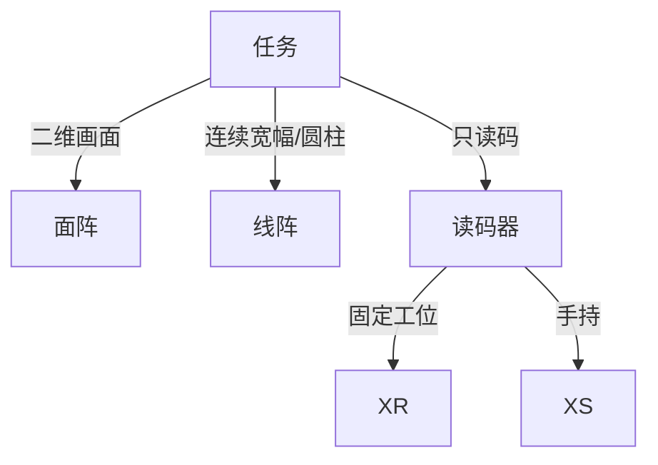

# 第11章 工业相机与读码器

来源：工业视觉硬件产品手册（2026版）。首页标题核对：工业相机概述约书页 203（PDF idx 102），读码器 XR60 起于 idx 107（约书页 213），手持 XS 至手册末页。工控机仅企业简介一句，目录无章，不收录。

## 本章总览

工业相机把光学像变成数字图像。按像元排列分**面阵**与**线阵**；按输出分模拟与数字。读码器是带解码算法（及部分自带照明）的专用相机，系列按 XR 固定式、XS 手持式划分。

选型先定面阵还是线阵，再定分辨率、帧率/行频、接口（USB3 / GigE / Camera Link / CXP），最后定镜头靶面和口。

👉 镜头靶面与接口见第10章；线扫光源见第5章。

🔑 关键速记：面阵一次拍整幅，线阵一次拍一行再靠运动拼图。

## 核心产品系列

### 工业相机基本参数与选型

#### 产品特点（原理）

- 功能：通过传感器把二维光强变成图像。
- 模拟相机：抗干扰差，接口不统一，图像尺寸、帧率、比特深度受限；早期多用 PAL / NTSC / CCIR / EIA-170。
- 数字相机：接口与协议统一方向（USB3 Vision、GigE Vision 等）。
- 分辨率：能捕捉的细节，用像素表示。面阵常见 640×480、1600×1200 等；线阵常见 1K、2K、4K、8K、16K。
- 扫描：隔行把一幅分成奇偶两场；逐行按行顺序输出。
- 传感器：CCD 电荷经单一放大器；CMOS 每像素有放大器，短时间处理大量数据，成本与功耗相对较低。
- 最大帧率：面阵每秒采集并输出的最大幅数。最大行频：线阵每秒输出的最大行数。
- 线扫描系统在大幅面、高精度、圆柱状物体上有优势；线阵 CCD 要二维图必须配扫描运动。

面阵：阵列排列，短时间曝光一次获取完整目标。线阵：一维像元，每次曝光只是目标上一行。

🔑 关键速记：分辨率看细节，帧率/行频看节拍，接口看线长和带宽。

### 面阵相机

手册列出：

- **千兆网 RH 系列**：RHCG / RHCS，型号如 RHCG-040123-GM/C 至 RHCG-250004-GM/C。
- **千兆网 RE 系列**：RECG / RECS，如 RECG-040123-GM/C 至 RECS-200006-GM/C。
- **USB 通讯 RH 系列**：RHCG / RHCS，后缀 UM/C，如 RHCG-040526-UM/C 至 RHCG-250015-UM/C。
- **万兆网线索**：RCG-250041-XGM/C-C、XGM/C-M58，RCG-650017-XGM/C。

GM/C 表示黑白/彩色线索（手册并列）。具体像元尺寸、靶面、帧率【信息缺口：参数表未在文本层完整抽出】。

#### 适用场景

静止或间歇工位、需要二维一次性成像。接口：短距 USB3，长距千兆网，超高带宽万兆/CXP（线阵更多见 CXP）。

🔑 关键速记：面阵先选接口再选像素，靶面必须被镜头罩住。

### 线阵相机 LSC 系列

#### 产品特点

幅面宽、像元尺寸灵活、行频高。必须与运动和线扫光源同步。

#### 核心参数表（型号线索）

| 幅面线索 | 型号示例 | 接口线索 |
| --- | --- | --- |
| 2K | LSC-02K49M-GV、02K49C-GV、02K59M-GV、02K44C-GV | GigE Vision |
| 4K | LSC-4K28M/C-GV、04K29M-GV、04K180M/C-CL | GV / Camera Link |
| 8K | LSC-08K13M-GV、08K80M-CL、08K100M/C-CL-RIO/CIO、08K34C-CL | GV / CL |
| 16K | LSC-16K50M-CL、16K250M-CXP、16K92C/M-CXP | CL / CXP |

M/C 为单色/彩色线索。行频数值【信息缺口】。

🔑 关键速记：线宽对产品宽度，接口对数据量，光源必须是线扫形态。

### 读码器 XR 固定式系列

自带照明与解码，供电多标 **24V DC**。XR100 功耗示例 **<8.0W@DC24V（不含自带光源）**。

| 系列 | 定位 | 型号示例 |
| --- | --- | --- |
| XR60 | 性价比 | XR60-1305-U-R、1310-L-R、1310-U-R、1305-L-R |
| XR70 | 通用 | XR70-1206/1212/1216-LB-R/W/B |
| XR80 | 通用 | XR80-1007-LB-R、1012-LB-R |
| XR90 | 通用 | XR90-6008/6012/6016/6025-LB-R/W/B |
| XR100 | 高分辨率 | XR100-201C-LB、250C-LB |
| XR200 | 高性能 | XR200-1308/2408/5008/20008-LB-R |

U/L、R/W/B 为接口或光源颜色线索（手册未在抽出文本中给全称，不编造）。

🔑 关键速记：固定读码按 XR 档位选，供电 24V，高分辨率走 XR100。

### 读码器 XS 手持式系列

| 系列 | 定位 | 型号示例 | 供电线索 |
| --- | --- | --- | --- |
| XS60 | 通用手持 | XS60-1305H-UC/LBC、1307HD-UC/LBC | USB 5V；DC12–24V 可选；约 2W@12–24V |
| XS60B | 电池款 | XS60B-1305H-U/ES、1307HD-U/ES | 读码器电池 3.8V；底座 USB 5V 或 DC12–24V |
| XS90 | 高性能手持 | XS90-1007-UC/BC | USB 5V 或 DC12–24V；2W@12–24V；电池款 2W@3.8V，底座 6.5W@12–24V |
| XS90B | 电池高性能 | XS90B-1007-U/ES | 电池 3.8V；接收器 DC12–24V，约 1W@12–24V |

#### 适用场景

人工抽检、仓库、产线补打码。连续在线解码仍用 XR 固定式。

🔑 关键速记：手持选 XS，要电池带 B，线电压不要和 XR 的 24V 混接。

## 选型对比与建议

| 类型 | 运动要求 | 配套光 |
| --- | --- | --- |
| 面阵 | 可静止 | 环/条/同轴/背光等 |
| 线阵 | 必须相对扫描 | 线扫灯（第5章） |
| XR | 工位固定 | 多自带灯 |
| XS | 手持 | 自带灯 |

面阵 vs 线阵：面阵一次完整目标、短曝光；线阵一行一行、行频高、幅面宽。线阵拼图质量取决于运动匀速与编码器（控制器 MPL 可跟编码器，见第9章）。

👉 分时频闪与编码器见第9章。

🔑 关键速记：读码用 XR/XS，检测成像用面阵或线阵相机。

## 本章要点总结

- 数字接口优先于模拟。
- CMOS 与 CCD 手册给出结构差异，具体型号传感器【部分缺口】。
- 读码器功耗不含灯时要另算。
- 帧率/行频/像元尺寸大量未抽出，选型以原表为准。
