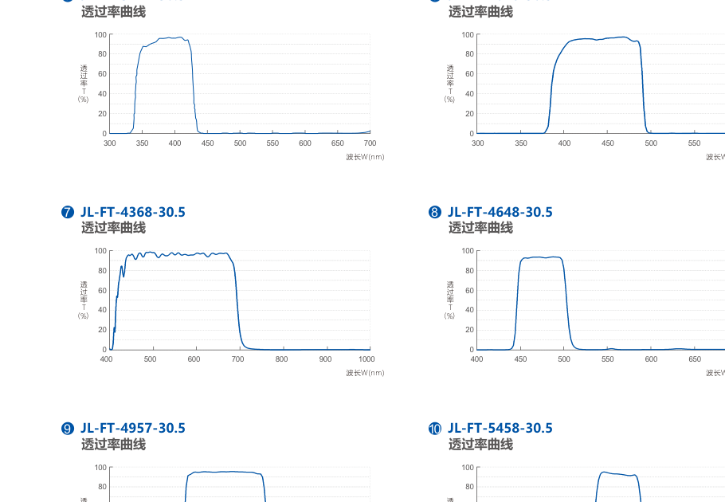
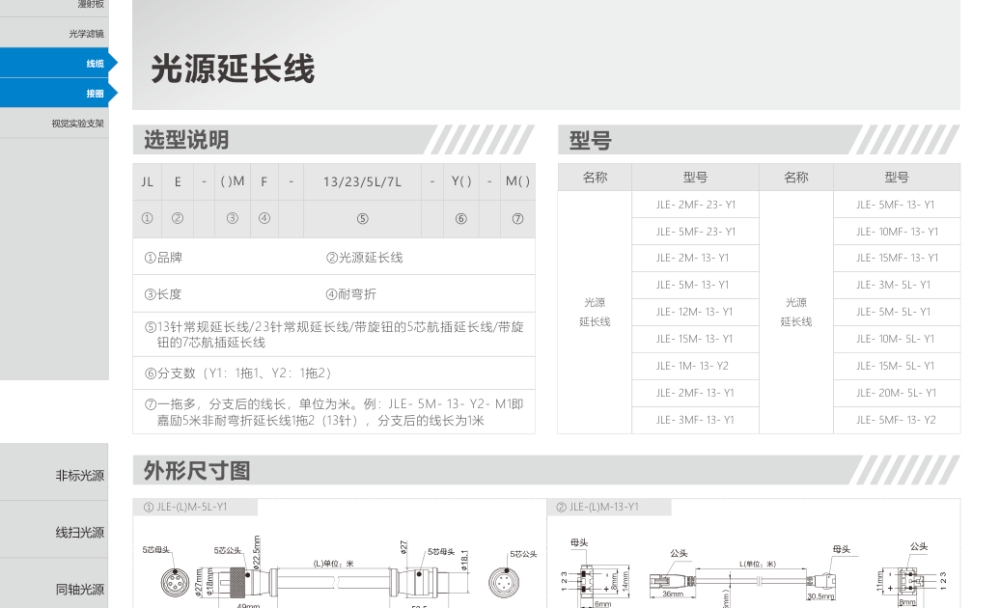
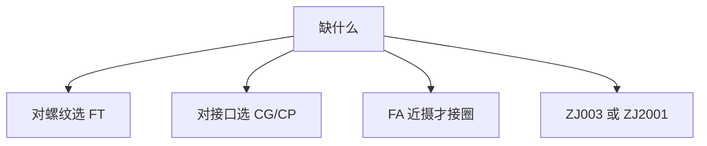

# 第12章 配件与实验支架

来源：工业视觉硬件产品手册（2026版）。首页标题核对后：滤镜、线缆、接圈、实验支架约书页 153–160（与 PL 激光页缝：idx 77 仍是 PL，滤镜从 idx 78 起）。漫射板在光源页多次写「可加漫射板」，配件页未抽出独立漫射板规格表。

偏振与滤镜的**原理、选用步骤**在第1章；本章只做种类、口径、线缆与支架规格。红外/紫外波长与滤镜配合见第8章。

👉 偏振与滤镜原理见第1章；IR/UV 见第8章。

## 本章总览

配件不发光，但能决定像能不能看：滤镜选波长、偏振片压反光、线缆决定触发和供电是否可靠、接圈改工作距、支架决定重复装调。选型顺序：先定镜头滤镜螺纹，再定线缆接头与长度，最后定支架行程。

🔑 关键速记：滤镜对螺纹，线缆对接头，支架对行程，三件都要和镜头相机光源对上。

## 核心产品系列

### 光学滤镜

#### 产品特点

手册以 **FT** 系列列出，螺纹尺寸示例 **30.5**（型号末段）。用于按波段透过或截止，与第1章「滤镜选用步骤」配套。

第1章：滤镜装在镜头前，按要保留的波长选通带；偏振片装在光源前、偏光镜装在镜头前，用来减反光。本章产品是已经做成镜片规格的滤镜。

#### 核心参数表

通带波长写在型号中段，单位按手册为 nm 线索；未提供透过率曲线。【信息缺口：透过率、截止深度未列出。】

| 型号 |
| --- |
| FT-52-30.5、FT-81-30.5、FT-90-30.5、FT-96-30.5 |
| FT-3742-30.5、FT-4048-30.5、FT-4368-30.5 |
| FT-4648-30.5、FT-4957-30.5、FT-5458-30.5 |
| FT-5759-30.5、FT-6164-30.5、FT-8486-30.5 |

#### 适用场景

红外只留 850/940、紫外激发后只留荧光、抑制环境光、配合偏振。

镜头滤镜螺纹见第10章各系列表（本批多数未抽出螺纹列，对不上时标缺口，不编造 M27/M30.5）。

👉 完整深度讲解见第10章。

🔑 关键速记：先量镜头螺纹再买 FT，不要只看波长。

### 线缆

#### 产品特点

长度可按需要定制。P：带适配器。颜色后缀 PR / GR 为线色线索（手册未解释全称，不编造）。

#### 核心参数表

| 型号 | 长度线索 |
| --- | --- |
| CG-BD-3M-PR / 5M-PR / 3M-GR / 5M-GR | 3 m / 5 m |
| XCG-BD-3M-PR / 3M-GR | 3 m |
| CP-6P-3M-PR / GR，及 -P 带适配器 | 3 m |
| CP-6PU-3M-PR / GR | 3 m |

接头针数、是否带触发【信息缺口：型号展开页未抽出针脚定义】。光源页出现的连接器示例（如第5章 HKJT-20J6TQ-6P-G）要与控制器、灯口一致。

👉 控制器接口见第9章。

🔑 关键速记：线缆按接头和长度定制，带 P 是带适配器，不要只按米数下单。

### 接圈

配件目录含接圈。本批 idx 80 型号列表几乎未被文本层展开。【信息缺口：接圈厚度规格未抽出。】

接圈加在镜头和相机之间，用来拉近最短工作距。远心和 STL 结构光镜头手册写前后距可调、无需接圈，乱加接圈会破坏设计共轭。

👉 远心与 STL 见第10章、第7章。

🔑 关键速记：FA 镜头近摄可加接圈；远心不要随意加。

### 漫射板

光源多页写「可加漫射板」以提升均匀、去掉灯珠像。配件章未抽出独立型号表。【信息缺口】

漫射把方向性光打散，阴影变软、对比变低，和格栅、同轴不是同一类附件。

👉 无影漫射见第6章；格栅见第8章。

🔑 关键速记：灯珠倒影重就加漫射板，要保留边缘对比就不要乱加。

### 视觉实验支架

#### 产品特点

**ZJ003-C**

- 外观简洁，便于安装操作；主杆可上下移动并锁定。
- 可配不同相机和光源。
- 相机可垂直、水平、左右旋转；上下微调 **0–17 mm**。
- 夹具范围 **26–76 mm**，带棉垫；铝合金，大底板。

**ZJ2001-C / ZJ2001-V2**

- 燕尾滑台、齿轮齿条，精度更高；主杆有刻度。
- 相机可垂直、水平、左右旋转；上下微调 **0–12 mm**。
- 大理石底板，平面精度高。
- 同样可搭配不同相机和光源。

#### 核心参数表

| 型号 | 上下微调 | 夹具 | 底座 |
| --- | --- | --- | --- |
| ZJ003-C | 0–17 mm | 26–76 mm | 铝合金大底 |
| ZJ2001-C、ZJ2001-V2 | 0–12 mm | 【信息缺口：该页夹具范围句子被截断】 | 大理石 |

#### 适用场景

实验室搭光、打样、教学演示。产线模组刚度、行程以项目机械为准，不要把实验架当设备主体。

🔑 关键速记：打样用 ZJ 支架；要刻度和大理石台面选 ZJ2001。

## 选型对比与建议

| 配件 | 关键匹配 |
| --- | --- |
| 滤镜 | 波长 + 螺纹 |
| 线缆 | 接头 + 长度 + 是否适配器 |
| 接圈 | 仅普通 FA，厚度未抽出 |
| 漫射板 | 随灯订，无独立表 |
| 支架 | 微调行程与夹持直径 |

🔑 关键速记：配件全部是「匹配问题」，没有通用一只通吃。

## 本章要点总结

- 滤镜透过率曲线原书未给，不能编造。
- 接圈、漫射板独立规格为信息缺口。
- 支架是实验用途，行程以毫米计。

第1章待补的「偏振片/滤镜产品规格与透过率」：规格可用 FT 螺纹 30.5 系列型号回填；透过率仍缺。
