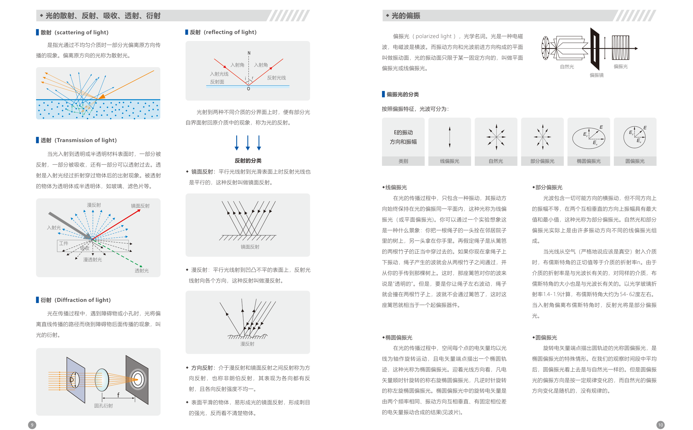
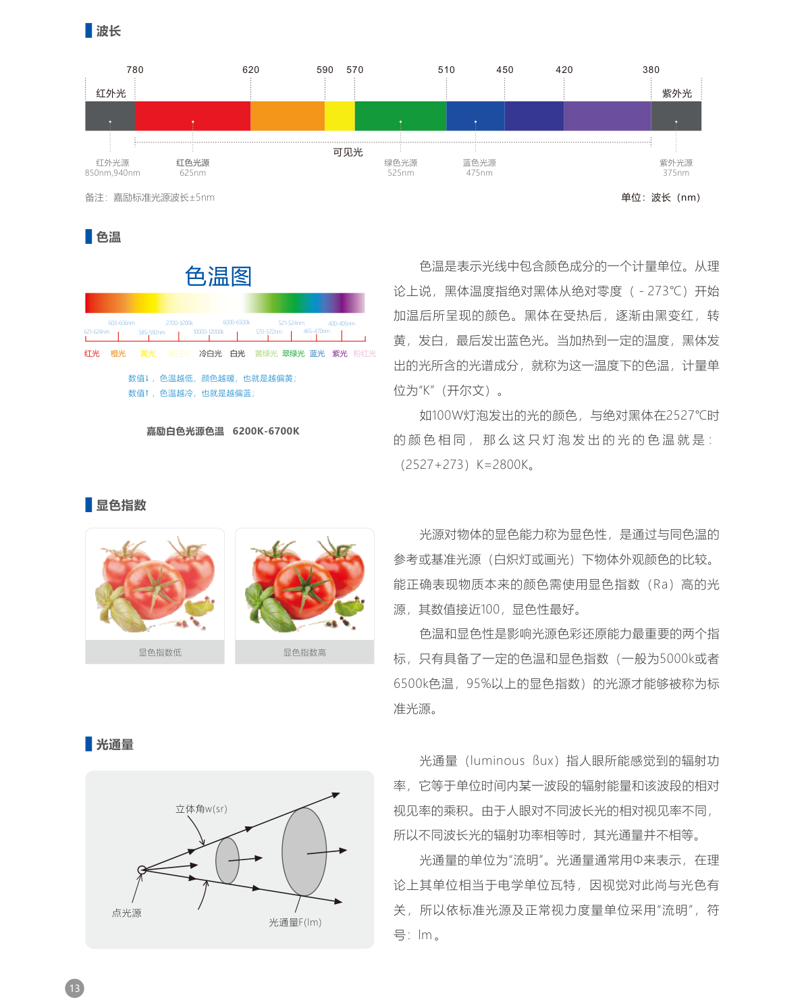
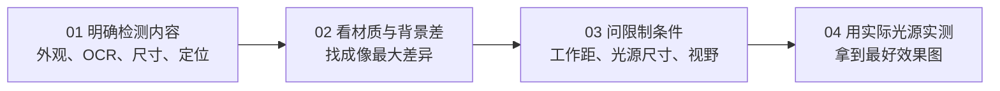
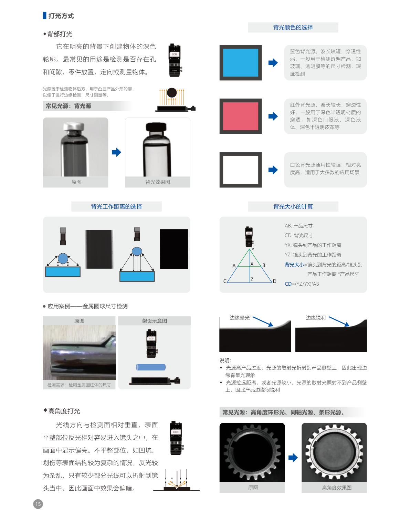
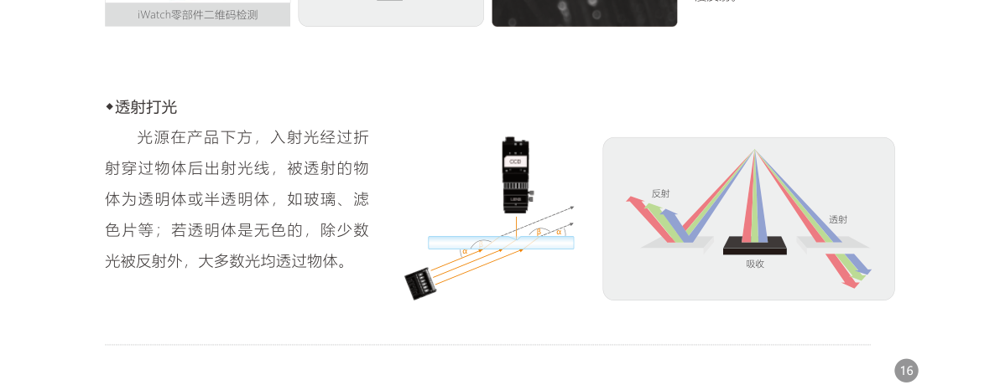
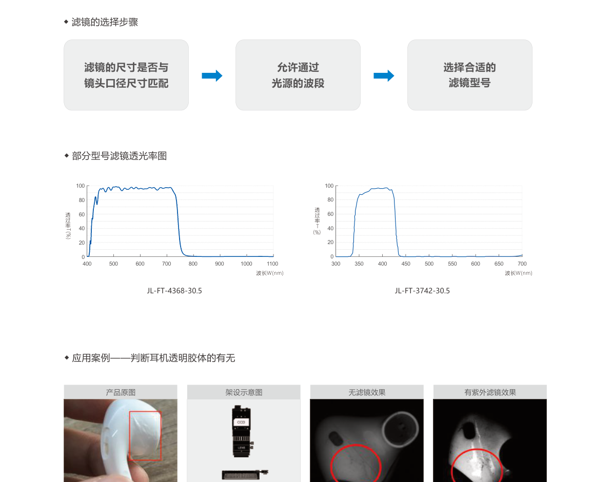

# 第1章 机器视觉光源选型基础

来源：工业视觉硬件产品手册（2026版），书页 8–21 / 对应 PDF 对开页；书页 22 仅取定制技术维度，不含该页产品参数。

## 本章总览

光源选型决定「相机看见什么」。合适的结构、角度、波长和照度，能把目标特征从背景里拉开，后面的算法才稳。

本章是全书共用底座，不讲具体产品型号参数。滤镜、偏振片的产品规格见第12章；同轴、背光、环形等硬件见第2–8章；控制器见第9章。

核心选型维度可以收成四件事：**打什么光（形态与角度）**、**打什么色（波长与色温）**、**打多亮（照度与工作距）**、**要不要滤（偏振/滤镜）**。

🔑 关键速记：光源的任务是把特征和背景分开，不是把画面照亮而已。

## 核心知识点

### 光的四特征与传播条件

光同时具备四条性质：

- **几何光学**：在均匀介质中沿直线走，日常说的「光柱」「光线」。
- **波动光学**：以波传播，不同波长对应不同颜色。
- **传播速度**：真空中约 \(3 \times 10^8\,\mathrm{m/s}\)；空气略慢，水或玻璃更慢。
- **量子光学**：能量一份一份，基本微粒叫光子，能引起感光材料的化学变化。

费马原理：均匀介质里两点之间直线耗时最短，所以表现为直线传播。光源面远大于波长时，各次波积分近似成柱体，看起来也是直线。

直线传播的条件是：**同一种均匀介质**。光从空气垂直进入玻璃仍是直线；斜射时反射光、折射光与入射光不在同一直线上。

🔑 关键速记：均匀介质走直线；斜射换介质就会折、会反射。

### 散射、反射、吸收、透射、衍射

光打到工件上，一般同时发生几件事：一部分反射，一部分吸收，透明或半透明体还会透射。

#### 散射（scattering of light）

光通过不均匀介质时，一部分偏离原方向，偏离的那部分叫散射光。

#### 反射（reflecting of light）

光射到两种介质分界面上，部分光返回原介质，就是反射。手册把反射分成三类：

- **镜面反射**：平行光打到光滑面，反射光仍平行。表面太平会出刺目强光，反而看不清细节。
- **漫反射**：平行光打到凹凸面，反射光射向各方向。
- **方向反射（非朗伯）**：介于二者之间，各向都有反射，但强度不匀。

#### 透射（transmission of light）

入射光经折射穿过物体再出射。玻璃、滤色片等透明或半透明体走这条路径。

#### 衍射（diffraction of light）

遇到障碍物或小孔时，光会绕到障碍物后面，不再严格直线。圆孔衍射是典型示意。

🔑 关键速记：光滑看镜面、粗糙看漫反射；透明体才谈透射。

### 偏振

光是横波。振动方向与前进方向构成振动面；振动面固定在一个方向，就是**线偏振光**（平面偏振光）。

按偏振特征可分成：自然光、线偏振光、部分偏振光、椭圆偏振光、圆偏振光。

- **线偏振**：传播中只保留一种振动，方向始终在同一平面。起偏器像篱笆缝：上下抖的绳子能过，左右抖的过不去。
- **部分偏振**：各方向都有振动，但两个垂直方向上振幅一大一小。自然光和部分偏振光都可看成许多线偏振的叠加。
- **椭圆 / 圆偏振**：电矢量绕光线旋转；端点走椭圆是椭圆偏振，走圆是圆偏振（椭圆的特例）。圆偏振短时平均看起来像自然光，但旋转有规律，自然光的方向变化是随机的。

**布儒斯特角**：从空气（严格说是真空）射入介质时，其正切等于介质折射率 \(n\)。\(n\) 随波长变，角也随波长变。光学玻璃 \(n\) 约 1.4–1.9 时，布儒斯特角大约 **54°–62°**。入射角偏离该值，反射光变成部分偏振。

机器视觉用法：光滑表面（玻璃、油漆、塑料、水面）的耀斑往往是偏振光。镜头前加偏振镜并旋转，把反光压掉，对比度会上去。光源侧加偏振片、镜头侧加偏振镜，两者配合，改变偏振方向，可进一步消反光。

立体电影、液晶数显也用互相垂直的偏振片，本章只作理解，不展开产品。

📝 待补全：偏振片与偏振镜的口径、型号与透过率曲线见第12章配件，本章只保留原理。

👉 完整产品规格见第12章。

🔑 关键速记：光滑反光用偏振镜转掉；布儒斯特角大约 54°–62°。

### 机器视觉常用发光体

手册用雷达图对比四类灯：设计自由度、响应速度、亮度、热效能、价格、寿命。

| 类型 | 手册给出的寿命 | 优点 | 缺点 |
| --- | --- | --- | --- |
| LED | 约 30000–100000 小时 | 亮度高、响应快、波长可定制 | 光谱不连续，有光衰 |
| 卤素灯 | 约 1000 小时 | 亮度高、显色指数高 | 响应慢；亮度和色温变化不明显 |
| 氙气灯 | 约 1000 小时 | 亮度高，色温接近日光 | 响应慢、寿命短、发热大、易碎 |
| 荧光灯 | 约 1500–3000 小时 | 扩散性好，适合大面积均匀照射 | 响应慢、亮度低 |

工业视觉检测几乎都走 LED。芯片封装三种：

- **插件式**：封装热阻大，芯片散热差，光效衰减快、寿命短；便宜，可做成很小的出光角。
- **SMD 贴片式**：焊在电路板表面，体积小。
- **大功率**：和小功率表贴同类，功率和体积更大；多一个透镜，把光收得更拢。

🔑 关键速记：视觉照明主力是 LED；封装决定散热、寿命和出光角。

### 波长、色温、显色指数

#### 波长

手册给出的常用波段（单位 nm）：红外 850 / 940，红 625，绿 525，蓝 475，紫外 375。可见光大约在 780–380 nm 之间。标准光源波长允差 **±5 nm**。

长波穿透强，短波扩散高。红外适合穿过有机涂料看底下的码或缺陷；紫外可激发胶水荧光。

#### 色温

黑体从绝对零度加热，颜色由黑→红→黄→白→蓝。某温度下黑体光谱所对应的颜色，就是该温度的色温，单位开尔文（K）。

数值低偏暖（黄），数值高偏冷（蓝）。本手册白光色温范围 **6200K–6700K**。举例：100 W 灯泡颜色若与 2527℃ 黑体相同，色温为 \((2527+273)\,\mathrm{K}=2800\,\mathrm{K}\)。

#### 显色指数

光源还原物体本来颜色的能力，用显色指数 \(R_a\)，越接近 100 越好。手册称：一般 **5000K 或 6500K**、**95% 以上显色指数** 才够格叫标准光源。色温和显色指数一起决定色彩还原。

🔑 关键速记：波长定穿透和颜色对比，色温定冷暖，\(R_a\) 定颜色真不真。

### 光通量、光强、照度、亮度

这四个量经常被混着叫「亮」，手册定义不同：

| 量 | 符号 | 含义 | 单位 |
| --- | --- | --- | --- |
| 光通量 | \(\Phi\) | 人眼感受到的辐射功率 | 流明（lm） |
| 光强 | \(I\) | 单位立体角内的光通量 | 坎德拉（cd） |
| 照度 | \(E\)（文中亦写 \(E_v\)） | 单位面积上的光通量 | 勒克斯（lx），即 \(\mathrm{lm/m^2}\) |
| 亮度 | \(L\) | 单位投影面积上的发光强度 | \(\mathrm{cd/m^2}\) |

关系（手册写法）：\(\Phi = E \cdot S\)，\(\Phi = I \cdot \Omega\)，\(I = E \cdot L^2\)（此处 \(L\) 为距离）。同一面积上光通量越大，照度越大。亮度还跟发光面积和观察方向有关：同样光强，面积大则看起来暗。

照度计（勒克斯计）常用硒或硅光电池加滤光片和微安表，测表面被照到什么程度。亮度计测光兼测色，用于光源、照明、信号等场合。

🔑 关键速记：通量是总光，光强是方向上的疏密，照度是落到面上的多少，亮度是眼睛看到的强弱。

### 选型四步

手册「光源选型技巧 / 基本思路」四步：

没有「理论最优灯」这一说，最终以实测图像为准。

定制时手册列出的技术维度（只保留技术项）：外形尺寸、发光面尺寸、光源颜色、照射角度、亮度、均匀性、波长、发光方式、安装方式。

🔑 关键速记：需求 → 材质反差 → 机械限制 → 上机实测。

### 打光方式

#### 背部打光

光源在物体后方，亮背景上出暗轮廓。常用于孔、间隙、有无、放置、定向、测外形。常见硬件是背光源。

背光颜色：

- **蓝**：波长短、穿透弱，透明件（玻璃、透明膜）的尺寸和瑕疵。
- **红外**：波长长、穿透好，深色半透明（深色液体、深色皮革等）。
- **白**：通用、相对更亮，大多数场景先试它。

背光尺寸估算（手册公式）：

- \(AB\)：产品尺寸；\(CD\)：背光尺寸
- \(YX\)：镜头到产品工作距；\(YZ\)：镜头到背光距离
- \(CD = (YZ / YX) \times AB\)

工作距过近，散射光打到侧壁，边缘会晕；拉远或换小灯，侧壁吃不到杂光，边缘更锐。

📝 待补全：底部发光、导光型、平行、开孔等背光系列参数见第3章。

👉 完整深度讲解见第3章。

#### 高角度打光

光线相对检测面接近垂直。平整处反光容易进镜头，画面偏亮；凹坑、划伤结构乱，进镜头的光少，画面偏暗。常见：高角度环形、同轴、条形。

📝 待补全：同轴系列见第2章，高角度环形见第4章，条形见第5章。

👉 完整深度讲解见第2、4、5章。

#### 低角度打光

光线相对检测面接近平行。平整处几乎没有反射进镜头，画面偏暗；凹坑、划伤有杂乱反射，画面偏亮。常见：低角度环形、条形、线性条形。

多层玻璃时：上层会先反射，再折射进去，底层码或缺陷走漫反射，低角度环形可压掉上层划伤、保住底层信息。

📝 待补全：低角度环形与漫射环形见第4章。

👉 完整深度讲解见第4章。

#### 透射打光

光源在产品下方，光穿过透明或半透明体。无色透明体除少量反射外，多数光透过。表面变形时出射角变，部分光进镜头，缺陷处发亮。

🔑 关键速记：背光看轮廓，高角度看「平亮缺暗」，低角度看「平暗缺亮」，透射看透明件内部和表面形变。

### 颜色与材质怎么选波长

#### 金属分光反射率

铜、金对短波反射较弱；银和铝在约 850 nm 处反射率差最大；蓝色光源更容易打出铜、金、铝之间的差异。选波长前先问材质，不要只凭「看起来是金属」。

#### 互补色与邻色

黑白相机下：

- **互补色**（色环对称）：叠加后呈深色。
- **邻色 / 同色**：叠加后呈浅色。

例如蓝光打红色目标，在黑白图里往往变深，特征更容易抠。

#### 波长经验

- 波长越长，穿透越强（红外穿涂料看底层码）。
- 波长越短，扩散越高。
- 紫外能激发部分胶体荧光；再调相机通道，把胶和背景拉开。

🔑 关键速记：材质反射谱和色环互补，比「随便换个彩灯」更管用。

### 滤镜、棱镜、偏振片（原理级）

滤光镜装在镜头前端，放行一个波段、挡住其他波段，用来压环境光、滤背景、抬对比。选型三步：滤镜尺寸是否匹配镜头口径 → 是否覆盖光源波段 → 选具体型号。

无滤镜时，红色背光测尺寸也可能被环境光照亮表面，精度下降；加上匹配滤镜后，只留目标波段。紫外滤镜常用于透明胶体有无、溢胶、PCB 胶完整性。

光学棱镜按功能分：色散（把白光拆成各色，最小偏向角与折射率色散有关；手册把红/绿/蓝参考波长写作 656.3 / 587.6 / 486.1 nm）、偏转或反射（常见 45° / 60° / 90° / 180°）、旋转（如道威棱镜）、偏移（保持方向、平移光束）。

偏振片加在光源前、偏振镜加在镜头前，改变偏振方向以消反光。液晶屏边缘定位、FPC 薄膜有无、芯片字符等，有偏振和无偏振的对比差可以很大。

📝 待补全：滤镜型号、透过率图、接圈与实验支架见第12章；不要在本章查产品表。

👉 完整深度讲解见第12章。

🔑 关键速记：滤镜对波段，偏振对反光，棱镜改光路；都是附件，先把灯选对。

## 易混淆点&差异对比

| 容易混的一对 | 怎么分 |
| --- | --- |
| 照度 vs 亮度 | 照度是「面上接到多少光」，亮度是「眼睛看光源有多亮」 |
| 镜面反射 vs 高角度打光 | 镜面是材料光学行为；高角度是布灯几何。光滑件用高角度会更刺眼，常要上同轴或偏振 |
| 背光 vs 透射 | 背光强调轮廓剪影；透射强调穿过透明体后的出射和缺陷发亮 |
| 高角度 vs 低角度 | 平面在高角度亮、低角度暗；缺陷对比方向相反 |
| 色温 vs 显色指数 | 色温是冷暖，显色是颜色准不准；又冷又不准的白光不能当标准光 |
| 偏振片 vs 滤镜 | 偏振选振动方向，滤镜选波长 |

同轴光源把光从镜头方向打出去再看回来，适合高反光平面上的细划伤，原理仍是高角度一族，只是光路折进分光镜。

无影 / DOME 用漫射把多方向光包起来，用来压阴影，不是「把灯再加大一圈」那么简单。

📝 待补全：同轴结构见第2章，无影与 DOME 见第6章，控制器如何把 LED 点亮、频闪见第9章。

👉 完整深度讲解见第2、6、9章。

🔑 关键速记：几何（角度）和光谱（波长）是两套旋钮，别拧错。

## 本章要点总结

- 先定检测内容和材质反差，再谈灯的形状、角度、颜色、照度。
- 反射分镜面 / 方向 / 漫反射；光滑反光优先偏振，透明件优先背光或透射。
- LED 是视觉照明默认选项；波长、色温、\(R_a\) 三个数都要问。
- 背光尺寸按 \(CD=(YZ/YX)\times AB\) 估，工作距影响边缘晕光。
- 高角度「平亮缺暗」，低角度「平暗缺亮」。
- 滤镜、棱镜、偏振片是附件，产品表在第12章；本章只解决「要不要用、为什么用」。
