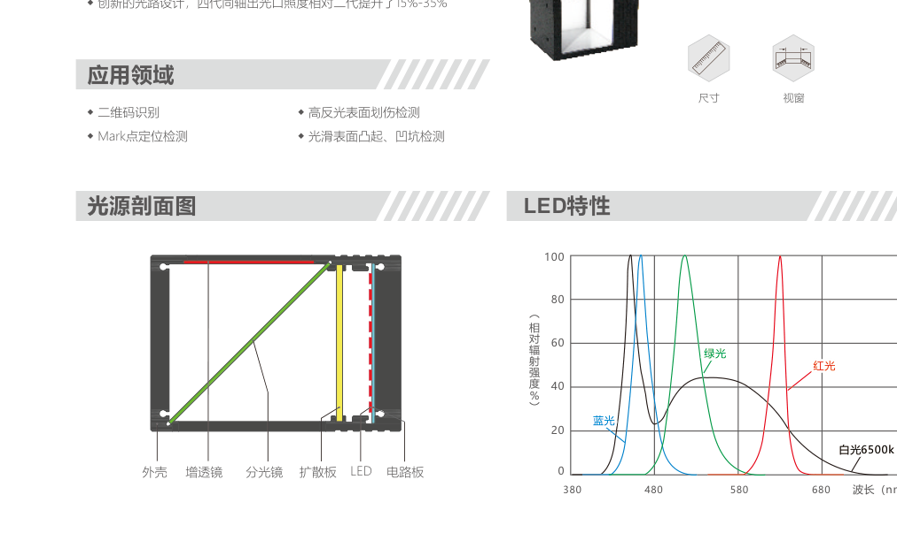
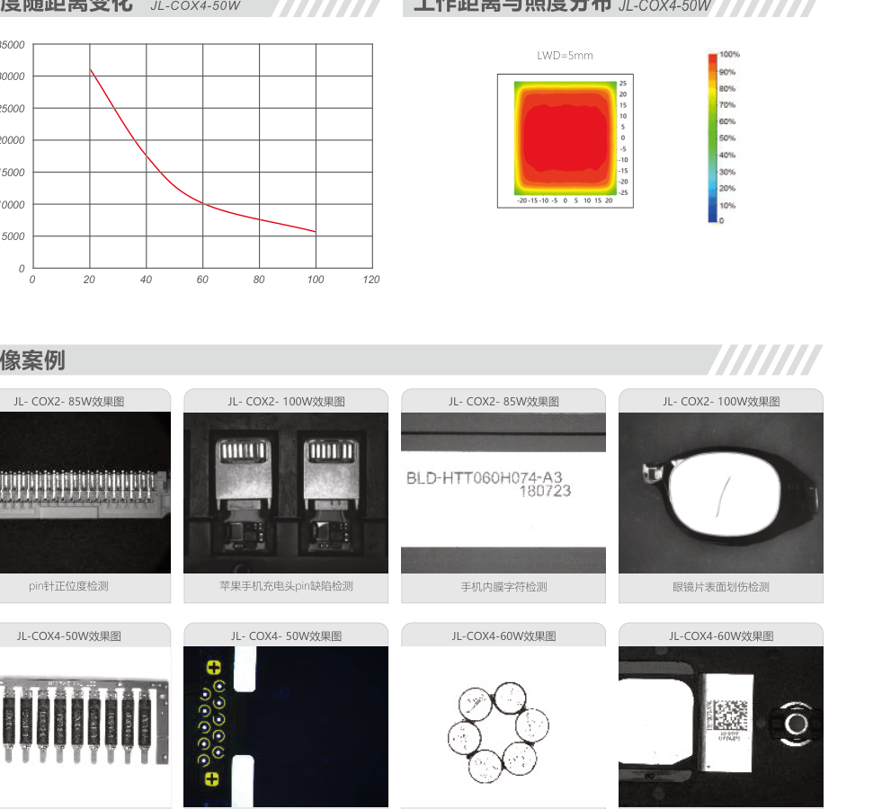
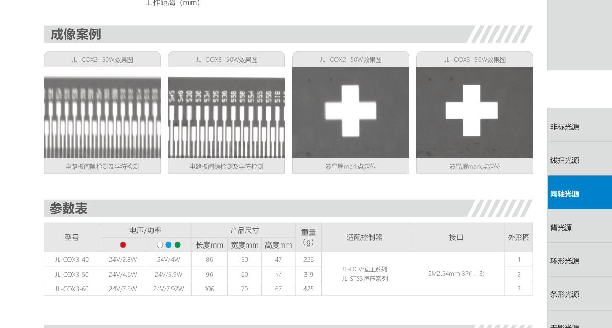
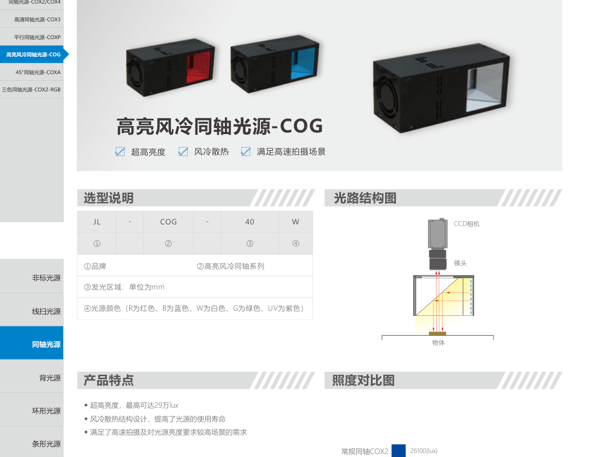
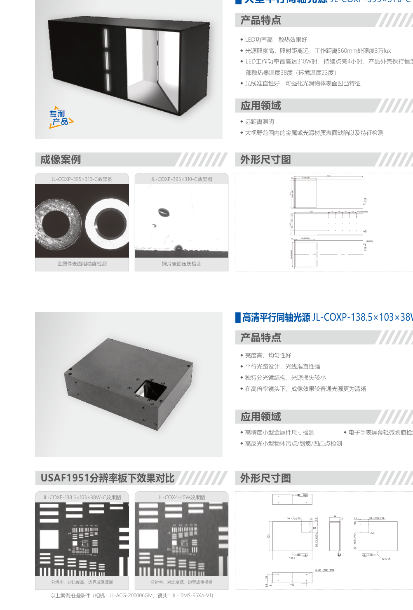
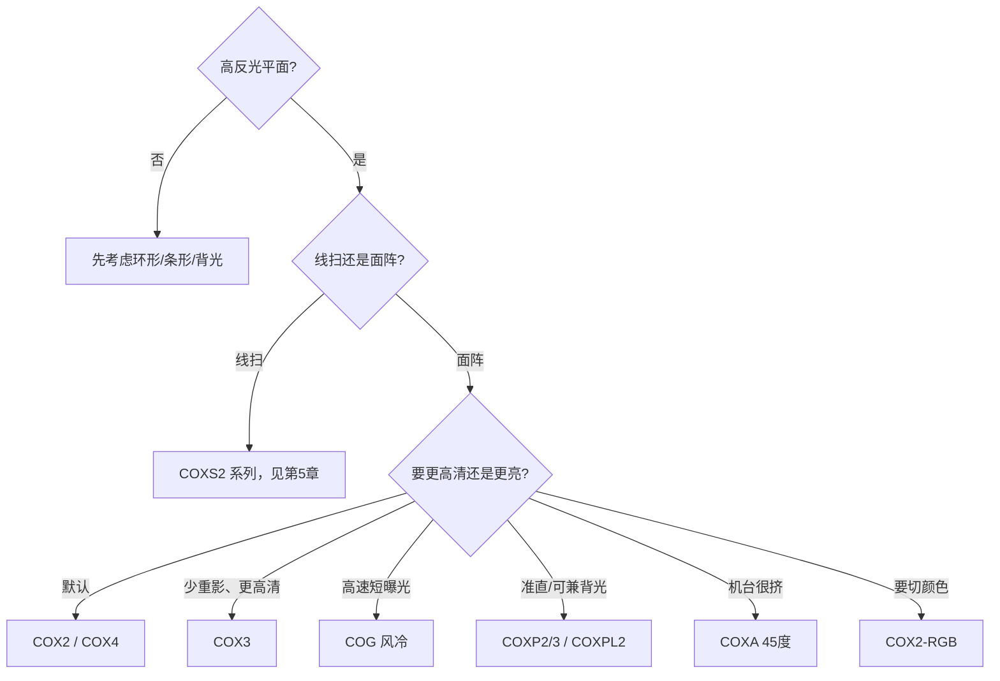

# 第2章 同轴光源

来源：工业视觉硬件产品手册（2026版），书页 23–24（仅同轴相关非常规形态）与书页 48–59（标准同轴系列）。线扫同轴 COXS2 主条在第5章，本章不重复其参数表。

## 本章总览

同轴光源把照明叠进镜头视线：LED → 扩散板 → 分光镜，一半光射向工件，反射光再穿过分光镜进相机。光路接近「从镜头里往外看」，高反光平面上的划伤、污点、凹凸比斜打光更容易被压成均匀底、突出缺陷。

选型时先问三件事：要不要更高清分光镜（COX3）、要不要准直平行光（COXP / 大型平行同轴）、亮度是否要上到风冷档（COG）。空间极紧再看 45° 转角（COXA）；要按颜色切换看 RGB 三通道（COX2-RGB）。

同轴属于高角度一族：平面偏亮、凹凸偏暗。原理见第1章高角度打光，本章只讲硬件形态。

👉 打光逻辑见第1章。

🔑 关键速记：同轴用分光镜把灯和镜头叠在同一轴上，专治高反光平面。

## 核心产品系列

### COX2 / COX4 系列同轴光源

#### 产品特点

- 亮度高、成像清晰、光束指向性强。
- 内部结构：外壳、增透镜、分光镜、扩散板、LED、电路板。
- 颜色可按红 / 蓝 / 白 / 绿选；红外、紫外按定制。白光光谱峰值按手册约 6500K。
- 可定制：颜色、安装方式、连接器、尺寸、视窗。
- 型号编码：系列名 + 发光区域（mm）+ 颜色字母（R/B/W/G，红外 UV 另议）。

#### 核心参数表

手册参数表给出两组 24 V 功率（多半对应不同颜色），下表两组都保留，不臆测哪组对应哪色。适配控制器为 DCV 系列数字恒压、STS3 系列迷你数字恒压。接口：SMR-03V-B，3 Pin。

| 型号 | 电压 / 功率 | 长×宽×高（mm） | 重量（g） |
| --- | --- | --- | --- |
| COX4-30 | 24V / 1.85W 与 3.29W | 61×40×38 | 129.1 |
| COX4-40 | 24V / 2.81W 与 3.82W | 71×50×48 | 196.7 |
| COX4-50 | 24V / 4.49W 与 5.78W | 81.5×60×57.5 | 274.6 |
| COX4-60 | 24V / 6.17W 与 8.1W | 92×70×69 | 395.3 |
| COX4-70 | 24V / 7.85W 与 10.97W | 102×80×79 | 501.4 |
| COX2-85 | 24V / 15.5W 与 17W | 127×95×91 | 743 |
| COX2-100 | 24V / 15W 与 22W | 146×110×107 | 1012 |
| COX2-150×120 | 24V / 21W 与 23W | 166×160×127 | 1600 |

COX4-50W 在工作距约 20 mm 照度约 30000 lx 量级，随距离迅速下降；LWD=5 mm 的照度分布图呈中心高、四周收的热力图。

#### 适用场景

针脚正位度、充电头 pin 缺陷、手机内膜字符、眼镜片表面划伤、PCB 塑胶字符与焊点有无、铜线路定位、磁铁字符、二维码。

📝 待补全：DCV / STS3 控制器通道、接线见第9章。

👉 完整深度讲解见第9章。

🔑 关键速记：COX2/COX4 是默认同轴；先按视窗尺寸选，再配恒压控制器。

### COX3 系列高清同轴光源

#### 产品特点

- 超高清分光镜，对比度、分辨率高于 COX2；减轻重影。
- 高均匀漫射板，亮度更匀。
- 结构在 COX2 基础上强调「超高清分光镜 + 导热材料」。
- 手册明确：相比 COX2，亮度、清晰度均更高。

#### 核心参数表

电压 24 V。适配 DCV 系列、STS3 系列。接口 SM2.54mm 3P（1，3）。

| 型号 | 电压 / 功率 | 长×宽×高（mm） | 重量（g） |
| --- | --- | --- | --- |
| COX3-40 | 24V / 2.8W 与 4W | 86×50×47 | 226 |
| COX3-50 | 24V / 4.6W 与 5.9W | 96×60×57 | 319 |
| COX3-60 | 24V / 7.5W 与 7.92W | 106×70×67 | 425 |

COX3-60 照度曲线在近距可到约 35000–40000 lx 量级，同样随工作距下降。

#### 适用场景

激光打标字符、高精度 Mark、芯片和硅晶片破损、高反光表面缺陷、液晶屏定位、电路板间隙与字符。

🔑 关键速记：要清晰度和少重影，从 COX2 升到 COX3，不要先加曝光。

### COXP2 / COXP3 / COXPL2 系列平行同轴光源

目录写作「平行同轴光源-COXP」，正文系列名为 COXP2、COXP3、COXPL2。

#### 产品特点

- 平行光路，准直性强；分光镜结构减少光损失。
- 亮度高、均匀性好。
- 手册写：也可当背光用，体积比大背光小、成本相对低。
- 编码：系列 + 发光面直径（mm）+ 颜色（R/B/W/G）。

#### 核心参数表

适配 APS3-24V200mA-4（手册该页只列这一款）。接口 SM2.54mm 3P（2，3）。最佳工作距离在光栏直径 4 mm 条件下给出。

| 型号 | 电压 / 功率 | 最大电流 | 长×宽×高（mm） | 最佳工作距 | 重量（g） |
| --- | --- | --- | --- | --- | --- |
| COXP2-60 | 24V / 5W | 208 mA | 244×76×50 | 0–80 mm | 933.2 |
| COXP3-40-V1 | 24V / 5.6W | 233 mA | 210×58×58 | 0–80 mm | 466.9 |
| COXPL2-80 | 24V / 5W | 208 mA | 220×100×163.8 | 0–100 mm | 2210 |

#### 适用场景

印刷品质量、金属件尺寸、手机屏幕轻微划伤、高反光污点/划痕/凹凸、陶瓷片气泡、金属板划伤、液晶屏表面缺陷、金属粗糙度。

平行光把表面微小起伏衬得更「陡」，适合「要测尺寸或看微划伤、又希望光线整齐」的场合。

🔑 关键速记：要准直、少散射，选平行同轴；工作距按 0–80 mm 或 0–100 mm 档来。

### COG 系列高亮风冷同轴光源

#### 产品特点

- 超高亮度，手册对照：常规 COX2 约 26100 lx，风冷 COG 约 291000 lx（最高可达 29 万 lx）。
- 风扇 + 散热器，服务高速拍摄和高亮度需求。
- 剖面：外壳、风扇、散热器、电路板、LED、扩散板、分光镜、增透镜。
- 颜色含 R/B/W/G/UV。

#### 核心参数表

适配 DCV、STS3。接口 SM2.54mm 3P（1，3）。

| 型号 | 电压 / 功率 | 长×宽×高（mm） | 重量（g） |
| --- | --- | --- | --- |
| COG-40 | 24V / 21.5W 与 24W | 115×50×47 | 350.9 |
| COG-85 | 24V / 54W 与 71W | 165×95×91 | 745.6 |

#### 适用场景

二维码、Mark、反光件表面缺陷、PCB 字符与图案；手册案例含基站零部件 pin（曝光 30000 μs）、手表底座胶体有无、芯片针脚、液晶屏边角定位。

🔑 关键速记：曝光时间被节拍卡死、COX2 不够亮时再上 COG，并给风扇留散热空间。

### COXA 系列 45° 同轴光源

#### 产品特点

- 转角 45° 同轴照明，结构紧凑、省安装空间。
- 均匀性好、亮度高；特殊导热材料，散热和稳定性作为卖点。
- 红外、紫外可定制。

#### 核心参数表

适配 DCV、STS3。接口 SM2.54mm 3P（1，3）。

| 型号 | 电压 / 功率 | 长×宽×高（mm） | 重量（g） |
| --- | --- | --- | --- |
| COXA-50 | 24V / 4.8W 与 7.2W | 96×60×57 | 309 |
| COXA-70 | 24V / 7W 与 13.4W | 120×85.4×79 | 687 |
| COXA-80 | 24V / 10.5W 与 13.5W | 114×91×85.5 | 785 |
| COXA-90 | 24V / 13W 与 16W | 131×100×98 | 833 |

COXA-50 近距照度约 30000 lx 量级，随工作距下降。

#### 适用场景

Mark、金属表面缺陷、光滑平面外观、二维码字符、接插件焊锡、PCB pin 正位、摄像头模组通光口与 Mark。镜头轴和工件法线不好对得太直、机台又挤时，45° 外壳更好装。

🔑 关键速记：光还是同轴，只是外壳折 45° 省空间。

### COX2-RGB 系列三色同轴光源

#### 产品特点

- 发光区为 RGB 三色 LED，每色可单独控制，也可混成白。
- 均匀同轴照明，强调灵活性。
- 编码在 COX2 后加 RGB。

#### 核心参数表

适配 DCV-6024-4、DCV-15024-4、DCV-15024-6、STS3-9624-4。接口 SM2.54mm 3P（1，3）。

| 型号 | 电压 / 功率 | 长×宽×高（mm） | 重量（g） |
| --- | --- | --- | --- |
| COX2-30RGB | 24V / 2.8W 与 2.4W | 56×38×36 | 144 |
| COX2-50RGB | 24V / 3.2W 与 2.4W | 96×60×57 | 349 |

COX2-30RGB 近距照度曲线可到约 60000–70000 lx 量级（按手册该页纵轴）。

#### 适用场景

激光打标字符、高精度 Mark、芯片与硅晶片破损、高反光缺陷、PCB 检测（手册分别给了红 / 蓝 / 绿 / 三色混合白的效果）。

颜色切换对应第1章的互补色思路：同一套灯换通道，比换灯快。

👉 波长与互补色见第1章。

🔑 关键速记：要在线切红绿蓝，用 COX2-RGB，控制器要能分通道。

### 非常规 / 定制形态

#### 同轴方形无影组合光源

型号示例：COX-18×16.6R-FSQ-36×36B-C。同轴 + 方形无影 + 直角反射镜，一套相机镜头拍顶部和侧面，工件不用转。用于立方体 / 长方体多面检测、芯片多面。

方形无影本身的漫射结构见第6章，本章只保留「同轴负责顶面、无影负责侧面」这一句。

👉 方形无影系列见第6章。

#### 大型平行同轴光源

型号示例：COXP-395×310-C。LED 功率高、散热好；工作距 560 mm 处照度 3 万 lx；最高约 310 W 持续点亮 4 小时，外壳恒温、内部散热器 38℃（环境 23℃）。准直性好，强化光滑面凹凸。用于远距离、大视野金属或光滑面缺陷。

#### 高清平行同轴光源

型号示例：COXP-138.5×103×38W-C。亮度高、均匀；平行光路；分光镜损失小；高倍镜头下比普通同轴更清晰。视窗与发光面约 30 mm。用于小型金属尺寸、表盘微划痕、高反光小件污点/划痕/凹凸。手册用 USAF1951 板对比：本型号边界清晰，COX4-40W 一边更糊。

🔑 关键速记：标准系列不够大或不够「平行」时，用大型 / 高清平行同轴，不要硬抬 COX2 功率。

### 线扫同轴（本章不展开参数）

COXS2 系列线扫同轴同样用分光镜，但出光口是一条线，给线阵相机用。手册称四代出光口照度相对二代提升 15%–35%，并强调混光与高清分光镜。参数表、长度规格在第5章。

👉 完整深度讲解见第5章。

## 选型对比与建议

| 系列 | 相对特点 | 先问什么 |
| --- | --- | --- |
| COX2/COX4 | 默认同轴 | 视窗尺寸、颜色 |
| COX3 | 分光镜更清、重影少 | 是否高倍、是否要压重影 |
| COXP2/3/PL2 | 平行准直，可兼背光 | 工作距 0–80/100 mm 是否够 |
| COG | 约 10× 亮度，要风扇 | 节拍能否给散热、功耗 |
| COXA | 45° 外壳 | 安装空间 |
| COX2-RGB | 分通道颜色 | 控制器是否多分时 |
| 大型/高清平行（非常规） | 远距大视野或高倍更利 | 视野和 WD 是否超出标准系列 |

常见混用：平行同轴当背光，轮廓和表面会折中，真要剪影仍以第3章背光为准。

🔑 关键速记：先定面阵还是线扫，再在「默认 / 高清 / 平行 / 风冷 / 折角 / 三色」里单跳一档。

## 本章要点总结

- 同轴 = 分光镜把照明叠进镜头轴，适合高反光平面。
- COX2/COX4 打底，COX3 提清晰，COG 提亮度，COXP 提准直，COXA 省空间，RGB 换颜色。
- 电压以 24 V 为主；控制器以恒压 DCV / STS3 为主，平行档该页写 APS3 恒流小功率。
- 线扫同轴去第5章；方形无影组合的侧面漫射去第6章。
