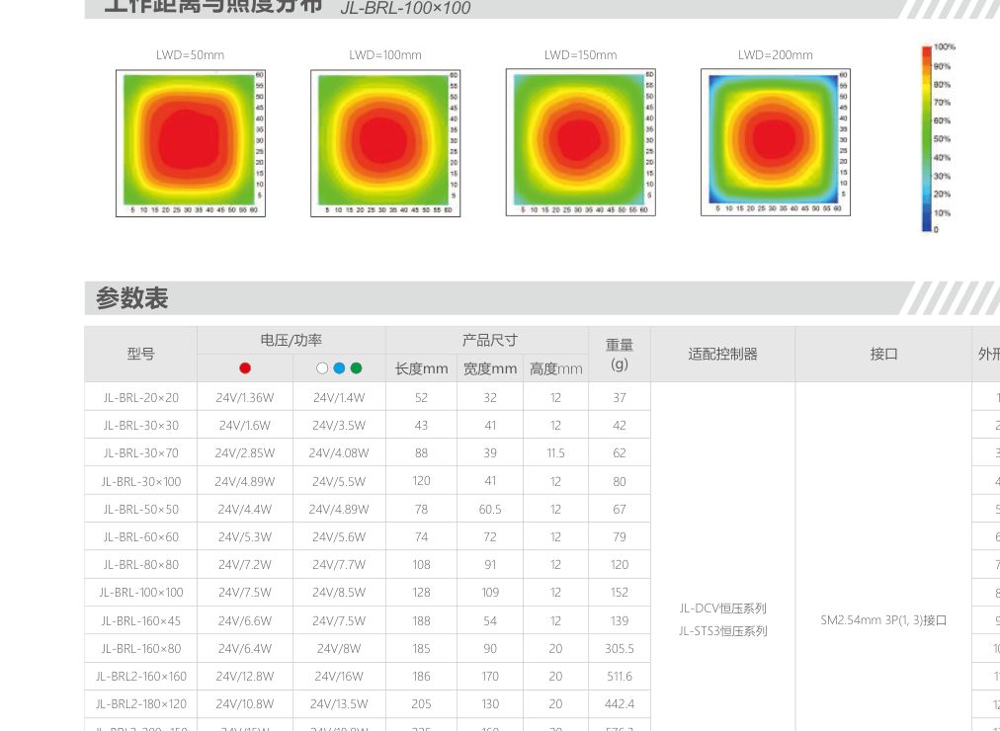
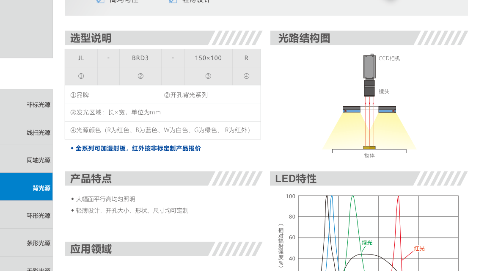
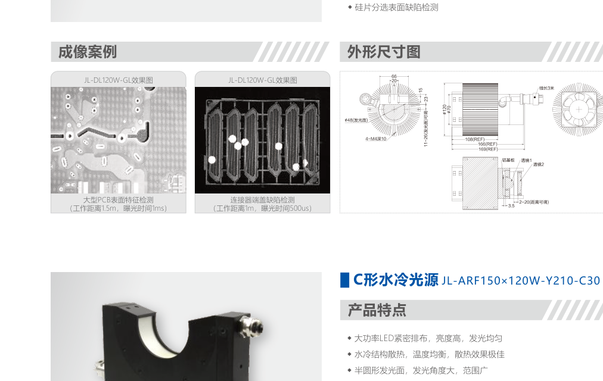
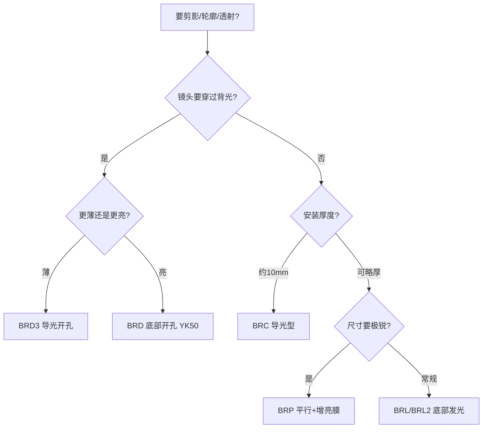

# 第3章 背光源

来源：工业视觉硬件产品手册（2026版），书页 25（仅四色混合背光）与书页 61–75（BRL/BRC/BRP/BRD 系列）。超高亮微型光源型号前缀虽为 BRL，主条在第8章。

## 本章总览

背光源从工件背后照明，相机看剪影：孔、间隙、外形、液位、透明件内部异物，都靠「亮底 + 暗轮廓」。第1章已经讲过蓝光穿透弱、红外穿透强、白色通用，以及背光尺寸 \(CD=(YZ/YX)\times AB\)。本章落到五类硬件：底部发光、导光型、平行、导光开孔、底部开孔。

选型先问：要不要镜头从孔里探过去（开孔）、要不要更薄（导光）、要不要边缘更利（平行增亮膜）、发光面要多大。

👉 背部打光原理见第1章。

🔑 关键速记：背光看轮廓；开孔是给镜头让路，平行是给尺寸锐度。

## 核心产品系列

### BRL / BRL2 系列底部发光背光源

#### 产品特点

- 均匀性好、亮度高；大幅面、尺寸档位多。
- 有效发光面占比高，适合机台空间紧。
- 结构：扩散板、外壳、贴片 LED、电路板、导热材料。光从底部向上穿过扩散板打到工件背面。
- 全系列可加漫射板；红外按定制。颜色 R/B/W/G/IR。
- BRL 偏小尺寸薄型（高度约 11.5–12 mm），BRL2 偏大面（高度约 20–28.5 mm）。

#### 核心参数表

电压 24 V。适配 DCV 恒压、STS3 恒压、ACC 恒流；大面另见 DCV-15024。接口以 SM2.54mm 3P（1,3）为主，部分大面用 GX16MF-6P-G 航空插头。手册每档给出两组功率。

| 型号（发光面 mm） | 功率（两组） | 高度约（mm） |
| --- | --- | --- |
| BRL-20×20 | 1.36W / 1.4W | 12 |
| BRL-30×30 | 1.6W / 3.5W | 12 |
| BRL-30×70 | 2.85W / 4.08W | 11.5 |
| BRL-30×100 | 4.89W / 5.5W | 12 |
| BRL-50×50 | 4.4W / 4.89W | 12 |
| BRL-60×60 | 5.3W / 5.6W | 12 |
| BRL-80×80 | 7.2W / 7.7W | 12 |
| BRL-100×100 | 7.5W / 8.5W | 12 |
| BRL-160×45 | 6.6W / 7.5W | 12 |
| BRL-160×80 | 6.4W / 8W | 20 |
| BRL2-160×160 | 12.8W / 16W | 20 |
| BRL2-180×120 | 10.8W / 13.5W | 20 |
| BRL2-200×150 | 15W / 18.8W | 20 |
| BRL2-240×160 | 19.2W / 24W | 20 |
| BRL2-240×240 | 28.8W / 36W | 20 |
| BRL2-320×160 | 25.6W / 32W | 20 |
| BRL2-320×240 | 38.4W / 48W | 20 |
| BRL2-320×320-X | 60W / 72W | 27.5 |
| BRL2-400×160 | 32W / 40W | 20 |
| BRL2-400×240 | 48W / 60W | 27.5 |
| BRL2-400×320-X | 72W / 84W | 27.5 |
| BRL2-400×400-X | 84W / 108W | 27.5 |
| BRL2-560×560 | 168W / 204W | 28.5 |
| BRL2-640×640 | 216W / 264W | 28.5 |
| BRL2-700×700 | 252W / 312W | 28.5 |

外框长宽大于发光面（例如 BRL-20×20 外框约 52×32 mm）。近距照度曲线可到约 60000–70000 lx。

#### 适用场景

物体尺寸与外形轮廓、金属毛刺、透明件划痕与内部异物、布料缺陷、瓶身生产日期、外屏尺寸、口服液液位、模组定位。

🔑 关键速记：先按发光面盖住 \(CD=(YZ/YX)\times AB\)，小件用 BRL，大面用 BRL2。

### BRC2 / BRC3 系列导光型背光源

#### 产品特点

- 特殊导光材质做均匀扩散；纤薄、重量轻，塞狭缝。
- 高度统一约 **10.5 mm**。
- 结构：外壳、电路板、贴片 LED、导光板、扩散板。

#### 核心参数表

适配 DCV、STS3；大面 DCV-15024、STS3-7224-2。接口 SM2.54mm 3P（1,3）。

| 型号 | 功率（两组） | 外框约长×宽×高（mm） | 重量（g） |
| --- | --- | --- | --- |
| BRC2-50×50 | 5.2W / 9W | 84×84×10.5 | 145 |
| BRC2-70×70 | 6.8W / 8.3W | 104×104×10.5 | 208 |
| BRC2-90×90 | 12W / 13.2W | 124×124×10.5 | 273 |
| BRC3-110×110 | 11.5W / 17.5W | 144×144×10.5 | 360 |
| BRC3-150×100 | 15W / 18W | 184×134×10.5 | 431 |
| BRC3-200×160 | 19.1W / 28W | 234×194×10.5 | 830 |
| BRC3-200×200 | 20.6W / 30W | 234×234×10.5 | 920 |
| BRC3-250×200 | 22.5W / 32.4W | 284×234×10.5 | 1021 |
| BRC3-300×200 | 23.5W / 35.5W | 334×234×10.5 | 1220 |
| BRC3-300×300 | 26W / 36W | 334×334×10.5 | 1660 |
| BRC3-400×300 | 32.3W / 45W | 434×334×10.5 | 2180 |
| BRC3-600×400 | 38.8W / 55W | 634×434×10.5 | 4560 |
| BRC3-800×600 | 54W / 60W | 834×634×10.5 | 8920 |

近距照度约 40000–45000 lx 量级（BRC3-250×200 曲线）。

#### 适用场景

轮廓尺寸、金属毛刺、液位与异物、大面积 PCB 元件、勺缘毛边、接插件间隙、玻璃瓶底凹槽、瓶底字符、注射器针头漏长/多胶。

🔑 关键速记：机台只有 10 mm 厚度时用导光型，不要硬塞底部发光厚灯。

### BRP2 / BRP3 系列平行背光源

#### 产品特点

- 增加增亮膜，提高亮度；光线指向性强，服务高精度尺寸。
- 高度统一约 **12.5 mm**（比导光型略厚）。
- 结构在导光板上再加透明板/增亮膜。

#### 核心参数表

适配 DCV、STS3、DCV-15024、STS3-7224-2。接口 SM2.54mm 3P（1,3）。

| 型号 | 功率（两组） | 外框约长×宽×高（mm） | 重量（g） |
| --- | --- | --- | --- |
| BRP2-50×50 | 5.2W / 9W | 84×84×12.5 | 166 |
| BRP2-70×70 | 8.2W / 8.8W | 104×104×12.5 | 239 |
| BRP2-90×90 | 11W / 13.2W | 124×124×12.5 | 323 |
| BRP3-110×110 | 11.5W / 17.5W | 144×144×12.5 | 424 |
| BRP3-150×100 | 15W / 18W | 184×134×12.5 | 489 |
| BRP3-200×160 | 19.1W / 28W | 234×194×12.5 | 860 |
| BRP3-200×200 | 20.6W / 30W | 234×234×12.5 | 1009 |
| BRP3-250×200 | 22.5W / 32.4W | 284×234×12.5 | 1203 |
| BRP3-300×200 | 23.5W / 35.5W | 334×234×12.5 | 1440 |
| BRP3-300×300 | 26W / 36W | 334×334×12.5 | 1840 |
| BRP3-400×300 | 32.3W / 45W | 434×334×12.5 | 2360 |
| BRP3-600×400 | 38.8W / 55W | 634×434×12.5 | 4760 |

近距照度约 30000–35000 lx 量级。

#### 适用场景

工件间距、高精度尺寸、金属表面异物、可透射表面缺陷、键盘金手指间距、芯片尺寸、透明塑料毛边、镜片定位、瓶口直径、日期喷码。

🔑 关键速记：尺寸要锐、边缘不能晕，优先平行背光而不是普通底部发光。

### BRD3 系列导光型开孔背光源

#### 产品特点

- 大幅面、平行、高均匀；轻薄；**开孔大小、形状、尺寸可定制**。
- 镜头或机构可以从孔穿过，工件仍被环形发光面围住。
- 高度约 **10.5 mm**。

#### 核心参数表

| 型号 | 功率（两组） | 外框约（mm） | 重量（g） |
| --- | --- | --- | --- |
| BRD3-150×100 | 15W / 18W | 184×134×10.5 | 401 |
| BRD3-200×200 | 20.6W / 30W | 234×234×10.5 | 826 |
| BRD3-250×200 | 22.5W / 32.4W | 284×234×10.5 | 990 |
| BRD3-350×350 | 28.3W / 43.2W | 384×384×10.5 | 2080 |
| BRD3-400×300 | 32.3W / 45W | 434×334×10.5 | 2100 |
| BRD3-600×400 | 38.8W / 55W | 634×434×10.5 | 3900 |
| BRD3-800×600 | 54W / 60W | 834×634×10.5 | 8116.7 |

适配 DCV、STS3、DCV-15024、STS3-7224-2。

#### 适用场景

外轮廓边缘定位、可透射表面缺陷、大幅面定位/有无/识别、螺母有无、金属件定位与缺陷、弹簧正反、铆钉、汽车零件、电池二维码。

🔑 关键速记：相机必须和背光同轴穿过时，选开孔，不要把实心背光挖洞凑合（除非定制）。

### BRD 系列底部发光开孔背光源

#### 产品特点

- 与 BRD3 用途同类（轮廓、透射缺陷、大幅面定位），但是**底部发光**结构，更厚、更亮。
- 编码带圆孔直径，手册标准孔 **YK50 = 圆孔直径 50 mm**，版本号 V0。
- 高度约 27.5–28.5 mm。

#### 核心参数表

接口：小规格 SMR-03V-B 3 Pin；大规格 GX16MF-6P-G / HKJT-20J6TQ-6P-G。

| 型号 | 功率（两组） | 约长×宽×高（mm） |
| --- | --- | --- |
| BRD-200×200-YK50-V0 | 19.8W / 24.8W | 224×210×27.5 |
| BRD-300×300-YK50-V0 | 46.4W / 58W | 324×310×27.5 |
| BRD-400×400-YK50-V0 | 84W / 108W | 424×410×27.5 |
| BRD-500×500-YK50-V0 | 132W / 168W | 524×510×28.5 |
| BRD-600×600-YK50-V0 | 192W / 240W | 624×610×28.5 |

近距照度曲线可到约 60000–70000 lx。

#### 适用场景

风扇外观、活塞字符、金属圈有无、药品内部有无。要亮度而不是极薄时，用 BRD 而不是 BRD3。

🔑 关键速记：开孔 + 要亮用 BRD，开孔 + 要薄用 BRD3。

### 非常规形态：四色混合背光源

型号示例：BRL-850×700GBWY-GL-4C。大幅面均匀、有效发光面占比高，四色可任意混光；手册约束：**混光总功率不可超过 1000 W**。用于液晶屏缺陷、特殊光谱、尺寸测量、多颜色缺陷、多材质区分。

超高亮微型光源（如 BRL-41×12IR850-2C）前缀同为 BRL，但是聚光打小孔内部，不是背光剪影。主条在第8章。

👉 完整深度讲解见第8章。

## 选型对比与建议

| 系列 | 厚度量级 | 光路特点 | 先选它当 |
| --- | --- | --- | --- |
| BRL/BRL2 | 12 / 20–28 mm | 底部 LED + 扩散 | 默认背光 |
| BRC2/3 | 10.5 mm | 导光板，更轻薄 | 夹缝安装 |
| BRP2/3 | 12.5 mm | 增亮膜，指向性强 | 高精度尺寸 |
| BRD3 | 10.5 mm | 导光 + 开孔 | 薄型同轴穿过 |
| BRD | 27.5–28.5 mm | 底部发光 + 开孔 | 开孔且要更亮 |
| 四色混合 | 大幅面定制 | 多色混光 ≤1000 W | 多光谱/换色 |

工作距过近会晕边，见第1章；控制器大功率面要换航空插头并核对第9章功率。

📝 待补全：ACC 恒流与大功率航空接口接线见第9章。

👉 完整深度讲解见第9章。

🔑 关键速记：实心还是开孔，薄还是亮，锐还是匀，三问就能落到系列。

## 本章要点总结

- 背光五族：底部发光、导光、平行、导光开孔、底部开孔。
- 发光面尺寸先按第1章公式估，再对型号表。
- 电压以 24 V 为主；小灯 3Pin，大面常换航空插头。
- 四色混合是大幅面换色方案，功率有 1000 W 上限。
- 微型 BRL 聚光打孔内，不是背光，去第8章。
