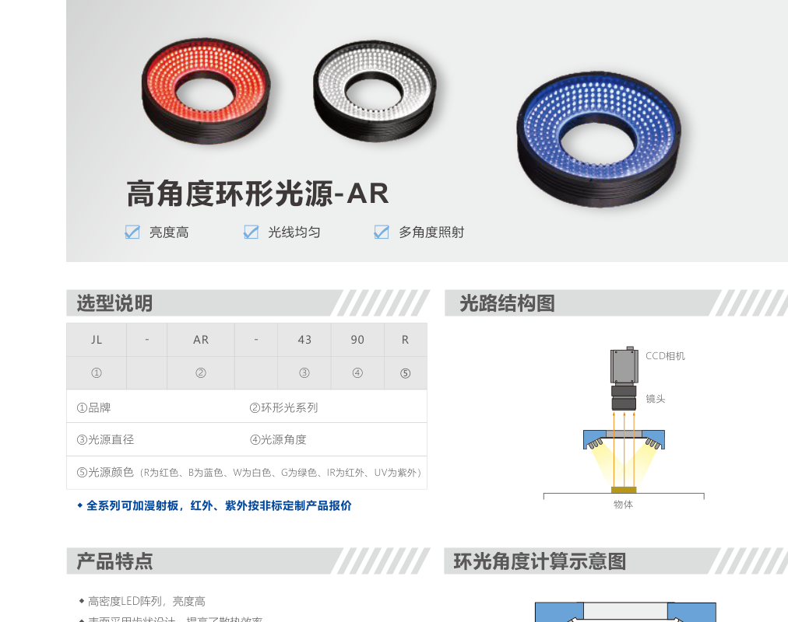
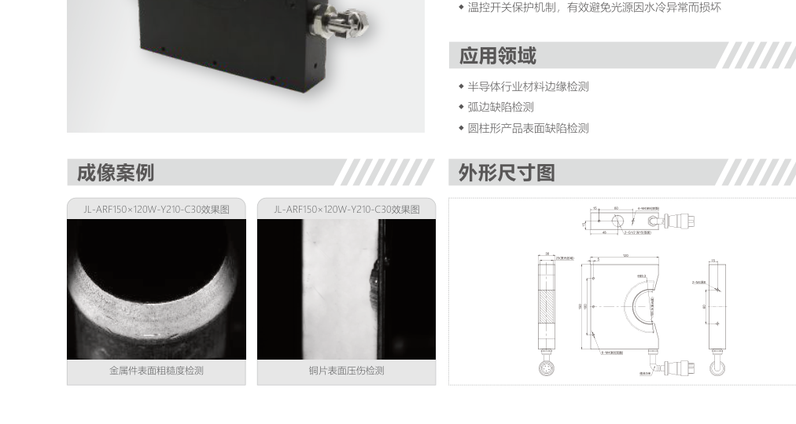
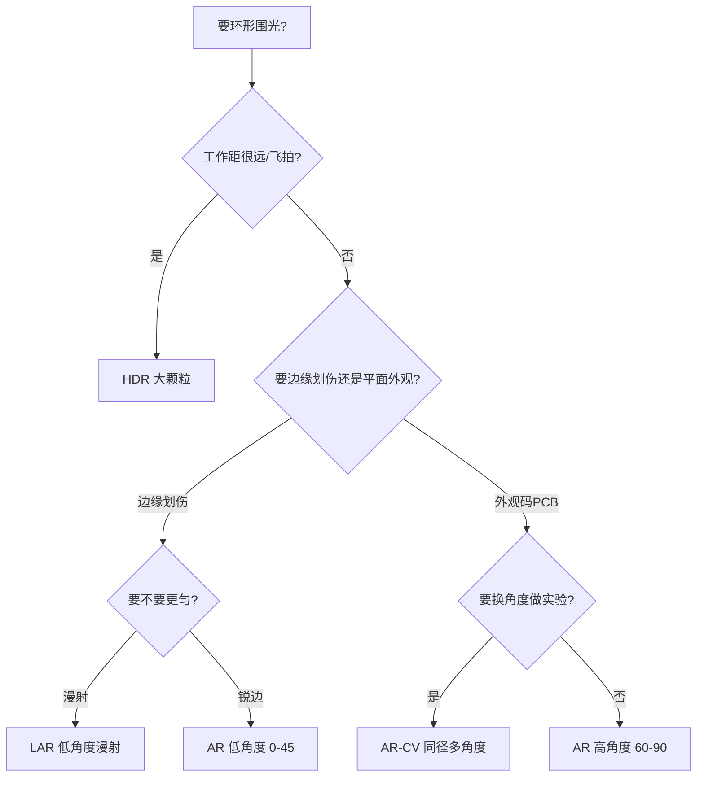

# 第4章 环形光源

来源：工业视觉硬件产品手册（2026版），书页 26（仅 C 形水冷）与书页 76–90。无影环形（HAR/WAR）在第6章，不与本章低角度漫射 LAR 混写。

## 本章总览

环形光源围着镜头打一圈光。手册把**角度定义为光线与水平面的夹角**：90° 接近垂直（高角度，平面亮、缺陷暗），45° 以下扫过表面（低角度，平面暗、边缘和划伤亮）。这和第1章高/低角度打光是同一套几何，只是灯做成圆环。

型号编码：`AR` + 外径 + 角度。例如 AR18060 是外径约 180、角度 60°。全系列可加漫射板；红外、紫外按定制。

👉 高角度 / 低角度原理见第1章。

🔑 关键速记：环形先看角度数字，再看直径能不能套住镜头。

## 核心产品系列

### AR 系列高角度环形光源

#### 产品特点

- 高密度 LED，齿状外壳散热。
- 多角度照射，突出三维、减轻对角阴影。
- 可选漫射板。角度常见 90° / 75° / 60°。

#### 核心参数表

电压 24 V。适配 DCV、ACC。手册每档两组功率。

| 型号 | 角度 | 功率（两组） |
| --- | --- | --- |
| AR4390 / AR5490 / AR12090 / AR15090 / AR18090 / AR21090 | 90° | 1.5–26 W / 1.8–31 W 档 |
| AR3475 / AR5075 / AR10375 | 75° | 1.1–7.7 W / 1.5–9 W 档 |
| AR4660 / AR5460 / AR12060 / AR18060 / AR22060 | 60° | 1.5–20 W / 2.1–26 W 档 |

代表点：AR4390 约 24V/1.5W 与 1.8W；AR18090 约 24V/25W 与 26.88W；AR18060 约 24V/13.5W 与 18.3W。外径随型号前几位数字增大。

#### 适用场景

通用外观、二维码/条码、字符与边缘、PCB 与电子元件。

🔑 关键速记：外观和码优先 60°–90° 环光，直径要大于镜头外径。

### AR 系列低角度环形光源

#### 产品特点

- 同样高密度 LED + 齿状散热。
- **低角度强调边缘**；仍保留多角度三维信息。
- 角度覆盖约 45° / 30° / 15° / 10° / 0°（型号末两位 00 表示接近贴面扫光）。

#### 核心参数表

45° 档示例：AR5445、AR9245、AR10045、AR15045、AR18045、AR24645。  
30° 档：AR10030、AR12030、AR15130、AR20230、AR27530。  
15° 档：AR7415、AR13015–AR24015。  
10°：AR10010。  
接近 0°：AR5600、AR8000、AR10100–AR21100。

功率从约 1.2 W 到约 38.5 W（两组 24 V）。适配 DCV、ACC。

#### 适用场景

药品异物、边缘提取、字符、金属刻印/损伤/污垢。平面要压暗、只留棱和伤时走低角度。

🔑 关键速记：末两位越小越贴面；0° 档几乎是扫边，不是洗白整个平面。

### AR-CV 系列环形光源

#### 产品特点

- 同一外径做成 30° / 45° / 60° / 75° / 90° 一套，便于对比打光。
- 提供 UV375 版本（型号带 UV375）。
- 手册用同一工件分别展示高角度环光与低角度环光效果。

#### 核心参数表

两档外径：74 与 92。

| 型号 | 功率约（24V） |
| --- | --- |
| AR7430-CV … AR7490-CV | 约 3.1–3.4 W（两组） |
| AR9230-CV … AR9290-CV | 约 3.1–6.6 W（两组） |

另有对应 UV375-CV。适配页未在摘录中写出完整控制器列时，按同族环形常见 DCV/ACC，【信息缺口：AR-CV 页适配控制器列未完整抽出】。

#### 适用场景

外观、码、字符、边缘、PCB、药品异物、金属刻印。适合「同一机台要换角度做实验」的场合。

🔑 关键速记：CV 是同直径多角度套装，先拿它做角度实验再锁标准 AR。

### HDR 系列大颗粒高亮环形光源

#### 产品特点

- 大功率 LED 高密度 + 特殊透镜，冲远工作距。
- 手册强调远距离、高速飞拍、大幅面、医疗照明。
- 全系列加漫射板。

#### 核心参数表

| 型号 | 功率（两组） |
| --- | --- |
| HDR-165 | 24V / 21.6W 与 20W（另见 17W 档摘录） |
| HDR-260 | 24V / 45.7W 与 72W（另见 24.6W 档摘录） |

功率表在摘录中出现多组，笔记照录不合并臆测。

#### 适用场景

远距照明、医疗、高速飞拍、大幅面物品。近距小工件不必上 HDR，亮度过剩且体积大。

🔑 关键速记：工作距远、节拍飞拍，才用大颗粒 HDR。

### LAR 系列低角度环形漫射光源

#### 产品特点

- 均匀性高，手册称可实现「环形无影」照射效果，但是低角度几何，和穹顶 DOME / HAR 高亮环形无影不是同一结构。
- 适合边缘和划痕。

#### 核心参数表

| 型号 | 功率（两组，24V） |
| --- | --- |
| LAR-51 | 3.24W / 3.8W |
| LAR-76 | 1.5W / 1.8W |
| LAR-100 | 2W / 3.1W |
| LAR-136 | 2.9W / 3W |
| LAR-180 | 3.8W / 【信息缺口：第二组与 8W 行对应关系未在摘录中一一钉死】 |
| LAR-250 | 8W 档 |

数字行存在错位风险，上表以型号顺序 + 功率列表对照，生成时若现场选型请核对手册该页。

📝 待补全：真正的平面/环形/方形无影与 DOME 见第6章。LAR 只是低角度漫射环。

👉 完整深度讲解见第6章。

#### 适用场景

字符、圆形金属轮廓、表面划痕。

🔑 关键速记：LAR 是低角度漫射环，不要当成第6章的 HAR/DOME。

### 非常规形态：C 形水冷光源

型号示例：ARF150×120W-Y210-C30。半圆发光面、角度大；大功率 LED 密排；水冷 + 温控开关，防止水路异常烧灯。用于半导体材料边缘、弧边、圆柱表面。主条在本章；第8章不重复参数。

🔑 关键速记：整圈套镜头用 AR，半包圆柱用水冷 C 形。

## 选型对比与建议

高角度环和同轴都能打亮平面：环更便宜、有阴影方向；同轴更匀、更适合镜面。需要无影包住复杂立体时，不要加环角度，去第6章。

👉 同轴见第2章，无影/DOME 见第6章。

🔑 关键速记：角度数字决定平亮还是边亮；直径决定套不套得进镜头。

## 本章要点总结

- 环形角度 = 光线与水平面夹角，写在型号末两位。
- 高角度 AR 做外观和码，低角度 AR 做边和伤，CV 做角度实验，HDR 做远距飞拍，LAR 做低角度漫射。
- C 形水冷给半包圆柱，不替代整圈 AR。
- HAR/WAR/DOME 不是本章产品。
