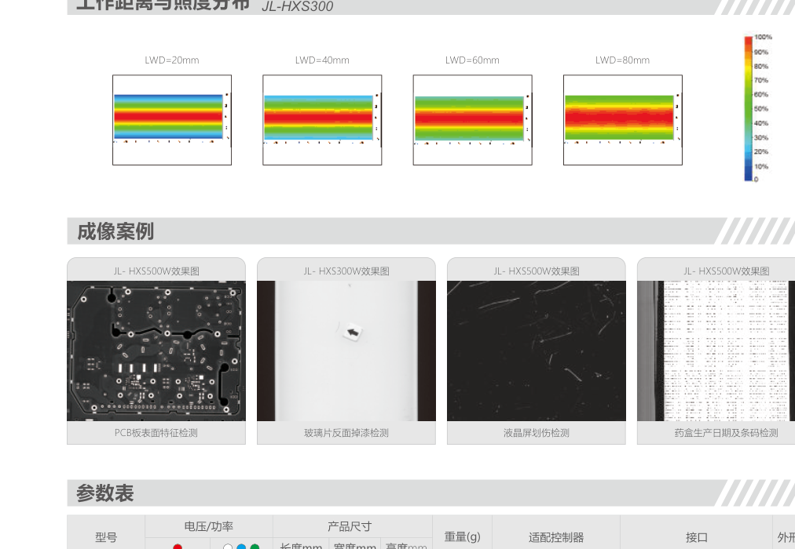
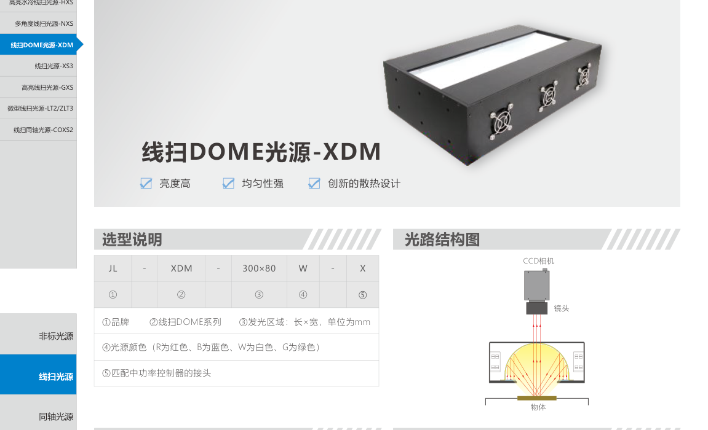
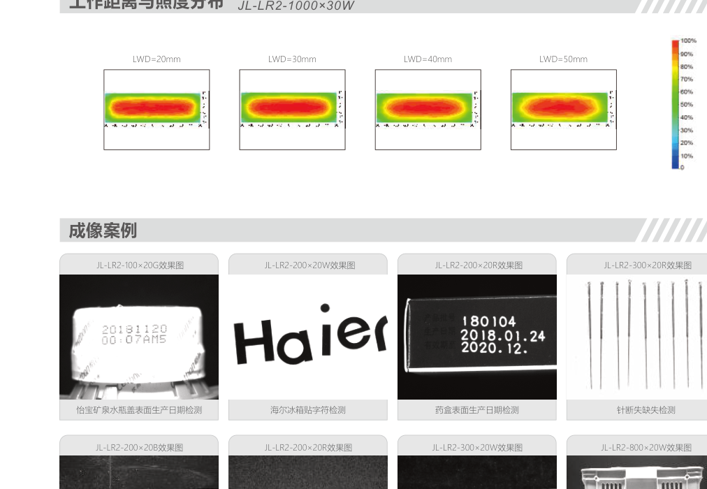
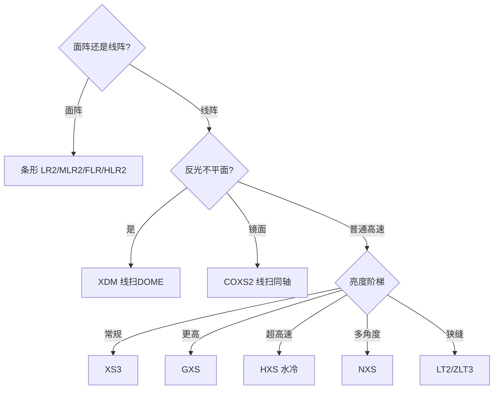

# 第5章 条形与线形光源

来源：工业视觉硬件产品手册（2026版），书页 22、27（仅双侧检线性、窄缝线扫）与书页 29–47、91–102。书页 27–28 上的多分区组合、近红外隐裂、1050 nm 激光一体机不属本章。

## 本章总览

条形光源给面阵相机做斜打、侧打、多边组合；线形（线扫）光源给线阵相机一条亮线，服务连续运动的高速检测。线扫同轴把分光镜做成线状出光口；线扫 DOME 把漫射腔做成线状。面阵同轴见第2章，面阵 DOME 见第6章。

选型先问相机是面阵还是线阵，再问要不要水冷、要不要多角度、工作距远不远。

🔑 关键速记：面阵用条，线阵用线；同轴和 DOME 的线扫形态只改出光口形状。

## 核心产品系列

### 线扫：HXS 系列高亮水冷线扫光源

#### 产品特点

- 超高亮度，照度最高可达 **800 万 lx**；水冷流道保寿命。
- 定位：超高速线阵。
- 编码：HXS + 发光长度（mm）+ 颜色。

#### 核心参数表

适配 ACC 系列（手册该页）。外形长度约 发光面 +80 mm，截面约 50×87 mm。

| 型号 | 功率（两组 24V） |
| --- | --- |
| HXS-300-V1 | 144W / 288W |
| HXS-500-V1 | 240W / 480W |
| HXS-1400-V1 | 1332W / 1332W |

接口示例 HKJT-20J6TQ-6P-G。

#### 适用场景

PCB 表面、字符条码、纺织印刷、液晶屏划伤、药盒日期。案例工作距常见 20–80 mm。

🔑 关键速记：节拍极高、亮度要百万级，上 HXS，必须接水冷。

### 线扫：NXS 系列多角度线扫光源

#### 产品特点

- 多角度、光线集中、均匀性高；结构比同类更紧凑。
- 适应高速。双侧检专用线性也挂 NXS 型号，但是「一次扫描两个侧面」，见本章非常规形态。

#### 核心参数表

| 型号 | 功率（24V） |
| --- | --- |
| NXS-300×140-V1 | 864W |
| NXS-384×280-V1 | 156W+312W（两路） |

#### 适用场景

玻璃盖板外观、金属划伤、液晶屏划伤、印刷品缺陷。

🔑 关键速记：要一条线上多个入射角，用 NXS，不要堆两盏普通线扫硬拼。

### 线扫：XDM 系列线扫 DOME 光源

#### 产品特点

- 线状 DOME：均匀、亮度高，创新散热。
- 给反光、不平整表面的线阵用，原理仍是漫射包光，只是沿扫描向拉成一条。

#### 核心参数表

| 型号 | 功率（两组 24V） |
| --- | --- |
| XDM-100×80-X | 36W / 36W |
| XDM-200×80-X | 72W / 84W |
| XDM-300×80-X | 108W / 120W |

#### 适用场景

PCB 基板、反光物体表面、不平整表面。

👉 面阵 DOME 见第6章。

🔑 关键速记：线阵 + 反光不平面，用 XDM，不要拿 HXS 硬打。

### 线扫：XS3 系列线扫光源

#### 产品特点

- 柱面透镜聚光，发散角小；模具成型散热好。
- 可选不同漫射板。红外紫外定制。

#### 核心参数表

长度 100–1000 mm 对应 24V **24–240 W**（每 100 mm 约 +24 W）。型号 XS3-100-V1-X … XS3-1000-V1。

#### 适用场景

金属表面缺陷、基板封装零件、印刷字符、手机屏幕表面。

🔑 关键速记：常规线扫先 XS3，长度按视野加余量。

### 线扫：GXS 系列高亮线扫光源

#### 产品特点

- 大功率 LED + 柱面聚光；进线端偏亮问题做了电路优化，手册称均匀度高达 **95%**。
- 同功率温度低于一代；亮度较一代增加 **50%–200%**，最高照度 **271 万 lx**。

#### 核心参数表

GXS-100-V1-X … GXS-1000-V1，24V **36–360 W**（每 100 mm 约 +36 W）。

#### 适用场景

与 XS3 同类（金属、基板、印刷、屏幕），但节拍或工作距要求更高。

🔑 关键速记：XS3 亮度不够再升 GXS，不必直接跳水冷 HXS。

### 线扫：LT2 / ZLT3 系列微型线扫光源

#### 产品特点

- 大功率 LED + 聚光，亮度高。
- **ZLT3 比 LT2 略暗、体积更小**，给狭缝安装。

#### 核心参数表

长度档 75 / 150 / 225 / 300 / 375 / 450 mm。

| 系列 | 功率范围（24V，两组） |
| --- | --- |
| LT2 | 约 4–24 W 与 4.6–27.6 W |
| ZLT3 | 约 3.8–15.4 W 与 3.8–23.1 W |

#### 适用场景

金属、基板、印刷、屏幕；空间不够时选 ZLT3。

🔑 关键速记：微型线扫用 LT2；塞不进去换 ZLT3。

### 线扫：COXS2 系列线扫同轴光源

#### 产品特点

- 混光保证光斑均匀；散热结构拉寿命。
- 高清分光镜减损失。手册：四代出光口照度相对二代提升 **15%–35%**。
- 面阵同轴原理相同，出光口是一条线。

#### 核心参数表

长度示例 COXS2-600 … COXS2-1000，发光面 600–1000 mm，线长 3 m 电缆，双面 M6 安装。详细外形在书页 47–48。

#### 适用场景

二维码、Mark、高反光划伤、光滑面凸起凹坑。

👉 面阵同轴系列见第2章。

🔑 关键速记：线阵看镜面，用 COXS2，不要拿面阵 COX 对着线扫相机。

### 条形：LR2 系列条形光源

#### 产品特点

- 插件 LED + 扩散板，斜打或侧打。
- 长度按 100 mm 步进到 1000 mm，宽度 20 或 30 mm。

#### 核心参数表

×20 规格约 24V 1.8–18.5 W（及第二组 2.4–23.8 W）；×30 规格功率更高。外框长度约发光面 +17 mm，×20 高度约 26 mm，×30 约 38 mm。LR2-1000×30 曲线纵轴可见约 16 万 lx 量级。

#### 适用场景

瓶盖日期、铭牌字符、药盒日期、针缺失、铁片条码、摄像头定位、滤芯缺陷、料框定位。

🔑 关键速记：面阵侧光先 LR2，长度盖住视野即可。

### 条形：FLR 系列四面组合条形光源

#### 产品特点

- 四边组合，角度可调，每面可单独控制。
- 均匀、照射面积大，大幅面首选。

#### 核心参数表

FLR-50×50、80×80、100×100、144×144、190×190、300×300、400×400。

#### 适用场景

Mark、电子元件、大幅面定位识别、凹凸与划伤。

🔑 关键速记：要四边可调光，用 FLR，比围四根 LR2 更好控。

### 条形：MLR2 系列漫射型条形光源

#### 产品特点

- 大功率 LED + **弧形扩散板**，大范围均匀。
- 尺寸灵活，可组合。

#### 核心参数表

MLR2-200 … MLR2-1000，宽度约 30 mm，24V 约 4.7–25.9 W（及第二组 3.5–19.2 W）。适配 DCV、STS3。近距照度约 50000 lx 量级。

#### 适用场景

二维码、字符、键盘。

🔑 关键速记：要软光、少阴影，用弧面漫射 MLR2，不要用硬条 LR2。

### 条形：HLR2 系列大颗粒高亮条形光源

#### 产品特点

- 大功率 LED + 聚光透镜，远工作距；二代均匀性和防护更好，出线改到侧边。
- 全系列加漫射板。

#### 核心参数表

| 型号 | 功率（两组 24V） | 约长×宽×高（mm） | 重量（g） |
| --- | --- | --- | --- |
| HLR2-150×25 | 7.5W / 7.5W | 164×32.5×28 | 247.9 |
| HLR2-300×25 | 16W / 15W | 314×32.5×28 | 464.4 |
| HLR2-400×25 | 15.2W / 15.2W | 414×32.5×28 | 578.5 |

照度曲线纵轴可见约 25 万 lx 量级。适配 DCV、STS3。

#### 适用场景

远距、高速飞拍、基板零件、损伤缺陷。

🔑 关键速记：条形要远距飞拍用 HLR2，近距小件用 LR2。

### 非常规形态

**双侧检专用线性光源**（NXS-320×140×120）：均匀度高；「光像路」重叠；线阵一次运动扫出两个侧面；内部机构可调视野。光伏侧边缺陷。

**窄缝线扫**（SNL-57）：准直性高，光斑宽 **1 mm**。透明、半透明、荧光胶体。

🔑 关键速记：双侧面一次扫用双侧检线性；只要极窄亮线用窄缝。

## 选型对比与建议

| 需求 | 系列 |
| --- | --- |
| 面阵侧光默认 | LR2 |
| 四边可调 | FLR |
| 软光均匀 | MLR2 |
| 远距条形 | HLR2 |
| 常规线扫 | XS3 → GXS → HXS |
| 线扫镜面 | COXS2 |
| 线扫漫射 | XDM |

🔑 关键速记：先分面阵/线阵，再分镜面/漫射/亮度。

## 本章要点总结

- 条形服务面阵，线扫服务线阵。
- 亮度阶梯：微型 LT/ZLT → XS3 → GXS → 水冷 HXS。
- 线扫同轴、线扫 DOME 只改形态，原理分别见第2、6章。
- 双侧检一次看两面，窄缝给 1 mm 光斑。
