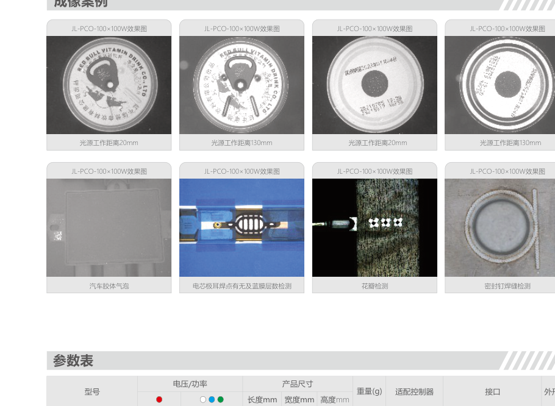
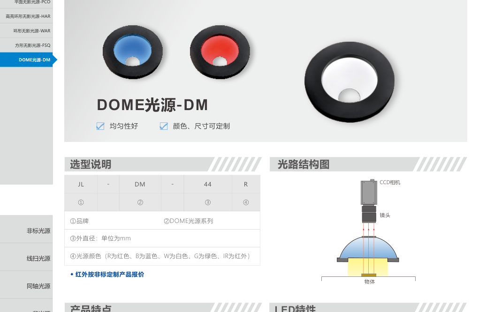

# 第6章 无影光源与 DOME 光源

来源：工业视觉硬件产品手册（2026版），书页 103–114。线扫 DOME（XDM）主条在第5章。HAR 高亮环形无影与第7章多分区 HAR 不是同一产品。

## 本章总览

无影 / DOME 用高雾度扩散或多次漫反射，把光从很多方向送上去，压掉阴影和灯珠镜像。适合包装、弧面、不平整高反光。同轴是「从镜头轴上看镜面」，无影是「把物体泡在软光里」，不要混用。

LAR 低角度环形漫射（第4章）只是环上加漫射，不是穹顶。

👉 低角度环形漫射见第4章；线扫 DOME 见第5章。

🔑 关键速记：要消阴影用无影/DOME，要看镜面细伤用同轴。

## 核心产品系列

### PCO 系列平面无影光源

#### 产品特点

- 散射发光，均匀、无网纹；通透、轻薄紧凑。
- 手册称「同轴面状光源」，同时具备无影和同轴效果。
- 可做成多色，节省工位。

#### 核心参数表

适配 DCV、STS3。

| 型号 | 功率（两组 24V） |
| --- | --- |
| PCO-60×60 | 9.0W / 9.0W |
| PCO-100×100 | 9.1W / 12.9W |
| PCO-150×150 | 15.7W / 20.3W |
| PCO-200×200 | 20.6W / 26.5W |
| PCO-60×60RGB … PCO-200×200RGB | 8.47–24.95W |
| PCO-580×380-V1 | 54.5W / 42.2W |

#### 适用场景

电器外壳、食品烟草日化包装、高反光不平整表面的字符图形。

🔑 关键速记：要一块扁的无影板，选 PCO；要 RGB 换色选 PCO-RGB。

### HAR 系列高亮环形无影光源

#### 产品特点

- 发光角广、高均匀；高雾度扩散器，高亮无影。
- 可加漫射板；红外定制。
- **不要和第7章「多分区光源-HAR」混写。**

#### 核心参数表

HAR-70 / 110 / 170 / 240 / 366，24V 约 2.6–41 W 与 3.4–52.7 W。大规格适配 DCV-15024、STS3-7224-2。

#### 适用场景

医药食品包装、电子元件表面、手机外壳字符、不平整高反光缺陷。

🔑 关键速记：环形无影要更亮用 HAR；要分区轮亮去第7章另一个 HAR。

### WAR 系列环形无影光源

#### 产品特点

- 高雾度扩散器，无灯珠干扰；发光角广。
- 型号带角度后缀（60/75/90）。

#### 核心参数表

WAR-5060 至 WAR-18090，24V 约 1.1–11.7 W（两组）。适配 DCV、STS3。

#### 适用场景

医药食品包装、电子元件、弧面缺陷、金属划痕。

🔑 关键速记：常规环形无影用 WAR，角度写在型号末两位。

### FSQ 系列方形无影光源

#### 产品特点

- 光线柔和、高雾度、无灯珠干扰；对准方形工件。
- 同轴+方形无影组合的侧面部分就是 FSQ，主条组合形态见第2章。

#### 核心参数表

FSQ-75×75、FSQ-150×150，24V 约 6.8–12 W。适配 DCV、STS3。

#### 适用场景

电子元件有无、金属划痕、印刷缺陷、字符条码。

👉 同轴方形无影组合见第2章。

🔑 关键速记：工件是方的，无影也做成方的，用 FSQ。

### DM 系列 DOME 光源

#### 产品特点

- 光线多次漫反射，高均匀；颜色、尺寸可定制。
- 红外可定制。大规格用 DCV-15024 / STS3-7224-2。

#### 核心参数表

DM-44 / 70 / 100 / 120 / 175 / 212 / 262 / 400，24V 约 1.6–27 W 与 2.5–48.5 W。

#### 适用场景

曲面/凹凸/弧面缺陷、电器外观字符、金属等发光体表面信息。

线扫 DOME（XDM）给线阵，形态不同，参数在第5章。

👉 完整深度讲解见第5章。

🔑 关键速记：立体弧面无影用 DM 穹顶，不要拿平面 PCO 硬罩。

## 选型对比与建议

| 系列 | 形态 | 先选它当 |
| --- | --- | --- |
| PCO | 平面 | 扁空间、包装、类同轴无影 |
| HAR | 高亮环形无影 | 要更亮的环无影 |
| WAR | 环形无影 | 默认环无影 |
| FSQ | 方形 | 方形工件 |
| DM | 穹顶 | 曲面凹凸 |
| XDM | 线扫 DOME | 线阵，见第5章 |
| LAR | 低角度漫射环 | 不是穹顶，见第4章 |

🔑 关键速记：平面 / 环形 / 方形 / 穹顶四选一，再看亮度。

## 本章要点总结

- 无影靠漫射和多次反射消阴影。
- HAR 无影 ≠ HAR 多分区。
- 组合同轴+FSQ 的侧面在第2章，线扫 DOME 在第5章。
