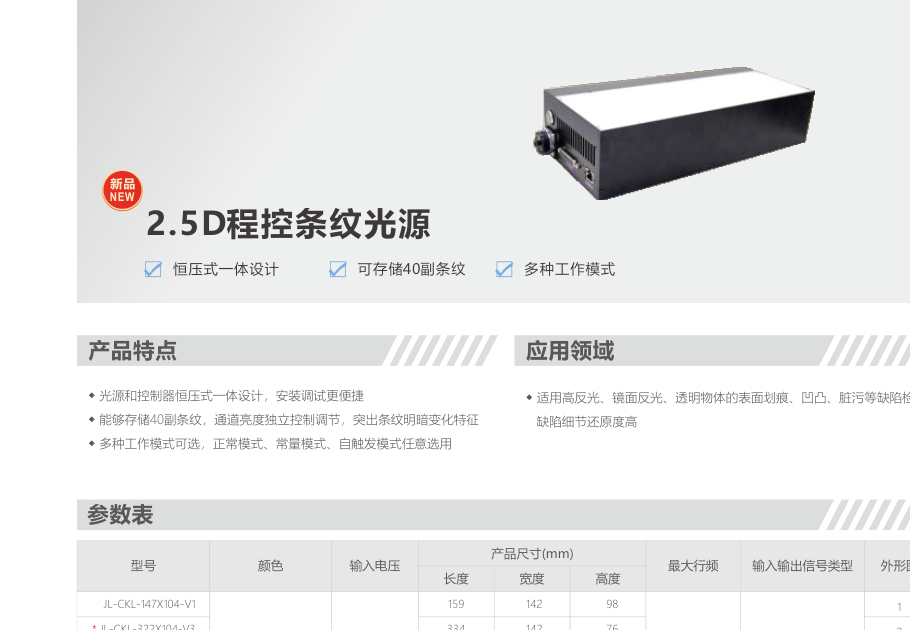
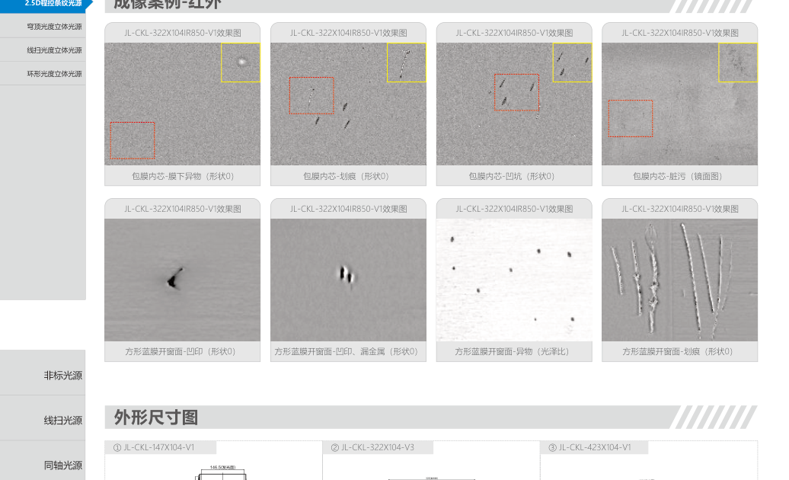
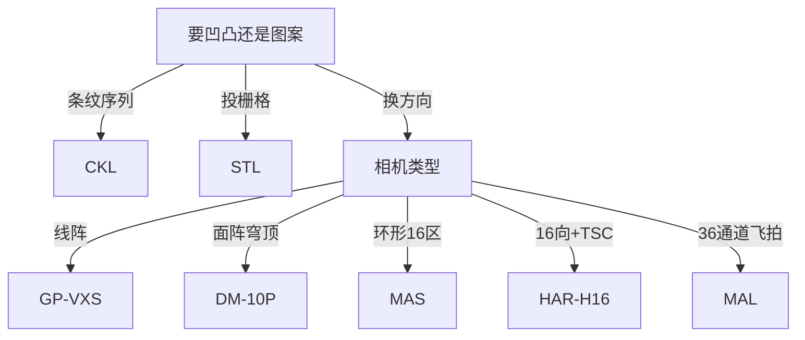

# 第7章 2.5D 与结构光光源

来源：工业视觉硬件产品手册（2026版）。首页标题核对：程控条纹 / 穹顶光度立体 / 线扫光度立体 / 环形光度立体约书页 115–122（PDF idx 58–61）。STL、多分区 HAR、36 分区 MAL 印在特殊光源栏（idx 64、72–73），按大纲收入本章。书页 27 多分区组合光源并入本章。

环形光度立体页实际系列名为 **MAS**（最高 16 分区独立控制），不是第6章 HAR 无影。

## 本章总览

2.5D 不是测真实三维点云，而是用**方向变化的光**把凹凸、划痕从漫反射表面里「刮」出来：条纹扫过、四/八方向轮循、分区独立点亮，再配合算法。结构光 STL 则把栅格图案投到表面，做平整度和三维分析。

普通环形、DOME 是「尽量均匀」；本章是「故意不均匀、但方向可控」。

👉 均匀无影见第6章；控制器分时频闪 MPL、多时序 TSC 见第9章。

🔑 关键速记：要凹凸就换方向打光；要均匀就回第6章。

## 核心产品系列

### CKL 系列程控条纹光源

#### 产品特点

- 光源和控制器**恒压式一体**，安装调试更便捷。
- 可存储 **40 副条纹**，通道亮度独立调节，突出明暗变化。
- 工作模式：正常、常量、自触发。
- 适用高反光、镜面、透明物体的划痕、凹凸、脏污。

#### 核心参数表

手册该页仅标 24V，未给功率瓦数。【信息缺口】

| 型号 |
| --- |
| CKL-147×104-V1 |
| CKL-322×104-V3 |
| CKL-423×104-V1 |
| CKL-533×104-V1 |
| CKL-616×104-V1 |

同页效果图另见红外款 CKL-322×104IR850-V1。

#### 适用场景

镜面、镀层、透明件表面细伤。要固定图案而不是条纹序列，改看 STL。

🔑 关键速记：要轮换条纹用一体 CKL，先问要存多少幅图。

### DM-10P 系列穹顶光度立体光源

#### 产品特点

- 穹顶结构，光照角度更丰富。
- 多通道任意组合，可实现四 / 八方向检测。
- 配备高穿透红外，穿透薄膜和涂层。
- 适配分时频闪控制器 **MPL-4805-V1**。

普通 DM 穹顶是均匀无影（第6章）；本系列带 **-10P-Tr**，是分方向的光度立体穹顶。

👉 均匀 DOME 见第6章。

#### 核心参数表

功率【信息缺口：该页未列出瓦数】。

| 型号 | 适配控制器 |
| --- | --- |
| DM-188-10P-Tr-V1 | MPL-4805-V1 |
| DM-260-10P-Tr-V1 | MPL-4805-V1 |
| DM-360-10P-Tr-V1 | MPL-4805-V1 |

效果图亦有 DM-188WIR850-10P-Tr-V1。

#### 适用场景

漫反射、复杂形状的划痕、凹凸、脏污。

🔑 关键速记：穹顶要分方向，选 10P + MPL，不要拿普通 DM。

### GP-VXS 系列线扫光度立体光源

#### 产品特点

- 外壳一体化，现场安装方便。
- **四方向光照轮循频闪**，照射角度可自行调试。
- 服务线阵：工件连续运动时按方向轮亮。

#### 核心参数表

| 型号 | 功率 |
| --- | --- |
| GP-VXS300W-V2 | 24V / 4×48W |
| GP-VXS400W-V2 | 24V / 4×60W |
| GP-VXS500W-V2 | 24V / 4×72W |

#### 适用场景

线扫产线上的漫反射复杂表面缺陷。面阵四方向用穹顶 10P 或 MAS。

🔑 关键速记：线阵四向频闪用 GP-VXS，功率按长度 4 路叠加。

### MAS 系列环形光度立体 / 多分区光源

#### 产品特点

- 多分区独立控制，多方向检测。
- 最高 **16 分区**独立控制，分区可组合。
- 线阵、面阵相机均可用于此系统。
- 适配 **MPL-4810-V1**。

手册侧栏称「环形光度立体」。与第8章/本章 HAR-170-H16（多光谱控制器、16 方向）功能相近、型号不同，不要混库存。

#### 核心参数表

| 型号 | 功率 | 适配控制器 |
| --- | --- | --- |
| MAS-110 | 24V / 8×72W | MPL-4810-V1 |
| MAS-170 | 24V / 8×144W | MPL-4810-V1 |
| MAS-240 | 24V / 8×360W | MPL-4810-V1 |

#### 适用场景

漫反射复杂表面划痕、凹凸、脏污。

🔑 关键速记：环形 16 分区轮亮用 MAS + MPL-4810。

### STL 系列结构光源

印在特殊光源栏，按大纲归本章。

#### 产品特点

- 标准 **C 接口**；光斑边界清晰、亮度均匀。
- 镜头前后距离可调，**无需加接圈**。
- 栅格片可按应用选配（手册写「栅格片」，目录大类是「格栅光源」——格栅成像产品在第8章，STL 是投图案的结构光）。
- 用途：3D 分析与重建、电子元件尺寸、表面平整度、复杂结构表面缺陷。

配套光栅/栅格片示例：GSP-YZ-0.05、GSP-TZ-0.05、GSP-SZ-0.05、GSP-HX-0.05、GSP-TW-0.05。详细参数请向手册渠道询。【信息缺口】

#### 核心参数表

| 型号/配套 | 说明 |
| --- | --- |
| STL-3 | 结构光主体 |
| DSL-3W-2 / 3W-4 / 3W-2-BR / 3W-4-BR | 适配点光源控制器 |
| JLC-0828/1216/1616/2516/3516-6MP | 手册同页列出的适配镜头 |

#### 适用场景

要投影网格/线做三维或平整度，而不是换照明方向。

👉 格栅成像光源见第8章；接圈见第12章。

🔑 关键速记：STL 把图案投出去，格栅光源把图案衬在成像里，不是同一件货。

### HAR-170-H16 系列多分区光源

**与第6章 HAR 高亮环形无影不是同一产品。**

#### 产品特点

- 搭配多光谱控制器，最多 **16 个方向**照射。
- 结合光度立体算法，检测表面细微凹凸、轻微划痕。
- 应用限制：一秒点亮时间不大于 **10 ms**。

#### 核心参数表

| 型号 | 功率 | 适配控制器 |
| --- | --- | --- |
| HAR-170-H16-DB25 | 24V / 150W | TSC-21-B-V1 |

#### 适用场景

要 16 向 + 多时序控制器，而不是 MAS 的 8 路功率档。

👉 TSC 多时序见第9章；均匀 HAR 无影见第6章。

🔑 关键速记：看到 HAR 先看后缀：H16 是分区，裸 HAR-70/110 是无影。

### MAL 系列 36 分区光源

#### 产品特点

- **36 通道**，可按场景个性化调光。
- 高亮度大功率灯珠，适应飞拍。
- 七层灯珠排布、七种角度，全方位打光。
- 适配 **TSC-36-L-V1**。

#### 核心参数表

功率【信息缺口：该页未列出瓦数】。

| 型号 | 适配控制器 |
| --- | --- |
| MAL-184-36-V1 / MAL-184-V1 | TSC-36-L-V1 |

#### 适用场景

锂电、汽车零配件、3C 缺陷检测。通道数少于 36 时先看 MAS / HAR-H16。

🔑 关键速记：36 路飞拍分区用 MAL + TSC-36。

### 多分区组合光源（非常规）

书页 27。

#### 产品特点

- 型号：GP-C80W72D120A17045A18900-W。
- 多分区多角度光源与同轴叠加，多种成像效果。
- 结合算法识别表面缺陷。

#### 适用场景

锂电、3C。标准系列够用时不要先上超长定制编号。

👉 同轴见第2章。

🔑 关键速记：组合形态是分区灯叠同轴，参数以定制编号为准，缺项标缺口。

## 选型对比与建议

| 系列 | 手段 | 配套控制器 |
| --- | --- | --- |
| CKL | 存储条纹 | 一体 |
| DM-10P | 穹顶多方向 | MPL-4805 |
| GP-VXS | 线扫四向频闪 | 【信息缺口：该页未写控制器型号】 |
| MAS | 环形最多 16 区 | MPL-4810 |
| STL | 投影栅格 | DSL-3W |
| HAR-H16 | 16 向 | TSC-21 |
| MAL | 36 通道 | TSC-36 |

🔑 关键速记：先分「投图案」还是「换方向」，再分面阵/线阵和通道数。

## 本章要点总结

- 2.5D = 方向可控的打光 + 算法，不是激光轮廓仪。
- HAR 无影 ≠ HAR-H16 分区。
- STL 与第8章格栅光源不要混名。
