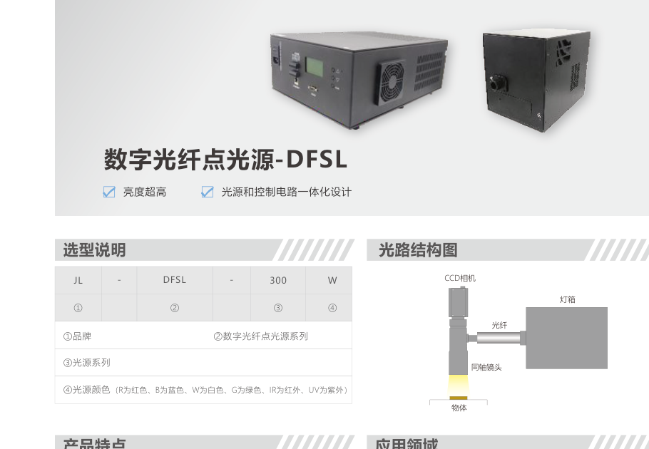
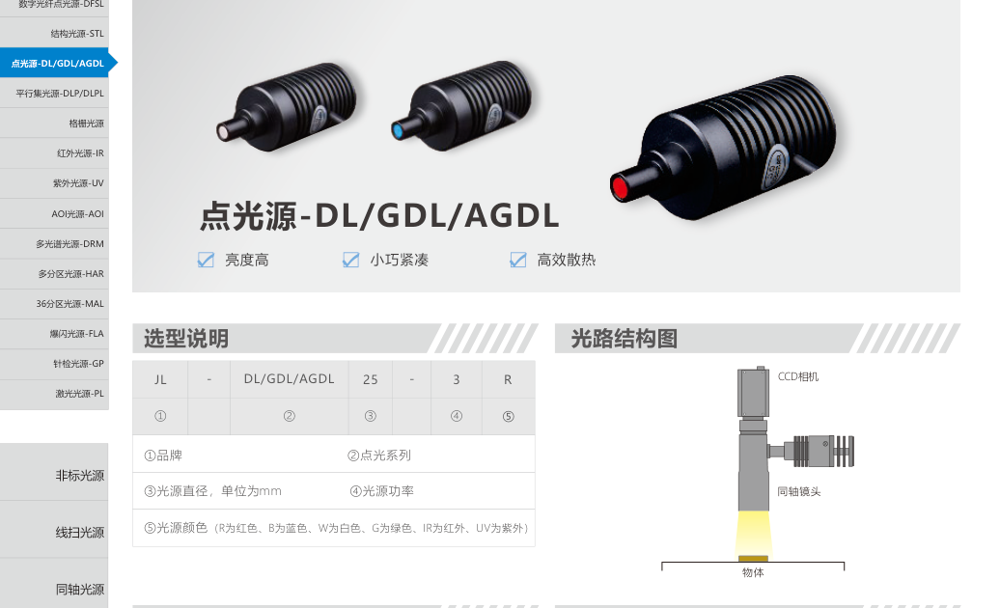
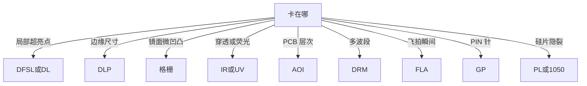

# 第8章 特殊光源

来源：工业视觉硬件产品手册（2026版）。首页标题核对：数字光纤点光源起于约书页 123（PDF idx 62），至针检 / PL 激光约书页 152。STL / 多分区 HAR / MAL 印在本栏但主条在第7章。书页 23/25/26/28 的钠灯箱、超高亮微型、高亮大点光、近红外隐裂、1050 nm 激光一体机并入本章。C 形水冷主条在第4章，不重复参数。

手册原名是**格栅光源**，不是光栅。

## 本章总览

特殊光源解决「常规环/条/同轴/背光不够用」的场景：光纤点、平行集束、格栅衬底、红外穿透、紫外荧光、AOI 多色多角、多光谱、爆闪飞拍、针检窄缝、光伏激光。先确认是波段问题、光斑形状问题，还是时间（频闪）问题，再进系列。

👉 均匀照明回第2–6章；分区轮亮回第7章；控制器回第9章。

🔑 关键速记：特殊灯先问波长、光斑、时间三件事，不要用环形硬顶。

## 核心产品系列

### DFSL 系列数字光纤点光源

#### 产品特点

- 白光照度最高可达 **1.4 亿 lx**。
- 支持 RS232 / TCP/IP 与外部触发，触发响应快。
- 色轮最多 **六种颜色**；可拆前盖换滤镜；亮度补偿。
- 紫外、红外可定制。光源与控制电路一体化。
- 可替代卤素灯 + 光纤。

#### 核心参数表

电参数细节【信息缺口：功率列以型号瓦数档为主】。

| 型号 |
| --- |
| DFSL-80W、150W、300W、300C、600W、600C、600RGB |
| XDB-60W（同页列出） |

#### 适用场景

工业 / 医疗照明、半导体设备检测、需要换色轮的点照射。

🔑 关键速记：要上亿勒克斯的光纤点，选 DFSL，换色靠色轮不是靠换整灯。

### DL / GDL / AGDL 系列点光源

#### 产品特点

- 出口特制导光柱，亮度高；小巧紧凑、高效散热、功耗低、寿命长。
- 用途：Mark 点、芯片字符、同轴镜头专用照明、平整物体定位与缺陷。

#### 核心参数表

适配 DSL-3W / 10W 点光源控制器（见第9章）。

| 型号 |
| --- |
| DL22-3、DL25-3、DL30-3 |
| GDL30-3、AGDL30-3、GDL29-10 |

#### 适用场景

小视场、需要点亮一个点而不是铺一面。更大更远的点斑看「高亮大点光」。

🔑 关键速记：小点定位用 DL；远距大光斑用大点光。

### DLP / DLPL 系列平行集光源

#### 产品特点

- 准直性好、对比度高、测量精度高。
- 自带调节光圈，控制出光量；消除边界效应，提高边缘对比。
- 适配 APS3-24V200mA-4。

#### 核心参数表

| 型号 | 功率 |
| --- | --- |
| DLP-37 / 60 / 80 | 24V / 5W |
| DLPL-80 / 100 | 24V / 5W |

#### 适用场景

高精度尺寸、弧边毛刺、透明材质边缘破损。要平行同轴（分光镜）回第2章 COXP。

👉 大型/高清平行同轴见第2章。

🔑 关键速记：只要准直集束测边缘，用 DLP；要同轴看表面，用 COXP。

### 格栅光源系列

手册用词是**格栅**。可对同轴难以检出的镜面「不明显凹凸」做提取。应用：镜面、金属片、薄膜、玻璃、液晶零件。

#### 核心参数表

| 系列线索 | 型号示例 | 功率 | 控制器 |
| --- | --- | --- | --- |
| 同轴格栅 | COXSL-100/200/300 | 24V / 24–72W | APS3-24V4A-4 |
| 平面无影格栅 | PCOL-60×60 … 200×200 及 RGB | 与 PCO 同档 9–26.5W | DCV、STS3 |
| 同轴格栅变体 | COX4L-30…70、COX2L-85/100、COX2L-150×120 | 【信息缺口：该段瓦数与 COX 混排】 | DCV、STS3 |

线扫同轴格栅在同页被点名为「线扫同轴系列」，参数【信息缺口】。

PCO-S-100×100W 为格栅效果图线索。STL 投图案见第7章，不要把格栅片和 STL 栅格片当成同一库存。

👉 完整深度讲解见第7章。

🔑 关键速记：格栅是衬在照明里的结构，用来刮镜面微凹凸。

### IR 系列红外光源

#### 产品特点

- 进口红外灯珠，穿透力强；可定制 **850 nm、940 nm**。
- 透射有无、液体内部异物、LCD 定位、消除有机涂层干扰；医学血管网、眼球定位（手册列出，工程上另遵安全规范）。

#### 核心参数表

适配 DCV、STS3。

| 型号 | 功率（手册该列） |
| --- | --- |
| AR9290IR、AR7075IR、AR7430IR、AR9030IR | 24V / 6.7–3.9W 档（按表序，行对齐以原表为准） |
| LR-80×19IR、144×19IR、190×19IR | 24V / 1.7–4.2W |
| BRL-50×50IR、BRL-100×100IR | 24V / 4.4–7.5W |

行-瓦对应若与印刷错位，以原表为准，不臆造。滤镜配合见第12章 FT。

👉 滤镜口径见第12章。

🔑 关键速记：红外先定 850 还是 940，再选环/条/背形态。

### UV 系列紫外光源

#### 产品特点

- 进口紫外灯珠，高输出、高稳定；可加漫射板。
- 波长、尺寸可定制。
- 隐形码、ITO 定位、UV 胶体固化/有无、荧光字符与条码。

#### 核心参数表

适配 DCV、STS3。示例：AR7430UV、AR12030UV、AR9030UV、AR15245UV375、LR-200×30UV、LR-400×30UV、COX2-60UV。功率表示例 1.3–17.5W（原表多行，【若错位不编造】）。

🔑 关键速记：紫外用来激发荧光或看隐形码，人眼安全与波长定制一起问。

### AOI 系列光源

#### 产品特点

- 多色、多角度，突出层次；每色可独立控制；亮度高、检测快。
- 全系列可加漫射板；红外、紫外按非标报价。

#### 核心参数表

适配 DCV、STS3。

| 型号 | 功率（原表多列） |
| --- | --- |
| AOI-95RGB | 约 24V / 2–4.8W 档 |
| AOI-120RGB | 约 3.2–7.4W 档 |
| AOI-212RGBW | 约 4.8–14.9W 档 |

【信息缺口：RGB 各通道瓦数如何拆分未说明。】

#### 适用场景

PCB 焊锡、金属划伤、高反光划痕凹坑。

🔑 关键速记：AOI 灯是多色多角度一盏里，不是普通 RGB 环。

### DRM 系列多光谱光源

#### 产品特点

- **8 种波段**（红绿蓝白红外紫外等），左右两扇区共 **16 通道**独立控制。
- 颜色识别、表面三维信息。限制：一秒点亮时间不大于 **10 ms**。
- 适配 TSC-21-B-V1。

#### 核心参数表

| 型号 | 功率 | 控制器 |
| --- | --- | --- |
| DRM-158-DB25 | 24V / 20.7W | TSC-21-B-V1 |

#### 适用场景

立体三维、反光缺陷、透明轮廓、色差。只要换方向不要多波段，回第7章 MAS/HAR-H16。

🔑 关键速记：8 波段 16 通道用 DRM，占空比别超过 10 ms/s。

### FLA 系列爆闪光源

#### 产品特点

- 瞬间亮度超高且均匀，最高亮度可达 **800 万 lx**。
- 频闪、短曝光飞拍；散热设计保寿命。
- 适配 APH2-48048-4（增亮频闪控制器，见第9章）。

#### 核心参数表

形态含环形 FLA-AR… 与同轴 FLA-COX2-40/60/85。功率【信息缺口：该页未给每型号瓦数】。

#### 适用场景

高速飞拍。常亮高亮水冷线扫见第5章 HXS，不要混用。

👉 完整深度讲解见第5章、第9章。

🔑 关键速记：爆闪配 APH 控制器，不是拿 DCV 常亮硬撑。

### GP 系列针检光源

#### 产品特点

- 均匀性好、亮度高、光斑极窄，适用于 PIN 针检测。
- 准直性好，提高 PIN 对比度；插件产品定位。

#### 核心参数表

| 型号 | 功率 | 控制器 |
| --- | --- | --- |
| GP-2L50×0.5-2C-V1 | 24V / 11.3W | DCV、STS3 |

🔑 关键速记：针检要极窄光斑，用 GP 双线，不要用普通条形。

### PL 系列激光光源

#### 产品特点

- 光伏电池片工艺（扩散、刻蚀、退火、镀膜等）中的隐裂、虚印、黑斑、皮带印、扩散异常。
- 分体式：高功率半导体激光 + 控制电路，光纤把激光引入镜头。
- 一体 / 分体两种形态。

#### 核心参数表

手册多款标 **24V / 大于 200W**。

| 形态线索 | 型号示例 |
| --- | --- |
| VMPL | VMPL-252K-B、502K-B、504K-A、254K-A、504K-B |
| MPL 灯头 | MPL-25L-A/B、MPL-50L-A/B |
| 效果图线索 | GPPL-02808-50-TD4、LAPL-50808-LINE |

MPL 也是第9章分时频闪控制器的系列名，光源章的 MPL-25L 是激光灯头，**不要和控制器 MPL-4805 混库存**。

👉 控制器 MPL 见第9章。

🔑 关键速记：PL 激光给硅片隐裂，功率大于 200W，形态分一体分体。

### 非常规形态（并入本章）

#### 钠灯箱

FDT-1430×1330×450-C。超大发光面、光斑均匀；电动翻转遮光；散热使整体温度较低；两种光色切换检出缺陷。电子屏幕瑕疵。

#### 超高亮微型光源

BRL-41×12IR850-2C。特殊传导把光聚到出光口；反射层降光损；超薄，紧凑安装。小孔内部尺寸、定位、缺陷。前缀虽是 BRL，**不是第3章普通背光**；第3章只互引。

👉 背光系列见第3章。

#### 高亮大点光

DL120W-GL。照度实测可达 **90 万 lx**；工作距 400 mm 时光斑可达 250 mm；常亮稳定。远距照明、大型 PCB、硅片分选。案例：1.5 m / 1 ms，1 m / 500 µs。

#### 近红外隐裂检测光源

LXS-260X7IR1050-CRACK。晶硅电池片隐裂和崩边缺角；脏污、手指印、脱晶；高均匀高亮兼顾节拍。

#### 1050 nm 激光一体机

LAC-201050-LINE-V2。激光与线扫相机分置被测物上下两侧，穿透硅片成像。相对 LED：波长更长、穿透更强、高亮、均匀、边缘锐利。工艺段：原硅上料 / 制绒后 / 背膜后 / 正膜后 / 丝网上料；硅片 182 / 210 / 230 mm；输入 **DC 12V**；外触发 12V；形态 L 形；环境 +10～+35℃，存储 −20～+60℃。

C 形水冷见第4章，本章不列参数。

👉 完整深度讲解见第4章。

🔑 关键速记：非常规五件按场景记：大箱钠灯、小孔微型、远距大点、1050 隐裂灯、1050 激光一体机。

## 选型对比与建议

| 系列 | 一句话 |
| --- | --- |
| DFSL | 光纤点 + 色轮 |
| DL | 小导光柱 |
| DLP | 平行集束测边 |
| 格栅 | 衬结构看凹凸 |
| IR/UV | 换波段 |
| AOI | 多色多角 |
| DRM | 8 波段 16 通道 |
| FLA | 爆闪 800 万 lx |
| GP | 针检窄缝 |
| PL | 光伏激光 |

🔑 关键速记：特殊灯没有「通用款」，对上场景再下型号。

## 本章要点总结

- 格栅 ≠ 光栅 ≠ STL。
- HAR-H16 / MAL / STL 主条在第7章。
- 微型 BRL 不是普通背光。
- 灯头 MPL 与控制器 MPL 重名前缀。
