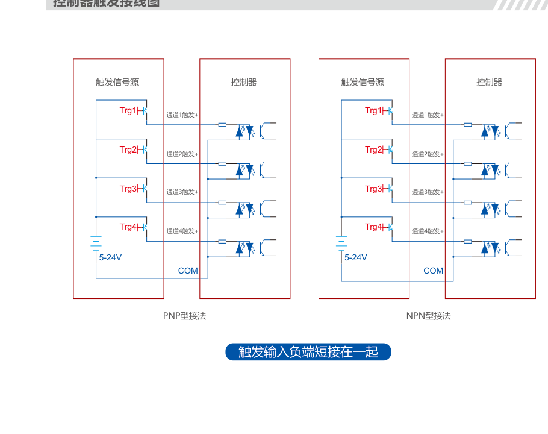
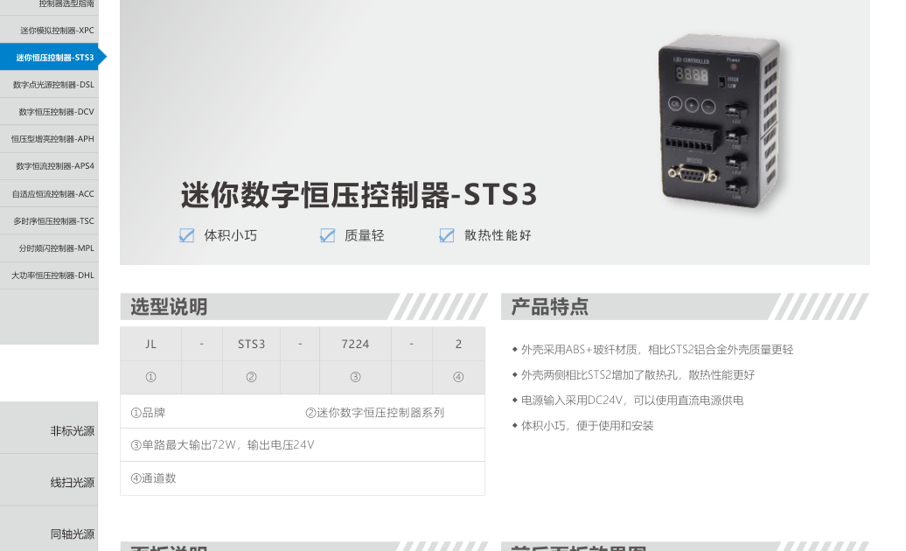
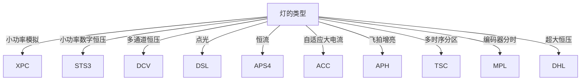

# 第9章 光源控制器

来源：工业视觉硬件产品手册（2026版）。首页标题核对：选型指南起于约书页 161（PDF idx 81），大功率恒压 DHL 与镜头章页缝在 idx 92。光源章只写「配哪类控制器」，接线与通道以本章为准。

恒压灯配恒压控制器，恒流灯配恒流控制器。灯上若有电阻，不建议配恒流；若必须配，要知道恒流的最大输出电压。

## 本章总览

控制器给灯供电并管亮度、触发、通道、频闪时序。选型先对电压与功率，再问常亮还是触发，要不要通讯，几路灯共用，接口是否匹配。单通道功率原则上要**大于**光源功率。

第1章讲频闪能把瞬间亮度拉高、和相机曝光对齐；本章是具体系列。

👉 打光与频闪概念见第1章。

🔑 关键速记：电压类型先配对，再谈通道、触发、通讯。

## 核心产品系列

### 选型指南（总论）

手册列出的判断项：

- 灯有没有电阻 → 有则不建议恒流。
- 灯功率 → 控制器单通道功率要更大。
- 电压是否匹配（表中出现 24V 与 5–24V 档）。
- 常亮还是触发；要不要程序控制。
- 几路灯共用 → 选通道数。
- 接口是否匹配。
- 恒压源在允许负载下电压恒定；恒流源在允许负载下电流恒定。

🔑 关键速记：四件事：压流类型、功率余量、通道数、触发/通讯。

### XPC 系列迷你模拟控制器

#### 产品特点

体积小、重量轻、无极亮度调节；安装灵活。输入/输出 DC5V 或 24V。

#### 核心参数表

| 型号 | 类型 | 电压 | 备注 |
| --- | --- | --- | --- |
| XPC5V1A-1 | 恒流 | DC5V | — |
| XPC24V-1 | 恒压 | DC24V | 输入输出 24V，最大输出功率 **24W** |

#### 适用场景

单路小功率常亮微调。不要拿它驱大功率线扫。

🔑 关键速记：桌面调光用 XPC，24W 封顶。

### STS3 系列迷你数字恒压控制器

#### 产品特点

- 外壳 ABS+玻纤，比 STS2 铝合金更轻；两侧增加散热孔。
- 电源输入 DC24V；体积小巧。
- 单路最大输出 **72W**，输出电压 24V。
- 触发：5 µs（24V 触发输入，高电平点亮）。

#### 核心参数表

| 型号 | 输入 | 输出线索 |
| --- | --- | --- |
| STS3-7224-2 | DC24V | 2 路档 |
| STS3-9624-4 | DC24V | 4 路档；表列 DC5–24V |

多数常规灯页写适配 DCV、STS3。

🔑 关键速记：小功率数字恒压默认 STS3，单路别超 72W。

### DSL 系列数字点光源控制器

#### 产品特点

- 12 位 DA 调电流；调光等级可在 256 / 1000 级切换。
- 可自定义最高亮度，避免烧小功率点光。
- 面板旋钮、RS232、RS485；波特率 9600 / 19200 / 115200。
- DC5–24V 宽电压触发；通讯 RS232/RS485 标配，网口非标。
- 出厂默认 IP：192.168.1.10 / 255.255.255.0 / 192.168.1.1。
- 触发 <5 µs（24V 高电平点亮）。

同通道数外形尺寸一致。点光源 DL / STL 配套见第8、7章。

🔑 关键速记：点光必须用 DSL 限最高亮度，别拿 DCV 直接顶。

### DCV 系列数字恒压控制器

#### 产品特点

- 更小更轻；支持触发输入与触发输出（**DCV-15024-6 除外**）。
- 多档波特率；旋钮操作（可定制按键）。
- RS232/RS485 标配，网口选配；单条指令可控制多通道开关。
- PWM 频率升级，低曝光图像更稳；参数断电保存。
- 触发 <5 µs 或 <10 µs（视型号）。

#### 核心参数表（型号线索）

DCV-6024-4 / -BR / -B / -L；DCV-15024-4-B、-4-L、-8、-8-B、-8-L、-8-B-L；DCV-35024-16-B。完整电气表【信息缺口：电流列未抽出】。

🔑 关键速记：常规恒压多通道用 DCV，6 路那款没有触发输出。

### APH 系列数字恒压型增亮控制器

#### 产品特点

- 常规光源可提高 **3–4 倍**亮度，适合高速飞拍。
- 0–999 µs 设定频闪时间；上升沿/下降沿触发。
- 可输出触发给相机；延迟与预延迟；断电记忆、短路保护。
- 型号：APH2-48048-4-V2、APH3-20048-4-B、APH3-20048-4-L。

FLA 爆闪页指定 APH2-48048-4。

👉 爆闪灯见第8章。

🔑 关键速记：要瞬间增亮飞拍用 APH，时序按微秒设。

### APS4 系列数字恒流控制器

#### 产品特点

- RS232 远程 256/1000 级亮度；高精度恒流，稳亮度、延寿命。
- 过流、短路保护；多通道；高低电平触发。
- 输出 DC 0–24V（随设置电流和负载变化）。

型号：APS4-24V200MA-4（及 -B/-L/-B-L）、APS4-24V4A-4-B/L/B-L。平行集 DLP 页写 APS3-24V200mA-4，与 APS4 不是同一系列名，按灯页标注配对，不混用。

🔑 关键速记：恒流灯对 APS4，输出电压会随负载变，不是死 24V。

### ACC 系列自适应恒流控制器

#### 产品特点

- 搭配具备自适应功能的灯时可识别电流；开机自检。
- 自适应关闭后通道电流可调；RS232 256 级；液晶显示通道/电流/温度。
- 高低电平触发、多档波特率；高温与故障保护。

型号覆盖 24V5A、48V3A、24V5A-2、48V20A-4、24V40A-4 及 CV 版 24V10A/20A、35V20A 等。大功率水冷线扫 HXS 页适配 ACC。

👉 线扫 HXS 见第5章。

🔑 关键速记：大功率恒流和水冷线扫优先 ACC。

### TSC 系列多时序恒压控制器

#### 产品特点

- TSC-21：21 通道、21 个时序；TSC-36：36 通道、99 个时序。
- 每个时序输出相机触发；可自定义哪些灯亮灭。
- 点亮时间 1–999 µs。
- TSC-21 亮度 0–100 级；TSC-36 亮度 0–255 级。
- DC5–24V 宽电压触发。

配套：DRM、HAR-H16 → TSC-21-B-V1；MAL → TSC-36-L-V1。

👉 多光谱与分区见第7、8章。

🔑 关键速记：多方向按微秒轮亮用 TSC，通道数 21 或 36 按灯选。

### MPL 系列分时频闪控制器

#### 产品特点

- 支持编码器分频或倍频，参数设错会报警。
- 内部/外部编码器；持续抓拍、上位机启拍、帧信号边沿抓拍。
- 边沿抓拍最多支持 9999999×4 行；外部编码器频率可修正。

| 型号 | 典型配套 |
| --- | --- |
| MPL-4805-V1 | 穹顶光度 DM-10P |
| MPL-4810-V1 | 环形 MAS |

不要和第8章激光灯头 MPL-25L 混淆。

🔑 关键速记：线扫/光度立体跟编码器走拍用 MPL 控制器。

### DHL 系列大功率恒压控制器

#### 产品特点

旋钮调亮度；输出电流大；外部 5–24V 触发，高低电平可切换。

| 型号 |
| --- |
| DHL-24048-1-CV |
| DHL-48048-1-CV |

详细电流【信息缺口：与镜头页缝，表未完全抽出】。

🔑 关键速记：单路特别大的恒压灯才上 DHL。

## 选型对比与建议

| 系列 | 类型 | 先选它当 |
| --- | --- | --- |
| XPC | 模拟 | 旋钮小灯 |
| STS3 | 数字恒压迷你 | 常规小灯 |
| DCV | 数字恒压 | 多通道常规 |
| DSL | 点光恒流调 | 点光源 |
| APS4 | 恒流 | 标明恒流的灯 |
| ACC | 自适应恒流 | 大功率线扫 |
| APH | 增亮频闪 | 爆闪/飞拍 |
| TSC | 多时序 | 16/36 分区 |
| MPL | 分时频闪 | 光度立体 |
| DHL | 大功率恒压 | 超大单路 |

🔑 关键速记：灯页写的适配系列优先，不要凭功率数字跨类型硬配。

## 本章要点总结

- 有电阻的灯不建议恒流。
- DCV-15024-6 无触发输出。
- MPL 控制器 ≠ MPL 激光灯头。
- 网口、IP 默认值以手册为准，产线须改网段。
