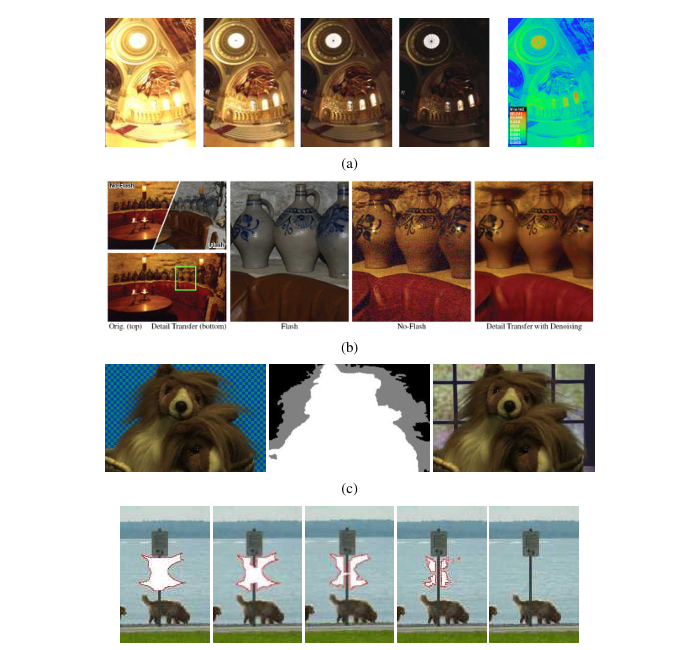
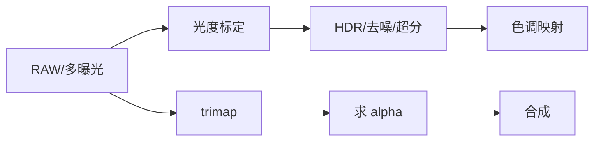

# 第10章 计算摄影

来源：Szeliski《Computer Vision: Algorithms and Applications》第二版电子终稿第10章；书页 607–680 / PDF 633–706。分三批局部阅读。未越界第11章。成像链路与计算摄影；几何重建不在本章。

## 本章总览

计算摄影用一张或多张照片，做出传统一次快门做不到的图：更宽动态范围、更少噪声、更浅景深、抠出来再贴、补洞、换风格。手机里的全景、HDR、多帧降噪/超分、双像素虚化，书把它当作 2010–2020 年落地最广的视觉分支。

先标定相机的光度响应，再谈 HDR 与色调映射、超分去噪去模糊、抠图合成、纹理与补洞。几何上的三维不在这里做。第3章的 over 公式在本章才补上「怎么求出 $\alpha$」。

## 核心知识点

### 光度标定

传感器输出不是线性辐照。辐射响应函数(CRF)把像素值映回相对曝光；多曝光标定是 HDR 的前提。还要估噪声随亮度怎么变、渐晕（角落变暗）、光学模糊/点扩散。这些是后面合并与去卷积的前置。计算应在线性域，JPEG 8 位已经过伽马，不能当线性用——第2章已强调。

👉 伽马、Bayer、JPEG 完整深度讲解见第2章。

🔑 关键速记：先把像素变回线性辐照，再谈 HDR 和去模糊。

### HDR、色调映射与闪光

场景亮度跨度常超过传感器。多张不同快门叠成辐照图（Debevec–Malik 一类），再色调映射压回 8 位显示器：全局曲线简单，局部（含梯度域/WLS，见第4章着色同类能量）更能保住亮暗细节。闪光+不闪光：闪光给细节和色，环境光给自然阴影，双边加权融合。几何对齐若有手抖，先用第8/9章对齐再合。

👉 加权最小二乘色调映射完整深度讲解见第4章。

🔑 关键速记：HDR 是线性域合并；给人看还要色调映射；闪光图当细节层。

📚 基础补充：【HDR 与色调映射】

- 是什么：高动态范围(HDR, high dynamic range)指场景从深阴影到太阳的亮度跨度远超普通 8 位照片。多张不同曝光在线性域合成一张辐照图，就能把亮部和暗部都保住。色调映射(tone mapping)再把这张「太宽」的辐照图压回显示器能显示的范围。
- 为什么要用它：一次快门要么天空过曝一片白，要么室内欠曝一片黑。人眼能同时看见窗户外和房间内，传感器不行。
- 直观理解：摄影师「包围曝光」：欠曝抓云，过曝抓阴影，中间抓正常。HDR 合并像把三张拼成一张「全信息底片」。色调映射像洗照片时的曲线：全局一条 S 曲线简单，局部（梯度域/WLS）能让亮暗两边的纹理都还在，否则压完会发闷或光晕。必须在线性辐照上合并，JPEG 已经过伽马。

图注：HDR 发生在线性域；给人看必须再映射。手抖要先对齐（第8/9章）。

- 和本章的关系：Debevec–Malik 一类标定+合并是经典路径。闪光/非闪光融合是同一思想的「细节层+照明层」。

🔑 关键速记：HDR 先合线性辐照，再色调映射给显示器；顺序反了就不是真 HDR。

### 超分、去噪、去模糊、去马赛克、虚化

多帧超分/去噪：对齐亚像素位移再合并（手机夜景）。去模糊是逆卷积，要模糊核+自然图像先验（超拉普拉斯，第4章）。去马赛克把 Bayer 马赛克插成 RGB，第2.3节只点名，算法在 10.3.1。镜头虚化(bokeh)可用大光圈真拍，也可用双像素/双摄估深度再渲染浅景深——深度从哪来见第12章，本章只谈成像效果。

👉 深度转虚化完整深度讲解见第12章。

🔑 关键速记：超分去噪靠多帧对齐；去马赛克是 Bayer 的逆；手机虚化常是算出来的。

📚 基础补充：【去模糊与超分辨率的基本思想】

- 是什么：去模糊(deblurring)想解开拍照时的运动或离焦造成的 smearing，数学上接近逆卷积：已知或要同时估计模糊核，再靠自然图像先验把锐利图找回来。超分辨率(super-resolution)想从一张或多张较低分辨率的图估计更高分辨率的细节。
- 为什么要用它：手抖、夜景长曝光、数字变焦会让图糊、像素不够。单靠「把图拉大」只会插值出更糊的块，没有新信息。
- 直观理解：去模糊像隔着磨砂玻璃看字，要猜字本来的笔划，又不能把噪声放大成振铃。超拉普拉斯先验（第4章）偏向「少而大的边缘」，比单纯最小二乘逆滤波稳。多帧超分：手微微一抖，各帧采到的像素网格错开半个像素，对齐后合并就能比单帧更细——前提是对齐要亚像素准。单帧超分必须靠学习「这类图通常长什么样」的先验。

- 和本章的关系：手机夜景 = 多帧对齐 + 去噪 + 有时超分。去马赛克是 Bayer 的另一类逆问题。虚化是故意加模糊，方向相反。

🔑 关键速记：去模糊是逆卷积加先验；超分要么多帧错位合并，要么靠学习补细节。

### 抠图与合成

合成仍是 $C=(1-\alpha)B+\alpha F$。蓝幕：背景色已知，方程够解。自然图抠图：三未知（$F,B,\alpha$）每像素，必须靠局部颜色线、涂鸦或 trimap。优化抠图（闭式拉普拉斯、第4章二次能量）把 $\alpha$ 写成稀疏线性系统。烟、影、闪光、视频抠图是特殊测量。智能修图选区后的补洞接下一节。

这是第3章留下的完整讲解。

🔑 关键速记：蓝幕能直接解；自然图必须加颜色平滑先验才能求出 $\alpha$。

### 纹理、补洞与风格

纹理合成：从样例长出相似统计。补洞/修复：从边界往里拷纹理，或用偏微分方程/深度学习。非真实感绘制把照片变成素描或卡通。神经风格迁移用预训练网的特征匹配风格统计；语义图像合成按标签图造图。生成模型细节见第5.5.4节，绘制侧见第14.6节。

👉 神经绘制完整深度讲解见第14章。

🔑 关键速记：补洞是纹理+结构往里填；风格迁移匹配的是特征统计不是像素。

## 易混淆点&差异对比

| 名称 | 功能 | 主要参数 | 约束&坑点 |
| --- | --- | --- | --- |
| CRF vs 伽马 | 标定曲线 / 显示近似 $\gamma\approx2.2$ | 多曝光 | 不要把 JPEG 当线性 |
| HDR 合并 vs 色调映射 | 造辐照图 / 压回显示 | 曝光序列 | 合并在线性域 |
| 蓝幕 vs 自然抠图 | 已知背景色 / 未知 | trimap | 自然图欠定 |
| 去模糊 vs 虚化 | 去掉模糊 / 故意造浅景深 | 核 vs 深度 | 方向相反 |
| 补洞 vs 第8章选缝 | 填缺失 / 选源图像素 | 洞的 mask | mask 非零才是洞 |

几何重建（形状、位姿）不是计算摄影的目标。

🔑 关键速记：先分清「线性辐照还是显示图、求 α 还是填洞」。

## 本章要点总结

- 光度标定：CRF、噪声、渐晕、模糊核；工作在线性域。
- HDR 多曝光合并 + 色调映射；闪光/非闪光融合。
- 多帧超分去噪、去卷积、去马赛克、计算虚化。
- 自然抠图补上第3章的 $\alpha$；补洞与风格是外观合成。
- 不在本章做 SfM 或立体。

【信息缺口，需要局部查阅文档】Debevec–Malik 响应标定的目标函数未逐式抄出；闭式抠图拉普拉斯的矩阵元素未从 10.4.3 核对。
