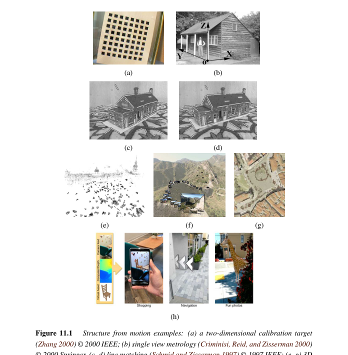
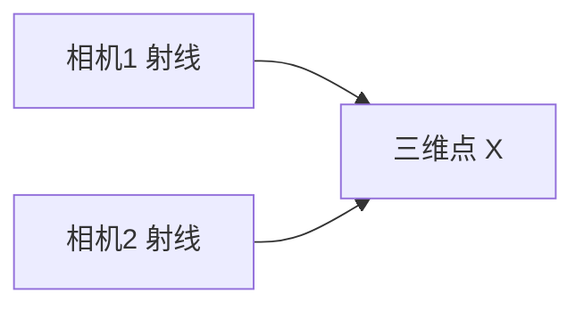
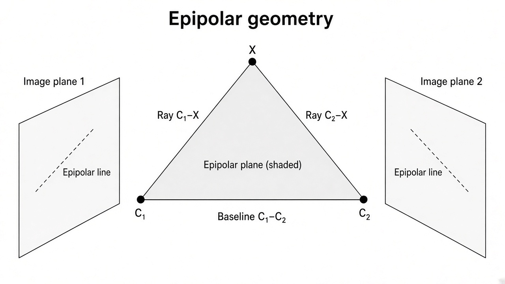
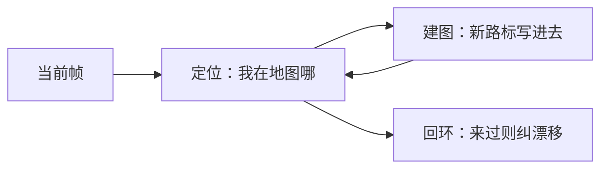
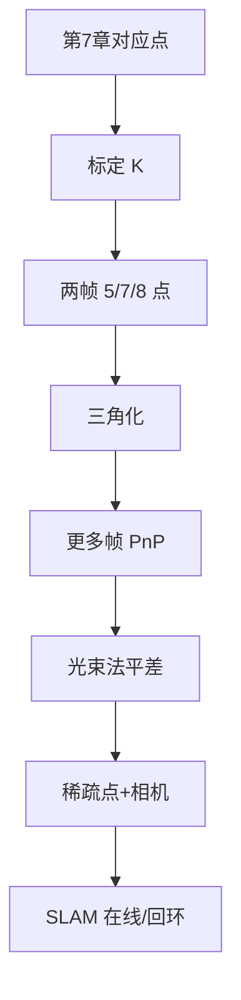

# 第11章 运动恢复结构与同时定位建图

来源：Szeliski《Computer Vision: Algorithms and Applications》第二版电子终稿第11章；书页 681–748 / PDF 707–774。分三批局部阅读。未越界第12章。默认已具备第2章几何和第7章特征；稠密深度留第12章。

## 本章总览

从多张带对应点的照片恢复相机姿态和稀疏三维点，就是运动恢复结构(SfM)。在线、带回环的同一件事叫同时定位与建图(SLAM)，服务导航和手机增强现实。第二版把 SLAM / 视觉惯性里程计(VIO)写进正文章。

顺序：先标定内参（消失点、旋转、径向）→ 已知三维时的位姿(PnP)与三角化 → 两帧本质/基础矩阵 → 多帧分解与光束法平差 → SLAM。稠密深度图不在本章算。

## 核心知识点

### 几何内参标定

消失点：平行世界线在像上交于一点，三个正交方向可约束主点和焦距（第7.4节只检测到点，这里用来标定）。单视测量：已知消失点和参照长度，可在一张透视图上量相对高度。纯旋转序列（转全景那类）用单应约束 $K$。径向畸变必须在透视除法后处理，公式见第2.2.3节，本章谈怎么和标定一起估。棋盘平面靶（Zhang）是常用工程路径。

👉 针孔 $K$ 与径向公式完整深度讲解见第2章。消失点检测完整深度讲解见第7章。

🔑 关键速记：内参可从消失点、旋转全景或平面靶来；畸变和 $K$ 要一起想。

### 位姿与三角化

三维点已知、求相机位姿：线性算法（DLT 一类）再非线性重投影精炼。位置识别：用特征检索「这张图是哪」再 PnP。三角化：两根已知射线求交点，噪声下用中点或最小化重投影。对应点来自第7章。

🔑 关键速记：PnP 是「点已知求相机」；三角化是「相机已知求点」。

📚 基础补充：【PnP 问题】

- 是什么：PnP（Perspective-n-Point）是：已知若干三维点及其在图像上的二维投影，求相机的旋转和平移。
- 为什么要用它：标定板、地图点、AR 里「虚拟物体钉在桌面上」，都是先有 3D，再问相机现在在哪。和三角化正好互逆。
- 直观理解：你拿着手机对着已知尺寸的二维码：码上四个角的三维位置已知，像素位置也能检测到，解 PnP 就得到手机位姿。点太少或共面时会有歧义；线性 DLT 当初值，再用重投影误差精炼。位置识别是「先检索这是哪，再 PnP」。

- 和本章的关系：增量 SfM 里，新图对已有三维点做 PnP 挂进地图，再三角化新点。

🔑 关键速记：PnP = 已知 3D–2D 对应求相机；AR 和增量 SfM 天天用。

📚 基础补充：【三角化的几何意义】

- 是什么：三角化(triangulation)是两条已知视线求交：两台已标定相机看见同一点，从光心分别射出一条射线，交点就是三维位置。
- 为什么要用它：SfM 要长出稀疏点云，立体要深度，都靠「两眼看同一处」。
- 直观理解：两只眼睛看手指，视线在空间交会。噪声下两条射线往往不相交，就取公垂线中点，或直接最小化两边的重投影误差。基线太短（两相机几乎重合）时交角很尖，深度误差巨大——所以纯旋转几乎三角化不出点。

图注：三角化 = 两根已知射线求交。噪声下取最佳折中；基线太短则深度不可靠。

- 和本章的关系：两帧恢复姿态之后立刻三角化出点，多帧再靠 BA 把点和相机一起拧准。

🔑 关键速记：相机已知时，两根视线交出三维点；短基线深度很虚。

### 两帧 SfM

未知两个姿态和一批点。标定后用本质矩阵，八点、七点、五点算法（五点要已知 $K$）。特殊运动（纯旋转、纯平移）退化，不能当一般情况。未标定用基础矩阵做射影重建，再自标定升到度量。视点变形(view morphing)是应用：中间视点靠两帧几何插。对极几何的密集使用在第12章立体校正。

👉 对极线与立体完整深度讲解见第12章。

🔑 关键速记：标定走本质矩阵，未标定走基础矩阵；五点最少但要内参。

📚 基础补充：【对极几何、基础矩阵、本质矩阵】

- 是什么：对极几何(epipolar geometry)描述两台相机看同一场景时，对应点必须落在对方图像的一条直线（对极线）上。基础矩阵(fundamental matrix) $F$ 把未标定像素对应写成 $\tilde{\mathbf{x}}'^{\mathrm{T}}F\tilde{\mathbf{x}}=0$；本质矩阵(essential matrix) $E$ 是已经去掉内参 $K$ 的版本，里面只含相对旋转和平移方向。
- 为什么要用它：还不知道三维点时，两帧之间仍有硬约束，能把错误匹配滤掉，也能把搜索从整图降到一条线（第12章立体）。
- 直观理解：左眼看见的一点，连同两个光心，张成一块平面（对极平面），这块平面劈右图像得到一条线——对应点只能在这条线上。两个光心的连线（基线）刺穿像平面的点叫极点。$E$ 可以想成「先把点转到第二台相机，再与平移做叉乘」。纯旋转没有基线，对极约束退化。

公式人话翻译：$\mathbf{x}'^{\mathrm{T}}F\mathbf{x}=0$ 输入一对像素，输出应接近 0 才算几何一致。$E=K'^{\mathrm{T}}FK$ 把像素约束换成归一化相机坐标约束。

- 和本章的关系：八点/七点估 $F$，五点估 $E$（要已知 $K$）。立体校正就是把对极线拧成水平扫描线。

🔑 关键速记：$F$ 管未标定像素，$E$ 管已标定相对位姿；对应点必须在对极线上。

### 多帧 SfM

短序列正交投影可用分解(factorization)把测量矩阵拆成运动×结构。一般透视用光束法平差：同时调所有相机和三维点，最小化重投影误差。海森稀疏（相机–点块），要用附录 A 的稀疏求解，第8章拼接 BA 是深度被钉住的特例。匹配移动把虚拟物钉在实拍上。互联网照片：先检索连通分量再增量或全局 SfM。尺度、反射、纯旋转等歧义要靠先验或 IMU。

👉 稀疏最小二乘完整深度讲解见附录 A。拼接里的 BA 完整深度讲解见第8章。

🔑 关键速记：多帧核心是光束法平差；增量会漂，全局旋转先对齐再精炼。

📚 基础补充：【光束法平差 BA】

- 是什么：光束法平差(bundle adjustment)同时优化所有相机姿态（及可选内参）和所有三维点，目标是让每个点投影回各张照片时，和检测到的像素尽量重合（重投影误差最小）。
- 为什么要用它：两帧算法、增量 PnP 会把误差像滚雪球一样攒下来。全局一起调，尺度、漂移和点的位置才能互相补偿。
- 直观理解：每条观测是一根从光心射向像素、再通向三维点的「光束」。轻轻拧相机、挪点，让所有光束尽量交会。海森矩阵很稀疏：一个点只连看见它的那几台相机，必须用稀疏求解（附录 A），不能当稠密最小二乘。第8章拼接 BA 是把点钉在很远的简化版。

公式人话翻译：输入是初始相机与点、以及 2D 观测；输出是 refined 的姿态和三维。损失通常是像素平方误差，外点要用稳健核。

- 和本章的关系：多帧 SfM 的最后一公里几乎一定是 BA。SLAM 里的局部/全局 BA 是同一问题的在线切片。

🔑 关键速记：BA = 所有相机和点一起最小化重投影；稀疏结构必须尊重，否则算不动。

### SLAM

SfM 通常离线批处理；SLAM 要边走边建、限时、还要回环消漂移。视觉惯性里程计把 IMU 与视觉紧耦合，手机 AR 和自动驾驶常用。导航要可定位；AR 还要实时深度遮挡（稠密深度仍指第12章）。

🔑 关键速记：SLAM = 在线 SfM + 回环；VIO 用惯性补视觉丢跟踪。

📚 基础补充：【SLAM 的基本思想】

- 是什么：同时定位与建图(SLAM, simultaneous localization and mapping)一边估计「我在哪」（定位），一边把看见的路标记进地图（建图），两者互相依赖：没有地图难定位，不定位地图也拼不起来。
- 为什么要用它：机器人/手机不能等拍完所有照片再离线 SfM。必须限时、还要在走回原地时认出「我来过」（回环），把累积漂移拧回去。
- 直观理解：闭着眼在黑屋子摸家具：每摸到一张桌子，既更新「我可能在哪」，也把桌子画进脑内地图。视觉惯性里程计(VIO)再加 IMU：短暂遮挡时靠惯性顶住。AR 还要实时深度做遮挡，稠密部分见第12章。

图注：定位与建图互相喂数据；回环把长轨迹掰直。离线 SfM 是同一几何，只是不限时。

- 和本章的关系：前面的 PnP、三角化、BA 都是 SLAM 的零件。差别在在线、回环和传感器融合。

🔑 关键速记：SLAM = 边走边定位边画地图；回环负责把越走越歪的轨迹拉回来。

## 易混淆点&差异对比

| 名称 | 功能 | 主要参数 | 约束&坑点 |
| --- | --- | --- | --- |
| PnP vs 三角化 | 求位姿 / 求三维点 | 谁已知 | 搞反则整条链错 |
| 本质 vs 基础矩阵 | 已标定 / 未标定两帧 | $K$ 是否已知 | 纯旋转时退化 |
| 射影 vs 度量重建 | 差一个射影 / 欧氏（差尺度） | 自标定 | 射影不能直接量角度 |
| SfM vs SLAM | 离线批 / 在线回环 | 是否限时 | SLAM 不能等全部照片 |
| 本章 BA vs 第8章 BA | 自由三维点 / 拼图浅深度 | 点的深度 | 拼接常把点放无穷远 |
| SfM vs 立体 | 稀疏点+姿态 / 稠密深度 | — | 稠密在第12章 |

🔑 关键速记：先分清谁已知、是否标定、离线还是在线。

## 本章要点总结

- 内参：消失点、旋转、平面靶、径向一起估。
- 位姿 PnP、三角化、两帧 5/7/8 点、射影+自标定。
- 多帧：分解或 BA；互联网照片先检索。
- SLAM/VIO 服务导航与手机 AR。
- 不输出稠密深度网格。

【信息缺口，需要局部查阅文档】五点算法的多项式次数与分解的测量矩阵尺寸未从 11.3–11.4 逐式抄出。
