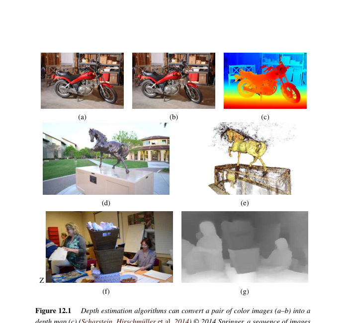
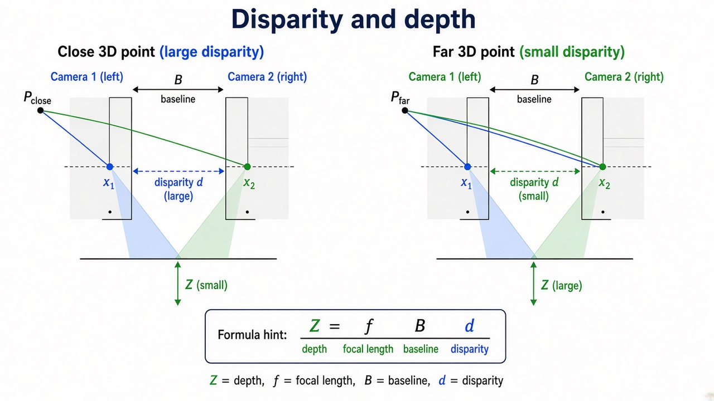

# 第12章 深度估计

来源：Szeliski《Computer Vision: Algorithms and Applications》第二版电子终稿第12章；书页 749–804 / PDF 775–830。分两批局部阅读。未越界第13章。对极几何承接第11章两帧 SfM；把深度图融成完整三维模型留第13章。

## 本章总览

立体匹配吃两张或多张图，出稠密深度。和第11章的差别：那里是稀疏点+相机，这里是每个像素（或体素）的深度。图 12.1 三条路：双目深度图、多视三维、单图深度。

先把搜索降成一维（校正或平面扫描），再谈相似度量、局部窗、全局能量（回扣第4章图割/DP），再深度网、多视、场景流、剪影、单目。融合多片深度成网格是第13章的事。

## 核心知识点

### 对极几何与降低搜索维数

两帧已知姿态后，对应点必须在对极线上。立体校正(rectification)把对极线拧成水平扫描线，视差成水平位移。平面扫描(plane sweep)：选一组深度平面，把图投影上去比相似度，适合多视或不想校正的情况。本质/基础矩阵来自第11.3节，本章当已知用。

👉 两帧 SfM 完整深度讲解见第11章。

🔑 关键速记：校正后沿水平线搜视差；多视常用平面扫描。

📚 基础补充：【立体视觉、视差与深度】

- 是什么：立体视觉(stereo)用两台已知相对位姿的相机，找对应点后把水平位移（视差 disparity）换成深度。视差大 = 近，视差小 = 远，视差 0 趋向无穷远。
- 为什么要用它：单张图没有绝对尺度；两眼基线提供了「三角测量尺」。机器人避障、双摄虚化都靠这把尺。
- 直观理解：手指放在眼前左右看，近指位移大、远山几乎不动。定量上 $Z \propto fB/d$：焦距 $f$、基线 $B$ 越大，同样视差对应的深度分辨率越好；视差估错 1 像素，近处深度误差小、远处误差可以非常大。

公式人话翻译：输入视差 $d$（像素）、焦距 $f$、基线 $B$，输出深度 $Z$。$d$ 在分母，所以远景对匹配误差极敏感。

- 和本章的关系：校正把一般对极几何变成「只搜水平视差」。得到深度图后，融合成网格是第13章。

🔑 关键速记：视差是像素位移，深度是米；二者近似成反比，远处极不准。

📚 基础补充：【对应问题与极线约束】

- 是什么：对应问题(correspondence problem)是「左图像素在右图的谁」。没有任何约束时要搜整张图。极线约束(epipolar constraint)把搜索从二维降到一条线。
- 为什么要用它：整图搜索又慢又容易配错。已知姿态后，几何禁止对应点跑到线外。
- 直观理解：你只被允许沿着一根晾衣绳找另一只袜子，而不是在整间屋里翻。立体校正把这条绳拧成水平扫描线，算法变成「在同一行里滑窗比相似度」。纹理弱、重复图案仍会配错，所以还要 NCC/CENSUS、全局平滑或深度网。

- 和本章的关系：上一节校正、下一节局部窗/全局能量，都建立在「1D 搜索」上。光流没有这条约束，必须搜 2D。对极几何完整版见第11章。

🔑 关键速记：极线把对应从二维搜成一维；校正后就是沿水平线找视差。

### 稀疏、稠密与局部方法

稀疏对应沿轮廓或兴趣点，可重建三维曲线。稠密要给每个像素视差。相似度：SSD、SAD、NCC、CENSUS 等；光照变化时相关或梯度比原始 SSD 稳。局部方法：固定或自适应窗，亚像素拟合抛物线，并给不确定度。立体头部跟踪是应用。孔径问题：纹理弱的地方窗再大也锁不住。

🔑 关键速记：局部窗快但不看全局遮挡；弱纹理处不可信。

### 全局优化与深度网

视差场用第4章能量：数据项看匹配代价，平滑项让相邻视差接近，跳变贴强度边（CRF）。扫描线动态规划、基于超像素的分割立体、图割/LBP。Z-keying 用深度换背景。深度网直接学匹配代价或端到端回归视差，骨干见第5章，任务头在本章。

这是第4章留下的「立体全局优化」。

👉 图割/LBP 框架完整深度讲解见第4章。

🔑 关键速记：全局能量处理遮挡和弱纹理；深度网把代价和正则一起学。

### 多视、场景流、剪影、单目

多视立体：更多相机减少遮挡歧义，输出深度图或体/表面。场景流是带时间的三维运动，第9章光流的 3D 版。剪影视觉壳(visual hull)只保证物体在所有剪影锥交里，凹进去的洞填不上。单目深度：一张图靠语义和透视先验，尺度通常相对，手机虚化常用。

体与表面怎么表示、多片融合，第13章展开。

👉 完整深度讲解见第13章。

🔑 关键速记：多视减歧义；场景流 = 深度+运动；单目没有绝对尺度。

## 易混淆点&差异对比

| 名称 | 功能 | 主要参数 | 约束&坑点 |
| --- | --- | --- | --- |
| 视差 vs 深度 | 像素位移 / 米制距离 | 基线、$f$ | $Z\propto fB/d$，视差 0 是无穷远 |
| 校正 vs 平面扫描 | 水平搜 / 按平面重投影 | 是否先拧图 | 多视不一定校正 |
| 局部 vs 全局立体 | 窗投票 / MRF 能量 | 窗 vs $\lambda$ | 局部糊边界，全局慢 |
| 光流 vs 立体 | 2D / 1D 沿对极线 | 搜索维数 | 立体可 DP/图割 |
| 多视立体 vs SfM | 稠密深度 / 稀疏+相机 | — | 相机通常先由第11章给出 |
| 单目 vs 双目 | 先验 / 三角 | 尺度 | 单目相对深度 |

🔑 关键速记：立体把 2D 对应压成 1D 视差；深度还要基线才能变成米。

## 本章要点总结

- 对极约束 + 校正或平面扫描。
- 相似度与局部窗；全局能量回扣第4章；深度网是新主流。
- 多视、场景流、剪影壳、单目深度。
- 不在本章把多片深度焊成完整网格。

【信息缺口，需要局部查阅文档】视差–深度公式的印刷编号、具体网络名（如 PSMNet）未从 12.6 逐条抄出。
