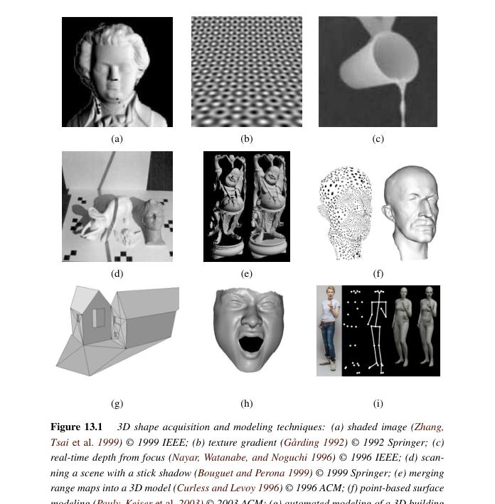
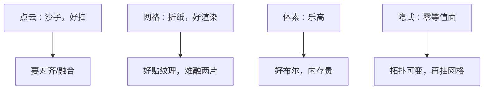

# 第13章 三维重建

来源：Szeliski《Computer Vision: Algorithms and Applications》第二版电子终稿第13章；书页 805–860 / PDF 831–886。分两批局部阅读。未越界第14章。Shape from X 用第2章光度，但不重讲立体匹配。

## 本章总览

第11章给稀疏点，第12章给深度图。本章把「形状」收成可编辑、可贴图的三维模型：可以从明暗/纹理/聚焦推，也可以用扫描仪出多片距离再融合，还可以用人脸/人体等参数模型。

表示有网格、点、体素/隐式曲面。外观还要纹理、反照率和 BRDF。数字遗产是扫描融合的典型应用。立体匹配算法不在本章重写。

## 核心知识点

### Shape from X

明暗恢复形状(SfS)：一张图的亮度，朗伯假设下与法向和光照有关，见第2章 (2.88)。光度立体：同一视点、多方向光，解法向再积分成高度。纹理：纹理元大小和朝向随透视变，可估倾角。聚焦：哪一层最锐对应哪段深度。这些都不靠双目视差。

👉 朗伯与光照完整深度讲解见第2章。

🔑 关键速记：Shape from X 用光度或光学线索，不要求第二台相机。

📚 基础补充：【Shape from X 的基本思想】

- 是什么：Shape from X 是一类「从某种线索 X 恢复形状」的统称。X 可以是明暗(shading)、纹理、聚焦、轮廓、光度立体等，共同点是**不一定需要第二台相机的视差**。
- 为什么要用它：单目、显微镜、文物表面细纹理，双目基线用不上或太弱。这些线索把第2章的正向成像模型反过来用。
- 直观理解：明暗：球向光的一面亮、背光暗，从亮度猜法向（欠定，常要已知光照和朗伯）。光度立体：同一相机、换几个灯，方程够解法向。纹理：地面砖往远处变小、变扁。聚焦：哪一段最锐，物距就在那。它们给出的多是法向或相对高度，和双目的米制深度不是同一条路。

- 和本章的关系：(2.88) 的朗伯是 SfS 的正向模型。得到法向或深度图之后，还要融合成可编辑的三维表示，见下一节。

🔑 关键速记：Shape from X 把成像线索反过来用；单图严重欠定，多灯光更稳。

### 扫描与多片融合

结构光、飞行时间、激光线给出距离图。多片要对齐（ICP 一类）再融合，经典是体素上的符号距离/概率累积（Curless–Levoy）。数字文物扫描要处理孔洞和超大点云。第12章的多视深度是输入之一。

🔑 关键速记：多片深度必须先对齐再在体里融合，直接平均网格会裂。

### 表面、点、体表示

网格：插值（薄板，第4章）、简化、几何图像（把网摊成 2D 图）。点表示：不连三角，移动最小二乘出局部面（第4.1节点过）。体素与隐式曲面/水平集：零等值面当表面，拓扑能变。泊松重建把定向点变成隐式指标函数。

👉 薄板与散乱插值完整深度讲解见第4章。

🔑 关键速记：网格好渲染，点好扫，隐式好融合和改拓扑。

📚 基础补充：【点云、网格、体素、隐式曲面】

- 是什么：三维形状有多种记账方式。点云(point cloud)是一堆带坐标（可带法向、颜色）的点。网格(mesh)把点连成三角形，有边和面。体素(voxel)像三维像素，占满一个格子。隐式曲面(implicit surface)不存三角形，而存一个函数，函数为 0 的地方就是表面（水平集/符号距离）。
- 为什么要用它：扫描仪天然出点；游戏和图形学要网格才能着色；多片融合和拓扑变化（裂开、合并）更适合体素或隐式。选错表示会让后续算法又慢又裂。
- 直观理解：点云像撒了一把沙子，没有「里面/外面」。网格像折纸，能贴纹理、好渲染，但两片对不齐就会破洞。体素像乐高积木，好做布尔运算，分辨率一高内存爆。隐式像「到表面的有符号距离场」，泊松重建把定向点变成这种场再抽三角网。

图注：点无拓扑、网格有面、体素占空间、隐式用函数定义表面。融合多片常用体素/隐式，最终再抽网格去绘制。

- 和本章的关系：扫描节的符号距离累积、泊松重建、移动最小二乘，分别落在体素/隐式和点表示上。第14章绘制常吃网格或深度图。

🔑 关键速记：点好采、网格好画、体素/隐式好融合和改拓扑。

### 基于模型：建筑、脸、人体

建筑常用平面、消失点、曼哈顿假设（接第11.1节单视测量）。人脸：3DMM 一类低维形变模型，跟踪与动画。人体：参数骨架+体形，三维跟踪是第9章二维跟踪的抬升。这些是强先验，不是从零立体。

🔑 关键速记：有类别先验时，先套模型再贴细节，比裸深度稳。

### 纹理、反照率与 BRDF

几何有了还要外观：把多视颜色烘焙成纹理，去掉光照得反照率，或估双向反射(BRDF)做换光。完整采集流水线 = 扫形 + 扫外观。绘制新视点是第14章。

👉 完整深度讲解见第14章。

🔑 关键速记：模型 = 几何 + 纹理/BRDF；只扫形不够换光照。

## 易混淆点&差异对比

| 名称 | 功能 | 主要参数 | 约束&坑点 |
| --- | --- | --- | --- |
| SfS vs 光度立体 | 单图明暗 / 多光法向 | 光照已知？ | 单图 SfS 严重欠定 |
| 深度图 vs 网格 | 2.5D / 完整 3D | 是否融合 | 单深度图看不到背面 |
| 点 vs 网格 vs 隐式 | 采样 / 连接 / 函数 | — | 点无拓扑，网格难融合 |
| 本章 vs 第12章 | 表示与融合 / 匹配出深度 | — | 不重讲 NCC/图割 |
| 反照率 vs BRDF | 漫反射贴图 / 随角度变的反射 | 观测角度 | 金属不能只用反照率 |

🔑 关键速记：先问形状从哪来、用哪种表示、要不要换光照。

## 本章要点总结

- Shape from X：明暗、光度立体、纹理、聚焦。
- 扫描多片融合；表面/点/体三种表示。
- 建筑、人脸、人体用参数模型。
- 纹理与 BRDF 补外观；新视点绘制留第14章。

【信息缺口，需要局部查阅文档】光度立体线性方程组与泊松重建能量的印刷编号未逐式抄出。
