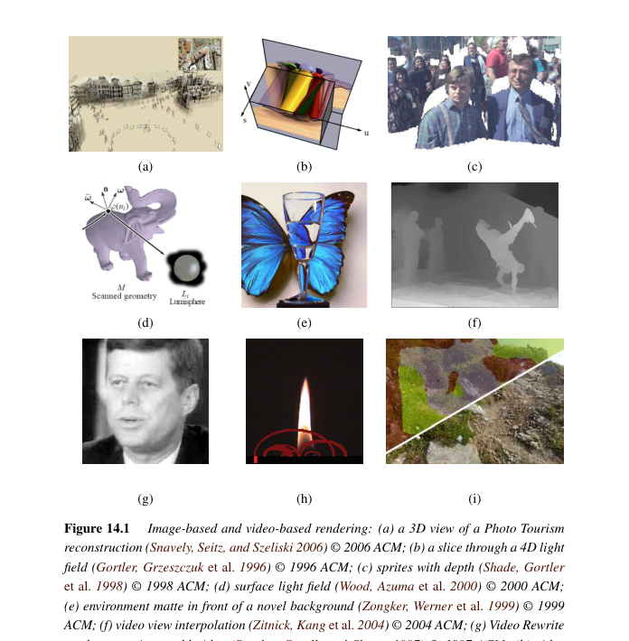
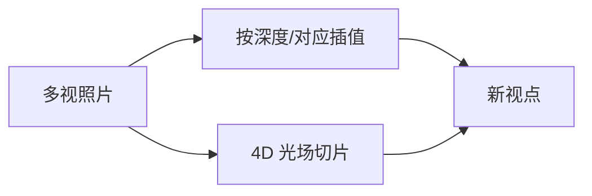
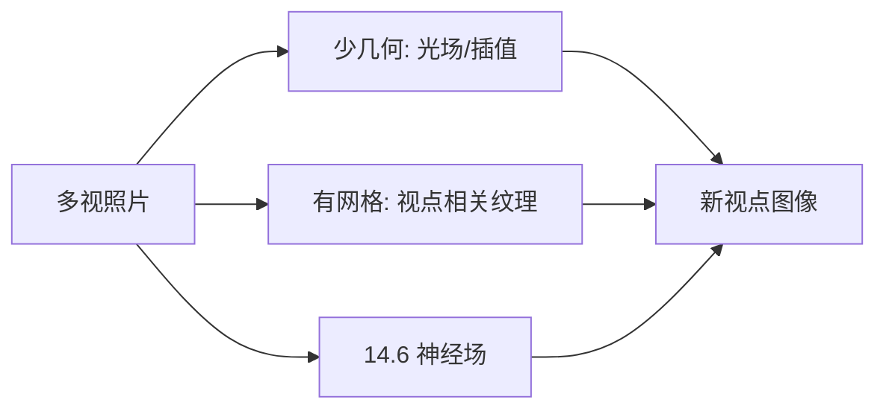

# 第14章 基于图像的绘制

来源：Szeliski《Computer Vision: Algorithms and Applications》第二版电子终稿第14章；书页 861–914 / PDF 887–940。分两批局部阅读。未越界第15章。绘制与光场建立在第12、13章几何上；**神经绘制只在 14.6 节展开**，不是独立第15章。

## 本章总览

有了相机和几何（或至少很多张图），可以不建完整多边形场景就画出新视点：视点插值、分层深度、光场、环境蒙版、基于视频的漫游，以及 14.6 的神经绘制。

一端是「几乎不建模型、直接插像素」，另一端是「先建网格再贴视点相关纹理」。书把它叫建模–绘制连续谱。第15章只收束，不新开算法。

## 核心知识点

### 视点插值与 Photo Tourism

两张已标定图之间，按光流或深度把像素挪到中间相机。视点相关纹理：同一网格从不同照片取样，随视点混。Photo Tourism（照片旅游）用互联网 SfM 点云当导航骨架，在照片之间飞。几何来自第11–13章。

👉 SfM 稀疏重建完整深度讲解见第11章。

🔑 关键速记：插值视点 = 有深度或对应的像素重投影，不是再渲染光线。

📚 基础补充：【视点插值与光场】

- 是什么：视点插值(view interpolation)在已有照片之间「假装」有一台新相机，把像素按深度或对应关系挪过去。光场(light field)把空间中各个方向的光线都记成一张 4D 表，新视点就是从表里切片，不必先建完整网格。
- 为什么要用它：真实感全局光照很难重算。有足够多照片时，直接借像素往往比重建材质再打光更像真的。
- 直观理解：插值像两张明信片中间溶解，但要用深度决定谁挡谁，否则会重影。光场像一堆从不同位置透过窗户看风景的照片；你的眼睛换个位置，等于换一组光线。采样不够会出现空洞或模糊。Lumigraph 加一个粗糙几何代理，采样可以稀一点。合成重对焦是对光场里一束光线做积分，相当于事后改光圈。

图注：少几何走光场或对应插值；有网格则贴视点相关纹理。存储和采样密度是光场的代价。

- 和本章的关系：Photo Tourism 用稀疏点当导航骨架再在照片间飞。光场/Lumigraph 是「几乎不建模型」的一端。

🔑 关键速记：新视点可以挪像素或切光场，不一定要先建完整多边形场景。

### 分层深度与精灵

分层深度图(LDI)每个像素存多层颜色+深度，能露出后面的洞。精灵/ impostor 用带深度的广告牌近似远景。三维摄影：拍一圈或一深度相机，做成可微微转头的照片。

🔑 关键速记：一层深度不够看遮挡后面，LDI 预存多层。

📚 基础补充：【深度图像与分层渲染】

- 是什么：深度图像(depth image)是普通照片外加每个像素的距离，也叫 2.5D——看得见的正面有深度，背面没有。分层渲染(layered rendering)把场景拆成几层精灵或分层深度图(LDI)，每层自带颜色和深度，转动视点时后面的层可以从缝里露出来。
- 为什么要用它：单层深度图一转头，遮挡后面就是洞。预先存多层或用广告牌(impostor)近似远景，比完整网格便宜，又比纯 2D 溶解真实。
- 直观理解：舞台布景：前景人、中景家具、远景墙是三块板。头微微一歪，板与板错开，露出后面。LDI 把「同一像素后面还有什么」也存下来，洞更少。精灵是带纹理的薄片，适合远处重复的树或建筑。

- 和本章的关系：三维摄影、微动视差照片走这条。要大范围自由走还是得光场、网格或 14.6 神经场。

🔑 关键速记：深度图只有正面；分层/LDI 预留后面，转头才不容易露洞。

### 光场与 Lumigraph

光场把穿过两平面的光线参数化成 4D，新视点就是切片。Lumigraph 用几何代理改善采样。非结构化 Lumigraph 吃不规则相机。表面光场把辐射绑在网格上。同心镶嵌用转圈相机降维。合成重对焦：光场积分相当于改光圈。环境蒙版记录透明/反射物体怎么弯折背景，是更高维的光。

第4章 pull-push 最初就是为 Lumigraph 缺测插值。

👉 pull-push 完整深度讲解见第4章。

🔑 关键速记：光场是 4D 光线表；重对焦是对光线积分，不是再拍一张。

### 基于视频的绘制

视频纹理：找相似帧跳转，让火、水、旗子无限循环。动画照片：让静图局部动。自由视点视频：多相机同步再插。漫游：预录路径或光场走廊。时间维加上就比静态 IBR 更重。

🔑 关键速记：视频纹理靠帧间相似跳，不是物理模拟。

### 14.6 神经绘制

用网络代替或补光场/几何：神经辐射场、图像平移、从稀疏视点学插值。条件批归一化、感知损失、GAN 判别器都是第5章工具，**应用和体积渲染细节在本节，不提前到第5章**。手机 AR 遮挡、新视点合成是落地方向。书稿 2021，具体网络名单以正文为准，笔记不编造后出的模型名。

👉 生成模型与损失完整深度讲解见第5章。

🔑 关键速记：神经绘制是 IBR 的可学习一端，仍是第14章，不是第15章。

## 易混淆点&差异对比

| 名称 | 功能 | 主要参数 | 约束&坑点 |
| --- | --- | --- | --- |
| IBR vs 图形学渲染 | 从照片插 / 从材质打光 | 是否要 BRDF | IBR 难换光照 |
| 光场 vs 深度插值 | 4D 光线 / 2.5D 重投影 | 采样密度 | 光场存储大，深度有遮挡洞 |
| 视频纹理 vs 光流插帧 | 跳相似帧 / 半程扭曲 | — | 纹理不保证物理时间连续 |
| 14.6 vs 第5章 | 绘制任务 / 网络工具 | — | 不要把 NeRF 写进第5章笔记当专章 |
| 第14 vs 第15章 | IBR+神经绘制 / 结语 | — | 第15章无算法节 |

🔑 关键速记：问的是新视点还是新光照；神经绘制属于本章 14.6。

## 本章要点总结

- 视点插值、视点相关纹理、Photo Tourism。
- LDI/精灵；光场、Lumigraph、重对焦、环境蒙版。
- 视频纹理与自由视点视频。
- 神经绘制只在 14.6；第15章不展开。

【信息缺口，需要局部查阅文档】14.6 正文点名的具体网络与公式未逐条抄出（2021 终稿，避免用后出名称填）。
