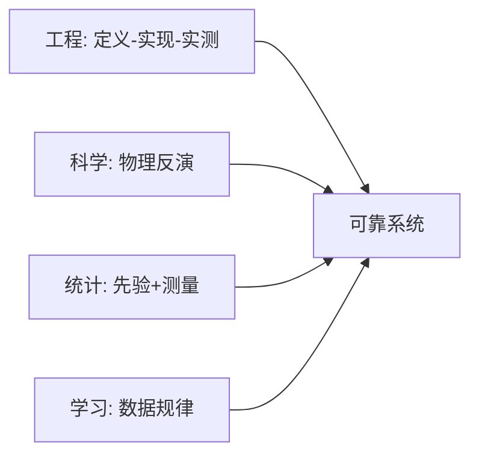

# 第15章 结语

来源：Szeliski《Computer Vision: Algorithms and Applications》第二版电子终稿第15章；书页 915–918 / PDF 941–944。一次读完。目录无细分节，不新开算法。未读参考文献。

## 本章总览

全书从几何与光学、图像处理、优化、统计与学习，走到增强、分割、识别、运动和三维，再落到检索、描述、拼接、HDR、跟踪、导航和 AR。第一版以来变化最大的是深度学习：识别明显超过十年前，增强、运动和三维也普遍接入网络。实时跟踪与重建撑起导航和手机 AR；计算摄影进了每部手机。

本章只收束原则与展望，公式和算子都在前面各章。

## 核心知识点

### 领域为什么这么宽

视觉的定义是：用图像和视频捕获、分析、解释三维环境。成像本身极复杂，所以像汽车工程一样要同时懂物理、机构、气动、人机、电路和控制。一学期讲不完，研究生也难「精通全书」；广度本身就是吸引力。

🔑 关键速记：视觉宽，是因为三维世界和成像链路都复杂，不是教材没剪裁。

### 四种原则再叮嘱一遍

工程：先问清问题和假设，实现多种方案，看可靠性和代价，再放到真实环境评。所以书里同一问题常给几条路，习题让你自己测。

科学：从结构、光照、大气、光学、噪声传感器的物理出发，稳定地反演场景。也鼓励提假说再检验。

统计：成像不确定，要建噪声和先验，贝叶斯把两者合起来，并给不确定度。动态规划、图割、置信传播是常用推断。

学习：用大量有标或无标数据抓难写进公式的规律。但不要把失败都推给「数据不够或有偏」，那不是别人的问题。

Nayar「视觉第一性原理」课：能用简洁原理写清的现象，不必硬训网；网不好用时，原理是唯一的诊断；数据难采时，用原理合成；更根本的是好奇「为什么这样」。

👉 四种思路在第1章已定位；优化见第4章，学习见第5章，贝叶斯公式见附录 B。

🔑 关键速记：工程测、科学反演、统计建不确定、学习抓规律；网替代不了第一性原理。

### 展望（以 2021 终稿为准）

学习会继续，包括为连续指标微调结构。当时占主导的前馈卷积（线性加权 + 简单非线性）会走向注意力和自上而下反馈——书说已经开始看到。专用成像传感器会更多，不只是摄影用的可见光；IMU 和（功耗允许时的）主动传感会让定位和三维更稳。最难的仍在通用人工智能，要和其他 AI 能力互相借力。

已经落地的方向：数字摄影、视效、医学、安全监控、以图搜图、商品推荐、视障辅助。

🔑 关键速记：2021 年的展望是更深的学习、更多传感器融合；AGI 仍最难。

## 易混淆点&差异对比

| 名称 | 功能 | 主要参数 | 约束&坑点 |
| --- | --- | --- | --- |
| 第15章 vs 第14.6节 | 收束 / 神经绘制算法 | — | 神经绘制不是第15章 |
| 四种原则 vs 四种网络 | 解题态度 / 模型结构 | — | 不要把「统计」理解成只等于 softmax |
| 学习 vs 第一性原理 | 数据拟合 / 可写清的物理 | — | 能写清就不必训网硬背 |

🔑 关键速记：结语没有新算子；神经绘制在第14.6节。

## 本章要点总结

- 十年变化：深度识别、计算摄影进手机、SLAM/AR 实用化。
- 继续用工程、科学、统计、学习四条绳，并对学习保持谨慎。
- 未来（书稿时）：注意力与反馈、专用传感器、与其他 AI 模态结合。
- 参考文献与索引不写笔记。

【信息缺口，需要局部查阅文档】无；本章本身无公式表。
