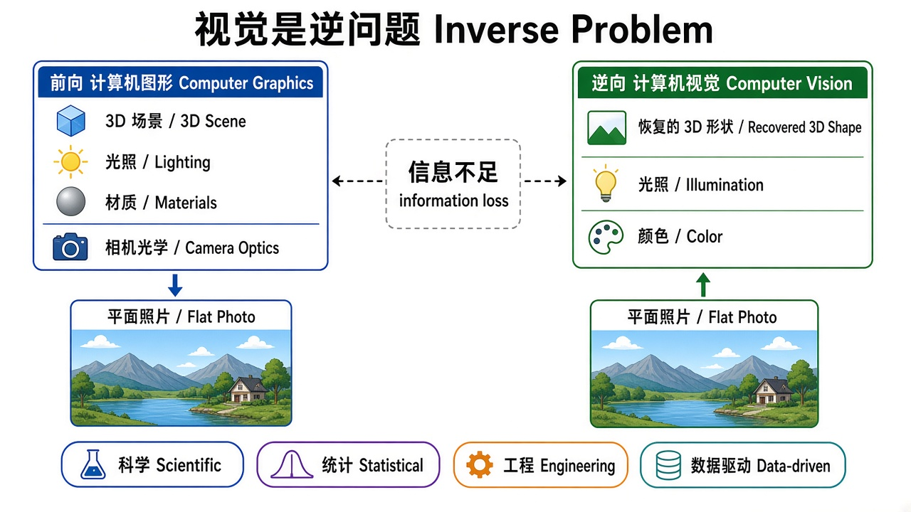
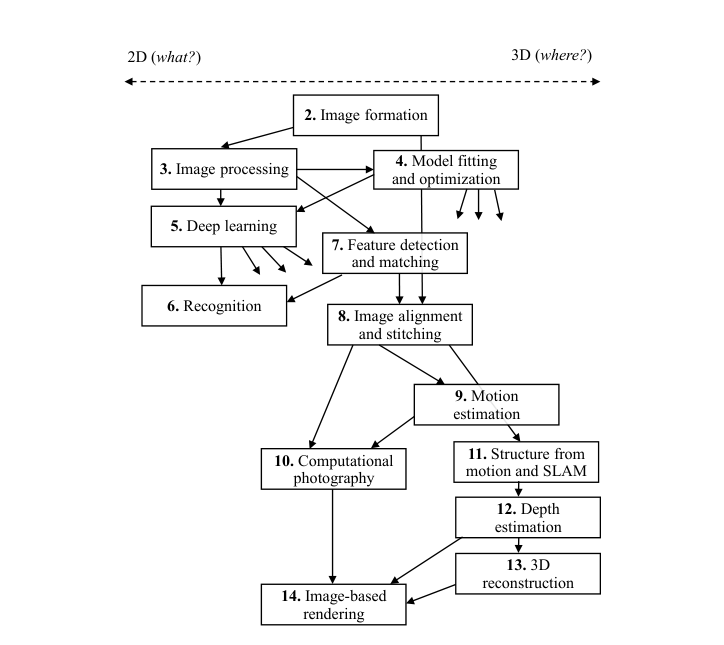

# 第1章 绪论

来源：Szeliski《Computer Vision: Algorithms and Applications》第二版电子终稿（2021-09-30）第1章；书页 1–32 / PDF 27–58。未越界第2章（书页 33 / PDF 59 起）。

## 本章总览

这一章先回答三件事：计算机视觉在干什么、为什么难、这本书后面怎么读。

视觉对人类几乎是自动的：看一瓶花就能判断花瓣形状、半透明和前后关系。对机器来说，要从一张或几张图反推三维形状、光照和颜色，信息往往不够，所以它是**逆问题(inverse problem)**。

后文算法细节本章只定位，不展开。学完应能说清：视觉相对图像处理多了什么、四种解题思路怎么配合、全书章节怎样按「图像侧 / 三维侧」排、记号约定是什么。

## 核心知识点

### 什么是计算机视觉

#### 人看世界几乎不费力，机器要数学化同一件事

人能从明暗读出花瓣的形状和半透明，也能从合影里数人、认人、猜表情。知觉心理学用错觉拆原理，但完整解释仍未完成；书中指向 Marr、Wandell、Palmer、Livingstone、Frisby 与 Stone 等著作。

计算机视觉并行发展的是：从影像里恢复物体的三维形状和外观。近二十年进展很快：上千张部分重叠照片可以算出环境的三维模型；足够多视角可以用立体匹配做出稠密表面；照片里多数人或物体也能大致勾出来。但要计算机像两岁孩子那样解释因果，仍然做不到。

🔑 关键速记：视觉要从图里恢复三维形状和外观，人轻松，机器仍远未「看懂」。

#### 视觉是逆问题

难，首先因为它是逆问题：未知量多，观测不够唯一确定解。于是必须靠物理/概率模型，或从大量例子里学习，才能在多个可能解里做取舍。视觉世界的复杂度，远高于给发声器官建模。

前向模型多半来自物理（辐射度、光学、传感器）和计算机图形学：物体怎么动、光怎么反射、大气怎么散射、镜头怎么折射，最后投到像平面。图形学在不少静态日常场景里已经能「看起来像真的」。视觉做的是反过来：从一张或多张图描述世界，重建形状、光照和颜色分布。

早期人工智能曾以为「知觉比推理容易」。这个误判本身就说明：没做过的人容易低估视觉。

🔑 关键速记：图形学前向成像，视觉反向恢复；观测不够，必须加模型或数据。

#### 工业与消费应用（本章只列用途，算法见后文）

工业侧书中列出：

- 光学字符识别(OCR)与车牌识别(ANPR)
- 机器检测：立体+专用光照测公差，或 X 光找铸件缺陷
- 零售自动结账与无人店
- 仓储物流：运货、码垛、机械臂拣货
- 医学影像配准与脑形态长期跟踪
- 自动驾驶与自主飞行
- 摄影测量：航拍/无人机自动建三维
- 影视匹配移动(match move)：跟特征点估相机与场景，再把 CGI 嵌进实拍，常还要精确抠图
- 动作捕捉(mocap)
- 监控、指纹与生物识别

消费侧更贴近个人照片视频：拼接全景、包围曝光合成、变形、三维建模、视频稳像与匹配移动、照片漫游、人脸检测对焦、家庭成员视觉登录。这些题目学生立刻用得上，也方便从需求倒推方法，而不是先抓一个听说过的算法。

后文对应关系（本章不展开算法）：拼接见第8.2节，包围曝光见第10.2节，变形见第3.6.3节，人脸/人体三维见第13.6节，匹配移动见第11.4.4节，稳像见第9.2.1节，照片漫游见第14.1.2与14.5.5节，人脸检测见第6.3.1节，人脸认证见第6.2.4节。

👉 完整深度讲解见第6、8、9、10、11、13、14章。

🔑 关键速记：先把问题定义清楚，再用真实数据选「能干活」的算法。

#### 四种思路要叠着用

书把解题习惯收成四条，后面各章都会反复出现：

1. **科学(scientific)**：把成像过程建成可反演的物理模型，必要时做可算的简化。
2. **统计(statistical)**：用先验和噪声观测建模，做贝叶斯推断并报告不确定性。关联附录 B。
3. **工程(engineering)**：选简单、可实现、实践里稳的算法，测失效模式和耗时。
4. **数据驱动(data-driven)**：用有标签或可核对的数据调参、学习或验收；机器学习尤其要代表性、无偏、量够的训练数据。

测试策略也写死了三步：先干净合成数据核对正确性，再加噪声看退化，最后用网上那种杂的真实图验收。只在几张「看起来像样」的图上成功，不算过关。

🔑 关键速记：模型、概率、能落地的算法、够用的数据，四条一起用。

### 简史：从积木世界到深度学习

书强调这是作者个人视角，只记「站得住」的主线。不关心谁先发明的读者可以直接跳到 1.3。

#### 1970 年代：视觉被当成「给机器人接摄像头」

早期人工智能和机器人圈子（MIT、Stanford、CMU）一度觉得「看」只是更高层推理之前的小台阶。1966 年的著名故事是：Minsky 让本科生 Sussman「花一个夏天把相机接到计算机上，让它描述看见了什么」。实际 Vision Memo 由 Papert 执笔，参与的是一群学生。现在知道这件事难得多。

和当时已有的数字图像处理不同，计算机视觉从一开始就想恢复三维结构，再走向场景理解。早期路子包括：抽边缘，再从二维线段拓扑推断积木世界的三维；线标记算法；广义圆柱与图画结构；内在图像(intrinsic images)和 Marr 的 2½-D 草图；特征立体与基于亮度的光流；同时恢复三维结构与相机运动。

Marr（1982）把视觉信息处理分成三层，书按作者理解转述为：

- **计算理论**：任务目标是什么，能用哪些约束。
- **表示与算法**：输入、中间量和输出怎么表示，用什么算法算。
- **硬件实现**：怎么映射到生物视觉或专用芯片；反过来，硬件约束如何反过来选表示和算法。GPU 与众核让这一层再次变得实际。

作者的立场是：成像与先验的科学/统计约束，必须配上稳健高效的工程算法。Marr 这套今天仍能当框架用。

🔑 关键速记：1970s 要的是三维结构，不只是滤波；Marr 三层仍是提问清单。

#### 1980 年代：定量化、金字塔、正则与 MRF

图像金字塔广泛用于融合和由粗到精的对应；尺度空间与小波随后补上或替换部分金字塔。立体之外出现一批 Shape-from-X：明暗、光度立体、纹理、聚焦。边缘与蛇模型(snakes)等动态轮廓，以及基于物理的三维模型，都在这时活跃。

人们发现立体、光流、Shape-from-X、边缘检测，很多可以写成变分优化，再用正则化把问题摆稳。Geman 与 Geman（1984）指出同样问题也能写成离散马尔可夫随机场(MRF)，从而用模拟退火一类全局搜索。稍后出现用卡尔曼滤波在线更新不确定度的 MRF 变体，也有人尝试映射到并行硬件。三维距离数据的采集、融合、建模和识别继续推进。

👉 金字塔与小波的完整讲法见第3章；正则与 MRF 见第4章；Shape-from-X 见第13章；蛇模型见第7章。

🔑 关键速记：1980s 把一批视觉问题收成「能量 + 正则 / MRF」。

#### 1990 年代：运动恢复结构、物理视觉、与图形学交叉

射影不变量推动运动恢复结构(SfM)：先做不必先标定的射影重建，再有正交近似下的分解法，后来接到与摄影测量相同的光束法平差。稠密立体的突破之一是图割全局优化；多视立体、剪影体、遮挡轮廓跟踪、主动轮廓/粒子滤波/水平集、人脸与人体跟踪、能量/MDL/归一化割/均值漂移分割，都在这十年变厚。统计学习开始露面，例如特征脸。

最显眼的变化是与计算机图形学的互动：图像变形、视点插值、全景拼接、光场绘制，以及从照片自动建真实感三维模型。这些后来很多被叫成基于图像的建模与绘制。

👉 SfM 与光束法平差见第11章；稠密立体见图割相关的第12章；拼接见第8章；光场与绘制见第14章。

🔑 关键速记：1990s 把几何重建做全局，并和图形学合成了「用照片做新图/新三维」。

#### 2000 年代：计算摄影、特征识别、更强的全局优化

拼接、光场、包围曝光 HDR 被重新叫成计算摄影。HDR 普及倒逼出色调映射；闪光/非闪光融合、从重叠图里挑区域、纹理合成与修补也都归到这条线上。

识别侧出现特征 + 学习：星座模型、图画结构、场景识别、全景与位置识别；也有人走轮廓或区域。全局优化更实用：图割之外，还有循环信念传播等消息传递。机器学习开始渗透几乎所有视觉题目，背景是网上半标注数据变多、算力变强。

🔑 关键速记：2000s 日常摄影算法产品化，识别靠特征，优化能算更大的图。

#### 2010 年代：大数据集 + GPU + 深度网络

带标注的大规模数据（ImageNet、COCO、LVIS）让识别和语义分割可以整条用学习做完，也提供了可比的指标。GPGPU 让 Krizhevsky、Sutskever 与 Hinton（2012）的 SuperVision（AlexNet）拿下 ImageNet，之后卷积网络几乎成为识别和语义分割的默认，也变成光流、去噪、单目深度等任务的优先结构。

arXiv、深度学习框架和开源模型加速扩散。识别被扩到视频动作、实时多人姿态。Kinect 一度变成三维建模和人体跟踪的标配；十年末已经能从单张图推断带表情和手势的人体三维。手机上的拼接、HDR、多帧弱光去噪、光场浅景深成为常见功能；移动增强现实用特征跟踪加惯性测姿态，并开始做像素级深度遮挡。车和无人机上，SLAM 与视觉惯性里程计(VIO)能实时建图，例如林间自主飞行。

书的十年小结：性能和可靠性的跃迁，很大一块来自「在大量真实数据上学习」；落地变广，也带来新的使用伦理与社会问题（指向 Su 与 Crandall 2021）。

👉 网络结构见第5章，识别任务见第6章，SLAM/VIO 见第11章。该细节原书在导论里只点名，暂不展开算法。

🔑 关键速记：2010s 默认路线变成大数据 + GPU + 深度网络，几何与摄影算法同时进了消费和机器人平台。

### 全书导览与怎么用这本书

#### 章节可以跳着读，但有依赖

视觉从图像走到语义理解和三维结构，两头并不总要一起学。例如可以先学几何成像和三维恢复，后读反射与明暗。图 1.12 把各章按「更靠近图像 / 更靠近三维」左右摆，再按依赖上下摆。顶上的 what–where 只是借用人类视觉腹背通路的说法，书提醒不要太当真。优化和深度学习是后面多数章的底座。

各章在导论里的定位（只记地图，算法留给对应章）：

| 章 | 导论里怎么说 |
| --- | --- |
| 2 图像形成 | 几何投影与畸变、光度与光学、传感器（采样/混叠、颜色、机内压缩）。想先写代码的课可以后读 |
| 3 图像处理 | 线性/非线性滤波、傅里叶、金字塔与小波、几何变换；应用含无缝融合与变形 |
| 4 拟合与优化 | 插值为正则和 MRF 提供框架；正则仍常用于要速度的移动 AR；MRF 也是附录 B 贝叶斯的引子 |
| 5 深度学习 | 第二版全新章：监督、无监督、前馈要素、卷积、更复杂网络。后续识别等不再必须先手搭中间表示 |
| 6 识别 | 从书末前移。实例、整图分类与人脸、检测、语义/实例/全景分割与姿态、视频理解、视觉与语言 |
| 7 特征 | 点、边、直线、轮廓跟踪、底层分割。第8、11章和实例识别都要用 |
| 8 对齐与拼接 | 特征对齐、稳健回归；全景、白板扫描、视频摘要、360°、交互蒙太奇。适合作为期中大作业把前面技术串起来 |
| 9 运动估计 | 从平移、参数、样条一直到光流、分层与视频分割跟踪 |
| 10 计算摄影 | 成像标定、HDR、超分去模糊、编辑合成、纹理/修补、风格迁移 |
| 11 SfM 与 SLAM | 内参/位姿/三角化、两帧与多帧 SfM、互联网照片稀疏重建、SLAM 与导航/AR |
| 12 深度估计 | 已知相机下的立体、多视表面、单目深度；应用含头部注视与 Z-keying |
| 13 三维重建 | Shape-from-X、主动测距、表面/点/隐式表示、建筑/人脸/人体、外观与 BRDF |
| 14 基于图像的绘制 | 视点插值、分层深度、光场、环境蒙版、视频绘制，以及新兴的神经绘制 |
| 附录 A/B/C | 线性代数与数值、贝叶斯、数据/软件/课件 |

练习分书面作业、一周小项目和开放研究题。作者建议：语言不限时，用 Python + NumPy + OpenCV，阵列写法也给以后的 PyTorch 打底；课堂可用 Jupyter，也提到 Google Colab。这本书当参考书用时，重点是讲清「实践里什么好使」，并指向新文献；自己实现并验证过的小库，长期比只会调不理解的库更值。

👉 各章算法完整讲解见对应章节；附录公式见附录 A/B，数据与课件清单见附录 C。

🔑 关键速记：先看图 1.12 的左右（图像 vs 三维）和上下（依赖），再按课的项目挑章，不必从头硬读到尾。

#### 示例课表

教完全书在一学期里不现实，也不值得硬教完。应按教师重点和项目来挑。作者与 Steve Seitz 用过类似表 1.1 的 10 周课表，本科少数学、多复习，研究生假定已有视觉或相关数学。三维摄影、计算摄影也可以单独开课。Stanford、Berkeley、密歇根等校已把材料拆成两门课。

表 1.1（13 周学期样例；10 周学期可减深度或删主题）：

| 周 | 章 | 主题 |
| --- | --- | --- |
| 1 | 1–2 | 绪论与图像形成 |
| 2 | 3 | 图像处理 |
| 3 | 4–5 | 优化与学习 |
| 4 | 5 | 深度学习 |
| 5 | 6 | 识别 |
| 6 | 7 | 特征检测与匹配 |
| 7 | 8 | 图像对齐与拼接 |
| 8 | 9 | 运动估计 |
| 9 | 10 | 计算摄影 |
| 10 | 11 | 运动恢复结构 |
| 11 | 12 | 深度估计 |
| 12 | 13 | 三维重建 |
| 13 | 14 | 基于图像的绘制 |

他们更愿意前期多给编程小作业，让作业互相承接（例如先做特征匹配，再做拼接；或用光流对齐，把力气放在图割接缝或多分辨率融合）。期中前提最终项目，最后一周展示；有的作业后来变成会议投稿。无论怎么用书，作者都建议至少做几个小实验，最好拿自己的照片，并主动去试会失败的情况。

🔑 关键速记：课表是菜单不是清单；小作业串起来，比一次讲完全书有用。

### 记号约定

视觉和多视几何教材记号很乱。本书沿用作者中学物理、多元微积分和图形学里的习惯：

- 向量 $\mathbf{v}$：小写粗体，默认列向量，写在矩阵右边：$\mathbf{Mv}$
- 矩阵 $\mathbf{M}$：大写粗体
- 标量 $T$、$s$：斜体
- 有时把二维点写成 $(x,y)$，等价于 $[x\ y]^{\mathrm{T}}$
- 常见矩阵：$\mathbf{R}$ 旋转，$\mathbf{K}$ 标定，$\mathbf{I}$ 单位阵
- 齐次坐标（第2.1节）头顶波浪线：$\tilde{\mathbf{x}}=(\tilde{x},\tilde{y},\tilde{w})=\tilde{w}(x,y,1)=\tilde{w}\bar{\mathbf{x}}$，在 $\mathbb{P}^{2}$ 里。除以 $\tilde{w}$ 回到像素平面；$\tilde{w}=0$ 是无穷远点，没有普通 $(x,y)$。平面上的平移/旋转/单应都写成 $3\times 3$ 再作用于这个向量。
- 叉乘的矩阵形式写成 $[\ ]_{\times}$

👉 齐次坐标、2D/3D 变换族和相机矩阵 $\mathbf{K}$ 的完整讲法见第2章。

🔑 关键速记：粗体分大小写管向量/矩阵；齐次坐标加波浪线；向量按列去乘矩阵。

### 延伸阅读

本书尽量自洽，基础作业不必外找资料，但默认你对线性代数、数值方法和图像处理有常识，分别在附录 A 和第3章复习。

书中点名的外读书（只记门类，不抄书单当正文）：矩阵与线性代数（Golub & Van Loan，Strang）；图像处理（Gonzalez & Woods 等）；图形学（Hughes 等，Marschner & Shirley，Glassner 的成像与绘制）；统计与机器学习（Bishop、Murphy、Hastie 等）；深度学习（Glassner 入门，Goodfellow 等、Zhang 等更全）；其他视觉教材（Hartley & Zisserman、Forsyth & Ponce、Prince 等）。

没有替代读新论文。作者按子领域尽量引到较新的工作。建议翻近几年 CVPR / ECCV / ICCV / SIGGRAPH / NeurIPS，并盯 arXiv；会议教程的幻灯往往能当快速入口。Keith Price 的 Annotated Computer Vision Bibliography 被当作分类书目。

🔑 关键速记：作业先靠本书；要往深走就读附录、标准教材和当年会议。

## 易混淆点&差异对比

### 计算机视觉 vs 数字图像处理

图像处理改的是二维像素（增强、压缩、滤波）。视觉还要恢复三维结构，并把它当作场景理解的台阶。两者共享算子，目标不是同一层。

### 科学建模 vs 工程配方

书既不是只给菜谱，也不是只写优雅但不好算的式子。科学侧要把成像建准再反演；工程侧要在噪声和模型偏差下仍然稳、算得动。统计把未知量和观测都写成分布，方便说「有多不确定」。

### 第一版 vs 第二版的读法

第一版识别在书末，因为当时还依赖分割和特征。第二版有了端到端深度网络，中间表示可以由网络自己学，所以识别整章前移到第6章，深度学习单独成第5章。不要按「必须先特征再识别」的旧课表来理解这版目录。

### what 通路 vs where 通路

图 1.12 顶上的 what–where 只是类比人类视觉的腹侧/背侧通路，书明确说不要太当真。它只是帮你记：左偏「图上是什么」，右偏「三维在哪里」。

### 合成数据 vs 真实数据

合成数据用来验对错和噪声曲线；真实数据用来暴露模型假设之外的东西。机器学习还要防训练分布偏掉。只拿几张好看的结果图，书认为不够。

## 本章要点总结

- 计算机视觉要从影像恢复三维形状和外观；本质是信息不足的逆问题。
- 前向靠物理和图形学，反向靠模型、概率、能落地的算法和足够的数据。
- 应用从工业检测到手机摄影都有；本章只点名，算法按导论指针去后文。
- 简史主线：1970s 三维与 Marr 三层 → 1980s 定量优化 → 1990s SfM 与图形学交叉 → 2000s 计算摄影与特征识别 → 2010s 深度网络与实时 SLAM/VIO。
- 读这本书先看图 1.12 的依赖和左右分工；课表按项目裁剪。
- 记号：粗体向量/矩阵，齐次坐标加波浪线；公式细节从第2章和附录 A 补。
