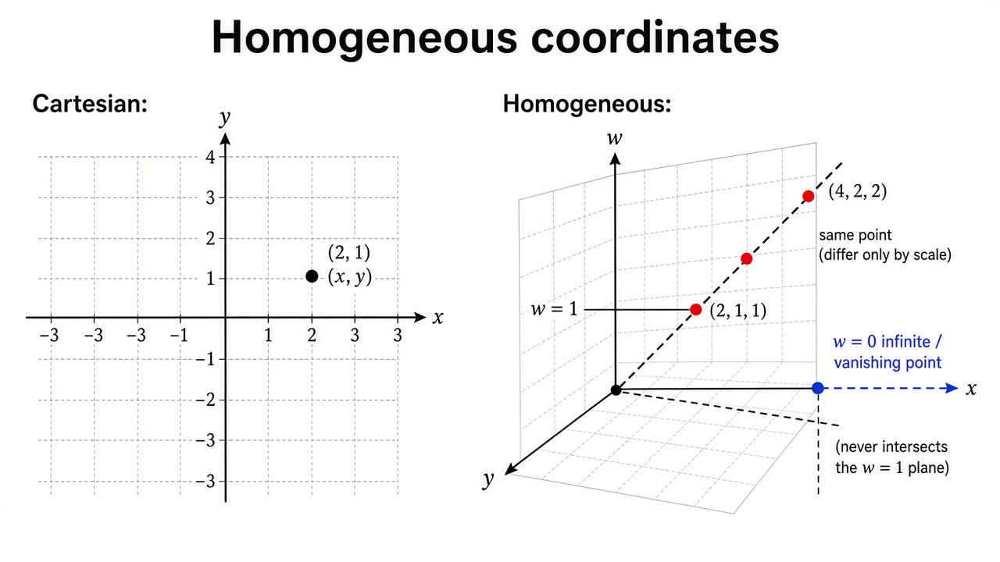
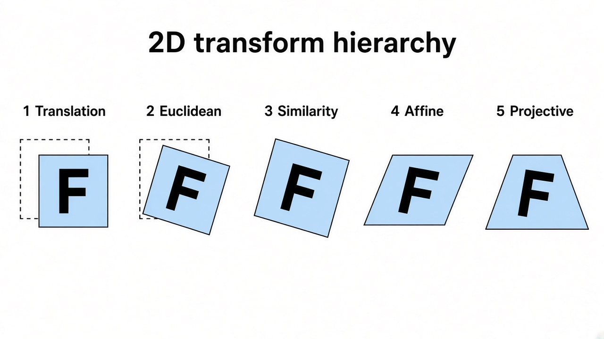
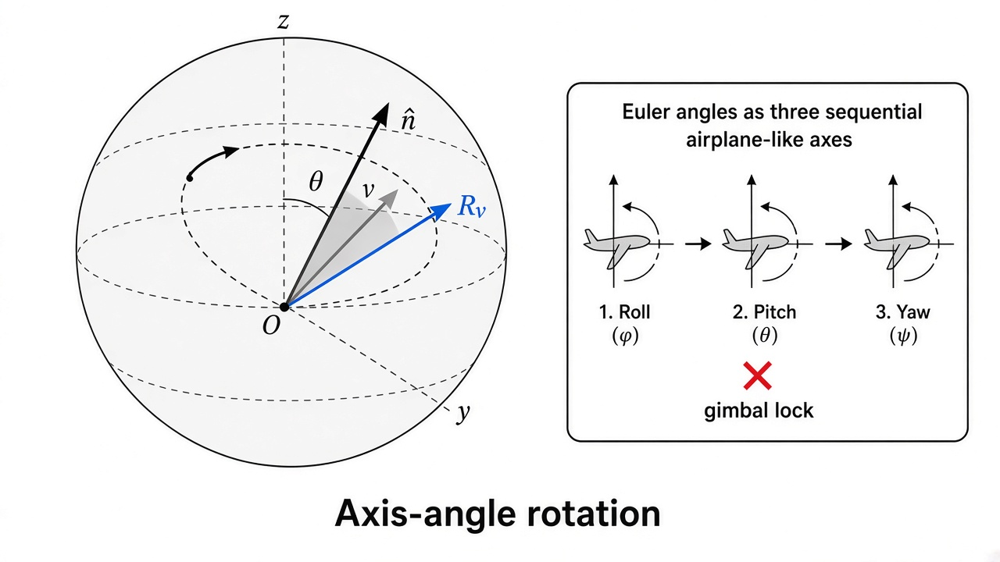
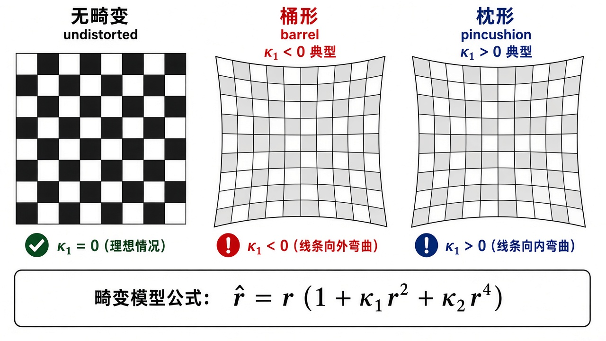
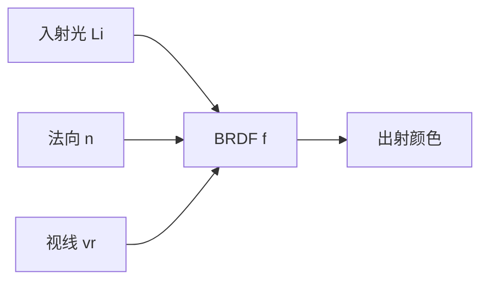

# 第2章 图像形成

来源：Szeliski《Computer Vision: Algorithms and Applications》第二版电子终稿第2章；书页 33–106 / PDF 59–132。按三批局部阅读（PDF 59–82 / 83–106 / 107–132）。未越界第3章（书页 107 / PDF 133 起）。习题 2.5 只作定位，不展开实现。

## 本章总览

分析图像之前，先要有一套说场景几何的词汇，并搞清一张图是怎么由光照、几何、表面和镜头「做」出来的。本章给的是简化成像模型，分三块：

1. **几何**：点、线、面，以及三维量如何投到二维（图 2.1a）。
2. **光度**：光照、表面、镜头如何变成落到传感器上的颜色（图 2.1b–c）。
3. **数字相机**：连续颜色如何变成离散样本，以及混叠怎么来的（图 2.1d，Bayer 阵列）。

学过图形学的人可以快翻 2.1，但射影深度和物体中心投影可能是新的；物理/图形学生多半熟 2.2；图像处理学生多半熟采样。曲线、表面、体分别留给第7/12、13.3、13.5节。标定求解留给第11章。

## 核心知识点

### 几何图元：点、线、面

📚 基础补充：【向量、矩阵与矩阵乘法的几何意义】

- 是什么：向量(vector)是带方向的箭头，在图像里就是「从原点指到某个像素或三维点」；矩阵(matrix)是一套线性规则，告诉你怎么把一根箭头变成另一根。矩阵乘向量，不是在做表格算术，而是在**同时转动、拉伸或切斜整套坐标轴**。
- 为什么要用它：相机位姿、图像扭曲、点到直线的距离，全书几乎都写成 $\mathbf{x}'=\mathbf{Ax}+\mathbf{t}$。没有矩阵，就只能逐坐标手写一堆三角函数，还不好链式复合。
- 直观理解：把平面上的点 $(1,0)$ 和 $(0,1)$ 想成两根单位尺子。矩阵的两列就是「尺子被拧成什么样」。例如 $\begin{bmatrix}2&0\\0&1\end{bmatrix}$ 把横轴拉长一倍、竖轴不动，正方形变成扁长方形。再乘一个旋转矩阵，就是先拉后转。两个矩阵相乘 $\mathbf{AB}$，几何上是「先做 $\mathbf{B}$，再做 $\mathbf{A}$」（列向量右乘约定，与第1章记号一致）。

图注：矩阵乘法从右往左作用；$\mathbf{AB}$ 表示先 $\mathbf{B}$ 后 $\mathbf{A}$。

- 和本章的关系：后面所有 2D/3D 变换、相机矩阵 $\mathbf{P}=\mathbf{K}[\mathbf{R}\mid\mathbf{t}]$，都是矩阵乘法的几何应用。看懂「矩阵 = 对坐标轴的操作」，后面的自由度表才不是死记。

🔑 关键速记：矩阵的列 = 原坐标轴被映射到哪里；乘法从右往左做变换。

#### 二维点与齐次坐标

像素坐标写成 $\mathbf{x}=(x,y)\in\mathbb{R}^{2}$，或列向量。也可用齐次坐标 $\tilde{\mathbf{x}}=(\tilde{x},\tilde{y},\tilde{w})\in\mathbb{P}^{2}$，只差尺度的向量算同一个点。$\mathbb{P}^{2}=\mathbb{R}^{3}\setminus\{(0,0,0)\}$。

转回非齐次：除以最后一项，

$$
\tilde{\mathbf{x}}=(\tilde{x},\tilde{y},\tilde{w})=\tilde{w}(x,y,1)=\tilde{w}\bar{\mathbf{x}}.
\tag{2.2}
$$

$\tilde{w}=0$ 的点叫理想点或无穷远点，没有非齐次对应。

📚 基础补充：【齐次坐标】

- 是什么：齐次坐标(homogeneous coordinates)是给普通点多补一维，写成 $(\tilde{x},\tilde{y},\tilde{w})$。真正的像素位置是除以最后一项：$x=\tilde{x}/\tilde{w}$，$y=\tilde{y}/\tilde{w}$。可以把它想成「用三维空间里的一条射线」来表示二维平面上的一个点。
- 为什么要用它：平移本来不是线性的（要加一个向量），补上 $w=1$ 之后，平移、旋转、透视除法都能写成一次矩阵乘法，还能把「平行线在画面上相交」那种无穷远点写进同一个公式。没有齐次，透视相机和单应都得分段写。
- 直观理解：普通点 $(2,1)$ 对应增广向量 $\bar{\mathbf{x}}=(2,1,1)$。$(4,2,2)$ 和 $(2,1,1)$ 在同一条从原点出发的射线上，除以 $w$ 后都回到 $(2,1)$，所以算同一个点。$w=0$ 的点，比如 $(1,0,0)$，永远除不出有限的 $(x,y)$，它表示「沿着 $x$ 方向走到无穷远」——铁路轨在地平线上交汇的那个灭点，就是这类理想点。

公式人话翻译：(2.2) 说的是「齐次向量 = $w$ 乘上普通坐标再补 1」。输入是像素 $(x,y)$，输出是可被矩阵右乘的 $\bar{\mathbf{x}}$；反过来要把 $\tilde{w}$ 除掉才回到像素。

- 和本章的关系：点、直线、相机矩阵、畸变前后的透视除法，全部建立在「先齐次、再除以 $w$」上。后面表 2.1 的射影变换 $\tilde{\mathbf{H}}$ 也必须在齐次坐标里才是一个 $3\times 3$ 矩阵。

🔑 关键速记：补 1 变成齐次；除以 $w$ 变回像素；$w=0$ 是到不了的无穷远。

#### 二维直线与圆锥曲线

直线也用齐次 $\tilde{\boldsymbol{\ell}}=(a,b,c)$，方程 $\bar{\mathbf{x}}\cdot\tilde{\boldsymbol{\ell}}=ax+by+c=0$。可归一化成 $\boldsymbol{\ell}=(\hat{\mathbf{n}},d)$，$\|\hat{\mathbf{n}}\|=1$，$\hat{\mathbf{n}}$ 是法向，$d$ 是到原点距离。无穷远直线 $\tilde{\boldsymbol{\ell}}=(0,0,1)$ 不能这样归一化。

$\hat{\mathbf{n}}=(\cos\theta,\sin\theta)$ 就是极坐标 $(\theta,d)$，霍夫变换用这套，细节见第7.4.2节。

齐次坐标下：两直线交点 $\tilde{\mathbf{x}}=\tilde{\boldsymbol{\ell}}_{1}\times\tilde{\boldsymbol{\ell}}_{2}$；过两点的直线 $\tilde{\boldsymbol{\ell}}=\tilde{\mathbf{x}}_{1}\times\tilde{\mathbf{x}}_{2}$。多线求交或多点拟合直线用最小二乘，见第8.1.1节和附录 A.2。

圆锥曲线：$\tilde{\mathbf{x}}^{\mathrm{T}}\mathbf{Q}\tilde{\mathbf{x}}=0$。多视几何和标定里有用，本书用得不多。

🔑 关键速记：齐次坐标把点和无穷远点放在同一空间；直线交点和连线都是叉乘。

#### 三维点、平面、直线

三维点：$\mathbf{x}=(x,y,z)$ 或 $\tilde{\mathbf{x}}\in\mathbb{P}^{3}$，增广向量 $\bar{\mathbf{x}}=(x,y,z,1)$。

平面：$\tilde{\mathbf{m}}=(a,b,c,d)$，$ax+by+cz+d=0$。归一化后 $\mathbf{m}=(\hat{\mathbf{n}},d)$。无穷远平面 $(0,0,0,1)$ 不能归一化。法向也可用球坐标两个角，但不均匀，不如二维极坐标常用。

三维直线没有二维直线那么干净。可用两点 $\mathbf{p},\mathbf{q}$：

$$
\mathbf{r}=(1-\lambda)\mathbf{p}+\lambda\mathbf{q}.
\tag{2.9}
$$

$0\le\lambda\le 1$ 就是线段。第二点在无穷远时 $\mathbf{r}=\mathbf{p}+\lambda\hat{\mathbf{d}}$。两端点表示有 6 个自由度，真正的三维直线只有 4 个；把两端钉在两个平面上（例如近乎竖直线用 $z=0$ 和 $z=1$）就只剩 4 个参数。光场/Lumigraph 用这种双平面参数化表示射线，见第14章。

无偏表示可用 Plücker 坐标：反对称矩阵 $\mathbf{L}=\tilde{\mathbf{p}}\tilde{\mathbf{q}}^{\mathrm{T}}-\tilde{\mathbf{q}}\tilde{\mathbf{p}}^{\mathrm{T}}$，齐次且 $|\mathbf{L}|=0$，正好 4 个自由度。实践里多数情况知道方向再加可见段上一点，或直接用两端点就够。

三维二次曲面 $\bar{\mathbf{x}}^{\mathrm{T}}\mathbf{Q}\bar{\mathbf{x}}=0$，本书不深讲。

🔑 关键速记：三维直线真正只有 4 个自由度；两端点方便，Plücker 才是最小无偏表示。

### 二维与三维变换族

#### 二维：平移 → 欧氏 → 相似 → 仿射 → 射影

它们嵌套成群：复合封闭，逆还在同一族里。后面第3.6节对图像做几何变换时要用这件事。二维旋转和刚体在机器人文献里叫 $SO(2)$、$SE(2)$（special 表示 $\det\mathbf{R}=1$，不要反射）。

引导说明：表 2.1 按自由度从少到多排。每一行还继承它下面各行保住的几何量，例如相似不但保角，也保平行和共线。

| 名称 | 矩阵 | 自由度 | 保住什么 |
| --- | --- | --- | --- |
| 平移 | $[\mathbf{I}\ \mathbf{t}]$，$2\times 3$ | 2 | 方向 |
| 刚体/欧氏 | $[\mathbf{R}\ \mathbf{t}]$ | 3 | 长度 |
| 相似 | $[s\mathbf{R}\ \mathbf{t}]$ | 4 | 角度 |
| 仿射 | $\mathbf{A}$（任意 $2\times 3$） | 6 | 平行 |
| 射影/单应 | $\tilde{\mathbf{H}}$，$3\times 3$ 齐次 | 8 | 直线仍是直线 |

$2\times 3$ 要接一行 $[0^{\mathrm{T}}\ 1]$ 才变成可链式相乘的 $3\times 3$。射影变换后必须归一化：

$$
x'=\frac{h_{00}x+h_{01}y+h_{02}}{h_{20}x+h_{21}y+h_{22}},\quad
y'=\frac{h_{10}x+h_{11}y+h_{12}}{h_{20}x+h_{21}y+h_{22}}.
\tag{2.21}
$$

二维旋转 $\mathbf{R}=\begin{bmatrix}\cos\theta & -\sin\theta\\ \sin\theta & \cos\theta\end{bmatrix}$，满足 $\mathbf{R}\mathbf{R}^{\mathrm{T}}=\mathbf{I}$ 且 $|\mathbf{R}|=1$。

共向量（直线、法向）不跟点用同一个 $\tilde{\mathbf{H}}$：若 $\tilde{\mathbf{x}}'=\tilde{\mathbf{H}}\tilde{\mathbf{x}}$，则 $\tilde{\boldsymbol{\ell}}'=\tilde{\mathbf{H}}^{-\mathrm{T}}\tilde{\boldsymbol{\ell}}$。

表外还有：拉伸（改纵横比，不干净嵌进表 2.1）；平面小运动的 8 参数流（对单应的线性近似）；双线性插值（插正方形四角，一般不保斜线）。

要点：变换越自由，保住的几何量越少；单应是「还能保住直线」的最一般平面变换。

🔑 关键速记：2D 变换按自由度 2/3/4/6/8 往上加；点和线变换差一个转置逆。

📚 基础补充：【2D/3D 变换层级】

- 是什么：把平面（或空间）里的形状越来越「放开手脚」地拧，从只能平移，一直放到可以做透视。每一层都是上一层的超集，复合和求逆都不离开这一族，所以叫变换群。
- 为什么要用它：选错层级会要么不够灵活（拼图对不齐），要么太自由（噪声把正方形拧成任意四边形）。自由度就是「你有几个旋钮可以拧」：平移 2 个（$t_x,t_y$），加上转角变成欧氏 3，再加均匀缩放变成相似 4，仿射再放开切变和不等比缩放到 6，射影再放开「近大远小」到 8（$3\times 3$ 有 9 个数但整体可乘尺度，所以 8）。
- 直观理解：在纸上画一个带字母 F 的正方形——平移：整张纸挪位置；欧氏：再允许转一下，尺子量边长不变；相似：可以整体放大，角还是直角；仿射：正方形可以变成平行四边形，对边仍平行，圆变成椭圆；射影：变成梯形，平行线可以在画面上相交，但直边还是直的。

- 和本章的关系：表 2.1 / 2.2 就是这套层级。第3.6节对图像做几何变换、第8章拼图用单应，都是在选「这一层保什么、有几个未知数」。

🔑 关键速记：自由度上去，保住的量下来；单应是还保直线的最一般平面变换。

#### 三维：同样一套，自由度变成 3/6/7/12/15

刚体是 $SE(3)$：$\mathbf{x}'=\mathbf{Rx}+\mathbf{t}$。有时写成绕相机中心 $\mathbf{x}'=\mathbf{R}(\mathbf{x}-\mathbf{c})$。相似保线面夹角；仿射保平行；射影是 $4\times 4$ 齐次单应，仍保直线。$3\times 4$ 要补第四行 $[0^{\mathrm{T}}\ 1]$。

🔑 关键速记：3D 刚体 6 自由度（3 转 + 3 移）；旋转怎么参数化是下一小节的坑。

### 三维旋转：不要用欧拉角做通用表示

欧拉角是绕三个轴的旋转连乘。结果依赖次序；参数空间还不总是平滑（万向节锁）。除云台那种「本来就是单轴转」的情况，书甚至不给公式。

#### 轴角与罗德里格斯公式

转轴 $\hat{\mathbf{n}}$、转角 $\theta$，或 $\boldsymbol{\omega}=\theta\hat{\mathbf{n}}$。把 $\mathbf{v}$ 拆成平行和垂直分量，垂直分量再叉乘得到面内 $90^{\circ}$ 方向，得到 Rodrigues 公式：

$$
\mathbf{R}(\hat{\mathbf{n}},\theta)=\mathbf{I}+\sin\theta[\hat{\mathbf{n}}]_{\times}+(1-\cos\theta)[\hat{\mathbf{n}}]_{\times}^{2}.
\tag{2.34}
$$

叉乘矩阵

$$
[\hat{\mathbf{n}}]_{\times}=\begin{bmatrix}0 & -\hat{n}_{z} & \hat{n}_{y}\\ \hat{n}_{z} & 0 & -\hat{n}_{x}\\ -\hat{n}_{y} & \hat{n}_{x} & 0\end{bmatrix}.
\tag{2.32}
$$

$\boldsymbol{\omega}$ 是最小表示，但不是唯一的：$\theta$ 加 $360^{\circ}$ 相同；$(\hat{\mathbf{n}},\theta)$ 与 $(-\hat{\mathbf{n}},-\theta)$ 相同。小角度（弧度）时 $\mathbf{R}(\boldsymbol{\omega})\approx\mathbf{I}+[\boldsymbol{\omega}]_{\times}$，并且 $\mathbf{Rv}\approx\mathbf{v}+\boldsymbol{\omega}\times\mathbf{v}$，便于求导。有限角也等于指数扭转 $\mathbf{R}=\exp[\boldsymbol{\omega}]_{\times}$，泰勒展开回到同一条 Rodrigues 公式。旋转群是 $SO(3)$，增量 $\boldsymbol{\omega}$ 落在对应的李代数上，适合写导数和不确定度。

#### 单位四元数

$\mathbf{q}=(x,y,z,w)$，$\|\mathbf{q}\|=1$。对径点 $\mathbf{q}$ 与 $-\mathbf{q}$ 是同一旋转。由轴角：

$$
\mathbf{q}=(\sin(\theta/2)\,\hat{\mathbf{n}},\ \cos(\theta/2)).
\tag{2.39}
$$

对应旋转矩阵见书 (2.41)。四元数乘法 $\mathbf{q}_{0}\mathbf{q}_{1}$ 对应 $\mathbf{R}(\mathbf{q}_{0})\mathbf{R}(\mathbf{q}_{1})$，不交换。求逆：只翻 $\mathbf{v}$ 或只翻 $w$ 的符号（不要两个都翻）。球面线性插值(slerp)见算法 2.1：先算增量角，再按比例插。$\mathbf{q}_{0}$ 与 $\mathbf{q}_{1}$ 很近时作者更愿意用反正切定角。

怎么选：轴角最小、不必再归一化，度数量角好懂，弧度量好求导；四元数连续、好插值、好链式乘。作者习惯存四元数，更新时用增量旋转（第11.2.2节）。

👉 增量旋转用于位姿估计，完整讲解见第11章。

🔑 关键速记：通用旋转用轴角或四元数；欧拉角只留给真正的单轴机构。

📚 基础补充：【轴角与四元数】

- 是什么：三维旋转其实只需要「绕哪根轴转多少度」。轴角(axis-angle)把转轴 $\hat{\mathbf{n}}$ 和转角 $\theta$ 捆成一根向量 $\boldsymbol{\omega}=\theta\hat{\mathbf{n}}$；单位四元数(unit quaternion)用四个数 $(x,y,z,w)$ 表示同一个旋转，并保证 $\|\mathbf{q}\|=1$。
- 为什么要用它：欧拉角（绕 $x$ 再绕 $y$ 再绕 $z$）依赖次序，而且两个轴可能重合，出现万向节锁(gimbal lock)，优化时导数会炸。相机在空间里可以任意翻滚，不适合用云台式欧拉角当通用参数。
- 直观理解：地球自转：地轴是 $\hat{\mathbf{n}}$，转过的角度是 $\theta$。Rodrigues 公式 (2.34) 的人话是：把向量拆成「顺着轴」和「垂直于轴」两块，顺着轴的不动，垂直那块在垂直平面里转 $\theta$。四元数可以想成「半角版轴角」：$\mathbf{q}=(\sin(\theta/2)\hat{\mathbf{n}},\cos(\theta/2))$，好处是连续、好插值、两个旋转相乘就是四元数相乘。$\mathbf{q}$ 和 $-\mathbf{q}$ 是同一姿态，选最短路径插值时要注意。

公式人话翻译：(2.34) 输入转轴和转角，输出 $3\times 3$ 旋转矩阵 $\mathbf{R}$；小角度时 $\mathbf{Rv}\approx\mathbf{v}+\boldsymbol{\omega}\times\mathbf{v}$，就是「原向量再轻轻推一个切向增量」。

- 和本章的关系：相机外参里的 $\mathbf{R}$ 必须用这套来存和更新。作者习惯存四元数，用小轴角做增量（第11.2.2节），避免欧拉角的奇异。

🔑 关键速记：旋转 = 一根轴 + 一个角；四元数是它的连续包装，欧拉角只留给云台。

### 三维到二维：投影与相机矩阵

#### 正交、缩放正交、仿透视、透视

本节三维点用 $\mathbf{p}$，二维点用 $\mathbf{x}$。

- **正交**：丢掉 $z$，$\mathbf{x}=[\mathbf{I}_{2\times 2}\mid\mathbf{0}]\mathbf{p}$。只近似长焦、深度相对物距很浅的场景；对远心镜头才精确。
- **缩放正交**：$\mathbf{x}=[s\mathbf{I}_{2\times 2}\mid\mathbf{0}]\mathbf{p}$。先投到局部正对平面再透视缩放；$s$ 可按物体或按帧变，便于运动恢复结构。远物重建常用，位姿可用最小二乘，正交下可用分解（第11.4.1节）。
- **仿透视(para-perspective)**：先沿指向物体中心的视线平行投影到参考平面，再透视缩放，整体是仿射，平行线仍平行，比缩放正交准，又不必逐像素做透视除法。
- **透视**：除以深度，最常用，平行线会相交。

#### 内参 $\mathbf{K}$ 与相机矩阵 $\mathbf{P}$

完整相机 $\mathbf{P}=\mathbf{K}[\mathbf{R}\mid\mathbf{t}]$。$\mathbf{K}$ 取上三角；从一般 $3\times 4$ 可用 QR 分解抽出（线性代数里的 $\mathbf{R}$ 是上三角，和视觉里的旋转 $\mathbf{R}$ 撞名）。

一般形式：

$$
\mathbf{K}=\begin{bmatrix}f_{x} & s & c_{x}\\ 0 & f_{y} & c_{y}\\ 0 & 0 & 1\end{bmatrix}
\quad\text{或}\quad
\begin{bmatrix}f & s & c_{x}\\ 0 & af & c_{y}\\ 0 & 0 & 1\end{bmatrix}.
\tag{2.57--2.58}
$$

$s$ 是传感器轴不正交带来的倾斜。$(c_{x},c_{y})$ 是像素里的像主点；光学里的主点是镜头内部主面与光轴的交点，不是同一个词。实践里常令 $a=1$、$s=0$：

$$
\mathbf{K}=\begin{bmatrix}f & 0 & c_{x}\\ 0 & f & c_{y}\\ 0 & 0 & 1\end{bmatrix}.
\tag{2.59}
$$

再令 $(c_{x},c_{y})\approx(W/2,H/2)$，只剩一个未知数 $f$。书把像平面画在节点前面，并翻转 $y$ 以迁就常见图像库的行坐标。

![图注：针孔把三维点投到像平面；内参加上焦距 $f$ 和主点 $(c_x,c_y)$ 得到像素。整机 $\mathbf{P}=\mathbf{K}[\mathbf{R}\mid\mathbf{t}]$。](./assets/chapter02_pinhole_K.png)

焦距单位容易乱：像素坐标用整数 $[0,W)\times[0,H)$ 时，$f$ 和主点也是像素。和摄影口里的毫米焦距靠视场连：

$$
\tan(\theta_{H}/2)=W/(2f),\qquad f=(W/2)\big[\tan(\theta_{H}/2)\big]^{-1}.
\tag{2.60}
$$

35mm 底片有效曝光约 $24\times 36\,\mathrm{mm}$，宽 $W=36\,\mathrm{mm}$，所以 $f$ 用毫米；50mm 是套头，85mm 常作人像。数字图更方便让 $W$ 用像素，直接进 $\mathbf{K}$。

另一种做法是改到修正的归一化设备坐标：长边映射到 $[-1,1)$，$S=\max(W,H)$，这样 $f$ 和主点不跟分辨率绑死，金字塔里更好用；横竖构图焦距一致。此时无量纲 $f^{-1}=\tan(\theta_{H}/2)$。换算：无量纲 $f$ 乘 $W/2$ 变像素；像素 $f$ 乘 $18\,\mathrm{mm}$ 约成 35mm 等效。

拼起来：

$$
\mathbf{P}=\mathbf{K}[\mathbf{R}\mid\mathbf{t}].
\tag{2.63}
$$

需要可逆 $4\times 4$ 时不丢掉最后一行，写成 $\tilde{\mathbf{P}}=\tilde{\mathbf{K}}\mathbf{E}$。书还讨论逆深度（视差）和相对参考平面的射影深度，以及物体中心投影，用来把长焦极限接到正交分解（第11.4.1节）。标定怎么求留给第11.1节。

👉 内参、畸变和位姿的求解见第11章。

🔑 关键速记：日常模型就是 $\mathbf{P}=\mathbf{K}[\mathbf{R}\mid\mathbf{t}]$，$\mathbf{K}$ 里往往只认真估一个像素焦距 $f$。

📚 基础补充：【针孔相机、焦距、视场、主点】

- 是什么：针孔相机(pinhole camera)把三维点沿直线投到一块像平面上，中间没有镜头厚度，只有一个投影中心。焦距(focal length) $f$ 是投影中心到像平面的距离（在像素模型里常以像素为单位）；视场(field of view)是相机能「看见」的张角；主点(principal point) $(c_x,c_y)$ 是光轴打到像素平面上的位置，理想情况靠近图像中心。
- 为什么要用它：没有这套几何，三维点和像素对不上，后面标定、SfM、立体视觉都没法写公式。针孔忽略了镜头厚度，但日常摄影几何已经够用。
- 直观理解：房间墙上戳一个小孔，对面墙上会出现倒立的景物——孔就是光心，墙就是像平面。$f$ 越大，同样的传感器上景物被放大得越厉害，能看见的张角越小，所以长焦「窄视场」、广角「宽视场」。公式 (2.60) 的人话：半张图的宽度 $W/2$ 除以 $f$，就是半视场角的正切。主点不是「照片正中间那个像素」的美学概念，而是光轴的落点；装歪了就会偏。

公式人话翻译：$\mathbf{K}$ 把「相机坐标系里的方向」变成「像素坐标」。$f_x,f_y$ 负责缩放，$s$ 负责传感器轴不正交的一点点倾斜，$(c_x,c_y)$ 负责平移到像素原点。日常常令 $f_x=f_y=f$、$s=0$。

- 和本章的关系：整机 $\mathbf{P}=\mathbf{K}[\mathbf{R}\mid\mathbf{t}]$ 把「世界点 → 旋转平移到相机 → 内参变成像素」一次写完。上面已有针孔示意图；标定求解留给第11章。

🔑 关键速记：$f$ 管放大和视场，主点管光轴落在哪一像素，$\mathbf{K}$ 把方向变成像素。

### 镜头畸变

线性投影保住「世界直线 → 图像直线」。广角头常有径向畸变，拼图不校正就会对不齐、融合发糊。

在透视除法之后、乘 $f$ 和加主点之前的坐标 $(x_{c},y_{c})$ 上，常用四次径向模型：

$$
\hat{x}_{c}=x_{c}(1+\kappa_{1}r_{c}^{2}+\kappa_{2}r_{c}^{4}),\quad
\hat{y}_{c}=y_{c}(1+\kappa_{1}r_{c}^{2}+\kappa_{2}r_{c}^{4}),
\tag{2.78}
$$

$r_{c}^{2}=x_{c}^{2}+y_{c}^{2}$。这是摄影测量里 Brown（1966）模型的径向部分，有时叫 Brown–Conrady；切向项常省掉，因为估计更不稳（Zhang 2000）。最后 $x_{s}=f\hat{x}_{c}+c_{x}$。公式也可以反过来写成从像素反解射线，便于先去畸变再当三维射线。

鱼眼近似等距投影 $r=f\theta$，所以也叫 $f$-theta 镜头。变形再大要用样条；没有单一投影中心时，每个像素对应一条三维直线而不是一个方向。变形插在透视和传感器之间后，$\mathbf{K}$ 不能再随便右乘旋转再 QR 回上三角；若已校正到直线仍直，传感器就又回到线性成像，原来的分解仍可用。

变形电影头（变形宽银幕）不服从径向模型，第一近似是纵横不同缩放。估参数见第11.1.4节。

🔑 关键速记：先透视除法，再径向多项式，最后乘焦距；鱼眼改用 $r=f\theta$。

📚 基础补充：【径向畸变与切向畸变】

- 是什么：真实镜头不是理想针孔，直线在画面上会弯。径向畸变(radial distortion)沿半径往外「推」或「拉」像素；切向畸变(tangential distortion)来自镜片和传感器没有完全平行，让图像有一点点平行四边形式的错切。
- 为什么要用它：广角拼图、标定板直线、立体校正，只要还当「世界直线 → 图像直线」，不校正就会对不齐、融合发糊。
- 直观理解：桶形(barrel)像从鱼缸里往外看，画面中心鼓、边缘被往里挤；枕形(pincushion)像被捏着四角往外拉。模型 (2.78) 在归一化坐标 $(x_c,y_c)$ 上按 $r^2,r^4$ 加校正量，$\kappa_1>0$ 或 $<0$ 对应鼓还是缩（符号约定随实现，正反模型不能混抄）。切向项通常更小、更难估稳，书常省掉。鱼眼弯得太狠，多项式不够，改用 $r=f\theta$（角度本身当半径）。

公式人话翻译：(2.78) 输入的是透视除法之后、乘 $f$ 之前的坐标；输出 $\hat{x}_c,\hat{y}_c$ 再乘焦距、加主点才是像素。顺序反了，$\kappa$ 不能直接套。

- 和本章的关系：畸变插在透视和传感器之间。校正到「直线仍直」之后，才能把相机重新当成线性 $\mathbf{P}=\mathbf{K}[\mathbf{R}\mid\mathbf{t}]$。上面已有桶形/枕形网格图。

🔑 关键速记：径向沿半径鼓或缩；切向是装歪带来的小错切；先除深度再多项式。

### 光度：光、反射、镜头

几何只决定「投到哪」。像素值还要看光源、表面和光学。本章忽略多次反射。

#### 光源

点光源有位置、强度和光谱 $L(\lambda)$，强度按距离平方衰减。太阳有时当无穷远点光源，要做软影时得当面光源。面光源简单时可当均匀发光矩形；方向性很强时用四维光场。复杂室外入射可用环境贴图 $L(\hat{\mathbf{v}};\lambda)$，假定光源都在无穷远：立方体面、经纬度图或镜面球照片。

#### BRDF 与着色

双向反射分布函数(BRDF) $f(\theta_{i},\phi_{i},\theta_{r},\phi_{r})$ 相对表面局部坐标是四维的，且互易（对调入射和出射一样）。各向同性可再降维。出射辐射是入射光与 BRDF 的积分。BRDF 常拆成漫反射和镜面。

朗伯漫反射：BRDF 为常数 $f_{d}(\lambda)$，但收到的光随 $\cos\theta_{i}$ 变，因为斜看时同一束光摊在更大面积上：

$$
L_{d}(\hat{\mathbf{v}}_{r};\lambda)=\sum_{i}L_{i}(\lambda)f_{d}(\lambda)[\hat{\mathbf{v}}_{i}\cdot\hat{\mathbf{n}}]_{+}.
\tag{2.88}
$$

镜面方向 $\hat{\mathbf{s}}_{i}=(2\hat{\mathbf{n}}\hat{\mathbf{n}}^{\mathrm{T}}-\mathbf{I})\mathbf{v}_{i}$。Phong 用 $\cos^{k_{e}}\theta_{s}$，Torrance–Sparrow 用高斯；指数越大高光越尖。Phong 着色再加一项与法向无关的环境光，用来冒充互反射和天空。

👉 用明暗恢复形状见第13.1.1节，本章只给正向着色。

#### 光学

薄透镜把对焦物距上的点聚到像平面；离焦产生弥散圆，决定景深。光圈、焦距和物距一起管多少光进来、景深多深。渐晕让边角变暗。色差是不同波长焦距不同。这些在几何投影里被收成一个节点；要高精度再回到第2.2.3节的光学细节。【信息缺口：薄透镜公式与景深定量关系在 PDF 后段已读到标题级，具体 $1/z_{o}+1/z_{i}=1/f$ 的逐字推导页未在笔记中逐式展开，以书 2.2.3 为准。】

🔑 关键速记：颜色来自「光源 × BRDF × 几何衰减」；朗伯看的是 $\mathbf{n}\cdot\mathbf{l}$，高光看的是视线和镜面方向。

📚 基础补充：【朗伯反射与 BRDF】

- 是什么：BRDF（双向反射分布函数，bidirectional reflectance distribution function）回答「光从这边打来、眼睛从那边看，表面把多少光弹回去」。朗伯(Lambertian)是最简单的漫反射：从哪边看都一样亮，亮度只取决于光是不是斜着打到表面。
- 为什么要用它：像素颜色不只由几何投影决定。没有反射模型，就无法解释「同一面墙向光一侧更亮」、也无法做 Shape-from-Shading。
- 直观理解：粉笔、哑光墙壁接近朗伯——转着看不会突然爆高光，但斜光会变暗，因为同一束光摊在更大面积上，公式里就是 $[\hat{\mathbf{v}}_i\cdot\hat{\mathbf{n}}]_+$（点积为负说明光在背面，夹成 0）。镜子几乎是镜面反射：入射角等于反射角。真实物体常是「漫反射底 + 一点高光」。Phong 用视线靠近镜面方向的余弦幂来画高光，指数越大高光越尖。

图注：出射颜色是入射光、表面 BRDF、法向与视线共同决定的；朗伯忽略视线方向，只留 $\mathbf{n}\cdot\mathbf{l}$。

- 和本章的关系：公式 (2.88) 就是朗伯着色。本章只给正向模型；用明暗恢复形状见第13.1.1节。

🔑 关键速记：朗伯「哪边看都匀、斜光会暗」；BRDF 是完整的「来光–看向–弹回」表。

### 数字相机：采样、颜色、压缩

传感器把连续辐照变成离散样本。超过奈奎斯特频率的分量会混叠；光学模糊（点扩散函数）若先把高频滤掉，混叠会轻。彩色相机最常见 Bayer 滤波阵列，每个位置只记一种颜色，其余靠去马赛克补，细节在第10.3.1节。

机内通路通常还包括：白点、通过伽马提高观感动态范围。老式 CRT 的电压–亮度接近幂律 $\gamma$；为了在暗部少露量化噪声，发送端先做逆伽马。视觉和图形计算应在线性域做完再加伽马；是否要先解开伽马，有时得拿 RAW 和 JPEG 对照色卡才说得清。

JPEG 对伽马压缩后的 $R'G'B'$ 做 $8\times 8$ DCT；色度常 2:1 抽样。视频还加运动补偿。这些是编码，不是几何。

👉 去马赛克、HDR、超分见第10章。

🔑 关键速记：先够采样、再记 Bayer 只是马赛克；算光度请回到线性值，不要直接拿 JPEG 当辐照。

📚 基础补充：【拜耳阵列、去马赛克、伽马校正】

- 是什么：拜耳阵列(Bayer pattern)是传感器上铺的彩色滤镜棋盘，每个像素只记 R、G 或 B 中的一种（绿通常占一半，因为人眼对绿更敏感）。去马赛克(demosaicing)是把缺的两个通道补全，得到每像素三色。伽马校正(gamma correction)是用幂函数压亮暗部、压暗亮部，让 8 位图像看起来更接近人眼，也减少暗部量化噪声。
- 为什么要用它：彩色传感器若每个位置做三个光电二极管，成本高、分辨率掉。Bayer + 插值是消费相机的标准折中。伽马则是「存和看」用的非线性，不是场景辐照本身。
- 直观理解：马赛克像一床只绣了半套颜色的十字绣，邻域借颜色把洞补上。补不好会出现拉链、彩边。伽马像电视机的「对比曲线」：中间调被抬起来更好看。视觉算法（去噪、光流、光度立体）应在线性域算完，最后再加伽马去显示。JPEG 里的 8 位数通常已经过伽马，不能直接当物理亮度。

图注：物理计算应停在线性域；伽马发生在编码/显示端。去马赛克细节见第10.3.1节。

- 和本章的关系：图 2.1d 就是 Bayer。混叠、白点和压缩也在本节；HDR 与更认真的去马赛克留给第10章。

🔑 关键速记：每像素先只记一种颜色再插值；算光请用线性值，JPEG 已经过伽马。

## 易混淆点&差异对比

### 齐次点 vs 增广点

$\bar{\mathbf{x}}=(x,y,1)$ 是把非齐次点补 1；$\tilde{\mathbf{x}}$ 还可以整体乘任意非零尺度。公式两边都是增广向量时，可以换成完整齐次向量。

### 视觉里的 $\mathbf{R}$ vs 线性代数 QR 里的 $\mathbf{R}$

分解 $\mathbf{P}$ 时，矩阵课本的 $\mathbf{R}$ 指上三角；视觉里 $\mathbf{R}$ 几乎总是旋转。书专门提醒这个撞名。

### 像主点 vs 光学主点

$(c_{x},c_{y})$ 是像素里光轴打到的位置。光学教材里的主点是镜头内部的三维点。不要把两个词当成同一个量。

### 像素焦距 vs 35mm 焦距

同一只镜头，$f$ 随你怎么数像素而变。比较「像不像 50mm」时要换到同一套单位（视场或 35mm 等效）。

### 欧拉角 vs 轴角 vs 四元数

欧拉角好讲云台，不好做通用优化。轴角最小、好求导。四元数连续、好插值。不要混着用两套增量去更新同一姿态。

### 径向模型的正反

有的实现是「理想坐标 → 畸变像素」，有的是「畸变像素 → 理想射线」。$\kappa$ 不能在两种写法之间直接抄。

### 线性域 vs 伽马域

JPEG 里看到的 8 位值已经过伽马和白平衡。当辐照去算明暗或混合，应先回到线性；当显示，最后再加伽马。

## 本章要点总结

- 齐次坐标统一了有限点和无穷远点；二维直线交/连是叉乘，三维直线真正 4 个自由度。
- 2D/3D 变换是嵌套群：自由度上去，保住的几何量下来；单应是还保直线的最一般情况。
- 旋转：Rodrigues / 指数扭转 / 单位四元数；作者存四元数、用小轴角去更新。
- 相机日常写成 $\mathbf{P}=\mathbf{K}[\mathbf{R}\mid\mathbf{t}]$，$\mathbf{K}$ 常简化到一个像素 $f$ 加近似中心主点。
- 广角先做径向（或鱼眼 $r=f\theta$）再谈线性单应；拼图不校正会糊。
- 像素灰度来自光源、BRDF 和镜头，不是几何投影单独决定的；计算请在线性域。
