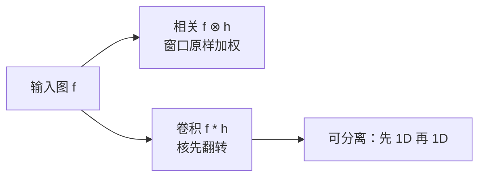
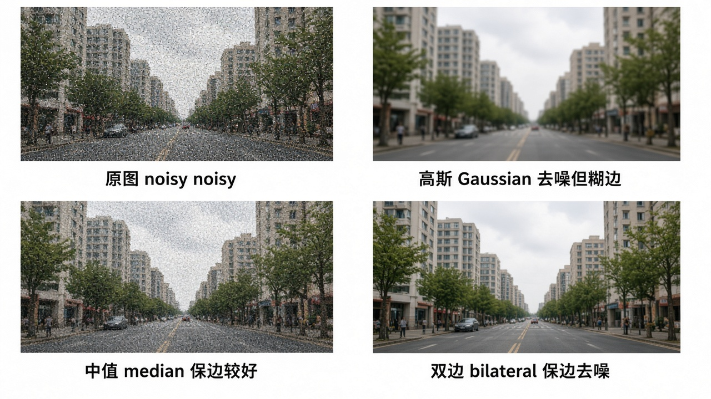
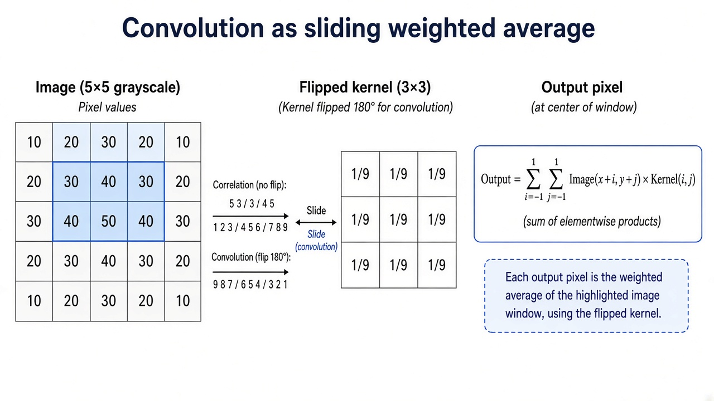
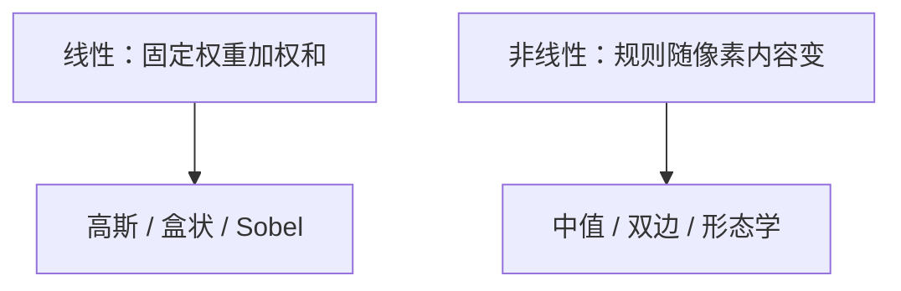
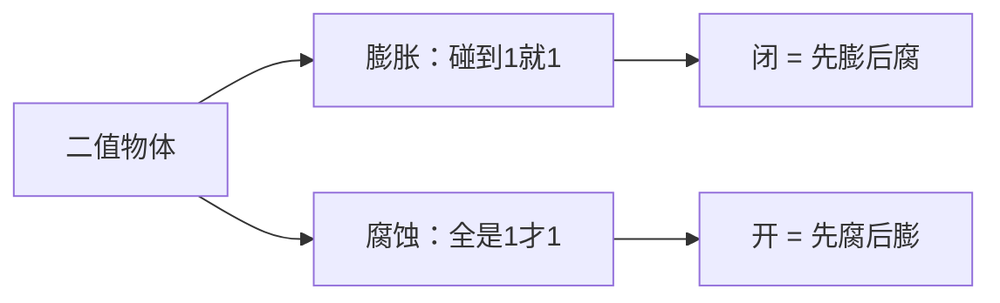
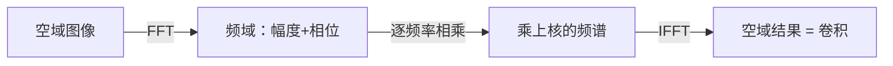
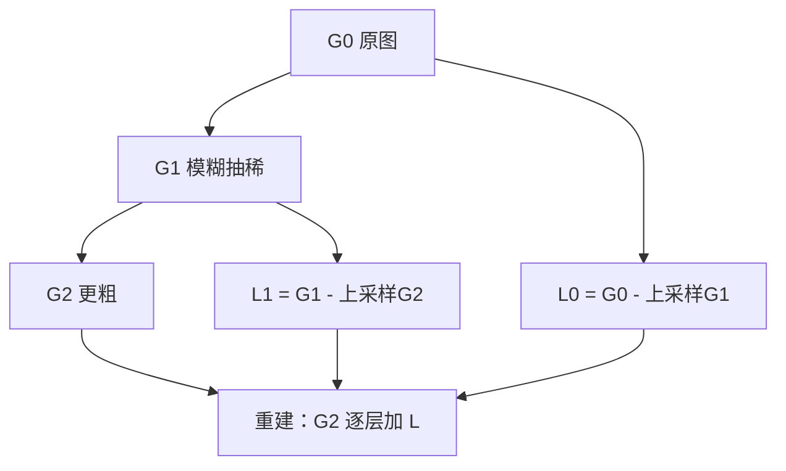

# 第3章 图像处理

来源：Szeliski《Computer Vision: Algorithms and Applications》第二版电子终稿第3章；书页 107–190 / PDF 133–216。分三批局部阅读。未越界第4章（书页 191 / PDF 217 起）。完整抠图留给第10.4节，拼接融合留给第8.4节。

## 本章总览

成像之后，多数视觉算法的第一站是图像处理：把图改成后面好分析的样子。例子包括曝光和白平衡、去噪、锐化、旋转摆正，以及特效里的变形与融合。

这一章按「用多大邻域」往上走：先点运算（每个像素自己变），再邻域线性/非线性滤波，再用傅里叶看这些邻域算子，再把它们叠成金字塔与小波，最后做几何变换。点运算在卷积神经网络里有时被叫成 $1\times 1$ 卷积，细节见第5.4节。

## 核心知识点

### 点运算

#### 增益、偏置、混合、伽马

一般算子 $g(\mathbf{x})=h(f(\mathbf{x}))$，离散像素 $g(i,j)=h(f(i,j))$。最常用的是乘加

$$
g(\mathbf{x})=af(\mathbf{x})+b,
\tag{3.3}
$$

$a>0$ 常叫增益（对比度），$b$ 叫偏置（亮度）。两者也可以随位置变，用来模拟渐变滤镜或渐晕。乘法增益服从叠加原理，是线性的；平方取能量不是线性。

两图溶解：$g=(1-\alpha)f_0+\alpha f_1$。处理前常先做伽马校正，解开传感器的非线性：$g=[f]^{1/\gamma}$，数字相机 $\gamma\approx 2.2$ 是书给的合理拟合。

🔑 关键速记：点运算不看邻居；$a$ 拉对比，$b$ 推亮度；算光度先按 $\gamma\approx 2.2$ 回到线性。

#### 颜色不要三通道一起加常数

RGB 三通道加同一个数，看起来更亮，色相和饱和度也会跑。应先动亮度 $Y$，再用色品坐标或颜色比把 RGB 拼回去（公式见第2.3.2节）。白平衡可以是每通道不同缩放，或转到 XYZ、改白点、再转回 RGB（$3\times 3$ 色扭转）。

👉 颜色形成与伽马的传感器侧见第2章。

🔑 关键速记：想提亮，动亮度，别给 R、G、B 加同一个偏置。

#### 合成公式，抠图细节留后文

从一张图剪出前景再贴到新背景：中间表示是带 $\alpha$ 的颜色图。物体内部 $\alpha=1$，外部 $\alpha=0$，边界平滑过渡，避免锯齿。Porter–Duff 的 over：

$$
C=(1-\alpha)B+\alpha F.
\tag{3.8}
$$

预乘 $\alpha F$ 更方便模糊和重采样（各通道独立处理）；靠局部颜色一致性抠图时，用未预乘的 $F$，因为物体边缘附近它变化慢。干净玻璃上的反射是两路光直接相加，不是 over，透明运动见第9.4.2节。怎么从自然图里恢复 $F,B,\alpha$，本章只点名，完整历史和算法在第10.4节。

👉 完整深度讲解见第10章。

🔑 关键速记：合成用 $C=(1-\alpha)B+\alpha F$；怎么求出 $\alpha$ 不是本章的事。

#### 直方图均衡

直方图是各灰度的像素计数。8 位要 256 格；更高位数不必开满表。均衡要找映射 $f(I)$ 让输出直方图变平：先积分得到累积分布

$$
c(I)=\frac{1}{N}\sum_{i=0}^{I}h(i)=c(I-1)+\frac{1}{N}h(I).
\tag{3.9}
$$

$c(I)$ 就是百分位。完全用 $f(I)=c(I)$ 会太平、发闷；部分均衡 $f(I)=\alpha c(I)+(1-\alpha)I$ 更常用。分块均衡再插值是自适应直方图均衡(AHE)及其对比度受限版本。过亮可能放大暗部噪声。

🔑 关键速记：均衡就是用累积分布当查表；全做会闷，掺一点原映射更耐看。

### 线性滤波：相关与卷积

输出是小邻域加权和。相关：

$$
g(i,j)=\sum_{k,l}f(i+k,j+l)h(k,l)=f\otimes h.
\tag{3.12}
$$

把偏移符号反过来是卷积 $g=f*h$。卷积核与冲激卷积还是自己；相关会得到翻转核。可分离核先水平再垂直，复杂度从 $O(K^{2})$ 降到 $O(K)$。高斯、盒状、二项式常可分离。书点名 Burt 与 Adelson 的五抽头二项式 $\frac{1}{16}(1,4,6,4,1)$。

带通与方向滤波器（可转向滤波器）用来看边缘方向，图 3.1b。线性移不变算子在频域就是乘一组增益，所以锐化、模糊、去噪也可以在傅里叶域做。

🔑 关键速记：相关不翻核，卷积翻核；能分开的核一定先分开算。

📚 基础补充：【卷积到底是什么】

- 是什么：卷积(convolution)是「拿一个小模板在图上滑动，每到一处做加权求和」。它和矩阵乘法都是线性操作，但矩阵乘法通常一次作用在整根向量上，卷积则**反复使用同一小核**，平移到哪都同一套权重。
- 为什么要用它：模糊、锐化、求梯度、可分离加速，都靠卷积。没有它，每个像素都得手写邻域公式，也无法用卷积定理转到频域一次乘完。
- 直观理解：把核当成「关注模式」。均值核 $\frac{1}{9}$ 的 $3\times 3$ 就是「看看周围九个像素的平均」。卷积相对相关(correlation)要把核旋转 180° 再贴上去——这是为了让「先模糊再平移」等于「先平移再模糊」（交换律、结合律）。对称核（高斯）翻不翻看起来一样；Sobel 这种有方向的核不翻就会把左右搞反。可分离卷积：若核是两个一维向量的外积，可以先对每行做 1D，再对每列做 1D。$K\times K$ 窗口从 $K^2$ 次乘法降到约 $2K$ 次，所以高斯、盒状、二项式都该先分开。

公式人话翻译：(3.12) 的相关是「窗口原样盖上去乘加」；卷积只是把 $h(k,l)$ 的下标反过来。输入是图 $f$ 和核 $h$，输出是另一张同样大小（或垫边后）的图 $g$。

- 和本章的关系：高斯模糊、边缘滤波、形态学里的计数、后面 CNN 的卷积层，都建立在「同一核到处滑」上。频域分析见下一节。

🔑 关键速记：卷积是共享小核的滑动加权；翻核是为了交换律；能分离就分离。

### 非线性邻域：中值、双边、形态学

中值：窗口里取中位数，去椒盐，边缘比均值稳。双边：权重同时看空间远近和灰度差，平滑时少跨边。用另一张图当引导算权重时，叫联合/交叉双边。

📚 基础补充：【线性滤波 vs 非线性滤波】

- 是什么：线性滤波(linear filter)的输出永远是输入像素的固定加权和，权重不看像素值本身；非线性滤波(nonlinear filter)会根据邻域内容改规则，例如取中位数、或按灰度差改权重。
- 为什么要用它：线性滤波数学干净（能叠、能到频域），但对椒盐噪声和强边缘不友好——均值会把污点摊开、把边缘抹糊。非线性用「看情况再说」换来保边和抗野点。
- 直观理解：线性像「无论邻居是谁，都按座位远近投票」；非线性像「先把极端票扔掉再平均」（中值），或「颜色差太多的邻居不让投票」（双边）。线性满足 $h(af+bg)=ah(f)+bh(g)$；中值不满足——两张图分别取中值，再加起来，一般不等于加起来再取中值。

图注：线性可搬到频域；非线性保边、抗椒盐，但不能随便说「等价于乘一个频率增益」。

- 和本章的关系：上一节全是线性；本节中值、双边、形态学都是非线性。选哪一类取决于噪声类型：高斯噪声偏线性，椒盐偏中值，要保边去噪偏双边。

🔑 关键速记：线性 = 固定加权；非线性 = 看内容再决定；保边通常要非线性。

二值形态学：先把二值图与结构元卷积得到计数 $c=f\otimes s$，$S$ 是结构元里 1 的个数，$\theta(c,t)$ 是阈值。书的统一写法：

- 膨胀：$\theta(c,1)$（至少碰到一个 1 就成 1）
- 腐蚀：$\theta(c,S)$（窗口全是 1 才留 1）
- 多数：$\theta(c,S/2)$
- 开：先腐后膨；闭：先膨后腐

膨胀变粗，腐蚀变细；开闭去小点和小洞，大区域轮廓还在。后文用得不多，阈值图清理时好用。

📚 基础补充：【形态学：腐蚀与膨胀】

- 是什么：形态学(morphology)用一个结构元(structuring element，小形状探针)去「探」二值或灰度图。膨胀(dilation)让前景变胖；腐蚀(erosion)让前景变瘦。
- 为什么要用它：阈值之后常有小毛刺、小洞、断开的笔画。开运算（先腐后膨）去小白点，闭运算（先膨后腐）填小黑洞，大形状还在。
- 直观理解：二值图里 1 是物体。膨胀：探针只要碰到一个 1，中心就写成 1——物体向外长一圈。腐蚀：探针必须全部落在 1 上，中心才留 1——物体被啃掉一圈，细桥会断。灰度图上，膨胀近似局部最大值（亮的区域扩张），腐蚀近似局部最小值（暗的区域扩张）。书的写法是卷积计数再阈值：$\theta(c,1)$ 膨胀，$\theta(c,S)$ 腐蚀。

图注：膨胀变粗、腐蚀变细；开去小点、闭填小洞。灰度上对应局部最大/最小。

- 和本章的关系：清理掩模、距离变换的前置，以及后面分割、拼接羽化时的形态学修边，都用这套探针思维。

🔑 关键速记：膨胀是「有一个 1 就变 1」，腐蚀是「全是 1 才留 1」；灰度上是局部最大/最小。

距离变换：每个像素到最近 0（或曲线）的距离，曼哈顿 $d_1=|k|+|l|$ 或欧氏 $d_2=\sqrt{k^2+l^2}$，可用两遍扫描预计算。用途：水平集、倒角匹配、拼接羽化、最近点对齐，分别见第7.3.2、8.4.2、13.2.1节。

🔑 关键速记：中值抗椒盐，双边保边；形态学是「卷积计数再阈值」。

### 傅里叶、金字塔、几何变换

二维傅里叶变换把卷积变成乘。用来分析核是低通还是高通，也可以直接在频域锐化或去噪。实现细节和离散形式见书 3.4；【信息缺口：DFT 正反变换的逐符号离散式以书 3.4 原文为准，此处不默写未核对的归一化系数。】

📚 基础补充：【傅里叶变换：时域到频域】

- 是什么：傅里叶变换(Fourier transform)把「随位置变化的图像」改写成「各种正弦波叠起来」。低频正弦变化慢，对应平滑大块；高频变化快，对应边缘和噪声。幅度谱(magnitude)说每种频率有多强，相位谱(phase)说这些波怎么对齐——相位错了，结构会乱，幅度更像「纹理能量」。
- 为什么要用它：卷积在空域要滑窗，在频域变成逐频率相乘（卷积定理）。分析一个核是低通还是高通、在频域锐化或去噪，都靠这套。
- 直观理解：听歌时的频谱条：低音鼓是低频，镲片是高频。图像同理：脸的轮廓是低频，睫毛和传感器噪点是高频。高斯模糊 = 压掉高频；锐化 = 把高频抬一点。卷积定理人话：空域「滑窗加权」= 频域「每个频率乘一个增益」。

图注：卷积定理把滑动加权变成频域相乘；幅度管能量，相位管结构对齐。

- 和本章的关系：线性移不变滤波都可以拿到频域看。离散实现与归一化系数以书 3.4 为准，此处不补超纲推导。

🔑 关键速记：低频=平滑，高频=细节；幅度看能量，相位看结构；卷积在频域是乘。

金字塔：先用低通（常可分离）再抽稀得到高斯金字塔；相邻层相减（或预测残差）得到拉普拉斯金字塔。上采样是插值。Burt 与 Adelson 用拉普拉斯金字塔按掩模融合两张图：硬切缝会在低频露出来，分频段混合更自然。完整全景融合还要选缝和曝光补偿，见第8.4节。小波是另一种多分辨率表示，构造上常走可分离路径。

📚 基础补充：【图像金字塔：高斯 vs 拉普拉斯】

- 是什么：图像金字塔(image pyramid)是同一张图的一组越来越小的版本，用来同时看「粗结构」和「细结构」。多尺度的意义：物体可大可小，算法若只在原分辨率找，细线看不清、大目标又太贵。
- 为什么要用它：检测、光流、匹配都要由粗到精：先在小图上对个大概，再回大图抠细节，又快又稳。融合时分频段混合，接缝不像刀切。
- 直观理解：高斯金字塔(Gaussian pyramid)：反复模糊再抽稀，每一层都是更糊、更小的原图，像一层层缩小的照片。拉普拉斯金字塔(Laplacian pyramid)：相邻高斯层的差（或预测残差），每一层是「这一档的细节」。从最粗一层开始，逐层加上拉普拉斯残差，可以重建原图。高斯像「越看越远的风景」，拉普拉斯像「每一档抠出来的纹理贴纸」。

图注：高斯金字塔存平滑版本；拉普拉斯金字塔存层间细节，可重建，也适合分频段融合。

- 和本章的关系：Burt–Adelson 融合、后面光流由粗到精（第9章）、特征尺度空间（第7章）都用金字塔。完整全景融合见第8.4节。

🔑 关键速记：高斯 = 越来越糊的小图；拉普拉斯 = 各档细节；多尺度是为了又快又稳。

几何变换：第2章那些 $3\times 3$ 作用在图像上，要插值（最近邻、双线性、双三次等）。正向映射会留洞，反向映射按目标像素去源图取样。网格变形和基于特征线的 morph（Beier–Neely）是特效常用手段。

👉 拼接时的融合与变形见第8章。

🔑 关键速记：卷积在频域是乘；金字塔把图拆成几档频率再分别处理；变形请反查源像素。

## 易混淆点&差异对比

### 相关 vs 卷积

公式只差核是否翻转。对称核（高斯）两者看起来一样；不对称核（导数、Sobel）必须说清楚用的哪一个。

### over 合成 vs 玻璃相加

over 用 $\alpha$ 压背景。干净玻璃反射是两路光相加，没有 $(1-\alpha)$。不要拿同一公式去套透明运动。

### 预乘 vs 未预乘

存 $\alpha F$ 方便滤和转；抠图估颜色时用未预乘 $F$。混用会把半透明边算脏。

### 全均衡 vs 部分均衡

$f=c(I)$ 直方图是平的，观感常常更差。掺原映射或做分块 AHE 才是实用选项。

### 点运算 vs 邻域 vs $1\times 1$ 卷积

点运算不看邻居。网络里的 $1\times 1$ 卷积在通道间混合，空间上仍是点，但已经不是本章的标量 $h(f)$。

## 本章要点总结

- 点运算：$g=af+b$、溶解、解伽马、按亮度而不是按 RGB 加常数来调颜色。
- 合成：$C=(1-\alpha)B+\alpha F$；$\alpha$ 怎么来见第10章。
- 均衡用累积分布当映射；全做会闷。
- 线性滤波先分清相关/卷积，能分离就分离。
- 中值、双边、形态学（计数再阈值）和距离变换是常用非线性工具。
- 金字塔和傅里叶是同一套邻域算子的多尺度/频域看法；变形用反向映射。
