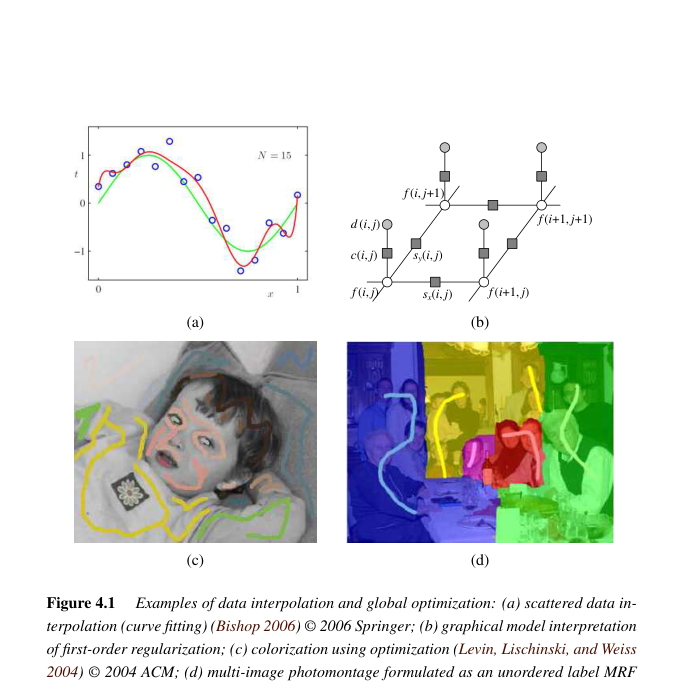
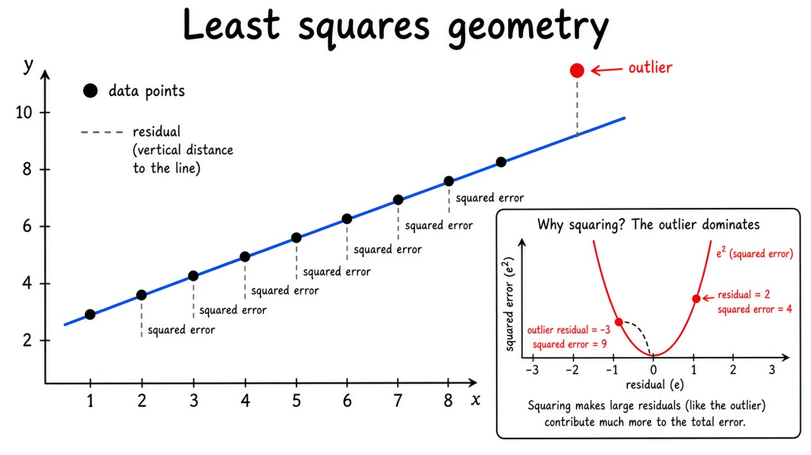
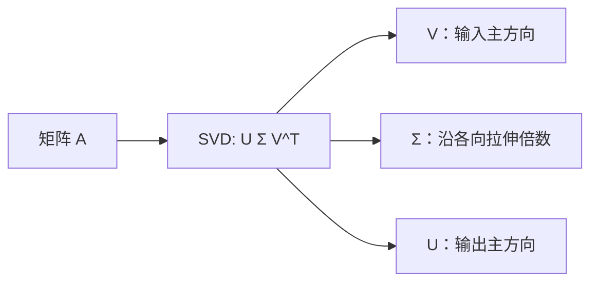
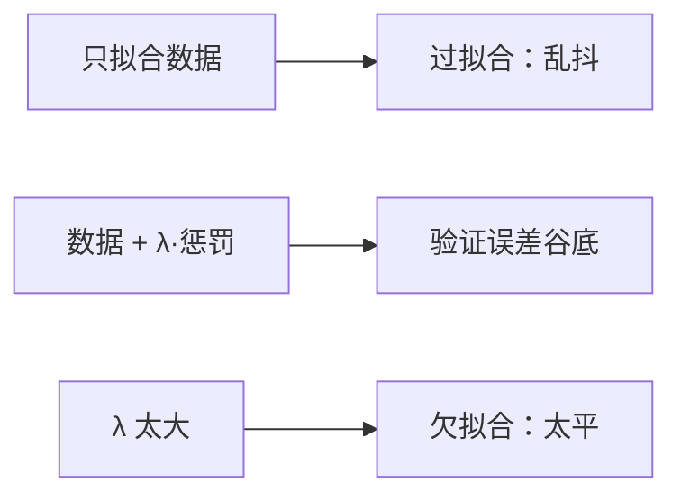
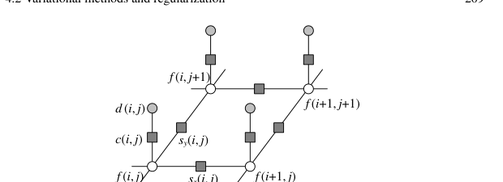
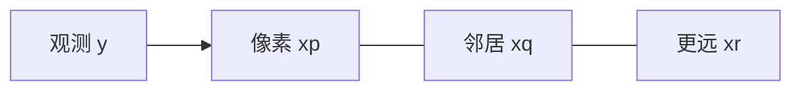
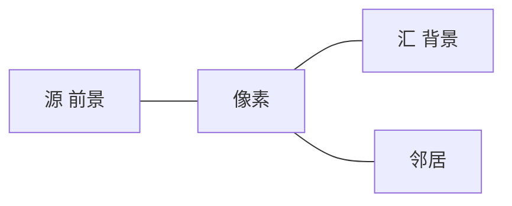
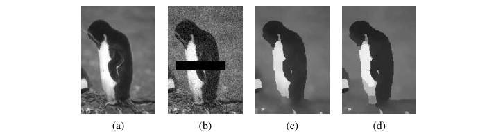
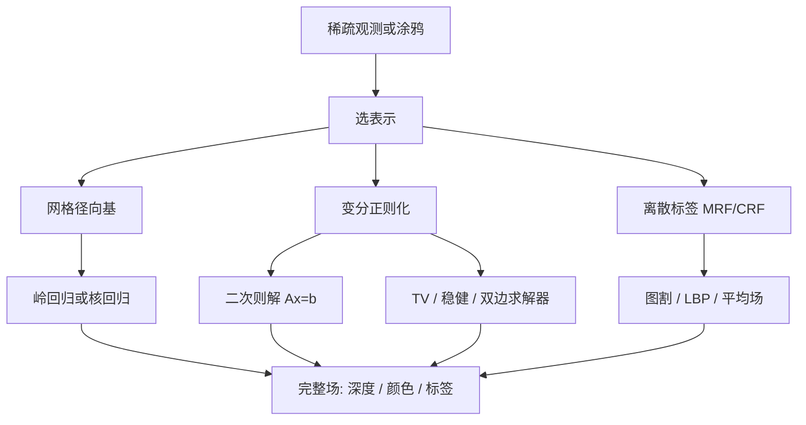

# 第4章 模型拟合与优化

来源：Szeliski《Computer Vision: Algorithms and Applications》第二版电子终稿第4章；书页 191–234 / PDF 217–260。一次局部阅读，未越界第5章（书页 235 / PDF 261 起）。立体全局优化留给第12章，分割细节与第7.5节分工；线性方程组与稳健统计公式细节见附录 A / B。

## 本章总览

上一章的算子吃完整图像，吐出另一张图。这一章反过来：观测常常是稀疏散点、涂鸦或不完整测量，要补出整张场（深度、颜色、标签）。

书把问题分成三层。第一层是散乱数据插值(scattered data interpolation)：函数穿过或贴近给定点。第二层是变分/正则化：用导数范数量化平滑，再在像素网格上变成稀疏二次型。第三层是马尔可夫随机场(Markov random field, MRF)：把数据项当似然、平滑项当先验，还能处理离散标签。图 4.1 把四类典型任务摆在一起。

机器学习里的回归(regression)就是这类「用有限样本预测函数」，第5章会接着用。本章只建能量与图模型，不讲网络训练。

## 核心知识点

### 散乱数据插值

#### 插值、逼近与网格法

目标是找连续光滑函数 $f(\mathbf{x})$，使 $f(\mathbf{x}_k)=d_k$（插值）。只要求靠近数据点时叫逼近，常用数据能量

$$
E_D=\sum_k\|f(\mathbf{x}_k)-d_k\|^2.
\tag{4.2}
$$

二维域可先用 Delaunay 三角剖分做成不规则三角网(TIN)，三角形内用重心坐标做分片线性插值，结果一般只 $C^0$。要更光滑可换成高阶样条或细分曲面。规则网格上可用张量积样条。

更快但不那么准的是 pull-push：先把散点溅射到最近格点并累加值与权重，再在金字塔上向下合并（pull，填空洞），再向上回写（push，不糊掉已有细节）。复杂度近似随点数与细网格线性。

🔑 关键速记：插值穿过点，逼近贴近点；二维可三角剖分，缺测可用 pull-push 金字塔填洞。

📚 基础补充：【最小二乘的几何意义】

- 是什么：最小二乘(least squares)就是挑一条模型，让「预测值和观测值之差的平方和」最小。几何上，是把观测向量投影到模型能够到达的那个子空间上，投影落差就是残差。
- 为什么要用它：过定方程（点数比未知数多）一般没有精确解。平方可微，求导后变成线性方程组，好算。没有它，拟合直线、相机、曲面都只能试错。
- 直观理解：黑板上有一串点，你拉一根直线，用尺子量每个点到直线的竖直误差，平方后加起来，调直线让这个总和最小。为什么用平方不用绝对值？平方处处可导，大误差会被放大——高斯噪声下这正好对应最大似然；但野点会被平方「惩罚过头」，所以后面才有稳健 $\rho$ 和 RANSAC。绝对值（$L_1$）对野点更温和，但优化更麻烦。

公式人话翻译：(4.2) 的 $E_D$ 输入是模型在样本处的值 $f(\mathbf{x}_k)$ 和观测 $d_k$，输出一个非负标量；越小表示越贴数据。

- 和本章的关系：散乱插值的数据项、正则化二次型、后面解 $A\mathbf{x}=\mathbf{b}$，都是最小二乘或其加权版本。细节求解见附录 A。

🔑 关键速记：最小二乘 = 残差平方和最小 = 向模型子空间投影；怕野点就要换损失。

#### 径向基与核回归

高维网格会组合爆炸，改用无网格径向基(RBF)：

$$
f(\mathbf{x})=\sum_k w_k\phi(\|\mathbf{x}-\mathbf{x}_k\|).
\tag{4.3}
$$

常用核：高斯 $\exp(-r^2/c^2)$、Hardy 多重二次、逆多重二次、薄板样条 $\phi(r)=r^2\log r$（二维；高维叫多调和样条，对应后文二阶变分 (4.19)）。$c$ 越大越平滑，方程组也可能更病态。精确插值要解 (4.8)，一般 $O(m^3)$。

更稳的是正则化逼近：$E=E_D+\lambda E_W$，$E_W=\sum\|w_k\|^p$。$p=2$ 是岭回归(ridge regression)，神经网络里对应权重衰减；$p=1$ 是 lasso，大 $\lambda$ 会把很多 $w_k$ 赶到 0。

把权重直接设成 $d_k$ 不做插值，归一化后是 Parzen 窗密度估计，均值漂移分割会用到。真正插值用 Nadaraya–Watson 核回归：

$$
f(\mathbf{x})=\frac{\sum_k d_k\phi(\|\mathbf{x}-\mathbf{x}_k\|)}{\sum_l\phi(\|\mathbf{x}-\mathbf{x}_l\|)}.
\tag{4.12}
$$

分母保证基函数构成单位分解。移动最小二乘在三维点面建模更常见。

👉 均值漂移分割完整深度讲解见第7章。点面建模完整深度讲解见第13章。

🔑 关键速记：RBF 是中心在数据点的核叠加；精确插值贵且病态，岭回归/lasso 更稳。

📚 基础补充：【SVD 奇异值分解】

- 是什么：奇异值分解(SVD, singular value decomposition)把任意矩阵写成 $\mathbf{A}=\mathbf{U}\boldsymbol{\Sigma}\mathbf{V}^{\mathrm{T}}$：$\mathbf{V}$ 给出输入空间的一组正交方向，$\mathbf{U}$ 给出输出空间的一组正交方向，$\boldsymbol{\Sigma}$ 对角线上的奇异值说「沿这个方向能放大多少」。
- 为什么要用它：最小二乘、求零空间（单应、基础矩阵）、主成分分析、判断方程组病不病态，视觉里到处用。它不要求方阵，也不要求可逆。
- 直观理解：把 $\mathbf{A}$ 想成一块会拉伸的橡皮。$\mathbf{V}$ 的列是橡皮上画的「特征方向」，奇异值是拉伸倍数，特别扁的方向（奇异值≈0）说明数据沿那边几乎没有信息，求逆会爆炸。最小二乘的伪逆就是：能放大的方向照常除回去，几乎为 0 的方向扔掉（或加岭回归垫一点）。

图注：SVD 把任意线性映射拆成旋转–拉伸–再旋转。小奇异值方向不稳定，最小二乘时常截断或加正则。

- 和本章的关系：RBF 精确插值的 $O(m^3)$ 求解、病态核矩阵，以及附录 A 的线性最小二乘，底层都可以走 SVD。本章不展开算法步骤。

🔑 关键速记：SVD = 找出矩阵的拉伸主轴；小奇异值要截断或正则，最小二乘才稳。

#### 过拟合、欠拟合与稳健损失

多项式阶数太低会欠拟合（太平），太高会过拟合（乱抖）。$\lambda$ 太大也会欠拟合。真实干净曲线拿不到，要把样本留出验证集，画训练误差与验证误差随 $\lambda$ 的曲线。交叉验证把数据切成 $K$ 折（常用 $K=5$），轮流当验证。大网络训练太贵时少用。还可配合 BIC、AIC 或贝叶斯模型选择。

偏差–方差权衡：正则太强，方差小、偏差大；正则太弱，方差炸、平均偏差小。目标是单次解就靠近干净真值。

数据项也可换成稳健损失 $\rho(\|r_k\|)$，$r_k=f(\mathbf{x}_k)-d_k$。Barron (2019) 用形状参数 $\alpha$ 统一多种损失：$\alpha=2$ 为 $L_2$，$\alpha=1$ 为 Charbonnier（大残差像 $L_1$），$\alpha=0$ Cauchy，$\alpha=-2$ Geman–McClure，$\alpha=-1$ Welsch。$\alpha$ 越小越狠压离群点，但可能非凸。尺度 $c$ 控制二次阱宽度（内点范围）。统计上叫 M-估计，常用迭代重加权最小二乘(IRLS)。

👉 IRLS 与非高斯模型完整深度讲解见附录 B。RANSAC 初值完整深度讲解见第8章。

🔑 关键速记：噪声点不要硬穿过；用验证/交叉验证选 $\lambda$，离群点换稳健 $\rho$。

📚 基础补充：【过拟合、欠拟合与 L1/L2 正则化】

- 是什么：过拟合(overfitting)是模型把噪声也背下来，训练误差很低、新样本却差；欠拟合(underfitting)是模型太死板，连训练数据都贴不好。正则化(regularization)在误差后面加一项「参数别太大」的惩罚，$\lambda$ 控制惩罚多重。
- 为什么要用它：散点少、多项式阶数高、RBF 中心多时，不惩罚就会抖。没有验证集选 $\lambda$，很难知道惩罚是否过头。
- 直观理解：L2（岭回归）像用橡皮筋把每个权重往 0 拉，大家一起变小但很少正好变成 0。L1（lasso）像设了一道「过路费」，不重要的权重会被收到精确 0，模型变稀疏。可以想成：L2 是圆盘约束，L1 是菱形约束，菱形的尖角更容易停在坐标轴上（某些系数为 0）。

图注：$\lambda$ 太小过拟合，太大欠拟合；L2 均匀缩小权重，L1 更容易把无用权重收到 0。

- 和本章的关系：$E=E_D+\lambda E_W$ 就是这套。$p=2$ 岭回归、$p=1$ lasso。下一节变分里的 $\lambda E_S$ 是对函数平滑程度的惩罚，思想相同、惩罚对象不同。

🔑 关键速记：正则 = 给复杂度买罚单；L2 缩小，L1 稀疏；$\lambda$ 用验证集选。

### 变分方法与正则化

#### 膜、薄板与受控连续

观测不够唯一确定曲面时，问题是不适定的，也是逆问题。正则化用导数范数量平滑。一维：

$$
E_1=\int f_x^2\,dx,\qquad E_2=\int f_{xx}^2\,dx.
\tag{4.16--4.17}
$$

二维一阶（膜，近似小挠度面积）与二阶（薄板样条，混项 $2f_{xy}^2$ 保证旋转不变）：

$$
E_1=\int\|\nabla f\|^2\,dx\,dy,
\tag{4.18}
$$

$$
E_2=\int\bigl(f_{xx}^2+2f_{xy}^2+f_{yy}^2\bigr)\,dx\,dy.
\tag{4.19}
$$

两者加权叫带张力的薄板。深度、光流、颜色其实是分片连续，Terzopoulos 引入受控连续样条：$\rho(x,y)$ 管是否允许撕裂，$\tau(x,y)$ 管局部张力。图像与光流多用一阶，曲面多用二阶。总能量 $E=E_D+\lambda E_S$，$\lambda$ 仍可用交叉验证。

🔑 关键速记：一阶像膜（帐篷），二阶像薄板；视觉场常要局部撕裂，不能处处 $C^1$。

📚 基础补充：【能量最小化：数据项 + 平滑项】

- 是什么：很多视觉问题写成「能量越低越好」。能量通常两块：数据项(data term) $E_D$ 要求解贴近观测；平滑项(smoothness term) $E_S$ 要求解别乱跳。总能量 $E=E_D+\lambda E_S$。
- 为什么要用它：只听数据，缺测处和噪声处会花；只听平滑，整张场糊成常数。两项拉锯，才能在「忠于测量」和「看起来像一张合理的图」之间折中。
- 直观理解：数据项像图钉：观测点把布钉在桌面上。平滑项像布的张力：一阶膜是帐篷布（不喜欢陡坡），二阶薄板是金属板（不喜欢折痕）。$\lambda$ 是布有多硬。允许撕裂的权重，相当于布上可以拉链拉开——深度在物体轮廓处本就该跳。

公式人话翻译：(4.18) 积分的是梯度的平方，输入是整张场 $f$，输出一个「有多皱」的数；乘上 $\lambda$ 再和 $E_D$ 相加。

- 和本章的关系：网格化后二次能量变成 $A\mathbf{x}=\mathbf{b}$。MRF 把同一对「数据 + 邻居」写成概率。立体、光流、去噪都是这副骨架。

🔑 关键速记：数据项钉住观测，平滑项拉平皱褶；$\lambda$ 是两者的砝码。

#### 离散能量与稀疏线性系统

连续问题先落到规则网格。一阶离散能量 (4.24) 含可选权重 $s_x,s_y$（裂缝）和梯度约束 $g_x,g_y$（光度立体、色调映射、泊松融合等用，普通平滑则置 0）。二阶 (4.25) 用折痕变量 $c_x,c_m,c_y$。数据项 (4.26) 的 $c(i,j)$ 是置信度，无数据处为 0，有数据时可取测量方差的倒数。

总能量写成二次型 $E=\mathbf{x}^\mathrm{T}A\mathbf{x}-2\mathbf{x}^\mathrm{T}\mathbf{b}+c$，最小化即解 $A\mathbf{x}=\mathbf{b}$。$A$ 是稀疏对称正定 Hessian：一维一阶为三对角，二维一阶每行约五个非零。必须用多重网格或分层预条件，收敛才能接近线性于像素数。图 4.9 把同一张图读成电阻网或弹簧–质量系，也是一阶 MRF 的骨架。

👉 稀疏求解与预条件完整深度讲解见附录 A。泊松融合完整深度讲解见第8章。色调映射完整深度讲解见第10章。光度立体完整深度讲解见第13章。

🔑 关键速记：正则化落到网格后就是稀疏正定 $A\mathbf{x}=\mathbf{b}$，不用稠密求逆。

#### 全变分、超拉普拉斯与双边求解器

把平方差换成稳健 $\rho$ 得 (4.29)。$p<2$ 的 $p$-范数更分片连续。Blake 与 Zisserman 的渐进非凸(GNC)先用凸二次，再慢慢换成截断 $\rho(x)=\min(x^2,V)$。

今天常用 $L_1$，即全变分(total variation)：保边且仍凸、有唯一全局解。图像导数的对数似然斜率约 $p\approx 0.5$–$0.8$，超拉普拉斯更偏向「少而大的跳变」。非 $L_2$ 不能只解一次线性系统，要用 IRLS、Levenberg–Marquardt 或原–对偶法。

双边求解器把最近邻平滑换成更大邻域、按引导图像颜色加权的 (4.31)–(4.32)。权重对 $f$ 本身无关，先溅射到较粗的双边网格，在网格上做迭代最小二乘，再切片回来。手机 AR 遮挡、双目全景视频拼接用过。

交互着色：用户涂几笔色度 $(u,v)$，按亮度梯度的倒数设局部平滑权重，解 (4.24)，再与亮度通道合成。后来的加权最小二乘色调映射走同一条路。也可用测地距离或深度先验，后者见第5章。

🔑 关键速记：TV 保边且凸；双边求解器把「像双边滤波那样找邻居」写进能量。

### 马尔可夫随机场

#### 贝叶斯、MAP 与网格先验

正则化最小化能量；贝叶斯则分开建模测量噪声与解空间先验。由贝叶斯法则

$$
p(\mathbf{x}\mid\mathbf{y})=\frac{p(\mathbf{y}\mid\mathbf{x})p(\mathbf{x})}{p(\mathbf{y})},
\tag{4.33}
$$

负对数后验就是能量 $E=E_D+E_P$。最大后验(MAP)取峰，不一定是最稳的统计量。MRF 是图模型的一种：变量只和邻域互动，无环图可用动态规划线性推断。图像上未知量是输出像素 $\mathbf{x}$，数据是输入像素 $\mathbf{y}$。Hammersley–Clifford 定理把 $-\log p(\mathbf{x})$ 写成邻域势之和 (4.38)。最常用四邻域 $N_4$，八邻域对斜向边界更好。二次势时，正则化能量最小与 MRF 的 MAP 近似等价。

离散标签没有「大小顺序」，正则化用不上，必须上 MRF。

👉 估计理论与不确定性完整深度讲解见附录 B。部件式识别里的链/树/星图完整深度讲解见第6章。

🔑 关键速记：MAP 能量 = 数据负对数似然 + 先验；网格上就是邻域势相加。

📚 基础补充：【马尔可夫随机场 MRF】

- 是什么：马尔可夫随机场(Markov random field)把每个像素（或标签）当成图上的一个结点，只和邻居直接打招呼。整张图的好坏，等于「每点自己像不像观测」加上「每对邻居和不和谐」——不必对所有像素做一次全局高维积分。
- 为什么要用它：连续二次能量适合灰度和深度；离散标签（前景/背景、类别）没有「大小顺序」，不能拿导数当平滑。MRF 用邻域势覆盖这两种。
- 直观理解：一排彩灯，每盏灯只看左右邻居是否同色，再看自己该不该跟观测走。马尔可夫性：知道了邻居，更远的灯对你没有额外直接约束（影响是一跳一跳传过来的）。能量最小 ≈ 最大后验 MAP：数据项是似然，平滑项是先验。

图注：MRF 只在邻边上写势；远距离影响通过邻居传递。二次势时几乎就是上一节的正则化网格。

- 和本章的关系：(4.33)–(4.38) 把贝叶斯后验写成邻域能量。下一小节的图割、LBP 都是在这张格子图上求 MAP。

🔑 关键速记：MRF = 格子上的邻居能量；数据项贴观测，成对项管邻居和不合。

#### 二值、有序与无序标签

二值场（文档去噪、前景/背景）：数据项看扫描值是否一致 (4.39)，平滑项惩罚邻居不同 (4.40)。逐点翻转是 ICM，易陷局部最小；加噪声并降温是模拟退火，效果仍一般。二值且势满足正则/子模条件时，最大流/最小割（图割）能到全局最小。

📚 基础补充：【图割 Graph Cut】

- 是什么：图割(graph cut)把二值标注问题变成「在图上剪一组边，把结点分成源/汇两堆」。割的容量等于能量，最小割就是能量最小的二值解。
- 为什么要用它：逐点翻转（ICM）很容易卡在差的局部解。满足子模/正则条件时，图割能给出全局最小，交互抠图、二值去噪、立体里的 $\alpha$-扩张内层都靠它。
- 直观理解：前景种子是源，背景种子是汇，每个像素是中间结点。像素和源/汇之间的边表示「它有多像前景/背景」，邻居之间的边表示「分开这一对要花多少钱」（边缘处边弱、好剪）。最小割就是花最少的钱把图剪成两块——通常会沿着图像里已经看得见的边走。多值标签没有这么干净，要用 $\alpha$-扩张等移动，一般不保证全局最优。本书不展开最大流算法证明。

图注：剪断的边 = 付出的能量。最小割优先走「弱边」（图像边缘），得到二值 MAP。

- 和本章的关系：Boykov–Jolly / GrabCut 的交互分割、第8章拼缝、第12章立体，都把能量接到这张源–汇图上。

🔑 关键速记：图割 = 用最小割求二值能量最小；沿弱边剪，子模时全局最优。

有序标签（灰度、深度）把二次项换成稳健 $\rho$，即 (4.41)(4.42)。$\rho_p(d)=|d|^p$、$p<1$ 是超拉普拉斯，比二次或 TV 更贴自然图像梯度。$\rho$ 为二次时叫高斯 MRF(GMRF)，回到 $A\mathbf{x}=\mathbf{b}$；权重均匀时还是维纳滤波。多值图割用 $\alpha$–$\beta$ 交换与 $\alpha$-扩张，内层仍是二值图割，一般 NP-难，不保证全局最优。环形置信传播(LBP)在树上精确，网格上是近似，部分立体算法用它。

无序标签（地貌类别、蒙太奇源图编号）用一般相容函数 $V(l_0,l_1)$，数值差没有语义。拼缝时 $V_{p,q}(l_p,l_q)$ 看「把图 $l_p$ 的 $p$ 贴到图 $l_q$ 的 $q$ 旁边好不好」，同标签通常为 0。

👉 立体匹配的图割/LBP 完整深度讲解见第12章。拼缝与照片蒙太奇完整深度讲解见第8章。

🔑 关键速记：二值优先图割；灰度/深度用稳健势或多值移动；类别标签不要做数值相减。

#### 条件随机场与稠密 CRF

经典 MRF 的先验 $p(\mathbf{x})$ 不看观测。交互分割里却希望强边缘处更容易断开，平滑权重要随输入梯度变，贝叶斯乘积不再成立。改为直接写后验

$$
E(\mathbf{x}\mid\mathbf{y})=\sum_p V_p(x_p,\mathbf{y})+\sum_{(p,q)\in\mathcal{N}}V_{p,q}(x_p,x_q,\mathbf{y}),
\tag{4.47}
$$

这就是条件随机场(CRF)。一元项若还看一整块输入邻域，Kumar 与 Hebert 称作判别随机场(DRF)。着色、语义分割里让颜色边对齐标签边，CRF 很自然；去噪时，稳健 MRF 与「按输入梯度调 GMRF 权重」定性相近，后者一次解线性系统，前者在跳变不明显时更稳。

稠密 CRF 把成对项扩到（近似）所有像素对，势取标签相容函数乘若干高斯核（外貌核 + 空间平滑核），于是可用快速双边滤波做平均场推断。后来常接在深度分割网后面做收拾，例如 DeepLab。

👉 语义分割完整深度讲解见第6章。立体里「视差跳变贴强度边」完整深度讲解见第12章。

🔑 关键速记：平滑项若看输入图，写的是 CRF 不是生成式 MRF；长程同类像素用稠密 CRF。

#### 应用：交互分割（框架）

分割要「区内统计像、边界短且贴可见边」。写成区域项 $E_R$（像素颜色对区域模型的负对数似然）加边界项 $E_P$（四邻不一致，权重与边强度成反比）。区域模型可以是均值色、灰度直方图或颜色高斯混合。

Boykov 与 Jolly 把用户涂鸦当成源/汇种子，边容量来自区域与边界能量，一次最大流得到二值分割。GrabCut 把区域统计改成颜色高斯混合，用包围盒初始化背景条，迭代更新模型；用户可再补几笔。有向边可以偏好由亮到暗等方向。连通性先验、形状先验是后续扩展。

也可把二值能量松弛到 $[0,1]$ 连续膜，解线性系统后 0.5 阈值；随机游走把它读成「从该像素走到各种子的概率」。测地距离能更快近似软 $\alpha$。

本章只给能量框架。水平集与图分割的检测器侧见第7.5节；自然图抠 $\alpha$ 见第10.4节。

👉 完整深度讲解见第7章与第10章。

🔑 关键速记：交互分割 = 区域似然 + 贴边平滑；图割解二值，GrabCut 再迭代颜色模型。

## 易混淆点&差异对比

下面表格对照本章最容易缠在一起的几对概念。读表时记住：名字像，约束对象往往不是同一个。

| 名称 | 功能 | 主要参数 | 约束&坑点 |
| --- | --- | --- | --- |
| 插值 vs 逼近 | 穿过点 vs 贴近点 | 是否硬约束 (4.1) | 噪声点硬穿过会抖 |
| 岭回归 vs lasso | 压权重 $p=2$ / $p=1$ | $\lambda$ | lasso 可稀疏，岭回归不会把权重赶到精确 0 |
| 膜 vs 薄板 | 一阶 / 二阶平滑 | $\lambda$、撕裂/折痕权重 | 图像与光流常用膜；曲面常用薄板 |
| 正则化 vs MRF MAP | 能量最小 vs 后验最大 | 数据项+平滑/先验 | 二次时几乎同一套式子 |
| MRF vs CRF | 先验不看图 / 平滑看图 | 是否 $E_S(\mathbf{x},\mathbf{y})$ | 着色、分割常用 CRF；骰子不该因第一次掷出 6 就改先验 |
| 图割 vs LBP | 组合优化 vs 消息传递 | 势是否子模 | 二值正则势图割可全局；多值一般只能局部好 |
| TV vs 超拉普拉斯 | $p=1$ / $p<1$ | $p$ | TV 凸；$p<1$ 更贴自然梯度但更难优化 |

MAP 取的是后验峰，不一定比均值等统计量稳。GMRF 权重若跟着输入走，已经是一种 CRF。无序标签的 $V$ 不是 $|l_0-l_1|$。

🔑 关键速记：先分清「连续场还是离散标签、先验看不看输入」，再选求解器。

## 本章要点总结

- 散乱插值：三角网 / pull-push / RBF / 核回归；噪声下用正则与验证集，离群点用稳健 $\rho$。
- 变分：膜与薄板量化平滑，网格化后二次问题是稀疏 $A\mathbf{x}=\mathbf{b}$；分片连续要撕裂权重、TV 或稳健范数。
- MRF：数据似然 + 邻域先验；二值图割、多值移动或 LBP；无序标签用相容表。
- CRF / 稠密 CRF：平滑或一元项看输入；长程用双边核加速平均场。
- 着色、GrabCut、拼缝只建立能量，算法细节分别留给第10、7/10、8 章；立体全局优化留给第12章。

【信息缺口，需要局部查阅文档】Barron 损失的完整解析式未从书中逐式抄出；有限元如何推出 (4.24)(4.25) 的推导页未逐步核对。
