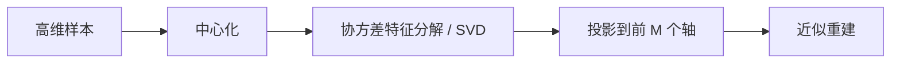
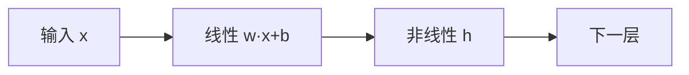
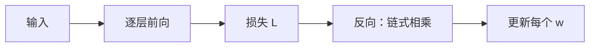
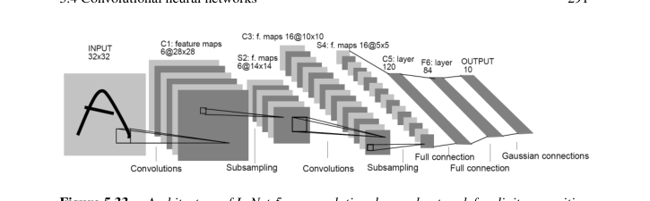
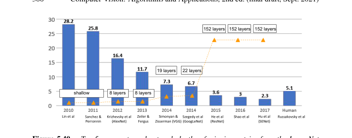
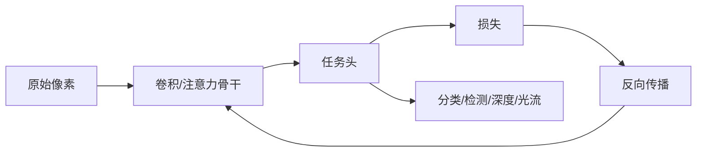

# 第5章 深度学习

来源：Szeliski《Computer Vision: Algorithms and Applications》第二版电子终稿第5章；书页 235–342 / PDF 261–368。分四批局部阅读（PDF 261–288 / 289–316 / 317–344 / 345–368）。未越界第6章。本章只建学习与网络工具箱；分类检测分割应用留第6章，光流、立体、神经绘制分别留第9、12、14章。

## 本章总览

第二版把深度学习提前到全书中部，因为它是后面识别、运动、立体和绘制共用的工具箱，不是书末附录。

写法分四块：先监督/无监督经典方法（近邻、贝叶斯、逻辑回归、SVM、树、聚类、PCA），再讲可微前馈网（层、激活、正则、损失、反向传播），再讲卷积网（池化、结构谱系、可视化、对抗、自监督），最后是三维卷积、循环网、Transformer 与生成模型。经验风险最小化 (5.1) 和上一章的回归能量是同一类式子。

分类、检测、分割怎么接到真实任务，本章只点名。

👉 完整深度讲解见第6章。

## 核心知识点

### 监督学习

#### 经验风险、预处理与近邻

监督：成对输入 $\{x_i\}$ 与目标 $\{t_i\}$ 调参数。离散标签是分类，连续输出是回归。训练完再对未见输入预测；书提醒不要只盯某个测试集。

真实联合分布拿不到，用训练集代理，即经验风险最小化

$$
E_{\mathrm{Risk}}(w)=\frac{1}{N}\sum L\bigl(y_i,f(x_i;w)\bigr).
\tag{5.1}
$$

分类常最小化错分率；医学假阴性往往比假阳性贵。输入宜中心化、标准化；白化要 SVD，高维图像贵，可与 PCA 一起做。

$k$ 近邻留下全部训练样本，测试时取最近 $k$ 个投票。$k$ 太小过拟合、边界碎，$k$ 太大欠拟合、小岛被吃掉。大规模检索用 FLANN（随机 k-d 树、优先 k-means 树、LSH）或 GPU 上的 Faiss（乘积量化）。

👉 大规模特征检索完整深度讲解见第7章。真阳性/假阳性曲线完整深度讲解见第7.1.3节。

🔑 关键速记：监督是配对样本最小化经验风险；$k$ 近邻无参数，贵在检索。

#### 贝叶斯、逻辑回归与 SVM

能写出类条件 $p(x|C_k)$ 和先验 $p(C_k)$ 时，后验是 (5.2)，指数归一化即 softmax (5.3)。线性投影后再 sigmoid 是逻辑回归 (5.17)(5.18)，属判别模型，不能采样。二值交叉熵 (5.19)，多类 one-hot 交叉熵 (5.22)，也可写成只加正确类对数似然 (5.23)。交叉熵对权重凸，牛顿/IRLS 有唯一解。类可分时权重会无限涨，必须正则。

支持向量机找最大间隔超平面：$\hat t_i(w\cdot x_i+b)\ge 1$，最小化 $\|w\|^2$。贴边的点叫支持向量。不可分时换成核定位 (5.29)，只需留下支持向量。软间隔用合页损失 $[1-\hat t_i l_i]_+$，间隔外不罚。

决策树按特征阈值递归切空间；随机森林对样本和特征再随机，降低方差。书把它当非线性基线，深度网起来后面用得少。

🔑 关键速记：逻辑回归用交叉熵学线性判别；SVM 用最大间隔和核，只留支持向量。

📚 基础补充：【交叉熵损失的直觉】

- 是什么：交叉熵(cross-entropy)衡量「模型给出的类别概率」和「真正的 one-hot 标签」差多远。正确类的预测概率越接近 1，损失越接近 0；若把正确类看成几乎不可能，损失会非常大。
- 为什么要用它：错分率不可导，没法直接用梯度下降。交叉熵可导、对逻辑回归还是凸的。分类任务几乎都从它起步。
- 直观理解：老师问「这是猫吗」，模型说「我 90% 肯定是猫」，罚单很小；说「1% 是猫」罚单极重。它惩罚的是「自信地错」，不是「稍微不确定」。二值形式 (5.19) 看正类概率 $p$ 和标签 $t\in\{0,1\}$；多类 (5.22)(5.23) 只给正确类的 $-\log p_k$ 记账。可分时权重会无限涨（越来越自信），必须加正则。

公式人话翻译：输入是模型概率与真实标签，输出一个非负标量；训练就是把它对权重求平均后压下去。

- 和本章的关系：逻辑回归、softmax 分类头、后面深度网的 (5.54)(5.55) 都用交叉熵。合页损失是 SVM 的亲戚，间隔外不罚，交叉熵会一直罚。

🔑 关键速记：交叉熵罚「对正确类不够自信」；可导，可分时要正则。

### 无监督学习

#### 聚类、K 均值与混合高斯

无标签样本要找结构。K 均值把密度看成若干各向同性球：先定 $K$ 个中心，再交替「归最近中心 / 更新中心」。高斯混合(GMM)用期望最大化(EM)估权重、均值、协方差，软分配。均值漂移找密度众数，分割细节见第7.5.2节。

🔑 关键速记：K 均值硬切球团，GMM 软切椭圆团。

#### 主成分与流形

散度矩阵 $C$ 特征分解 (5.41)(5.42) 得特征脸。新图系数 $a_i=(x-m)\cdot u_i$。截断 $M$ 项是最小二乘最优近似。脸空间内距离 DIFS、到子空间距离 DFFS 可转成马氏距离，用于「像不像脸」。实际不算 $P\times P$ 大矩阵，改用 $N\times N$ 内积技巧（附录 A）。

数据不在线性子空间上时用流形学习：Isomap、LLE、t-SNE、UMAP 等，用于降维、可视化和检索加速。半监督是少量准标签 + 大量无标签；弱监督可用噪声标签（如 Instagram 话题）预训练。

👉 人脸识别应用完整深度讲解见第6章。

🔑 关键速记：PCA 找最佳线性子空间；弯的数据改走流形嵌入。

📚 基础补充：【PCA 主成分分析】

- 是什么：主成分分析(PCA, principal component analysis)找数据变化最大的几个正交方向，把高维点投影到这几个轴上，用更短的坐标近似原来的向量。
- 为什么要用它：一张脸图有上万维像素，真正的「脸形状变化」可能只有几十维。降维后更好存、更好比、还能去一点噪声。
- 直观理解：一群点如果摊成扁平的椭球，最长轴就是第一主成分——沿这边走，点散得最开。第二主成分是剩下方向里最长的，且与第一根垂直。截断后面那些又短又吵的轴，就是「最小二乘最优」的线性压缩。特征脸：平均脸 + 若干「变胖/变瘦/变光照」的脸模板线性组合。

图注：PCA 旋转到方差最大的正交轴，丢掉小方差方向。弯的数据（瑞士卷）线性轴不够，要改流形方法。

- 和本章的关系：(5.41)–(5.44) 的特征脸就是 PCA。白化、初始化、检索降维也会用。实现上常用样本内积的小矩阵，见附录 A。

🔑 关键速记：PCA 沿最散的方向截断；线性最优，弯结构要另想办法。

### 深度神经网络

#### 层、激活与正则

端到端可微图：单元先加权和 $s_i=w_i^\mathrm{T}x_i+b_i$，再非线性 $y_i=h(s_i)$。整层写成 $s_l=W_l x_l$，$x_{l+1}=h(s_l)$。稠密矩阵叫全连接(FC)；只有全连接、没有卷积的栈叫多层感知机(MLP)。

早期用 sigmoid/tanh，现代主干多用 ReLU $h(y)=\max(0,y)$。ReLU 可能「死掉」（梯度永远 0），学习率过大时更明显。分类末层用 softmax 把分数变成概率。前馈网是判别式，本身不会采样。

过拟合对策：权重衰减、数据增强、dropout、批归一化。条件批归一化可按另一路激活改 $\beta,\gamma$，风格迁移和神经绘制会用。

👉 风格与神经绘制完整深度讲解见第14章。

🔑 关键速记：一层 = 线性 + 非线性；分类出口 softmax；ReLU 要防神经元死掉。

📚 基础补充：【激活函数的作用】

- 是什么：激活函数(activation)接在线性加权后面，把 $s$ 变成 $h(s)$。没有它，叠多少层都等价于一层线性，学不出「弯曲的分类边界」。
- 为什么要用它：图像里的「猫 vs 背景」不是一根平面能切开的。非线性让网络组合出更复杂的形状。分类末层用 softmax 把分数变成加起来为 1 的概率。
- 直观理解：ReLU $h(y)=\max(0,y)$ 像单向阀门：正信号原样过，负信号掐掉。简单、好求导（正半轴梯度为 1），所以现代主干常用。坏处是一旦掉到负半轴再也出不来（死 ReLU），学习率过大时更明显。旧的 sigmoid/tanh 会把两端压扁，深层梯度容易消失。

图注：一层 = 线性变换 + 激活。激活提供弯曲能力；ReLU 是最常用的阀门。

- 和本章的关系：公式 $y_i=h(s_i)$ 贯穿全章。卷积层同样先加权再激活。出口损失见下一小节。

🔑 关键速记：没有激活就没有深度；ReLU 简单但要防神经元死掉。

#### 损失、初始化与训练

分类用交叉熵 (5.54)(5.55)。回归常用 $L_2$；书印的 (5.56) 在平方误差前写了负号，与「最小化误差」不符，【信息缺口，需要局部查阅文档】是否排印，实践按不加负号的 $L_2$/$L_1$ 理解。网络概率未必校准，可用温度缩放。图像合成可用感知损失或对抗判别器。

度量学习：对比损失 (5.57)、三元组损失、InfoNCE / NT-Xent (5.58)。两路共享权叫孪生网。人脸检索里还有 SphereFace / CosFace / ArcFace。

He 初始化针对 ReLU：权重方差 $V_l=2/n_l$（半扇入的倒数）。反向传播对计算图自动求导；训练用小批量 SGD、动量、学习率衰减。残差出现前，很深的网梯度会消失或爆炸。

🔑 关键速记：分类交叉熵、回归稳健范数、检索对比损失；ReLU 网用 He 初始化。

📚 基础补充：【链式法则与反向传播】

- 是什么：链式法则(chain rule)说复合函数的导数等于各层导数相乘。反向传播(backpropagation)就是从损失往输入倒着乘这些局部导数，得到每个权重该往哪边调。
- 为什么要用它：网络有上百万参数，不可能对每个权重做数值扰动试对错。一次前向算出损失，一次反向就能得到全部梯度。
- 直观理解：水管从输入流到损失。反向传播是「从漏水的地方往回查，每段管子分到多少责任」。某一层的梯度 = 后面传来的误差 × 本层激活的斜率 × 本层输入。小批量 SGD 用一小撮样本的平均梯度推一把权重，再换下一批。残差出现前，乘太多小于 1 的斜率会梯度消失，乘太大又会爆炸。

图注：前向算损失，反向用链式法则把误差分到每个权重。训练 = 小批量重复这个回路。

- 和本章的关系：书把反向传播当自动求导的实现。He 初始化、残差捷径、BN，都是为了让这条链式乘法数值上活得下去。

🔑 关键速记：反向传播 = 链式法则从损失倒着乘；一次反向得到全部梯度。

### 卷积神经网络

#### 卷积层与池化

图像不用全连接：每层排成特征图（通道）。卷积在局部窗内加权，权值在空间共享，但会混合全部输入通道、并为每个输出通道学一套核：

$$
s(i,j,c_2)=\sum_{c_1}\sum_{(k,l)\in\mathcal{N}}w(k,l,c_1,c_2)\,x(i+k,j+l,c_1)+b(c_2).
\tag{5.76}
$$

偏移是相加，其实是相关，权值可学所以通常不区分。参数量 $S^2 C_1 C_2$，计算量还要乘 $WH$。$1\times 1$ 卷积是逐像素通道混合，常作降维瓶颈。还需指定填充、步长、膨胀（atrous）、分组；分组数等于通道数是深度可分离卷积。带掩模的部分卷积用于补洞。

池化在空间上降采样（最大或平均）；反池化/上采样用于密集预测。FC 表示「全连接」，FCN 表示「全卷积」，不要混。

🔑 关键速记：卷积是局部、权值共享、跨通道混合；深度指层数，也有人把通道数叫 depth。

📚 基础补充：【感受野、权值共享、池化】

- 是什么：卷积神经网络(CNN)用小核在图上滑动。权值共享(weight sharing)指同一套核扫完整张图，不必为每个位置单独学参数。感受野(receptive field)是输出上一个格子能「看见」的输入区域，层越深、核越大、步长越大，感受野越大。池化(pooling)在小窗口内取最大或平均，空间尺寸下降。
- 为什么要用它：全连接把每个像素连到每个隐单元，参数爆炸，还认不出「猫平移之后还是猫」。共享核带来平移近似等变；池化带来一点平移容忍并省算力。
- 直观理解：用同一个放大镜扫整张照片找边缘，就是权值共享。第一层只看见 $3\times 3$ 纹理，叠几层加池化后，顶层一个单元可能看见半张脸——感受野变大了。最大池化像「这块有没有强响应」，位置稍微挪一点往往还在。

公式人话翻译：(5.76) 输入是特征图 $x$ 和四维核 $w$，对每个输出通道 $c_2$ 在窗口 $\mathcal{N}$ 上对所有输入通道求和，再加偏置。偏移是相加，实现上常是相关，核可学习故通常不翻。

- 和本章的关系：LeNet 起就是「卷积 + 下采样」交替。检测分割要更大感受野或 FPN，任务头见第6章。

🔑 关键速记：同一核到处滑；感受野随深度变大；池化降分辨率并容忍小平移。

#### 结构谱系（只当工具箱）

LeNet-5 做数字。2012 年 AlexNet 把 ImageNet top-5 从 25.8% 降到 16.4%，用 ReLU、最大池化、dropout、平移/颜色增强、动量和权重衰减。随后 VGG 重复 $3\times 3$+ReLU 与 $2\times 2$ 池化并加倍通道（16–19 层）；GoogLeNet 用 Inception 分支和 $1\times 1$ 瓶颈，去掉大全连接，改全局平均池化；ResNet 用捷径学残差，才训得动 152 层。再往后有分组卷积的 ResNeXt、跨层密连的 DenseNet、加全局上下文的 SENet。手机侧 MobileNet 用深度卷积和宽度/分辨率乘数折中精度与算力。

分类、检测头怎么接到这些骨干，留第6章。可视化权值与激活、对抗样本、自监督预训练（对比学习）本章有专节，应用仍按后文任务写。

👉 完整深度讲解见第6章。

🔑 关键速记：AlexNet 打开局面，VGG 堆小核，Inception 省算力，ResNet 靠捷径加深。

### 更复杂模型（框架）

三维卷积吃体数据或视频，算力内存都贵；SlowFast 用慢通路（低帧率）加快通路（高采样、少通道）。点云、网格、由单图推三维分别留给第13、14、12章。书提醒：有的「三维推断网」可能只是认出类别再微扰形状。

循环网(RNN)把上一时刻隐状态喂给下一时刻，权值跨时间共享，反传要展开。门控是 GRU / LSTM，减轻长程梯度消失。注意力用查询对一组键做加权，取出值的混合，像核回归，但常用缩放点积而不是径向距离。

Transformer 一次看完整段序列。自注意力：

$$
y=\mathrm{softmax}(q^\mathrm{T}K/D)^\mathrm{T}V,
\tag{5.77}
$$

查询/键/值由 (5.78) 三个矩阵从同一组输入线性得到。正文说点积要除以 $\sqrt{D}$，印刷公式写成 $/D$，【信息缺口】以「按维数缩放、防止方差涨」理解。再加位置编码、多头、层归一化、残差。图像上 $N$ 是像素或图块数，自注意力 $O(N^2 D)$，比卷积贵，所以常用图块（ViT 一类）。

生成模型：VQ-VAE 用离散码本；GAN 让生成器 $G$ 骗判别器 $D$，联合损失 (5.79) 是极小极大。条件 GAN、InfoGAN 是变体。纹理风格匹配和神经绘制细节留第10、14章。

👉 视频理解、视觉语言完整深度讲解见第6章。神经绘制完整深度讲解见第14章。

🔑 关键速记：序列用 RNN/LSTM 或一次看全句的 Transformer；造图用 VAE/GAN，细节按任务章展开。

## 易混淆点&差异对比

下面对照本章最容易叫混的名字。

| 名称 | 功能 | 主要参数 | 约束&坑点 |
| --- | --- | --- | --- |
| 分类 vs 回归 | 离散类 / 连续值 | 损失不同 | 软件工程里的「回归」不是这里的回归 |
| 生成 vs 判别 | 能采样 $p(x,C)$ / 只给 $p(C\|x)$ | 是否建类条件密度 | 逻辑回归与前馈网默认是判别 |
| FC vs FCN | 全连接层 / 全卷积网 | 有无稠密矩阵 | 缩写正好相反 |
| 层深度 vs 通道深度 | 网络层数 / 一层通道数 | — | 读论文时看上下文 |
| 卷积 vs 相关 | (5.76) 偏移相加 | 核可学习 | 实现里通常不翻转核 |
| CNN 局部偏置 vs Transformer 全局注意 | 近邻重要 / 一开始就看全图 | 感受野 vs $O(N^2)$ | 数据极大时局部偏置可能变成限制 |
| 交叉熵 vs 合页损失 | 概率似然 / 间隔 | 可分时权重膨胀 | SVM 间隔外不罚，交叉熵一直罚 |

经验风险把训练集当真实分布，分布一偏就失效。softmax 分数高不等于校准过的置信度。

🔑 关键速记：先分清监督/无监督、判别/生成、全连接/全卷积，再选结构。

## 本章要点总结

- 监督：经验风险 (5.1)；近邻、贝叶斯 softmax、逻辑回归交叉熵、SVM 最大间隔与核、树与森林。
- 无监督：K 均值/GMM、PCA 特征脸、流形嵌入；半监督/弱监督为预训练铺路。
- 深度网：线性+激活、ReLU、BN/dropout、交叉熵与对比损失、He 初始化、反向传播。
- CNN：多通道共享核 (5.76)；LeNet→AlexNet→VGG→Inception→ResNet；检测分割头不在本章展开。
- 序列与生成：RNN/LSTM、缩放点积注意力与 Transformer、VAE/GAN；应用按第6/9/12/14章写。

【信息缺口，需要局部查阅文档】(5.56) 回归损失的负号是否排印；注意力 (5.77) 分母是 $D$ 还是 $\sqrt{D}$；K 均值/EM 的逐步更新式未从 5.2.2 逐行抄出。
